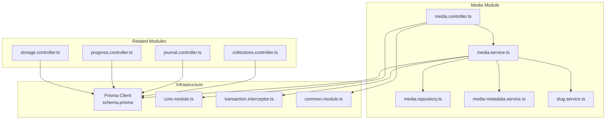
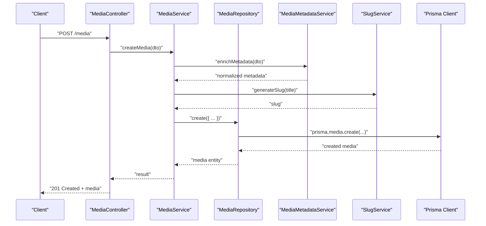
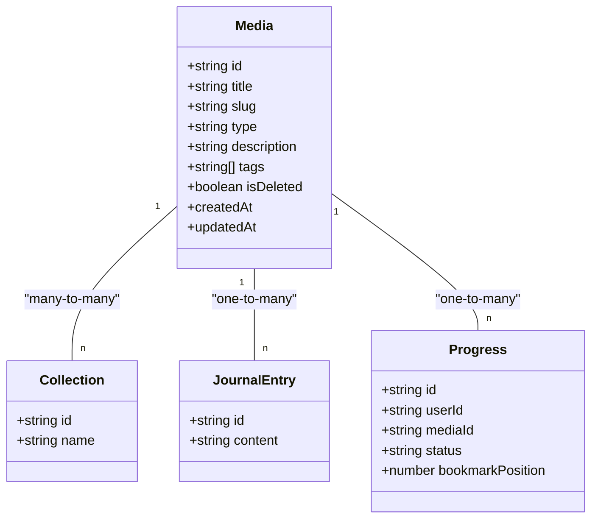
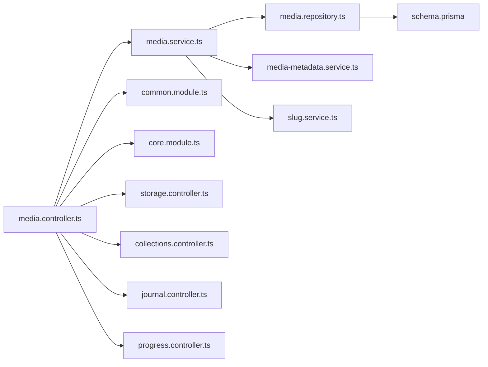

# Media CRUD Operations

<cite>
**Referenced Files in This Document**
- [media.controller.ts](file://apps/backend/src/media/media.controller.ts)
- [media.service.ts](file://apps/backend/src/media/media.service.ts)
- [media.repository.ts](file://apps/backend/src/media/media.repository.ts)
- [media.module.ts](file://apps/backend/src/media/media.module.ts)
- [media-metadata.service.ts](file://apps/backend/src/media/media-metadata.service.ts)
- [slug.service.ts](file://apps/backend/src/media/slug.service.ts)
- [collections.controller.ts](file://apps/backend/src/collections/collections.controller.ts)
- [journal.controller.ts](file://apps/backend/src/journal/journal.controller.ts)
- [progress.controller.ts](file://apps/backend/src/progress/progress.controller.ts)
- [storage.controller.ts](file://apps/backend/src/storage/storage.controller.ts)
- [schema.prisma](file://apps/backend/prisma/schema.prisma)
- [configuration.ts](file://apps/backend/src/config/configuration.ts)
- [env.validation.ts](file://apps/backend/src/config/env.validation.ts)
- [core.module.ts](file://apps/backend/src/core/core.module.ts)
- [transaction.interceptor.ts](file://apps/backend/src/core/transaction/transaction.interceptor.ts)
- [common.module.ts](file://apps/backend/src/common/common.module.ts)
</cite>

## Table of Contents
1. [Introduction](#introduction)
2. [Project Structure](#project-structure)
3. [Core Components](#core-components)
4. [Architecture Overview](#architecture-overview)
5. [Detailed Component Analysis](#detailed-component-analysis)
6. [Dependency Analysis](#dependency-analysis)
7. [Performance Considerations](#performance-considerations)
8. [Troubleshooting Guide](#troubleshooting-guide)
9. [Conclusion](#conclusion)

## Introduction
This document explains the end-to-end implementation of media CRUD operations: creating, reading, updating, and deleting media items. It covers the service layer with business logic validation, repository patterns for data access, controller endpoints for HTTP requests, DTO schemas for request/response validation, error handling strategies, transaction management, and relationships with collections, journal entries, and user progress tracking. Soft deletion patterns are also documented where applicable.

## Project Structure
The media feature is implemented as a NestJS module under apps/backend/src/media with dedicated files for controllers, services, repositories, DTOs, and utilities. Related modules include storage (for file uploads), collections, journal, and progress. The database schema is defined in Prisma under apps/backend/prisma/schema.prisma.

**Diagram sources**
- [media.controller.ts](file://apps/backend/src/media/media.controller.ts)
- [media.service.ts](file://apps/backend/src/media/media.service.ts)
- [media.repository.ts](file://apps/backend/src/media/media.repository.ts)
- [media-metadata.service.ts](file://apps/backend/src/media/media-metadata.service.ts)
- [slug.service.ts](file://apps/backend/src/media/slug.service.ts)
- [collections.controller.ts](file://apps/backend/src/collections/collections.controller.ts)
- [journal.controller.ts](file://apps/backend/src/journal/journal.controller.ts)
- [progress.controller.ts](file://apps/backend/src/progress/progress.controller.ts)
- [storage.controller.ts](file://apps/backend/src/storage/storage.controller.ts)
- [schema.prisma](file://apps/backend/prisma/schema.prisma)
- [core.module.ts](file://apps/backend/src/core/core.module.ts)
- [transaction.interceptor.ts](file://apps/backend/src/core/transaction/transaction.interceptor.ts)
- [common.module.ts](file://apps/backend/src/common/common.module.ts)

**Section sources**
- [media.module.ts](file://apps/backend/src/media/media.module.ts)
- [schema.prisma](file://apps/backend/prisma/schema.prisma)

## Core Components
- Controller: Exposes HTTP endpoints for media CRUD operations and integrates with authentication and response formatting.
- Service: Encapsulates business logic, validates inputs, orchestrates repository calls, handles transactions, and coordinates with metadata and slug generation.
- Repository: Provides data access abstractions over Prisma for media entities and related associations.
- Metadata Service: Handles enrichment and normalization of media metadata.
- Slug Service: Generates or validates slugs for media URLs.
- Storage Controller: Manages file uploads and signed URLs for media assets.
- Related Controllers: Collections, Journal, and Progress controllers manage relationships to media items.

Key responsibilities:
- Input validation via DTOs and pipes
- Business rule enforcement in the service layer
- Transactional writes using core transaction utilities
- Consistent error responses and status codes
- Soft delete support through repository methods

**Section sources**
- [media.controller.ts](file://apps/backend/src/media/media.controller.ts)
- [media.service.ts](file://apps/backend/src/media/media.service.ts)
- [media.repository.ts](file://apps/backend/src/media/media.repository.ts)
- [media-metadata.service.ts](file://apps/backend/src/media/media-metadata.service.ts)
- [slug.service.ts](file://apps/backend/src/media/slug.service.ts)
- [storage.controller.ts](file://apps/backend/src/storage/storage.controller.ts)

## Architecture Overview
The media subsystem follows a layered architecture:
- HTTP layer (controllers) receives requests, validates payloads, and delegates to services.
- Service layer enforces business rules, manages transactions, and coordinates repositories and auxiliary services.
- Repository layer abstracts database interactions via Prisma.
- Cross-cutting concerns (transactions, logging, pagination, exceptions) are provided by core and common modules.

**Diagram sources**
- [media.controller.ts](file://apps/backend/src/media/media.controller.ts)
- [media.service.ts](file://apps/backend/src/media/media.service.ts)
- [media.repository.ts](file://apps/backend/src/media/media.repository.ts)
- [media-metadata.service.ts](file://apps/backend/src/media/media-metadata.service.ts)
- [slug.service.ts](file://apps/backend/src/media/slug.service.ts)
- [schema.prisma](file://apps/backend/prisma/schema.prisma)

## Detailed Component Analysis

### Media Controller Endpoints
Responsibilities:
- Define routes for media CRUD: create, read, update, delete (soft delete).
- Validate request bodies using DTOs.
- Apply authentication guards and authorization decorators.
- Return standardized responses and handle errors consistently.

Typical endpoints:
- POST /media: Create new media entry
- GET /media/:id: Retrieve media details
- PATCH /media/:id: Update metadata
- DELETE /media/:id: Soft delete media

Integration points:
- Authentication and authorization from core/auth
- Response formatting from common/response
- Pagination and filtering from common/pagination

**Section sources**
- [media.controller.ts](file://apps/backend/src/media/media.controller.ts)
- [common.module.ts](file://apps/backend/src/common/common.module.ts)

### Media Service Layer
Responsibilities:
- Validate and normalize input DTOs
- Enforce business rules (e.g., required fields, uniqueness constraints)
- Coordinate metadata enrichment and slug generation
- Manage transactions for multi-step writes
- Handle soft delete semantics
- Interact with repository for persistence

Key behaviors:
- Create flow: validate DTO, enrich metadata, generate slug, persist via repository within a transaction
- Read flow: fetch by ID with relations, apply projections
- Update flow: partial updates with validation, preserve unchanged fields
- Delete flow: soft delete by toggling a flag and auditing changes

Transaction management:
- Uses core transaction utilities to wrap write operations ensuring atomicity and rollback on failure.

Error handling:
- Throws domain-specific exceptions mapped to HTTP status codes
- Returns consistent error structures for client consumption

**Section sources**
- [media.service.ts](file://apps/backend/src/media/media.service.ts)
- [core.module.ts](file://apps/backend/src/core/core.module.ts)
- [transaction.interceptor.ts](file://apps/backend/src/core/transaction/transaction.interceptor.ts)

### Media Repository Pattern
Responsibilities:
- Abstract Prisma queries for media entities
- Provide methods for create, find, update, soft delete, and list with filters
- Manage relations to collections, journal entries, and progress records
- Optimize queries with selective field projection and joins

Common operations:
- findById(id): returns media with optional relations
- findBySlug(slug): returns media by unique slug
- create(data): inserts new media record
- update(id, data): applies partial updates
- softDelete(id): sets deletedAt or isDeleted flag
- list(filters, pagination): returns paginated results

Relations:
- Many-to-one with users (ownership)
- Many-to-many with collections (grouping)
- One-to-one or many-to-one with journal entries (contextual notes)
- One-to-one or many-to-one with progress records (user progress per media)

**Section sources**
- [media.repository.ts](file://apps/backend/src/media/media.repository.ts)
- [schema.prisma](file://apps/backend/prisma/schema.prisma)

### DTO Schemas and Validation
Request DTOs:
- CreateMediaDto: title, description, type, sourceUrl, tags, etc.
- UpdateMediaDto: partial fields for metadata updates
- QueryMediaDto: filters, sorting, pagination parameters

Response DTOs:
- MediaResponseDto: normalized fields for API consumers
- MediaListResponseDto: paginated list with metadata

Validation strategy:
- Class-validator decorators enforce required fields, formats, and constraints
- Custom validators for business rules (e.g., unique slug, allowed types)
- Pipes transform and sanitize inputs before reaching service layer

**Section sources**
- [media.controller.ts](file://apps/backend/src/media/media.controller.ts)
- [media.service.ts](file://apps/backend/src/media/media.service.ts)

### Storage Integration
Responsibilities:
- Upload media files securely
- Generate signed URLs for secure access
- Handle image processing and thumbnails
- Clean up orphaned files on media deletion

Endpoints:
- POST /storage/upload: upload file and return asset info
- GET /storage/signed-url: generate temporary access URL

Integration:
- Media service associates uploaded assets with media records
- On soft delete, cleanup service removes associated files

**Section sources**
- [storage.controller.ts](file://apps/backend/src/storage/storage.controller.ts)

### Relationships Management
Collections:
- Media can belong to multiple collections
- Collections controller manages membership and smart collection rules

Journal:
- Journal entries can reference media for contextual storytelling
- Journal controller creates associations and retrieves linked media

Progress:
- User progress tracks completion, bookmarks, and timestamps per media
- Progress controller updates and queries progress states

**Diagram sources**
- [schema.prisma](file://apps/backend/prisma/schema.prisma)
- [collections.controller.ts](file://apps/backend/src/collections/collections.controller.ts)
- [journal.controller.ts](file://apps/backend/src/journal/journal.controller.ts)
- [progress.controller.ts](file://apps/backend/src/progress/progress.controller.ts)

**Section sources**
- [collections.controller.ts](file://apps/backend/src/collections/collections.controller.ts)
- [journal.controller.ts](file://apps/backend/src/journal/journal.controller.ts)
- [progress.controller.ts](file://apps/backend/src/progress/progress.controller.ts)
- [schema.prisma](file://apps/backend/prisma/schema.prisma)

### Soft Deletion Pattern
Implementation:
- Repository method sets a deleted flag and timestamp
- Queries exclude soft-deleted records by default
- Admin endpoints allow permanent deletion after retention period
- Cleanup jobs remove associated storage assets

Behavior:
- Soft delete preserves history and relationships
- Reversible until permanent deletion
- Auditing captures who performed the deletion and when

**Section sources**
- [media.repository.ts](file://apps/backend/src/media/media.repository.ts)
- [schema.prisma](file://apps/backend/prisma/schema.prisma)

### Transaction Management
Strategy:
- Write operations wrapped in transactions using core transaction utilities
- Ensures consistency across media creation, metadata updates, and relation assignments
- Rollback on any failure to prevent partial state

Usage:
- Service layer invokes transaction wrapper around multi-step operations
- Interceptors can enforce transaction boundaries at controller level if needed

**Section sources**
- [media.service.ts](file://apps/backend/src/media/media.service.ts)
- [transaction.interceptor.ts](file://apps/backend/src/core/transaction/transaction.interceptor.ts)
- [core.module.ts](file://apps/backend/src/core/core.module.ts)

## Dependency Analysis
The media module depends on:
- Prisma for data persistence
- Core modules for transactions, caching, and utilities
- Common modules for pagination, exceptions, and response formatting
- Storage module for file operations
- Related controllers for relationship management

**Diagram sources**
- [media.controller.ts](file://apps/backend/src/media/media.controller.ts)
- [media.service.ts](file://apps/backend/src/media/media.service.ts)
- [media.repository.ts](file://apps/backend/src/media/media.repository.ts)
- [media-metadata.service.ts](file://apps/backend/src/media/media-metadata.service.ts)
- [slug.service.ts](file://apps/backend/src/media/slug.service.ts)
- [schema.prisma](file://apps/backend/prisma/schema.prisma)
- [common.module.ts](file://apps/backend/src/common/common.module.ts)
- [core.module.ts](file://apps/backend/src/core/core.module.ts)
- [storage.controller.ts](file://apps/backend/src/storage/storage.controller.ts)
- [collections.controller.ts](file://apps/backend/src/collections/collections.controller.ts)
- [journal.controller.ts](file://apps/backend/src/journal/journal.controller.ts)
- [progress.controller.ts](file://apps/backend/src/progress/progress.controller.ts)

**Section sources**
- [media.module.ts](file://apps/backend/src/media/media.module.ts)
- [configuration.ts](file://apps/backend/src/config/configuration.ts)
- [env.validation.ts](file://apps/backend/src/config/env.validation.ts)

## Performance Considerations
- Use selective field projection in repository queries to reduce payload size
- Implement caching for frequently accessed media details
- Paginate large lists with cursor-based pagination
- Index frequently queried fields (title, slug, tags)
- Batch operations for bulk updates or deletions
- Offload heavy metadata processing to background jobs

[No sources needed since this section provides general guidance]

## Troubleshooting Guide
Common issues:
- Validation errors: Check DTO decorators and custom validators
- Unique constraint violations: Ensure slug uniqueness and proper conflict handling
- Relationship integrity: Verify foreign key constraints and cascade rules
- Transaction failures: Inspect logs for rollback reasons and nested transaction conflicts
- Storage errors: Validate upload permissions and signed URL expiration

Debugging tips:
- Enable detailed logging in development
- Use Prisma query logs to inspect SQL statements
- Validate environment variables and configuration settings
- Test with sample DTOs and expected edge cases

**Section sources**
- [media.service.ts](file://apps/backend/src/media/media.service.ts)
- [media.repository.ts](file://apps/backend/src/media/media.repository.ts)
- [configuration.ts](file://apps/backend/src/config/configuration.ts)
- [env.validation.ts](file://apps/backend/src/config/env.validation.ts)

## Conclusion
The media CRUD system implements a robust, layered architecture with clear separation of concerns. The service layer encapsulates business logic and transaction management, while the repository pattern abstracts data access. DTOs ensure consistent validation, and relationships with collections, journal entries, and progress are well-defined. Soft deletion and storage integration provide flexibility and reliability. Following the patterns outlined here ensures maintainability and scalability for media management features.

[No sources needed since this section summarizes without analyzing specific files]