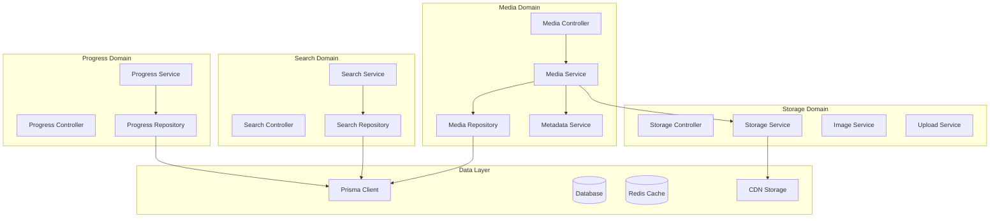
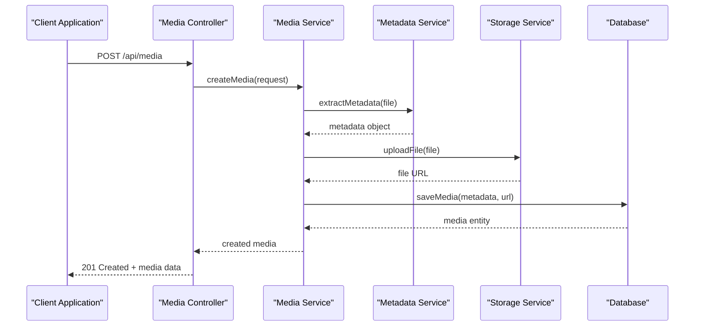
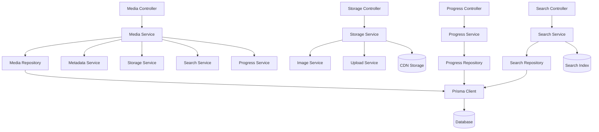

# Media Management System

<cite>
**Referenced Files in This Document**
- [media.service.ts](file://apps/backend/src/media/media.service.ts)
- [media.controller.ts](file://apps/backend/src/media/media.controller.ts)
- [media.repository.ts](file://apps/backend/src/media/media.repository.ts)
- [media-metadata.service.ts](file://apps/backend/src/media/media-metadata.service.ts)
- [storage.service.ts](file://apps/backend/src/storage/storage.service.ts)
- [image.service.ts](file://apps/backend/src/storage/image.service.ts)
- [upload.service.ts](file://apps/backend/src/storage/upload.service.ts)
- [search.service.ts](file://apps/backend/src/search/search.service.ts)
- [progress.service.ts](file://apps/backend/src/progress/progress.service.ts)
- [schema.prisma](file://apps/backend/prisma/schema.prisma)
</cite>

## Table of Contents
1. [Introduction](#introduction)
2. [Project Structure](#project-structure)
3. [Core Components](#core-components)
4. [Architecture Overview](#architecture-overview)
5. [Detailed Component Analysis](#detailed-component-analysis)
6. [Dependency Analysis](#dependency-analysis)
7. [Performance Considerations](#performance-considerations)
8. [Troubleshooting Guide](#troubleshooting-guide)
9. [Conclusion](#conclusion)

## Introduction

The Media Management System is a comprehensive backend solution designed to handle CRUD operations for various media types including movies, TV shows, books, and other content formats. The system provides robust metadata extraction capabilities, image processing and optimization, file upload handling, CDN integration, advanced search functionality, and media relationship management with progress tracking and completion status.

## Project Structure

The media management system follows a modular NestJS architecture with clear separation of concerns across different domains:

**Diagram sources**
- [media.controller.ts](file://apps/backend/src/media/media.controller.ts)
- [storage.controller.ts](file://apps/backend/src/storage/storage.controller.ts)
- [search.controller.ts](file://apps/backend/src/search/search.controller.ts)
- [progress.controller.ts](file://apps/backend/src/progress/progress.controller.ts)

**Section sources**
- [app.module.ts](file://apps/backend/src/app.module.ts)
- [schema.prisma](file://apps/backend/prisma/schema.prisma)

## Core Components

### Media Management Service

The core media service handles all CRUD operations for different media types (movies, TV shows, books, etc.). It manages media lifecycle, metadata extraction, and relationships between different media entities.

### Storage and Upload Service

The storage service provides unified access to various storage backends including local filesystem, cloud storage providers, and CDN services. It handles file validation, format conversion, and optimized delivery.

### Search Service

The search service implements full-text search capabilities with advanced filtering options, autocomplete suggestions, and recommendation algorithms based on user preferences and viewing history.

### Progress Tracking Service

The progress service manages user interaction with media content, tracking completion status, reading/watching progress, bookmarks, and personal ratings.

**Section sources**
- [media.service.ts](file://apps/backend/src/media/media.service.ts)
- [storage.service.ts](file://apps/backend/src/storage/storage.service.ts)
- [search.service.ts](file://apps/backend/src/search/search.service.ts)
- [progress.service.ts](file://apps/backend/src/progress/progress.service.ts)

## Architecture Overview

The system follows a layered architecture pattern with clear separation between presentation, business logic, and data access layers:

**Diagram sources**
- [media.controller.ts](file://apps/backend/src/media/media.controller.ts)
- [media.service.ts](file://apps/backend/src/media/media.service.ts)
- [media-metadata.service.ts](file://apps/backend/src/media/media-metadata.service.ts)
- [storage.service.ts](file://apps/backend/src/storage/storage.service.ts)

## Detailed Component Analysis

### Media CRUD Operations

The media management system supports comprehensive CRUD operations for multiple media types through a unified interface:

#### Create Operations
- **Media Creation**: Supports creating new media entries with automatic metadata extraction
- **Bulk Import**: Handles batch processing of media files with error handling and rollback capabilities
- **Relationship Mapping**: Establishes connections between related media items (series, franchises, adaptations)

#### Read Operations
- **Single Media Retrieval**: Fetches individual media items with full metadata and relationships
- **List Operations**: Provides paginated lists with filtering, sorting, and search capabilities
- **Statistics Aggregation**: Calculates library statistics and user engagement metrics

#### Update Operations
- **Metadata Updates**: Allows manual correction and enhancement of extracted metadata
- **Status Management**: Updates media status (planning, in-progress, completed, dropped)
- **Relationship Updates**: Manages connections between related media items

#### Delete Operations
- **Soft Deletes**: Implements soft deletion with archive capabilities
- **Cascade Operations**: Handles cleanup of related data and references
- **Backup Integration**: Ensures data backup before permanent deletion

**Section sources**
- [media.service.ts](file://apps/backend/src/media/media.service.ts)
- [media.repository.ts](file://apps/backend/src/media/media.repository.ts)

### Metadata Extraction System

The metadata extraction system automatically processes media files to extract relevant information:

#### Source Integration
- **TMDB Integration**: Fetches movie and TV show metadata from The Movie Database API
- **Open Library API**: Retrieves book information including author details and summaries
- **Custom Scrapers**: Handles specific formats and sources with dedicated parsers

#### Processing Pipeline
- **File Analysis**: Analyzes uploaded files to determine type and extract basic metadata
- **External API Calls**: Queries external services for enriched metadata
- **Data Normalization**: Standardizes metadata across different sources and formats
- **Validation**: Ensures data integrity and completeness

**Section sources**
- [media-metadata.service.ts](file://apps/backend/src/media/media-metadata.service.ts)

### Image Processing and Optimization

The image processing pipeline handles poster images, thumbnails, and cover art:

#### Processing Features
- **Format Conversion**: Converts images to optimal web formats (WebP, AVIF)
- **Size Optimization**: Generates multiple sizes for responsive design
- **Quality Adjustment**: Balances file size with visual quality
- **Caching Strategy**: Implements intelligent caching for processed images

#### CDN Integration
- **Multi-Provider Support**: Works with various CDN providers (CloudFront, Cloudflare, etc.)
- **Cache Invalidation**: Automatic cache busting when images are updated
- **Fallback Handling**: Graceful degradation when CDN is unavailable

**Section sources**
- [image.service.ts](file://apps/backend/src/storage/image.service.ts)
- [storage.service.ts](file://apps/backend/src/storage/storage.service.ts)

### File Upload Handling

The upload system provides secure and efficient file handling:

#### Upload Process
- **Chunked Uploads**: Supports large file uploads with resume capability
- **Validation**: Validates file types, sizes, and content security
- **Processing Queue**: Asynchronous processing for non-blocking uploads
- **Error Recovery**: Handles network failures and partial uploads

#### Security Measures
- **File Type Validation**: Prevents malicious file uploads
- **Content Scanning**: Virus and malware scanning integration
- **Access Control**: User-based permissions for file operations
- **Audit Logging**: Tracks all file operations for security compliance

**Section sources**
- [upload.service.ts](file://apps/backend/src/storage/upload.service.ts)
- [storage.service.ts](file://apps/backend/src/storage/storage.service.ts)

### Search Functionality

The search system provides powerful discovery capabilities:

#### Full-Text Search
- **Index Management**: Maintains searchable indexes for fast queries
- **Fuzzy Matching**: Handles typos and partial matches
- **Faceted Search**: Supports filtering by genre, year, rating, and custom tags
- **Highlighting**: Shows matching text in search results

#### Recommendation Engine
- **Collaborative Filtering**: Recommends based on similar user preferences
- **Content-Based**: Suggests items similar to watched/read content
- **Trending Analysis**: Identifies popular and rising content
- **Personalization**: Adapts recommendations based on user behavior

**Section sources**
- [search.service.ts](file://apps/backend/src/search/search.service.ts)
- [search.repository.ts](file://apps/backend/src/search/search.repository.ts)

### Progress Tracking and Completion Status

The progress system tracks user engagement with media content:

#### Progress Types
- **Reading Progress**: For books and articles with page/chapter tracking
- **Watching Progress**: For movies and TV shows with episode/scene tracking
- **Completion Status**: Overall status (not started, in progress, completed, dropped)
- **Time Tracking**: Records time spent on each media item

#### Statistics and Analytics
- **Reading/Watching Stats**: Total hours, pages, episodes tracked
- **Achievement System**: Unlocks badges and milestones
- **Streak Tracking**: Encourages consistent usage habits
- **Export Capabilities**: Download progress data for external analysis

**Section sources**
- [progress.service.ts](file://apps/backend/src/progress/progress.service.ts)
- [progress.repository.ts](file://apps/backend/src/progress/progress.repository.ts)

## Dependency Analysis

The system has well-defined dependencies between components:

**Diagram sources**
- [media.controller.ts](file://apps/backend/src/media/media.controller.ts)
- [storage.controller.ts](file://apps/backend/src/storage/storage.controller.ts)
- [search.controller.ts](file://apps/backend/src/search/search.controller.ts)
- [progress.controller.ts](file://apps/backend/src/progress/progress.controller.ts)

**Section sources**
- [media.module.ts](file://apps/backend/src/media/media.module.ts)
- [storage.module.ts](file://apps/backend/src/storage/storage.module.ts)
- [search.module.ts](file://apps/backend/src/search/search.module.ts)
- [progress.module.ts](file://apps/backend/src/progress/progress.module.ts)

## Performance Considerations

### Database Optimization
- **Query Optimization**: Uses efficient Prisma queries with proper indexing
- **Connection Pooling**: Optimizes database connection management
- **Caching Strategy**: Implements Redis caching for frequently accessed data
- **Pagination**: Supports cursor-based pagination for large datasets

### Storage Optimization
- **Lazy Loading**: Loads media metadata and images on demand
- **Compression**: Applies appropriate compression for different file types
- **CDN Caching**: Leverages CDN edge caching for global performance
- **Batch Operations**: Groups database operations to reduce round trips

### Memory Management
- **Stream Processing**: Handles large files without loading entire content into memory
- **Garbage Collection**: Proper cleanup of temporary files and resources
- **Memory Limits**: Configurable limits to prevent memory exhaustion

## Troubleshooting Guide

### Common Issues and Solutions

#### Upload Failures
- **Network Timeouts**: Implement retry logic with exponential backoff
- **File Size Limits**: Configure appropriate upload limits per file type
- **Permission Errors**: Verify storage backend credentials and permissions

#### Metadata Extraction Problems
- **API Rate Limits**: Implement caching and rate limiting for external APIs
- **Invalid Data**: Add fallback mechanisms and manual override options
- **Encoding Issues**: Handle different character encodings properly

#### Search Performance
- **Index Corruption**: Regular index rebuilding and validation
- **Slow Queries**: Monitor query performance and optimize indexes
- **Memory Usage**: Tune search engine configuration for available resources

**Section sources**
- [media.service.spec.ts](file://apps/backend/src/media/media.service.spec.ts)
- [storage.service.spec.ts](file://apps/backend/src/storage/storage.service.spec.ts)
- [search.service.spec.ts](file://apps/backend/src/search/search.service.spec.ts)
- [progress.service.spec.ts](file://apps/backend/src/progress/progress.service.spec.ts)

## Conclusion

The Media Management System provides a comprehensive solution for managing diverse media content with robust features for metadata extraction, file handling, search capabilities, and progress tracking. The modular architecture ensures scalability and maintainability while providing excellent performance through caching, CDN integration, and optimized database queries.

The system's design emphasizes flexibility through support for multiple storage backends, extensible metadata sources, and configurable search algorithms. The progress tracking and recommendation systems enable personalized user experiences while maintaining data privacy and security standards.

Future enhancements could include AI-powered content analysis, real-time collaboration features, and advanced analytics dashboards for content creators and administrators.