# Media Relationships & Progress Tracking

<cite>
**Referenced Files in This Document**
- [schema.prisma](file://apps/backend/prisma/schema.prisma)
- [media.service.ts](file://apps/backend/src/media/media.service.ts)
- [media.repository.ts](file://apps/backend/src/media/media.repository.ts)
- [collections.service.ts](file://apps/backend/src/collections/collections.service.ts)
- [collections.controller.ts](file://apps/backend/src/collections/collections.controller.ts)
- [progress.service.ts](file://apps/backend/src/progress/progress.service.ts)
- [progress.repository.ts](file://apps/backend/src/progress/progress.repository.ts)
- [progress-calculation.service.ts](file://apps/backend/src/progress/progress-calculation.service.ts)
- [progress-event.service.ts](file://apps/backend/src/progress/progress-event.service.ts)
- [analytics.service.ts](file://apps/backend/src/analytics/analytics.service.ts)
- [streak.service.ts](file://apps/backend/src/analytics/streak.service.ts)
- [dashboard.service.ts](file://apps/backend/src/analytics/dashboard.service.ts)
- [library.service.ts](file://apps/backend/src/library/library.service.ts)
- [franchiseEngine.ts](file://src/lib/franchiseEngine.ts)
- [collectionRelationships.ts](file://src/lib/collectionRelationships.ts)
- [mediaGraph.ts](file://src/lib/mediaGraph.ts)
- [ProgressLogger.tsx](file://src/components/media/ProgressLogger.tsx)
- [CollectionAchievements.tsx](file://src/components/collections/CollectionAchievements.tsx)
- [MemoryMilestones.tsx](file://src/components/memory/MemoryMilestones.tsx)
</cite>

## Table of Contents
1. [Introduction](#introduction)
2. [Project Structure](#project-structure)
3. [Core Components](#core-components)
4. [Architecture Overview](#architecture-overview)
5. [Detailed Component Analysis](#detailed-component-analysis)
6. [Dependency Analysis](#dependency-analysis)
7. [Performance Considerations](#performance-considerations)
8. [Troubleshooting Guide](#troubleshooting-guide)
9. [Conclusion](#conclusion)

## Introduction
This document explains how the system models relationships between media items and tracks user progress across different content types (movies, TV shows, books, games). It covers bidirectional relationships with collections and franchises, automated progress calculations, milestone and achievement systems, visualization components, sync mechanisms, historical data management, and conflict resolution for concurrent updates.

## Project Structure
The backend organizes domain logic into modules:
- Media module: metadata, slugs, and media-specific services
- Collections module: collection CRUD, statistics, events, and smart collections
- Progress module: per-user progress records, calculation engine, event handling, and repository access
- Analytics module: streaks, dashboards, and aggregated insights
- Library module: library-level queries and statistics
- Prisma schema defines entities and relationships

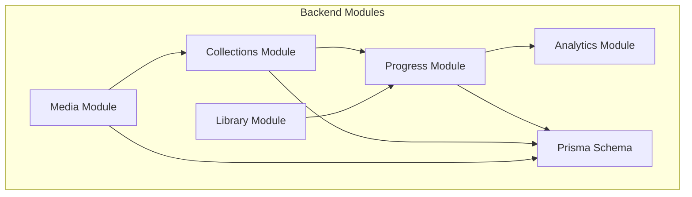

**Diagram sources**
- [media.service.ts](file://apps/backend/src/media/media.service.ts)
- [collections.service.ts](file://apps/backend/src/collections/collections.service.ts)
- [progress.service.ts](file://apps/backend/src/progress/progress.service.ts)
- [analytics.service.ts](file://apps/backend/src/analytics/analytics.service.ts)
- [library.service.ts](file://apps/backend/src/library/library.service.ts)
- [schema.prisma](file://apps/backend/prisma/schema.prisma)

**Section sources**
- [schema.prisma](file://apps/backend/prisma/schema.prisma)
- [media.service.ts](file://apps/backend/src/media/media.service.ts)
- [collections.service.ts](file://apps/backend/src/collections/collections.service.ts)
- [progress.service.ts](file://apps/backend/src/progress/progress.service.ts)
- [analytics.service.ts](file://apps/backend/src/analytics/analytics.service.ts)
- [library.service.ts](file://apps/backend/src/library/library.service.ts)

## Core Components
- Media service and repository manage media metadata and relationships to collections and franchises.
- Collections service handles membership, smart rules, and statistics.
- Progress service manages per-user progress records, calculations, and events.
- Analytics services compute streaks, dashboard metrics, and aggregated insights.
- Library service provides high-level queries over media and progress.

Key responsibilities:
- Bidirectional links between media and collections via join tables or relations
- Franchise grouping and timeline views
- Per-item progress tracking with type-specific fields
- Automated calculation of completion percentages and episode/book chapter progress
- Milestone and achievement triggers based on progress thresholds

**Section sources**
- [media.service.ts](file://apps/backend/src/media/media.service.ts)
- [collections.service.ts](file://apps/backend/src/collections/collections.service.ts)
- [progress.service.ts](file://apps/backend/src/progress/progress.service.ts)
- [progress-calculation.service.ts](file://apps/backend/src/progress/progress-calculation.service.ts)
- [analytics.service.ts](file://apps/backend/src/analytics/analytics.service.ts)
- [library.service.ts](file://apps/backend/src/library/library.service.ts)

## Architecture Overview
The system uses a layered architecture:
- API controllers expose endpoints for media, collections, progress, and analytics
- Services implement business logic and orchestrate repositories
- Repositories interact with Prisma ORM against the database
- Events are emitted for progress changes to drive analytics and notifications
- Frontend components visualize progress and achievements

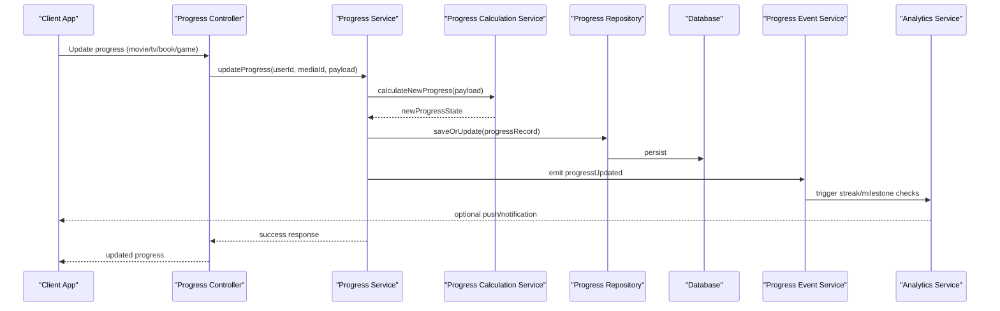

**Diagram sources**
- [progress.service.ts](file://apps/backend/src/progress/progress.service.ts)
- [progress-calculation.service.ts](file://apps/backend/src/progress/progress-calculation.service.ts)
- [progress.repository.ts](file://apps/backend/src/progress/progress.repository.ts)
- [progress-event.service.ts](file://apps/backend/src/progress/progress-event.service.ts)
- [analytics.service.ts](file://apps/backend/src/analytics/analytics.service.ts)

## Detailed Component Analysis

### Data Model and Relationships
The Prisma schema defines core entities and relationships:
- Media: title, type, franchiseId, timestamps
- Collections: name, ownerUserId, rules, timestamps
- CollectionMembers: join table linking media and collections
- UserProgress: per-user progress per media with type-specific fields
- Franchises: grouped media sets with ordering and metadata

Bidirectional relationships:
- Media <-> Collections via CollectionMembers
- Media -> Franchises (grouping)
- UserProgress -> Media (per-user state)

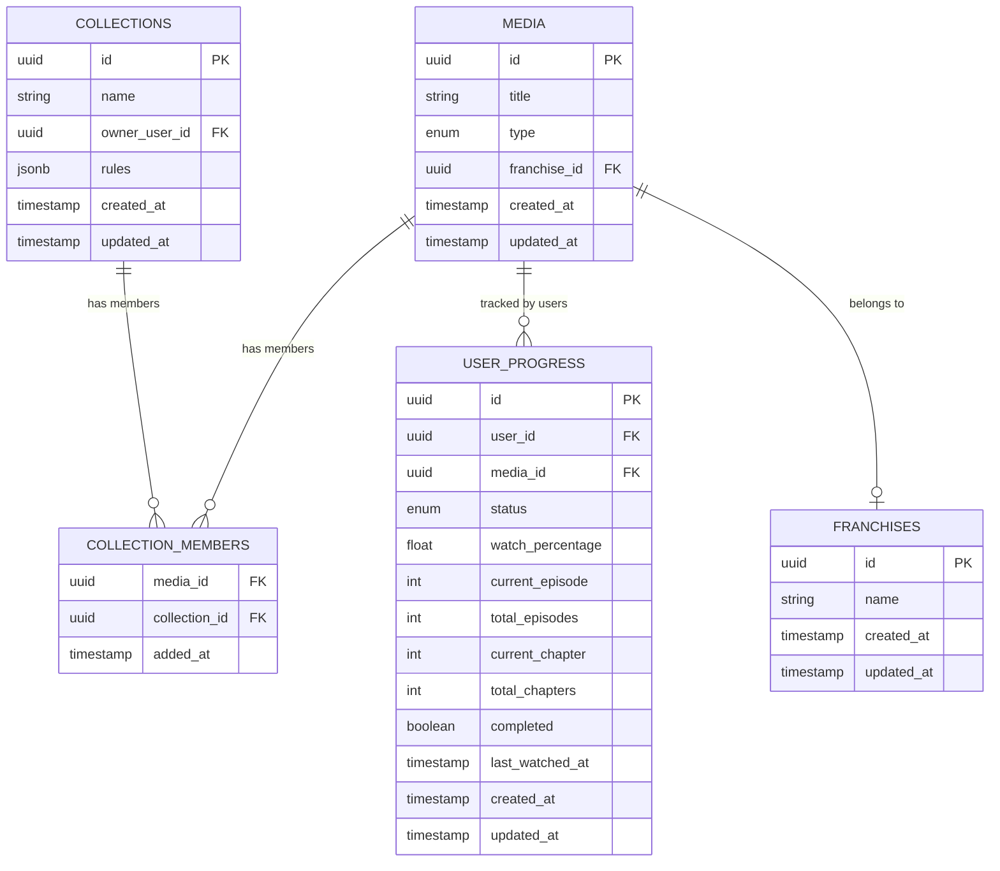

**Diagram sources**
- [schema.prisma](file://apps/backend/prisma/schema.prisma)

**Section sources**
- [schema.prisma](file://apps/backend/prisma/schema.prisma)

### Media Relationships Management
- Media service exposes methods to link/unlink media to/from collections and assign franchises.
- Collections service validates membership rules and maintains statistics.
- Bidirectional updates ensure both sides reflect changes (e.g., adding media to a collection updates collection member list and media’s collection references).

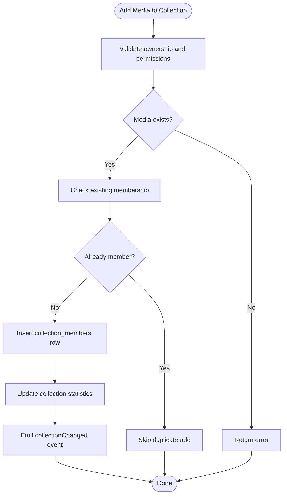

**Diagram sources**
- [collections.service.ts](file://apps/backend/src/collections/collections.service.ts)
- [media.service.ts](file://apps/backend/src/media/media.service.ts)

**Section sources**
- [collections.service.ts](file://apps/backend/src/collections/collections.service.ts)
- [media.service.ts](file://apps/backend/src/media/media.service.ts)

### Progress Tracking Systems
Per-type progress fields:
- Movies: watchPercentage, lastWatchedAt, completed
- TV Shows: currentEpisode, totalEpisodes, completed, lastWatchedAt
- Books: currentChapter, totalChapters, completed, lastReadAt
- Games: completionStatus, milestonesCompleted, lastPlayedAt

Automated calculations:
- Watch percentage computed from playback events or manual updates
- Episode progress derived from episode index vs total episodes
- Chapter progress mapped to book chapters
- Game completion status aggregates milestone completions

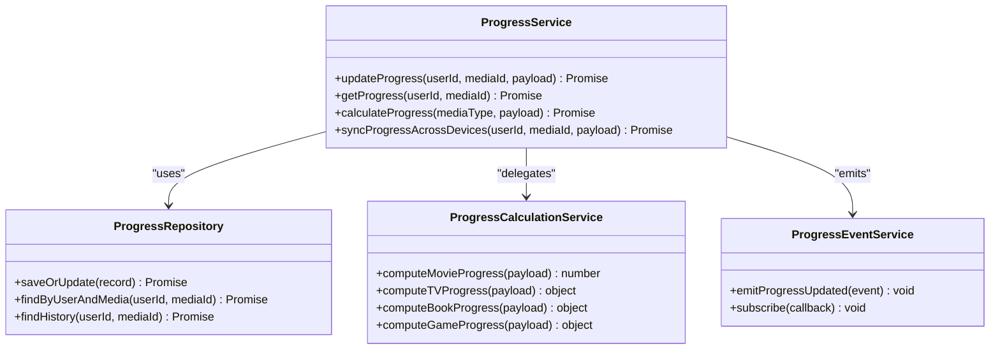

**Diagram sources**
- [progress.service.ts](file://apps/backend/src/progress/progress.service.ts)
- [progress.repository.ts](file://apps/backend/src/progress/progress.repository.ts)
- [progress-calculation.service.ts](file://apps/backend/src/progress/progress-calculation.service.ts)
- [progress-event.service.ts](file://apps/backend/src/progress/progress-event.service.ts)

**Section sources**
- [progress.service.ts](file://apps/backend/src/progress/progress.service.ts)
- [progress.repository.ts](file://apps/backend/src/progress/progress.repository.ts)
- [progress-calculation.service.ts](file://apps/backend/src/progress/progress-calculation.service.ts)
- [progress-event.service.ts](file://apps/backend/src/progress/progress-event.service.ts)

### Milestone Tracking and Achievements
- Milestones are triggered when progress crosses thresholds (e.g., 25%, 50%, 75%, 100%)
- Achievements aggregate cross-media accomplishments (e.g., “Binged 10 TV series”)
- Streaks track consecutive days of activity
- Dashboard surfaces recent milestones and achievements

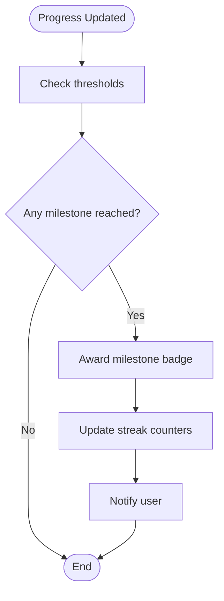

**Diagram sources**
- [analytics.service.ts](file://apps/backend/src/analytics/analytics.service.ts)
- [streak.service.ts](file://apps/backend/src/analytics/streak.service.ts)
- [dashboard.service.ts](file://apps/backend/src/analytics/dashboard.service.ts)

**Section sources**
- [analytics.service.ts](file://apps/backend/src/analytics/analytics.service.ts)
- [streak.service.ts](file://apps/backend/src/analytics/streak.service.ts)
- [dashboard.service.ts](file://apps/backend/src/analytics/dashboard.service.ts)

### Progress Visualization Components
Frontend components render progress bars, episode lists, chapter trackers, and achievement badges:
- ProgressLogger: logs and displays per-session progress
- CollectionAchievements: shows collection-based achievements
- MemoryMilestones: highlights key milestones across media history

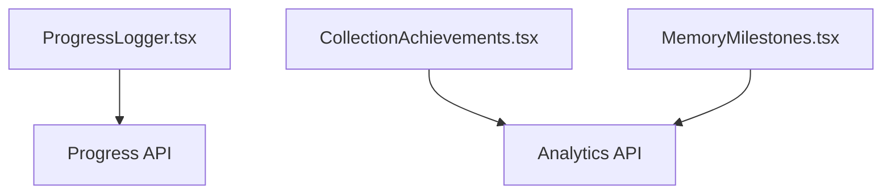

**Diagram sources**
- [ProgressLogger.tsx](file://src/components/media/ProgressLogger.tsx)
- [CollectionAchievements.tsx](file://src/components/collections/CollectionAchievements.tsx)
- [MemoryMilestones.tsx](file://src/components/memory/MemoryMilestones.tsx)
- [analytics.service.ts](file://apps/backend/src/analytics/analytics.service.ts)

**Section sources**
- [ProgressLogger.tsx](file://src/components/media/ProgressLogger.tsx)
- [CollectionAchievements.tsx](file://src/components/collections/CollectionAchievements.tsx)
- [MemoryMilestones.tsx](file://src/components/memory/MemoryMilestones.tsx)

### Historical Progress Data Management
- History is stored per user per media item with timestamps
- Queries support time-range filtering and aggregation
- Retention policies allow archiving old entries while preserving summaries

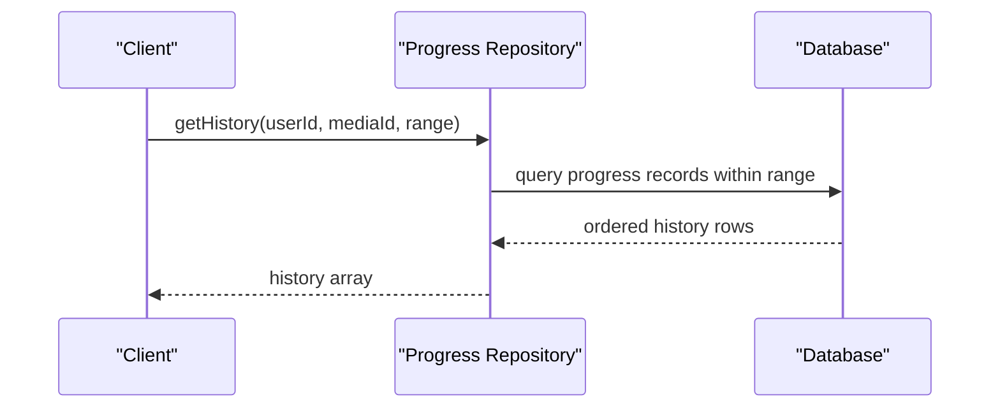

**Diagram sources**
- [progress.repository.ts](file://apps/backend/src/progress/progress.repository.ts)

**Section sources**
- [progress.repository.ts](file://apps/backend/src/progress/progress.repository.ts)

### Sync Mechanisms Across Devices
- Idempotent updates prevent duplicate processing
- Conflict resolution uses last-write-wins with versioning or timestamps
- Background jobs reconcile discrepancies and merge partial progress

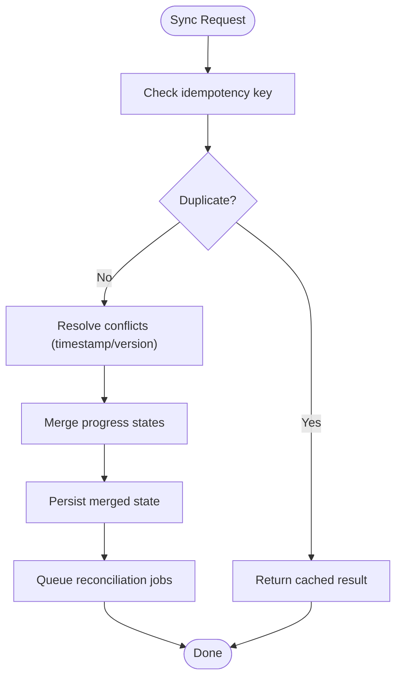

**Diagram sources**
- [progress.service.ts](file://apps/backend/src/progress/progress.service.ts)
- [progress.repository.ts](file://apps/backend/src/progress/progress.repository.ts)

**Section sources**
- [progress.service.ts](file://apps/backend/src/progress/progress.service.ts)
- [progress.repository.ts](file://apps/backend/src/progress/progress.repository.ts)

### Franchise and Related Content Navigation
- Franchise engine groups related media and builds timelines
- Collection relationships enable cross-linking and discovery
- Media graph supports recommendation and continuity features

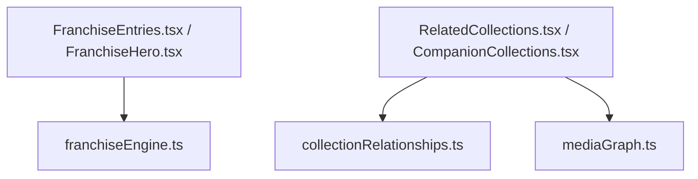

**Diagram sources**
- [franchiseEngine.ts](file://src/lib/franchiseEngine.ts)
- [collectionRelationships.ts](file://src/lib/collectionRelationships.ts)
- [mediaGraph.ts](file://src/lib/mediaGraph.ts)

**Section sources**
- [franchiseEngine.ts](file://src/lib/franchiseEngine.ts)
- [collectionRelationships.ts](file://src/lib/collectionRelationships.ts)
- [mediaGraph.ts](file://src/lib/mediaGraph.ts)

## Dependency Analysis
Module dependencies and coupling:
- Progress depends on repository and calculation services
- Collections depend on media and progress for statistics
- Analytics depends on progress events and streaks
- Library depends on media and progress for aggregated views

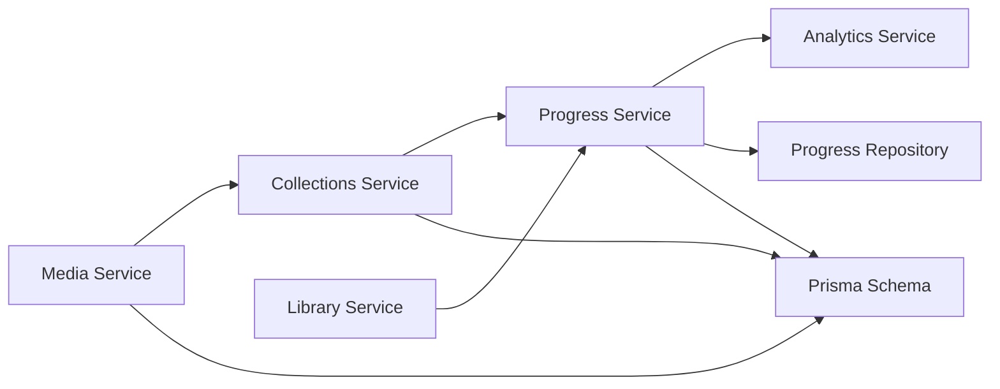

**Diagram sources**
- [media.service.ts](file://apps/backend/src/media/media.service.ts)
- [collections.service.ts](file://apps/backend/src/collections/collections.service.ts)
- [progress.service.ts](file://apps/backend/src/progress/progress.service.ts)
- [analytics.service.ts](file://apps/backend/src/analytics/analytics.service.ts)
- [library.service.ts](file://apps/backend/src/library/library.service.ts)
- [progress.repository.ts](file://apps/backend/src/progress/progress.repository.ts)
- [schema.prisma](file://apps/backend/prisma/schema.prisma)

**Section sources**
- [media.service.ts](file://apps/backend/src/media/media.service.ts)
- [collections.service.ts](file://apps/backend/src/collections/collections.service.ts)
- [progress.service.ts](file://apps/backend/src/progress/progress.service.ts)
- [analytics.service.ts](file://apps/backend/src/analytics/analytics.service.ts)
- [library.service.ts](file://apps/backend/src/library/library.service.ts)
- [progress.repository.ts](file://apps/backend/src/progress/progress.repository.ts)
- [schema.prisma](file://apps/backend/prisma/schema.prisma)

## Performance Considerations
- Batch updates for bulk progress changes reduce database round-trips
- Indexes on userId and mediaId improve lookup performance
- Caching frequently accessed statistics and dashboards
- Asynchronous event processing decouples heavy computations
- Pagination for large histories and collection memberships

[No sources needed since this section provides general guidance]

## Troubleshooting Guide
Common issues and resolutions:
- Duplicate progress entries: verify idempotency keys and deduplication logic
- Inconsistent collection membership: re-run membership validation and statistics refresh
- Streak miscalculations: check timezone handling and daily boundaries
- Sync conflicts: inspect versioning and last-write-wins strategy

**Section sources**
- [progress.service.ts](file://apps/backend/src/progress/progress.service.ts)
- [collections.service.ts](file://apps/backend/src/collections/collections.service.ts)
- [streak.service.ts](file://apps/backend/src/analytics/streak.service.ts)

## Conclusion
The system provides robust modeling of media relationships and comprehensive progress tracking across multiple content types. Bidirectional relationships with collections and franchises enable rich navigation and discovery. Automated calculations, milestone tracking, and visualization components deliver a cohesive user experience. Sync mechanisms and conflict resolution ensure consistency across devices, while historical data management supports long-term insights and analytics.