# Metadata Extraction & Processing

<cite>
**Referenced Files in This Document**
- [media-metadata.service.ts](file://apps/backend/src/media/media-metadata.service.ts)
- [media.service.ts](file://apps/backend/src/media/media.service.ts)
- [media.controller.ts](file://apps/backend/src/media/media.controller.ts)
- [media.repository.ts](file://apps/backend/src/media/media.repository.ts)
- [slug.service.ts](file://apps/backend/src/media/slug.service.ts)
- [configuration.ts](file://apps/backend/src/config/configuration.ts)
- [env.validation.ts](file://apps/backend/src/config/env.validation.ts)
- [cache.service.ts](file://apps/backend/src/hardening/cache.service.ts)
- [rate-limit-audit.service.ts](file://apps/backend/src/hardening/rate-limit-audit.service.ts)
- [redis.service.ts](file://apps/backend/src/redis/redis.service.ts)
- [image.service.ts](file://apps/backend/src/storage/image.service.ts)
- [media.module.ts](file://apps/backend/src/media/media.module.ts)
</cite>

## Table of Contents
1. [Introduction](#introduction)
2. [Project Structure](#project-structure)
3. [Core Components](#core-components)
4. [Architecture Overview](#architecture-overview)
5. [Detailed Component Analysis](#detailed-component-analysis)
6. [Dependency Analysis](#dependency-analysis)
7. [Performance Considerations](#performance-considerations)
8. [Troubleshooting Guide](#troubleshooting-guide)
9. [Conclusion](#conclusion)

## Introduction
This document explains the metadata extraction system that automatically retrieves information from external sources such as TMDB API, book databases, and custom scrapers. It covers the service architecture for handling different media types (movies, TV shows, books, games), data normalization processes, caching strategies, slug generation algorithms, title standardization, genre classification, error handling with fallback mechanisms, manual override capabilities, rate limiting considerations, and API key management for external services.

## Project Structure
The metadata extraction functionality is primarily implemented within the backend NestJS application under the media module. Key responsibilities include:
- Orchestrating metadata retrieval from multiple providers
- Normalizing and enriching media records
- Generating slugs and standardizing titles
- Caching results to reduce external calls
- Managing configuration and environment variables for API keys
- Integrating with storage services for poster images

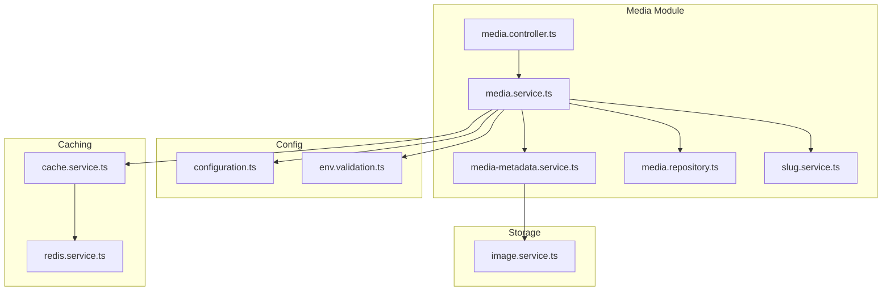

**Diagram sources**
- [media.controller.ts](file://apps/backend/src/media/media.controller.ts)
- [media.service.ts](file://apps/backend/src/media/media.service.ts)
- [media-metadata.service.ts](file://apps/backend/src/media/media-metadata.service.ts)
- [media.repository.ts](file://apps/backend/src/media/media.repository.ts)
- [slug.service.ts](file://apps/backend/src/media/slug.service.ts)
- [configuration.ts](file://apps/backend/src/config/configuration.ts)
- [env.validation.ts](file://apps/backend/src/config/env.validation.ts)
- [cache.service.ts](file://apps/backend/src/hardening/cache.service.ts)
- [redis.service.ts](file://apps/backend/src/redis/redis.service.ts)
- [image.service.ts](file://apps/backend/src/storage/image.service.ts)

**Section sources**
- [media.module.ts](file://apps/backend/src/media/media.module.ts)

## Core Components
- Media Controller: Exposes endpoints to trigger metadata extraction and updates.
- Media Service: Coordinates extraction workflows, handles fallbacks, and persists normalized data.
- Metadata Service: Implements provider-specific logic for TMDB, book databases, and custom scrapers; normalizes responses into a unified schema.
- Slug Service: Generates URL-friendly slugs from standardized titles.
- Cache Service: Provides in-memory or Redis-backed caching for extracted metadata.
- Image Service: Downloads and stores posters/artwork associated with media items.
- Configuration: Centralized access to environment variables including API keys and feature flags.

Key responsibilities and interactions are detailed in subsequent sections.

**Section sources**
- [media.controller.ts](file://apps/backend/src/media/media.controller.ts)
- [media.service.ts](file://apps/backend/src/media/media.service.ts)
- [media-metadata.service.ts](file://apps/backend/src/media/media-metadata.service.ts)
- [slug.service.ts](file://apps/backend/src/media/slug.service.ts)
- [cache.service.ts](file://apps/backend/src/hardening/cache.service.ts)
- [image.service.ts](file://apps/backend/src/storage/image.service.ts)
- [configuration.ts](file://apps/backend/src/config/configuration.ts)
- [env.validation.ts](file://apps/backend/src/config/env.validation.ts)

## Architecture Overview
The metadata extraction pipeline follows a layered approach:
- Controller layer receives requests to extract or update metadata.
- Service layer orchestrates provider selection, retries, and fallbacks.
- Metadata service implements provider adapters and normalization.
- Repository layer persists normalized records.
- Cache layer reduces repeated external calls.
- Storage layer manages image assets.

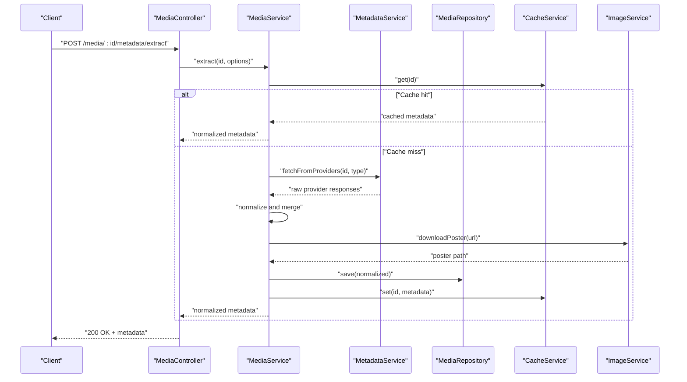

**Diagram sources**
- [media.controller.ts](file://apps/backend/src/media/media.controller.ts)
- [media.service.ts](file://apps/backend/src/media/media.service.ts)
- [media-metadata.service.ts](file://apps/backend/src/media/media-metadata.service.ts)
- [media.repository.ts](file://apps/backend/src/media/media.repository.ts)
- [cache.service.ts](file://apps/backend/src/hardening/cache.service.ts)
- [image.service.ts](file://apps/backend/src/storage/image.service.ts)

## Detailed Component Analysis

### Metadata Service
Responsibilities:
- Provider selection based on media type (movie, tvShow, book, game).
- Fetching from TMDB, book databases, and custom scrapers.
- Normalizing fields like title, year, genres, overview, poster URLs.
- Handling errors per provider and aggregating partial results.
- Applying fallback chains when primary providers fail.

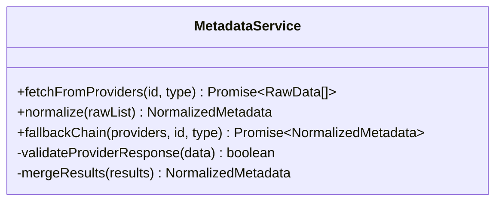

**Diagram sources**
- [media-metadata.service.ts](file://apps/backend/src/media/media-metadata.service.ts)

**Section sources**
- [media-metadata.service.ts](file://apps/backend/src/media/media-metadata.service.ts)

### Media Service
Responsibilities:
- Orchestration of extraction workflow.
- Caching strategy integration.
- Poster download and storage coordination.
- Persisting normalized metadata via repository.
- Manual override support by accepting user-provided fields.

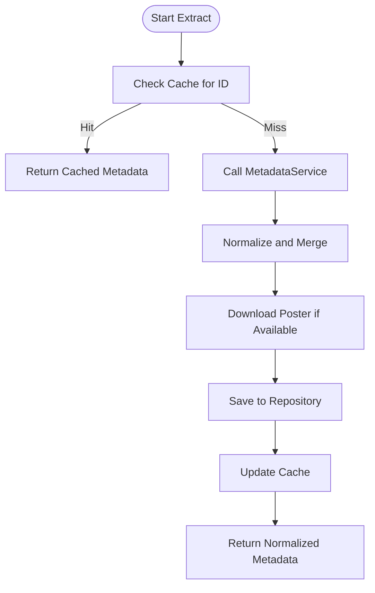

**Diagram sources**
- [media.service.ts](file://apps/backend/src/media/media.service.ts)
- [media-metadata.service.ts](file://apps/backend/src/media/media-metadata.service.ts)
- [cache.service.ts](file://apps/backend/src/hardening/cache.service.ts)
- [image.service.ts](file://apps/backend/src/storage/image.service.ts)
- [media.repository.ts](file://apps/backend/src/media/media.repository.ts)

**Section sources**
- [media.service.ts](file://apps/backend/src/media/media.service.ts)

### Slug Service
Responsibilities:
- Generate URL-friendly slugs from standardized titles.
- Ensure uniqueness and handle conflicts.
- Support language-specific normalization rules.

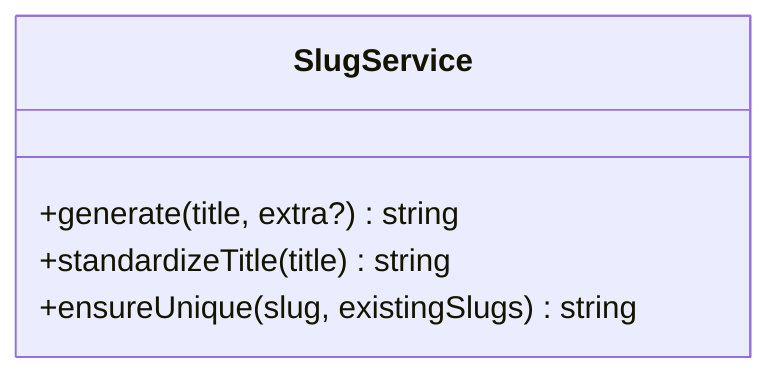

**Diagram sources**
- [slug.service.ts](file://apps/backend/src/media/slug.service.ts)

**Section sources**
- [slug.service.ts](file://apps/backend/src/media/slug.service.ts)

### Configuration and Environment Validation
Responsibilities:
- Centralized access to environment variables (API keys, base URLs, timeouts).
- Validation to ensure required settings are present at startup.
- Feature flags controlling which providers are enabled.

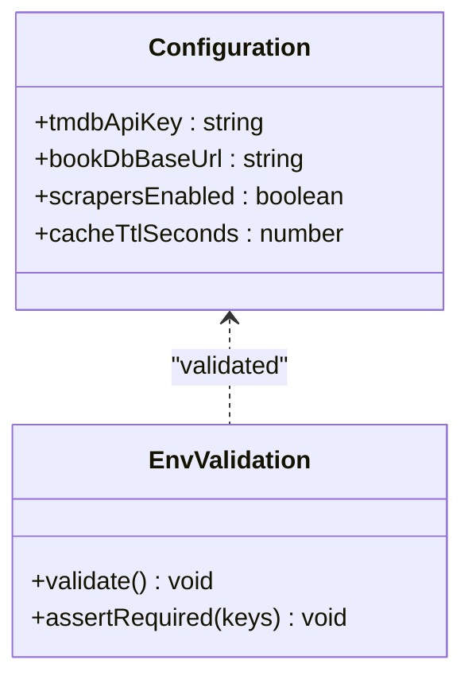

**Diagram sources**
- [configuration.ts](file://apps/backend/src/config/configuration.ts)
- [env.validation.ts](file://apps/backend/src/config/env.validation.ts)

**Section sources**
- [configuration.ts](file://apps/backend/src/config/configuration.ts)
- [env.validation.ts](file://apps/backend/src/config/env.validation.ts)

### Caching Strategy
Responsibilities:
- Cache metadata by media ID and type.
- TTL-based expiration to balance freshness and performance.
- Fallback to in-memory cache when Redis is unavailable.

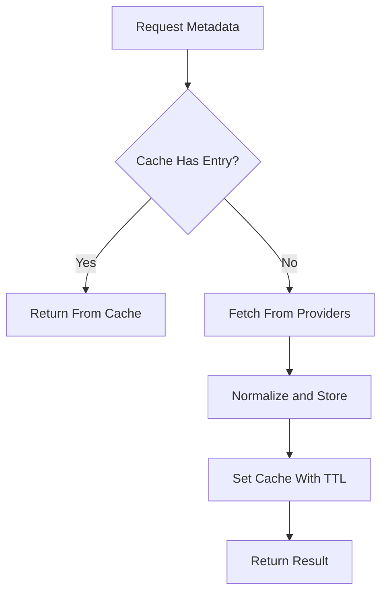

**Diagram sources**
- [cache.service.ts](file://apps/backend/src/hardening/cache.service.ts)
- [redis.service.ts](file://apps/backend/src/redis/redis.service.ts)

**Section sources**
- [cache.service.ts](file://apps/backend/src/hardening/cache.service.ts)
- [redis.service.ts](file://apps/backend/src/redis/redis.service.ts)

### Error Handling and Fallback Mechanisms
Responsibilities:
- Per-provider error handling with retry policies.
- Aggregation of partial results when some providers fail.
- Graceful degradation when external services are down.
- Manual override capability to accept user-supplied metadata.

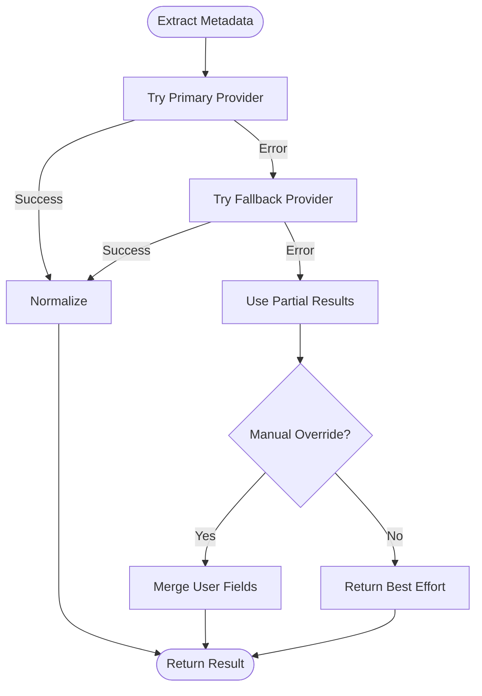

**Diagram sources**
- [media-metadata.service.ts](file://apps/backend/src/media/media-metadata.service.ts)
- [media.service.ts](file://apps/backend/src/media/media.service.ts)

**Section sources**
- [media-metadata.service.ts](file://apps/backend/src/media/media-metadata.service.ts)
- [media.service.ts](file://apps/backend/src/media/media.service.ts)

### Title Standardization and Genre Classification
Responsibilities:
- Normalize titles by removing punctuation, converting case, and trimming whitespace.
- Map provider-specific genres to canonical categories.
- Deduplicate and prioritize genres based on relevance signals.

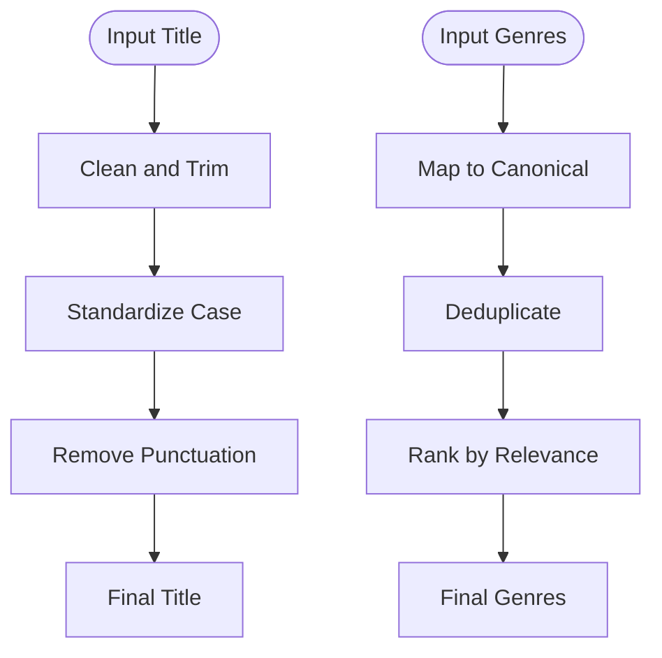

[No sources needed since this diagram shows conceptual workflow, not actual code structure]

### Rate Limiting Considerations
Responsibilities:
- Monitor and audit rate limits for external APIs.
- Implement backoff strategies and request throttling.
- Provide metrics and alerts for rate limit breaches.

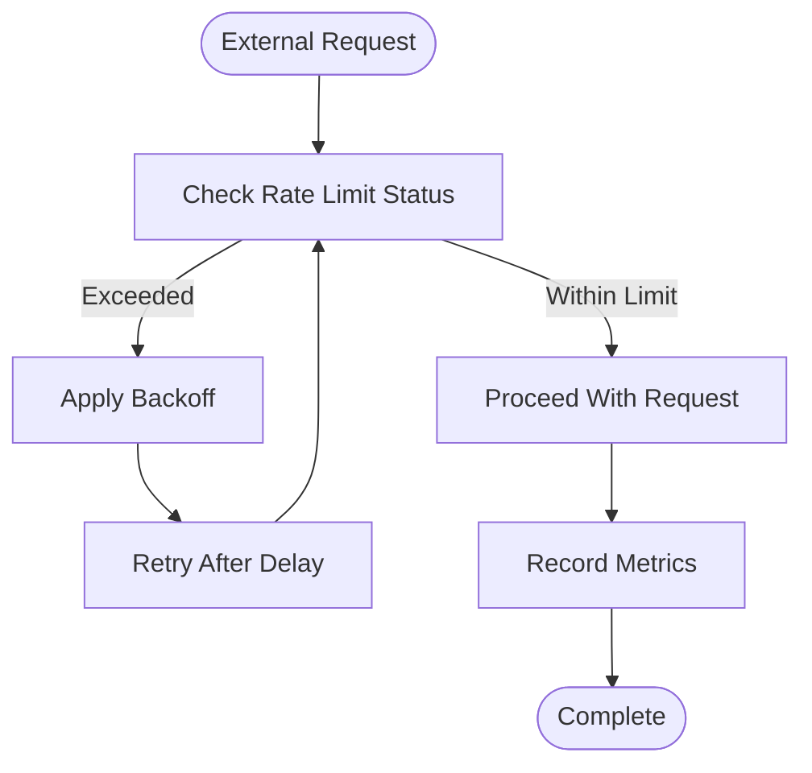

**Diagram sources**
- [rate-limit-audit.service.ts](file://apps/backend/src/hardening/rate-limit-audit.service.ts)

**Section sources**
- [rate-limit-audit.service.ts](file://apps/backend/src/hardening/rate-limit-audit.service.ts)

### API Key Management
Responsibilities:
- Load API keys from environment variables securely.
- Validate presence and format at startup.
- Rotate keys without downtime using configuration updates.

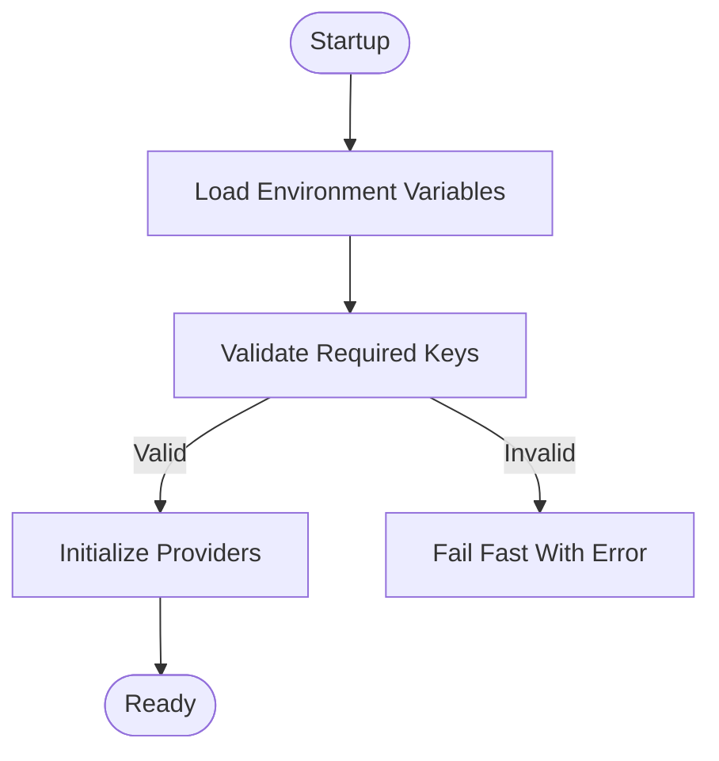

**Diagram sources**
- [configuration.ts](file://apps/backend/src/config/configuration.ts)
- [env.validation.ts](file://apps/backend/src/config/env.validation.ts)

**Section sources**
- [configuration.ts](file://apps/backend/src/config/configuration.ts)
- [env.validation.ts](file://apps/backend/src/config/env.validation.ts)

## Dependency Analysis
The media module depends on configuration, caching, storage, and repository layers. The metadata service coordinates provider adapters and normalization, while the media service orchestrates the overall flow.

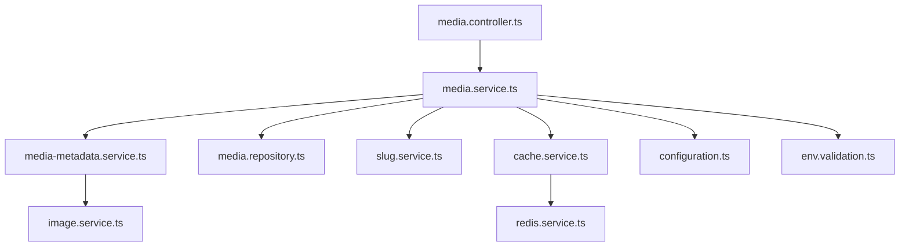

**Diagram sources**
- [media.controller.ts](file://apps/backend/src/media/media.controller.ts)
- [media.service.ts](file://apps/backend/src/media/media.service.ts)
- [media-metadata.service.ts](file://apps/backend/src/media/media-metadata.service.ts)
- [media.repository.ts](file://apps/backend/src/media/media.repository.ts)
- [slug.service.ts](file://apps/backend/src/media/slug.service.ts)
- [cache.service.ts](file://apps/backend/src/hardening/cache.service.ts)
- [redis.service.ts](file://apps/backend/src/redis/redis.service.ts)
- [image.service.ts](file://apps/backend/src/storage/image.service.ts)
- [configuration.ts](file://apps/backend/src/config/configuration.ts)
- [env.validation.ts](file://apps/backend/src/config/env.validation.ts)

**Section sources**
- [media.module.ts](file://apps/backend/src/media/media.module.ts)

## Performance Considerations
- Prefer cached metadata to minimize external API calls.
- Use parallel fetching across providers where safe and supported.
- Apply reasonable TTL values to balance freshness and load.
- Stream poster downloads and store them efficiently.
- Monitor rate limits and implement backoff to avoid throttling.

[No sources needed since this section provides general guidance]

## Troubleshooting Guide
Common issues and resolutions:
- Missing API keys: Ensure environment variables are set and validated at startup.
- Provider failures: Check logs for specific provider errors and verify network connectivity.
- Cache misses: Verify cache service availability and TTL settings.
- Poster download failures: Confirm storage permissions and remote URL accessibility.
- Rate limit exceeded: Reduce request frequency and enable backoff strategies.

**Section sources**
- [configuration.ts](file://apps/backend/src/config/configuration.ts)
- [env.validation.ts](file://apps/backend/src/config/env.validation.ts)
- [cache.service.ts](file://apps/backend/src/hardening/cache.service.ts)
- [image.service.ts](file://apps/backend/src/storage/image.service.ts)
- [rate-limit-audit.service.ts](file://apps/backend/src/hardening/rate-limit-audit.service.ts)

## Conclusion
The metadata extraction system integrates multiple providers, normalizes data consistently, and employs robust caching and error-handling strategies. By centralizing configuration, validating environment variables, and providing fallback mechanisms, it ensures reliable operation across diverse media types. Manual overrides allow users to correct or enhance metadata when automatic extraction falls short.

[No sources needed since this section summarizes without analyzing specific files]