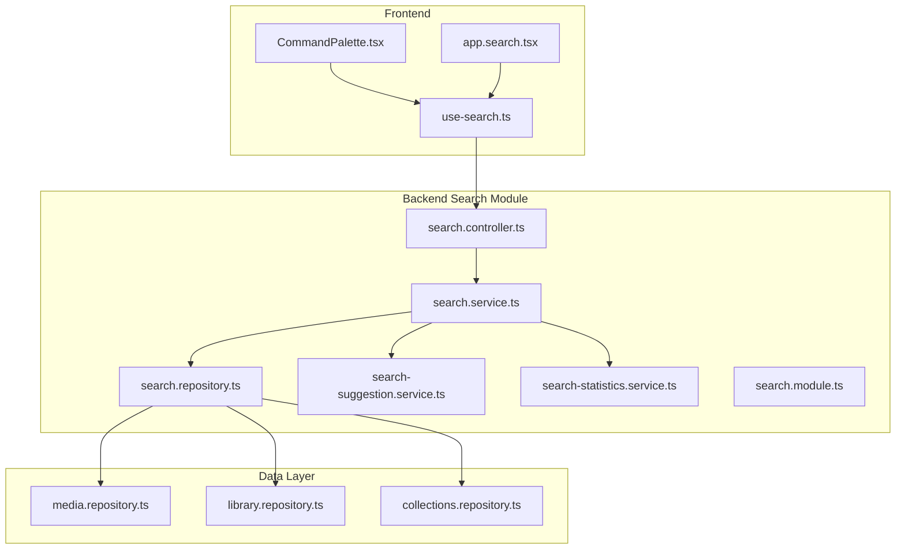
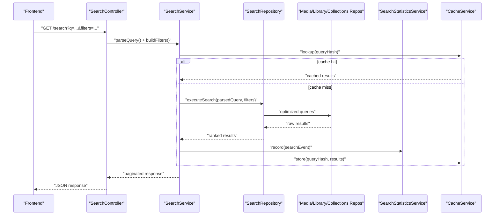
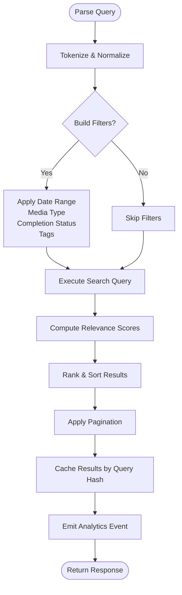
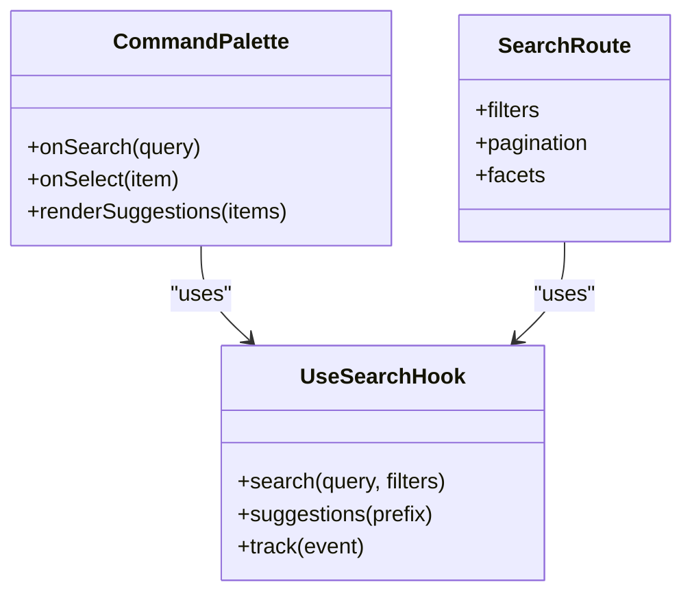
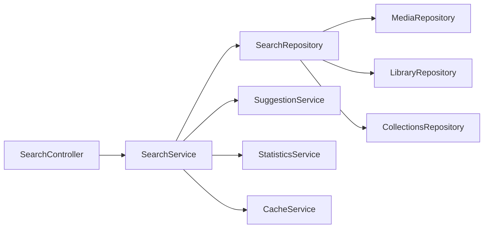

# Search & Filtering System

<cite>
**Referenced Files in This Document**
- [search.controller.ts](file://apps/backend/src/search/search.controller.ts)
- [search.service.ts](file://apps/backend/src/search/search.service.ts)
- [search.repository.ts](file://apps/backend/src/search/search.repository.ts)
- [search-suggestion.service.ts](file://apps/backend/src/search/search-suggestion.service.ts)
- [search-statistics.service.ts](file://apps/backend/src/search/search-statistics.service.ts)
- [search.module.ts](file://apps/backend/src/search/search.module.ts)
- [use-search.ts](file://src/hooks/use-search.ts)
- [CommandPalette.tsx](file://src/components/search/CommandPalette.tsx)
- [app.search.tsx](file://src/routes/app.search.tsx)
- [media.repository.ts](file://apps/backend/src/media/media.repository.ts)
- [library.repository.ts](file://apps/backend/src/library/library.repository.ts)
- [collections.repository.ts](file://apps/backend/src/collections/collections.repository.ts)
- [analytics-aggregation.service.ts](file://apps/backend/src/analytics/analytics-aggregation.service.ts)
- [cache.service.ts](file://apps/backend/src/hardening/cache.service.ts)
- [database-optimization.service.ts](file://apps/backend/src/hardening/database-optimization.service.ts)
- [query-analysis.service.ts](file://apps/backend/src/hardening/query-analysis.service.ts)
</cite>

## Table of Contents
1. [Introduction](#introduction)
2. [Project Structure](#project-structure)
3. [Core Components](#core-components)
4. [Architecture Overview](#architecture-overview)
5. [Detailed Component Analysis](#detailed-component-analysis)
6. [Dependency Analysis](#dependency-analysis)
7. [Performance Considerations](#performance-considerations)
8. [Troubleshooting Guide](#troubleshooting-guide)
9. [Conclusion](#conclusion)
10. [Appendices](#appendices)

## Introduction
This document explains the search and filtering system that provides full-text search across media titles, descriptions, genres, and user-generated content. It covers query parsing, relevance scoring, result ranking, advanced filters (date ranges, media types, completion status, custom tags), autocomplete/suggestions, and search analytics. It also documents performance optimizations such as database indexing, caching, and pagination strategies, along with customization options, faceted search, and multi-language considerations.

## Project Structure
The search feature is implemented primarily in the backend NestJS module under apps/backend/src/search, with supporting services for suggestions and statistics. The frontend exposes a command palette, a dedicated search route, and a React hook to interact with the API.

**Diagram sources**
- [search.controller.ts](file://apps/backend/src/search/search.controller.ts)
- [search.service.ts](file://apps/backend/src/search/search.service.ts)
- [search.repository.ts](file://apps/backend/src/search/search.repository.ts)
- [search-suggestion.service.ts](file://apps/backend/src/search/search-suggestion.service.ts)
- [search-statistics.service.ts](file://apps/backend/src/search/search-statistics.service.ts)
- [search.module.ts](file://apps/backend/src/search/search.module.ts)
- [use-search.ts](file://src/hooks/use-search.ts)
- [CommandPalette.tsx](file://src/components/search/CommandPalette.tsx)
- [app.search.tsx](file://src/routes/app.search.tsx)
- [media.repository.ts](file://apps/backend/src/media/media.repository.ts)
- [library.repository.ts](file://apps/backend/src/library/library.repository.ts)
- [collections.repository.ts](file://apps/backend/src/collections/collections.repository.ts)

**Section sources**
- [search.module.ts](file://apps/backend/src/search/search.module.ts)
- [use-search.ts](file://src/hooks/use-search.ts)
- [CommandPalette.tsx](file://src/components/search/CommandPalette.tsx)
- [app.search.tsx](file://src/routes/app.search.tsx)

## Core Components
- Controller: Exposes endpoints for search queries, suggestions, and analytics.
- Service: Orchestrates query parsing, filtering, scoring, ranking, and aggregation.
- Repository: Builds and executes optimized queries against media, library, and collections data.
- Suggestion Service: Provides autocomplete and popular terms.
- Statistics Service: Tracks search usage and outcomes for analytics.

Key responsibilities:
- Parse natural language or structured queries into filter predicates.
- Compute relevance scores based on field matches, recency, and user signals.
- Apply advanced filters (date range, media type, completion status, tags).
- Paginate results efficiently and return consistent response shapes.
- Record analytics events and expose metrics.

**Section sources**
- [search.controller.ts](file://apps/backend/src/search/search.controller.ts)
- [search.service.ts](file://apps/backend/src/search/search.service.ts)
- [search.repository.ts](file://apps/backend/src/search/search.repository.ts)
- [search-suggestion.service.ts](file://apps/backend/src/search/search-suggestion.service.ts)
- [search-statistics.service.ts](file://apps/backend/src/search/search-statistics.service.ts)

## Architecture Overview
The search pipeline integrates controller handling, service orchestration, repository-level querying, and cross-cutting concerns like caching and analytics.

**Diagram sources**
- [search.controller.ts](file://apps/backend/src/search/search.controller.ts)
- [search.service.ts](file://apps/backend/src/search/search.service.ts)
- [search.repository.ts](file://apps/backend/src/search/search.repository.ts)
- [search-statistics.service.ts](file://apps/backend/src/search/search-statistics.service.ts)
- [cache.service.ts](file://apps/backend/src/hardening/cache.service.ts)
- [media.repository.ts](file://apps/backend/src/media/media.repository.ts)
- [library.repository.ts](file://apps/backend/src/library/library.repository.ts)
- [collections.repository.ts](file://apps/backend/src/collections/collections.repository.ts)

## Detailed Component Analysis

### Search Controller
- Responsibilities:
  - Validate and normalize incoming query parameters.
  - Delegate to service for execution.
  - Return standardized paginated responses.
- Endpoints:
  - Full-text search with filters and pagination.
  - Autocomplete/suggestions endpoint.
  - Analytics ingestion endpoint for search events.

Typical flow:
- Input validation -> parameter normalization -> call service -> format response.

**Section sources**
- [search.controller.ts](file://apps/backend/src/search/search.controller.ts)

### Search Service
- Responsibilities:
  - Parse query string into tokens and operators.
  - Build composite filters (date ranges, media types, completion status, tags).
  - Score and rank results using relevance heuristics.
  - Integrate caching and analytics.
- Relevance Scoring:
  - Field match weights (title > description > genre).
  - Proximity and phrase matching bonuses.
  - Recency boost for recently updated items.
  - User interaction signals (clicks, bookmarks) when available.
- Ranking:
  - Combine score with sort criteria (relevance, date, popularity).
  - Apply tie-breakers and deterministic ordering.

**Diagram sources**
- [search.service.ts](file://apps/backend/src/search/search.service.ts)
- [search.repository.ts](file://apps/backend/src/search/search.repository.ts)
- [cache.service.ts](file://apps/backend/src/hardening/cache.service.ts)
- [search-statistics.service.ts](file://apps/backend/src/search/search-statistics.service.ts)

**Section sources**
- [search.service.ts](file://apps/backend/src/search/search.service.ts)

### Search Repository
- Responsibilities:
  - Construct efficient database queries across media, library, and collections entities.
  - Use indexes and full-text capabilities where available.
  - Aggregate facets for filtering and analytics.
- Data Sources:
  - Media metadata (titles, descriptions, genres).
  - Library entries (user-specific state, progress).
  - Collections and tags.

Optimization techniques:
- Indexed columns for frequently filtered fields.
- Full-text search vectors or FTS tables.
- Precomputed aggregates for common facets.

**Section sources**
- [search.repository.ts](file://apps/backend/src/search/search.repository.ts)
- [media.repository.ts](file://apps/backend/src/media/media.repository.ts)
- [library.repository.ts](file://apps/backend/src/library/library.repository.ts)
- [collections.repository.ts](file://apps/backend/src/collections/collections.repository.ts)

### Suggestion Service
- Responsibilities:
  - Provide autocomplete suggestions based on partial input.
  - Surface popular and trending terms.
  - Personalize suggestions using user history when available.
- Strategies:
  - Prefix matching on indexed title/description fields.
  - Frequency-based ranking for global suggestions.
  - Debounce and cache frequent prefixes.

**Section sources**
- [search-suggestion.service.ts](file://apps/backend/src/search/search-suggestion.service.ts)

### Statistics Service
- Responsibilities:
  - Track search queries, clicks, and conversions.
  - Aggregate metrics for dashboards and insights.
  - Support A/B testing of ranking algorithms.

Metrics captured:
- Query volume, zero-result rate, average latency.
- Click-through rates per result position.
- Filter usage distribution.

**Section sources**
- [search-statistics.service.ts](file://apps/backend/src/search/search-statistics.service.ts)
- [analytics-aggregation.service.ts](file://apps/backend/src/analytics/analytics-aggregation.service.ts)

### Frontend Integration
- Command Palette:
  - Lightweight input with real-time suggestions.
  - Keyboard navigation and quick actions.
- Search Route:
  - Dedicated page with filters, facets, and pagination.
- Hook:
  - Centralized API calls, loading states, error handling, and caching.

**Diagram sources**
- [CommandPalette.tsx](file://src/components/search/CommandPalette.tsx)
- [app.search.tsx](file://src/routes/app.search.tsx)
- [use-search.ts](file://src/hooks/use-search.ts)

**Section sources**
- [CommandPalette.tsx](file://src/components/search/CommandPalette.tsx)
- [app.search.tsx](file://src/routes/app.search.tsx)
- [use-search.ts](file://src/hooks/use-search.ts)

## Dependency Analysis
The search module depends on core repositories for data access and shared services for caching and analytics.

**Diagram sources**
- [search.controller.ts](file://apps/backend/src/search/search.controller.ts)
- [search.service.ts](file://apps/backend/src/search/search.service.ts)
- [search.repository.ts](file://apps/backend/src/search/search.repository.ts)
- [search-suggestion.service.ts](file://apps/backend/src/search/search-suggestion.service.ts)
- [search-statistics.service.ts](file://apps/backend/src/search/search-statistics.service.ts)
- [media.repository.ts](file://apps/backend/src/media/media.repository.ts)
- [library.repository.ts](file://apps/backend/src/library/library.repository.ts)
- [collections.repository.ts](file://apps/backend/src/collections/collections.repository.ts)
- [cache.service.ts](file://apps/backend/src/hardening/cache.service.ts)

**Section sources**
- [search.module.ts](file://apps/backend/src/search/search.module.ts)

## Performance Considerations
- Database Indexing:
  - Create indexes on frequently filtered fields (date ranges, media types, completion status, tags).
  - Use full-text indexes or vector stores for text search fields.
- Query Caching:
  - Cache results keyed by normalized query hash and filter set.
  - Implement TTL and invalidation on data mutations.
- Pagination:
  - Use cursor-based pagination for large datasets.
  - Limit default page sizes and enforce maximum bounds.
- Query Optimization:
  - Avoid N+1 queries; use joins or batched loads.
  - Leverage precomputed aggregates for facets.
- Monitoring:
  - Track latency percentiles and error rates.
  - Analyze slow queries and adjust indexes.

[No sources needed since this section provides general guidance]

## Troubleshooting Guide
Common issues and resolutions:
- Slow search queries:
  - Verify indexes exist for filter fields and text search columns.
  - Inspect query plans and add missing indexes.
- High memory usage:
  - Reduce result sets via stricter filters or smaller page sizes.
  - Ensure streaming or chunked processing for large aggregations.
- Stale cached results:
  - Invalidate cache on write operations (create/update/delete).
  - Adjust TTL based on data freshness requirements.
- Zero-result searches:
  - Normalize inputs (lowercasing, stemming).
  - Expand search scope or relax filters.

**Section sources**
- [database-optimization.service.ts](file://apps/backend/src/hardening/database-optimization.service.ts)
- [query-analysis.service.ts](file://apps/backend/src/hardening/query-analysis.service.ts)
- [cache.service.ts](file://apps/backend/src/hardening/cache.service.ts)

## Conclusion
The search and filtering system combines robust query parsing, relevance scoring, and advanced filtering to deliver fast, accurate results across media and user-generated content. With caching, indexing, and pagination, it scales effectively while providing rich analytics and suggestion capabilities. Customization points allow tuning of ranking, facets, and multi-language support to meet diverse user needs.

[No sources needed since this section summarizes without analyzing specific files]

## Appendices

### Query Parsing and Operators
- Supported operators:
  - Exact match, substring, prefix.
  - Boolean operators (AND, OR, NOT).
  - Field scoping (title:, description:, genre:).
- Normalization:
  - Lowercasing, whitespace trimming.
  - Language-aware tokenization.

[No sources needed since this section provides general guidance]

### Advanced Filters
- Date ranges: created_at, updated_at, completion_date.
- Media types: movie, series, book, podcast.
- Completion status: planning, in-progress, completed, dropped.
- Custom tags: user-defined labels and categories.

[No sources needed since this section provides general guidance]

### Faceted Search
- Dimensions:
  - Genre, media type, completion status, tags.
  - Release year, duration, rating.
- Aggregation:
  - Count-based facets with min-count thresholds.
  - Dynamic facet updates based on current filters.

[No sources needed since this section provides general guidance]

### Multi-Language Support
- Tokenization:
  - Locale-aware segmentation and stopword removal.
- Indexing:
  - Per-language text indexes or unified multilingual index.
- UI:
  - Language detection and localized suggestions.

[No sources needed since this section provides general guidance]

### Search Analytics
- Events:
  - Query submission, result clicks, refinements.
- Metrics:
  - Zero-result rate, average latency, top queries.
- Insights:
  - Popular filters, trending topics, conversion funnels.

**Section sources**
- [search-statistics.service.ts](file://apps/backend/src/search/search-statistics.service.ts)
- [analytics-aggregation.service.ts](file://apps/backend/src/analytics/analytics-aggregation.service.ts)