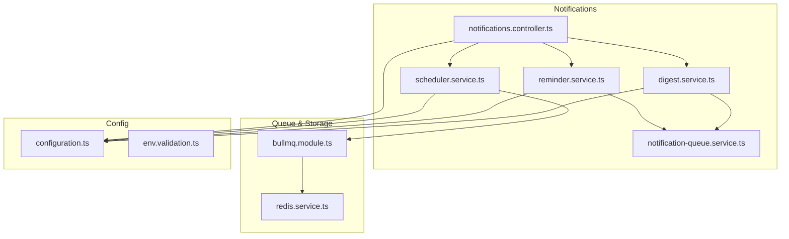
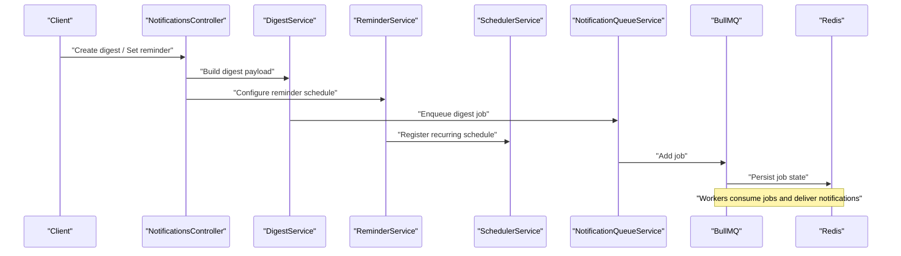
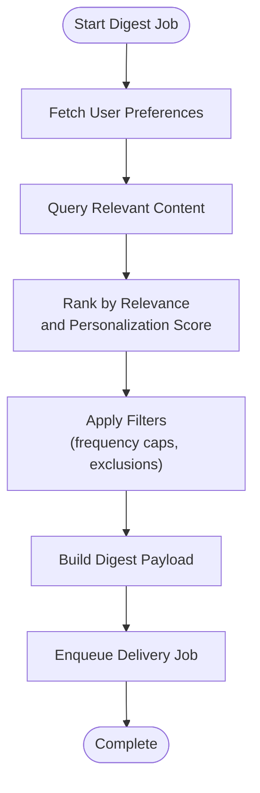
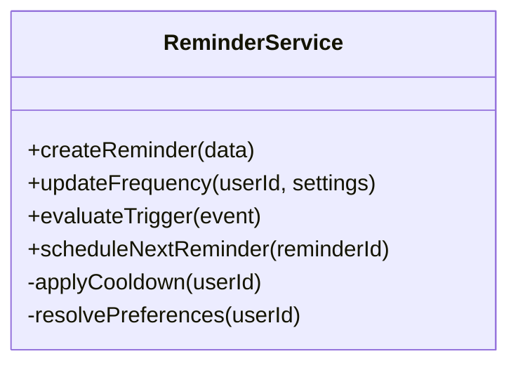
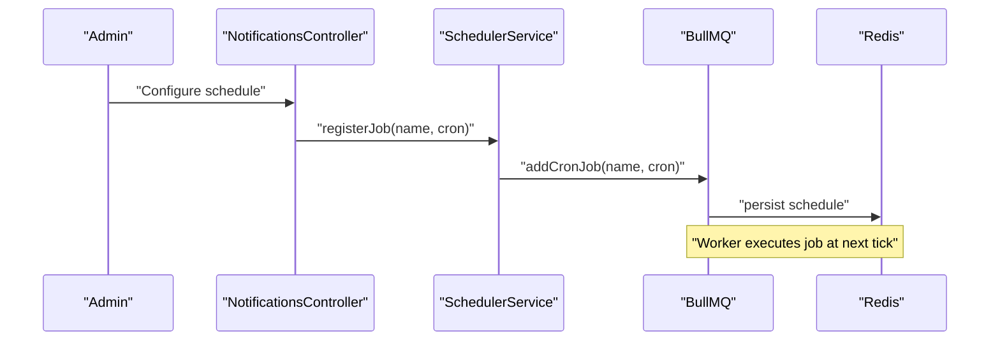
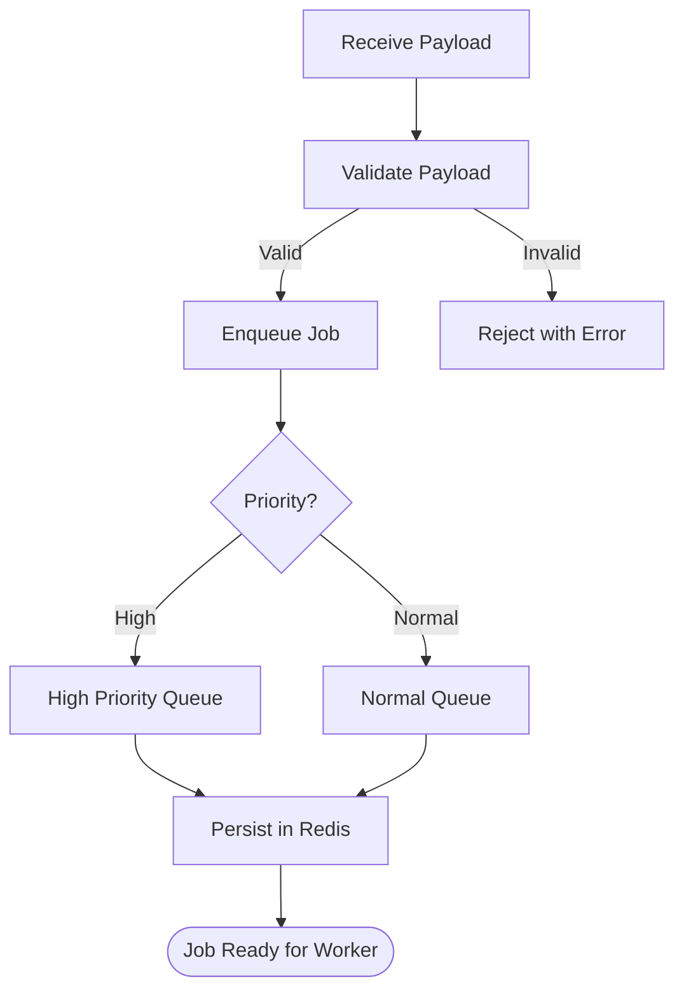
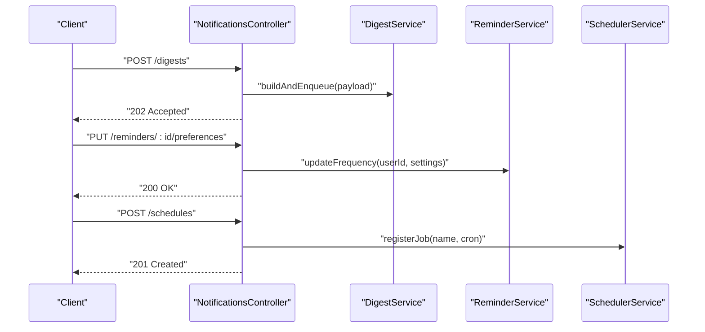
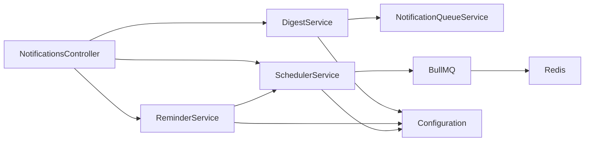

# Digest & Reminder System

<cite>
**Referenced Files in This Document**
- [notifications.module.ts](file://apps/backend/src/notifications/notifications.module.ts)
- [digest.service.ts](file://apps/backend/src/notifications/digest.service.ts)
- [reminder.service.ts](file://apps/backend/src/notifications/reminder.service.ts)
- [scheduler.service.ts](file://apps/backend/src/notifications/scheduler.service.ts)
- [notification-queue.service.ts](file://apps/backend/src/notifications/notification-queue.service.ts)
- [notifications.controller.ts](file://apps/backend/src/notifications/notifications.controller.ts)
- [bullmq.module.ts](file://apps/backend/src/bullmq/bullmq.module.ts)
- [redis.service.ts](file://apps/backend/src/redis/redis.service.ts)
- [configuration.ts](file://apps/backend/src/config/configuration.ts)
- [env.validation.ts](file://apps/backend/src/config/env.validation.ts)
</cite>

## Table of Contents
1. [Introduction](#introduction)
2. [Project Structure](#project-structure)
3. [Core Components](#core-components)
4. [Architecture Overview](#architecture-overview)
5. [Detailed Component Analysis](#detailed-component-analysis)
6. [Dependency Analysis](#dependency-analysis)
7. [Performance Considerations](#performance-considerations)
8. [Troubleshooting Guide](#troubleshooting-guide)
9. [Conclusion](#conclusion)
10. [Appendices](#appendices)

## Introduction
This document explains the digest generation and reminder system implemented in the backend notifications module. It covers scheduled digest creation, content aggregation, personalization algorithms, delivery scheduling, reminder triggers, frequency control, user preference management, and performance optimization strategies for large-scale operations. It also provides examples for creating custom digests, setting up reminders, and configuring delivery schedules.

## Project Structure
The digest and reminder functionality is primarily located under the notifications module with supporting infrastructure from BullMQ (job queue), Redis (cache and queue storage), and configuration modules. The key files include:
- Module registration and dependency wiring
- Digest orchestration service
- Reminder orchestration service
- Scheduler for recurring jobs
- Notification queue service for background processing
- Controller endpoints for user-facing operations
- BullMQ and Redis integration
- Configuration and environment validation

**Diagram sources**
- [notifications.controller.ts](file://apps/backend/src/notifications/notifications.controller.ts)
- [digest.service.ts](file://apps/backend/src/notifications/digest.service.ts)
- [reminder.service.ts](file://apps/backend/src/notifications/reminder.service.ts)
- [scheduler.service.ts](file://apps/backend/src/notifications/scheduler.service.ts)
- [notification-queue.service.ts](file://apps/backend/src/notifications/notification-queue.service.ts)
- [bullmq.module.ts](file://apps/backend/src/bullmq/bullmq.module.ts)
- [redis.service.ts](file://apps/backend/src/redis/redis.service.ts)
- [configuration.ts](file://apps/backend/src/config/configuration.ts)
- [env.validation.ts](file://apps/backend/src/config/env.validation.ts)

**Section sources**
- [notifications.module.ts](file://apps/backend/src/notifications/notifications.module.ts)
- [bullmq.module.ts](file://apps/backend/src/bullmq/bullmq.module.ts)
- [redis.service.ts](file://apps/backend/src/redis/redis.service.ts)
- [configuration.ts](file://apps/backend/src/config/configuration.ts)
- [env.validation.ts](file://apps/backend/src/config/env.validation.ts)

## Core Components
- Digest Service: Orchestrates digest creation, aggregation, personalization, and scheduling.
- Reminder Service: Manages reminder triggers, frequency control, and user preferences.
- Scheduler Service: Registers and manages recurring jobs for digest and reminder tasks.
- Notification Queue Service: Enqueues and processes notification payloads asynchronously.
- Notifications Controller: Exposes API endpoints to create digests, set reminders, and manage schedules.
- BullMQ Integration: Provides job queues and worker execution.
- Redis Service: Stores queue state and optional caching for performance.
- Configuration: Centralized settings for scheduling intervals, limits, and feature flags.

**Section sources**
- [digest.service.ts](file://apps/backend/src/notifications/digest.service.ts)
- [reminder.service.ts](file://apps/backend/src/notifications/reminder.service.ts)
- [scheduler.service.ts](file://apps/backend/src/notifications/scheduler.service.ts)
- [notification-queue.service.ts](file://apps/backend/src/notifications/notification-queue.service.ts)
- [notifications.controller.ts](file://apps/backend/src/notifications/notifications.controller.ts)
- [bullmq.module.ts](file://apps/backend/src/bullmq/bullmq.module.ts)
- [redis.service.ts](file://apps/backend/src/redis/redis.service.ts)
- [configuration.ts](file://apps/backend/src/config/configuration.ts)

## Architecture Overview
The system uses a scheduler-driven architecture where recurring jobs trigger digest and reminder workflows. Each workflow aggregates relevant data, applies personalization rules, and enqueues notifications for delivery. Background workers process these jobs using BullMQ and Redis for persistence and coordination.

**Diagram sources**
- [notifications.controller.ts](file://apps/backend/src/notifications/notifications.controller.ts)
- [digest.service.ts](file://apps/backend/src/notifications/digest.service.ts)
- [reminder.service.ts](file://apps/backend/src/notifications/reminder.service.ts)
- [scheduler.service.ts](file://apps/backend/src/notifications/scheduler.service.ts)
- [notification-queue.service.ts](file://apps/backend/src/notifications/notification-queue.service.ts)
- [bullmq.module.ts](file://apps/backend/src/bullmq/bullmq.module.ts)
- [redis.service.ts](file://apps/backend/src/redis/redis.service.ts)

## Detailed Component Analysis

### Digest Service
Responsibilities:
- Aggregates content based on time windows, categories, or user-defined filters.
- Applies personalization algorithms using user preferences, interaction history, and context signals.
- Produces structured digest payloads suitable for downstream delivery channels.
- Coordinates with the notification queue to enqueue digest jobs.

Key behaviors:
- Content selection criteria and ranking logic.
- Personalization scoring and filtering.
- Batch processing for scalability.
- Error handling and retry policies.

**Diagram sources**
- [digest.service.ts](file://apps/backend/src/notifications/digest.service.ts)
- [notification-queue.service.ts](file://apps/backend/src/notifications/notification-queue.service.ts)

**Section sources**
- [digest.service.ts](file://apps/backend/src/notifications/digest.service.ts)

### Reminder Service
Responsibilities:
- Manages reminder triggers based on events or schedules.
- Controls frequency to avoid notification fatigue.
- Persists and updates user preferences for reminder settings.
- Integrates with the scheduler for recurring reminders.

Key behaviors:
- Trigger evaluation (time-based, event-based).
- Frequency capping and cooldowns.
- Preference resolution and overrides.
- Scheduling and rescheduling logic.

**Diagram sources**
- [reminder.service.ts](file://apps/backend/src/notifications/reminder.service.ts)

**Section sources**
- [reminder.service.ts](file://apps/backend/src/notifications/reminder.service.ts)

### Scheduler Service
Responsibilities:
- Registers recurring jobs for digest and reminder generation.
- Manages cron-like schedules and dynamic intervals.
- Ensures idempotency and avoids overlapping executions.
- Integrates with BullMQ for reliable job execution.

Key behaviors:
- Schedule registration and lifecycle management.
- Conflict detection and backoff strategies.
- Monitoring and health checks for scheduled tasks.

**Diagram sources**
- [scheduler.service.ts](file://apps/backend/src/notifications/scheduler.service.ts)
- [bullmq.module.ts](file://apps/backend/src/bullmq/bullmq.module.ts)
- [redis.service.ts](file://apps/backend/src/redis/redis.service.ts)

**Section sources**
- [scheduler.service.ts](file://apps/backend/src/notifications/scheduler.service.ts)

### Notification Queue Service
Responsibilities:
- Enqueues notification payloads for asynchronous processing.
- Supports priority queues and rate limiting.
- Handles retries, dead-letter queues, and error reporting.

Key behaviors:
- Job creation with metadata (user ID, type, payload).
- Backpressure handling and concurrency controls.
- Observability hooks for metrics and tracing.

**Diagram sources**
- [notification-queue.service.ts](file://apps/backend/src/notifications/notification-queue.service.ts)

**Section sources**
- [notification-queue.service.ts](file://apps/backend/src/notifications/notification-queue.service.ts)

### Notifications Controller
Responsibilities:
- Exposes REST endpoints for digest creation, reminder setup, and schedule configuration.
- Validates inputs and delegates to services for business logic.
- Returns standardized responses and errors.

Key endpoints:
- Create digest
- Update reminder preferences
- Configure delivery schedule
- Query status of pending jobs

**Diagram sources**
- [notifications.controller.ts](file://apps/backend/src/notifications/notifications.controller.ts)
- [digest.service.ts](file://apps/backend/src/notifications/digest.service.ts)
- [reminder.service.ts](file://apps/backend/src/notifications/reminder.service.ts)
- [scheduler.service.ts](file://apps/backend/src/notifications/scheduler.service.ts)

**Section sources**
- [notifications.controller.ts](file://apps/backend/src/notifications/notifications.controller.ts)

## Dependency Analysis
The notifications module depends on BullMQ for job queuing, Redis for persistence and caching, and configuration modules for runtime settings. Controllers depend on services; services depend on queue and configuration.

**Diagram sources**
- [notifications.controller.ts](file://apps/backend/src/notifications/notifications.controller.ts)
- [digest.service.ts](file://apps/backend/src/notifications/digest.service.ts)
- [reminder.service.ts](file://apps/backend/src/notifications/reminder.service.ts)
- [scheduler.service.ts](file://apps/backend/src/notifications/scheduler.service.ts)
- [notification-queue.service.ts](file://apps/backend/src/notifications/notification-queue.service.ts)
- [bullmq.module.ts](file://apps/backend/src/bullmq/bullmq.module.ts)
- [redis.service.ts](file://apps/backend/src/redis/redis.service.ts)
- [configuration.ts](file://apps/backend/src/config/configuration.ts)

**Section sources**
- [notifications.module.ts](file://apps/backend/src/notifications/notifications.module.ts)
- [bullmq.module.ts](file://apps/backend/src/bullmq/bullmq.module.ts)
- [redis.service.ts](file://apps/backend/src/redis/redis.service.ts)
- [configuration.ts](file://apps/backend/src/config/configuration.ts)

## Performance Considerations
- Batch Processing: Aggregate content in batches to reduce database round-trips and memory pressure.
- Pagination: Use cursor-based pagination when fetching large datasets for personalization.
- Caching: Cache frequently accessed user preferences and recent content to minimize DB load.
- Concurrency Control: Limit worker concurrency per queue to prevent resource exhaustion.
- Idempotency: Ensure digest and reminder jobs are idempotent to handle retries safely.
- Memory Management: Stream results instead of loading entire datasets into memory; use chunked processing.
- Rate Limiting: Apply rate limits to external APIs and internal throttling to protect downstream systems.
- Monitoring: Track queue depth, job latency, and error rates to detect bottlenecks early.

[No sources needed since this section provides general guidance]

## Troubleshooting Guide
Common issues and resolutions:
- Jobs not executing: Verify BullMQ workers are running and Redis connectivity is healthy.
- Duplicate notifications: Check idempotency keys and ensure unique job IDs per user action.
- Stale preferences: Invalidate caches when user preferences change and recompute personalization scores.
- Overlapping schedules: Detect conflicts in scheduler registrations and enforce mutual exclusion.
- High memory usage: Inspect batch sizes and streaming configurations; reduce payload sizes.

**Section sources**
- [notification-queue.service.ts](file://apps/backend/src/notifications/notification-queue.service.ts)
- [scheduler.service.ts](file://apps/backend/src/notifications/scheduler.service.ts)
- [configuration.ts](file://apps/backend/src/config/configuration.ts)

## Conclusion
The digest and reminder system combines scheduled job orchestration, robust queuing, and configurable personalization to deliver timely, relevant notifications at scale. By leveraging BullMQ and Redis, the system ensures reliability and performance while providing flexible APIs for customization and control.

[No sources needed since this section summarizes without analyzing specific files]

## Appendices

### Examples

- Creating a Custom Digest
  - Call the controller endpoint to build a digest with filters and personalization options.
  - The digest service aggregates content, ranks items, and enqueues a delivery job.
  - Monitor job status via the queue service.

- Setting Up Reminders
  - Use the reminder service to define triggers and frequency constraints.
  - Register recurring schedules through the scheduler service.
  - Adjust preferences dynamically via the controller.

- Configuring Delivery Schedules
  - Define cron expressions or intervals via the scheduler service.
  - Validate schedules against existing jobs to avoid conflicts.
  - Persist schedules in Redis for durability.

[No sources needed since this section provides conceptual examples]