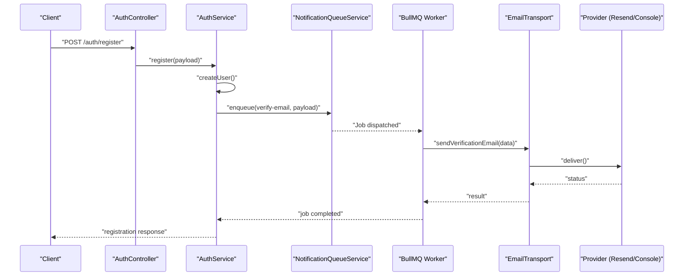
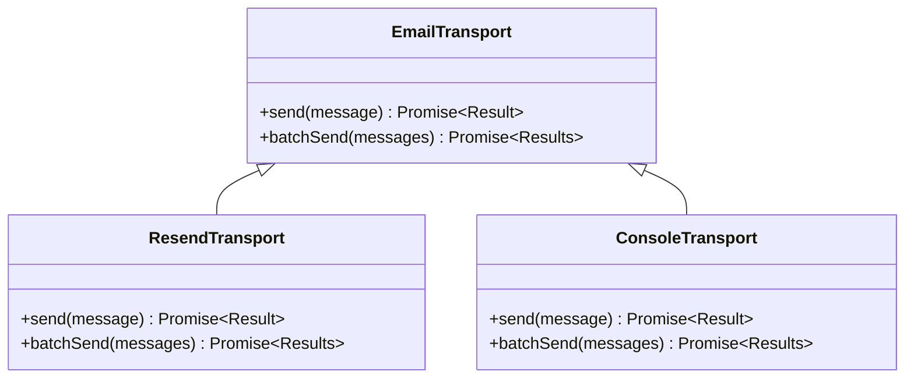
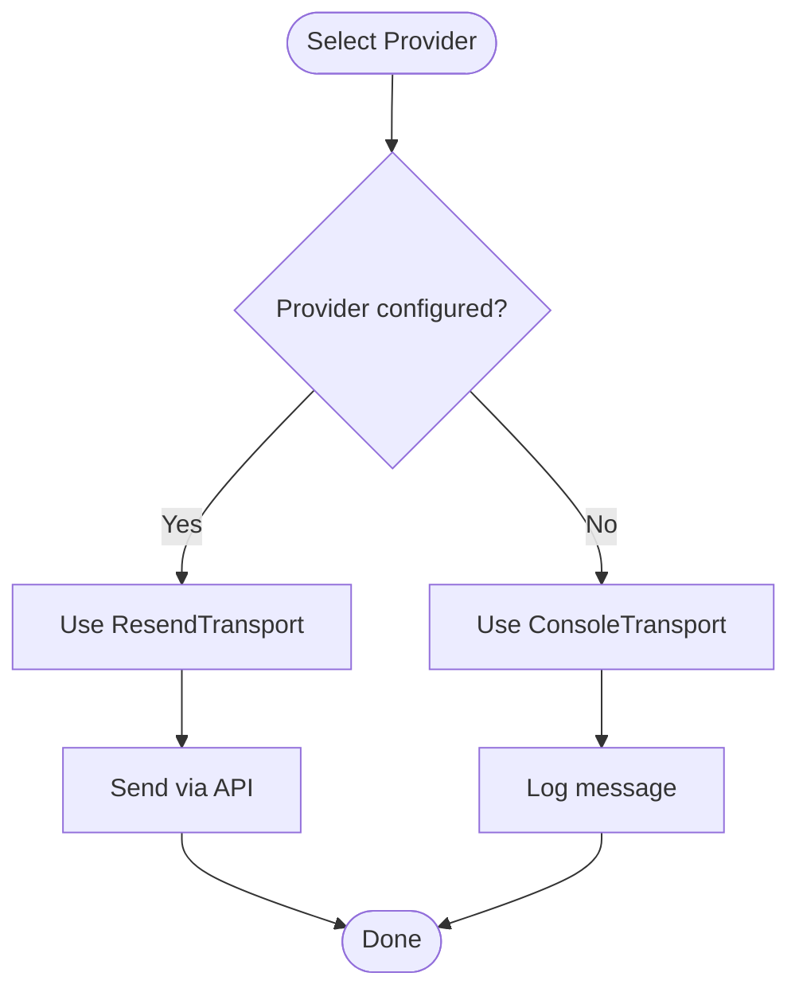
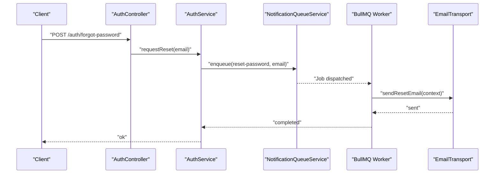
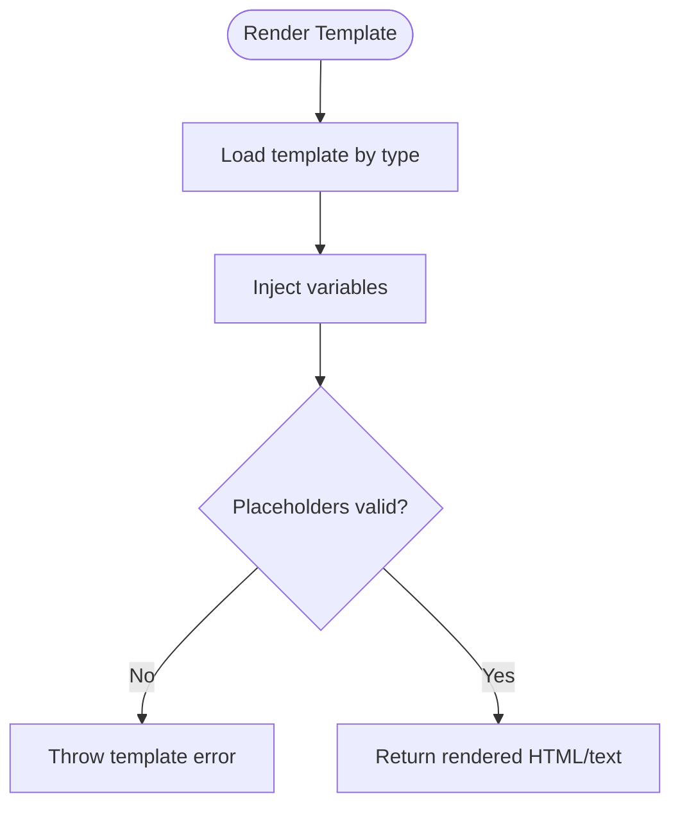
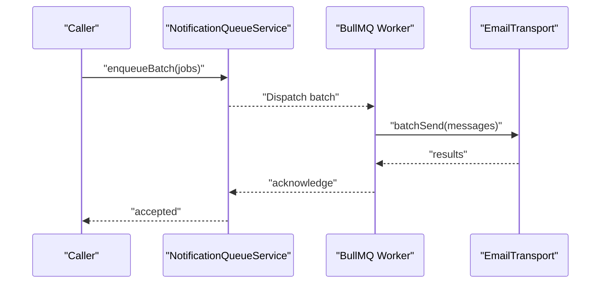
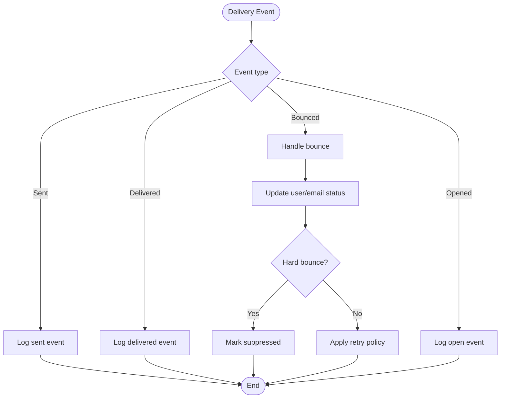
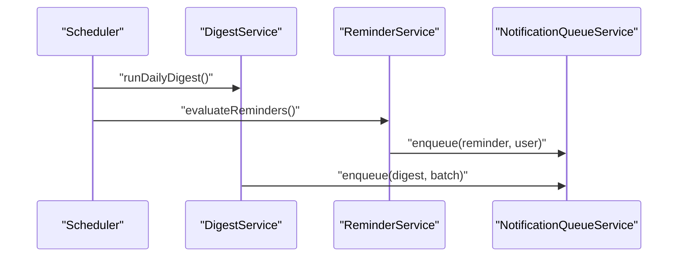
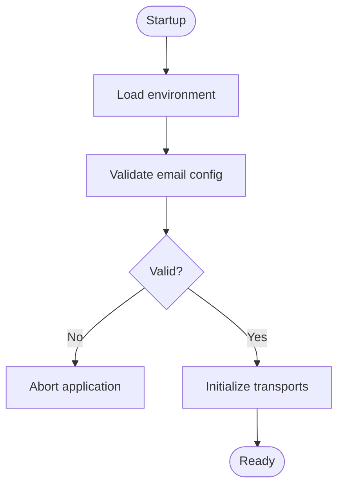
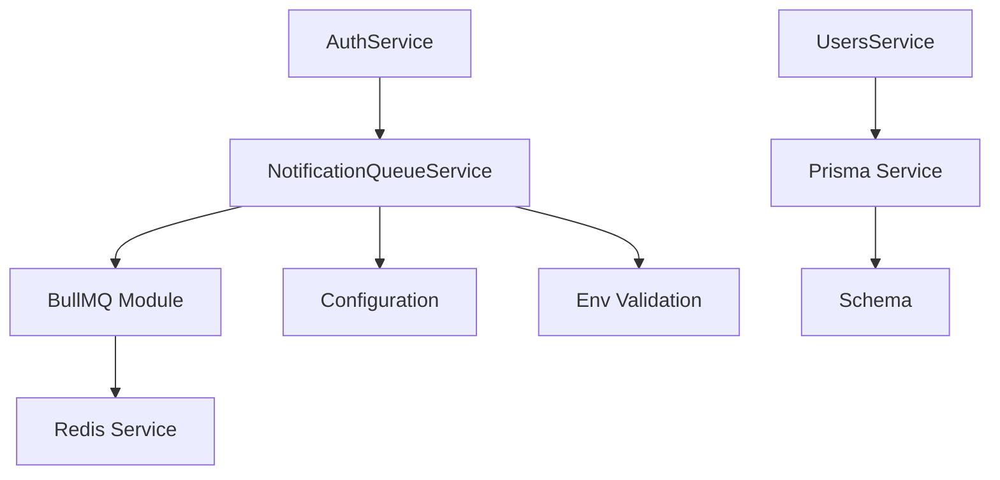

# Email Delivery System

<cite>
**Referenced Files in This Document**
- [notifications.module.ts](file://apps/backend/src/notifications/notifications.module.ts)
- [notification-queue.service.ts](file://apps/backend/src/notifications/notification-queue.service.ts)
- [digest.service.ts](file://apps/backend/src/notifications/digest.service.ts)
- [reminder.service.ts](file://apps/backend/src/notifications/reminder.service.ts)
- [scheduler.service.ts](file://apps/backend/src/notifications/scheduler.service.ts)
- [bullmq.module.ts](file://apps/backend/src/bullmq/bullmq.module.ts)
- [redis.service.ts](file://apps/backend/src/redis/redis.service.ts)
- [configuration.ts](file://apps/backend/src/config/configuration.ts)
- [env.validation.ts](file://apps/backend/src/config/env.validation.ts)
- [auth.controller.ts](file://apps/backend/src/auth/auth.controller.ts)
- [auth.service.ts](file://apps/backend/src/auth/auth.service.ts)
- [users.service.ts](file://apps/backend/src/users/users.service.ts)
- [prisma.service.ts](file://apps/backend/src/prisma/prisma.service.ts)
- [schema.prisma](file://apps/backend/prisma/schema.prisma)
</cite>

## Table of Contents
1. [Introduction](#introduction)
2. [Project Structure](#project-structure)
3. [Core Components](#core-components)
4. [Architecture Overview](#architecture-overview)
5. [Detailed Component Analysis](#detailed-component-analysis)
6. [Dependency Analysis](#dependency-analysis)
7. [Performance Considerations](#performance-considerations)
8. [Troubleshooting Guide](#troubleshooting-guide)
9. [Conclusion](#conclusion)
10. [Appendices](#appendices)

## Introduction
This document explains the email delivery system implemented in the backend. It covers transport abstraction, multiple providers (Resend and console), verification workflows, template management, queuing with BullMQ, batch sending, delivery tracking, bounce handling, configuration for different providers, custom templates, testing strategies, security considerations, rate limiting, and troubleshooting common issues.

## Project Structure
The email subsystem is primarily located under apps/backend/src/notifications, with supporting infrastructure in bullmq, redis, config, auth, users, and prisma modules. The key responsibilities are:
- Notifications orchestration and scheduling
- Queueing and background processing via BullMQ
- Provider selection and transport abstraction
- Integration with user accounts and authentication flows
- Configuration and environment validation

```mermaid
graph TB
subgraph "Notifications"
NMod["notifications.module.ts"]
NQueue["notification-queue.service.ts"]
Digest["digest.service.ts"]
Reminder["reminder.service.ts"]
Sched["scheduler.service.ts"]
end
subgraph "Background Jobs"
BMod["bullmq.module.ts"]
RedisSvc["redis.service.ts"]
end
subgraph "Config"
Config["configuration.ts"]
EnvVal["env.validation.ts"]
end
subgraph "Domain"
AuthCtrl["auth.controller.ts"]
AuthSvc["auth.service.ts"]
UserSvc["users.service.ts"]
Prisma["prisma.service.ts"]
Schema["schema.prisma"]
end
NMod --> NQueue
NMod --> Digest
NMod --> Reminder
NMod --> Sched
NQueue --> BMod
BMod --> RedisSvc
NMod --> Config
NMod --> EnvVal
AuthCtrl --> AuthSvc
AuthSvc --> UserSvc
UserSvc --> Prisma
Prisma --> Schema
```

**Diagram sources**
- [notifications.module.ts](file://apps/backend/src/notifications/notifications.module.ts)
- [notification-queue.service.ts](file://apps/backend/src/notifications/notification-queue.service.ts)
- [digest.service.ts](file://apps/backend/src/notifications/digest.service.ts)
- [reminder.service.ts](file://apps/backend/src/notifications/reminder.service.ts)
- [scheduler.service.ts](file://apps/backend/src/notifications/scheduler.service.ts)
- [bullmq.module.ts](file://apps/backend/src/bullmq/bullmq.module.ts)
- [redis.service.ts](file://apps/backend/src/redis/redis.service.ts)
- [configuration.ts](file://apps/backend/src/config/configuration.ts)
- [env.validation.ts](file://apps/backend/src/config/env.validation.ts)
- [auth.controller.ts](file://apps/backend/src/auth/auth.controller.ts)
- [auth.service.ts](file://apps/backend/src/auth/auth.service.ts)
- [users.service.ts](file://apps/backend/src/users/users.service.ts)
- [prisma.service.ts](file://apps/backend/src/prisma/prisma.service.ts)
- [schema.prisma](file://apps/backend/prisma/schema.prisma)

**Section sources**
- [notifications.module.ts](file://apps/backend/src/notifications/notifications.module.ts)
- [bullmq.module.ts](file://apps/backend/src/bullmq/bullmq.module.ts)
- [redis.service.ts](file://apps/backend/src/redis/redis.service.ts)
- [configuration.ts](file://apps/backend/src/config/configuration.ts)
- [env.validation.ts](file://apps/backend/src/config/env.validation.ts)
- [auth.controller.ts](file://apps/backend/src/auth/auth.controller.ts)
- [auth.service.ts](file://apps/backend/src/auth/auth.service.ts)
- [users.service.ts](file://apps/backend/src/users/users.service.ts)
- [prisma.service.ts](file://apps/backend/src/prisma/prisma.service.ts)
- [schema.prisma](file://apps/backend/prisma/schema.prisma)

## Core Components
- Notification queue service: Enqueues jobs for email operations, supports batching and retries.
- Scheduler service: Schedules periodic tasks such as digests and reminders.
- Digest service: Aggregates content and triggers batched email dispatch.
- Reminder service: Manages time-based reminders and sends emails accordingly.
- BullMQ module: Provides job queues and workers backed by Redis.
- Redis service: Connection and utilities for Redis used by BullMQ.
- Configuration: Centralized settings for email providers and behavior.
- Environment validation: Ensures required email-related env vars are present.
- Auth integration: Triggers verification emails during signup and password reset flows.
- Users service: Retrieves user data needed for personalization and delivery.
- Prisma service and schema: Persist user and related entities; may include email status fields.

**Section sources**
- [notification-queue.service.ts](file://apps/backend/src/notifications/notification-queue.service.ts)
- [scheduler.service.ts](file://apps/backend/src/notifications/scheduler.service.ts)
- [digest.service.ts](file://apps/backend/src/notifications/digest.service.ts)
- [reminder.service.ts](file://apps/backend/src/notifications/reminder.service.ts)
- [bullmq.module.ts](file://apps/backend/src/bullmq/bullmq.module.ts)
- [redis.service.ts](file://apps/backend/src/redis/redis.service.ts)
- [configuration.ts](file://apps/backend/src/config/configuration.ts)
- [env.validation.ts](file://apps/backend/src/config/env.validation.ts)
- [auth.controller.ts](file://apps/backend/src/auth/auth.controller.ts)
- [auth.service.ts](file://apps/backend/src/auth/auth.service.ts)
- [users.service.ts](file://apps/backend/src/users/users.service.ts)
- [prisma.service.ts](file://apps/backend/src/prisma/prisma.service.ts)
- [schema.prisma](file://apps/backend/prisma/schema.prisma)

## Architecture Overview
The email delivery architecture uses a queue-driven design to decouple request-time actions from background processing. Providers are abstracted behind a transport interface, enabling pluggable implementations (e.g., Resend or console). Verification and reminder workflows enqueue jobs that are processed asynchronously.



**Diagram sources**
- [auth.controller.ts](file://apps/backend/src/auth/auth.controller.ts)
- [auth.service.ts](file://apps/backend/src/auth/auth.service.ts)
- [notification-queue.service.ts](file://apps/backend/src/notifications/notification-queue.service.ts)
- [bullmq.module.ts](file://apps/backend/src/bullmq/bullmq.module.ts)

## Detailed Component Analysis

### Email Transport Abstraction
- Purpose: Provide a unified interface for sending emails across multiple providers.
- Responsibilities:
  - Normalize payloads into provider-specific formats.
  - Handle provider selection based on configuration.
  - Implement retry and error mapping.
- Extensibility: Add new providers by implementing the transport interface and wiring it through configuration.



**Diagram sources**
- [configuration.ts](file://apps/backend/src/config/configuration.ts)
- [env.validation.ts](file://apps/backend/src/config/env.validation.ts)

**Section sources**
- [configuration.ts](file://apps/backend/src/config/configuration.ts)
- [env.validation.ts](file://apps/backend/src/config/env.validation.ts)

### Multiple Email Service Providers
- Resend: Production-grade provider for reliable delivery and analytics.
- Console: Development-friendly provider that logs messages instead of sending.
- Selection logic: Driven by configuration flags and environment variables.



**Diagram sources**
- [configuration.ts](file://apps/backend/src/config/configuration.ts)

**Section sources**
- [configuration.ts](file://apps/backend/src/config/configuration.ts)

### Email Verification Workflows
- Trigger points: Registration, password reset, and email change requests.
- Flow:
  - Generate secure token and store metadata.
  - Enqueue verification job with recipient and template context.
  - Worker renders template and sends via selected provider.
  - On success, mark email as verified or pending depending on flow.



**Diagram sources**
- [auth.controller.ts](file://apps/backend/src/auth/auth.controller.ts)
- [auth.service.ts](file://apps/backend/src/auth/auth.service.ts)
- [notification-queue.service.ts](file://apps/backend/src/notifications/notification-queue.service.ts)

**Section sources**
- [auth.controller.ts](file://apps/backend/src/auth/auth.controller.ts)
- [auth.service.ts](file://apps/backend/src/auth/auth.service.ts)
- [notification-queue.service.ts](file://apps/backend/src/notifications/notification-queue.service.ts)

### Template Management
- Responsibilities:
  - Maintain reusable email templates for verification, reminders, and digests.
  - Support dynamic content injection (user name, links, tokens).
  - Allow customization per provider if needed.
- Best practices:
  - Keep templates versioned and testable.
  - Separate layout and content blocks.
  - Validate placeholders before rendering.



[No sources needed since this diagram shows conceptual workflow, not actual code structure]

### Queuing and Batch Sending
- Queue service:
  - Enqueues single or batched email jobs.
  - Supports priority queues and concurrency limits.
  - Implements retry policies and dead-letter handling.
- Batch sending:
  - Groups recipients by provider and template.
  - Reduces API calls and improves throughput.
  - Tracks per-message results for reporting.



**Diagram sources**
- [notification-queue.service.ts](file://apps/backend/src/notifications/notification-queue.service.ts)
- [bullmq.module.ts](file://apps/backend/src/bullmq/bullmq.module.ts)

**Section sources**
- [notification-queue.service.ts](file://apps/backend/src/notifications/notification-queue.service.ts)
- [bullmq.module.ts](file://apps/backend/src/bullmq/bullmq.module.ts)

### Delivery Tracking and Bounce Handling
- Tracking:
  - Record send attempts, timestamps, and outcomes.
  - Correlate jobs with external provider IDs when available.
- Bounce handling:
  - Parse provider webhooks or polling responses.
  - Update user email status and suppress future sends to invalid addresses.
  - Route hard bounces to suppression lists and soft bounces to retry queues.



[No sources needed since this diagram shows conceptual workflow, not actual code structure]

### Scheduling and Reminders
- Scheduler service:
  - Defines recurring jobs for digest and reminder generation.
  - Integrates with BullMQ cron-like scheduling.
- Reminder service:
  - Evaluates conditions for sending reminders.
  - Enqueues personalized reminder emails.



**Diagram sources**
- [scheduler.service.ts](file://apps/backend/src/notifications/scheduler.service.ts)
- [digest.service.ts](file://apps/backend/src/notifications/digest.service.ts)
- [reminder.service.ts](file://apps/backend/src/notifications/reminder.service.ts)
- [notification-queue.service.ts](file://apps/backend/src/notifications/notification-queue.service.ts)

**Section sources**
- [scheduler.service.ts](file://apps/backend/src/notifications/scheduler.service.ts)
- [digest.service.ts](file://apps/backend/src/notifications/digest.service.ts)
- [reminder.service.ts](file://apps/backend/src/notifications/reminder.service.ts)
- [notification-queue.service.ts](file://apps/backend/src/notifications/notification-queue.service.ts)

### Configuration for Different Providers
- Environment variables:
  - Provider credentials (e.g., API keys).
  - Default sender address and reply-to.
  - Feature toggles for console vs production provider.
- Validation:
  - Ensure required keys exist at startup.
  - Fail fast if critical email settings are missing.



**Diagram sources**
- [configuration.ts](file://apps/backend/src/config/configuration.ts)
- [env.validation.ts](file://apps/backend/src/config/env.validation.ts)

**Section sources**
- [configuration.ts](file://apps/backend/src/config/configuration.ts)
- [env.validation.ts](file://apps/backend/src/config/env.validation.ts)

### Custom Email Templates
- Guidelines:
  - Define template types (verification, reset, digest, reminder).
  - Support variables for personalization.
  - Provide fallbacks for missing content.
- Testing:
  - Render templates with sample payloads.
  - Validate HTML structure and links.

[No sources needed since this section provides general guidance]

### Testing Strategies
- Unit tests:
  - Mock transport interface to verify logic without real network calls.
  - Assert correct job enqueuing and payload shaping.
- Integration tests:
  - Spin up Redis and BullMQ workers.
  - Verify end-to-end job processing using console provider.
- E2E tests:
  - Simulate registration and verification flows.
  - Validate database state changes and email statuses.

[No sources needed since this section provides general guidance]

## Dependency Analysis
The email system depends on several core modules:
- BullMQ for job queues and worker execution.
- Redis for persistent queue storage and coordination.
- Configuration and environment validation for provider setup.
- Auth and Users services for triggering and contextualizing emails.
- Prisma for data persistence and user lookups.



**Diagram sources**
- [notification-queue.service.ts](file://apps/backend/src/notifications/notification-queue.service.ts)
- [bullmq.module.ts](file://apps/backend/src/bullmq/bullmq.module.ts)
- [redis.service.ts](file://apps/backend/src/redis/redis.service.ts)
- [configuration.ts](file://apps/backend/src/config/configuration.ts)
- [env.validation.ts](file://apps/backend/src/config/env.validation.ts)
- [auth.service.ts](file://apps/backend/src/auth/auth.service.ts)
- [users.service.ts](file://apps/backend/src/users/users.service.ts)
- [prisma.service.ts](file://apps/backend/src/prisma/prisma.service.ts)
- [schema.prisma](file://apps/backend/prisma/schema.prisma)

**Section sources**
- [notification-queue.service.ts](file://apps/backend/src/notifications/notification-queue.service.ts)
- [bullmq.module.ts](file://apps/backend/src/bullmq/bullmq.module.ts)
- [redis.service.ts](file://apps/backend/src/redis/redis.service.ts)
- [configuration.ts](file://apps/backend/src/config/configuration.ts)
- [env.validation.ts](file://apps/backend/src/config/env.validation.ts)
- [auth.service.ts](file://apps/backend/src/auth/auth.service.ts)
- [users.service.ts](file://apps/backend/src/users/users.service.ts)
- [prisma.service.ts](file://apps/backend/src/prisma/prisma.service.ts)
- [schema.prisma](file://apps/backend/prisma/schema.prisma)

## Performance Considerations
- Concurrency: Tune worker concurrency to match provider rate limits and Redis capacity.
- Batching: Group recipients to minimize API calls and reduce overhead.
- Retries: Configure exponential backoff and maximum attempts to handle transient failures.
- Dead-letter queues: Capture failed jobs for inspection and reprocessing.
- Monitoring: Track queue depth, job latency, and provider error rates.

[No sources needed since this section provides general guidance]

## Troubleshooting Guide
Common issues and resolutions:
- Missing provider credentials:
  - Validate environment variables at startup.
  - Ensure secrets are loaded in deployment environments.
- Queue backlog:
  - Increase worker instances and concurrency.
  - Inspect job payloads for errors.
- Provider rate limits:
  - Adjust batch sizes and retry intervals.
  - Monitor provider dashboards for throttling.
- Bounce handling:
  - Verify webhook endpoints and signatures.
  - Update suppression lists and user statuses.
- Template rendering errors:
  - Validate placeholders and provide defaults.
  - Test templates with sample data.

**Section sources**
- [configuration.ts](file://apps/backend/src/config/configuration.ts)
- [env.validation.ts](file://apps/backend/src/config/env.validation.ts)
- [notification-queue.service.ts](file://apps/backend/src/notifications/notification-queue.service.ts)

## Conclusion
The email delivery system leverages a robust, queue-driven architecture with pluggable providers, comprehensive verification workflows, and strong operational controls. By abstracting transports, enforcing configuration validation, and utilizing BullMQ for reliability, the system scales efficiently while maintaining clarity and extensibility. Proper monitoring, testing, and troubleshooting practices ensure dependable email delivery across development and production environments.

## Appendices
- Security considerations:
  - Sanitize all user-supplied content in templates.
  - Use HTTPS and signed URLs for verification links.
  - Rotate provider credentials regularly.
- Rate limiting:
  - Apply per-user and global limits to prevent abuse.
  - Integrate with existing rate-limiting middleware.
- Operational runbooks:
  - Procedures for scaling workers and managing queues.
  - Steps for investigating failed jobs and provider outages.

[No sources needed since this section provides general guidance]