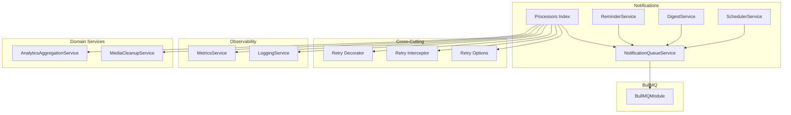
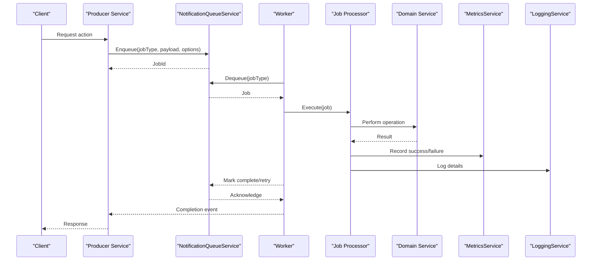
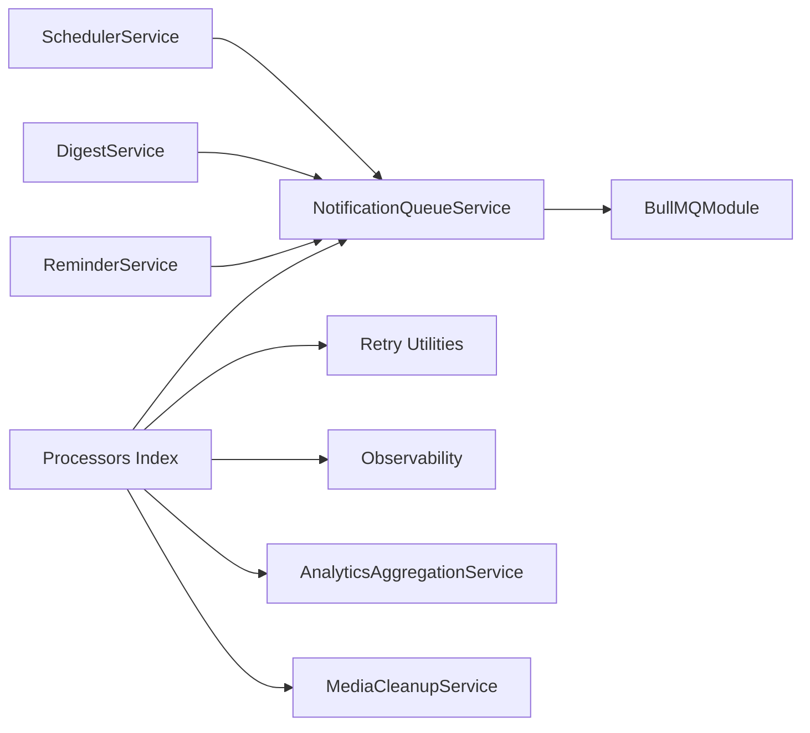

# Notification Processors

<cite>
**Referenced Files in This Document**
- [notifications.module.ts](file://apps/backend/src/notifications/notifications.module.ts)
- [notification-queue.service.ts](file://apps/backend/src/notifications/notification-queue.service.ts)
- [scheduler.service.ts](file://apps/backend/src/notifications/scheduler.service.ts)
- [digest.service.ts](file://apps/backend/src/notifications/digest.service.ts)
- [reminder.service.ts](file://apps/backend/src/notifications/reminder.service.ts)
- [processors/index.ts](file://apps/backend/src/notifications/processors/index.ts)
- [bullmq.module.ts](file://apps/backend/src/bullmq/bullmq.module.ts)
- [common/retry/retry.decorator.ts](file://apps/backend/src/common/retry/retry.decorator.ts)
- [common/retry/retry.interceptor.ts](file://apps/backend/src/common/retry/retry.interceptor.ts)
- [common/retry/retry.options.ts](file://apps/backend/src/common/retry/retry.options.ts)
- [observability/metrics.service.ts](file://apps/backend/src/observability/metrics.service.ts)
- [observability/logging.service.ts](file://apps/backend/src/observability/logging.service.ts)
- [storage/media-cleanup.service.ts](file://apps/backend/src/storage/media-cleanup.service.ts)
- [analytics/analytics-aggregation.service.ts](file://apps/backend/src/analytics/analytics-aggregation.service.ts)
</cite>

## Table of Contents
1. [Introduction](#introduction)
2. [Project Structure](#project-structure)
3. [Core Components](#core-components)
4. [Architecture Overview](#architecture-overview)
5. [Detailed Component Analysis](#detailed-component-analysis)
6. [Dependency Analysis](#dependency-analysis)
7. [Performance Considerations](#performance-considerations)
8. [Troubleshooting Guide](#troubleshooting-guide)
9. [Conclusion](#conclusion)
10. [Appendices](#appendices)

## Introduction
This document explains the notification processor architecture and implementation patterns used to handle asynchronous tasks such as notifications, analytics aggregation, cleanup operations, and wrapped report generation. It covers job processing patterns, error handling strategies, retry logic, monitoring, performance tuning, resource management, and debugging techniques for long-running tasks. The goal is to help developers understand how processors are structured, how to create custom processors, and how to operate them reliably in production.

## Project Structure
The notification subsystem lives under apps/backend/src/notifications and integrates with a background job system via BullMQ. Key responsibilities:
- Queue orchestration and worker lifecycle
- Scheduling recurring jobs (digests, reminders)
- Processor implementations for different job types
- Integration with observability (metrics, logging)
- Cross-cutting concerns like retries and idempotency

**Diagram sources**
- [notification-queue.service.ts](file://apps/backend/src/notifications/notification-queue.service.ts)
- [scheduler.service.ts](file://apps/backend/src/notifications/scheduler.service.ts)
- [digest.service.ts](file://apps/backend/src/notifications/digest.service.ts)
- [reminder.service.ts](file://apps/backend/src/notifications/reminder.service.ts)
- [processors/index.ts](file://apps/backend/src/notifications/processors/index.ts)
- [bullmq.module.ts](file://apps/backend/src/bullmq/bullmq.module.ts)
- [common/retry/retry.decorator.ts](file://apps/backend/src/common/retry/retry.decorator.ts)
- [common/retry/retry.interceptor.ts](file://apps/backend/src/common/retry/retry.interceptor.ts)
- [common/retry/retry.options.ts](file://apps/backend/src/common/retry/retry.options.ts)
- [observability/metrics.service.ts](file://apps/backend/src/observability/metrics.service.ts)
- [observability/logging.service.ts](file://apps/backend/src/observability/logging.service.ts)
- [analytics/analytics-aggregation.service.ts](file://apps/backend/src/analytics/analytics-aggregation.service.ts)
- [storage/media-cleanup.service.ts](file://apps/backend/src/storage/media-cleanup.service.ts)

**Section sources**
- [notifications.module.ts](file://apps/backend/src/notifications/notifications.module.ts)
- [bullmq.module.ts](file://apps/backend/src/bullmq/bullmq.module.ts)

## Core Components
- NotificationQueueService: Central queue manager that registers queues, enqueues jobs, and exposes methods for producers. It coordinates with BullMQ for persistence and concurrency control.
- SchedulerService: Manages recurring schedules (e.g., daily digests, periodic reminders). Uses cron-like scheduling to enqueue jobs at defined intervals.
- DigestService: Aggregates and batches notifications into digest payloads, then enqueues digest processing jobs.
- ReminderService: Creates reminder jobs based on user preferences or external triggers.
- Processors Index: Registry of job processors that implement specific business logic for each job type. Each processor handles execution, retries, metrics, and logging.

Key behaviors:
- Producers enqueue jobs with typed payloads and options (priority, delay, attempts).
- Workers consume jobs from queues and delegate to processors.
- Processors use shared retry utilities and observability services.
- Domain services (analytics, storage) are invoked by processors to perform side effects.

**Section sources**
- [notification-queue.service.ts](file://apps/backend/src/notifications/notification-queue.service.ts)
- [scheduler.service.ts](file://apps/backend/src/notifications/scheduler.service.ts)
- [digest.service.ts](file://apps/backend/src/notifications/digest.service.ts)
- [reminder.service.ts](file://apps/backend/src/notifications/reminder.service.ts)
- [processors/index.ts](file://apps/backend/src/notifications/processors/index.ts)

## Architecture Overview
The notification system follows a producer-consumer pattern backed by BullMQ:
- Producers (services/controllers) enqueue jobs into named queues.
- Consumers (workers) pull jobs and execute processors.
- Processors encapsulate domain logic, integrate with external systems, and emit metrics/logs.
- Retry mechanisms ensure resilience against transient failures.
- Observability provides health checks, metrics, and logs for monitoring.

**Diagram sources**
- [notification-queue.service.ts](file://apps/backend/src/notifications/notification-queue.service.ts)
- [processors/index.ts](file://apps/backend/src/notifications/processors/index.ts)
- [observability/metrics.service.ts](file://apps/backend/src/observability/metrics.service.ts)
- [observability/logging.service.ts](file://apps/backend/src/observability/logging.service.ts)

## Detailed Component Analysis

### NotificationQueueService
Responsibilities:
- Register queues and workers
- Provide enqueue methods for different job types
- Manage concurrency limits and backpressure
- Expose status and health endpoints for queues

Patterns:
- Factory-style registration for new job types
- Typed payloads to ensure schema consistency
- Option propagation (attempts, delay, priority)

Error handling:
- Validation of payloads before enqueueing
- Queue-level error reporting and dead-lettering configuration

Monitoring:
- Metrics for queue depth, processing rate, failure rates
- Logging for enqueue/dequeue events

**Section sources**
- [notification-queue.service.ts](file://apps/backend/src/notifications/notification-queue.service.ts)

### SchedulerService
Responsibilities:
- Define and manage recurring schedules
- Enqueue jobs at specified intervals (cron expressions)
- Handle schedule start/stop and migration of schedules

Patterns:
- Declarative schedule definitions
- Idempotent scheduling to avoid duplicate jobs

Error handling:
- Graceful restarts without losing scheduled jobs
- Fallback mechanisms if scheduling fails

Monitoring:
- Metrics for scheduled job executions and misses

**Section sources**
- [scheduler.service.ts](file://apps/backend/src/notifications/scheduler.service.ts)

### DigestService
Responsibilities:
- Aggregate notifications over time windows
- Build digest payloads and enqueue digest processing jobs
- Support batching and deduplication

Patterns:
- Batch processing to reduce overhead
- Configurable aggregation windows

Error handling:
- Partial failure tolerance within batches
- Retries for failed digest items

Monitoring:
- Metrics for digest size, processing duration, success rate

**Section sources**
- [digest.service.ts](file://apps/backend/src/notifications/digest.service.ts)

### ReminderService
Responsibilities:
- Create reminder jobs based on triggers
- Respect user preferences and frequency limits
- Enqueue reminder jobs with appropriate delays

Patterns:
- Event-driven creation of reminders
- Rate limiting to prevent spam

Error handling:
- Idempotency to avoid duplicate reminders
- Retry on transient errors

Monitoring:
- Metrics for reminder creation and delivery

**Section sources**
- [reminder.service.ts](file://apps/backend/src/notifications/reminder.service.ts)

### Processors Index
Responsibilities:
- Registry of job processors for different job types
- Mapping between job types and processor implementations
- Common initialization and teardown for processors

Patterns:
- Strategy pattern for processor selection
- Shared dependencies injection

Error handling:
- Uniform error wrapping and classification
- Dead-letter routing for unrecoverable jobs

Monitoring:
- Per-processor metrics and logs

**Section sources**
- [processors/index.ts](file://apps/backend/src/notifications/processors/index.ts)

### BullMQ Integration
Responsibilities:
- Configure connection, queues, and workers
- Provide high-throughput job processing
- Persist job state and support retries

Patterns:
- Module-based configuration
- Separation of producer and consumer concerns

Error handling:
- Connection recovery and reconnection
- Job retry policies and backoff strategies

Monitoring:
- Health checks for Redis connectivity
- Metrics for job throughput and latency

**Section sources**
- [bullmq.module.ts](file://apps/backend/src/bullmq/bullmq.module.ts)

### Retry Utilities
Responsibilities:
- Decorators and interceptors to apply retry logic
- Configurable retry options (max attempts, backoff, jitter)
- Automatic retry on transient errors

Patterns:
- Declarative retry via decorators
- Interceptor-based retry for broader scope

Error handling:
- Classification of transient vs permanent errors
- Exponential backoff with jitter

Monitoring:
- Metrics for retry counts and durations

**Section sources**
- [common/retry/retry.decorator.ts](file://apps/backend/src/common/retry/retry.decorator.ts)
- [common/retry/retry.interceptor.ts](file://apps/backend/src/common/retry/retry.interceptor.ts)
- [common/retry/retry.options.ts](file://apps/backend/src/common/retry/retry.options.ts)

### Observability
Responsibilities:
- Emit metrics for job processing (success, failure, duration)
- Structured logging for traceability
- Health indicators for queue and worker status

Patterns:
- Centralized metrics service
- Correlation IDs for request tracing

Error handling:
- Non-blocking metric emission
- Fallback logging when metrics fail

Monitoring:
- Dashboards for queue depth, processing rate, error rates

**Section sources**
- [observability/metrics.service.ts](file://apps/backend/src/observability/metrics.service.ts)
- [observability/logging.service.ts](file://apps/backend/src/observability/logging.service.ts)

### Domain Integrations
- AnalyticsAggregationService: Used by processors to compute analytics aggregates asynchronously.
- MediaCleanupService: Used by cleanup processors to remove obsolete media files safely.

Patterns:
- Domain services are injected into processors
- Transactions and idempotency where applicable

Error handling:
- Robust error propagation to processors
- Rollback strategies for partial failures

Monitoring:
- Metrics for domain operations (aggregation duration, cleanup count)

**Section sources**
- [analytics/analytics-aggregation.service.ts](file://apps/backend/src/analytics/analytics-aggregation.service.ts)
- [storage/media-cleanup.service.ts](file://apps/backend/src/storage/media-cleanup.service.ts)

## Dependency Analysis
The notification subsystem depends on:
- BullMQ for job queuing and worker management
- Retry utilities for resilient processing
- Observability services for metrics and logging
- Domain services for business logic execution

**Diagram sources**
- [notification-queue.service.ts](file://apps/backend/src/notifications/notification-queue.service.ts)
- [bullmq.module.ts](file://apps/backend/src/bullmq/bullmq.module.ts)
- [common/retry/retry.decorator.ts](file://apps/backend/src/common/retry/retry.decorator.ts)
- [common/retry/retry.interceptor.ts](file://apps/backend/src/common/retry/retry.interceptor.ts)
- [common/retry/retry.options.ts](file://apps/backend/src/common/retry/retry.options.ts)
- [observability/metrics.service.ts](file://apps/backend/src/observability/metrics.service.ts)
- [observability/logging.service.ts](file://apps/backend/src/observability/logging.service.ts)
- [analytics/analytics-aggregation.service.ts](file://apps/backend/src/analytics/analytics-aggregation.service.ts)
- [storage/media-cleanup.service.ts](file://apps/backend/src/storage/media-cleanup.service.ts)

**Section sources**
- [notifications.module.ts](file://apps/backend/src/notifications/notifications.module.ts)
- [bullmq.module.ts](file://apps/backend/src/bullmq/bullmq.module.ts)

## Performance Considerations
- Concurrency tuning: Adjust worker concurrency per queue to balance throughput and resource usage.
- Backpressure: Use queue limits and delayed jobs to prevent overload.
- Batching: Group small jobs into larger batches to reduce overhead.
- Idempotency: Ensure processors can safely retry without duplicating side effects.
- Resource management: Avoid holding large objects in memory; stream data where possible.
- Monitoring: Track queue depth, processing latency, and error rates to detect bottlenecks.

[No sources needed since this section provides general guidance]

## Troubleshooting Guide
Common issues and resolutions:
- Jobs not processing: Check BullMQ connection health and queue availability. Verify worker processes are running.
- High failure rates: Inspect processor logs and error classifications. Adjust retry policies and backoff strategies.
- Memory leaks: Monitor memory usage during long-running jobs. Avoid retaining references to large datasets.
- Stuck jobs: Review dead-letter queues and manual reprocessing strategies.
- Schedule drift: Validate scheduler configurations and timezone settings.

Debugging techniques:
- Enable detailed logging for job lifecycle events.
- Use correlation IDs to trace jobs across services.
- Instrument processors with timing metrics for slow operations.
- Simulate failures to validate retry and fallback behavior.

**Section sources**
- [observability/logging.service.ts](file://apps/backend/src/observability/logging.service.ts)
- [observability/metrics.service.ts](file://apps/backend/src/observability/metrics.service.ts)
- [common/retry/retry.interceptor.ts](file://apps/backend/src/common/retry/retry.interceptor.ts)

## Conclusion
The notification processor architecture leverages BullMQ for robust job processing, with clear separation between producers, schedulers, and processors. Retry utilities and observability services provide resilience and insight into system health. By following the patterns outlined here, developers can create custom processors, implement reliable retry logic, and monitor performance effectively. Proper tuning of concurrency, batching, and resource management ensures scalable and efficient processing of long-running tasks.

[No sources needed since this section summarizes without analyzing specific files]

## Appendices

### Creating a Custom Processor
Steps:
- Define a job type and payload schema.
- Implement a processor function that handles the job logic.
- Register the processor in the processors index.
- Inject dependencies (domain services, observability).
- Apply retry decorators or interceptors as needed.
- Emit metrics and logs for visibility.

Best practices:
- Keep processors focused and idempotent.
- Use transactions for database operations.
- Handle transient errors with retry logic.
- Validate inputs and outputs rigorously.

**Section sources**
- [processors/index.ts](file://apps/backend/src/notifications/processors/index.ts)
- [common/retry/retry.decorator.ts](file://apps/backend/src/common/retry/retry.decorator.ts)
- [common/retry/retry.interceptor.ts](file://apps/backend/src/common/retry/retry.interceptor.ts)
- [common/retry/retry.options.ts](file://apps/backend/src/common/retry/retry.options.ts)

### Implementing Retry Logic
Options:
- Use decorators for method-level retries.
- Use interceptors for broader retry coverage.
- Configure max attempts, backoff strategy, and jitter.
- Classify errors as transient or permanent.

Patterns:
- Exponential backoff with jitter to avoid thundering herd.
- Circuit breaker for failing dependencies.
- Dead-letter queues for unrecoverable jobs.

**Section sources**
- [common/retry/retry.decorator.ts](file://apps/backend/src/common/retry/retry.decorator.ts)
- [common/retry/retry.interceptor.ts](file://apps/backend/src/common/retry/retry.interceptor.ts)
- [common/retry/retry.options.ts](file://apps/backend/src/common/retry/retry.options.ts)

### Monitoring Processor Health
Metrics to track:
- Queue depth and processing rate
- Job success and failure rates
- Processing latency percentiles
- Worker utilization and memory usage

Health checks:
- BullMQ connectivity
- Queue availability
- Worker liveness

Dashboards:
- Real-time views of job throughput and errors
- Alerts for anomalies and degradation

**Section sources**
- [observability/metrics.service.ts](file://apps/backend/src/observability/metrics.service.ts)
- [observability/logging.service.ts](file://apps/backend/src/observability/logging.service.ts)