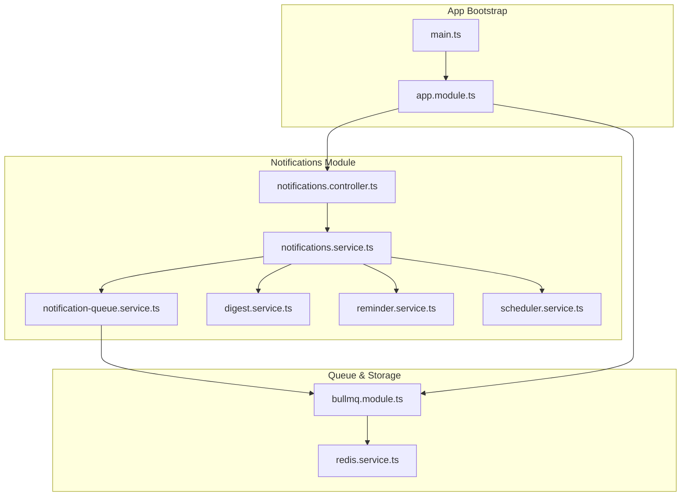
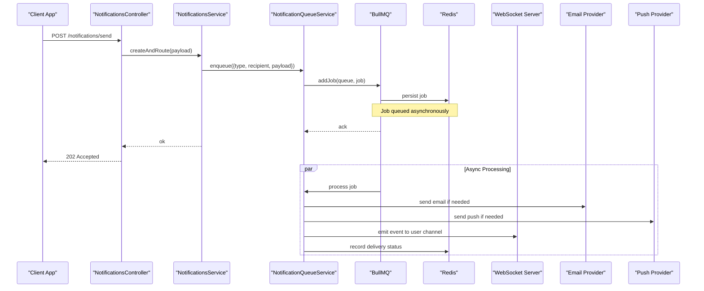
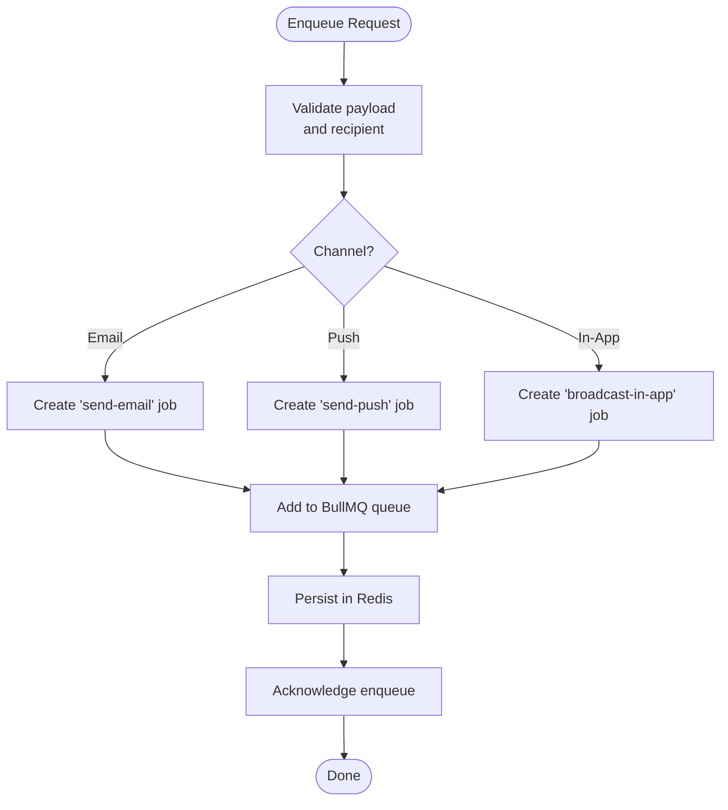
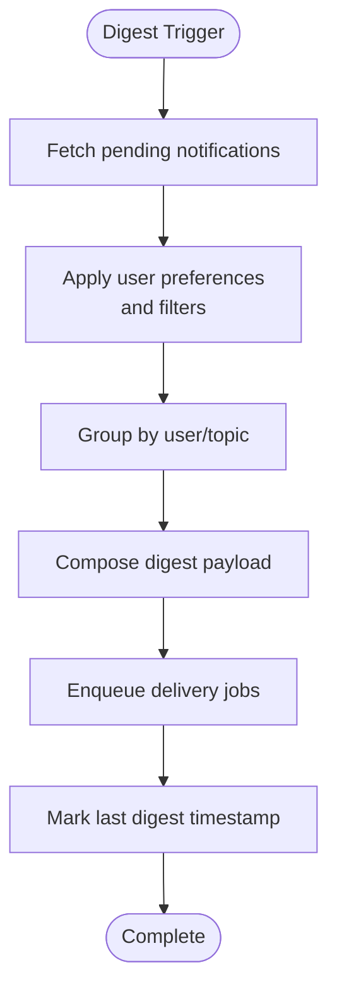
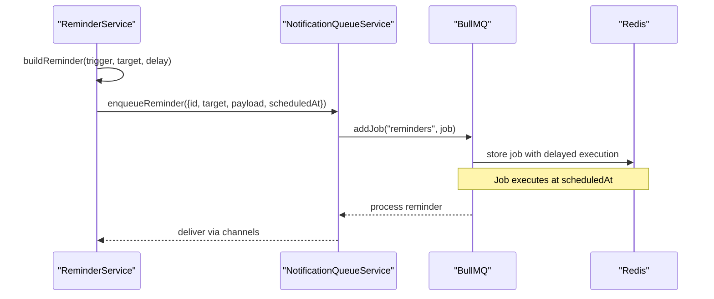
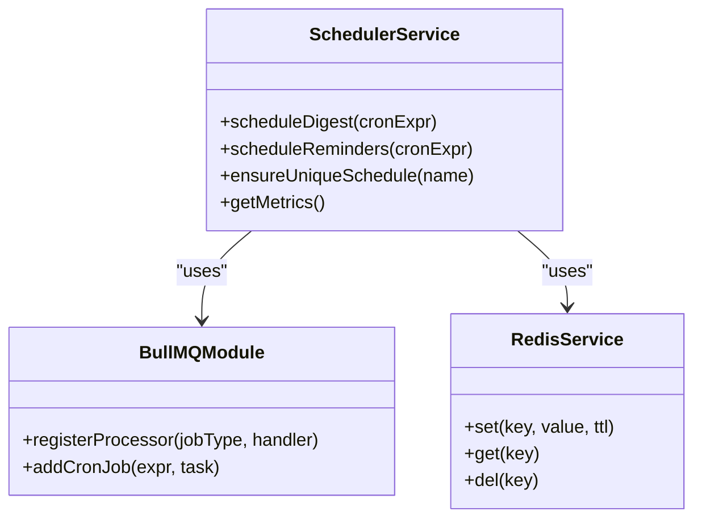
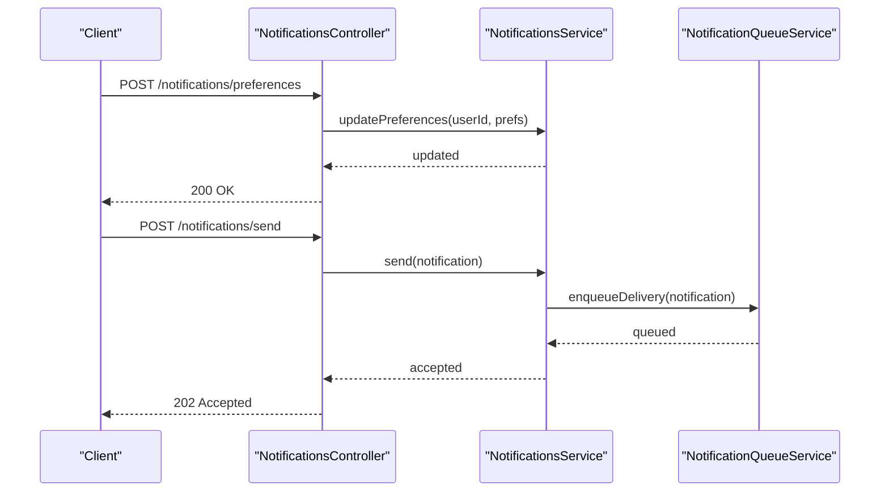
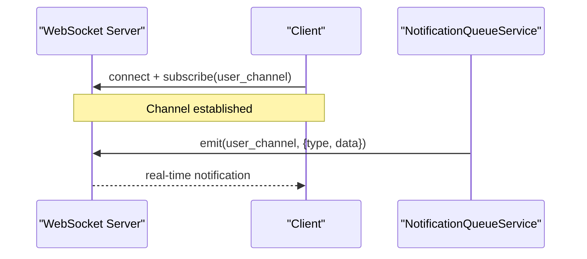
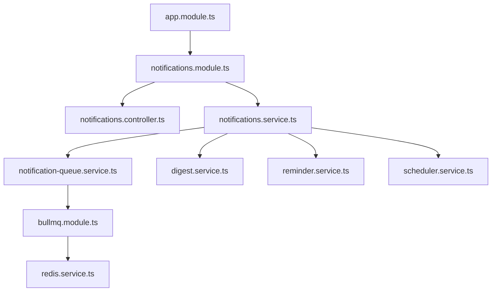

# Notifications & Messaging

<cite>
**Referenced Files in This Document**
- [notifications.module.ts](file://apps/backend/src/notifications/notifications.module.ts)
- [notifications.service.ts](file://apps/backend/src/notifications/notifications.service.ts)
- [notifications.controller.ts](file://apps/backend/src/notifications/notifications.controller.ts)
- [notification-queue.service.ts](file://apps/backend/src/notifications/notification-queue.service.ts)
- [digest.service.ts](file://apps/backend/src/notifications/digest.service.ts)
- [reminder.service.ts](file://apps/backend/src/notifications/reminder.service.ts)
- [scheduler.service.ts](file://apps/backend/src/notifications/scheduler.service.ts)
- [bullmq.module.ts](file://apps/backend/src/bullmq/bullmq.module.ts)
- [redis.service.ts](file://apps/backend/src/redis/redis.service.ts)
- [app.module.ts](file://apps/backend/src/app.module.ts)
- [main.ts](file://apps/backend/src/main.ts)
</cite>

## Table of Contents
1. [Introduction](#introduction)
2. [Project Structure](#project-structure)
3. [Core Components](#core-components)
4. [Architecture Overview](#architecture-overview)
5. [Detailed Component Analysis](#detailed-component-analysis)
6. [Dependency Analysis](#dependency-analysis)
7. [Performance Considerations](#performance-considerations)
8. [Troubleshooting Guide](#troubleshooting-guide)
9. [Conclusion](#conclusion)

## Introduction
This document explains the notification and messaging system implemented in the backend. It covers real-time notifications, email delivery, push notifications, and in-app messaging. It also details queue processing with BullMQ, message routing, delivery guarantees, notification preferences, digest generation, reminder systems, WebSocket integration for real-time updates, scheduling, batch processing, error handling, retry mechanisms, and delivery tracking.

## Project Structure
The notifications subsystem is organized under apps/backend/src/notifications with supporting infrastructure in bullmq, redis, and core modules. Key responsibilities:
- API surface for managing notifications and preferences
- Queue orchestration using BullMQ via Redis
- Scheduling and batching for digests and reminders
- Real-time delivery through WebSocket channels
- Persistence and tracking of notification events

**Diagram sources**
- [notifications.controller.ts](file://apps/backend/src/notifications/notifications.controller.ts)
- [notifications.service.ts](file://apps/backend/src/notifications/notifications.service.ts)
- [notification-queue.service.ts](file://apps/backend/src/notifications/notification-queue.service.ts)
- [digest.service.ts](file://apps/backend/src/notifications/digest.service.ts)
- [reminder.service.ts](file://apps/backend/src/notifications/reminder.service.ts)
- [scheduler.service.ts](file://apps/backend/src/notifications/scheduler.service.ts)
- [bullmq.module.ts](file://apps/backend/src/bullmq/bullmq.module.ts)
- [redis.service.ts](file://apps/backend/src/redis/redis.service.ts)
- [app.module.ts](file://apps/backend/src/app.module.ts)
- [main.ts](file://apps/backend/src/main.ts)

**Section sources**
- [notifications.module.ts](file://apps/backend/src/notifications/notifications.module.ts)
- [bullmq.module.ts](file://apps/backend/src/bullmq/bullmq.module.ts)
- [redis.service.ts](file://apps/backend/src/redis/redis.service.ts)
- [app.module.ts](file://apps/backend/src/app.module.ts)
- [main.ts](file://apps/backend/src/main.ts)

## Core Components
- Controller: Exposes endpoints to create, query, update preferences, and trigger actions related to notifications.
- Service: Orchestrates business logic, composes messages, applies user preferences, and coordinates queues and schedulers.
- Queue Service: Wraps BullMQ to enqueue jobs for email, push, and in-app delivery; manages concurrency and retries.
- Digest Service: Aggregates notifications into periodic summaries based on user preferences and content activity.
- Reminder Service: Generates time-based reminders (e.g., follow-ups, deadlines).
- Scheduler Service: Manages recurring tasks and cron-like schedules for digests and reminders.
- BullMQ Module: Configures Redis connection and job processors.
- Redis Service: Provides low-level Redis operations used by queues and caching.

**Section sources**
- [notifications.controller.ts](file://apps/backend/src/notifications/notifications.controller.ts)
- [notifications.service.ts](file://apps/backend/src/notifications/notifications.service.ts)
- [notification-queue.service.ts](file://apps/backend/src/notifications/notification-queue.service.ts)
- [digest.service.ts](file://apps/backend/src/notifications/digest.service.ts)
- [reminder.service.ts](file://apps/backend/src/notifications/reminder.service.ts)
- [scheduler.service.ts](file://apps/backend/src/notifications/scheduler.service.ts)
- [bullmq.module.ts](file://apps/backend/src/bullmq/bullmq.module.ts)
- [redis.service.ts](file://apps/backend/src/redis/redis.service.ts)

## Architecture Overview
The system uses a decoupled architecture:
- HTTP requests hit the controller, which delegates to the service layer.
- The service enqueues jobs via BullMQ for asynchronous processing.
- Processors consume jobs from Redis-backed queues and deliver via email, push, or in-app channels.
- Real-time updates are pushed over WebSockets to clients subscribed to user-specific channels.
- Schedulers run periodic tasks to generate digests and reminders.

**Diagram sources**
- [notifications.controller.ts](file://apps/backend/src/notifications/notifications.controller.ts)
- [notifications.service.ts](file://apps/backend/src/notifications/notifications.service.ts)
- [notification-queue.service.ts](file://apps/backend/src/notifications/notification-queue.service.ts)
- [bullmq.module.ts](file://apps/backend/src/bullmq/bullmq.module.ts)
- [redis.service.ts](file://apps/backend/src/redis/redis.service.ts)

## Detailed Component Analysis

### Notification Queue Service (BullMQ Integration)
Responsibilities:
- Enqueue jobs for different channels (email, push, in-app).
- Configure concurrency, backoff, and retry policies per job type.
- Track job lifecycle and outcomes for delivery analytics.

Key behaviors:
- Job types include “send-email”, “send-push”, “broadcast-in-app”.
- Retry strategy uses exponential backoff with max attempts.
- Dead-lettering for failed jobs after max retries.

**Diagram sources**
- [notification-queue.service.ts](file://apps/backend/src/notifications/notification-queue.service.ts)
- [bullmq.module.ts](file://apps/backend/src/bullmq/bullmq.module.ts)
- [redis.service.ts](file://apps/backend/src/redis/redis.service.ts)

**Section sources**
- [notification-queue.service.ts](file://apps/backend/src/notifications/notification-queue.service.ts)
- [bullmq.module.ts](file://apps/backend/src/bullmq/bullmq.module.ts)

### Digest Service
Responsibilities:
- Aggregate notifications over configurable windows (daily/weekly).
- Respect user preferences for frequency and channels.
- Generate compact summaries and schedule delivery.

Processing flow:
- Collect pending notifications since last digest.
- Group by topic or user segment.
- Compose digest payload and enqueue delivery jobs.

**Diagram sources**
- [digest.service.ts](file://apps/backend/src/notifications/digest.service.ts)
- [notification-queue.service.ts](file://apps/backend/src/notifications/notification-queue.service.ts)

**Section sources**
- [digest.service.ts](file://apps/backend/src/notifications/digest.service.ts)

### Reminder Service
Responsibilities:
- Create time-bound reminders based on triggers (e.g., upcoming deadlines).
- Schedule one-off or recurring reminders.
- Deliver via preferred channels respecting preferences.

**Diagram sources**
- [reminder.service.ts](file://apps/backend/src/notifications/reminder.service.ts)
- [notification-queue.service.ts](file://apps/backend/src/notifications/notification-queue.service.ts)
- [bullmq.module.ts](file://apps/backend/src/bullmq/bullmq.module.ts)
- [redis.service.ts](file://apps/backend/src/redis/redis.service.ts)

**Section sources**
- [reminder.service.ts](file://apps/backend/src/notifications/reminder.service.ts)

### Scheduler Service
Responsibilities:
- Manage recurring tasks for digests and reminders.
- Ensure idempotent scheduling across instances.
- Provide health checks and metrics for scheduled jobs.

**Diagram sources**
- [scheduler.service.ts](file://apps/backend/src/notifications/scheduler.service.ts)
- [bullmq.module.ts](file://apps/backend/src/bullmq/bullmq.module.ts)
- [redis.service.ts](file://apps/backend/src/redis/redis.service.ts)

**Section sources**
- [scheduler.service.ts](file://apps/backend/src/notifications/scheduler.service.ts)

### Notifications Service and Controller
Responsibilities:
- Controller exposes endpoints for sending notifications, querying history, and updating preferences.
- Service validates inputs, applies preferences, routes to appropriate channels, and tracks delivery.

**Diagram sources**
- [notifications.controller.ts](file://apps/backend/src/notifications/notifications.controller.ts)
- [notifications.service.ts](file://apps/backend/src/notifications/notifications.service.ts)
- [notification-queue.service.ts](file://apps/backend/src/notifications/notification-queue.service.ts)

**Section sources**
- [notifications.controller.ts](file://apps/backend/src/notifications/notifications.controller.ts)
- [notifications.service.ts](file://apps/backend/src/notifications/notifications.service.ts)

### WebSocket Integration for Real-Time Updates
Conceptual flow:
- Clients connect and subscribe to a user-scoped channel.
- When a job completes (especially in-app), the system emits an event to the channel.
- Clients receive real-time updates without polling.

[No sources needed since this diagram shows conceptual workflow, not actual code structure]

## Dependency Analysis
The notifications module depends on BullMQ and Redis for queuing and persistence, and integrates with external providers for email and push delivery. The app bootstrap wires modules together.

**Diagram sources**
- [app.module.ts](file://apps/backend/src/app.module.ts)
- [notifications.module.ts](file://apps/backend/src/notifications/notifications.module.ts)
- [notifications.controller.ts](file://apps/backend/src/notifications/notifications.controller.ts)
- [notifications.service.ts](file://apps/backend/src/notifications/notifications.service.ts)
- [notification-queue.service.ts](file://apps/backend/src/notifications/notification-queue.service.ts)
- [bullmq.module.ts](file://apps/backend/src/bullmq/bullmq.module.ts)
- [redis.service.ts](file://apps/backend/src/redis/redis.service.ts)
- [digest.service.ts](file://apps/backend/src/notifications/digest.service.ts)
- [reminder.service.ts](file://apps/backend/src/notifications/reminder.service.ts)
- [scheduler.service.ts](file://apps/backend/src/notifications/scheduler.service.ts)

**Section sources**
- [app.module.ts](file://apps/backend/src/app.module.ts)
- [notifications.module.ts](file://apps/backend/src/notifications/notifications.module.ts)

## Performance Considerations
- Use separate queues per channel to prevent contention between high-volume and latency-sensitive jobs.
- Tune concurrency limits per queue based on provider rate limits and resource availability.
- Implement batching for in-app broadcasts to reduce WebSocket overhead.
- Cache user preferences and channel routing rules to minimize lookups.
- Monitor queue depth, job latency, and failure rates; set alerts for anomalies.
- Prefer idempotent operations and deduplication keys for retries.

[No sources needed since this section provides general guidance]

## Troubleshooting Guide
Common issues and resolutions:
- Jobs stuck or not processing:
  - Verify Redis connectivity and BullMQ worker processes.
  - Check for dead-lettered jobs and reprocess or investigate failures.
- Delivery failures:
  - Inspect provider error responses (email/push).
  - Review retry policies and backoff settings.
- Duplicate notifications:
  - Ensure idempotency keys are set for each delivery attempt.
  - Deduplicate at the consumer level.
- High latency:
  - Scale workers horizontally.
  - Optimize payload sizes and batch where possible.
- Missing real-time updates:
  - Confirm WebSocket subscriptions and channel names.
  - Validate event emission paths from job processors.

**Section sources**
- [notification-queue.service.ts](file://apps/backend/src/notifications/notification-queue.service.ts)
- [bullmq.module.ts](file://apps/backend/src/bullmq/bullmq.module.ts)
- [redis.service.ts](file://apps/backend/src/redis/redis.service.ts)

## Conclusion
The notifications and messaging system leverages BullMQ and Redis for robust, scalable, and reliable delivery across email, push, and in-app channels. Preferences-driven routing, digest generation, and reminder scheduling provide flexible user experiences. Real-time updates via WebSockets complement asynchronous processing. Proper configuration of retries, batching, and monitoring ensures resilience and performance.

[No sources needed since this section summarizes without analyzing specific files]