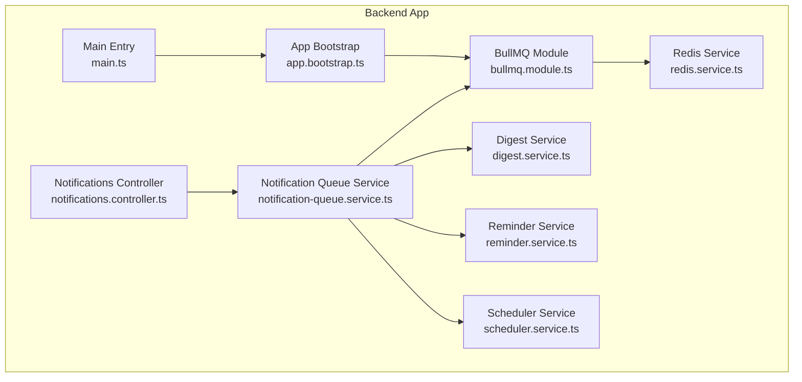
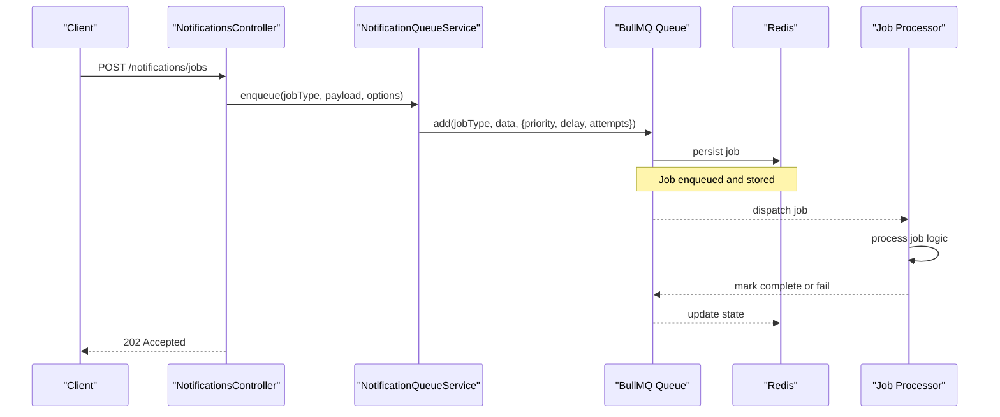
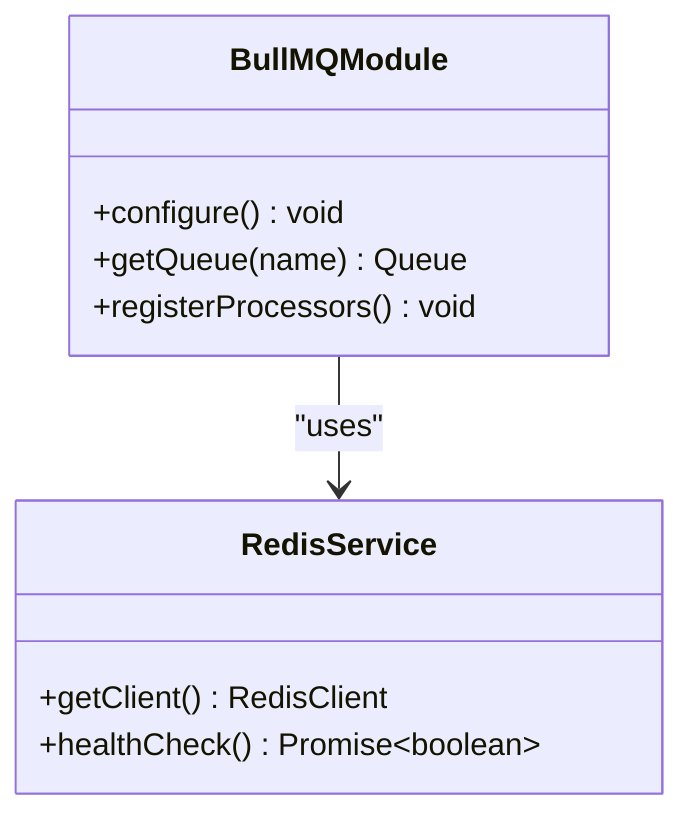
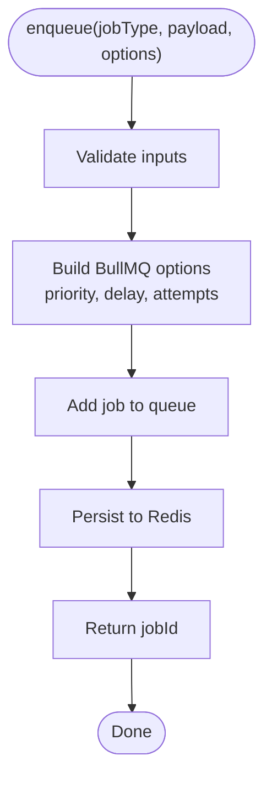
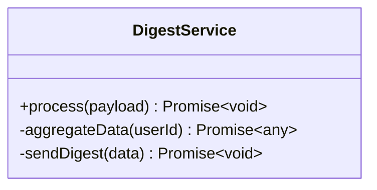
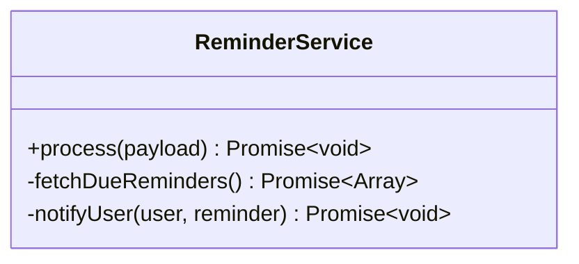
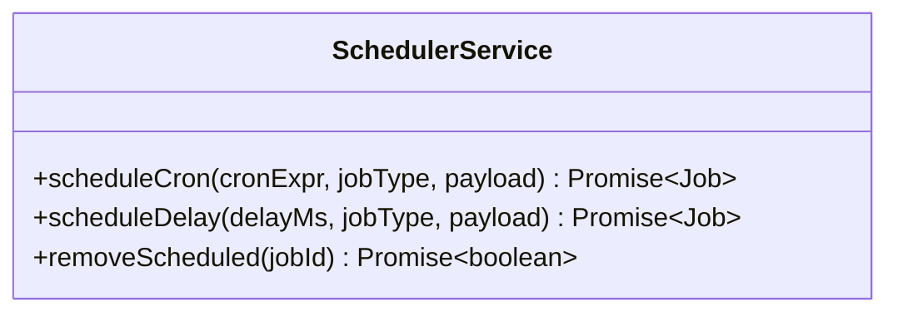
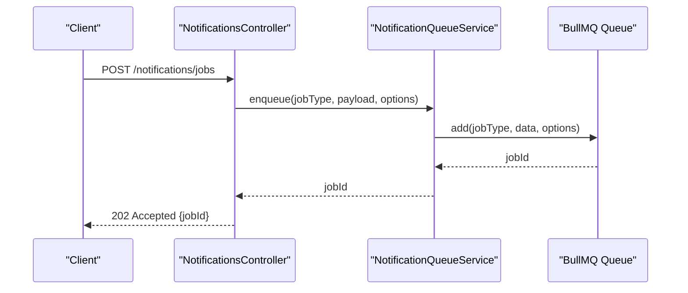
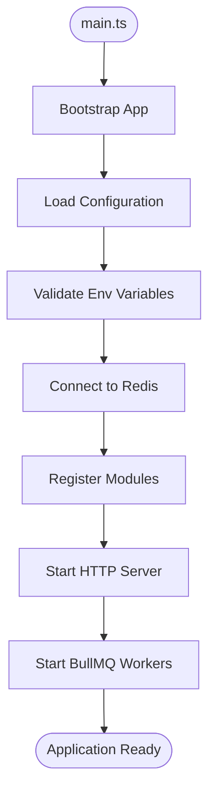
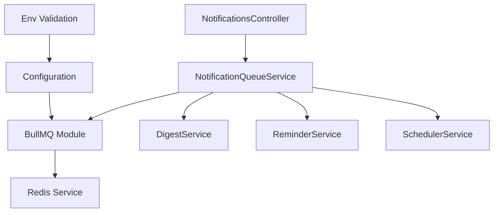

# Queue Processing & BullMQ

<cite>
**Referenced Files in This Document**
- [bullmq.module.ts](file://apps/backend/src/bullmq/bullmq.module.ts)
- [notifications.service.ts](file://apps/backend/src/notifications/notifications.service.ts)
- [notification-queue.service.ts](file://apps/backend/src/notifications/notification-queue.service.ts)
- [digest.service.ts](file://apps/backend/src/notifications/digest.service.ts)
- [reminder.service.ts](file://apps/backend/src/notifications/reminder.service.ts)
- [scheduler.service.ts](file://apps/backend/src/notifications/scheduler.service.ts)
- [notifications.controller.ts](file://apps/backend/src/notifications/notifications.controller.ts)
- [redis.service.ts](file://apps/backend/src/redis/redis.service.ts)
- [configuration.ts](file://apps/backend/src/config/configuration.ts)
- [env.validation.ts](file://apps/backend/src/config/env.validation.ts)
- [app.bootstrap.ts](file://apps/backend/src/app.bootstrap.ts)
- [main.ts](file://apps/backend/src/main.ts)
</cite>

## Table of Contents
1. [Introduction](#introduction)
2. [Project Structure](#project-structure)
3. [Core Components](#core-components)
4. [Architecture Overview](#architecture-overview)
5. [Detailed Component Analysis](#detailed-component-analysis)
6. [Dependency Analysis](#dependency-analysis)
7. [Performance Considerations](#performance-considerations)
8. [Troubleshooting Guide](#troubleshooting-guide)
9. [Conclusion](#conclusion)
10. [Appendices](#appendices)

## Introduction
This document explains the notification queue processing system built with BullMQ in the backend application. It covers how jobs are created, how queues are configured, how workers process jobs, and how job lifecycles are managed. It also details priority handling, retry mechanisms, error handling strategies, monitoring capabilities, and scaling considerations. Practical examples illustrate creating different types of notification jobs, configuring queue workers, and implementing custom processors.

## Project Structure
The notification queue functionality is implemented under the notifications module and integrates with a shared BullMQ configuration and Redis service. Key files include:
- BullMQ module configuration
- Notification services for enqueueing and scheduling
- Processors for specific job types (digest, reminder, etc.)
- Controller endpoints to trigger jobs
- Redis and configuration modules that provide connection and environment settings

**Diagram sources**
- [main.ts](file://apps/backend/src/main.ts)
- [app.bootstrap.ts](file://apps/backend/src/app.bootstrap.ts)
- [bullmq.module.ts](file://apps/backend/src/bullmq/bullmq.module.ts)
- [redis.service.ts](file://apps/backend/src/redis/redis.service.ts)
- [notifications.controller.ts](file://apps/backend/src/notifications/notifications.controller.ts)
- [notification-queue.service.ts](file://apps/backend/src/notifications/notification-queue.service.ts)
- [digest.service.ts](file://apps/backend/src/notifications/digest.service.ts)
- [reminder.service.ts](file://apps/backend/src/notifications/reminder.service.ts)
- [scheduler.service.ts](file://apps/backend/src/notifications/scheduler.service.ts)

**Section sources**
- [bullmq.module.ts](file://apps/backend/src/bullmq/bullmq.module.ts)
- [notifications.service.ts](file://apps/backend/src/notifications/notifications.service.ts)
- [notification-queue.service.ts](file://apps/backend/src/notifications/notification-queue.service.ts)
- [digest.service.ts](file://apps/backend/src/notifications/digest.service.ts)
- [reminder.service.ts](file://apps/backend/src/notifications/reminder.service.ts)
- [scheduler.service.ts](file://apps/backend/src/notifications/scheduler.service.ts)
- [notifications.controller.ts](file://apps/backend/src/notifications/notifications.controller.ts)
- [redis.service.ts](file://apps/backend/src/redis/redis.service.ts)
- [configuration.ts](file://apps/backend/src/config/configuration.ts)
- [env.validation.ts](file://apps/backend/src/config/env.validation.ts)
- [app.bootstrap.ts](file://apps/backend/src/app.bootstrap.ts)
- [main.ts](file://apps/backend/src/main.ts)

## Core Components
- BullMQ Module: Configures the BullMQ connection using Redis and exports queue instances for use across the app.
- Notification Queue Service: Centralized service to enqueue jobs, set priorities, schedule jobs, and manage lifecycle events.
- Processors: Dedicated services for digest generation, reminders, and scheduled tasks that implement job handlers.
- Controller: Exposes HTTP endpoints to create and manage notification jobs.
- Redis Service: Provides Redis client configuration and health checks.
- Configuration: Loads environment variables and validates required settings for Redis and BullMQ.

Key responsibilities:
- Job creation with options such as priority, delay, repeat schedules, and retries.
- Worker registration for each job type.
- Error handling and logging within processors.
- Monitoring via BullMQ event hooks and metrics.

**Section sources**
- [bullmq.module.ts](file://apps/backend/src/bullmq/bullmq.module.ts)
- [notification-queue.service.ts](file://apps/backend/src/notifications/notification-queue.service.ts)
- [digest.service.ts](file://apps/backend/src/notifications/digest.service.ts)
- [reminder.service.ts](file://apps/backend/src/notifications/reminder.service.ts)
- [scheduler.service.ts](file://apps/backend/src/notifications/scheduler.service.ts)
- [notifications.controller.ts](file://apps/backend/src/notifications/notifications.controller.ts)
- [redis.service.ts](file://apps/backend/src/redis/redis.service.ts)
- [configuration.ts](file://apps/backend/src/config/configuration.ts)
- [env.validation.ts](file://apps/backend/src/config/env.validation.ts)

## Architecture Overview
The system follows a producer-consumer pattern:
- Producers (controllers and services) enqueue jobs into BullMQ queues.
- Workers (processors) consume jobs from queues and execute business logic.
- Redis acts as the persistent store for queues and job state.
- Configuration and environment validation ensure correct setup.

**Diagram sources**
- [notifications.controller.ts](file://apps/backend/src/notifications/notifications.controller.ts)
- [notification-queue.service.ts](file://apps/backend/src/notifications/notification-queue.service.ts)
- [bullmq.module.ts](file://apps/backend/src/bullmq/bullmq.module.ts)
- [redis.service.ts](file://apps/backend/src/redis/redis.service.ts)

## Detailed Component Analysis

### BullMQ Module
- Purpose: Initialize BullMQ with Redis connection settings and export named queues.
- Responsibilities:
  - Read Redis configuration from environment.
  - Create and configure queue instances.
  - Provide dependency injection tokens for queues.

**Diagram sources**
- [bullmq.module.ts](file://apps/backend/src/bullmq/bullmq.module.ts)
- [redis.service.ts](file://apps/backend/src/redis/redis.service.ts)

**Section sources**
- [bullmq.module.ts](file://apps/backend/src/bullmq/bullmq.module.ts)
- [redis.service.ts](file://apps/backend/src/redis/redis.service.ts)
- [configuration.ts](file://apps/backend/src/config/configuration.ts)
- [env.validation.ts](file://apps/backend/src/config/env.validation.ts)

### Notification Queue Service
- Purpose: Encapsulates job creation, scheduling, and lifecycle management.
- Responsibilities:
  - Enqueue jobs with options like priority, delay, repeat cron expressions, and retry attempts.
  - Track job IDs for later inspection or cancellation.
  - Emit events for success/failure and integrate with observability.

**Diagram sources**
- [notification-queue.service.ts](file://apps/backend/src/notifications/notification-queue.service.ts)

**Section sources**
- [notification-queue.service.ts](file://apps/backend/src/notifications/notification-queue.service.ts)

### Digest Service
- Purpose: Implements processor logic for digest generation jobs.
- Responsibilities:
  - Aggregate user activity or content for periodic digests.
  - Handle retries on transient failures.
  - Update downstream systems or send notifications upon completion.

**Diagram sources**
- [digest.service.ts](file://apps/backend/src/notifications/digest.service.ts)

**Section sources**
- [digest.service.ts](file://apps/backend/src/notifications/digest.service.ts)

### Reminder Service
- Purpose: Implements processor logic for reminder jobs.
- Responsibilities:
  - Check due reminders and notify users.
  - Manage idempotency to avoid duplicate reminders.
  - Log outcomes and handle errors gracefully.

**Diagram sources**
- [reminder.service.ts](file://apps/backend/src/notifications/reminder.service.ts)

**Section sources**
- [reminder.service.ts](file://apps/backend/src/notifications/reminder.service.ts)

### Scheduler Service
- Purpose: Manages recurring and delayed jobs.
- Responsibilities:
  - Schedule periodic digest runs using cron expressions.
  - Enqueue delayed jobs for time-based triggers.
  - Monitor scheduled jobs and adjust schedules dynamically if needed.

**Diagram sources**
- [scheduler.service.ts](file://apps/backend/src/notifications/scheduler.service.ts)

**Section sources**
- [scheduler.service.ts](file://apps/backend/src/notifications/scheduler.service.ts)

### Notifications Controller
- Purpose: Exposes HTTP endpoints to create and manage notification jobs.
- Responsibilities:
  - Accept payloads and options from clients.
  - Delegate job creation to the Notification Queue Service.
  - Return immediate acceptance responses for async processing.

**Diagram sources**
- [notifications.controller.ts](file://apps/backend/src/notifications/notifications.controller.ts)
- [notification-queue.service.ts](file://apps/backend/src/notifications/notification-queue.service.ts)

**Section sources**
- [notifications.controller.ts](file://apps/backend/src/notifications/notifications.controller.ts)
- [notification-queue.service.ts](file://apps/backend/src/notifications/notification-queue.service.ts)

### Application Bootstrap and Main Entry
- Purpose: Initialize NestJS application, register modules, and start the server.
- Responsibilities:
  - Load configuration and validate environment variables.
  - Ensure Redis connectivity before starting workers.
  - Register BullMQ processors and start listening for jobs.

**Diagram sources**
- [main.ts](file://apps/backend/src/main.ts)
- [app.bootstrap.ts](file://apps/backend/src/app.bootstrap.ts)
- [configuration.ts](file://apps/backend/src/config/configuration.ts)
- [env.validation.ts](file://apps/backend/src/config/env.validation.ts)

**Section sources**
- [main.ts](file://apps/backend/src/main.ts)
- [app.bootstrap.ts](file://apps/backend/src/app.bootstrap.ts)
- [configuration.ts](file://apps/backend/src/config/configuration.ts)
- [env.validation.ts](file://apps/backend/src/config/env.validation.ts)

## Dependency Analysis
The notification queue system depends on:
- Redis for persistence and coordination.
- BullMQ for queue operations and worker management.
- Configuration and environment validation for runtime settings.
- Controllers and services for job orchestration.

**Diagram sources**
- [notifications.controller.ts](file://apps/backend/src/notifications/notifications.controller.ts)
- [notification-queue.service.ts](file://apps/backend/src/notifications/notification-queue.service.ts)
- [bullmq.module.ts](file://apps/backend/src/bullmq/bullmq.module.ts)
- [redis.service.ts](file://apps/backend/src/redis/redis.service.ts)
- [digest.service.ts](file://apps/backend/src/notifications/digest.service.ts)
- [reminder.service.ts](file://apps/backend/src/notifications/reminder.service.ts)
- [scheduler.service.ts](file://apps/backend/src/notifications/scheduler.service.ts)
- [configuration.ts](file://apps/backend/src/config/configuration.ts)
- [env.validation.ts](file://apps/backend/src/config/env.validation.ts)

**Section sources**
- [notifications.controller.ts](file://apps/backend/src/notifications/notifications.controller.ts)
- [notification-queue.service.ts](file://apps/backend/src/notifications/notification-queue.service.ts)
- [bullmq.module.ts](file://apps/backend/src/bullmq/bullmq.module.ts)
- [redis.service.ts](file://apps/backend/src/redis/redis.service.ts)
- [digest.service.ts](file://apps/backend/src/notifications/digest.service.ts)
- [reminder.service.ts](file://apps/backend/src/notifications/reminder.service.ts)
- [scheduler.service.ts](file://apps/backend/src/notifications/scheduler.service.ts)
- [configuration.ts](file://apps/backend/src/config/configuration.ts)
- [env.validation.ts](file://apps/backend/src/config/env.validation.ts)

## Performance Considerations
- Concurrency: Tune worker concurrency per queue to match CPU and I/O characteristics.
- Backpressure: Use rate limiting and backoff strategies to prevent Redis overload.
- Batching: Batch small jobs where possible to reduce overhead.
- Memory: Monitor memory usage and tune Redis and Node.js heap settings.
- Scaling: Run multiple worker processes horizontally; ensure idempotent processors.
- Monitoring: Enable metrics and logs to detect bottlenecks early.

[No sources needed since this section provides general guidance]

## Troubleshooting Guide
Common issues and approaches:
- Connection failures: Verify Redis connectivity and credentials; check network policies.
- Stalled jobs: Inspect stalled job lists and reprocess if necessary.
- Retry storms: Adjust max attempts and backoff delays; log failure reasons.
- Priority anomalies: Confirm priority values and queue ordering behavior.
- Scheduling problems: Validate cron expressions and timezone settings.
- Observability: Use logs and metrics to trace job lifecycle and identify failures.

**Section sources**
- [notification-queue.service.ts](file://apps/backend/src/notifications/notification-queue.service.ts)
- [redis.service.ts](file://apps/backend/src/redis/redis.service.ts)
- [configuration.ts](file://apps/backend/src/config/configuration.ts)
- [env.validation.ts](file://apps/backend/src/config/env.validation.ts)

## Conclusion
The notification queue system leverages BullMQ and Redis to reliably process asynchronous tasks. By centralizing job creation, configuring robust workers, and implementing clear error handling and monitoring, the system scales effectively and remains maintainable. Following the patterns outlined here will help you extend the system with new job types and optimize performance for production workloads.

[No sources needed since this section summarizes without analyzing specific files]

## Appendices

### Examples of Creating Different Types of Notification Jobs
- Immediate job with priority:
  - Use the Notification Queue Service to enqueue an immediate job with a specified priority value.
- Delayed job:
  - Enqueue a job with a delay option to run after a certain duration.
- Recurring job:
  - Schedule a job using a cron expression for periodic execution.
- Retry with backoff:
  - Configure max attempts and exponential backoff for resilient processing.

[No sources needed since this section provides general guidance]

### Configuring Queue Workers
- Define processors for each job type.
- Set concurrency limits based on workload characteristics.
- Implement graceful shutdown and error handling within processors.
- Integrate logging and metrics for observability.

[No sources needed since this section provides general guidance]

### Implementing Custom Processors
- Create a service method to handle job payloads.
- Validate inputs and handle edge cases.
- Perform business logic and side effects safely.
- Mark jobs as completed or failed appropriately.

[No sources needed since this section provides general guidance]