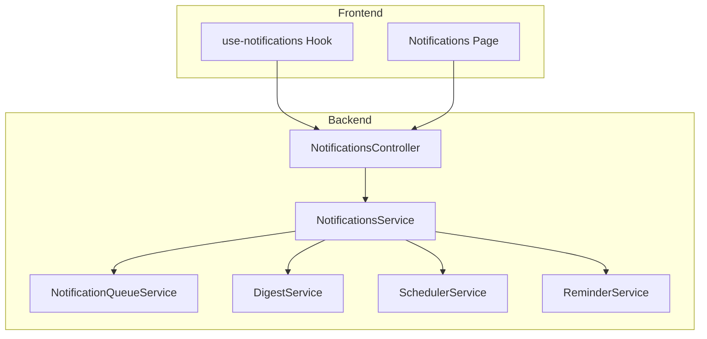
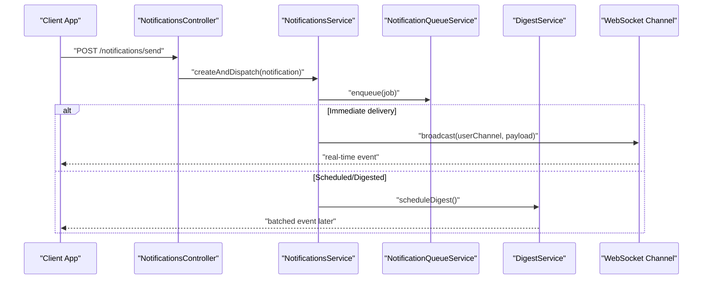
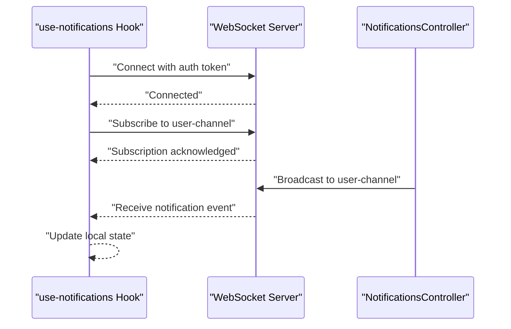
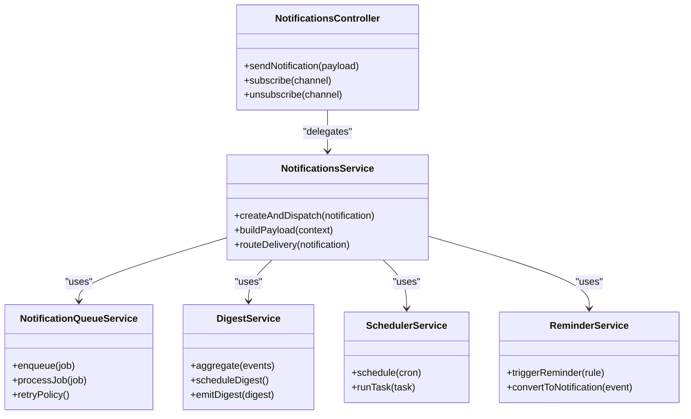
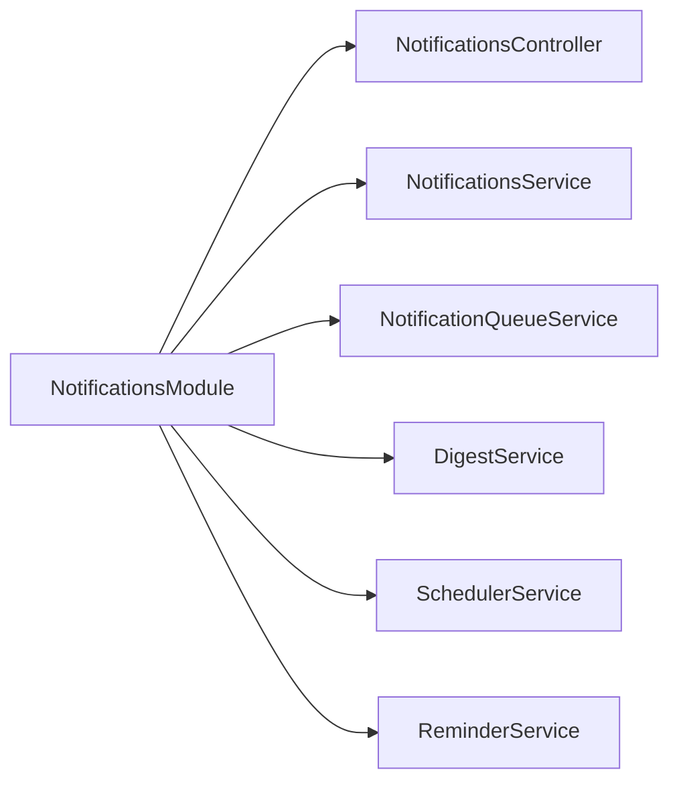

# Real-time Notifications

<cite>
**Referenced Files in This Document**
- [notifications.module.ts](file://apps/backend/src/notifications/notifications.module.ts)
- [notifications.controller.ts](file://apps/backend/src/notifications/notifications.controller.ts)
- [notifications.service.ts](file://apps/backend/src/notifications/notifications.service.ts)
- [notification-queue.service.ts](file://apps/backend/src/notifications/notification-queue.service.ts)
- [digest.service.ts](file://apps/backend/src/notifications/digest.service.ts)
- [scheduler.service.ts](file://apps/backend/src/notifications/scheduler.service.ts)
- [reminder.service.ts](file://apps/backend/src/notifications/reminder.service.ts)
- [index.ts](file://apps/backend/src/notifications/index.ts)
- [use-notifications.ts](file://src/hooks/use-notifications.ts)
- [app.notifications.tsx](file://src/routes/app.notifications.tsx)
</cite>

## Table of Contents
1. [Introduction](#introduction)
2. [Project Structure](#project-structure)
3. [Core Components](#core-components)
4. [Architecture Overview](#architecture-overview)
5. [Detailed Component Analysis](#detailed-component-analysis)
6. [Dependency Analysis](#dependency-analysis)
7. [Performance Considerations](#performance-considerations)
8. [Troubleshooting Guide](#troubleshooting-guide)
9. [Conclusion](#conclusion)
10. [Appendices](#appendices)

## Introduction
This document explains the real-time notification delivery system, focusing on WebSocket-based communication, connection management, message broadcasting, and user-specific notifications. It also covers notification types, payload structures, client-side integration patterns, examples for sending updates, handling connection events, managing preferences, and scalability considerations including connection pooling and error recovery.

## Project Structure
The real-time notifications feature is implemented as a NestJS module with controllers, services, queues, schedulers, and digesting logic. The frontend integrates via a React hook and a dedicated route page.

**Diagram sources**
- [notifications.controller.ts](file://apps/backend/src/notifications/notifications.controller.ts)
- [notifications.service.ts](file://apps/backend/src/notifications/notifications.service.ts)
- [notification-queue.service.ts](file://apps/backend/src/notifications/notification-queue.service.ts)
- [digest.service.ts](file://apps/backend/src/notifications/digest.service.ts)
- [scheduler.service.ts](file://apps/backend/src/notifications/scheduler.service.ts)
- [reminder.service.ts](file://apps/backend/src/notifications/reminder.service.ts)
- [use-notifications.ts](file://src/hooks/use-notifications.ts)
- [app.notifications.tsx](file://src/routes/app.notifications.tsx)

**Section sources**
- [notifications.module.ts](file://apps/backend/src/notifications/notifications.module.ts)
- [index.ts](file://apps/backend/src/notifications/index.ts)
- [use-notifications.ts](file://src/hooks/use-notifications.ts)
- [app.notifications.tsx](file://src/routes/app.notifications.tsx)

## Core Components
- NotificationsController: Exposes endpoints to trigger real-time notifications and manage subscriptions.
- NotificationsService: Orchestrates notification creation, routing, and dispatch to queues or direct channels.
- NotificationQueueService: Manages background jobs for reliable delivery and retry policies.
- DigestService: Aggregates notifications into periodic digests to reduce noise.
- SchedulerService: Schedules recurring tasks (e.g., daily digests).
- ReminderService: Handles reminder-driven notifications.
- Frontend Hook (use-notifications): Establishes WebSocket connections, subscribes to channels, and handles incoming messages.
- Notifications Page: UI component that consumes the hook to display live updates.

**Section sources**
- [notifications.controller.ts](file://apps/backend/src/notifications/notifications.controller.ts)
- [notifications.service.ts](file://apps/backend/src/notifications/notifications.service.ts)
- [notification-queue.service.ts](file://apps/backend/src/notifications/notification-queue.service.ts)
- [digest.service.ts](file://apps/backend/src/notifications/digest.service.ts)
- [scheduler.service.ts](file://apps/backend/src/notifications/scheduler.service.ts)
- [reminder.service.ts](file://apps/backend/src/notifications/reminder.service.ts)
- [use-notifications.ts](file://src/hooks/use-notifications.ts)
- [app.notifications.tsx](file://src/routes/app.notifications.tsx)

## Architecture Overview
The system uses a controller-driven entry point to enqueue or broadcast notifications. Services coordinate between persistence, queuing, and scheduling. The frontend maintains a persistent WebSocket connection to receive real-time updates per user.

**Diagram sources**
- [notifications.controller.ts](file://apps/backend/src/notifications/notifications.controller.ts)
- [notifications.service.ts](file://apps/backend/src/notifications/notifications.service.ts)
- [notification-queue.service.ts](file://apps/backend/src/notifications/notification-queue.service.ts)
- [digest.service.ts](file://apps/backend/src/notifications/digest.service.ts)

## Detailed Component Analysis

### NotificationsController
Responsibilities:
- Define endpoints to send notifications and manage subscription topics.
- Validate payloads and delegate processing to the service layer.
- Return appropriate HTTP responses and errors.

Key behaviors:
- Endpoint for immediate delivery triggers synchronous or queued dispatch.
- Subscription endpoints allow clients to register interest in specific channels.

**Section sources**
- [notifications.controller.ts](file://apps/backend/src/notifications/notifications.controller.ts)

### NotificationsService
Responsibilities:
- Build notification payloads and determine delivery strategy (immediate vs. scheduled).
- Interact with queue and digest services.
- Manage user-scoped channels for targeted delivery.

Processing flow:
- Validates input and enriches context.
- Chooses delivery path based on type and policy.
- Emits events to WebSocket channels or enqueues jobs.

**Section sources**
- [notifications.service.ts](file://apps/backend/src/notifications/notifications.service.ts)

### NotificationQueueService
Responsibilities:
- Enqueue notifications with retry policies and backoff strategies.
- Process jobs asynchronously to avoid blocking request paths.
- Track job status and handle failures gracefully.

Operational notes:
- Supports deduplication and rate limiting per user/channel.
- Integrates with a durable queue backend for reliability.

**Section sources**
- [notification-queue.service.ts](file://apps/backend/src/notifications/notification-queue.service.ts)

### DigestService
Responsibilities:
- Aggregate multiple notifications into a single digest.
- Respect user preferences and frequency settings.
- Emit batched events at configured intervals.

Scheduling:
- Uses scheduler to run periodic aggregation tasks.
- Merges similar notifications to reduce noise.

**Section sources**
- [digest.service.ts](file://apps/backend/src/notifications/digest.service.ts)
- [scheduler.service.ts](file://apps/backend/src/notifications/scheduler.service.ts)

### ReminderService
Responsibilities:
- Trigger reminders based on rules or user actions.
- Convert reminder events into notifications with contextual payloads.
- Integrate with scheduler for time-based execution.

**Section sources**
- [reminder.service.ts](file://apps/backend/src/notifications/reminder.service.ts)

### Frontend Integration (Hook and Page)
- use-notifications Hook:
  - Establishes WebSocket connection with authentication.
  - Subscribes to user-specific channels and topic filters.
  - Handles reconnection, heartbeat, and error states.
  - Exposes methods to send actions and subscribe/unsubscribe.
- app.notifications.tsx:
  - Renders live notifications using data from the hook.
  - Provides UI controls for preference toggles and channel subscriptions.

**Section sources**
- [use-notifications.ts](file://src/hooks/use-notifications.ts)
- [app.notifications.tsx](file://src/routes/app.notifications.tsx)

#### WebSocket Connection Flow

**Diagram sources**
- [use-notifications.ts](file://src/hooks/use-notifications.ts)
- [notifications.controller.ts](file://apps/backend/src/notifications/notifications.controller.ts)

#### Class Relationships

**Diagram sources**
- [notifications.controller.ts](file://apps/backend/src/notifications/notifications.controller.ts)
- [notifications.service.ts](file://apps/backend/src/notifications/notifications.service.ts)
- [notification-queue.service.ts](file://apps/backend/src/notifications/notification-queue.service.ts)
- [digest.service.ts](file://apps/backend/src/notifications/digest.service.ts)
- [scheduler.service.ts](file://apps/backend/src/notifications/scheduler.service.ts)
- [reminder.service.ts](file://apps/backend/src/notifications/reminder.service.ts)

## Dependency Analysis
Module composition ensures clear separation of concerns and testability. The module registers controllers, services, and providers required for real-time delivery.

**Diagram sources**
- [notifications.module.ts](file://apps/backend/src/notifications/notifications.module.ts)

**Section sources**
- [notifications.module.ts](file://apps/backend/src/notifications/notifications.module.ts)
- [index.ts](file://apps/backend/src/notifications/index.ts)

## Performance Considerations
- Connection Pooling:
  - Maintain a pool of WebSocket connections per process; scale horizontally with sticky sessions or shared channels.
  - Use Redis pub/sub or a message bus to fan out messages across instances.
- Message Broadcasting:
  - Prefer user-scoped channels to minimize fan-out overhead.
  - Batch small notifications into digests when appropriate.
- Retry and Backoff:
  - Implement exponential backoff with jitter for failed deliveries.
  - Dead-letter queues for unrecoverable jobs.
- Rate Limiting:
  - Apply per-user and per-channel limits to prevent abuse.
- Memory Management:
  - Stream large payloads; avoid holding entire message histories in memory.
- Observability:
  - Log connection lifecycle events and message throughput metrics.

[No sources needed since this section provides general guidance]

## Troubleshooting Guide
Common issues and resolutions:
- WebSocket Disconnections:
  - Implement heartbeat/ping-pong; auto-reconnect with backoff.
  - Verify token validity and refresh before reconnecting.
- Missing Notifications:
  - Check queue job status and dead-letter entries.
  - Ensure user-channel subscriptions are active and authenticated.
- High Latency:
  - Profile digest batching intervals and queue worker concurrency.
  - Inspect network conditions and server resource utilization.
- Duplicate Messages:
  - Enable idempotency keys for critical operations.
  - Deduplicate by message ID or content hash.

**Section sources**
- [use-notifications.ts](file://src/hooks/use-notifications.ts)
- [notification-queue.service.ts](file://apps/backend/src/notifications/notification-queue.service.ts)

## Conclusion
The real-time notification system combines robust backend orchestration with efficient frontend integration. By leveraging queues, digests, and schedulers, it balances immediacy with performance. Proper WebSocket management, user-scoped channels, and scalable architecture ensure reliable delivery under load.

[No sources needed since this section summarizes without analyzing specific files]

## Appendices

### Notification Types and Payloads
- Types:
  - System alerts, user mentions, activity updates, reminders, and digests.
- Payload Structure:
  - Includes identifiers, timestamps, target user/channel, type, and content fields.
  - Optional metadata for analytics and filtering.

[No sources needed since this section provides general guidance]

### Client-Side Integration Patterns
- Establish WebSocket on app initialization with secure tokens.
- Subscribe to user-specific channels and optional topic filters.
- Handle events to update UI state and persist unread counts.
- Manage reconnection and error states gracefully.

**Section sources**
- [use-notifications.ts](file://src/hooks/use-notifications.ts)
- [app.notifications.tsx](file://src/routes/app.notifications.tsx)

### Examples
- Sending Real-Time Updates:
  - Call the controller endpoint to enqueue or broadcast a notification.
- Handling Connection Events:
  - Listen for connect, disconnect, and error events in the hook.
- Managing Preferences:
  - Toggle channels and digest frequency via UI controls backed by API calls.

[No sources needed since this section provides general guidance]