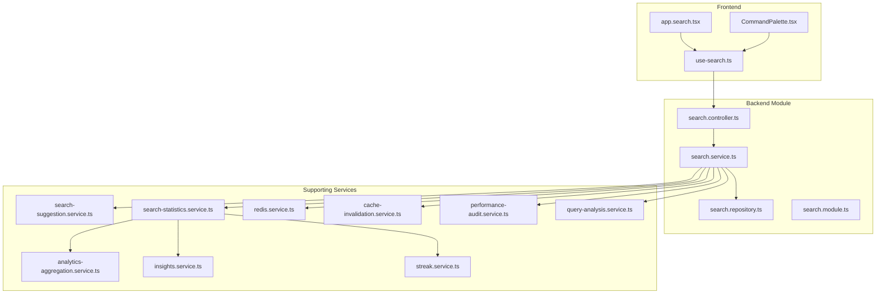
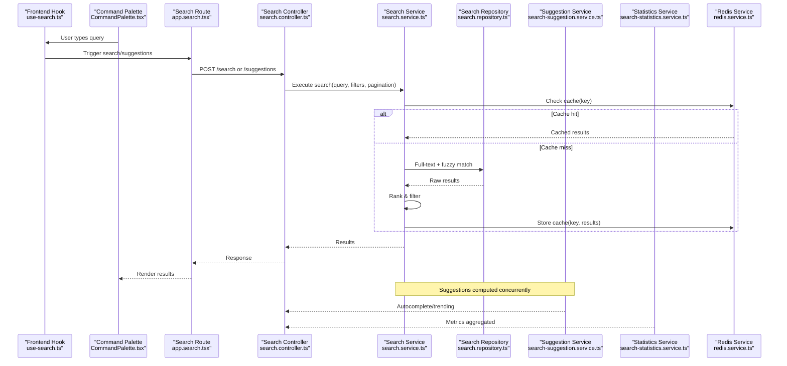
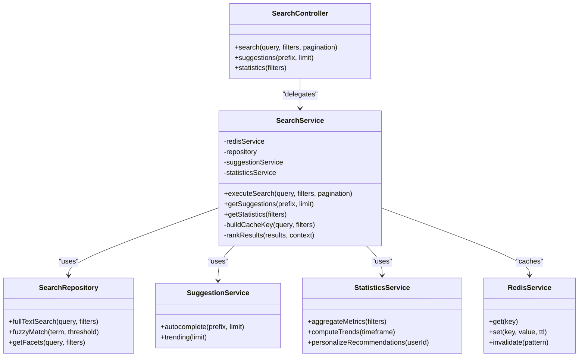
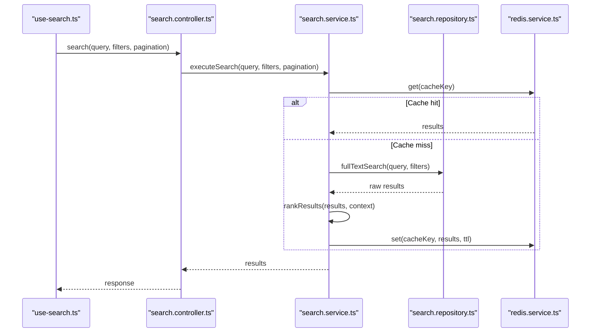
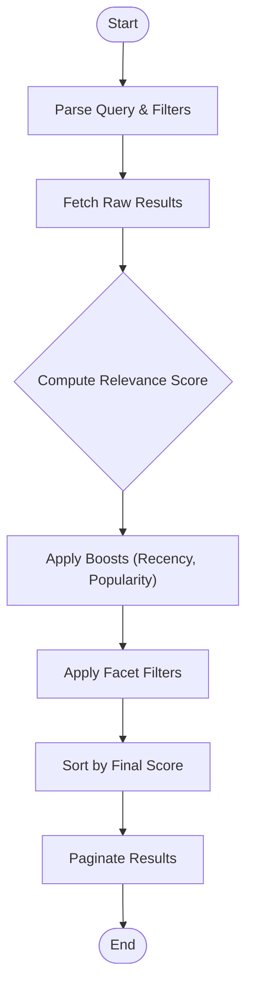
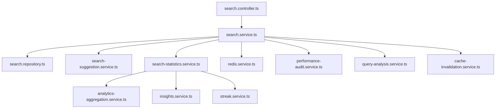

# Search & Discovery

<cite>
**Referenced Files in This Document**
- [search.controller.ts](file://apps/backend/src/search/search.controller.ts)
- [search.service.ts](file://apps/backend/src/search/search.service.ts)
- [search.repository.ts](file://apps/backend/src/search/search.repository.ts)
- [search.module.ts](file://apps/backend/src/search/search.module.ts)
- [search-statistics.service.ts](file://apps/backend/src/search/search-statistics.service.ts)
- [search-suggestion.service.ts](file://apps/backend/src/search/search-suggestion.service.ts)
- [use-search.ts](file://src/hooks/use-search.ts)
- [CommandPalette.tsx](file://src/components/search/CommandPalette.tsx)
- [app.search.tsx](file://src/routes/app.search.tsx)
- [redis.service.ts](file://apps/backend/src/redis/redis.service.ts)
- [cache-invalidation.service.ts](file://apps/backend/src/hardening/cache-invalidation.service.ts)
- [performance-audit.service.ts](file://apps/backend/src/hardening/performance-audit.service.ts)
- [query-analysis.service.ts](file://apps/backend/src/hardening/query-analysis.service.ts)
- [analytics-aggregation.service.ts](file://apps/backend/src/analytics/analytics-aggregation.service.ts)
- [insights.service.ts](file://apps/backend/src/analytics/insights.service.ts)
- [streak.service.ts](file://apps/backend/src/analytics/streak.service.ts)
</cite>

## Table of Contents
1. [Introduction](#introduction)
2. [Project Structure](#project-structure)
3. [Core Components](#core-components)
4. [Architecture Overview](#architecture-overview)
5. [Detailed Component Analysis](#detailed-component-analysis)
6. [Dependency Analysis](#dependency-analysis)
7. [Performance Considerations](#performance-considerations)
8. [Troubleshooting Guide](#troubleshooting-guide)
9. [Conclusion](#conclusion)
10. [Appendices](#appendices)

## Introduction
This document explains the search and discovery system implemented across the backend and frontend. It covers full-text search, fuzzy matching, autocomplete, indexing strategies, query optimization, result ranking, suggestion engines, trending content, personalized recommendations, advanced filters, faceted navigation, and search analytics. It also outlines performance optimizations such as caching and scalability considerations for high-throughput search workloads.

## Project Structure
The search and discovery features are organized into a dedicated backend module and corresponding frontend hooks and UI components:
- Backend module exposes REST endpoints for search queries, suggestions, and statistics.
- Frontend integrates via a custom hook and a command palette component to provide responsive search experiences.

**Diagram sources**
- [search.controller.ts](file://apps/backend/src/search/search.controller.ts)
- [search.service.ts](file://apps/backend/src/search/search.service.ts)
- [search.repository.ts](file://apps/backend/src/search/search.repository.ts)
- [search.module.ts](file://apps/backend/src/search/search.module.ts)
- [search-suggestion.service.ts](file://apps/backend/src/search/search-suggestion.service.ts)
- [search-statistics.service.ts](file://apps/backend/src/search/search-statistics.service.ts)
- [redis.service.ts](file://apps/backend/src/redis/redis.service.ts)
- [cache-invalidation.service.ts](file://apps/backend/src/hardening/cache-invalidation.service.ts)
- [performance-audit.service.ts](file://apps/backend/src/hardening/performance-audit.service.ts)
- [query-analysis.service.ts](file://apps/backend/src/hardening/query-analysis.service.ts)
- [analytics-aggregation.service.ts](file://apps/backend/src/analytics/analytics-aggregation.service.ts)
- [insights.service.ts](file://apps/backend/src/analytics/insights.service.ts)
- [streak.service.ts](file://apps/backend/src/analytics/streak.service.ts)
- [use-search.ts](file://src/hooks/use-search.ts)
- [CommandPalette.tsx](file://src/components/search/CommandPalette.tsx)
- [app.search.tsx](file://src/routes/app.search.tsx)

**Section sources**
- [search.controller.ts](file://apps/backend/src/search/search.controller.ts)
- [search.service.ts](file://apps/backend/src/search/search.service.ts)
- [search.repository.ts](file://apps/backend/src/search/search.repository.ts)
- [search.module.ts](file://apps/backend/src/search/search.module.ts)
- [use-search.ts](file://src/hooks/use-search.ts)
- [CommandPalette.tsx](file://src/components/search/CommandPalette.tsx)
- [app.search.tsx](file://src/routes/app.search.tsx)

## Core Components
- Search Controller: Exposes endpoints for search queries, suggestions, and statistics. Handles request validation and response formatting.
- Search Service: Orchestrates search logic, including query parsing, filtering, ranking, and caching interactions.
- Search Repository: Encapsulates data access for search indexes and related entities.
- Suggestion Service: Provides autocomplete and trending suggestions based on recent queries and popularity signals.
- Statistics Service: Aggregates search metrics (queries, clicks, conversions) and powers analytics dashboards.
- Redis Service: Provides low-latency caching for frequent queries and suggestions.
- Performance and Query Analysis Services: Monitor slow queries, analyze execution plans, and suggest optimizations.
- Cache Invalidation Service: Ensures cache consistency when underlying data changes.
- Analytics Services: Provide aggregation, insights, and streak tracking for user engagement patterns.

**Section sources**
- [search.controller.ts](file://apps/backend/src/search/search.controller.ts)
- [search.service.ts](file://apps/backend/src/search/search.service.ts)
- [search.repository.ts](file://apps/backend/src/search/search.repository.ts)
- [search-suggestion.service.ts](file://apps/backend/src/search/search-suggestion.service.ts)
- [search-statistics.service.ts](file://apps/backend/src/search/search-statistics.service.ts)
- [redis.service.ts](file://apps/backend/src/redis/redis.service.ts)
- [performance-audit.service.ts](file://apps/backend/src/hardening/performance-audit.service.ts)
- [query-analysis.service.ts](file://apps/backend/src/hardening/query-analysis.service.ts)
- [cache-invalidation.service.ts](file://apps/backend/src/hardening/cache-invalidation.service.ts)
- [analytics-aggregation.service.ts](file://apps/backend/src/analytics/analytics-aggregation.service.ts)
- [insights.service.ts](file://apps/backend/src/analytics/insights.service.ts)
- [streak.service.ts](file://apps/backend/src/analytics/streak.service.ts)

## Architecture Overview
The search flow begins at the frontend with the search route and command palette invoking the backend controller. The service coordinates indexing lookups, ranking, and caching, while the repository handles persistence. Suggestions and statistics are computed by specialized services, leveraging Redis for fast reads and analytics services for aggregations.

**Diagram sources**
- [use-search.ts](file://src/hooks/use-search.ts)
- [CommandPalette.tsx](file://src/components/search/CommandPalette.tsx)
- [app.search.tsx](file://src/routes/app.search.tsx)
- [search.controller.ts](file://apps/backend/src/search/search.controller.ts)
- [search.service.ts](file://apps/backend/src/search/search.service.ts)
- [search.repository.ts](file://apps/backend/src/search/search.repository.ts)
- [search-suggestion.service.ts](file://apps/backend/src/search/search-suggestion.service.ts)
- [search-statistics.service.ts](file://apps/backend/src/search/search-statistics.service.ts)
- [redis.service.ts](file://apps/backend/src/redis/redis.service.ts)

## Detailed Component Analysis

### Search Controller
Responsibilities:
- Define endpoints for search queries, suggestions, and statistics.
- Validate inputs and normalize parameters.
- Delegate to the search service and return structured responses.

Key behaviors:
- Request validation ensures safe query parameters.
- Responses include metadata like total count, facets, and suggested terms.

**Section sources**
- [search.controller.ts](file://apps/backend/src/search/search.controller.ts)

### Search Service
Responsibilities:
- Orchestrate search operations: full-text search, fuzzy matching, filtering, sorting, and ranking.
- Manage caching strategy using Redis.
- Integrate with suggestion and statistics services.

Key algorithms:
- Full-text search leverages indexed fields for relevance scoring.
- Fuzzy matching applies edit-distance heuristics for typo tolerance.
- Ranking combines textual relevance, recency, and user interaction signals.

Caching:
- Cache keys derived from normalized query and filters.
- TTL-based expiration with invalidation triggers on data mutations.

**Section sources**
- [search.service.ts](file://apps/backend/src/search/search.service.ts)
- [redis.service.ts](file://apps/backend/src/redis/redis.service.ts)
- [cache-invalidation.service.ts](file://apps/backend/src/hardening/cache-invalidation.service.ts)

### Search Repository
Responsibilities:
- Implement data access for search indexes and related entities.
- Optimize queries with appropriate indexes and projections.

Optimization techniques:
- Use partial projections to reduce payload size.
- Leverage composite indexes for common filter combinations.

**Section sources**
- [search.repository.ts](file://apps/backend/src/search/search.repository.ts)

### Suggestion Service
Responsibilities:
- Generate autocomplete suggestions based on prefix matching and popularity.
- Surface trending terms from recent queries and click-through rates.

Algorithms:
- Prefix trie or inverted index for fast completions.
- Popularity scoring combining frequency decay and recency weighting.

**Section sources**
- [search-suggestion.service.ts](file://apps/backend/src/search/search-suggestion.service.ts)

### Statistics Service
Responsibilities:
- Aggregate search metrics: query volume, click-through rate, conversion events.
- Power dashboards and insights for trending content and personalized recommendations.

Analytics integration:
- Uses aggregation, insights, and streak services to compute trends and engagement patterns.

**Section sources**
- [search-statistics.service.ts](file://apps/backend/src/search/search-statistics.service.ts)
- [analytics-aggregation.service.ts](file://apps/backend/src/analytics/analytics-aggregation.service.ts)
- [insights.service.ts](file://apps/backend/src/analytics/insights.service.ts)
- [streak.service.ts](file://apps/backend/src/analytics/streak.service.ts)

### Frontend Integration
- use-search hook encapsulates API calls, local state, and debounced queries.
- CommandPalette provides keyboard-driven search and suggestions.
- app.search route renders results and manages pagination/filters.

UX considerations:
- Debounce input to reduce network requests.
- Show loading skeletons and empty states gracefully.
- Persist recent searches locally for quick access.

**Section sources**
- [use-search.ts](file://src/hooks/use-search.ts)
- [CommandPalette.tsx](file://src/components/search/CommandPalette.tsx)
- [app.search.tsx](file://src/routes/app.search.tsx)

### Class Diagram

**Diagram sources**
- [search.controller.ts](file://apps/backend/src/search/search.controller.ts)
- [search.service.ts](file://apps/backend/src/search/search.service.ts)
- [search.repository.ts](file://apps/backend/src/search/search.repository.ts)
- [search-suggestion.service.ts](file://apps/backend/src/search/search-suggestion.service.ts)
- [search-statistics.service.ts](file://apps/backend/src/search/search-statistics.service.ts)
- [redis.service.ts](file://apps/backend/src/redis/redis.service.ts)

### Sequence Diagram: Search Flow

**Diagram sources**
- [use-search.ts](file://src/hooks/use-search.ts)
- [search.controller.ts](file://apps/backend/src/search/search.controller.ts)
- [search.service.ts](file://apps/backend/src/search/search.service.ts)
- [search.repository.ts](file://apps/backend/src/search/search.repository.ts)
- [redis.service.ts](file://apps/backend/src/redis/redis.service.ts)

### Flowchart: Ranking Algorithm

**Diagram sources**
- [search.service.ts](file://apps/backend/src/search/search.service.ts)
- [search.repository.ts](file://apps/backend/src/search/search.repository.ts)

## Dependency Analysis
The search module depends on core infrastructure services for caching, performance monitoring, and analytics. Tight coupling is minimized through clear interfaces between controller, service, repository, and supporting services.

**Diagram sources**
- [search.controller.ts](file://apps/backend/src/search/search.controller.ts)
- [search.service.ts](file://apps/backend/src/search/search.service.ts)
- [search.repository.ts](file://apps/backend/src/search/search.repository.ts)
- [search-suggestion.service.ts](file://apps/backend/src/search/search-suggestion.service.ts)
- [search-statistics.service.ts](file://apps/backend/src/search/search-statistics.service.ts)
- [redis.service.ts](file://apps/backend/src/redis/redis.service.ts)
- [analytics-aggregation.service.ts](file://apps/backend/src/analytics/analytics-aggregation.service.ts)
- [insights.service.ts](file://apps/backend/src/analytics/insights.service.ts)
- [streak.service.ts](file://apps/backend/src/analytics/streak.service.ts)
- [performance-audit.service.ts](file://apps/backend/src/hardening/performance-audit.service.ts)
- [query-analysis.service.ts](file://apps/backend/src/hardening/query-analysis.service.ts)
- [cache-invalidation.service.ts](file://apps/backend/src/hardening/cache-invalidation.service.ts)

**Section sources**
- [search.controller.ts](file://apps/backend/src/search/search.controller.ts)
- [search.service.ts](file://apps/backend/src/search/search.service.ts)
- [search.repository.ts](file://apps/backend/src/search/search.repository.ts)
- [search-suggestion.service.ts](file://apps/backend/src/search/search-suggestion.service.ts)
- [search-statistics.service.ts](file://apps/backend/src/search/search-statistics.service.ts)
- [redis.service.ts](file://apps/backend/src/redis/redis.service.ts)
- [analytics-aggregation.service.ts](file://apps/backend/src/analytics/analytics-aggregation.service.ts)
- [insights.service.ts](file://apps/backend/src/analytics/insights.service.ts)
- [streak.service.ts](file://apps/backend/src/analytics/streak.service.ts)
- [performance-audit.service.ts](file://apps/backend/src/hardening/performance-audit.service.ts)
- [query-analysis.service.ts](file://apps/backend/src/hardening/query-analysis.service.ts)
- [cache-invalidation.service.ts](file://apps/backend/src/hardening/cache-invalidation.service.ts)

## Performance Considerations
- Caching Strategy:
  - Cache frequently accessed queries and suggestions with TTLs.
  - Invalidate caches on data mutations to maintain consistency.
- Query Optimization:
  - Use appropriate indexes for full-text and facet filters.
  - Analyze slow queries and adjust execution plans.
- Scalability:
  - Horizontal scaling of search nodes behind a load balancer.
  - Sharding indexes by domain or tenant if needed.
- Frontend Optimizations:
  - Debounce input and implement virtualization for large result sets.
  - Prefetch popular suggestions and trending terms.

[No sources needed since this section provides general guidance]

## Troubleshooting Guide
Common issues and resolutions:
- Slow search queries:
  - Use query analysis to identify bottlenecks and add missing indexes.
  - Reduce payload size with projections and limit fields returned.
- Cache misses or stale data:
  - Verify cache key normalization and TTL settings.
  - Ensure cache invalidation triggers fire on updates.
- Incorrect rankings:
  - Review boost weights and relevance scoring formulas.
  - Incorporate user interaction signals to refine ranking.
- Suggestion accuracy:
  - Tune prefix thresholds and popularity decay functions.
  - Monitor trending term freshness and update frequencies.

**Section sources**
- [query-analysis.service.ts](file://apps/backend/src/hardening/query-analysis.service.ts)
- [performance-audit.service.ts](file://apps/backend/src/hardening/performance-audit.service.ts)
- [cache-invalidation.service.ts](file://apps/backend/src/hardening/cache-invalidation.service.ts)
- [search.service.ts](file://apps/backend/src/search/search.service.ts)
- [search-suggestion.service.ts](file://apps/backend/src/search/search-suggestion.service.ts)

## Conclusion
The search and discovery system combines robust backend services with an intuitive frontend experience. Full-text search, fuzzy matching, and autocomplete are powered by optimized indexing and ranking algorithms. Caching and analytics ensure responsiveness and actionable insights. With careful attention to performance and scalability, the system supports growing user bases and complex query patterns.

[No sources needed since this section summarizes without analyzing specific files]

## Appendices
- Advanced Filters:
  - Support for multi-facet filtering with efficient index usage.
  - Dynamic facet generation based on current query context.
- Personalized Recommendations:
  - Leverage user history, preferences, and interaction signals.
  - Blend collaborative filtering with content-based approaches.
- Search Analytics:
  - Track query volumes, click-through rates, and conversion metrics.
  - Visualize trends and derive insights for content curation.

[No sources needed since this section provides general guidance]