# User Management & Profiles

<cite>
**Referenced Files in This Document**
- [users.controller.ts](file://apps/backend/src/users/users.controller.ts)
- [users.service.ts](file://apps/backend/src/users/users.service.ts)
- [users.repository.ts](file://apps/backend/src/users/users.repository.ts)
- [users.types.ts](file://apps/backend/src/users/users.types.ts)
- [auth.controller.ts](file://apps/backend/src/auth/auth.controller.ts)
- [auth.service.ts](file://apps/backend/src/auth/auth.service.ts)
- [auth.module.ts](file://apps/backend/src/auth/auth.module.ts)
- [schema.prisma](file://apps/backend/prisma/schema.prisma)
- [notifications.service.ts](file://apps/backend/src/notifications/notifications.service.ts)
- [storage.service.ts](file://apps/backend/src/storage/storage.service.ts)
- [image.service.ts](file://apps/backend/src/storage/image.service.ts)
- [analytics.service.ts](file://apps/backend/src/analytics/analytics.service.ts)
- [interaction.service.ts](file://apps/backend/src/interaction/interaction.service.ts)
- [app.module.ts](file://apps/backend/src/app.module.ts)
- [main.ts](file://apps/backend/src/main.ts)
</cite>

## Table of Contents
1. [Introduction](#introduction)
2. [Project Structure](#project-structure)
3. [Core Components](#core-components)
4. [Architecture Overview](#architecture-overview)
5. [Detailed Component Analysis](#detailed-component-analysis)
6. [Dependency Analysis](#dependency-analysis)
7. [Performance Considerations](#performance-considerations)
8. [Troubleshooting Guide](#troubleshooting-guide)
9. [Conclusion](#conclusion)
10. [Appendices](#appendices)

## Introduction
This document explains the user management system with a focus on profile creation, customization, and preferences. It covers data models for users, avatar management, privacy settings, activity tracking, session management, account security, notification settings, customization options, data export, account deletion, GDPR compliance, roles and permissions, and administrative features. The backend is implemented as a NestJS application with Prisma for data access and integrates storage services for media handling.

## Project Structure
The user management functionality is primarily located under apps/backend/src/users, with supporting modules for authentication, notifications, storage, analytics, and interaction tracking. The database schema is defined in Prisma and consumed via repositories and services. Controllers expose HTTP endpoints, while services orchestrate business logic and repositories handle persistence.

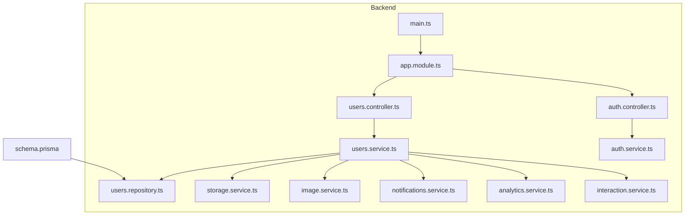

**Diagram sources**
- [users.controller.ts](file://apps/backend/src/users/users.controller.ts)
- [users.service.ts](file://apps/backend/src/users/users.service.ts)
- [users.repository.ts](file://apps/backend/src/users/users.repository.ts)
- [storage.service.ts](file://apps/backend/src/storage/storage.service.ts)
- [image.service.ts](file://apps/backend/src/storage/image.service.ts)
- [notifications.service.ts](file://apps/backend/src/notifications/notifications.service.ts)
- [analytics.service.ts](file://apps/backend/src/analytics/analytics.service.ts)
- [interaction.service.ts](file://apps/backend/src/interaction/interaction.service.ts)
- [auth.controller.ts](file://apps/backend/src/auth/auth.controller.ts)
- [auth.service.ts](file://apps/backend/src/auth/auth.service.ts)
- [app.module.ts](file://apps/backend/src/app.module.ts)
- [main.ts](file://apps/backend/src/main.ts)
- [schema.prisma](file://apps/backend/prisma/schema.prisma)

**Section sources**
- [users.controller.ts](file://apps/backend/src/users/users.controller.ts)
- [users.service.ts](file://apps/backend/src/users/users.service.ts)
- [users.repository.ts](file://apps/backend/src/users/users.repository.ts)
- [auth.controller.ts](file://apps/backend/src/auth/auth.controller.ts)
- [auth.service.ts](file://apps/backend/src/auth/auth.service.ts)
- [app.module.ts](file://apps/backend/src/app.module.ts)
- [main.ts](file://apps/backend/src/main.ts)
- [schema.prisma](file://apps/backend/prisma/schema.prisma)

## Core Components
- Users Controller: Exposes endpoints for profile CRUD, preferences, avatars, and account lifecycle operations.
- Users Service: Implements business logic for profile creation/update, avatar upload/processing, privacy toggles, preferences, notifications, exports, and deletion workflows.
- Users Repository: Persists user entities and related records using Prisma.
- Auth Module: Handles authentication flows, sessions/tokens, password resets, and role-based access control.
- Storage Services: Manage uploads, image processing, and signed URLs for avatars and profile assets.
- Notifications Service: Manages user notification preferences and delivery channels.
- Analytics and Interaction Services: Track user activities and interactions for insights and personalization.

**Section sources**
- [users.controller.ts](file://apps/backend/src/users/users.controller.ts)
- [users.service.ts](file://apps/backend/src/users/users.service.ts)
- [users.repository.ts](file://apps/backend/src/users/users.repository.ts)
- [auth.controller.ts](file://apps/backend/src/auth/auth.controller.ts)
- [auth.service.ts](file://apps/backend/src/auth/auth.service.ts)
- [storage.service.ts](file://apps/backend/src/storage/storage.service.ts)
- [image.service.ts](file://apps/backend/src/storage/image.service.ts)
- [notifications.service.ts](file://apps/backend/src/notifications/notifications.service.ts)
- [analytics.service.ts](file://apps/backend/src/analytics/analytics.service.ts)
- [interaction.service.ts](file://apps/backend/src/interaction/interaction.service.ts)

## Architecture Overview
The user management system follows a layered architecture:
- Controllers receive HTTP requests and delegate to services.
- Services coordinate domain logic, integrate with storage and notification services, and call repositories for persistence.
- Repositories interact with the database through Prisma.
- Authentication guards protect sensitive endpoints and enforce roles/permissions.

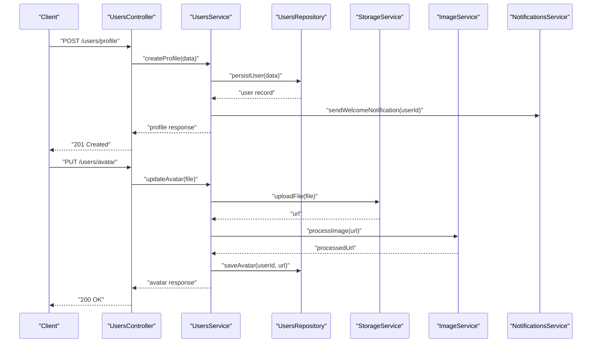

**Diagram sources**
- [users.controller.ts](file://apps/backend/src/users/users.controller.ts)
- [users.service.ts](file://apps/backend/src/users/users.service.ts)
- [users.repository.ts](file://apps/backend/src/users/users.repository.ts)
- [storage.service.ts](file://apps/backend/src/storage/storage.service.ts)
- [image.service.ts](file://apps/backend/src/storage/image.service.ts)
- [notifications.service.ts](file://apps/backend/src/notifications/notifications.service.ts)

## Detailed Component Analysis

### Data Models and Schema
- User entity includes identifiers, profile fields (name, bio, timezone), privacy flags, preferences, and timestamps.
- Avatar references are stored alongside user records or in a dedicated relation.
- Preferences include notification settings, theme, language, and feature toggles.
- Roles and permissions are modeled to support admin and standard user scopes.

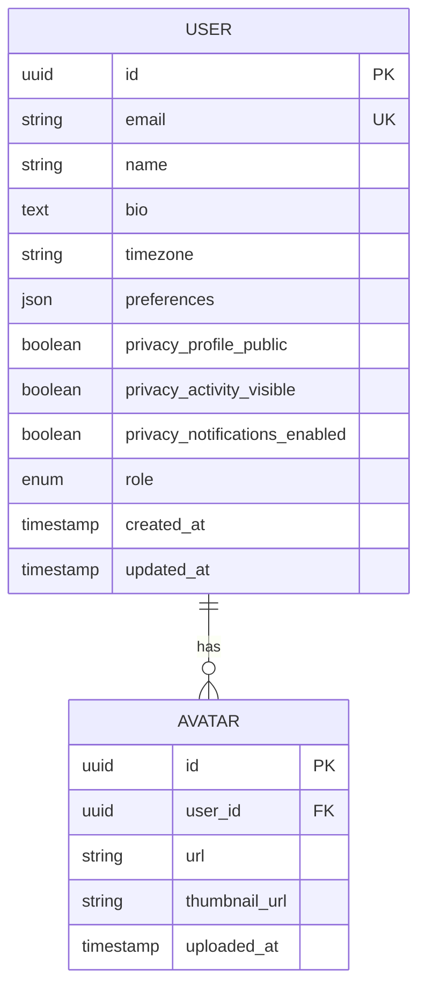

**Diagram sources**
- [schema.prisma](file://apps/backend/prisma/schema.prisma)

**Section sources**
- [schema.prisma](file://apps/backend/prisma/schema.prisma)
- [users.types.ts](file://apps/backend/src/users/users.types.ts)

### Profile Creation and Customization
- Profile creation validates inputs, creates user records, and initializes default preferences.
- Customization endpoints allow updating display name, bio, timezone, and theme settings.
- Privacy controls toggle visibility of profile and activity data.

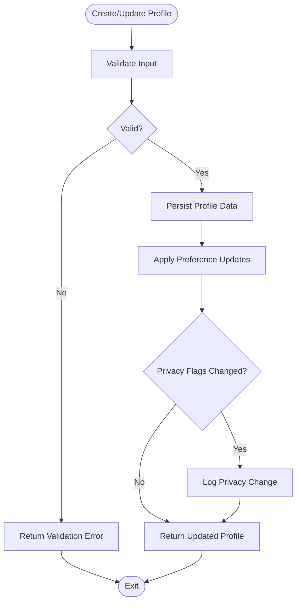

**Diagram sources**
- [users.controller.ts](file://apps/backend/src/users/users.controller.ts)
- [users.service.ts](file://apps/backend/src/users/users.service.ts)
- [users.repository.ts](file://apps/backend/src/users/users.repository.ts)

**Section sources**
- [users.controller.ts](file://apps/backend/src/users/users.controller.ts)
- [users.service.ts](file://apps/backend/src/users/users.service.ts)
- [users.repository.ts](file://apps/backend/src/users/users.repository.ts)

### Avatar Management
- Upload endpoint accepts image files, generates signed URLs, and processes images for thumbnails.
- Avatar updates replace previous assets and maintain versioning metadata.
- Storage service handles secure uploads; image service resizes and optimizes images.

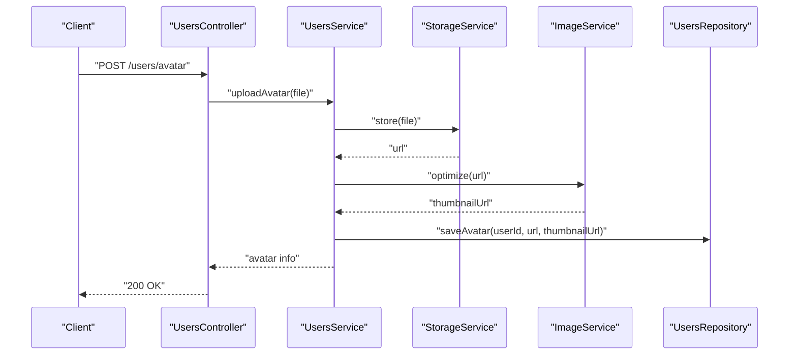

**Diagram sources**
- [users.controller.ts](file://apps/backend/src/users/users.controller.ts)
- [users.service.ts](file://apps/backend/src/users/users.service.ts)
- [storage.service.ts](file://apps/backend/src/storage/storage.service.ts)
- [image.service.ts](file://apps/backend/src/storage/image.service.ts)
- [users.repository.ts](file://apps/backend/src/users/users.repository.ts)

**Section sources**
- [users.controller.ts](file://apps/backend/src/users/users.controller.ts)
- [users.service.ts](file://apps/backend/src/users/users.service.ts)
- [storage.service.ts](file://apps/backend/src/storage/storage.service.ts)
- [image.service.ts](file://apps/backend/src/storage/image.service.ts)
- [users.repository.ts](file://apps/backend/src/users/users.repository.ts)

### Privacy Settings
- Privacy flags control profile visibility, activity feed exposure, and notification preferences.
- Changes are validated and audited for compliance and transparency.
- Public profile endpoints respect privacy settings by filtering sensitive data.

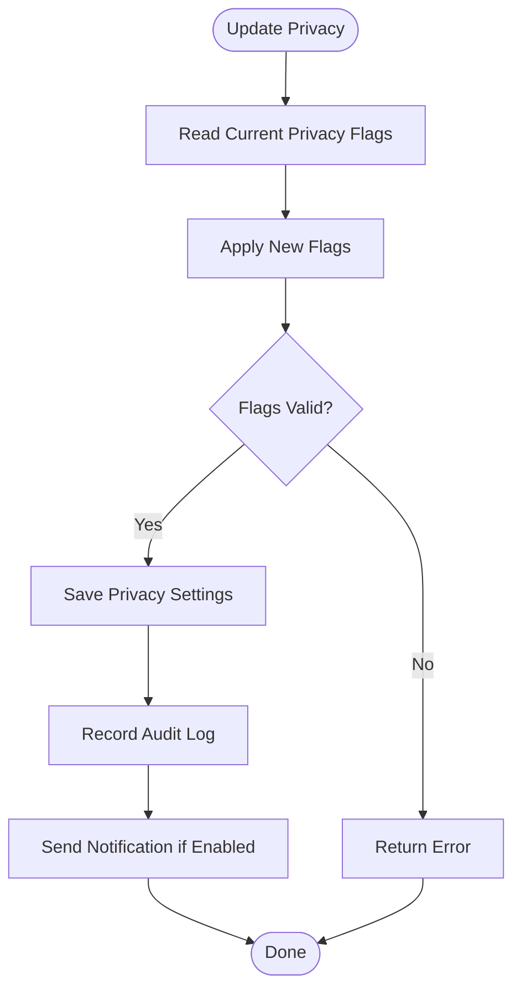

**Diagram sources**
- [users.service.ts](file://apps/backend/src/users/users.service.ts)
- [notifications.service.ts](file://apps/backend/src/notifications/notifications.service.ts)

**Section sources**
- [users.service.ts](file://apps/backend/src/users/users.service.ts)
- [notifications.service.ts](file://apps/backend/src/notifications/notifications.service.ts)

### Activity Tracking and Session Management
- Activity tracking logs user actions such as profile views, avatar updates, and preference changes.
- Session management uses tokens or cookies managed by the auth module.
- Interaction service aggregates events for analytics and personalization.

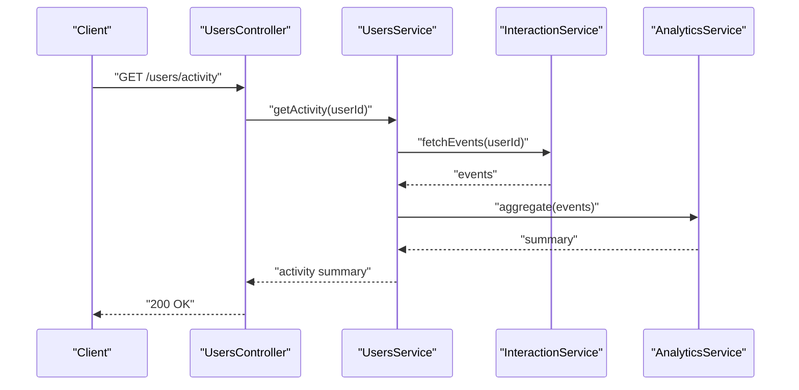

**Diagram sources**
- [users.controller.ts](file://apps/backend/src/users/users.controller.ts)
- [users.service.ts](file://apps/backend/src/users/users.service.ts)
- [interaction.service.ts](file://apps/backend/src/interaction/interaction.service.ts)
- [analytics.service.ts](file://apps/backend/src/analytics/analytics.service.ts)

**Section sources**
- [users.controller.ts](file://apps/backend/src/users/users.controller.ts)
- [users.service.ts](file://apps/backend/src/users/users.service.ts)
- [interaction.service.ts](file://apps/backend/src/interaction/interaction.service.ts)
- [analytics.service.ts](file://apps/backend/src/analytics/analytics.service.ts)

### Account Security Features
- Password hashing and rotation enforced via auth service.
- Two-factor authentication and login history tracked for auditability.
- Role-based access control restricts sensitive endpoints to administrators.

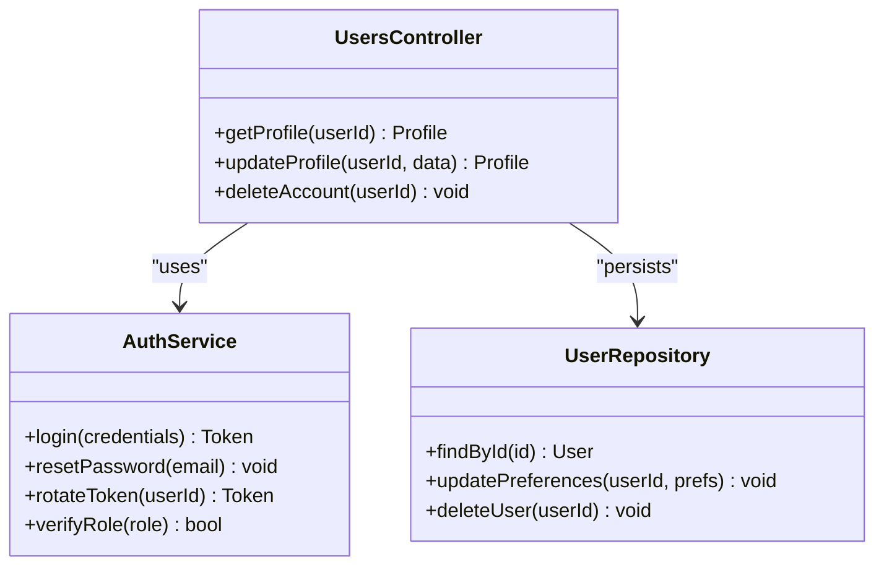

**Diagram sources**
- [auth.service.ts](file://apps/backend/src/auth/auth.service.ts)
- [users.controller.ts](file://apps/backend/src/users/users.controller.ts)
- [users.repository.ts](file://apps/backend/src/users/users.repository.ts)

**Section sources**
- [auth.service.ts](file://apps/backend/src/auth/auth.service.ts)
- [users.controller.ts](file://apps/backend/src/users/users.controller.ts)
- [users.repository.ts](file://apps/backend/src/users/users.repository.ts)

### User Preferences and Notification Settings
- Preferences include theme, language, content filters, and feature toggles.
- Notification settings manage channel preferences (email, push) and frequency.
- Preferences are persisted per user and applied during rendering and messaging.

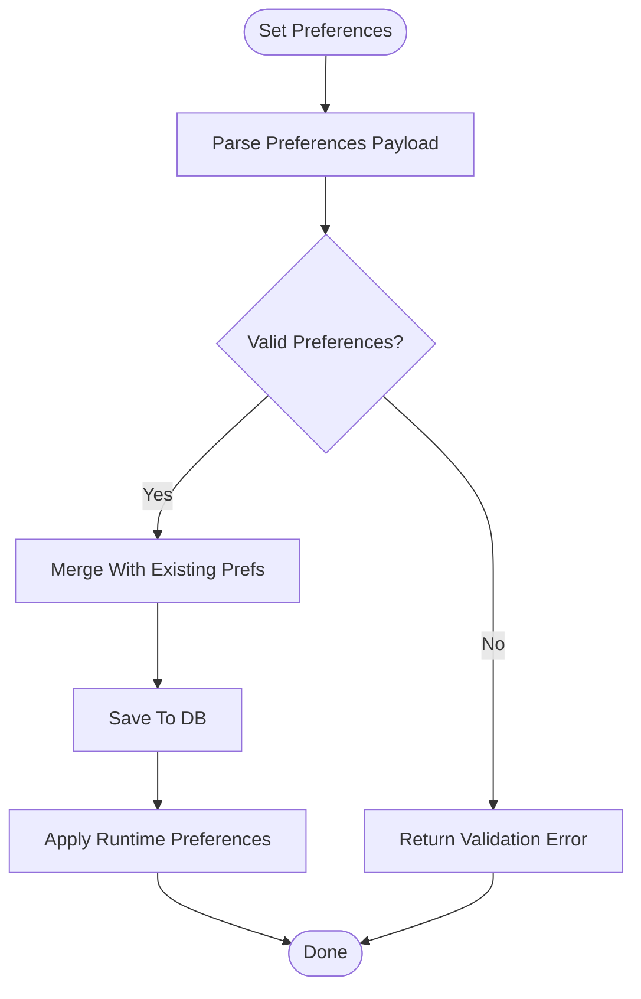

**Diagram sources**
- [users.service.ts](file://apps/backend/src/users/users.service.ts)
- [notifications.service.ts](file://apps/backend/src/notifications/notifications.service.ts)

**Section sources**
- [users.service.ts](file://apps/backend/src/users/users.service.ts)
- [notifications.service.ts](file://apps/backend/src/notifications/notifications.service.ts)

### Data Export and Account Deletion (GDPR Compliance)
- Data export aggregates user profiles, preferences, activity logs, and media references into a downloadable archive.
- Account deletion removes personal data and associated artifacts, ensuring compliance with retention policies.
- Audits log export and deletion actions for accountability.

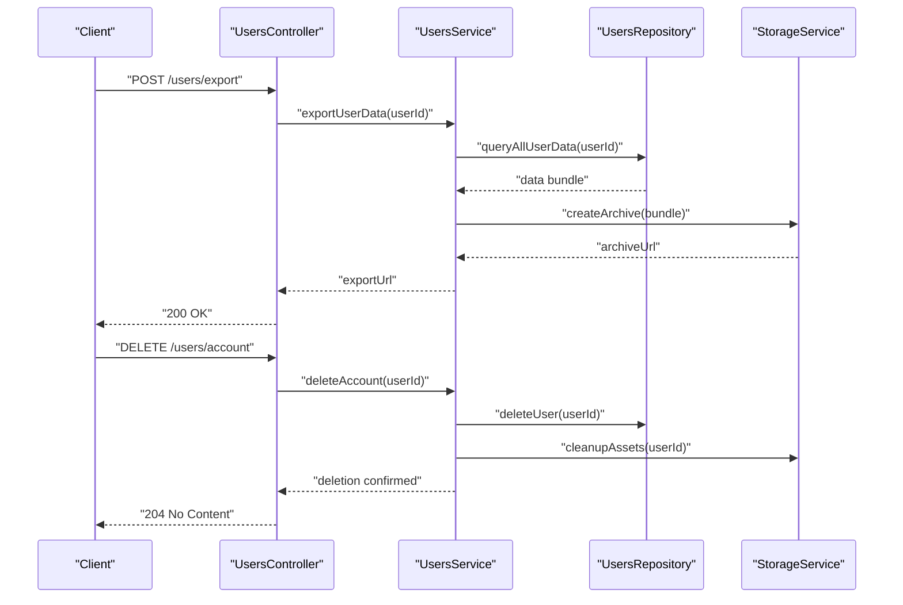

**Diagram sources**
- [users.controller.ts](file://apps/backend/src/users/users.controller.ts)
- [users.service.ts](file://apps/backend/src/users/users.service.ts)
- [users.repository.ts](file://apps/backend/src/users/users.repository.ts)
- [storage.service.ts](file://apps/backend/src/storage/storage.service.ts)

**Section sources**
- [users.controller.ts](file://apps/backend/src/users/users.controller.ts)
- [users.service.ts](file://apps/backend/src/users/users.service.ts)
- [users.repository.ts](file://apps/backend/src/users/users.repository.ts)
- [storage.service.ts](file://apps/backend/src/storage/storage.service.ts)

### Roles, Permissions, and Administrative Features
- Roles define access levels (e.g., admin, user).
- Guards enforce permissions on controllers and services.
- Admin endpoints manage user accounts, view aggregated metrics, and perform bulk operations.

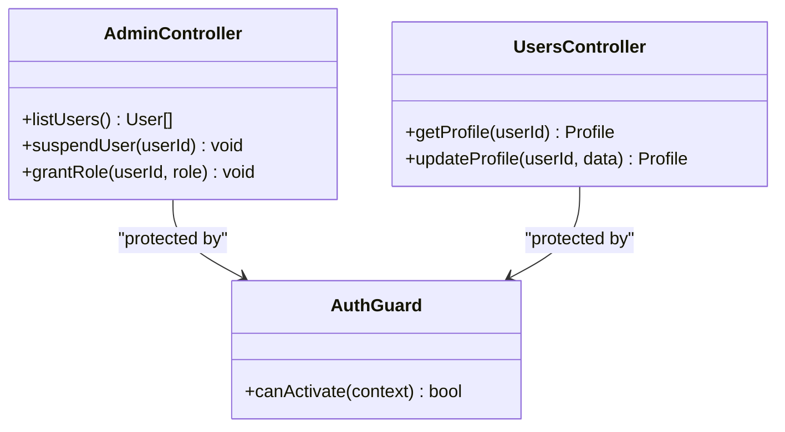

**Diagram sources**
- [auth.controller.ts](file://apps/backend/src/auth/auth.controller.ts)
- [auth.service.ts](file://apps/backend/src/auth/auth.service.ts)
- [users.controller.ts](file://apps/backend/src/users/users.controller.ts)

**Section sources**
- [auth.controller.ts](file://apps/backend/src/auth/auth.controller.ts)
- [auth.service.ts](file://apps/backend/src/auth/auth.service.ts)
- [users.controller.ts](file://apps/backend/src/users/users.controller.ts)

## Dependency Analysis
The user management module depends on authentication, storage, notifications, analytics, and interaction services. Controllers depend on services, which depend on repositories and external integrations.

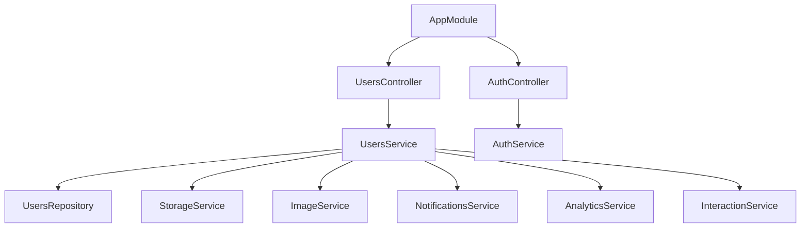

**Diagram sources**
- [users.controller.ts](file://apps/backend/src/users/users.controller.ts)
- [users.service.ts](file://apps/backend/src/users/users.service.ts)
- [users.repository.ts](file://apps/backend/src/users/users.repository.ts)
- [storage.service.ts](file://apps/backend/src/storage/storage.service.ts)
- [image.service.ts](file://apps/backend/src/storage/image.service.ts)
- [notifications.service.ts](file://apps/backend/src/notifications/notifications.service.ts)
- [analytics.service.ts](file://apps/backend/src/analytics/analytics.service.ts)
- [interaction.service.ts](file://apps/backend/src/interaction/interaction.service.ts)
- [auth.controller.ts](file://apps/backend/src/auth/auth.controller.ts)
- [auth.service.ts](file://apps/backend/src/auth/auth.service.ts)
- [app.module.ts](file://apps/backend/src/app.module.ts)

**Section sources**
- [users.controller.ts](file://apps/backend/src/users/users.controller.ts)
- [users.service.ts](file://apps/backend/src/users/users.service.ts)
- [users.repository.ts](file://apps/backend/src/users/users.repository.ts)
- [auth.controller.ts](file://apps/backend/src/auth/auth.controller.ts)
- [auth.service.ts](file://apps/backend/src/auth/auth.service.ts)
- [app.module.ts](file://apps/backend/src/app.module.ts)

## Performance Considerations
- Use pagination and filtering for activity and export queries to avoid large payloads.
- Cache frequently accessed profile data where appropriate.
- Optimize image processing with async jobs and CDN caching.
- Batch notification sends to reduce overhead.

[No sources needed since this section provides general guidance]

## Troubleshooting Guide
- Validate input schemas for profile and preference updates to prevent invalid states.
- Check storage upload limits and image format constraints when handling avatars.
- Review audit logs for privacy changes and account deletions to ensure compliance.
- Monitor auth token expiration and refresh flows for session continuity.

**Section sources**
- [users.service.ts](file://apps/backend/src/users/users.service.ts)
- [auth.service.ts](file://apps/backend/src/auth/auth.service.ts)
- [storage.service.ts](file://apps/backend/src/storage/storage.service.ts)

## Conclusion
The user management system provides robust profile creation, customization, and privacy controls, backed by secure authentication and comprehensive activity tracking. Avatar management leverages efficient storage and image processing pipelines. Preferences and notifications are configurable per user, while data export and deletion support GDPR compliance. Roles and permissions enable administrative oversight and secure access control.

[No sources needed since this section summarizes without analyzing specific files]

## Appendices
- API Endpoints: Refer to controllers for method definitions and request/response structures.
- Database Schema: See Prisma schema for field definitions and relationships.
- Security Policies: Consult auth service for token handling and role enforcement.

**Section sources**
- [users.controller.ts](file://apps/backend/src/users/users.controller.ts)
- [schema.prisma](file://apps/backend/prisma/schema.prisma)
- [auth.service.ts](file://apps/backend/src/auth/auth.service.ts)