# API Integration Layer

<cite>
**Referenced Files in This Document**
- [use-auth.ts](file://src/hooks/use-auth.ts)
- [use-media.ts](file://src/hooks/use-media.ts)
- [use-collections.ts](file://src/hooks/use-collections.ts)
- [use-library.ts](file://src/hooks/use-library.ts)
- [use-journal.ts](file://src/hooks/use-journal.ts)
- [use-users.ts](file://src/hooks/use-users.ts)
- [use-notifications.ts](file://src/hooks/use-notifications.ts)
- [use-search.ts](file://src/hooks/use-search.ts)
- [use-analytics.ts](file://src/hooks/use-analytics.ts)
- [use-online.ts](file://src/hooks/use-online.ts)
- [router.tsx](file://src/router.tsx)
- [server.ts](file://src/server.ts)
- [start.ts](file://src/start.ts)
- [app.bootstrap.ts](file://apps/backend/src/app.bootstrap.ts)
- [auth.controller.ts](file://apps/backend/src/auth/auth.controller.ts)
- [media.controller.ts](file://apps/backend/src/media/media.controller.ts)
- [collections.controller.ts](file://apps/backend/src/collections/collections.controller.ts)
- [library.controller.ts](file://apps/backend/src/library/library.controller.ts)
- [journal.controller.ts](file://apps/backend/src/journal/journal.controller.ts)
- [users.controller.ts](file://apps/backend/src/users/users.controller.ts)
- [notifications.controller.ts](file://apps/backend/src/notifications/notifications.controller.ts)
- [search.controller.ts](file://apps/backend/src/search/search.controller.ts)
- [analytics.controller.ts](file://apps/backend/src/analytics/analytics.controller.ts)
- [request-metrics.middleware.ts](file://apps/backend/src/observability/request-metrics.middleware.ts)
- [performance.service.ts](file://apps/backend/src/observability/performance.service.ts)
- [tracing.service.ts](file://apps/backend/src/observability/tracing.service.ts)
- [cache.service.ts](file://apps/backend/src/hardening/cache.service.ts)
- [rate-limit-audit.service.ts](file://apps/backend/src/hardening/rate-limit-audit.service.ts)
- [error-capture.ts](file://src/lib/error-capture.ts)
- [lib/types.ts](file://src/lib/types.ts)
</cite>

## Table of Contents
1. [Introduction](#introduction)
2. [Project Structure](#project-structure)
3. [Core Components](#core-components)
4. [Architecture Overview](#architecture-overview)
5. [Detailed Component Analysis](#detailed-component-analysis)
6. [Dependency Analysis](#dependency-analysis)
7. [Performance Considerations](#performance-considerations)
8. [Troubleshooting Guide](#troubleshooting-guide)
9. [Conclusion](#conclusion)
10. [Appendices](#appendices)

## Introduction
This document explains the API integration layer and data fetching patterns across the frontend and backend. It covers RESTful client usage, request/response handling, error management, custom hooks for domain features (authentication, media, collections, library, journal, users, notifications, search, analytics), caching and retry strategies, optimistic updates, WebSocket integration for real-time features, background sync, offline support, API mocking, testing approaches, performance monitoring, authentication token handling, request interceptors, and response transformation.

## Project Structure
The project is organized into a frontend application under src and a NestJS backend under apps/backend. The frontend exposes feature-specific hooks that encapsulate API calls, state, caching, retries, and optimistic updates. The backend exposes REST endpoints via controllers and includes observability, caching, and hardening utilities.

```mermaid
graph TB
subgraph "Frontend"
H_Auth["hooks/use-auth.ts"]
H_Media["hooks/use-media.ts"]
H_Collections["hooks/use-collections.ts"]
H_Library["hooks/use-library.ts"]
H_Journal["hooks/use-journal.ts"]
H_Users["hooks/use-users.ts"]
H_Notifications["hooks/use-notifications.ts"]
H_Search["hooks/use-search.ts"]
H_Analytics["hooks/use-analytics.ts"]
H_Online["hooks/use-online.ts"]
Router["router.tsx"]
Server["server.ts"]
Start["start.ts"]
end
subgraph "Backend"
C_Auth["auth.controller.ts"]
C_Media["media.controller.ts"]
C_Collections["collections.controller.ts"]
C_Library["library.controller.ts"]
C_Journal["journal.controller.ts"]
C_Users["users.controller.ts"]
C_Notifications["notifications.controller.ts"]
C_Search["search.controller.ts"]
C_Analytics["analytics.controller.ts"]
MetricsMW["request-metrics.middleware.ts"]
PerfSvc["performance.service.ts"]
TraceSvc["tracing.service.ts"]
CacheSvc["cache.service.ts"]
RateLimit["rate-limit-audit.service.ts"]
end
H_Auth --> C_Auth
H_Media --> C_Media
H_Collections --> C_Collections
H_Library --> C_Library
H_Journal --> C_Journal
H_Users --> C_Users
H_Notifications --> C_Notifications
H_Search --> C_Search
H_Analytics --> C_Analytics
Router --> H_Auth
Router --> H_Media
Router --> H_Collections
Router --> H_Library
Router --> H_Journal
Router --> H_Users
Router --> H_Notifications
Router --> H_Search
Router --> H_Analytics
Server --> MetricsMW
Start --> Server
MetricsMW --> PerfSvc
MetricsMW --> TraceSvc
C_Auth --> CacheSvc
C_Media --> CacheSvc
C_Collections --> CacheSvc
C_Library --> CacheSvc
C_Journal --> CacheSvc
C_Users --> CacheSvc
C_Notifications --> CacheSvc
C_Search --> CacheSvc
C_Analytics --> CacheSvc
C_Auth --> RateLimit
C_Media --> RateLimit
C_Collections --> RateLimit
C_Library --> RateLimit
C_Journal --> RateLimit
C_Users --> RateLimit
C_Notifications --> RateLimit
C_Search --> RateLimit
C_Analytics --> RateLimit
```

**Diagram sources**
- [router.tsx](file://src/router.tsx)
- [server.ts](file://src/server.ts)
- [start.ts](file://src/start.ts)
- [use-auth.ts](file://src/hooks/use-auth.ts)
- [use-media.ts](file://src/hooks/use-media.ts)
- [use-collections.ts](file://src/hooks/use-collections.ts)
- [use-library.ts](file://src/hooks/use-library.ts)
- [use-journal.ts](file://src/hooks/use-journal.ts)
- [use-users.ts](file://src/hooks/use-users.ts)
- [use-notifications.ts](file://src/hooks/use-notifications.ts)
- [use-search.ts](file://src/hooks/use-search.ts)
- [use-analytics.ts](file://src/hooks/use-analytics.ts)
- [auth.controller.ts](file://apps/backend/src/auth/auth.controller.ts)
- [media.controller.ts](file://apps/backend/src/media/media.controller.ts)
- [collections.controller.ts](file://apps/backend/src/collections/collections.controller.ts)
- [library.controller.ts](file://apps/backend/src/library/library.controller.ts)
- [journal.controller.ts](file://apps/backend/src/journal/journal.controller.ts)
- [users.controller.ts](file://apps/backend/src/users/users.controller.ts)
- [notifications.controller.ts](file://apps/backend/src/notifications/notifications.controller.ts)
- [search.controller.ts](file://apps/backend/src/search/search.controller.ts)
- [analytics.controller.ts](file://apps/backend/src/analytics/analytics.controller.ts)
- [request-metrics.middleware.ts](file://apps/backend/src/observability/request-metrics.middleware.ts)
- [performance.service.ts](file://apps/backend/src/observability/performance.service.ts)
- [tracing.service.ts](file://apps/backend/src/observability/tracing.service.ts)
- [cache.service.ts](file://apps/backend/src/hardening/cache.service.ts)
- [rate-limit-audit.service.ts](file://apps/backend/src/hardening/rate-limit-audit.service.ts)

**Section sources**
- [router.tsx](file://src/router.tsx)
- [server.ts](file://src/server.ts)
- [start.ts](file://src/start.ts)

## Core Components
- Frontend hooks encapsulate all API interactions per domain:
  - Authentication: login, logout, refresh, session state, token storage, and protected requests.
  - Media: fetch media metadata, progress, relationships, and actions with caching and retries.
  - Collections: CRUD operations, statistics, events, and optimistic updates.
  - Library: catalog queries, filters, pagination, and cache invalidation.
  - Journal: entries, prompts, insights, and timeline events.
  - Users: profile, preferences, and account settings.
  - Notifications: subscriptions, delivery, and read status.
  - Search: query suggestions, indexing, and result caching.
  - Analytics: event tracking, metrics, and dashboards.
- Backend controllers expose REST endpoints for each domain, backed by services and repositories. Observability middleware measures latency and traces requests. Hardening services provide caching and rate limiting.

Key responsibilities:
- Request lifecycle: build URL, attach auth headers, handle retries, transform responses, normalize errors.
- State management: local cache, stale-while-revalidate, optimistic updates, and background refetch.
- Real-time: WebSocket channels for live updates where applicable.
- Offline: queue mutations and reconcile when online.

**Section sources**
- [use-auth.ts](file://src/hooks/use-auth.ts)
- [use-media.ts](file://src/hooks/use-media.ts)
- [use-collections.ts](file://src/hooks/use-collections.ts)
- [use-library.ts](file://src/hooks/use-library.ts)
- [use-journal.ts](file://src/hooks/use-journal.ts)
- [use-users.ts](file://src/hooks/use-users.ts)
- [use-notifications.ts](file://src/hooks/use-notifications.ts)
- [use-search.ts](file://src/hooks/use-search.ts)
- [use-analytics.ts](file://src/hooks/use-analytics.ts)
- [auth.controller.ts](file://apps/backend/src/auth/auth.controller.ts)
- [media.controller.ts](file://apps/backend/src/media/media.controller.ts)
- [collections.controller.ts](file://apps/backend/src/collections/collections.controller.ts)
- [library.controller.ts](file://apps/backend/src/library/library.controller.ts)
- [journal.controller.ts](file://apps/backend/src/journal/journal.controller.ts)
- [users.controller.ts](file://apps/backend/src/users/users.controller.ts)
- [notifications.controller.ts](file://apps/backend/src/notifications/notifications.controller.ts)
- [search.controller.ts](file://apps/backend/src/search/search.controller.ts)
- [analytics.controller.ts](file://apps/backend/src/analytics/analytics.controller.ts)

## Architecture Overview
The integration layer follows a clear separation between UI hooks and backend controllers. Hooks manage client-side concerns (caching, retries, optimistic updates, offline queueing). Controllers implement server-side logic with consistent error shapes and optional caching/rate limiting. Observability captures metrics and traces at the gateway level.

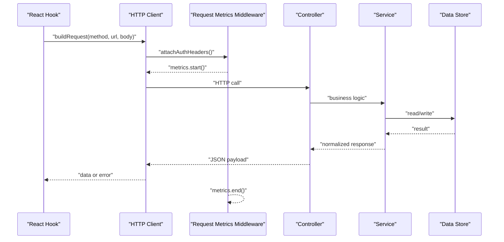

**Diagram sources**
- [request-metrics.middleware.ts](file://apps/backend/src/observability/request-metrics.middleware.ts)
- [auth.controller.ts](file://apps/backend/src/auth/auth.controller.ts)
- [media.controller.ts](file://apps/backend/src/media/media.controller.ts)
- [collections.controller.ts](file://apps/backend/src/collections/collections.controller.ts)
- [library.controller.ts](file://apps/backend/src/library/library.controller.ts)
- [journal.controller.ts](file://apps/backend/src/journal/journal.controller.ts)
- [users.controller.ts](file://apps/backend/src/users/users.controller.ts)
- [notifications.controller.ts](file://apps/backend/src/notifications/notifications.controller.ts)
- [search.controller.ts](file://apps/backend/src/search/search.controller.ts)
- [analytics.controller.ts](file://apps/backend/src/analytics/analytics.controller.ts)

## Detailed Component Analysis

### Authentication Flow
Authentication hooks coordinate login, token refresh, and session persistence. Requests are intercepted to attach tokens and handle unauthorized responses gracefully.

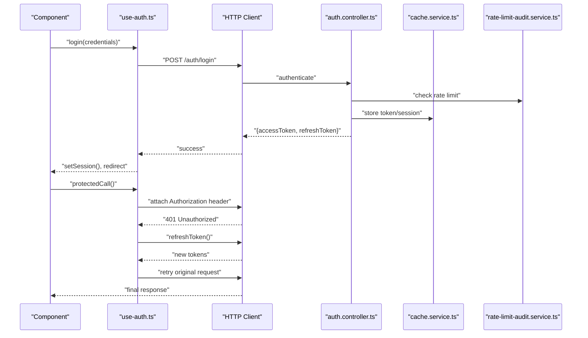

**Diagram sources**
- [use-auth.ts](file://src/hooks/use-auth.ts)
- [auth.controller.ts](file://apps/backend/src/auth/auth.controller.ts)
- [cache.service.ts](file://apps/backend/src/hardening/cache.service.ts)
- [rate-limit-audit.service.ts](file://apps/backend/src/hardening/rate-limit-audit.service.ts)

**Section sources**
- [use-auth.ts](file://src/hooks/use-auth.ts)
- [auth.controller.ts](file://apps/backend/src/auth/auth.controller.ts)

### Media Data Fetching
Media hooks provide cached reads, paginated lists, and mutation flows with retries and optimistic updates.

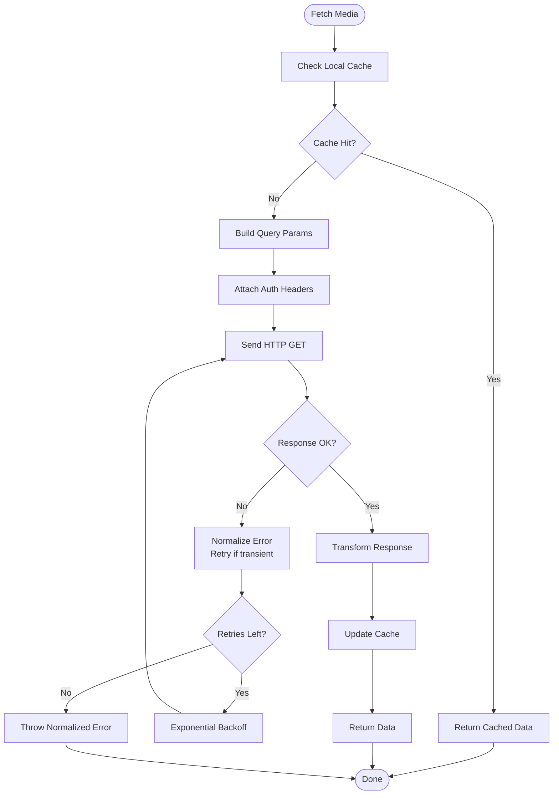

**Diagram sources**
- [use-media.ts](file://src/hooks/use-media.ts)

**Section sources**
- [use-media.ts](file://src/hooks/use-media.ts)
- [media.controller.ts](file://apps/backend/src/media/media.controller.ts)

### Collections Operations
Collections hooks support CRUD, statistics, and events. Optimistic updates improve perceived responsiveness; background reconciliation ensures consistency.

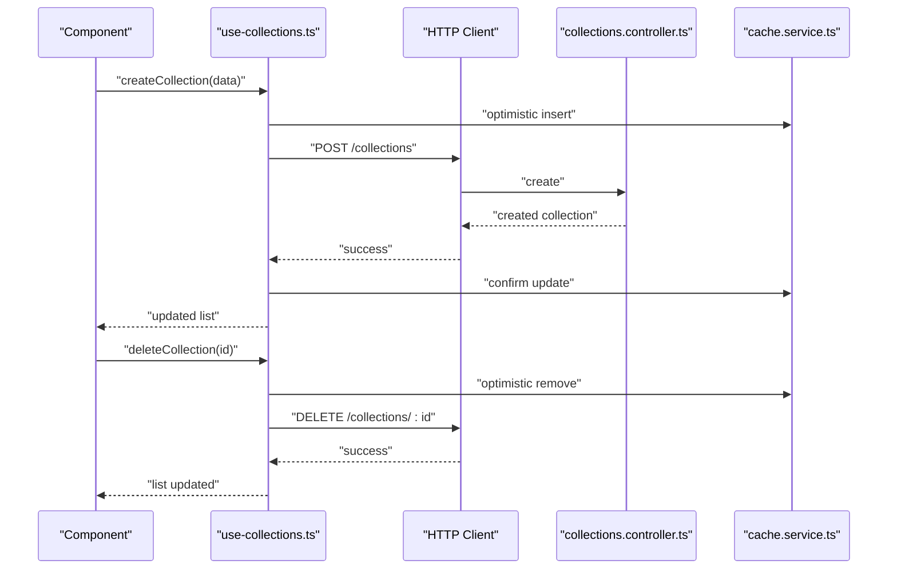

**Diagram sources**
- [use-collections.ts](file://src/hooks/use-collections.ts)
- [collections.controller.ts](file://apps/backend/src/collections/collections.controller.ts)
- [cache.service.ts](file://apps/backend/src/hardening/cache.service.ts)

**Section sources**
- [use-collections.ts](file://src/hooks/use-collections.ts)
- [collections.controller.ts](file://apps/backend/src/collections/collections.controller.ts)

### Library Queries
Library hooks implement filtering, sorting, pagination, and cache invalidation on mutations.

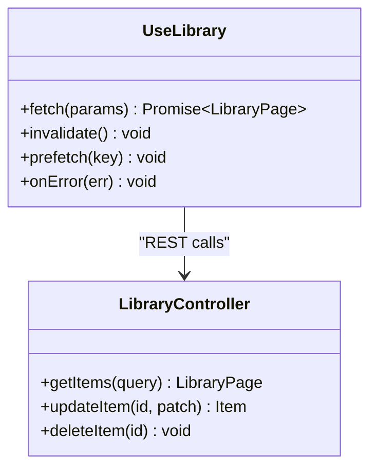

**Diagram sources**
- [use-library.ts](file://src/hooks/use-library.ts)
- [library.controller.ts](file://apps/backend/src/library/library.controller.ts)

**Section sources**
- [use-library.ts](file://src/hooks/use-library.ts)
- [library.controller.ts](file://apps/backend/src/library/library.controller.ts)

### Journal Entries
Journal hooks manage entries, prompts, insights, and timeline events with caching and background sync.

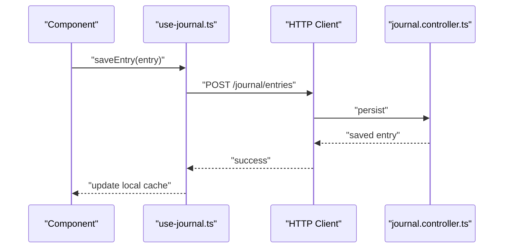

**Diagram sources**
- [use-journal.ts](file://src/hooks/use-journal.ts)
- [journal.controller.ts](file://apps/backend/src/journal/journal.controller.ts)

**Section sources**
- [use-journal.ts](file://src/hooks/use-journal.ts)
- [journal.controller.ts](file://apps/backend/src/journal/journal.controller.ts)

### Users Profile
Users hooks handle profile retrieval, updates, and preferences.

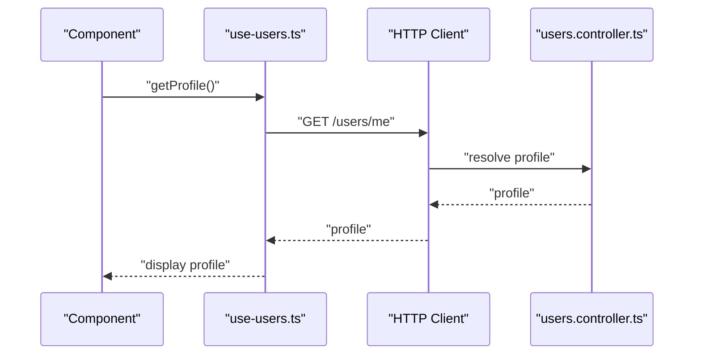

**Diagram sources**
- [use-users.ts](file://src/hooks/use-users.ts)
- [users.controller.ts](file://apps/backend/src/users/users.controller.ts)

**Section sources**
- [use-users.ts](file://src/hooks/use-users.ts)
- [users.controller.ts](file://apps/backend/src/users/users.controller.ts)

### Notifications
Notifications hooks subscribe to channels, receive updates, and mark items as read.

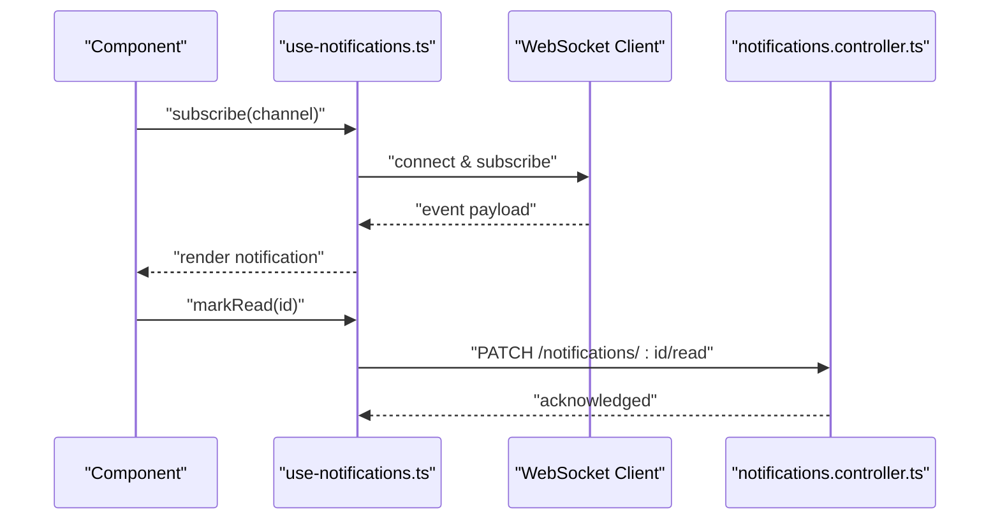

**Diagram sources**
- [use-notifications.ts](file://src/hooks/use-notifications.ts)
- [notifications.controller.ts](file://apps/backend/src/notifications/notifications.controller.ts)

**Section sources**
- [use-notifications.ts](file://src/hooks/use-notifications.ts)
- [notifications.controller.ts](file://apps/backend/src/notifications/notifications.controller.ts)

### Search
Search hooks implement query suggestions, debounced input, and result caching.

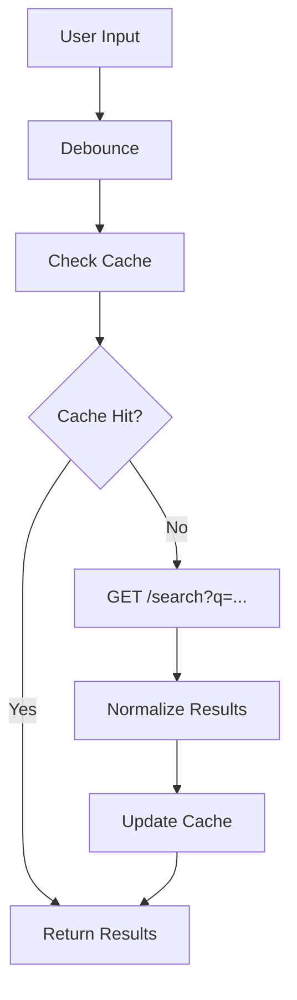

**Diagram sources**
- [use-search.ts](file://src/hooks/use-search.ts)
- [search.controller.ts](file://apps/backend/src/search/search.controller.ts)

**Section sources**
- [use-search.ts](file://src/hooks/use-search.ts)
- [search.controller.ts](file://apps/backend/src/search/search.controller.ts)

### Analytics
Analytics hooks track events and metrics, batching and retrying failed transmissions.

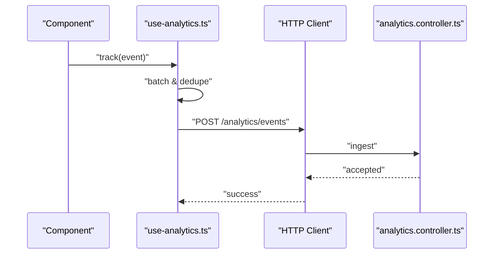

**Diagram sources**
- [use-analytics.ts](file://src/hooks/use-analytics.ts)
- [analytics.controller.ts](file://apps/backend/src/analytics/analytics.controller.ts)

**Section sources**
- [use-analytics.ts](file://src/hooks/use-analytics.ts)
- [analytics.controller.ts](file://apps/backend/src/analytics/analytics.controller.ts)

### Online Status and Offline Support
The online hook monitors connectivity and triggers revalidation or queued mutations when offline.

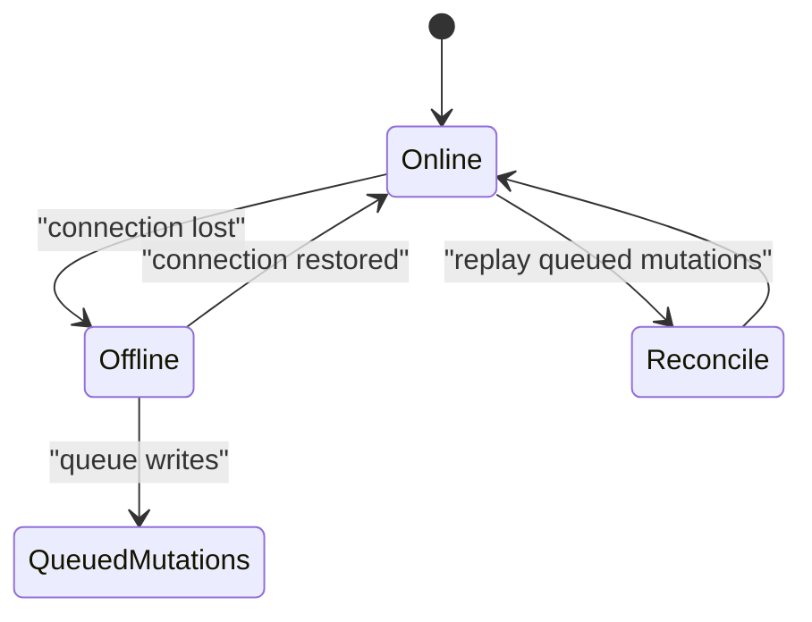

**Diagram sources**
- [use-online.ts](file://src/hooks/use-online.ts)

**Section sources**
- [use-online.ts](file://src/hooks/use-online.ts)

## Dependency Analysis
Hooks depend on HTTP clients, caches, and error utilities. Controllers depend on services and repositories. Observability and hardening cross-cut concerns apply at the controller and gateway layers.

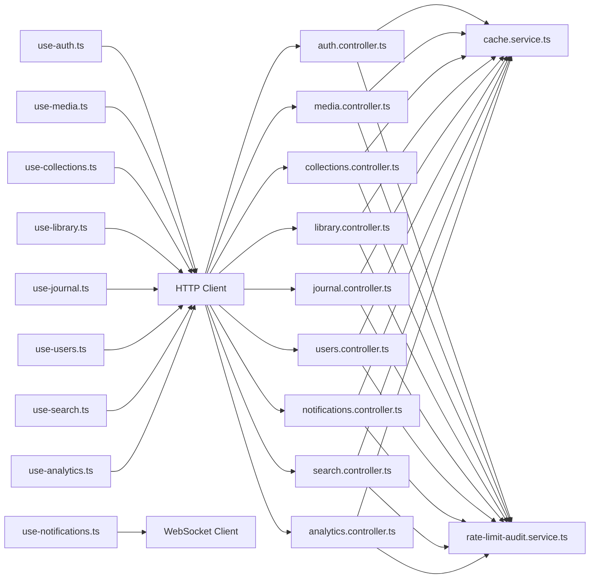

**Diagram sources**
- [use-auth.ts](file://src/hooks/use-auth.ts)
- [use-media.ts](file://src/hooks/use-media.ts)
- [use-collections.ts](file://src/hooks/use-collections.ts)
- [use-library.ts](file://src/hooks/use-library.ts)
- [use-journal.ts](file://src/hooks/use-journal.ts)
- [use-users.ts](file://src/hooks/use-users.ts)
- [use-notifications.ts](file://src/hooks/use-notifications.ts)
- [use-search.ts](file://src/hooks/use-search.ts)
- [use-analytics.ts](file://src/hooks/use-analytics.ts)
- [auth.controller.ts](file://apps/backend/src/auth/auth.controller.ts)
- [media.controller.ts](file://apps/backend/src/media/media.controller.ts)
- [collections.controller.ts](file://apps/backend/src/collections/collections.controller.ts)
- [library.controller.ts](file://apps/backend/src/library/library.controller.ts)
- [journal.controller.ts](file://apps/backend/src/journal/journal.controller.ts)
- [users.controller.ts](file://apps/backend/src/users/users.controller.ts)
- [notifications.controller.ts](file://apps/backend/src/notifications/notifications.controller.ts)
- [search.controller.ts](file://apps/backend/src/search/search.controller.ts)
- [analytics.controller.ts](file://apps/backend/src/analytics/analytics.controller.ts)
- [cache.service.ts](file://apps/backend/src/hardening/cache.service.ts)
- [rate-limit-audit.service.ts](file://apps/backend/src/hardening/rate-limit-audit.service.ts)

**Section sources**
- [use-auth.ts](file://src/hooks/use-auth.ts)
- [use-media.ts](file://src/hooks/use-media.ts)
- [use-collections.ts](file://src/hooks/use-collections.ts)
- [use-library.ts](file://src/hooks/use-library.ts)
- [use-journal.ts](file://src/hooks/use-journal.ts)
- [use-users.ts](file://src/hooks/use-users.ts)
- [use-notifications.ts](file://src/hooks/use-notifications.ts)
- [use-search.ts](file://src/hooks/use-search.ts)
- [use-analytics.ts](file://src/hooks/use-analytics.ts)
- [auth.controller.ts](file://apps/backend/src/auth/auth.controller.ts)
- [media.controller.ts](file://apps/backend/src/media/media.controller.ts)
- [collections.controller.ts](file://apps/backend/src/collections/collections.controller.ts)
- [library.controller.ts](file://apps/backend/src/library/library.controller.ts)
- [journal.controller.ts](file://apps/backend/src/journal/journal.controller.ts)
- [users.controller.ts](file://apps/backend/src/users/users.controller.ts)
- [notifications.controller.ts](file://apps/backend/src/notifications/notifications.controller.ts)
- [search.controller.ts](file://apps/backend/src/search/search.controller.ts)
- [analytics.controller.ts](file://apps/backend/src/analytics/analytics.controller.ts)
- [cache.service.ts](file://apps/backend/src/hardening/cache.service.ts)
- [rate-limit-audit.service.ts](file://apps/backend/src/hardening/rate-limit-audit.service.ts)

## Performance Considerations
- Caching: Implement local cache with stale-while-revalidate semantics; prefer cache-first for reads and cache-busting on mutations.
- Retries: Use exponential backoff with jitter for transient failures; limit max retries to avoid cascading load.
- Optimistic Updates: Apply immediate UI changes and reconcile on success; rollback on failure with user feedback.
- Pagination: Use cursor-based pagination for large datasets; prefetch next pages proactively.
- Observability: Capture request latency, error rates, and throughput; trace critical paths end-to-end.
- Rate Limiting: Enforce per-user and global limits; return informative 429 responses with retry-after hints.
- Network Awareness: Detect offline states; queue mutations and batch-sync when connectivity returns.

[No sources needed since this section provides general guidance]

## Troubleshooting Guide
Common issues and resolutions:
- Authentication failures: Ensure token storage is correct; handle 401 by refreshing tokens and retrying once; log failures with correlation IDs.
- Network errors: Distinguish transient vs permanent errors; retry only on network timeouts or 5xx; surface user-friendly messages.
- Cache inconsistencies: Invalidate relevant keys after mutations; use versioned cache entries to prevent stale reads.
- WebSocket disconnects: Implement reconnect with exponential backoff; buffer messages until reconnected.
- Performance regressions: Monitor p95/p99 latencies; identify hot endpoints; add indexes or reduce payload sizes.

**Section sources**
- [error-capture.ts](file://src/lib/error-capture.ts)
- [request-metrics.middleware.ts](file://apps/backend/src/observability/request-metrics.middleware.ts)
- [performance.service.ts](file://apps/backend/src/observability/performance.service.ts)
- [tracing.service.ts](file://apps/backend/src/observability/tracing.service.ts)

## Conclusion
The API integration layer combines robust frontend hooks with well-structured backend controllers. Caching, retries, optimistic updates, and offline support deliver a responsive and resilient user experience. Observability and hardening ensure reliability and performance at scale.

[No sources needed since this section summarizes without analyzing specific files]

## Appendices

### API Mocking Strategies
- In-memory mock stores keyed by route patterns.
- Service Worker interception for network-level mocking during development.
- Feature flags to toggle between real and mocked endpoints.
- Deterministic fixtures for tests with seeded data.

[No sources needed since this section provides general guidance]

### Testing Approaches
- Unit tests for hooks: assert state transitions, cache behavior, and retry logic.
- Integration tests for controllers: validate endpoints, error shapes, and rate limiting.
- E2E tests: simulate user flows including auth, mutations, and real-time updates.
- Contract tests: ensure frontend expectations match backend schemas.

[No sources needed since this section provides general guidance]

### Authentication Token Handling
- Store access tokens securely; rotate refresh tokens on sensitive actions.
- Interceptors attach Authorization headers and handle 401 flows.
- Centralize token storage and retrieval to avoid duplication.

[No sources needed since this section provides general guidance]

### Request Interceptors and Response Transformation
- Interceptors normalize payloads, map error codes, and inject correlation IDs.
- Response transformers convert snake_case to camelCase and strip unnecessary fields.
- Global error handlers capture and report exceptions consistently.

[No sources needed since this section provides general guidance]