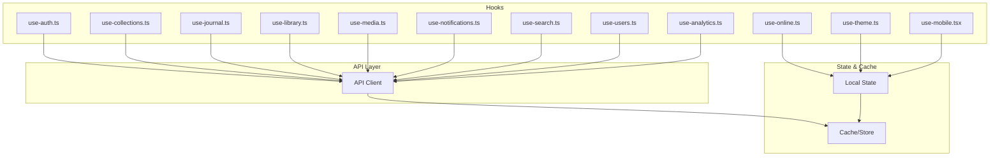
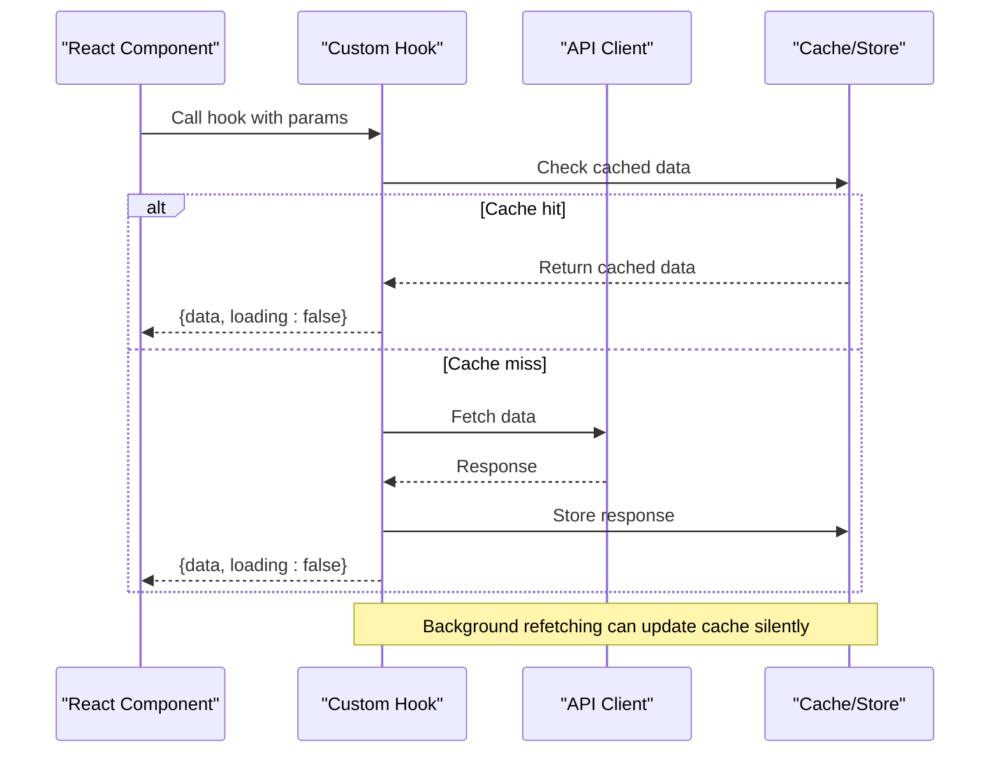
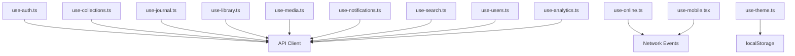

# Custom Data Hooks

<cite>
**Referenced Files in This Document**
- [use-auth.ts](file://src/hooks/use-auth.ts)
- [use-collections.ts](file://src/hooks/use-collections.ts)
- [use-journal.ts](file://src/hooks/use-journal.ts)
- [use-library.ts](file://src/hooks/use-library.ts)
- [use-media.ts](file://src/hooks/use-media.ts)
- [use-notifications.ts](file://src/hooks/use-notifications.ts)
- [use-search.ts](file://src/hooks/use-search.ts)
- [use-users.ts](file://src/hooks/use-users.ts)
- [use-analytics.ts](file://src/hooks/use-analytics.ts)
- [use-online.ts](file://src/hooks/use-online.ts)
- [use-theme.ts](file://src/hooks/use-theme.ts)
- [use-mobile.tsx](file://src/hooks/use-mobile.tsx)
</cite>

## Table of Contents
1. [Introduction](#introduction)
2. [Project Structure](#project-structure)
3. [Core Components](#core-components)
4. [Architecture Overview](#architecture-overview)
5. [Detailed Component Analysis](#detailed-component-analysis)
6. [Dependency Analysis](#dependency-analysis)
7. [Performance Considerations](#performance-considerations)
8. [Troubleshooting Guide](#troubleshooting-guide)
9. [Conclusion](#conclusion)
10. [Appendices](#appendices)

## Introduction
This document provides comprehensive documentation for custom React hooks that encapsulate API interactions within the application. It explains each hook’s purpose, parameters, return values, and usage patterns. It also covers state management inside hooks, loading states, error handling, data synchronization, caching strategies, background refetching, optimistic updates, hook composition, conditional fetching, performance optimization techniques, and testing approaches with mocking strategies.

The goal is to make these hooks accessible to both technical and non-technical readers while providing deep insights into their implementation and best practices.

## Project Structure
The custom hooks are organized under src/hooks, each file focusing on a specific domain or feature area:
- Authentication and user session management
- Collections and media organization
- Journal entries and reflections
- Library browsing and status tracking
- Media details and metadata
- Notifications and alerts
- Search functionality
- User profiles and preferences
- Analytics and metrics
- Online/offline detection
- Theme and UI preferences
- Mobile responsiveness

[No sources needed since this diagram shows conceptual workflow, not actual code structure]

## Core Components
This section outlines the core responsibilities of each hook and how they manage data flow between components and the API layer.

- use-auth.ts: Manages authentication state, login/logout flows, token storage, and session validation.
- use-collections.ts: Handles fetching, creating, updating, and deleting collections; supports filtering and pagination.
- use-journal.ts: Provides CRUD operations for journal entries, including search and sorting.
- use-library.ts: Manages library items, statuses, and progress tracking; includes optimistic updates for quick feedback.
- use-media.ts: Fetches media details, related content, and metadata; supports background refetching.
- use-notifications.ts: Retrieves notifications, marks as read, and handles real-time updates if applicable.
- use-search.ts: Implements search queries, debouncing, and result caching.
- use-users.ts: Manages user profile data, preferences, and account settings.
- use-analytics.ts: Tracks analytics events and retrieves aggregated metrics.
- use-online.ts: Detects online/offline status and adjusts behavior accordingly.
- use-theme.ts: Manages theme preferences and applies them across the app.
- use-mobile.tsx: Detects mobile devices and adjusts UI behavior.

**Section sources**
- [use-auth.ts](file://src/hooks/use-auth.ts)
- [use-collections.ts](file://src/hooks/use-collections.ts)
- [use-journal.ts](file://src/hooks/use-journal.ts)
- [use-library.ts](file://src/hooks/use-library.ts)
- [use-media.ts](file://src/hooks/use-media.ts)
- [use-notifications.ts](file://src/hooks/use-notifications.ts)
- [use-search.ts](file://src/hooks/use-search.ts)
- [use-users.ts](file://src/hooks/use-users.ts)
- [use-analytics.ts](file://src/hooks/use-analytics.ts)
- [use-online.ts](file://src/hooks/use-online.ts)
- [use-theme.ts](file://src/hooks/use-theme.ts)
- [use-mobile.tsx](file://src/hooks/use-mobile.tsx)

## Architecture Overview
The hooks follow a consistent pattern:
- They encapsulate API calls using an abstracted client.
- They manage local state for loading, error, and data.
- They implement caching strategies to minimize network requests.
- They support background refetching to keep data fresh.
- They enable optimistic updates for immediate UI feedback.

**Diagram sources**
- [use-collections.ts](file://src/hooks/use-collections.ts)
- [use-media.ts](file://src/hooks/use-media.ts)

## Detailed Component Analysis

### use-auth.ts
Purpose: Manage authentication state and user session.
Parameters: None (or optional config for token storage).
Return Values:
- isAuthenticated: boolean
- user: object | null
- login(credentials): Promise<void>
- logout(): void
- refreshSession(): Promise<void>

Usage Patterns:
- Wrap components requiring auth checks.
- Use login/logout in forms and navigation guards.

State Management:
- Local state for user and token.
- Persists token to secure storage.

Error Handling:
- Throws errors on failed login attempts.
- Redirects to login on session expiry.

Caching Strategy:
- Stores user profile in memory and secure storage.

Background Refetching:
- Refreshes session periodically or on window focus.

Optimistic Updates:
- Not typically used for auth due to security constraints.

Testing Approaches:
- Mock API responses for login/logout.
- Simulate session expiry and refresh.

**Section sources**
- [use-auth.ts](file://src/hooks/use-auth.ts)

### use-collections.ts
Purpose: Handle collection CRUD operations and filtering.
Parameters:
- filters: object (e.g., category, date range)
- pagination: object (page, limit)

Return Values:
- collections: array
- total: number
- isLoading: boolean
- error: Error | null
- createCollection(data): Promise<void>
- updateCollection(id, data): Promise<void>
- deleteCollection(id): Promise<void>

Usage Patterns:
- Render collection lists with infinite scroll.
- Apply filters dynamically.

State Management:
- Local state for collections and pagination.
- Optimistic updates for create/update/delete.

Error Handling:
- Displays error messages for failed operations.
- Retries failed requests with exponential backoff.

Caching Strategy:
- Caches collections by filter keys.
- Invalidates cache on mutations.

Background Refetching:
- Refetches on window focus or interval.

Optimistic Updates:
- Immediately updates UI before server confirmation.

Testing Approaches:
- Mock API responses for CRUD operations.
- Test filter and pagination logic.

**Section sources**
- [use-collections.ts](file://src/hooks/use-collections.ts)

### use-journal.ts
Purpose: Manage journal entries with search and sorting.
Parameters:
- query: string
- sortBy: enum (date, title)

Return Values:
- entries: array
- isLoading: boolean
- error: Error | null
- addEntry(data): Promise<void>
- updateEntry(id, data): Promise<void>
- deleteEntry(id): Promise<void>

Usage Patterns:
- Implement search input with debouncing.
- Sort entries by date or title.

State Management:
- Local state for entries and search query.
- Debounced search to reduce API calls.

Error Handling:
- Shows toast notifications for errors.
- Retries failed requests.

Caching Strategy:
- Caches search results by query and sort order.

Background Refetching:
- Refetches when query changes or on interval.

Optimistic Updates:
- Adds new entries immediately to the list.

Testing Approaches:
- Mock API responses for search and CRUD.
- Test debouncing and sorting logic.

**Section sources**
- [use-journal.ts](file://src/hooks/use-journal.ts)

### use-library.ts
Purpose: Track library items and their statuses.
Parameters:
- status: enum (watching, completed, etc.)
- filters: object (genre, year)

Return Values:
- items: array
- isLoading: boolean
- error: Error | null
- updateStatus(id, status): Promise<void>
- markAsFavorite(id): Promise<void>

Usage Patterns:
- Display library grid with status badges.
- Update status via dropdown or button.

State Management:
- Local state for items and filters.
- Optimistic updates for status changes.

Error Handling:
- Reverts optimistic updates on failure.
- Displays error banners.

Caching Strategy:
- Caches items by status and filters.

Background Refetching:
- Refetches on status change or interval.

Optimistic Updates:
- Instantly reflects status changes in UI.

Testing Approaches:
- Mock API responses for status updates.
- Test optimistic update rollback.

**Section sources**
- [use-library.ts](file://src/hooks/use-library.ts)

### use-media.ts
Purpose: Fetch media details and related content.
Parameters:
- id: string
- includeRelated: boolean

Return Values:
- media: object | null
- related: array
- isLoading: boolean
- error: Error | null

Usage Patterns:
- Render media detail page with related suggestions.
- Lazy load related content.

State Management:
- Local state for media and related items.
- Separate loading states for main and related data.

Error Handling:
- Shows fallback UI on error.
- Retries failed requests.

Caching Strategy:
- Caches media by ID.
- Caches related content separately.

Background Refetching:
- Refetches on component mount or interval.

Optimistic Updates:
- Not typically used for read-only data.

Testing Approaches:
- Mock API responses for media and related content.
- Test caching and refetching behavior.

**Section sources**
- [use-media.ts](file://src/hooks/use-media.ts)

### use-notifications.ts
Purpose: Retrieve and manage notifications.
Parameters:
- unreadOnly: boolean

Return Values:
- notifications: array
- isLoading: boolean
- error: Error | null
- markAsRead(id): Promise<void>
- clearAll(): Promise<void>

Usage Patterns:
- Display notification bell with count.
- Mark notifications as read on click.

State Management:
- Local state for notifications and unread count.
- Real-time updates via WebSocket or polling.

Error Handling:
- Silently fails on network errors.
- Retries failed requests.

Caching Strategy:
- Caches notifications locally.
- Invalidates on markAsRead or clearAll.

Background Refetching:
- Polls for new notifications at intervals.

Optimistic Updates:
- Updates unread count immediately.

Testing Approaches:
- Mock API responses for notifications.
- Test real-time updates and caching.

**Section sources**
- [use-notifications.ts](file://src/hooks/use-notifications.ts)

### use-search.ts
Purpose: Implement search functionality with debouncing and caching.
Parameters:
- query: string
- debounceMs: number

Return Values:
- results: array
- isLoading: boolean
- error: Error | null

Usage Patterns:
- Integrate with search input field.
- Display autocomplete suggestions.

State Management:
- Local state for query and results.
- Debounced query to reduce API calls.

Error Handling:
- Shows error message on failed searches.
- Retries failed requests.

Caching Strategy:
- Caches search results by query.
- Invalidates cache on new query.

Background Refetching:
- Refetches when query changes.

Optimistic Updates:
- Not typically used for search results.

Testing Approaches:
- Mock API responses for search.
- Test debouncing and caching logic.

**Section sources**
- [use-search.ts](file://src/hooks/use-search.ts)

### use-users.ts
Purpose: Manage user profile data and preferences.
Parameters:
- userId: string

Return Values:
- user: object | null
- isLoading: boolean
- error: Error | null
- updateUser(data): Promise<void>
- updatePreferences(prefs): Promise<void>

Usage Patterns:
- Render user profile form.
- Update preferences in settings page.

State Management:
- Local state for user and preferences.
- Optimistic updates for preference changes.

Error Handling:
- Displays error messages for failed updates.
- Reverts optimistic updates on failure.

Caching Strategy:
- Caches user profile by ID.
- Caches preferences separately.

Background Refetching:
- Refetches on window focus or interval.

Optimistic Updates:
- Updates preferences immediately in UI.

Testing Approaches:
- Mock API responses for user updates.
- Test optimistic update rollback.

**Section sources**
- [use-users.ts](file://src/hooks/use-users.ts)

### use-analytics.ts
Purpose: Track analytics events and retrieve metrics.
Parameters:
- eventType: string
- eventData: object

Return Values:
- trackEvent(eventType, eventData): void
- getMetrics(query): Promise<object>

Usage Patterns:
- Track user interactions and page views.
- Display analytics dashboard.

State Management:
- In-memory state for event queue.
- Batched sends to reduce API calls.

Error Handling:
- Silently fails on network errors.
- Retries failed requests.

Caching Strategy:
- Caches metrics by query.
- Invalidates cache on new query.

Background Refetching:
- Refetches on interval or window focus.

Optimistic Updates:
- Not typically used for analytics.

Testing Approaches:
- Mock API responses for metrics.
- Test event tracking and batching.

**Section sources**
- [use-analytics.ts](file://src/hooks/use-analytics.ts)

### use-online.ts
Purpose: Detect online/offline status.
Parameters: None.
Return Values:
- isOnline: boolean

Usage Patterns:
- Disable features when offline.
- Show connectivity indicator.

State Management:
- Local state for online status.
- Listens to network change events.

Error Handling:
- No errors expected.

Caching Strategy:
- Not applicable.

Background Refetching:
- Not applicable.

Optimistic Updates:
- Not applicable.

Testing Approaches:
- Mock navigator.onLine property.
- Simulate network change events.

**Section sources**
- [use-online.ts](file://src/hooks/use-online.ts)

### use-theme.ts
Purpose: Manage theme preferences and apply them.
Parameters: None.
Return Values:
- theme: string
- setTheme(theme): void

Usage Patterns:
- Toggle theme in settings.
- Apply theme to root element.

State Management:
- Local state for theme.
- Persists theme to localStorage.

Error Handling:
- No errors expected.

Caching Strategy:
- Not applicable.

Background Refetching:
- Not applicable.

Optimistic Updates:
- Not applicable.

Testing Approaches:
- Mock localStorage.
- Test theme switching logic.

**Section sources**
- [use-theme.ts](file://src/hooks/use-theme.ts)

### use-mobile.tsx
Purpose: Detect mobile devices and adjust UI behavior.
Parameters: None.
Return Values:
- isMobile: boolean

Usage Patterns:
- Conditionally render mobile-specific components.
- Adjust layout based on screen size.

State Management:
- Local state for mobile status.
- Listens to resize events.

Error Handling:
- No errors expected.

Caching Strategy:
- Not applicable.

Background Refetching:
- Not applicable.

Optimistic Updates:
- Not applicable.

Testing Approaches:
- Mock window.innerWidth.
- Simulate resize events.

**Section sources**
- [use-mobile.tsx](file://src/hooks/use-mobile.tsx)

## Dependency Analysis
The hooks depend on:
- API client for network requests.
- Local storage for persistence.
- Event listeners for online status and resize.
- Third-party libraries for analytics and notifications.

**Diagram sources**
- [use-auth.ts](file://src/hooks/use-auth.ts)
- [use-collections.ts](file://src/hooks/use-collections.ts)
- [use-journal.ts](file://src/hooks/use-journal.ts)
- [use-library.ts](file://src/hooks/use-library.ts)
- [use-media.ts](file://src/hooks/use-media.ts)
- [use-notifications.ts](file://src/hooks/use-notifications.ts)
- [use-search.ts](file://src/hooks/use-search.ts)
- [use-users.ts](file://src/hooks/use-users.ts)
- [use-analytics.ts](file://src/hooks/use-analytics.ts)
- [use-online.ts](file://src/hooks/use-online.ts)
- [use-theme.ts](file://src/hooks/use-theme.ts)
- [use-mobile.tsx](file://src/hooks/use-mobile.tsx)

**Section sources**
- [use-auth.ts](file://src/hooks/use-auth.ts)
- [use-collections.ts](file://src/hooks/use-collections.ts)
- [use-journal.ts](file://src/hooks/use-journal.ts)
- [use-library.ts](file://src/hooks/use-library.ts)
- [use-media.ts](file://src/hooks/use-media.ts)
- [use-notifications.ts](file://src/hooks/use-notifications.ts)
- [use-search.ts](file://src/hooks/use-search.ts)
- [use-users.ts](file://src/hooks/use-users.ts)
- [use-analytics.ts](file://src/hooks/use-analytics.ts)
- [use-online.ts](file://src/hooks/use-online.ts)
- [use-theme.ts](file://src/hooks/use-theme.ts)
- [use-mobile.tsx](file://src/hooks/use-mobile.tsx)

## Performance Considerations
- Use memoization to prevent unnecessary re-renders.
- Implement debouncing for search inputs.
- Cache frequently accessed data to reduce API calls.
- Use background refetching to keep data fresh without blocking UI.
- Optimize bundle size by lazy-loading hooks if necessary.

[No sources needed since this section provides general guidance]

## Troubleshooting Guide
Common issues and solutions:
- Network errors: Implement retry logic and display user-friendly messages.
- Stale data: Use cache invalidation and background refetching.
- Memory leaks: Clean up event listeners and subscriptions in useEffect.
- Performance bottlenecks: Profile and optimize heavy computations.

**Section sources**
- [use-auth.ts](file://src/hooks/use-auth.ts)
- [use-collections.ts](file://src/hooks/use-collections.ts)
- [use-journal.ts](file://src/hooks/use-journal.ts)
- [use-library.ts](file://src/hooks/use-library.ts)
- [use-media.ts](file://src/hooks/use-media.ts)
- [use-notifications.ts](file://src/hooks/use-notifications.ts)
- [use-search.ts](file://src/hooks/use-search.ts)
- [use-users.ts](file://src/hooks/use-users.ts)
- [use-analytics.ts](file://src/hooks/use-analytics.ts)
- [use-online.ts](file://src/hooks/use-online.ts)
- [use-theme.ts](file://src/hooks/use-theme.ts)
- [use-mobile.tsx](file://src/hooks/use-mobile.tsx)

## Conclusion
The custom hooks provide a robust and scalable solution for managing API interactions in React applications. By following consistent patterns for state management, caching, and error handling, they ensure a smooth user experience and maintainable codebase. Testing and mocking strategies help ensure reliability and performance.

[No sources needed since this section summarizes without analyzing specific files]

## Appendices
- Best practices for writing custom hooks.
- Examples of hook composition and conditional fetching.
- Performance optimization techniques.
- Testing strategies with Jest and React Testing Library.

[No sources needed since this section provides general guidance]