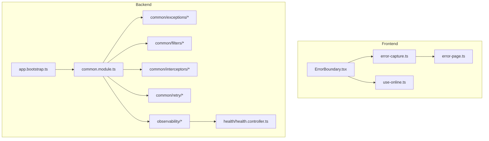
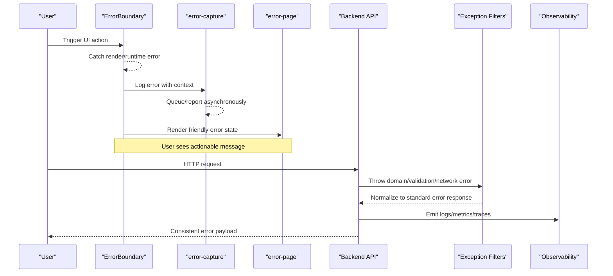
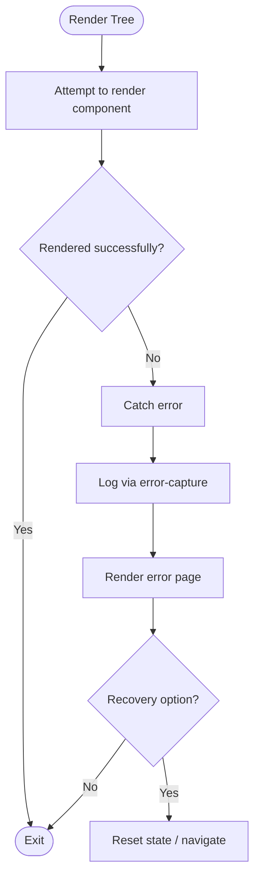
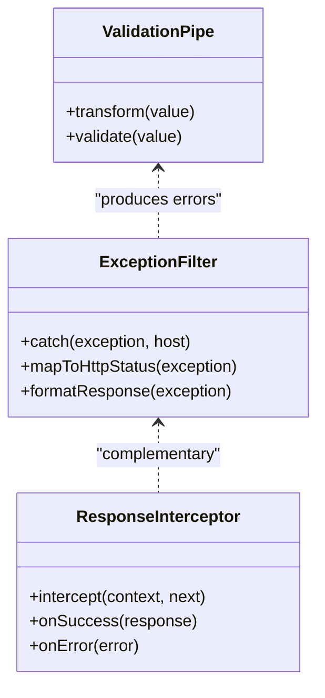
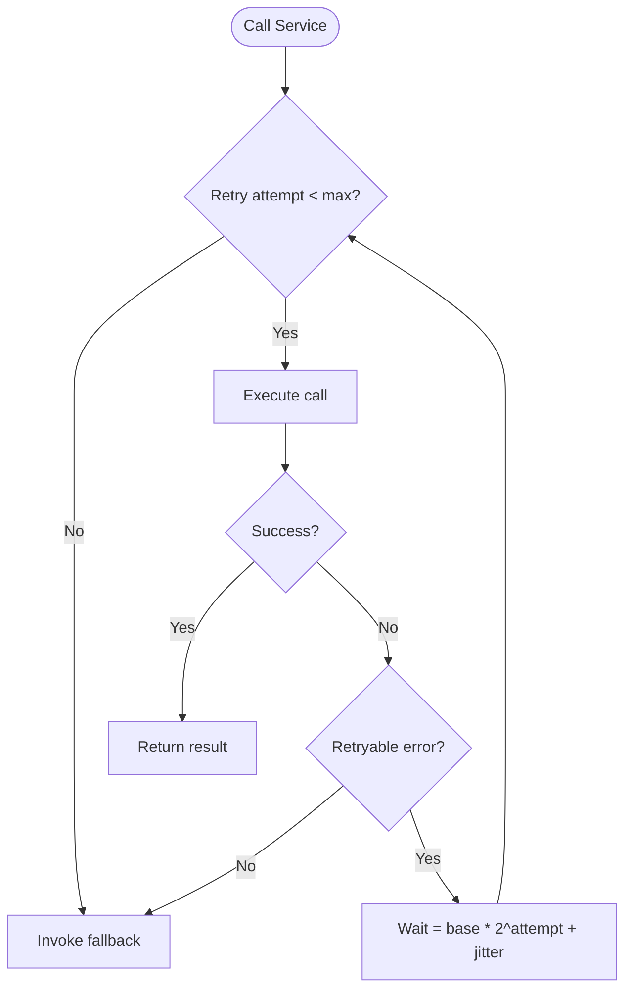
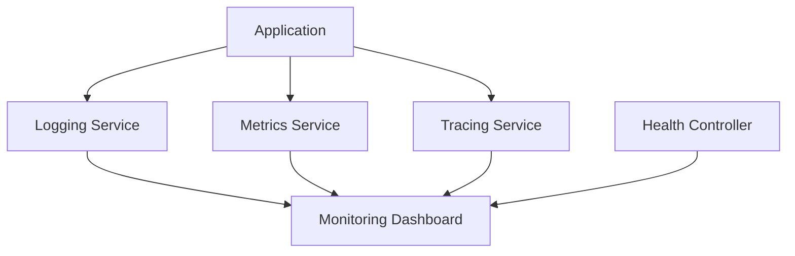
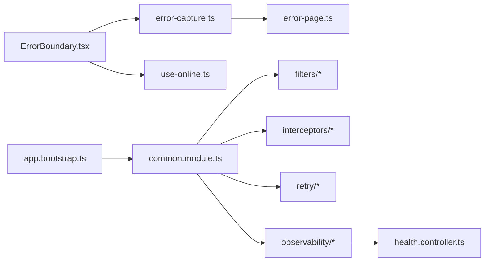

# Error Handling & Retry Strategies

<cite>
**Referenced Files in This Document**
- [ErrorBoundary.tsx](file://src/components/common/ErrorBoundary.tsx)
- [error-capture.ts](file://src/lib/error-capture.ts)
- [error-page.ts](file://src/lib/error-page.ts)
- [lovable-error-reporting.ts](file://src/lib/lovable-error-reporting.ts)
- [use-online.ts](file://src/hooks/use-online.ts)
- [app.bootstrap.ts](file://apps/backend/src/app.bootstrap.ts)
- [common.module.ts](file://apps/backend/src/common/common.module.ts)
- [exceptions](file://apps/backend/src/common/exceptions)
- [filters](file://apps/backend/src/common/filters)
- [interceptors](file://apps/backend/src/common/interceptors)
- [retry](file://apps/backend/src/common/retry)
- [logging.service.ts](file://apps/backend/src/observability/logging.service.ts)
- [metrics.service.ts](file://apps/backend/src/observability/metrics.service.ts)
- [tracing.service.ts](file://apps/backend/src/observability/tracing.service.ts)
- [request-metrics.middleware.ts](file://apps/backend/src/observability/request-metrics.middleware.ts)
- [health.controller.ts](file://apps/backend/src/health/health.controller.ts)
</cite>

## Table of Contents
1. [Introduction](#introduction)
2. [Project Structure](#project-structure)
3. [Core Components](#core-components)
4. [Architecture Overview](#architecture-overview)
5. [Detailed Component Analysis](#detailed-component-analysis)
6. [Dependency Analysis](#dependency-analysis)
7. [Performance Considerations](#performance-considerations)
8. [Troubleshooting Guide](#troubleshooting-guide)
9. [Conclusion](#conclusion)

## Introduction
This document explains the end-to-end error handling and resilience strategies implemented across the frontend and backend of the application. It covers:
- Frontend error boundaries, user-facing messages, and client-side error logging
- Backend exception filters, global interceptors, and structured logging
- Retry policies with exponential backoff, circuit breaker patterns, and fallback strategies
- Network error handling, API error responses, and validation errors
- Error tracking integration, debugging tools, and monitoring dashboards
- Graceful degradation and offline handling

The goal is to provide a clear, actionable guide for developers and operators to understand how errors are captured, reported, retried, and surfaced to users.

## Project Structure
Error handling spans both the frontend (React-based UI) and the backend (NestJS). Key areas include:
- Frontend:
  - Global error boundary component to catch rendering/runtime errors
  - Client-side error capture and reporting utilities
  - Online/offline awareness hooks
- Backend:
  - Global exception filters and response interceptors
  - Structured logging, metrics, and tracing services
  - Health check endpoints for observability
  - Shared retry utilities and common modules

**Diagram sources**
- [ErrorBoundary.tsx](file://src/components/common/ErrorBoundary.tsx)
- [error-capture.ts](file://src/lib/error-capture.ts)
- [error-page.ts](file://src/lib/error-page.ts)
- [use-online.ts](file://src/hooks/use-online.ts)
- [app.bootstrap.ts](file://apps/backend/src/app.bootstrap.ts)
- [common.module.ts](file://apps/backend/src/common/common.module.ts)
- [health.controller.ts](file://apps/backend/src/health/health.controller.ts)

**Section sources**
- [ErrorBoundary.tsx](file://src/components/common/ErrorBoundary.tsx)
- [error-capture.ts](file://src/lib/error-capture.ts)
- [error-page.ts](file://src/lib/error-page.ts)
- [use-online.ts](file://src/hooks/use-online.ts)
- [app.bootstrap.ts](file://apps/backend/src/app.bootstrap.ts)
- [common.module.ts](file://apps/backend/src/common/common.module.ts)
- [health.controller.ts](file://apps/backend/src/health/health.controller.ts)

## Core Components
- Frontend Error Boundary:
  - Catches unhandled React errors during render and lifecycle phases
  - Provides a user-friendly error state and optional recovery actions
  - Integrates with client-side error capture for centralized logging
- Client-Side Error Capture and Reporting:
  - Centralized utility to log errors with context and metadata
  - Optional integration with external error tracking platforms
  - Supports offline queuing or deferred reporting when connectivity is available
- Error Page:
  - Renders consistent error states for unexpected failures
  - Offers guidance and navigation options to recover
- Backend Common Module:
  - Registers global exception filters, interceptors, and shared utilities
  - Ensures consistent error shapes and logging across controllers
- Observability Services:
  - Logging service for structured logs
  - Metrics service for error rates, latency, and health signals
  - Tracing service for distributed request correlation
- Health Controller:
  - Exposes readiness/liveness endpoints used by orchestrators and dashboards

**Section sources**
- [ErrorBoundary.tsx](file://src/components/common/ErrorBoundary.tsx)
- [error-capture.ts](file://src/lib/error-capture.ts)
- [error-page.ts](file://src/lib/error-page.ts)
- [common.module.ts](file://apps/backend/src/common/common.module.ts)
- [logging.service.ts](file://apps/backend/src/observability/logging.service.ts)
- [metrics.service.ts](file://apps/backend/src/observability/metrics.service.ts)
- [tracing.service.ts](file://apps/backend/src/observability/tracing.service.ts)
- [health.controller.ts](file://apps/backend/src/health/health.controller.ts)

## Architecture Overview
The system applies layered error handling:
- Frontend:
  - UI-level boundaries isolate component failures
  - Client-side capture aggregates errors and reports them asynchronously
  - Offline detection informs graceful degradation
- Backend:
  - Global filters normalize exceptions into consistent API responses
  - Interceptors add cross-cutting concerns like timing and error metrics
  - Observability services emit logs, metrics, and traces for each error
  - Health endpoints expose operational status

**Diagram sources**
- [ErrorBoundary.tsx](file://src/components/common/ErrorBoundary.tsx)
- [error-capture.ts](file://src/lib/error-capture.ts)
- [error-page.ts](file://src/lib/error-page.ts)
- [common.module.ts](file://apps/backend/src/common/common.module.ts)
- [logging.service.ts](file://apps/backend/src/observability/logging.service.ts)
- [metrics.service.ts](file://apps/backend/src/observability/metrics.service.ts)
- [tracing.service.ts](file://apps/backend/src/observability/tracing.service.ts)

## Detailed Component Analysis

### Frontend Error Boundary
- Purpose:
  - Prevents full app crashes from isolated component failures
  - Captures stack traces and contextual data
  - Presents a stable UI state with recovery options
- Behavior:
  - Wraps critical route/component trees
  - On error, renders a user-friendly page and triggers client-side logging
  - Optionally resets state or navigates to a safe route
- Integration:
  - Uses client-side error capture to centralize reporting
  - Can adapt messaging based on online/offline status

**Diagram sources**
- [ErrorBoundary.tsx](file://src/components/common/ErrorBoundary.tsx)
- [error-capture.ts](file://src/lib/error-capture.ts)
- [error-page.ts](file://src/lib/error-page.ts)

**Section sources**
- [ErrorBoundary.tsx](file://src/components/common/ErrorBoundary.tsx)
- [error-capture.ts](file://src/lib/error-capture.ts)
- [error-page.ts](file://src/lib/error-page.ts)

### Client-Side Error Capture and Reporting
- Responsibilities:
  - Aggregate errors with timestamps, environment info, and user context
  - Deduplicate noisy errors where appropriate
  - Report to centralized systems; queue if offline
- Design considerations:
  - Avoid blocking UI; use background tasks
  - Respect privacy and minimize sensitive data
  - Provide toggles for development vs production behavior

**Section sources**
- [error-capture.ts](file://src/lib/error-capture.ts)
- [lovable-error-reporting.ts](file://src/lib/lovable-error-reporting.ts)

### Online/Offline Awareness
- Hook usage:
  - Detects network availability changes
  - Enables offline-first behaviors such as caching and queued operations
- Error handling:
  - Distinguishes transient network issues from server errors
  - Adjusts retry/backoff strategies based on connectivity

**Section sources**
- [use-online.ts](file://src/hooks/use-online.ts)

### Backend Exception Filters and Response Interceptors
- Exception Filters:
  - Convert thrown exceptions into standardized HTTP responses
  - Map domain-specific errors to user-friendly messages
  - Attach correlation IDs for traceability
- Response Interceptors:
  - Add timing, error flags, and metrics to responses
  - Ensure consistent envelope structure for success and error payloads
- Validation Errors:
  - Use DTO validation to return structured field-level errors
  - Surface clear messages to clients for correction

**Diagram sources**
- [common.module.ts](file://apps/backend/src/common/common.module.ts)
- [filters](file://apps/backend/src/common/filters)
- [interceptors](file://apps/backend/src/common/interceptors)
- [exceptions](file://apps/backend/src/common/exceptions)

**Section sources**
- [common.module.ts](file://apps/backend/src/common/common.module.ts)
- [filters](file://apps/backend/src/common/filters)
- [interceptors](file://apps/backend/src/common/interceptors)
- [exceptions](file://apps/backend/src/common/exceptions)

### Retry Policies with Exponential Backoff
- Strategy:
  - Implement retry decorators or wrappers around flaky calls
  - Apply exponential backoff with jitter to avoid thundering herds
  - Limit max retries and define retryable error classes/status codes
- Usage:
  - Wrap network requests, external API calls, and database operations
  - Combine with circuit breaker to prevent cascading failures

**Diagram sources**
- [retry](file://apps/backend/src/common/retry)

**Section sources**
- [retry](file://apps/backend/src/common/retry)

### Circuit Breaker Patterns and Fallback Strategies
- Pattern:
  - Monitor failure rate and open the circuit after threshold breaches
  - Short-circuit calls while degraded, returning cached or default values
  - Gradually allow limited traffic through to test recovery
- Fallbacks:
  - Serve stale data, defaults, or partial results
  - Inform users about reduced functionality without breaking UX

[No sources needed since this section provides general guidance]

### Network Error Handling and API Error Responses
- Frontend:
  - Classify network timeouts, cancellations, and server errors
  - Present actionable messages and offer retry or alternative flows
- Backend:
  - Normalize all errors to a consistent schema
  - Include correlation IDs and localized messages where applicable

**Section sources**
- [error-capture.ts](file://src/lib/error-capture.ts)
- [error-page.ts](file://src/lib/error-page.ts)
- [common.module.ts](file://apps/backend/src/common/common.module.ts)

### Validation Errors
- Approach:
  - Validate inputs at the API boundary using DTOs and pipes
  - Return detailed field-level errors with human-readable messages
  - Surface validation feedback in the UI promptly

**Section sources**
- [common.module.ts](file://apps/backend/src/common/common.module.ts)
- [exceptions](file://apps/backend/src/common/exceptions)

### Error Tracking Integration and Monitoring Dashboards
- Logging:
  - Structured logs with severity, context, and correlation IDs
- Metrics:
  - Track error rates, latency percentiles, and saturation signals
- Tracing:
  - Propagate correlation IDs across services for end-to-end visibility
- Health:
  - Readiness/liveness probes for orchestration and alerting

**Diagram sources**
- [logging.service.ts](file://apps/backend/src/observability/logging.service.ts)
- [metrics.service.ts](file://apps/backend/src/observability/metrics.service.ts)
- [tracing.service.ts](file://apps/backend/src/observability/tracing.service.ts)
- [health.controller.ts](file://apps/backend/src/health/health.controller.ts)

**Section sources**
- [logging.service.ts](file://apps/backend/src/observability/logging.service.ts)
- [metrics.service.ts](file://apps/backend/src/observability/metrics.service.ts)
- [tracing.service.ts](file://apps/backend/src/observability/tracing.service.ts)
- [health.controller.ts](file://apps/backend/src/health/health.controller.ts)

### Graceful Degradation and Offline Error Handling
- Offline-first:
  - Cache critical data and defer writes until connectivity returns
  - Show optimistic UI with clear indicators of sync state
- Degradation:
  - Disable non-essential features under load or failure conditions
  - Provide minimal viable experience with core functionality intact

**Section sources**
- [use-online.ts](file://src/hooks/use-online.ts)
- [error-page.ts](file://src/lib/error-page.ts)

## Dependency Analysis
The error handling strategy depends on cohesive integration between frontend components and backend infrastructure:
- Frontend components rely on error capture and online/offline hooks
- Backend relies on common module wiring for filters, interceptors, and observability
- Observability services depend on structured logging and metrics collection

**Diagram sources**
- [ErrorBoundary.tsx](file://src/components/common/ErrorBoundary.tsx)
- [error-capture.ts](file://src/lib/error-capture.ts)
- [error-page.ts](file://src/lib/error-page.ts)
- [use-online.ts](file://src/hooks/use-online.ts)
- [app.bootstrap.ts](file://apps/backend/src/app.bootstrap.ts)
- [common.module.ts](file://apps/backend/src/common/common.module.ts)
- [health.controller.ts](file://apps/backend/src/health/health.controller.ts)

**Section sources**
- [app.bootstrap.ts](file://apps/backend/src/app.bootstrap.ts)
- [common.module.ts](file://apps/backend/src/common/common.module.ts)

## Performance Considerations
- Keep error capture lightweight to avoid UI jank; batch and debounce where possible
- Use exponential backoff with jitter to reduce load spikes during outages
- Prefer short-circuiting via circuit breakers to protect downstream services
- Minimize payload size in error logs; avoid sensitive data
- Leverage metrics and tracing to identify hotspots and optimize retry thresholds

[No sources needed since this section provides general guidance]

## Troubleshooting Guide
- Symptom: UI crashes on specific routes
  - Check ErrorBoundary coverage and ensure it wraps route trees
  - Inspect client-side error logs for stack traces and context
- Symptom: Repeated network failures
  - Verify retry configuration and backoff parameters
  - Confirm circuit breaker thresholds and fallback behavior
- Symptom: Inconsistent error messages
  - Review backend exception filters and DTO validation rules
  - Ensure correlation IDs are present for tracing
- Symptom: Missing observability data
  - Validate logging, metrics, and tracing initialization
  - Check health endpoint responsiveness

**Section sources**
- [error-capture.ts](file://src/lib/error-capture.ts)
- [error-page.ts](file://src/lib/error-page.ts)
- [common.module.ts](file://apps/backend/src/common/common.module.ts)
- [logging.service.ts](file://apps/backend/src/observability/logging.service.ts)
- [metrics.service.ts](file://apps/backend/src/observability/metrics.service.ts)
- [tracing.service.ts](file://apps/backend/src/observability/tracing.service.ts)
- [health.controller.ts](file://apps/backend/src/health/health.controller.ts)

## Conclusion
A robust error handling strategy combines resilient UI patterns, consistent backend error normalization, and comprehensive observability. By implementing error boundaries, structured logging, retry with exponential backoff, circuit breakers, and fallbacks, the application maintains reliability and a positive user experience even under adverse conditions. Monitoring and health checks enable proactive operations and rapid incident resolution.