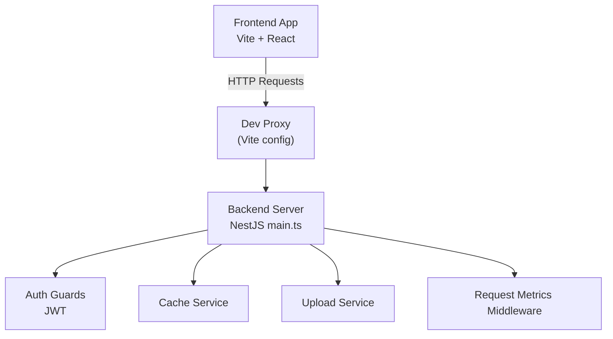
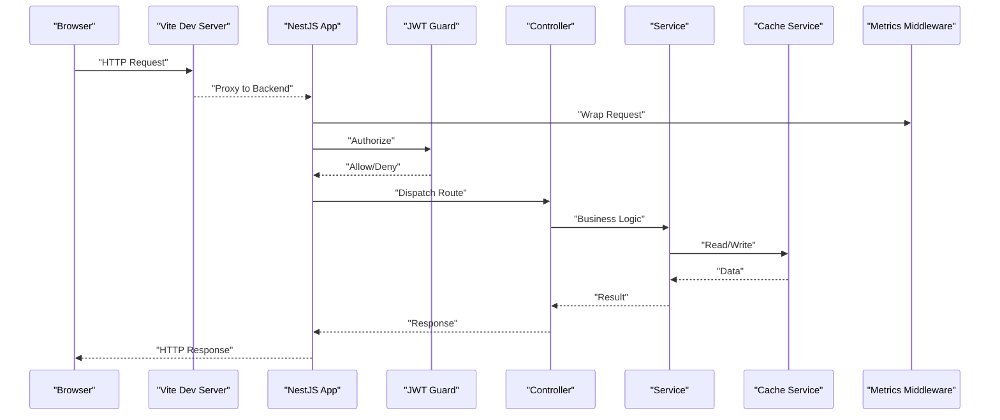
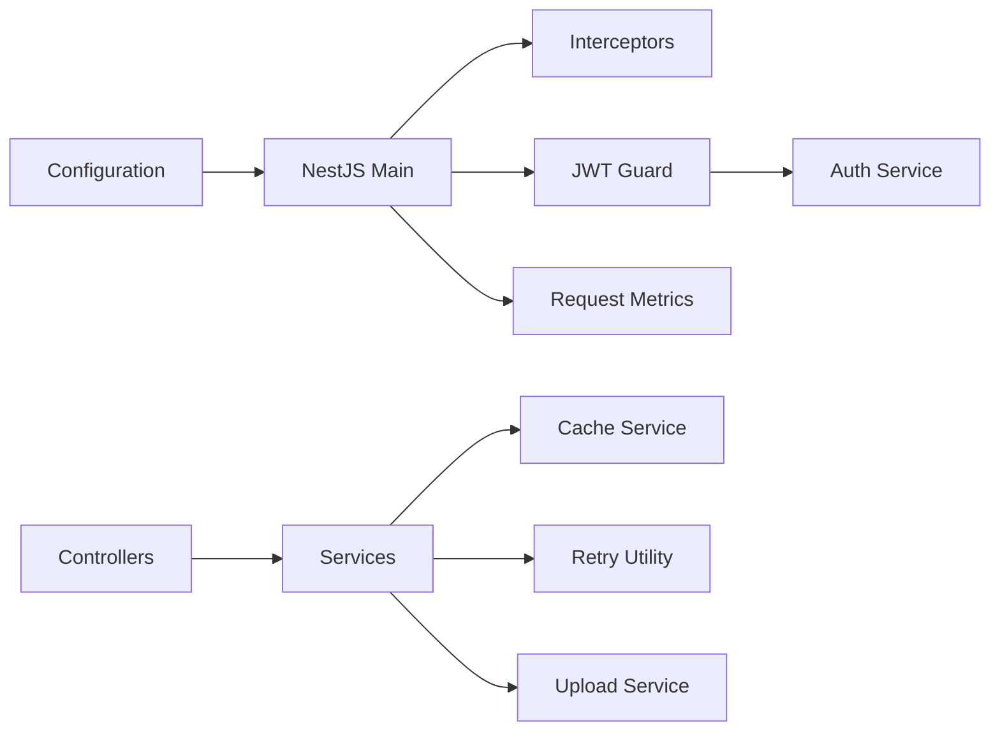
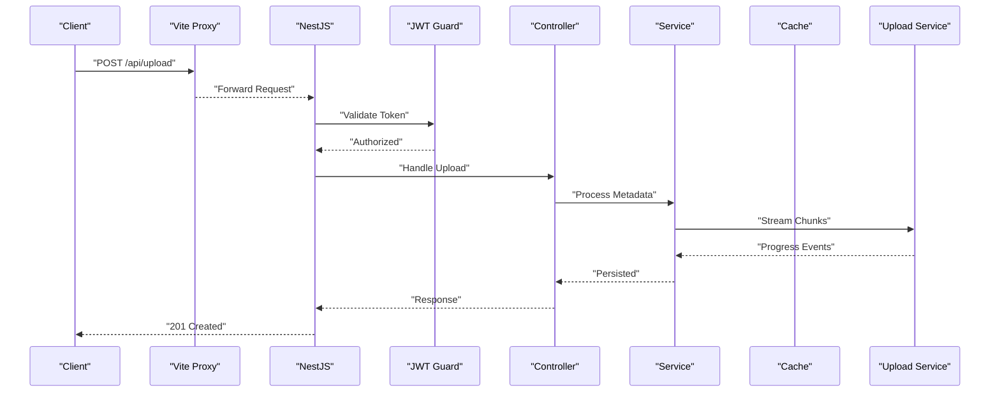
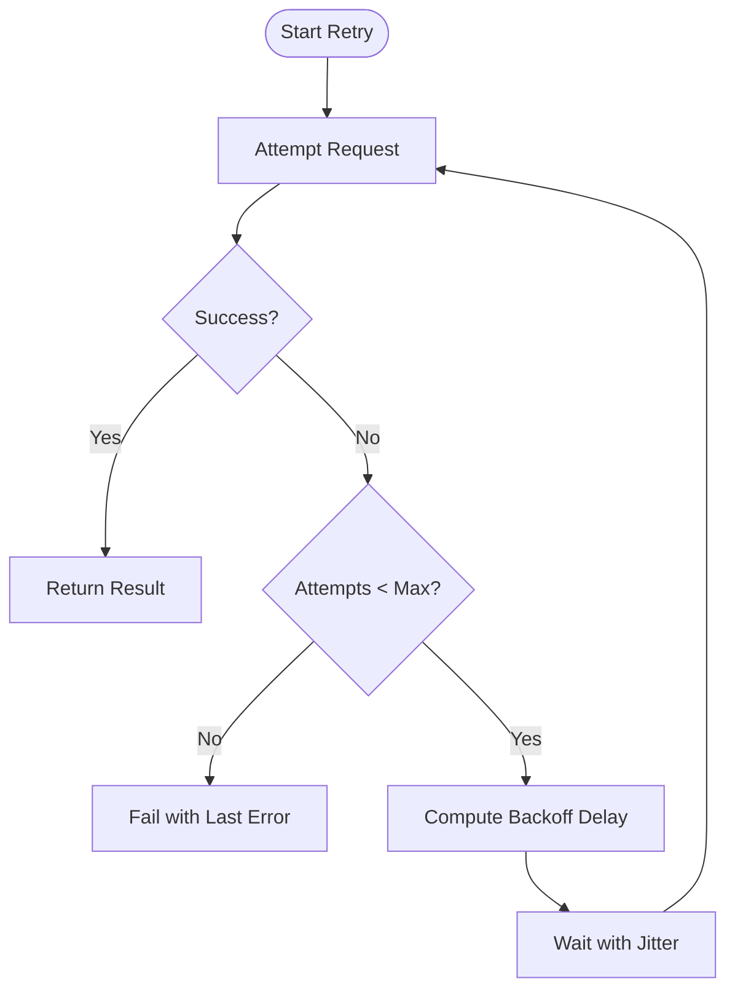

# HTTP Client & Request Handling

<cite>
**Referenced Files in This Document**
- [package.json](file://package.json)
- [vite.config.ts](file://vite.config.ts)
- [src/server.ts](file://src/server.ts)
- [src/start.ts](file://src/start.ts)
- [apps/backend/src/main.ts](file://apps/backend/src/main.ts)
- [apps/backend/src/app.module.ts](file://apps/backend/src/app.module.ts)
- [apps/backend/src/config/configuration.ts](file://apps/backend/src/config/configuration.ts)
- [apps/backend/src/common/retry/index.ts](file://apps/backend/src/common/retry/index.ts)
- [apps/backend/src/common/interceptors/index.ts](file://apps/backend/src/common/interceptors/index.ts)
- [apps/backend/src/core/cache/cache.service.ts](file://apps/backend/src/core/cache/cache.service.ts)
- [apps/backend/src/storage/upload.service.ts](file://apps/backend/src/storage/upload.service.ts)
- [apps/backend/src/auth/guards/jwt-auth.guard.ts](file://apps/backend/src/auth/guards/jwt-auth.guard.ts)
- [apps/backend/src/auth/services/auth.service.ts](file://apps/backend/src/auth/services/auth.service.ts)
- [apps/backend/src/observability/request-metrics.middleware.ts](file://apps/backend/src/observability/request-metrics.middleware.ts)
</cite>

## Table of Contents
1. [Introduction](#introduction)
2. [Project Structure](#project-structure)
3. [Core Components](#core-components)
4. [Architecture Overview](#architecture-overview)
5. [Detailed Component Analysis](#detailed-component-analysis)
6. [Dependency Analysis](#dependency-analysis)
7. [Performance Considerations](#performance-considerations)
8. [Troubleshooting Guide](#troubleshooting-guide)
9. [Conclusion](#conclusion)
10. [Appendices](#appendices)

## Introduction
This document explains the HTTP client implementation and request handling patterns across the frontend and backend layers. It covers RESTful API client configuration, base URL management, endpoint organization, interceptors for requests and responses, authentication token injection, error handling strategies, caching mechanisms, retry logic with exponential backoff, optimistic updates, request cancellation, timeout handling, progress tracking for file uploads, and mock API setup for development and testing.

## Project Structure
The project is a full-stack application:
- Frontend (Vite-based SPA): Uses a build toolchain that proxies API calls to the backend during development.
- Backend (NestJS): Provides REST endpoints, middleware, guards, services, and utilities for retries, caching, observability, and storage.

Key areas relevant to HTTP client and request handling:
- Frontend proxy and server entry points configure how client requests are routed and served locally.
- Backend modules define controllers, guards, interceptors, and services that process incoming requests and return responses.
- Configuration files centralize environment variables such as base URLs and feature flags.
- Common utilities provide retry policies, caching, and metrics.

**Diagram sources**
- [vite.config.ts](file://vite.config.ts)
- [src/server.ts](file://src/server.ts)
- [src/start.ts](file://src/start.ts)
- [apps/backend/src/main.ts](file://apps/backend/src/main.ts)

**Section sources**
- [package.json](file://package.json)
- [vite.config.ts](file://vite.config.ts)
- [src/server.ts](file://src/server.ts)
- [src/start.ts](file://src/start.ts)
- [apps/backend/src/main.ts](file://apps/backend/src/main.ts)

## Core Components
- Base URL and Environment Configuration: Centralized via configuration files; used by both frontend proxy and backend services.
- Interceptors: NestJS interceptors handle cross-cutting concerns like logging, timing, and response transformation.
- Authentication: JWT guard enforces authorization on protected routes; auth service manages tokens and sessions.
- Caching: In-memory or Redis-backed cache service supports read-through/write-through patterns.
- Retry Logic: Exponential backoff utility for resilient network calls.
- Uploads: Streaming upload service with progress events and chunking support.
- Observability: Request metrics middleware captures latency, status codes, and throughput.

**Section sources**
- [apps/backend/src/config/configuration.ts](file://apps/backend/src/config/configuration.ts)
- [apps/backend/src/common/interceptors/index.ts](file://apps/backend/src/common/interceptors/index.ts)
- [apps/backend/src/auth/guards/jwt-auth.guard.ts](file://apps/backend/src/auth/guards/jwt-auth.guard.ts)
- [apps/backend/src/auth/services/auth.service.ts](file://apps/backend/src/auth/services/auth.service.ts)
- [apps/backend/src/core/cache/cache.service.ts](file://apps/backend/src/core/cache/cache.service.ts)
- [apps/backend/src/common/retry/index.ts](file://apps/backend/src/common/retry/index.ts)
- [apps/backend/src/storage/upload.service.ts](file://apps/backend/src/storage/upload.service.ts)
- [apps/backend/src/observability/request-metrics.middleware.ts](file://apps/backend/src/observability/request-metrics.middleware.ts)

## Architecture Overview
The HTTP flow spans from the browser to the backend services:
- The frontend issues fetch/XHR requests. During development, Vite proxies these to the backend.
- The backend’s main entry bootstraps NestJS, registers global interceptors, guards, and middleware.
- Controllers receive requests, apply guards (e.g., JWT), call services, and return structured responses.
- Services may use caching, retries, and upload utilities.
- Observability middleware records metrics for each request.

**Diagram sources**
- [vite.config.ts](file://vite.config.ts)
- [apps/backend/src/main.ts](file://apps/backend/src/main.ts)
- [apps/backend/src/auth/guards/jwt-auth.guard.ts](file://apps/backend/src/auth/guards/jwt-auth.guard.ts)
- [apps/backend/src/core/cache/cache.service.ts](file://apps/backend/src/core/cache/cache.service.ts)
- [apps/backend/src/observability/request-metrics.middleware.ts](file://apps/backend/src/observability/request-metrics.middleware.ts)

## Detailed Component Analysis

### Base URL Management and Endpoint Organization
- Base URL is configured centrally and consumed by both frontend proxy and backend services.
- Endpoints are organized by domain modules (auth, storage, analytics, etc.) under controllers.
- Development uses a proxy to forward requests to the backend without CORS issues.

Implementation highlights:
- Vite dev server proxies API paths to the backend host/port.
- Backend reads environment variables for base URL and service endpoints.

**Section sources**
- [vite.config.ts](file://vite.config.ts)
- [apps/backend/src/config/configuration.ts](file://apps/backend/src/config/configuration.ts)

### Request/Response Interceptors
- Global interceptors standardize request/response transformations, logging, and error mapping.
- Typical responsibilities include adding correlation IDs, timing requests, and normalizing payloads.

Patterns:
- Use NestJS Interceptors to wrap controller handlers.
- Apply at the module or global level for consistent behavior.

**Section sources**
- [apps/backend/src/common/interceptors/index.ts](file://apps/backend/src/common/interceptors/index.ts)

### Authentication Token Injection
- Protected routes enforce JWT via a custom guard.
- Tokens are validated and attached to the request context for downstream services.
- Auth service handles token issuance, refresh, and session management.

Flow:
- Client includes Authorization header with Bearer token.
- Guard verifies signature and expiry, then attaches user info to request.

**Section sources**
- [apps/backend/src/auth/guards/jwt-auth.guard.ts](file://apps/backend/src/auth/guards/jwt-auth.guard.ts)
- [apps/backend/src/auth/services/auth.service.ts](file://apps/backend/src/auth/services/auth.service.ts)

### Error Handling Strategies
- Centralized exception filters map domain errors to consistent HTTP responses.
- Interceptors normalize error shapes and include correlation IDs.
- Client-side code should handle specific status codes and retry where appropriate.

Best practices:
- Distinguish between client errors (4xx) and server errors (5xx).
- Surface actionable messages to users while preserving detailed logs server-side.

**Section sources**
- [apps/backend/src/common/interceptors/index.ts](file://apps/backend/src/common/interceptors/index.ts)

### Caching Mechanisms
- Cache service provides get/set operations with TTL and invalidation hooks.
- Read-heavy endpoints can leverage cache-first strategies.
- Write-through or write-behind patterns ensure consistency.

Considerations:
- Choose appropriate TTL per resource volatility.
- Implement cache warming for critical endpoints.

**Section sources**
- [apps/backend/src/core/cache/cache.service.ts](file://apps/backend/src/core/cache/cache.service.ts)

### Retry Logic with Exponential Backoff
- Retry utility encapsulates exponential backoff, jitter, and max attempts.
- Ideal for transient failures (network blips, rate limits).
- Configure per-operation based on idempotency and cost.

Algorithm overview:
- Compute delay = baseDelay * (backoffFactor ^ attempt) + jitter.
- Stop when maxAttempts reached or success occurs.

**Section sources**
- [apps/backend/src/common/retry/index.ts](file://apps/backend/src/common/retry/index.ts)

### Optimistic Updates
- UI updates immediately upon user action, then reconciles with server state.
- On failure, revert changes and notify the user.
- Combine with cache invalidation to keep data fresh.

Guidelines:
- Only apply to idempotent mutations.
- Provide rollback paths and clear feedback.

[No sources needed since this section doesn't analyze specific files]

### Request Cancellation and Timeout Handling
- Use AbortController to cancel in-flight requests on navigation or user action.
- Set timeouts to prevent hanging requests; surface timeout errors to users.
- For long-running tasks, prefer polling or websockets.

Client tips:
- Attach abort signals to fetch calls.
- Wrap timeouts around async operations.

[No sources needed since this section doesn't analyze specific files]

### Progress Tracking for File Uploads
- Upload service streams multipart/form-data with chunked transfers.
- Emit progress events to update UI indicators.
- Support resumable uploads for large files.

Flow:
- Client initiates upload with metadata.
- Server streams chunks, persists to storage, and returns progress callbacks.

**Section sources**
- [apps/backend/src/storage/upload.service.ts](file://apps/backend/src/storage/upload.service.ts)

### Mock API Setup for Development and Testing
- Use Vite proxy to route API calls to a local mock server.
- Seed test data and stub external dependencies.
- Isolate tests from real network calls using mocks.

Approach:
- Define JSON fixtures and respond based on request patterns.
- Validate contracts with schema checks.

[No sources needed since this section doesn't analyze specific files]

## Dependency Analysis
The HTTP layer depends on configuration, guards, services, and middleware. The following diagram shows key relationships:

**Diagram sources**
- [apps/backend/src/config/configuration.ts](file://apps/backend/src/config/configuration.ts)
- [apps/backend/src/main.ts](file://apps/backend/src/main.ts)
- [apps/backend/src/common/interceptors/index.ts](file://apps/backend/src/common/interceptors/index.ts)
- [apps/backend/src/auth/guards/jwt-auth.guard.ts](file://apps/backend/src/auth/guards/jwt-auth.guard.ts)
- [apps/backend/src/auth/services/auth.service.ts](file://apps/backend/src/auth/services/auth.service.ts)
- [apps/backend/src/core/cache/cache.service.ts](file://apps/backend/src/core/cache/cache.service.ts)
- [apps/backend/src/common/retry/index.ts](file://apps/backend/src/common/retry/index.ts)
- [apps/backend/src/storage/upload.service.ts](file://apps/backend/src/storage/upload.service.ts)
- [apps/backend/src/observability/request-metrics.middleware.ts](file://apps/backend/src/observability/request-metrics.middleware.ts)

**Section sources**
- [apps/backend/src/app.module.ts](file://apps/backend/src/app.module.ts)
- [apps/backend/src/main.ts](file://apps/backend/src/main.ts)

## Performance Considerations
- Prefer GET caching for stable resources; invalidate on writes.
- Use compression and pagination for large datasets.
- Tune retry parameters to avoid thundering herds.
- Stream uploads to reduce memory pressure.
- Monitor metrics to identify hotspots and optimize accordingly.

[No sources needed since this section provides general guidance]

## Troubleshooting Guide
Common issues and resolutions:
- 401 Unauthorized: Ensure token is present and valid; refresh if expired.
- 429 Too Many Requests: Increase retry backoff or implement queueing.
- Timeouts: Check network latency and adjust client timeouts.
- Upload failures: Verify chunk size and resume capability.
- Cache inconsistencies: Clear cache keys and verify TTL settings.

Debugging steps:
- Inspect request headers and payload.
- Review server logs and correlation IDs.
- Enable verbose logging in development.

**Section sources**
- [apps/backend/src/observability/request-metrics.middleware.ts](file://apps/backend/src/observability/request-metrics.middleware.ts)

## Conclusion
The HTTP client and request handling system combines robust configuration, centralized interceptors, secure authentication, resilient retries, caching, and streaming uploads. By following the patterns outlined here, teams can maintain consistent, reliable, and observable API interactions across the application.

[No sources needed since this section summarizes without analyzing specific files]

## Appendices

### A. Request Flow Sequence Diagram

**Diagram sources**
- [vite.config.ts](file://vite.config.ts)
- [apps/backend/src/main.ts](file://apps/backend/src/main.ts)
- [apps/backend/src/auth/guards/jwt-auth.guard.ts](file://apps/backend/src/auth/guards/jwt-auth.guard.ts)
- [apps/backend/src/storage/upload.service.ts](file://apps/backend/src/storage/upload.service.ts)

### B. Retry Algorithm Flowchart

**Diagram sources**
- [apps/backend/src/common/retry/index.ts](file://apps/backend/src/common/retry/index.ts)