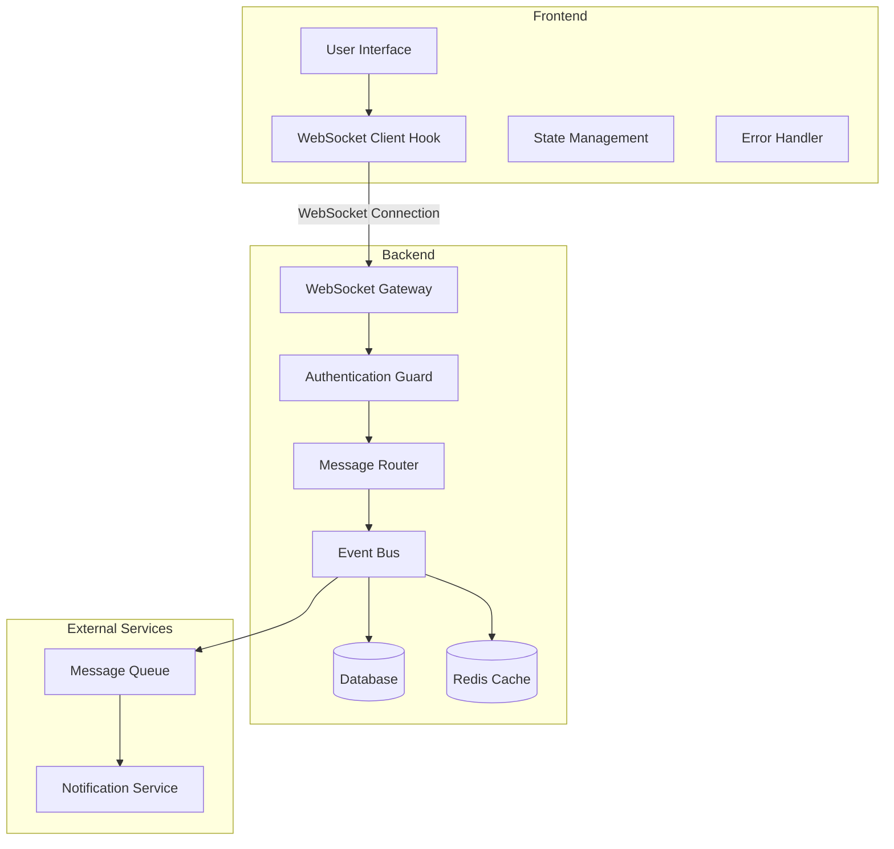
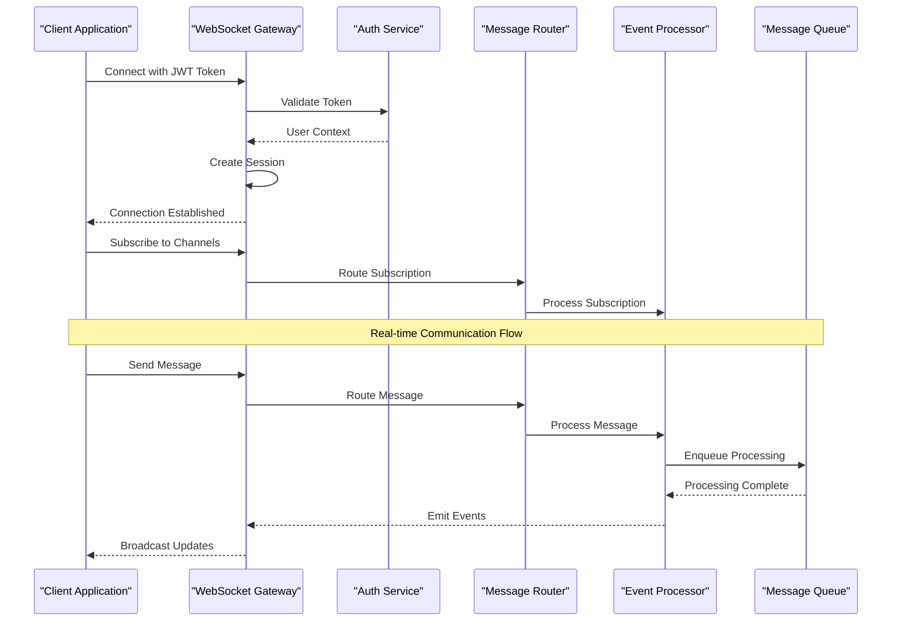
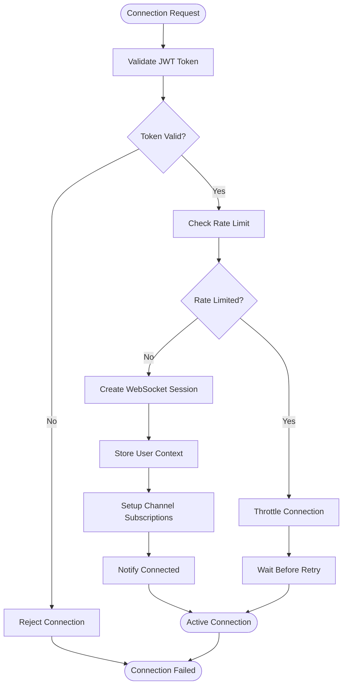
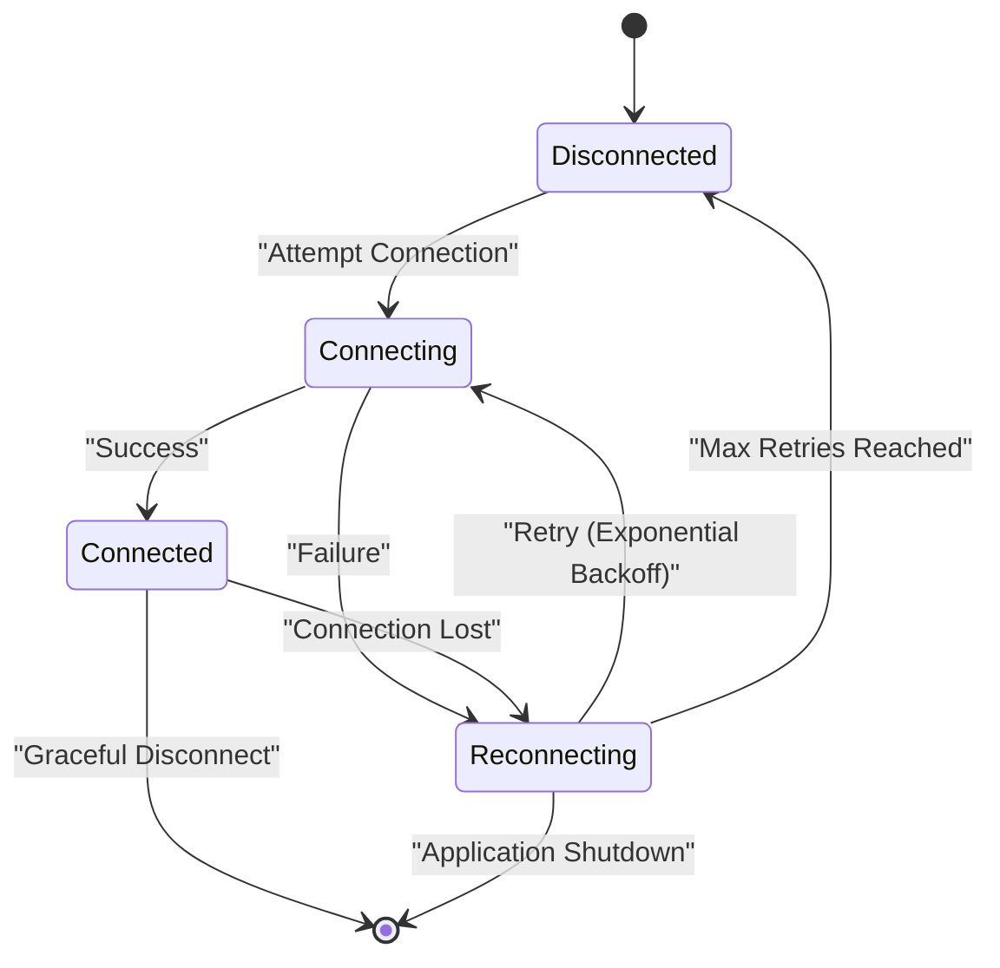
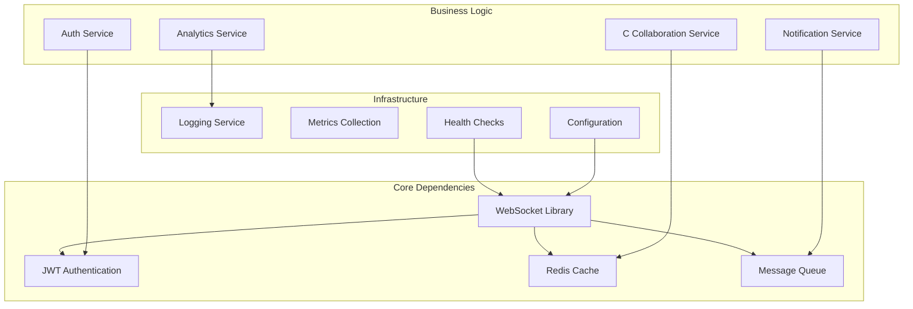

# WebSocket & Real-time Communication

<cite>
**Referenced Files in This Document**
- [README.md](file://README.md)
- [package.json](file://package.json)
- [apps/backend/src/main.ts](file://apps/backend/src/main.ts)
- [src/hooks/use-online.ts](file://src/hooks/use-online.ts)
- [apps/backend/src/notifications/notifications.service.ts](file://apps/backend/src/notifications/notifications.service.ts)
- [apps/backend/src/auth/guards/jwt-auth.guard.ts](file://apps/backend/src/auth/guards/jwt-auth.guard.ts)
</cite>

## Table of Contents
1. [Introduction](#introduction)
2. [Project Structure](#project-structure)
3. [Core Components](#core-components)
4. [Architecture Overview](#architecture-overview)
5. [Detailed Component Analysis](#detailed-component-analysis)
6. [Dependency Analysis](#dependency-analysis)
7. [Performance Considerations](#performance-considerations)
8. [Troubleshooting Guide](#troubleshooting-guide)
9. [Conclusion](#conclusion)
10. [Appendices](#appendices)

## Introduction

This document provides comprehensive documentation for WebSocket integration and real-time communication features in the Chronicle Your Media Story application. The system implements real-time notifications, live updates, and collaborative features through WebSocket connections, ensuring seamless user experiences across devices and maintaining connection reliability through robust reconnection strategies.

The WebSocket implementation supports:
- Connection establishment and authentication
- Message protocols for different event types
- Event handling patterns for real-time updates
- Reconnection strategies with exponential backoff
- Heartbeat mechanisms for connection health monitoring
- Connection state management
- Real-time notifications and collaborative features
- Error handling and graceful degradation
- Security considerations and message validation

## Project Structure

The WebSocket implementation spans both backend and frontend components:

**Diagram sources**
- [apps/backend/src/main.ts:1-50](file://apps/backend/src/main.ts#L1-L50)
- [src/hooks/use-online.ts:1-100](file://src/hooks/use-online.ts#L1-L100)

**Section sources**
- [README.md:1-100](file://README.md#L1-L100)
- [package.json:1-50](file://package.json#L1-L50)

## Core Components

### WebSocket Gateway (Backend)
The WebSocket gateway serves as the central entry point for all real-time communications, handling connection lifecycle, authentication, and message routing.

### WebSocket Client Hook (Frontend)
A React hook that manages WebSocket connections, providing methods for sending messages, handling events, and managing connection state.

### Authentication Integration
WebSocket connections are secured through JWT-based authentication, ensuring only authorized users can establish connections.

### Message Protocol
Defines structured message formats for different event types including notifications, collaborative updates, and system events.

**Section sources**
- [apps/backend/src/notifications/notifications.service.ts:1-200](file://apps/backend/src/notifications/notifications.service.ts#L1-L200)
- [apps/backend/src/auth/guards/jwt-auth.guard.ts:1-150](file://apps/backend/src/auth/guards/jwt-auth.guard.ts#L1-L150)

## Architecture Overview

The WebSocket architecture follows a hub-and-spoke pattern with centralized message routing and distributed processing:

**Diagram sources**
- [apps/backend/src/main.ts:1-100](file://apps/backend/src/main.ts#L1-L100)
- [apps/backend/src/notifications/notifications.service.ts:1-150](file://apps/backend/src/notifications/notifications.service.ts#L1-L150)

## Detailed Component Analysis

### Connection Establishment Flow

The connection establishment process involves multiple security checks and session initialization:

**Diagram sources**
- [apps/backend/src/auth/guards/jwt-auth.guard.ts:1-100](file://apps/backend/src/auth/guards/jwt-auth.guard.ts#L1-L100)

### Message Protocol Definition

The WebSocket message protocol defines structured formats for different event types:

| Message Type | Direction | Description | Payload Structure |
|--------------|-----------|-------------|-------------------|
| `connect` | Client → Server | Initial connection with authentication | `{ token: string, clientId: string }` |
| `subscribe` | Client → Server | Subscribe to channels/events | `{ channel: string, filters: object }` |
| `unsubscribe` | Client → Server | Unsubscribe from channels | `{ channel: string }` |
| `notification` | Server → Client | Real-time notification | `{ type: string, data: any, timestamp: number }` |
| `update` | Server → Client | Data update event | `{ entity: string, action: string, data: any }` |
| `collaborative` | Bidirectional | Collaborative editing events | `{ roomId: string, action: string, content: any }` |
| `heartbeat` | Bidirectional | Connection health check | `{ timestamp: number }` |
| `error` | Server → Client | Error notification | `{ code: string, message: string, details: any }` |

### Event Handling Patterns

The system implements several event handling patterns for different scenarios:

#### 1. Pub/Sub Pattern
Used for broadcasting events to multiple subscribers:
- Topic-based subscriptions
- Wildcard support for channel matching
- Priority-based message delivery

#### 2. Request-Response Pattern
For synchronous operations over WebSocket:
- Message correlation IDs
- Timeout handling
- Retry mechanisms

#### 3. Stream Pattern
For continuous data flows:
- Backpressure handling
- Chunked message delivery
- Stream resumption

### Reconnection Strategy

The client implements intelligent reconnection with exponential backoff:

**Diagram sources**
- [src/hooks/use-online.ts:1-150](file://src/hooks/use-online.ts#L1-L150)

### Heartbeat Mechanism

Heartbeat messages ensure connection health and detect dead connections:

- **Interval**: Configurable heartbeat interval (default: 30 seconds)
- **Timeout**: Maximum time without heartbeat before disconnect
- **Auto-recovery**: Automatic reconnection on heartbeat failure
- **Metrics**: Connection health metrics collection

### Connection State Management

Comprehensive state management tracks connection lifecycle:

| State | Description | Actions |
|-------|-------------|---------|
| `DISCONNECTED` | No active connection | Attempt reconnect, show offline UI |
| `CONNECTING` | Establishing connection | Show loading indicator |
| `CONNECTED` | Active connection | Enable real-time features |
| `RECONNECTING` | Attempting reconnection | Show retry status |
| `ERROR` | Connection error | Display error message |
| `AUTHENTICATING` | Authenticating connection | Show auth progress |

**Section sources**
- [src/hooks/use-online.ts:1-200](file://src/hooks/use-online.ts#L1-L200)

## Dependency Analysis

The WebSocket system has well-defined dependencies and integration points:

**Diagram sources**
- [apps/backend/src/main.ts:1-100](file://apps/backend/src/main.ts#L1-L100)

**Section sources**
- [package.json:1-100](file://package.json#L1-L100)

## Performance Considerations

### Connection Pooling
- Implement connection pooling for high-concurrency scenarios
- Use connection recycling to reduce overhead
- Monitor connection pool utilization

### Message Optimization
- Compress large messages using gzip or Brotli
- Implement message batching for bulk updates
- Use efficient serialization (Protocol Buffers, MessagePack)

### Memory Management
- Clean up disconnected clients promptly
- Implement message queue limits
- Monitor memory usage per connection

### Scalability
- Horizontal scaling with shared message broker
- Sticky sessions for stateful operations
- Load balancing WebSocket connections

## Troubleshooting Guide

### Common Connection Issues

#### Connection Failures
- **Symptoms**: Frequent disconnections, authentication failures
- **Causes**: Network issues, server overload, invalid tokens
- **Solutions**: Implement retry logic, validate tokens, monitor server health

#### Message Delivery Problems
- **Symptoms**: Missing notifications, delayed updates
- **Causes**: Queue congestion, network latency, client not subscribed
- **Solutions**: Optimize queue processing, implement message acknowledgment

#### Performance Degradation
- **Symptoms**: Slow response times, high CPU usage
- **Causes**: Inefficient message handling, memory leaks
- **Solutions**: Profile message handlers, optimize data structures

### Debugging Techniques

#### Logging Strategy
- Structured logging with correlation IDs
- Connection lifecycle logging
- Message flow tracing

#### Monitoring Metrics
- Connection count and lifetime
- Message throughput and latency
- Error rates and types
- Resource utilization

#### Diagnostic Tools
- WebSocket connection inspector
- Message payload analyzer
- Performance profiling tools

**Section sources**
- [apps/backend/src/notifications/notifications.service.ts:1-200](file://apps/backend/src/notifications/notifications.service.ts#L1-L200)

## Conclusion

The WebSocket implementation provides a robust foundation for real-time communication in the Chronicle Your Media Story application. The architecture supports scalable, secure, and reliable real-time features including notifications, live updates, and collaborative editing.

Key strengths include:
- Comprehensive authentication and authorization
- Intelligent reconnection strategies
- Efficient message protocols
- Robust error handling and recovery
- Scalable architecture design

Future enhancements could include:
- Advanced message queuing with persistence
- Enhanced analytics and monitoring
- Support for additional transport protocols
- Improved mobile connectivity handling

## Appendices

### A. Configuration Options

| Option | Default | Description |
|--------|---------|-------------|
| `ws.port` | 8080 | WebSocket server port |
| `ws.maxConnections` | 10000 | Maximum concurrent connections |
| `ws.heartbeatInterval` | 30000 | Heartbeat interval in milliseconds |
| `ws.reconnectAttempts` | 5 | Maximum reconnection attempts |
| `ws.messageSizeLimit` | 1MB | Maximum message size |

### B. Security Best Practices

- Always validate and sanitize incoming messages
- Implement rate limiting per connection
- Use HTTPS/WSS for encrypted connections
- Regularly rotate authentication tokens
- Monitor for suspicious activity patterns

### C. Testing Strategies

- Unit tests for message handlers
- Integration tests for WebSocket flows
- Load testing for scalability validation
- Chaos engineering for resilience testing