# Build & Optimization

<cite>
**Referenced Files in This Document**
- [vite.config.ts](file://vite.config.ts)
- [package.json](file://package.json)
- [tsconfig.json](file://tsconfig.json)
- [bunfig.toml](file://bunfig.toml)
- [.npmrc](file://.npmrc)
- [src/server.ts](file://src/server.ts)
- [src/start.ts](file://src/start.ts)
- [public/manifest.webmanifest](file://public/manifest.webmanifest)
- [public/robots.txt](file://public/robots.txt)
- [public/sitemap.xml](file://public/sitemap.xml)
</cite>

## Table of Contents
1. [Introduction](#introduction)
2. [Project Structure](#project-structure)
3. [Core Components](#core-components)
4. [Architecture Overview](#architecture-overview)
5. [Detailed Component Analysis](#detailed-component-analysis)
6. [Dependency Analysis](#dependency-analysis)
7. [Performance Considerations](#performance-considerations)
8. [Troubleshooting Guide](#troubleshooting-guide)
9. [Conclusion](#conclusion)
10. [Appendices](#appendices)

## Introduction
This document explains the build system and performance optimization strategies for the project, focusing on Vite configuration, bundling optimizations, code splitting, lazy loading, TypeScript compilation settings, path aliases, development experience improvements, asset optimization, static file handling, bundle analysis, performance monitoring, production deployment optimizations, environment-specific configurations, development server setup, and debugging tools integration.

## Project Structure
The build and optimization configuration is primarily defined by:
- Vite configuration for bundling, dev server, plugins, and optimization
- TypeScript configuration for compilation and path aliases
- Package scripts for building, previewing, and analyzing bundles
- Bun runtime configuration for development and build execution
- Static assets under public for PWA and SEO resources

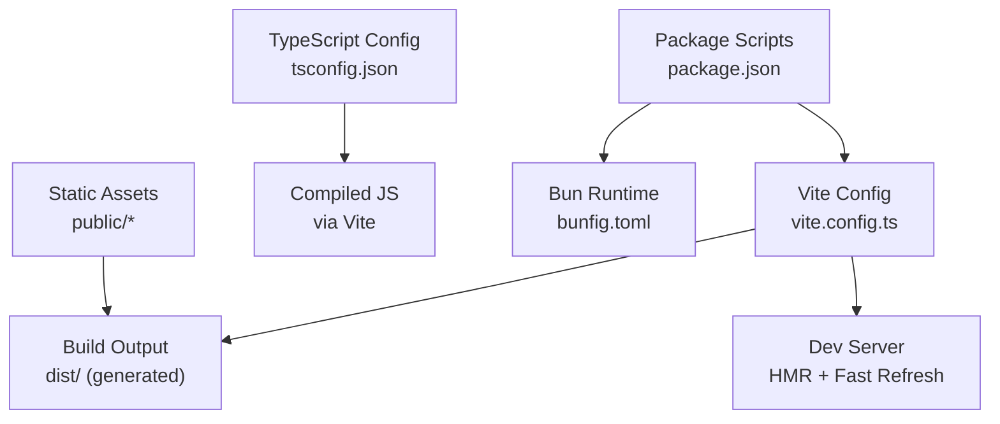

**Diagram sources**
- [vite.config.ts](file://vite.config.ts)
- [tsconfig.json](file://tsconfig.json)
- [package.json](file://package.json)
- [bunfig.toml](file://bunfig.toml)
- [public/manifest.webmanifest](file://public/manifest.webmanifest)
- [public/robots.txt](file://public/robots.txt)
- [public/sitemap.xml](file://public/sitemap.xml)

**Section sources**
- [vite.config.ts](file://vite.config.ts)
- [tsconfig.json](file://tsconfig.json)
- [package.json](file://package.json)
- [bunfig.toml](file://bunfig.toml)
- [public/manifest.webmanifest](file://public/manifest.webmanifest)
- [public/robots.txt](file://public/robots.txt)
- [public/sitemap.xml](file://public/sitemap.xml)

## Core Components
- Vite configuration centralizes bundling, plugins, optimization, and dev server behavior
- TypeScript configuration defines compilation targets, module resolution, and path aliases
- Package scripts orchestrate build, preview, and analysis workflows
- Bun configuration tunes runtime behavior for faster builds and dev server startup
- Static assets provide PWA manifest, robots, and sitemap for SEO and offline support

**Section sources**
- [vite.config.ts](file://vite.config.ts)
- [tsconfig.json](file://tsconfig.json)
- [package.json](file://package.json)
- [bunfig.toml](file://bunfig.toml)
- [public/manifest.webmanifest](file://public/manifest.webmanifest)
- [public/robots.txt](file://public/robots.txt)
- [public/sitemap.xml](file://public/sitemap.xml)

## Architecture Overview
The build pipeline transforms source code into optimized production assets using Vite and TypeScript, with Bun as the runtime for development and build tasks. Static assets are served directly from the public directory. The development server provides hot module replacement and fast refresh to improve developer productivity.

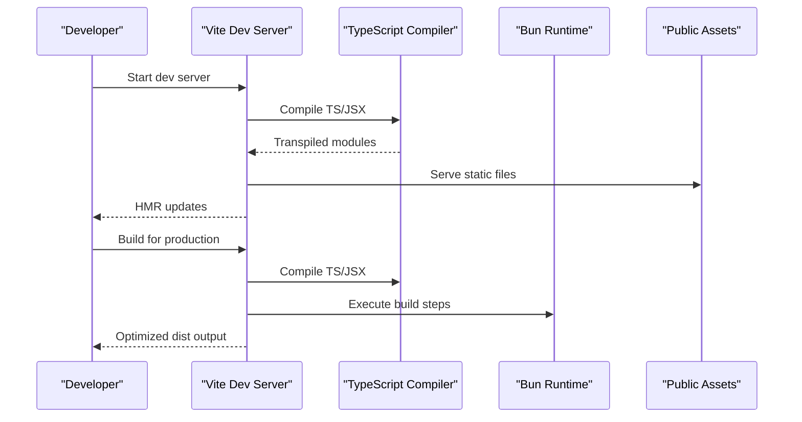

**Diagram sources**
- [vite.config.ts](file://vite.config.ts)
- [tsconfig.json](file://tsconfig.json)
- [package.json](file://package.json)
- [bunfig.toml](file://bunfig.toml)
- [public/manifest.webmanifest](file://public/manifest.webmanifest)
- [public/robots.txt](file://public/robots.txt)
- [public/sitemap.xml](file://public/sitemap.xml)

## Detailed Component Analysis

### Vite Configuration and Bundling Optimization
- Entry points and base URL configuration
- Plugin ecosystem for React, TypeScript, CSS, and image processing
- Code splitting via dynamic imports and route-based chunks
- Tree shaking and dead code elimination
- Minification and compression settings
- Cache-friendly asset hashing and versioning

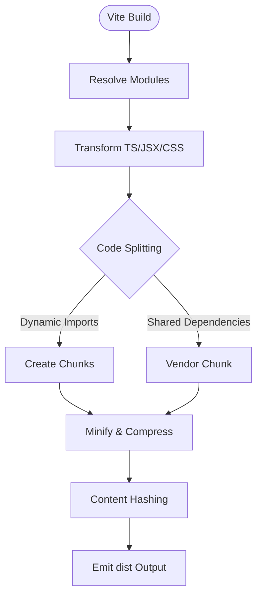

**Diagram sources**
- [vite.config.ts](file://vite.config.ts)

**Section sources**
- [vite.config.ts](file://vite.config.ts)

### TypeScript Compilation Settings and Path Aliases
- Target and module resolution settings
- Strict type checking and JSX transformation
- Path aliases for cleaner imports
- Declaration generation and incremental compilation

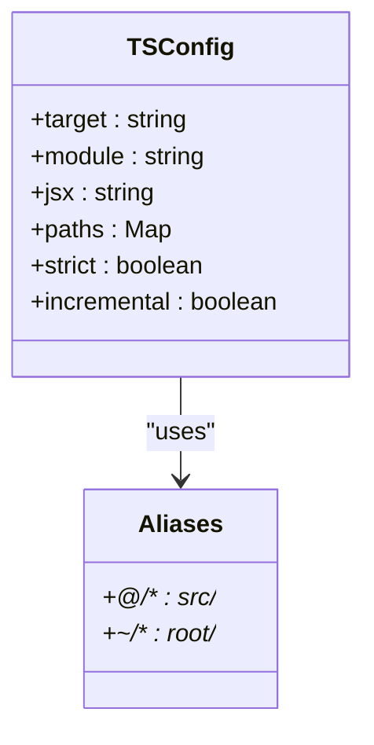

**Diagram sources**
- [tsconfig.json](file://tsconfig.json)

**Section sources**
- [tsconfig.json](file://tsconfig.json)

### Development Experience Improvements
- Hot Module Replacement (HMR) for instant feedback
- Fast Refresh for state-preserving component updates
- Environment variable injection for feature flags and API endpoints
- Debugging tools integration via browser devtools and Node/Bun inspector

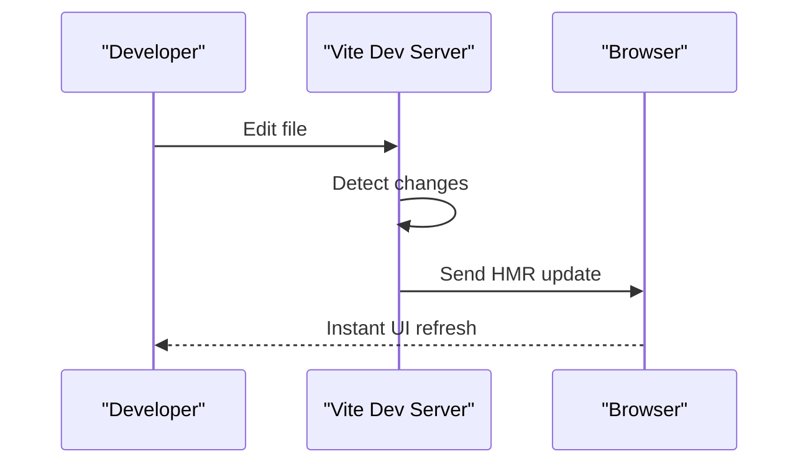

**Diagram sources**
- [vite.config.ts](file://vite.config.ts)

**Section sources**
- [vite.config.ts](file://vite.config.ts)

### Asset Optimization and Static File Handling
- Image processing via Vite plugins for format conversion and resizing
- SVG optimization and inline usage
- Static assets served from public directory without transformation
- PWA manifest and service worker configuration for offline support

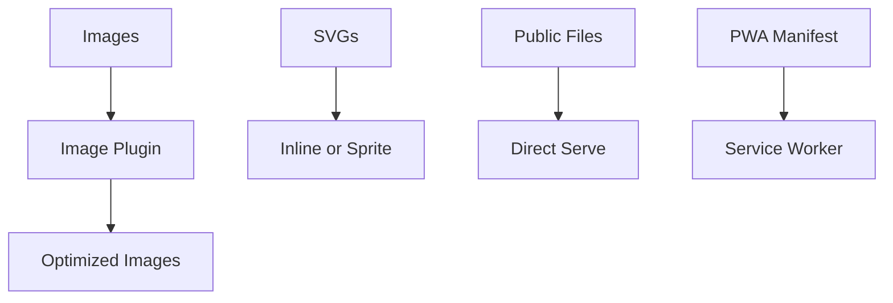

**Diagram sources**
- [vite.config.ts](file://vite.config.ts)
- [public/manifest.webmanifest](file://public/manifest.webmanifest)

**Section sources**
- [vite.config.ts](file://vite.config.ts)
- [public/manifest.webmanifest](file://public/manifest.webmanifest)

### Bundle Analysis and Performance Monitoring
- Integration with bundle analyzers to visualize chunk sizes
- Metrics collection for runtime performance
- Production build artifacts inspection

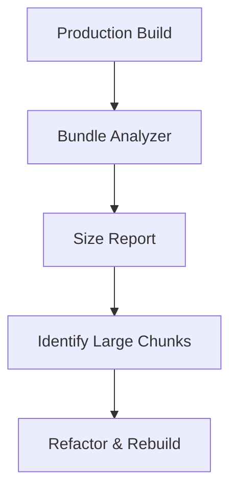

**Diagram sources**
- [package.json](file://package.json)
- [vite.config.ts](file://vite.config.ts)

**Section sources**
- [package.json](file://package.json)
- [vite.config.ts](file://vite.config.ts)

### Production Deployment Optimizations
- Minified and compressed output
- Cache busting via content hashes
- Preloading critical resources
- HTTP/2 and caching headers configuration

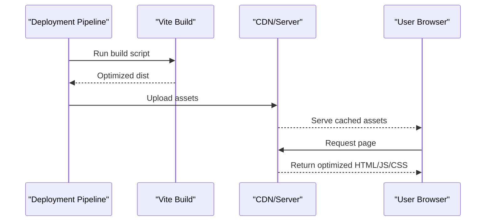

**Diagram sources**
- [package.json](file://package.json)
- [vite.config.ts](file://vite.config.ts)

**Section sources**
- [package.json](file://package.json)
- [vite.config.ts](file://vite.config.ts)

### Environment-Specific Configurations
- Development vs production mode toggles
- Feature flags and API endpoints per environment
- Logging levels and debug flags

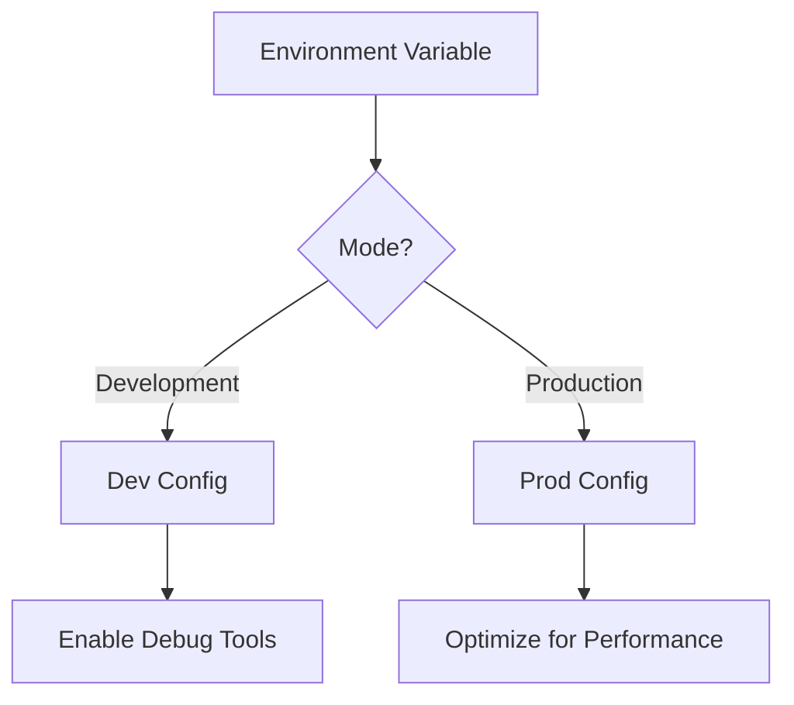

**Diagram sources**
- [vite.config.ts](file://vite.config.ts)
- [package.json](file://package.json)

**Section sources**
- [vite.config.ts](file://vite.config.ts)
- [package.json](file://package.json)

### Development Server Setup and Debugging Tools Integration
- Local server configuration with proxy settings
- CORS and HTTPS for local development
- Integration with browser devtools and Node/Bun inspector

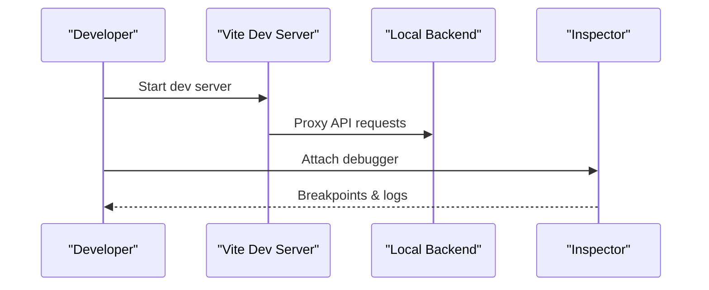

**Diagram sources**
- [vite.config.ts](file://vite.config.ts)
- [src/server.ts](file://src/server.ts)
- [src/start.ts](file://src/start.ts)

**Section sources**
- [vite.config.ts](file://vite.config.ts)
- [src/server.ts](file://src/server.ts)
- [src/start.ts](file://src/start.ts)

## Dependency Analysis
The build system relies on Vite, TypeScript, and Bun for a cohesive development and production workflow. Static assets are managed separately from code assets.

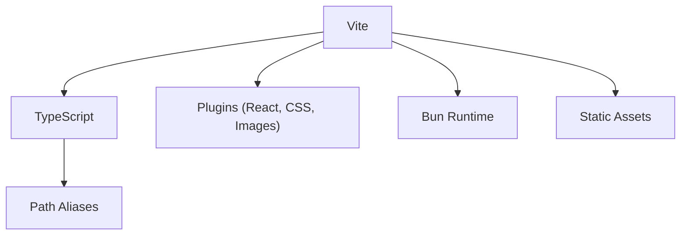

**Diagram sources**
- [vite.config.ts](file://vite.config.ts)
- [tsconfig.json](file://tsconfig.json)
- [bunfig.toml](file://bunfig.toml)
- [package.json](file://package.json)

**Section sources**
- [vite.config.ts](file://vite.config.ts)
- [tsconfig.json](file://tsconfig.json)
- [bunfig.toml](file://bunfig.toml)
- [package.json](file://package.json)

## Performance Considerations
- Enable aggressive code splitting for large applications
- Use dynamic imports for heavy components and routes
- Optimize images with modern formats and responsive sizing
- Leverage browser caching with content hashes
- Monitor bundle size regularly and refactor large dependencies

[No sources needed since this section provides general guidance]

## Troubleshooting Guide
- Verify Vite plugin compatibility and versions
- Check TypeScript errors and strict mode settings
- Ensure static assets are correctly referenced and served
- Validate environment variables and feature flags
- Use bundle analyzer to identify performance bottlenecks

**Section sources**
- [vite.config.ts](file://vite.config.ts)
- [tsconfig.json](file://tsconfig.json)
- [package.json](file://package.json)

## Conclusion
The build system leverages Vite, TypeScript, and Bun to deliver a fast, efficient development and production workflow. With careful configuration of bundling, code splitting, asset optimization, and environment-specific settings, the application achieves optimal performance and maintainability.

[No sources needed since this section summarizes without analyzing specific files]

## Appendices
- Additional scripts and utilities for asset management and testing
- Documentation for CI/CD pipelines and deployment automation

[No sources needed since this section provides general guidance]