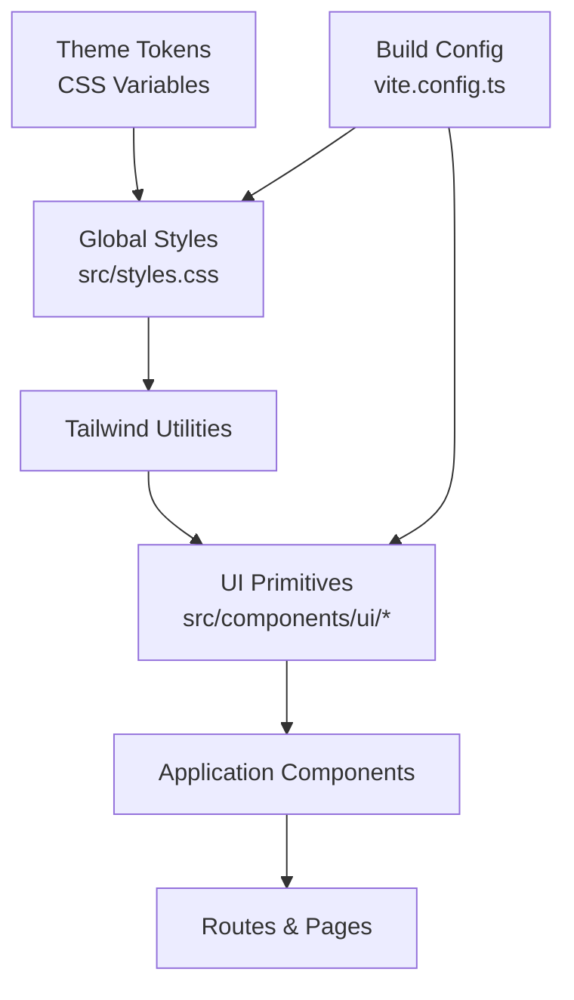
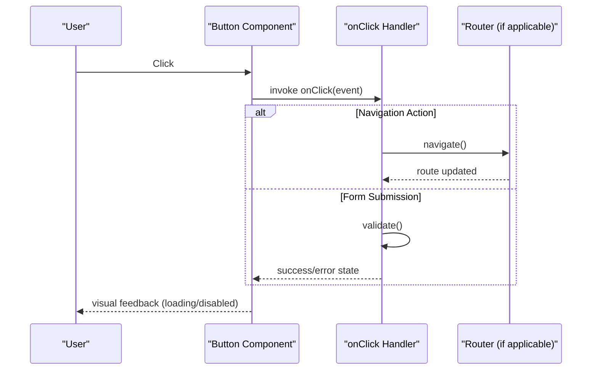
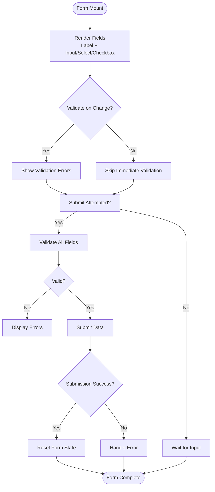
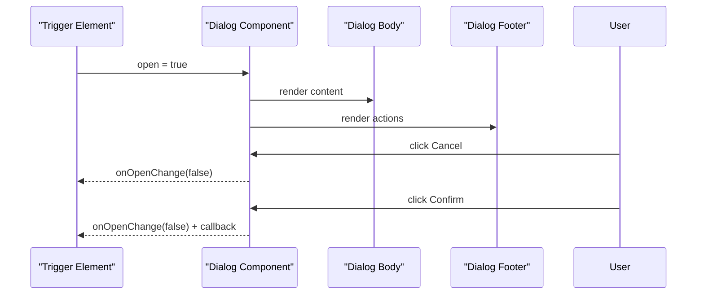
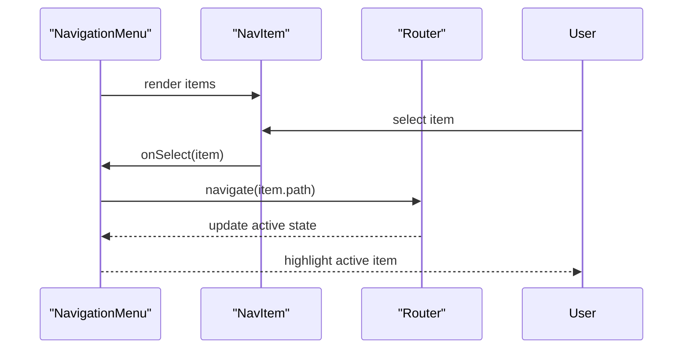
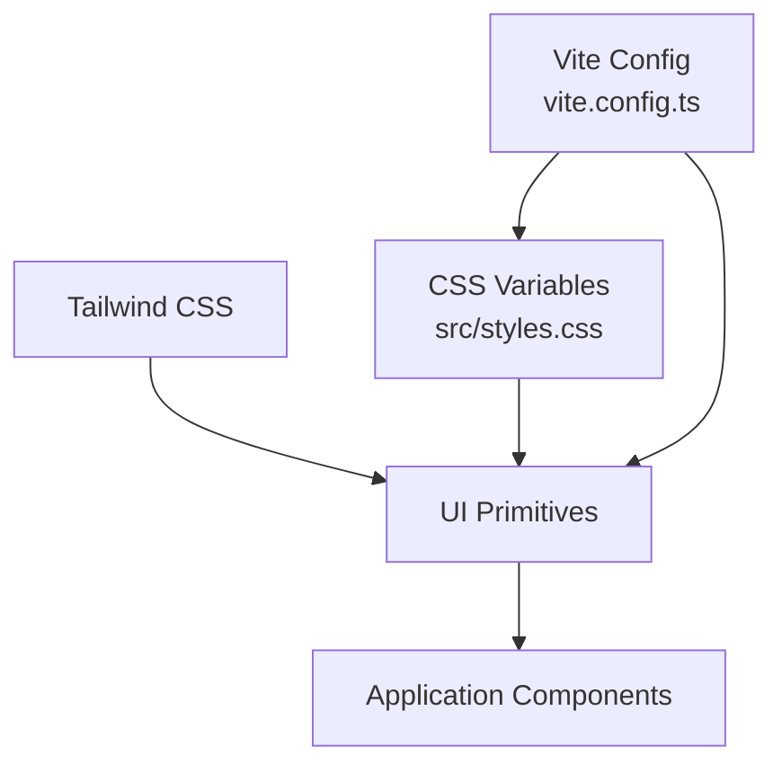

# Component Library

<cite>
**Referenced Files in This Document**
- [components.json](file://components.json)
- [package.json](file://package.json)
- [src/components/ui/button.tsx](file://src/components/ui/button.tsx)
- [src/components/ui/input.tsx](file://src/components/ui/input.tsx)
- [src/components/ui/label.tsx](file://src/components/ui/label.tsx)
- [src/components/ui/form.tsx](file://src/components/ui/form.tsx)
- [src/components/ui/dialog.tsx](file://src/components/ui/dialog.tsx)
- [src/components/ui/dropdown-menu.tsx](file://src/components/ui/dropdown-menu.tsx)
- [src/components/ui/navigation-menu.tsx](file://src/components/ui/navigation-menu.tsx)
- [src/components/ui/card.tsx](file://src/components/ui/card.tsx)
- [src/components/ui/badge.tsx](file://src/components/ui/badge.tsx)
- [src/components/ui/avatar.tsx](file://src/components/ui/avatar.tsx)
- [src/components/ui/accordion.tsx](file://src/components/ui/accordion.tsx)
- [src/components/ui/alert-dialog.tsx](file://src/components/ui/alert-dialog.tsx)
- [src/components/ui/alert.tsx](file://src/components/ui/alert.tsx)
- [src/components/ui/aspect-ratio.tsx](file://src/components/ui/aspect-ratio.tsx)
- [src/components/ui/calendar.tsx](file://src/components/ui/calendar.tsx)
- [src/components/ui/carousel.tsx](file://src/components/ui/carousel.tsx)
- [src/components/ui/chart.tsx](file://src/components/ui/chart.tsx)
- [src/components/ui/checkbox.tsx](file://src/components/ui/checkbox.tsx)
- [src/components/ui/collapsible.tsx](file://src/components/ui/collapsible.tsx)
- [src/components/ui/command.tsx](file://src/components/ui/command.tsx)
- [src/components/ui/context-menu.tsx](file://src/components/ui/context-menu.tsx)
- [src/components/ui/drawer.tsx](file://src/components/ui/drawer.tsx)
- [src/components/ui/hover-card.tsx](file://src/components/ui/hover-card.tsx)
- [src/components/ui/input-otp.tsx](file://src/components/ui/input-otp.tsx)
- [src/components/ui/menubar.tsx](file://src/components/ui/menubar.tsx)
- [src/components/ui/pagination.tsx](file://src/components/ui/pagination.tsx)
- [src/components/ui/popover.tsx](file://src/components/ui/popover.tsx)
- [src/components/ui/progress.tsx](file://src/components/ui/progress.tsx)
- [src/components/ui/radio-group.tsx](file://src/components/ui/radio-group.tsx)
- [src/components/ui/resizable.tsx](file://src/components/ui/resizable.tsx)
- [src/components/ui/scroll-area.tsx](file://src/components/ui/scroll-area.tsx)
- [src/components/ui/select.tsx](file://src/components/ui/select.tsx)
- [src/components/ui/separator.tsx](file://src/components/ui/separator.tsx)
- [src/components/ui/sheet.tsx](file://src/components/ui/sheet.tsx)
- [src/components/ui/sidebar.tsx](file://src/components/ui/sidebar.tsx)
- [src/components/ui/skeleton.tsx](file://src/components/ui/skeleton.tsx)
- [src/components/ui/slider.tsx](file://src/components/ui/slider.tsx)
- [src/components/ui/sonner.tsx](file://src/components/ui/sonner.tsx)
- [src/components/ui/switch.tsx](file://src/components/ui/switch.tsx)
- [src/styles.css](file://src/styles.css)
- [vite.config.ts](file://vite.config.ts)
</cite>

## Table of Contents
1. [Introduction](#introduction)
2. [Project Structure](#project-structure)
3. [Core Components](#core-components)
4. [Architecture Overview](#architecture-overview)
5. [Detailed Component Analysis](#detailed-component-analysis)
6. [Dependency Analysis](#dependency-analysis)
7. [Performance Considerations](#performance-considerations)
8. [Troubleshooting Guide](#troubleshooting-guide)
9. [Conclusion](#conclusion)
10. [Appendices](#appendices)

## Introduction
This document provides comprehensive documentation for the React component library built on shadcn/ui within this project. It covers all available UI components, including buttons, forms, modals, navigation elements, and layout components. The guide explains component props, events, slots (children), customization options, usage examples with code snippet paths, styling guidelines, accessibility compliance, composition patterns, theme customization, responsive design implementation, and integration with Tailwind CSS and custom styling approaches.

The library is organized under src/components/ui and follows shadcn/ui conventions: each component is a standalone, composable React component styled with Tailwind CSS classes and themed via CSS variables. Configuration for shadcn/ui is defined in components.json, and global styles are managed through src/styles.css and Vite configuration.

## Project Structure
The component library resides in src/components/ui with one file per component. Higher-level application components import these primitives to build feature-specific UIs. The project uses Tailwind CSS for utility-first styling and CSS variables for theming.

```mermaid
graph TB
subgraph "UI Primitives"
B["button.tsx"]
I["input.tsx"]
L["label.tsx"]
F["form.tsx"]
D["dialog.tsx"]
DM["dropdown-menu.tsx"]
NM["navigation-menu.tsx"]
C["card.tsx"]
A["avatar.tsx"]
ACC["accordion.tsx"]
AD["alert-dialog.tsx"]
AL["alert.tsx"]
AR["aspect-ratio.tsx"]
CAL["calendar.tsx"]
CAR["carousel.tsx"]
CH["chart.tsx"]
CB["checkbox.tsx"]
COL["collapsible.tsx"]
CMD["command.tsx"]
CM["context-menu.tsx"]
DR["drawer.tsx"]
HC["hover-card.tsx"]
IO["input-otp.tsx"]
MB["menubar.tsx"]
PAG["pagination.tsx"]
PO["popover.tsx"]
PR["progress.tsx"]
RG["radio-group.tsx"]
RS["resizable.tsx"]
SA["scroll-area.tsx"]
SEL["select.tsx"]
SEP["separator.tsx"]
SH["sheet.tsx"]
SB["sidebar.tsx"]
SK["skeleton.tsx"]
SL["slider.tsx"]
SO["sonner.tsx"]
SW["switch.tsx"]
end
App["Application Components"] --> B
App --> I
App --> L
App --> F
App --> D
App --> DM
App --> NM
App --> C
App --> A
App --> ACC
App --> AD
App --> AL
App --> AR
App --> CAL
App --> CAR
App --> CH
App --> CB
App --> COL
App --> CMD
App --> CM
App --> DR
App --> HC
App --> IO
App --> MB
App --> PAG
App --> PO
App --> PR
App --> RG
App --> RS
App --> SA
App --> SEL
App --> SEP
App --> SH
App --> SB
App --> SK
App --> SL
App --> SO
App --> SW
```

**Diagram sources**
- [components.json](file://components.json)
- [src/components/ui/button.tsx](file://src/components/ui/button.tsx)
- [src/components/ui/input.tsx](file://src/components/ui/input.tsx)
- [src/components/ui/label.tsx](file://src/components/ui/label.tsx)
- [src/components/ui/form.tsx](file://src/components/ui/form.tsx)
- [src/components/ui/dialog.tsx](file://src/components/ui/dialog.tsx)
- [src/components/ui/dropdown-menu.tsx](file://src/components/ui/dropdown-menu.tsx)
- [src/components/ui/navigation-menu.tsx](file://src/components/ui/navigation-menu.tsx)
- [src/components/ui/card.tsx](file://src/components/ui/card.tsx)
- [src/components/ui/avatar.tsx](file://src/components/ui/avatar.tsx)
- [src/components/ui/accordion.tsx](file://src/components/ui/accordion.tsx)
- [src/components/ui/alert-dialog.tsx](file://src/components/ui/alert-dialog.tsx)
- [src/components/ui/alert.tsx](file://src/components/ui/alert.tsx)
- [src/components/ui/aspect-ratio.tsx](file://src/components/ui/aspect-ratio.tsx)
- [src/components/ui/calendar.tsx](file://src/components/ui/calendar.tsx)
- [src/components/ui/carousel.tsx](file://src/components/ui/carousel.tsx)
- [src/components/ui/chart.tsx](file://src/components/ui/chart.tsx)
- [src/components/ui/checkbox.tsx](file://src/components/ui/checkbox.tsx)
- [src/components/ui/collapsible.tsx](file://src/components/ui/collapsible.tsx)
- [src/components/ui/command.tsx](file://src/components/ui/command.tsx)
- [src/components/ui/context-menu.tsx](file://src/components/ui/context-menu.tsx)
- [src/components/ui/drawer.tsx](file://src/components/ui/drawer.tsx)
- [src/components/ui/hover-card.tsx](file://src/components/ui/hover-card.tsx)
- [src/components/ui/input-otp.tsx](file://src/components/ui/input-otp.tsx)
- [src/components/ui/menubar.tsx](file://src/components/ui/menubar.tsx)
- [src/components/ui/pagination.tsx](file://src/components/ui/pagination.tsx)
- [src/components/ui/popover.tsx](file://src/components/ui/popover.tsx)
- [src/components/ui/progress.tsx](file://src/components/ui/progress.tsx)
- [src/components/ui/radio-group.tsx](file://src/components/ui/radio-group.tsx)
- [src/components/ui/resizable.tsx](file://src/components/ui/resizable.tsx)
- [src/components/ui/scroll-area.tsx](file://src/components/ui/scroll-area.tsx)
- [src/components/ui/select.tsx](file://src/components/ui/select.tsx)
- [src/components/ui/separator.tsx](file://src/components/ui/separator.tsx)
- [src/components/ui/sheet.tsx](file://src/components/ui/sheet.tsx)
- [src/components/ui/sidebar.tsx](file://src/components/ui/sidebar.tsx)
- [src/components/ui/skeleton.tsx](file://src/components/ui/skeleton.tsx)
- [src/components/ui/slider.tsx](file://src/components/ui/slider.tsx)
- [src/components/ui/sonner.tsx](file://src/components/ui/sonner.tsx)
- [src/components/ui/switch.tsx](file://src/components/ui/switch.tsx)

**Section sources**
- [components.json](file://components.json)
- [package.json](file://package.json)
- [src/styles.css](file://src/styles.css)
- [vite.config.ts](file://vite.config.ts)

## Core Components
This section outlines the primary UI primitives used across the application. Each component is designed to be accessible, composable, and customizable via props and Tailwind CSS utilities.

- Button
  - Purpose: Triggers actions or navigates users.
  - Props: variant, size, disabled, loading state, type, onClick handler, className, children.
  - Events: onClick, onKeyDown for keyboard support.
  - Slots: children content (icon + label).
  - Customization: Use variant and size props; override with className or theme tokens.
  - Accessibility: Focusable, supports keyboard activation, aria attributes when needed.
  - Usage example path: [src/components/ui/button.tsx](file://src/components/ui/button.tsx)

- Input
  - Purpose: Collects text input from users.
  - Props: value, onChange, placeholder, disabled, readOnly, type, id, name, required, className.
  - Events: onChange, onFocus, onBlur, onSubmit (when inside form).
  - Slots: none (contentless).
  - Customization: className, theme variables for colors and borders.
  - Accessibility: Associated label via htmlFor/id, error messages via aria-describedby.
  - Usage example path: [src/components/ui/input.tsx](file://src/components/ui/input.tsx)

- Label
  - Purpose: Describes input fields for accessibility and UX.
  - Props: htmlFor, className, children.
  - Events: onClick (for focus management).
  - Slots: children (text or icon).
  - Customization: className, typography tokens.
  - Accessibility: Proper association with inputs using htmlFor/id.
  - Usage example path: [src/components/ui/label.tsx](file://src/components/ui/label.tsx)

- Form
  - Purpose: Wraps form controls and integrates validation and submission.
  - Props: onSubmit, validateOnChange, className, children.
  - Events: onSubmit, field change events propagated by child inputs.
  - Slots: children (Input, Label, Checkbox, Select, etc.).
  - Customization: className, theme tokens.
  - Accessibility: Fieldset/legend patterns, proper labeling, error announcements.
  - Usage example path: [src/components/ui/form.tsx](file://src/components/ui/form.tsx)

- Dialog
  - Purpose: Modal overlay for focused interactions.
  - Props: open, onOpenChange, title, description, children, className.
  - Events: onOpenChange, onClose.
  - Slots: children (header, body, footer).
  - Customization: className, backdrop behavior, focus trap.
  - Accessibility: Focus management, escape key handling, aria-modal.
  - Usage example path: [src/components/ui/dialog.tsx](file://src/components/ui/dialog.tsx)

- Dropdown Menu
  - Purpose: Contextual menu for actions.
  - Props: trigger, items, onSelect, align, sideOffset, className.
  - Events: onSelect, onOpenChange.
  - Slots: trigger element and menu items.
  - Customization: className, item variants.
  - Accessibility: Keyboard navigation, role="menu", aria-haspopup.
  - Usage example path: [src/components/ui/dropdown-menu.tsx](file://src/components/ui/dropdown-menu.tsx)

- Navigation Menu
  - Purpose: Primary site navigation.
  - Props: items, activeItem, onSelect, className.
  - Events: onSelect, onOpenChange.
  - Slots: menu items and nested submenus.
  - Customization: className, active styles.
  - Accessibility: role="navigation", keyboard traversal, current page indication.
  - Usage example path: [src/components/ui/navigation-menu.tsx](file://src/components/ui/navigation-menu.tsx)

- Card
  - Purpose: Container for grouped content.
  - Props: title, description, actions, className, children.
  - Events: action handlers passed via children.
  - Slots: header, body, footer sections.
  - Customization: className, spacing tokens.
  - Accessibility: Semantic structure, headings hierarchy.
  - Usage example path: [src/components/ui/card.tsx](file://src/components/ui/card.tsx)

- Badge
  - Purpose: Small status or category indicators.
  - Props: variant, size, className, children.
  - Events: onClick (optional).
  - Slots: children (text or icon).
  - Customization: className, color tokens.
  - Accessibility: role="status" where appropriate.
  - Usage example path: [src/components/ui/badge.tsx](file://src/components/ui/badge.tsx)

- Avatar
  - Purpose: User or entity representation image/icon.
  - Props: src, alt, fallback, size, className.
  - Events: onError (fallback handling).
  - Slots: none (image/fallback logic).
  - Customization: className, shape tokens.
  - Accessibility: alt text, fallback text.
  - Usage example path: [src/components/ui/avatar.tsx](file://src/components/ui/avatar.tsx)

- Accordion
  - Purpose: Expandable sections for dense information.
  - Props: collapsible, multiple, defaultValue, className, children.
  - Events: onValueChange.
  - Slots: header and content panels.
  - Customization: className, animation tokens.
  - Accessibility: role="region", aria-expanded, keyboard toggle.
  - Usage example path: [src/components/ui/accordion.tsx](file://src/components/ui/accordion.tsx)

- Alert Dialog
  - Purpose: Confirmation prompts before destructive actions.
  - Props: open, onOpenChange, title, description, cancelText, confirmText, onConfirm, className.
  - Events: onOpenChange, onConfirm.
  - Slots: children (body content).
  - Customization: className, button variants.
  - Accessibility: Focus trap, aria-live for confirmation.
  - Usage example path: [src/components/ui/alert-dialog.tsx](file://src/components/ui/alert-dialog.tsx)

- Alert
  - Purpose: Inline notifications or warnings.
  - Props: variant, title, description, dismissible, onDismiss, className, children.
  - Events: onDismiss.
  - Slots: children (icon, message).
  - Customization: className, color tokens.
  - Accessibility: role="alert", aria-live.
  - Usage example path: [src/components/ui/alert.tsx](file://src/components/ui/alert.tsx)

- Aspect Ratio
  - Purpose: Maintains consistent media aspect ratios.
  - Props: ratio, className, children.
  - Events: none.
  - Slots: children (media content).
  - Customization: className.
  - Accessibility: semantic media tags.
  - Usage example path: [src/components/ui/aspect-ratio.tsx](file://src/components/ui/aspect-ratio.tsx)

- Calendar
  - Purpose: Date selection interface.
  - Props: selected, onSelect, locale, minDate, maxDate, className.
  - Events: onSelect.
  - Slots: header and cell rendering (via props).
  - Customization: className, theme tokens.
  - Accessibility: Keyboard navigation, aria-labels.
  - Usage example path: [src/components/ui/calendar.tsx](file://src/components/ui/calendar.tsx)

- Carousel
  - Purpose: Sliding content carousel.
  - Props: slides, autoplay, loop, className, children.
  - Events: onSlideChange.
  - Slots: slide content.
  - Customization: className, transition tokens.
  - Accessibility: aria-roledescription, keyboard controls.
  - Usage example path: [src/components/ui/carousel.tsx](file://src/components/ui/carousel.tsx)

- Chart
  - Purpose: Data visualization charts.
  - Props: data, type, config, className.
  - Events: onHover, onClick (data points).
  - Slots: legend, tooltip customization.
  - Customization: className, color palette.
  - Accessibility: alt descriptions, keyboard navigation.
  - Usage example path: [src/components/ui/chart.tsx](file://src/components/ui/chart.tsx)

- Checkbox
  - Purpose: Binary selection control.
  - Props: checked, onChange, disabled, label, className.
  - Events: onChange.
  - Slots: label content.
  - Customization: className, theme tokens.
  - Accessibility: aria-checked, associated label.
  - Usage example path: [src/components/ui/checkbox.tsx](file://src/components/ui/checkbox.tsx)

- Collapsible
  - Purpose: Toggle visibility of content blocks.
  - Props: defaultOpen, onOpenChange, className, children.
  - Events: onOpenChange.
  - Slots: trigger and content.
  - Customization: className, animation tokens.
  - Accessibility: aria-expanded, keyboard toggle.
  - Usage example path: [src/components/ui/collapsible.tsx](file://src/components/ui/collapsible.tsx)

- Command
  - Purpose: Command palette for quick actions.
  - Props: items, filterFn, onSelect, className.
  - Events: onSelect, onFilterChange.
  - Slots: input and list items.
  - Customization: className, highlight tokens.
  - Accessibility: role="combobox", keyboard navigation.
  - Usage example path: [src/components/ui/command.tsx](file://src/components/ui/command.tsx)

- Context Menu
  - Purpose: Right-click contextual actions.
  - Props: items, onAction, className.
  - Events: onAction.
  - Slots: trigger and menu items.
  - Customization: className.
  - Accessibility: role="menu", keyboard traversal.
  - Usage example path: [src/components/ui/context-menu.tsx](file://src/components/ui/context-menu.tsx)

- Drawer
  - Purpose: Slide-in panel for secondary content.
  - Props: open, onOpenChange, side, className, children.
  - Events: onOpenChange.
  - Slots: header, body, footer.
  - Customization: className, backdrop behavior.
  - Accessibility: Focus management, aria-modal.
  - Usage example path: [src/components/ui/drawer.tsx](file://src/components/ui/drawer.tsx)

- Hover Card
  - Purpose: Tooltip-like overlay on hover.
  - Props: content, align, sideOffset, className, children.
  - Events: onOpenChange.
  - Slots: trigger and content.
  - Customization: className.
  - Accessibility: aria-describedby, focus handling.
  - Usage example path: [src/components/ui/hover-card.tsx](file://src/components/ui/hover-card.tsx)

- Input OTP
  - Purpose: One-time password input with segmented boxes.
  - Props: length, value, onChange, className.
  - Events: onChange.
  - Slots: none.
  - Customization: className.
  - Accessibility: aria-label, input mode numeric.
  - Usage example path: [src/components/ui/input-otp.tsx](file://src/components/ui/input-otp.tsx)

- Menubar
  - Purpose: Desktop-style application menu bar.
  - Props: items, onSelect, className.
  - Events: onSelect.
  - Slots: menu items and submenus.
  - Customization: className.
  - Accessibility: role="menubar", keyboard navigation.
  - Usage example path: [src/components/ui/menubar.tsx](file://src/components/ui/menubar.tsx)

- Pagination
  - Props: currentPage, totalPages, onPageChange, className.
  - Events: onPageChange.
  - Slots: prev/next labels, page numbers.
  - Customization: className.
  - Accessibility: aria-current, keyboard navigation.
  - Usage example path: [src/components/ui/pagination.tsx](file://src/components/ui/pagination.tsx)

- Popover
  - Props: content, align, sideOffset, className, children.
  - Events: onOpenChange.
  - Slots: trigger and content.
  - Customization: className.
  - Accessibility: aria-describedby, focus management.
  - Usage example path: [src/components/ui/popover.tsx](file://src/components/ui/popover.tsx)

- Progress
  - Props: value, max, showValue, className.
  - Events: none.
  - Slots: none.
  - Customization: className, track and fill tokens.
  - Accessibility: role="progressbar", aria-valuenow.
  - Usage example path: [src/components/ui/progress.tsx](file://src/components/ui/progress.tsx)

- Radio Group
  - Props: value, onChange, orientation, className, children.
  - Events: onChange.
  - Slots: radio items with labels.
  - Customization: className.
  - Accessibility: role="radiogroup", aria-selected.
  - Usage example path: [src/components/ui/radio-group.tsx](file://src/components/ui/radio-group.tsx)

- Resizable
  - Props: initialSize, minSize, maxSize, onResize, className, children.
  - Events: onResize.
  - Slots: resizable panels.
  - Customization: className.
  - Accessibility: keyboard resizing, aria-grabbed.
  - Usage example path: [src/components/ui/resizable.tsx](file://src/components/ui/resizable.tsx)

- Scroll Area
  - Props: className, children.
  - Events: onScroll.
  - Slots: scrollable content.
  - Customization: className.
  - Accessibility: native scroll semantics.
  - Usage example path: [src/components/ui/scroll-area.tsx](file://src/components/ui/scroll-area.tsx)

- Select
  - Props: options, value, onChange, placeholder, disabled, className.
  - Events: onChange.
  - Slots: option items.
  - Customization: className.
  - Accessibility: role="listbox", keyboard navigation.
  - Usage example path: [src/components/ui/select.tsx](file://src/components/ui/select.tsx)

- Separator
  - Props: orientation, className.
  - Events: none.
  - Slots: none.
  - Customization: className.
  - Accessibility: role="separator".
  - Usage example path: [src/components/ui/separator.tsx](file://src/components/ui/separator.tsx)

- Sheet
  - Props: open, onOpenChange, side, className, children.
  - Events: onOpenChange.
  - Slots: header, body, footer.
  - Customization: className.
  - Accessibility: Focus management, aria-modal.
  - Usage example path: [src/components/ui/sheet.tsx](file://src/components/ui/sheet.tsx)

- Sidebar
  - Props: open, onOpenChange, width, className, children.
  - Events: onOpenChange.
  - Slots: navigation items and content.
  - Customization: className.
  - Accessibility: role="navigation", keyboard traversal.
  - Usage example path: [src/components/ui/sidebar.tsx](file://src/components/ui/sidebar.tsx)

- Skeleton
  - Props: className, shape, animate.
  - Events: none.
  - Slots: none.
  - Customization: className.
  - Accessibility: aria-busy for loading states.
  - Usage example path: [src/components/ui/skeleton.tsx](file://src/components/ui/skeleton.tsx)

- Slider
  - Props: value, onChange, min, max, step, orientation, className.
  - Events: onChange.
  - Slots: none.
  - Customization: className.
  - Accessibility: role="slider", aria-valuenow.
  - Usage example path: [src/components/ui/slider.tsx](file://src/components/ui/slider.tsx)

- Sonner
  - Props: toast options (title, description, duration, position).
  - Events: onClose.
  - Slots: none.
  - Customization: className, theme tokens.
  - Accessibility: aria-live for announcements.
  - Usage example path: [src/components/ui/sonner.tsx](file://src/components/ui/sonner.tsx)

- Switch
  - Props: checked, onChange, disabled, label, className.
  - Events: onChange.
  - Slots: label content.
  - Customization: className.
  - Accessibility: role="switch", aria-checked.
  - Usage example path: [src/components/ui/switch.tsx](file://src/components/ui/switch.tsx)

**Section sources**
- [src/components/ui/button.tsx](file://src/components/ui/button.tsx)
- [src/components/ui/input.tsx](file://src/components/ui/input.tsx)
- [src/components/ui/label.tsx](file://src/components/ui/label.tsx)
- [src/components/ui/form.tsx](file://src/components/ui/form.tsx)
- [src/components/ui/dialog.tsx](file://src/components/ui/dialog.tsx)
- [src/components/ui/dropdown-menu.tsx](file://src/components/ui/dropdown-menu.tsx)
- [src/components/ui/navigation-menu.tsx](file://src/components/ui/navigation-menu.tsx)
- [src/components/ui/card.tsx](file://src/components/ui/card.tsx)
- [src/components/ui/badge.tsx](file://src/components/ui/badge.tsx)
- [src/components/ui/avatar.tsx](file://src/components/ui/avatar.tsx)
- [src/components/ui/accordion.tsx](file://src/components/ui/accordion.tsx)
- [src/components/ui/alert-dialog.tsx](file://src/components/ui/alert-dialog.tsx)
- [src/components/ui/alert.tsx](file://src/components/ui/alert.tsx)
- [src/components/ui/aspect-ratio.tsx](file://src/components/ui/aspect-ratio.tsx)
- [src/components/ui/calendar.tsx](file://src/components/ui/calendar.tsx)
- [src/components/ui/carousel.tsx](file://src/components/ui/carousel.tsx)
- [src/components/ui/chart.tsx](file://src/components/ui/chart.tsx)
- [src/components/ui/checkbox.tsx](file://src/components/ui/checkbox.tsx)
- [src/components/ui/collapsible.tsx](file://src/components/ui/collapsible.tsx)
- [src/components/ui/command.tsx](file://src/components/ui/command.tsx)
- [src/components/ui/context-menu.tsx](file://src/components/ui/context-menu.tsx)
- [src/components/ui/drawer.tsx](file://src/components/ui/drawer.tsx)
- [src/components/ui/hover-card.tsx](file://src/components/ui/hover-card.tsx)
- [src/components/ui/input-otp.tsx](file://src/components/ui/input-otp.tsx)
- [src/components/ui/menubar.tsx](file://src/components/ui/menubar.tsx)
- [src/components/ui/pagination.tsx](file://src/components/ui/pagination.tsx)
- [src/components/ui/popover.tsx](file://src/components/ui/popover.tsx)
- [src/components/ui/progress.tsx](file://src/components/ui/progress.tsx)
- [src/components/ui/radio-group.tsx](file://src/components/ui/radio-group.tsx)
- [src/components/ui/resizable.tsx](file://src/components/ui/resizable.tsx)
- [src/components/ui/scroll-area.tsx](file://src/components/ui/scroll-area.tsx)
- [src/components/ui/select.tsx](file://src/components/ui/select.tsx)
- [src/components/ui/separator.tsx](file://src/components/ui/separator.tsx)
- [src/components/ui/sheet.tsx](file://src/components/ui/sheet.tsx)
- [src/components/ui/sidebar.tsx](file://src/components/ui/sidebar.tsx)
- [src/components/ui/skeleton.tsx](file://src/components/ui/skeleton.tsx)
- [src/components/ui/slider.tsx](file://src/components/ui/slider.tsx)
- [src/components/ui/sonner.tsx](file://src/components/ui/sonner.tsx)
- [src/components/ui/switch.tsx](file://src/components/ui/switch.tsx)

## Architecture Overview
The component library follows a layered architecture:
- UI primitives in src/components/ui provide atomic, accessible building blocks.
- Application components compose these primitives to implement features.
- Styling is handled by Tailwind CSS utilities and CSS variables for theming.
- Global styles and theme tokens are defined in src/styles.css.
- Build tooling (Vite) configures asset processing and module resolution.

**Diagram sources**
- [src/styles.css](file://src/styles.css)
- [vite.config.ts](file://vite.config.ts)
- [src/components/ui/button.tsx](file://src/components/ui/button.tsx)

## Detailed Component Analysis
This section dives into key components with sequence diagrams illustrating typical usage flows and event handling.

### Button Flow
Button triggers user actions and can integrate with forms or navigation.

**Diagram sources**
- [src/components/ui/button.tsx](file://src/components/ui/button.tsx)

**Section sources**
- [src/components/ui/button.tsx](file://src/components/ui/button.tsx)

### Form Composition Pattern
Forms combine Label, Input, Checkbox, Select, and Submit Button with validation and submission.

**Diagram sources**
- [src/components/ui/form.tsx](file://src/components/ui/form.tsx)
- [src/components/ui/input.tsx](file://src/components/ui/input.tsx)
- [src/components/ui/label.tsx](file://src/components/ui/label.tsx)
- [src/components/ui/checkbox.tsx](file://src/components/ui/checkbox.tsx)
- [src/components/ui/select.tsx](file://src/components/ui/select.tsx)
- [src/components/ui/button.tsx](file://src/components/ui/button.tsx)

**Section sources**
- [src/components/ui/form.tsx](file://src/components/ui/form.tsx)
- [src/components/ui/input.tsx](file://src/components/ui/input.tsx)
- [src/components/ui/label.tsx](file://src/components/ui/label.tsx)
- [src/components/ui/checkbox.tsx](file://src/components/ui/checkbox.tsx)
- [src/components/ui/select.tsx](file://src/components/ui/select.tsx)
- [src/components/ui/button.tsx](file://src/components/ui/button.tsx)

### Dialog Interaction Flow
Dialog manages modal state, focus trapping, and user confirmation.

**Diagram sources**
- [src/components/ui/dialog.tsx](file://src/components/ui/dialog.tsx)

**Section sources**
- [src/components/ui/dialog.tsx](file://src/components/ui/dialog.tsx)

### Navigation Menu Behavior
Navigation menu handles active state and keyboard navigation.

**Diagram sources**
- [src/components/ui/navigation-menu.tsx](file://src/components/ui/navigation-menu.tsx)

**Section sources**
- [src/components/ui/navigation-menu.tsx](file://src/components/ui/navigation-menu.tsx)

## Dependency Analysis
The UI primitives depend on Tailwind CSS utilities and CSS variables for theming. Application components depend on these primitives. Build configuration ensures assets and modules are processed correctly.

**Diagram sources**
- [src/styles.css](file://src/styles.css)
- [vite.config.ts](file://vite.config.ts)
- [src/components/ui/button.tsx](file://src/components/ui/button.tsx)

**Section sources**
- [src/styles.css](file://src/styles.css)
- [vite.config.ts](file://vite.config.ts)
- [package.json](file://package.json)

## Performance Considerations
- Prefer memoization for expensive components (e.g., charts, carousels) to avoid unnecessary re-renders.
- Use lazy loading for heavy dialogs or drawers to reduce initial bundle size.
- Optimize images and media with aspect-ratio and skeleton placeholders.
- Debounce search inputs and command palette filtering for large datasets.
- Avoid excessive state updates in loops; batch updates where possible.
- Leverage Tailwind’s utility classes to minimize custom CSS and improve caching.

[No sources needed since this section provides general guidance]

## Troubleshooting Guide
Common issues and resolutions:
- Missing Tailwind styles: Ensure Tailwind is configured in vite.config.ts and that src/styles.css includes Tailwind directives.
- Theme variables not applied: Verify CSS variables are defined in src/styles.css and referenced correctly in components.
- Accessibility warnings: Check that inputs have associated labels, dialogs have aria-modal, and interactive elements have proper roles and keyboard support.
- Form validation errors: Confirm that form fields are properly bound and error messages are linked via aria-describedby.
- Modal focus traps: Ensure dialog and sheet components manage focus correctly and handle escape key.

**Section sources**
- [src/styles.css](file://src/styles.css)
- [vite.config.ts](file://vite.config.ts)
- [src/components/ui/dialog.tsx](file://src/components/ui/dialog.tsx)
- [src/components/ui/form.tsx](file://src/components/ui/form.tsx)

## Conclusion
The React component library built on shadcn/ui provides a robust set of accessible, composable, and customizable UI primitives. By leveraging Tailwind CSS and CSS variables, the library enables consistent theming and responsive design. Following the documented patterns and guidelines ensures maintainability, performance, and accessibility across the application.

[No sources needed since this section summarizes without analyzing specific files]

## Appendices
- Integration with Tailwind CSS: Configure Tailwind in vite.config.ts and include directives in src/styles.css.
- Theme customization: Define CSS variables for colors, spacing, and typography in src/styles.css and reference them in components.
- Responsive design: Use Tailwind’s responsive prefixes and container queries to adapt layouts across devices.
- Accessibility checklist: Validate roles, labels, keyboard navigation, and ARIA attributes for all interactive components.

**Section sources**
- [src/styles.css](file://src/styles.css)
- [vite.config.ts](file://vite.config.ts)
- [components.json](file://components.json)