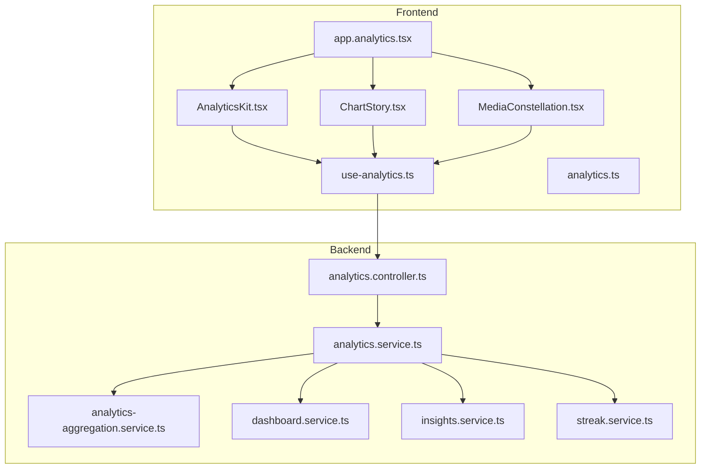
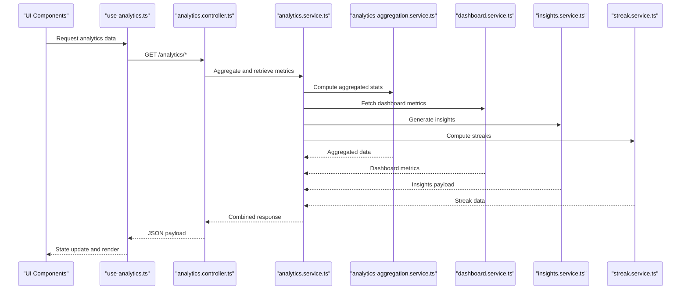
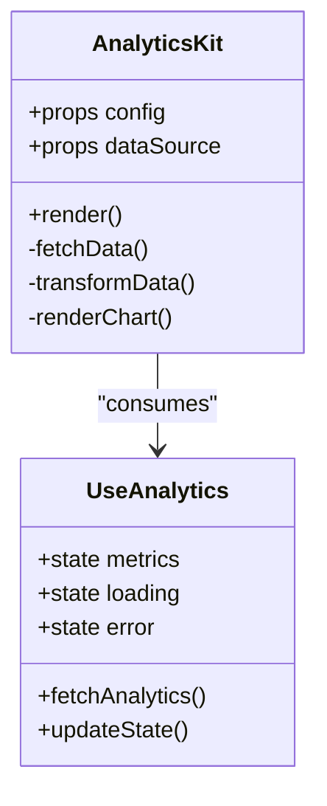
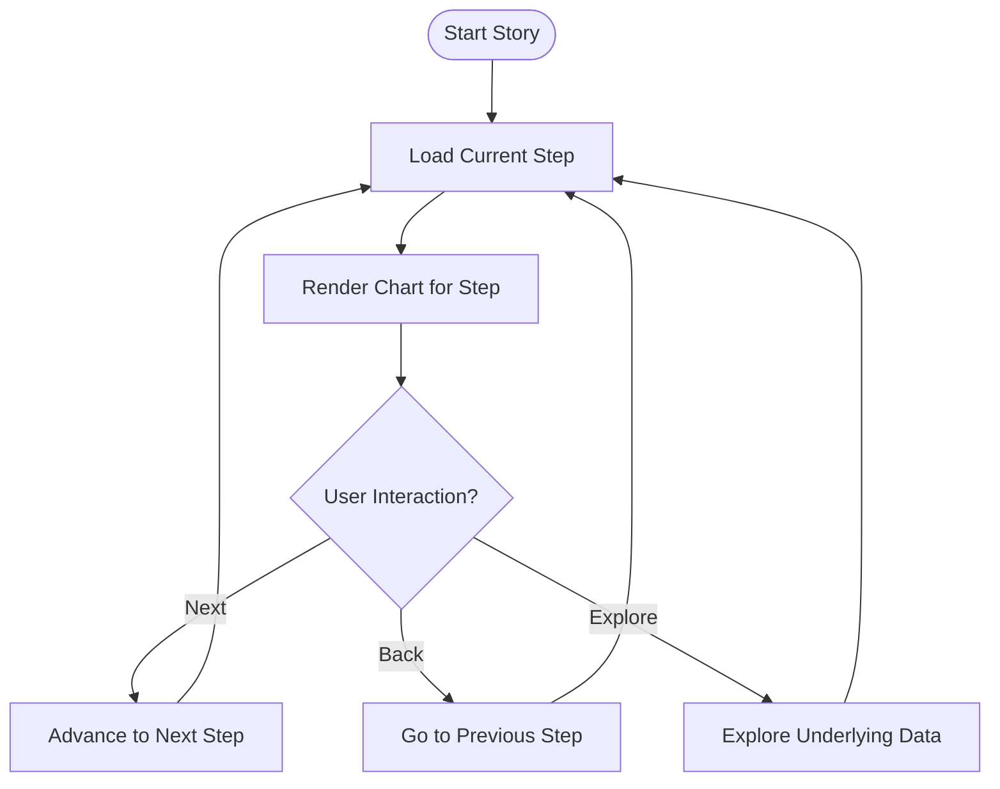
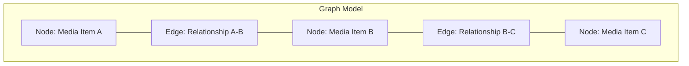
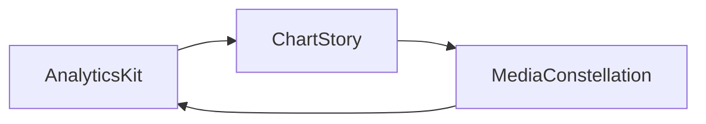
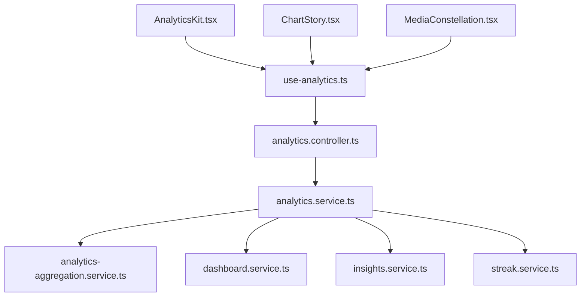

# Analytics Components

<cite>
**Referenced Files in This Document**
- [AnalyticsKit.tsx](file://src/components/analytics/AnalyticsKit.tsx)
- [ChartStory.tsx](file://src/components/analytics/ChartStory.tsx)
- [MediaConstellation.tsx](file://src/components/analytics/MediaConstellation.tsx)
- [analytics.controller.ts](file://apps/backend/src/analytics/analytics.controller.ts)
- [analytics.service.ts](file://apps/backend/src/analytics/analytics.service.ts)
- [analytics-aggregation.service.ts](file://apps/backend/src/analytics/analytics-aggregation.service.ts)
- [dashboard.service.ts](file://apps/backend/src/analytics/dashboard.service.ts)
- [insights.service.ts](file://apps/backend/src/analytics/insights.service.ts)
- [streak.service.ts](file://apps/backend/src/analytics/streak.service.ts)
- [use-analytics.ts](file://src/hooks/use-analytics.ts)
- [analytics.ts](file://src/lib/analytics.ts)
- [app.analytics.tsx](file://src/routes/app.analytics.tsx)
</cite>

## Table of Contents
1. [Introduction](#introduction)
2. [Project Structure](#project-structure)
3. [Core Components](#core-components)
4. [Architecture Overview](#architecture-overview)
5. [Detailed Component Analysis](#detailed-component-analysis)
6. [Dependency Analysis](#dependency-analysis)
7. [Performance Considerations](#performance-considerations)
8. [Troubleshooting Guide](#troubleshooting-guide)
9. [Conclusion](#conclusion)

## Introduction
This document provides comprehensive documentation for the analytics visualization components: AnalyticsKit, ChartStory, and MediaConstellation. It explains their responsibilities, configuration options, data binding patterns, customization capabilities, and integration with the analytics backend API. The goal is to enable both technical and non-technical users to understand how these components aggregate data, render charts, support narrative-driven visualizations, and visualize media relationships through constellation-style graphs.

## Project Structure
The analytics visualization components are implemented as React components under src/components/analytics. They consume data from a NestJS-based backend located under apps/backend/src/analytics. Frontend hooks and utilities facilitate data fetching and state management.

**Diagram sources**
- [AnalyticsKit.tsx](file://src/components/analytics/AnalyticsKit.tsx)
- [ChartStory.tsx](file://src/components/analytics/ChartStory.tsx)
- [MediaConstellation.tsx](file://src/components/analytics/MediaConstellation.tsx)
- [use-analytics.ts](file://src/hooks/use-analytics.ts)
- [analytics.ts](file://src/lib/analytics.ts)
- [app.analytics.tsx](file://src/routes/app.analytics.tsx)
- [analytics.controller.ts](file://apps/backend/src/analytics/analytics.controller.ts)
- [analytics.service.ts](file://apps/backend/src/analytics/analytics.service.ts)
- [analytics-aggregation.service.ts](file://apps/backend/src/analytics/analytics-aggregation.service.ts)
- [dashboard.service.ts](file://apps/backend/src/analytics/dashboard.service.ts)
- [insights.service.ts](file://apps/backend/src/analytics/insights.service.ts)
- [streak.service.ts](file://apps/backend/src/analytics/streak.service.ts)

**Section sources**
- [AnalyticsKit.tsx](file://src/components/analytics/AnalyticsKit.tsx)
- [ChartStory.tsx](file://src/components/analytics/ChartStory.tsx)
- [MediaConstellation.tsx](file://src/components/analytics/MediaConstellation.tsx)
- [use-analytics.ts](file://src/hooks/use-analytics.ts)
- [analytics.ts](file://src/lib/analytics.ts)
- [app.analytics.tsx](file://src/routes/app.analytics.tsx)
- [analytics.controller.ts](file://apps/backend/src/analytics/analytics.controller.ts)
- [analytics.service.ts](file://apps/backend/src/analytics/analytics.service.ts)
- [analytics-aggregation.service.ts](file://apps/backend/src/analytics/analytics-aggregation.service.ts)
- [dashboard.service.ts](file://apps/backend/src/analytics/dashboard.service.ts)
- [insights.service.ts](file://apps/backend/src/analytics/insights.service.ts)
- [streak.service.ts](file://apps/backend/src/analytics/streak.service.ts)

## Core Components
- AnalyticsKit: Aggregates analytics data and renders multiple chart types based on configuration. Supports different data sources and chart configurations.
- ChartStory: Provides narrative-driven visualization with interactive storytelling features, enabling step-by-step exploration of insights.
- MediaConstellation: Visualizes media relationships and connections using constellation-style graphs, highlighting nodes and edges between media items.

These components integrate with the backend via REST endpoints exposed by the analytics controller and services. Data flows from the backend aggregation and insight services into the frontend hooks and then into the components for rendering.

**Section sources**
- [AnalyticsKit.tsx](file://src/components/analytics/AnalyticsKit.tsx)
- [ChartStory.tsx](file://src/components/analytics/ChartStory.tsx)
- [MediaConstellation.tsx](file://src/components/analytics/MediaConstellation.tsx)
- [analytics.controller.ts](file://apps/backend/src/analytics/analytics.controller.ts)
- [analytics.service.ts](file://apps/backend/src/analytics/analytics.service.ts)
- [analytics-aggregation.service.ts](file://apps/backend/src/analytics/analytics-aggregation.service.ts)
- [dashboard.service.ts](file://apps/backend/src/analytics/dashboard.service.ts)
- [insights.service.ts](file://apps/backend/src/analytics/insights.service.ts)
- [streak.service.ts](file://apps/backend/src/analytics/streak.service.ts)

## Architecture Overview
The architecture follows a clear separation between frontend visualization and backend data processing:
- Frontend components (AnalyticsKit, ChartStory, MediaConstellation) receive props and use hooks to fetch data.
- The use-analytics hook encapsulates API calls and state management.
- The backend exposes analytics endpoints that aggregate data and compute insights.

**Diagram sources**
- [use-analytics.ts](file://src/hooks/use-analytics.ts)
- [analytics.controller.ts](file://apps/backend/src/analytics/analytics.controller.ts)
- [analytics.service.ts](file://apps/backend/src/analytics/analytics.service.ts)
- [analytics-aggregation.service.ts](file://apps/backend/src/analytics/analytics-aggregation.service.ts)
- [dashboard.service.ts](file://apps/backend/src/analytics/dashboard.service.ts)
- [insights.service.ts](file://apps/backend/src/analytics/insights.service.ts)
- [streak.service.ts](file://apps/backend/src/analytics/streak.service.ts)

## Detailed Component Analysis

### AnalyticsKit Component
AnalyticsKit aggregates analytics data and renders charts based on configuration. It supports multiple chart types and data sources, allowing flexible visualization of metrics such as usage trends, category distributions, and time-series data.

Key aspects:
- Configuration options for chart types (e.g., line, bar, pie).
- Data source selection (e.g., aggregated metrics, dashboard metrics, insights).
- Props interface defining chart configuration, data bindings, and customization options.
- Integration with use-analytics hook for fetching and updating state.

**Diagram sources**
- [AnalyticsKit.tsx](file://src/components/analytics/AnalyticsKit.tsx)
- [use-analytics.ts](file://src/hooks/use-analytics.ts)

**Section sources**
- [AnalyticsKit.tsx](file://src/components/analytics/AnalyticsKit.tsx)
- [use-analytics.ts](file://src/hooks/use-analytics.ts)

### ChartStory Component
ChartStory enables narrative-driven data visualization with interactive storytelling features. It guides users through a sequence of charts and insights, providing context and explanations at each step.

Key aspects:
- Narrative steps with associated charts and annotations.
- Interactive controls for navigation and emphasis.
- Data binding patterns to connect story steps with dynamic datasets.
- Customization options for styling and interactivity.

**Diagram sources**
- [ChartStory.tsx](file://src/components/analytics/ChartStory.tsx)
- [use-analytics.ts](file://src/hooks/use-analytics.ts)

**Section sources**
- [ChartStory.tsx](file://src/components/analytics/ChartStory.tsx)
- [use-analytics.ts](file://src/hooks/use-analytics.ts)

### MediaConstellation Component
MediaConstellation visualizes media relationships and connections through constellation-style graphs. Nodes represent media items, and edges represent relationships such as genre similarity, co-viewing patterns, or thematic links.

Key aspects:
- Graph layout algorithms for positioning nodes and edges.
- Interaction features for exploring connections and filtering nodes.
- Data binding patterns for mapping media entities to graph structures.
- Customization options for node shapes, edge styles, and color schemes.

**Diagram sources**
- [MediaConstellation.tsx](file://src/components/analytics/MediaConstellation.tsx)
- [use-analytics.ts](file://src/hooks/use-analytics.ts)

**Section sources**
- [MediaConstellation.tsx](file://src/components/analytics/MediaConstellation.tsx)
- [use-analytics.ts](file://src/hooks/use-analytics.ts)

### Conceptual Overview
The three components form a cohesive analytics visualization suite:
- AnalyticsKit focuses on metric aggregation and chart rendering.
- ChartStory emphasizes narrative and guided exploration.
- MediaConstellation highlights relational insights through graph visualization.

[No sources needed since this diagram shows conceptual workflow, not actual code structure]

## Dependency Analysis
The components depend on the use-analytics hook for data fetching and state management. The backend services provide aggregated metrics, dashboard insights, and streak calculations.

**Diagram sources**
- [AnalyticsKit.tsx](file://src/components/analytics/AnalyticsKit.tsx)
- [ChartStory.tsx](file://src/components/analytics/ChartStory.tsx)
- [MediaConstellation.tsx](file://src/components/analytics/MediaConstellation.tsx)
- [use-analytics.ts](file://src/hooks/use-analytics.ts)
- [analytics.controller.ts](file://apps/backend/src/analytics/analytics.controller.ts)
- [analytics.service.ts](file://apps/backend/src/analytics/analytics.service.ts)
- [analytics-aggregation.service.ts](file://apps/backend/src/analytics/analytics-aggregation.service.ts)
- [dashboard.service.ts](file://apps/backend/src/analytics/dashboard.service.ts)
- [insights.service.ts](file://apps/backend/src/analytics/insights.service.ts)
- [streak.service.ts](file://apps/backend/src/analytics/streak.service.ts)

**Section sources**
- [AnalyticsKit.tsx](file://src/components/analytics/AnalyticsKit.tsx)
- [ChartStory.tsx](file://src/components/analytics/ChartStory.tsx)
- [MediaConstellation.tsx](file://src/components/analytics/MediaConstellation.tsx)
- [use-analytics.ts](file://src/hooks/use-analytics.ts)
- [analytics.controller.ts](file://apps/backend/src/analytics/analytics.controller.ts)
- [analytics.service.ts](file://apps/backend/src/analytics/analytics.service.ts)
- [analytics-aggregation.service.ts](file://apps/backend/src/analytics/analytics-aggregation.service.ts)
- [dashboard.service.ts](file://apps/backend/src/analytics/dashboard.service.ts)
- [insights.service.ts](file://apps/backend/src/analytics/insights.service.ts)
- [streak.service.ts](file://apps/backend/src/analytics/streak.service.ts)

## Performance Considerations
- Data aggregation should be optimized on the backend to minimize payload size and reduce frontend processing overhead.
- Implement caching strategies for frequently accessed metrics and insights.
- Use lazy loading for large graphs in MediaConstellation to improve initial render performance.
- Debounce user interactions in ChartStory to prevent excessive re-renders during navigation.

[No sources needed since this section provides general guidance]

## Troubleshooting Guide
Common issues and resolutions:
- Data fetching errors: Verify backend endpoint availability and authentication tokens.
- Chart rendering failures: Ensure data formats match expected schemas and handle empty datasets gracefully.
- Graph layout problems: Validate node and edge data structures and adjust layout parameters.
- Performance bottlenecks: Profile component updates and optimize data transformations.

**Section sources**
- [use-analytics.ts](file://src/hooks/use-analytics.ts)
- [analytics.ts](file://src/lib/analytics.ts)
- [app.analytics.tsx](file://src/routes/app.analytics.tsx)

## Conclusion
The analytics visualization components provide a robust foundation for data-driven storytelling and relationship exploration. By leveraging the backend aggregation services and frontend hooks, these components deliver flexible, interactive, and performant visualizations. Proper configuration and customization enable tailored experiences for diverse analytical needs.

[No sources needed since this section summarizes without analyzing specific files]