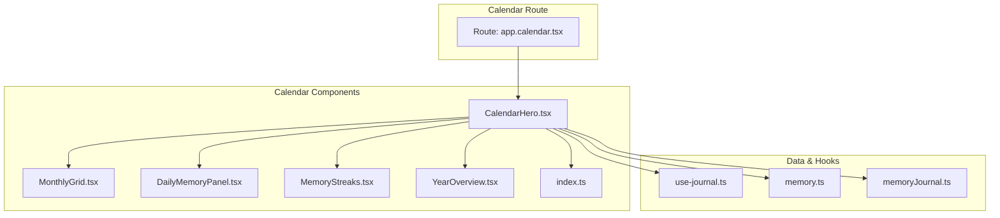
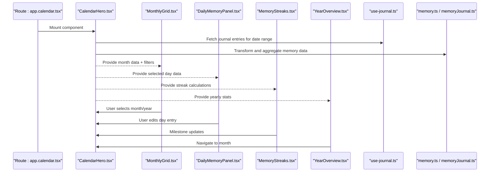
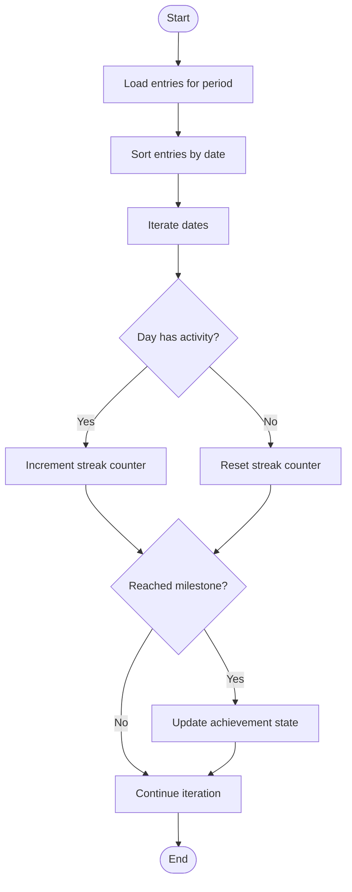
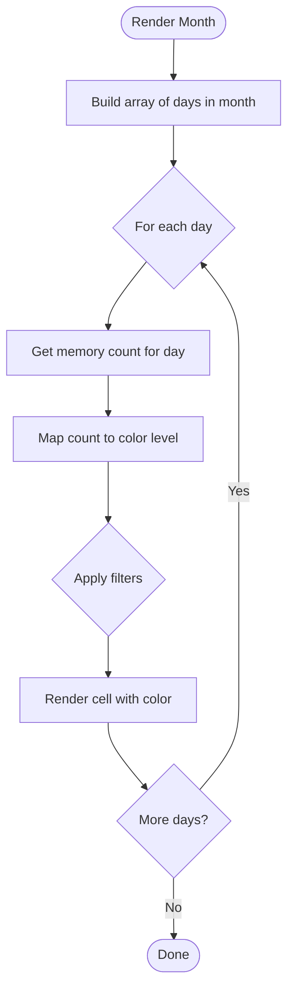
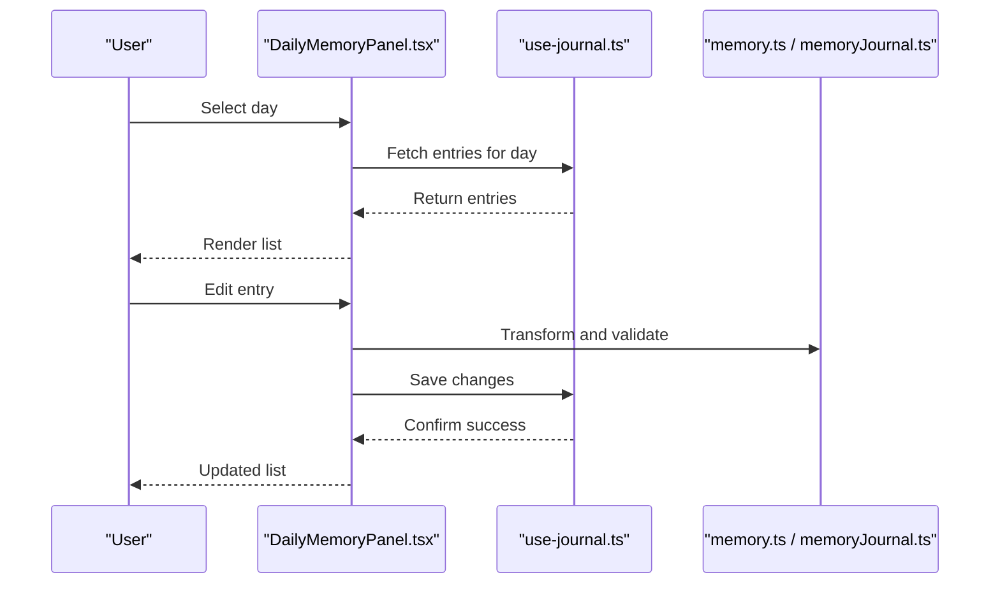
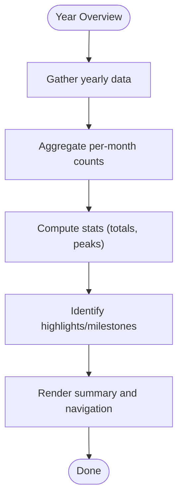
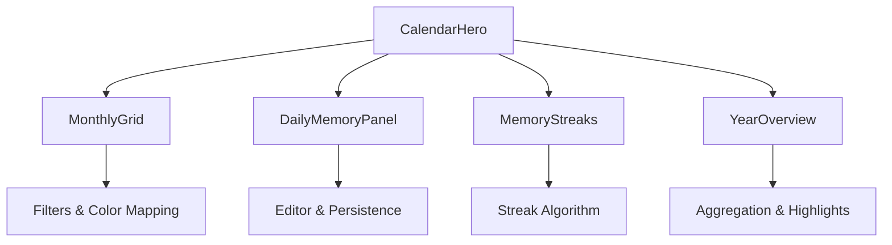
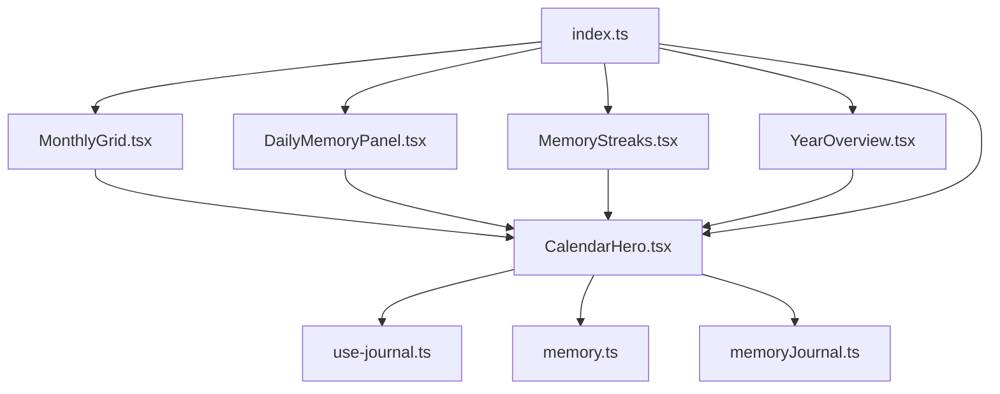

# Calendar Components

<cite>
**Referenced Files in This Document**
- [CalendarHero.tsx](file://src/components/calendar/CalendarHero.tsx)
- [MemoryStreaks.tsx](file://src/components/calendar/MemoryStreaks.tsx)
- [MonthlyGrid.tsx](file://src/components/calendar/MonthlyGrid.tsx)
- [DailyMemoryPanel.tsx](file://src/components/calendar/DailyMemoryPanel.tsx)
- [YearOverview.tsx](file://src/components/calendar/YearOverview.tsx)
- [index.ts](file://src/components/calendar/index.ts)
- [app.calendar.tsx](file://src/routes/app.calendar.tsx)
- [use-journal.ts](file://src/hooks/use-journal.ts)
- [memory.ts](file://src/lib/memory.ts)
- [memoryJournal.ts](file://src/lib/memoryJournal.ts)
</cite>

## Table of Contents
1. [Introduction](#introduction)
2. [Project Structure](#project-structure)
3. [Core Components](#core-components)
4. [Architecture Overview](#architecture-overview)
5. [Detailed Component Analysis](#detailed-component-analysis)
6. [Dependency Analysis](#dependency-analysis)
7. [Performance Considerations](#performance-considerations)
8. [Troubleshooting Guide](#troubleshooting-guide)
9. [Conclusion](#conclusion)

## Introduction
This document provides comprehensive documentation for the calendar and timeline management components that power memory visualization, streak tracking, and date-based navigation. It focuses on:
- CalendarHero as the main calendar interface with navigation and overview features
- MemoryStreaks for consecutive usage patterns and achievement milestones
- MonthlyGrid for month-based memory visualization with color coding and filtering
- DailyMemoryPanel for day-specific memory viewing and editing
- YearOverview for annual memory summaries and statistics
It also includes usage examples, date handling patterns, and integration points with journal and memory APIs.

## Project Structure
The calendar-related UI is implemented under src/components/calendar with a clear separation of concerns:
- CalendarHero orchestrates navigation and high-level state
- MonthlyGrid renders the monthly view with color-coded cells
- DailyMemoryPanel handles day selection and editing workflows
- MemoryStreaks computes and displays streaks and milestones
- YearOverview aggregates yearly statistics and highlights
- index.ts centralizes exports for easy imports across the app
- The route app.calendar.tsx wires these components into the application routing layer

**Diagram sources**
- [app.calendar.tsx](file://src/routes/app.calendar.tsx)
- [CalendarHero.tsx](file://src/components/calendar/CalendarHero.tsx)
- [MonthlyGrid.tsx](file://src/components/calendar/MonthlyGrid.tsx)
- [DailyMemoryPanel.tsx](file://src/components/calendar/DailyMemoryPanel.tsx)
- [MemoryStreaks.tsx](file://src/components/calendar/MemoryStreaks.tsx)
- [YearOverview.tsx](file://src/components/calendar/YearOverview.tsx)
- [index.ts](file://src/components/calendar/index.ts)
- [use-journal.ts](file://src/hooks/use-journal.ts)
- [memory.ts](file://src/lib/memory.ts)
- [memoryJournal.ts](file://src/lib/memoryJournal.ts)

**Section sources**
- [app.calendar.tsx](file://src/routes/app.calendar.tsx)
- [index.ts](file://src/components/calendar/index.ts)

## Core Components
- CalendarHero: Main entry point for the calendar experience; manages selected date range, navigation (month/year), and delegates rendering to child components.
- MonthlyGrid: Renders a grid of days for the selected month; applies color coding based on memory density or activity; supports filtering by type or tags.
- DailyMemoryPanel: Displays memories for a specific day; allows viewing details and editing entries; integrates with journal and memory services.
- MemoryStreaks: Computes consecutive active days and surfaces milestones; visualizes streak progress and achievements.
- YearOverview: Aggregates yearly metrics such as total entries, most active months, and highlights; provides quick navigation to months.

These components share common data via hooks and libraries:
- use-journal.ts: Provides journal-related queries and mutations
- memory.ts: Utilities for memory operations and transformations
- memoryJournal.ts: Bridges between memory and journal domains

**Section sources**
- [CalendarHero.tsx](file://src/components/calendar/CalendarHero.tsx)
- [MonthlyGrid.tsx](file://src/components/calendar/MonthlyGrid.tsx)
- [DailyMemoryPanel.tsx](file://src/components/calendar/DailyMemoryPanel.tsx)
- [MemoryStreaks.tsx](file://src/components/calendar/MemoryStreaks.tsx)
- [YearOverview.tsx](file://src/components/calendar/YearOverview.tsx)
- [use-journal.ts](file://src/hooks/use-journal.ts)
- [memory.ts](file://src/lib/memory.ts)
- [memoryJournal.ts](file://src/lib/memoryJournal.ts)

## Architecture Overview
The calendar feature follows a unidirectional data flow:
- Route mounts CalendarHero
- CalendarHero coordinates state (selected date, filters) and fetches data through hooks
- MonthlyGrid and other components render based on props derived from CalendarHero
- Data interactions go through use-journal.ts and memory utilities

**Diagram sources**
- [app.calendar.tsx](file://src/routes/app.calendar.tsx)
- [CalendarHero.tsx](file://src/components/calendar/CalendarHero.tsx)
- [MonthlyGrid.tsx](file://src/components/calendar/MonthlyGrid.tsx)
- [DailyMemoryPanel.tsx](file://src/components/calendar/DailyMemoryPanel.tsx)
- [MemoryStreaks.tsx](file://src/components/calendar/MemoryStreaks.tsx)
- [YearOverview.tsx](file://src/components/calendar/YearOverview.tsx)
- [use-journal.ts](file://src/hooks/use-journal.ts)
- [memory.ts](file://src/lib/memory.ts)
- [memoryJournal.ts](file://src/lib/memoryJournal.ts)

## Detailed Component Analysis

### CalendarHero
Responsibilities:
- Manage selected date context (current month, year, selected day)
- Handle navigation actions (previous/next month, jump to today)
- Aggregate and pass down data to child components
- Coordinate user interactions (filters, selections)

Integration points:
- Uses use-journal.ts to retrieve entries within a date range
- Leverages memory.ts and memoryJournal.ts for transformations and cross-domain data

Usage example:
- Wrap CalendarHero around MonthlyGrid, DailyMemoryPanel, MemoryStreaks, and YearOverview
- Pass selectedDate, filters, and callbacks for navigation and editing

**Section sources**
- [CalendarHero.tsx](file://src/components/calendar/CalendarHero.tsx)
- [use-journal.ts](file://src/hooks/use-journal.ts)
- [memory.ts](file://src/lib/memory.ts)
- [memoryJournal.ts](file://src/lib/memoryJournal.ts)

### MemoryStreaks
Responsibilities:
- Compute consecutive active days based on journal/memory entries
- Surface milestone thresholds and achievements
- Render streak progress visuals and notifications

Algorithm outline:
- Sort entries by date
- Iterate through dates to count consecutive active days
- Compare against milestone thresholds to update achievements

**Diagram sources**
- [MemoryStreaks.tsx](file://src/components/calendar/MemoryStreaks.tsx)

**Section sources**
- [MemoryStreaks.tsx](file://src/components/calendar/MemoryStreaks.tsx)

### MonthlyGrid
Responsibilities:
- Render a month grid with color-coded cells indicating memory activity
- Support filtering by type, tags, or custom criteria
- Allow clicking a cell to select a day and open DailyMemoryPanel

Color coding logic:
- Map activity levels to colors (e.g., none, low, medium, high)
- Use aggregated counts per day to determine intensity

Filtering:
- Apply client-side filters before rendering
- Debounce filter changes for performance

**Diagram sources**
- [MonthlyGrid.tsx](file://src/components/calendar/MonthlyGrid.tsx)

**Section sources**
- [MonthlyGrid.tsx](file://src/components/calendar/MonthlyGrid.tsx)

### DailyMemoryPanel
Responsibilities:
- Display all memories/journal entries for a selected day
- Enable editing of entries inline or via modal
- Integrate with journal and memory APIs to persist changes

Editing workflow:
- Open editor when a day is selected
- Validate inputs before saving
- Update local state and trigger refetch if needed

**Diagram sources**
- [DailyMemoryPanel.tsx](file://src/components/calendar/DailyMemoryPanel.tsx)
- [use-journal.ts](file://src/hooks/use-journal.ts)
- [memory.ts](file://src/lib/memory.ts)
- [memoryJournal.ts](file://src/lib/memoryJournal.ts)

**Section sources**
- [DailyMemoryPanel.tsx](file://src/components/calendar/DailyMemoryPanel.tsx)
- [use-journal.ts](file://src/hooks/use-journal.ts)
- [memory.ts](file://src/lib/memory.ts)
- [memoryJournal.ts](file://src/lib/memoryJournal.ts)

### YearOverview
Responsibilities:
- Aggregate yearly statistics (total entries, peak months, trends)
- Provide quick navigation to specific months
- Visualize highlights and milestones for the year

Aggregation logic:
- Summarize counts per month
- Identify top months and notable events
- Generate summary cards and charts

**Diagram sources**
- [YearOverview.tsx](file://src/components/calendar/YearOverview.tsx)

**Section sources**
- [YearOverview.tsx](file://src/components/calendar/YearOverview.tsx)

### Conceptual Overview
The calendar system composes multiple specialized components to deliver a cohesive experience:
- Navigation and state orchestration at the top level (CalendarHero)
- Month-level visualization and interaction (MonthlyGrid)
- Day-level detail and editing (DailyMemoryPanel)
- Streak computation and achievements (MemoryStreaks)
- Year-level aggregation and insights (YearOverview)

[No sources needed since this diagram shows conceptual workflow, not actual code structure]

## Dependency Analysis
Key dependencies:
- Calendar components depend on use-journal.ts for data access
- memory.ts and memoryJournal.ts provide transformation and domain bridging
- index.ts centralizes exports for clean imports

**Diagram sources**
- [CalendarHero.tsx](file://src/components/calendar/CalendarHero.tsx)
- [MonthlyGrid.tsx](file://src/components/calendar/MonthlyGrid.tsx)
- [DailyMemoryPanel.tsx](file://src/components/calendar/DailyMemoryPanel.tsx)
- [MemoryStreaks.tsx](file://src/components/calendar/MemoryStreaks.tsx)
- [YearOverview.tsx](file://src/components/calendar/YearOverview.tsx)
- [index.ts](file://src/components/calendar/index.ts)
- [use-journal.ts](file://src/hooks/use-journal.ts)
- [memory.ts](file://src/lib/memory.ts)
- [memoryJournal.ts](file://src/lib/memoryJournal.ts)

**Section sources**
- [index.ts](file://src/components/calendar/index.ts)
- [use-journal.ts](file://src/hooks/use-journal.ts)
- [memory.ts](file://src/lib/memory.ts)
- [memoryJournal.ts](file://src/lib/memoryJournal.ts)

## Performance Considerations
- Memoization: Use memoization for expensive computations like streak calculation and monthly aggregation
- Virtualization: For large datasets, consider virtualizing lists in DailyMemoryPanel
- Debouncing: Debounce filter inputs in MonthlyGrid to reduce re-renders
- Lazy loading: Load year-overview data lazily when scrolled into view
- Efficient date handling: Normalize dates once and reuse throughout components

[No sources needed since this section provides general guidance]

## Troubleshooting Guide
Common issues and resolutions:
- Missing data: Ensure use-journal.ts returns correct date ranges and handles empty states
- Incorrect color mapping: Verify count thresholds and filter conditions in MonthlyGrid
- Streak breaks unexpectedly: Check date normalization and timezone handling in MemoryStreaks
- Editing failures: Validate inputs and handle API errors gracefully in DailyMemoryPanel

Error handling strategies:
- Centralized error boundaries around calendar components
- Retry mechanisms for failed network requests
- Clear user feedback for invalid operations

**Section sources**
- [CalendarHero.tsx](file://src/components/calendar/CalendarHero.tsx)
- [MonthlyGrid.tsx](file://src/components/calendar/MonthlyGrid.tsx)
- [DailyMemoryPanel.tsx](file://src/components/calendar/DailyMemoryPanel.tsx)
- [MemoryStreaks.tsx](file://src/components/calendar/MemoryStreaks.tsx)
- [YearOverview.tsx](file://src/components/calendar/YearOverview.tsx)

## Conclusion
The calendar components form a cohesive system for memory visualization and timeline management. By separating concerns across CalendarHero, MonthlyGrid, DailyMemoryPanel, MemoryStreaks, and YearOverview, the application delivers a rich user experience while maintaining maintainable architecture. Integration with journal and memory APIs ensures data consistency and enables powerful features like streak tracking and annual summaries.

[No sources needed since this section summarizes without analyzing specific files]