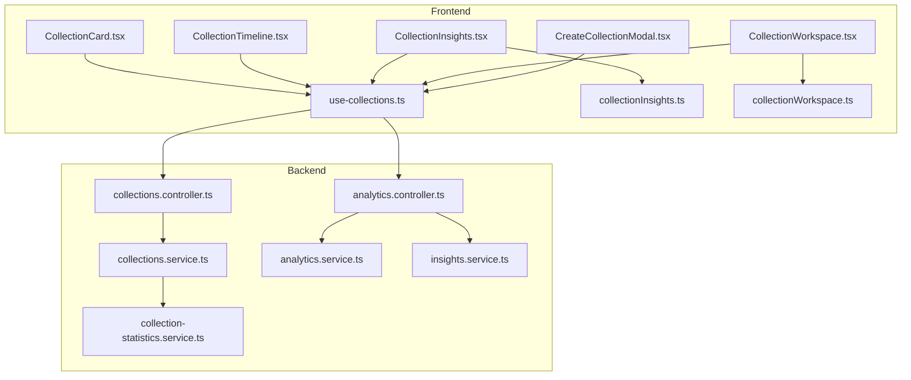
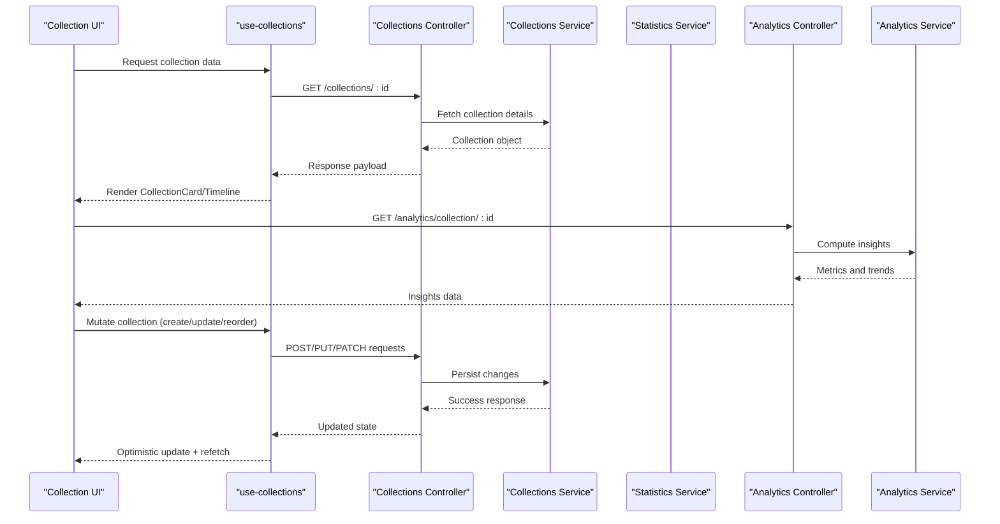
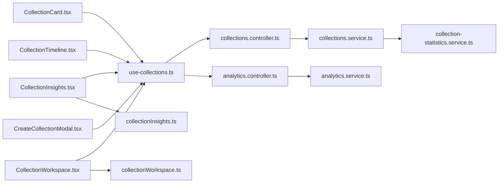

# Collection Components

<cite>
**Referenced Files in This Document**
- [CollectionCard.tsx](file://src/components/collections/CollectionCard.tsx)
- [CollectionTimeline.tsx](file://src/components/collections/CollectionTimeline.tsx)
- [CollectionInsights.tsx](file://src/components/collections/CollectionInsights.tsx)
- [CollectionWorkspace.tsx](file://src/components/collections/CollectionWorkspace.tsx)
- [CreateCollectionModal.tsx](file://src/components/collections/CreateCollectionModal.tsx)
- [use-collections.ts](file://src/hooks/use-collections.ts)
- [collections.controller.ts](file://apps/backend/src/collections/collections.controller.ts)
- [collections.service.ts](file://apps/backend/src/collections/collections.service.ts)
- [collection-statistics.service.ts](file://apps/backend/src/collections/collection-statistics.service.ts)
- [analytics.controller.ts](file://apps/backend/src/analytics/analytics.controller.ts)
- [analytics.service.ts](file://apps/backend/src/analytics/analytics.service.ts)
- [insights.service.ts](file://apps/backend/src/analytics/insights.service.ts)
- [collectionInsights.ts](file://src/lib/collectionInsights.ts)
- [collectionWorkspace.ts](file://src/lib/collectionWorkspace.ts)
</cite>

## Table of Contents
1. [Introduction](#introduction)
2. [Project Structure](#project-structure)
3. [Core Components](#core-components)
4. [Architecture Overview](#architecture-overview)
5. [Detailed Component Analysis](#detailed-component-analysis)
6. [Dependency Analysis](#dependency-analysis)
7. [Performance Considerations](#performance-considerations)
8. [Troubleshooting Guide](#troubleshooting-guide)
9. [Conclusion](#conclusion)

## Introduction
This document provides comprehensive documentation for the collection management components that power the user-facing features for browsing, organizing, and analyzing collections. It covers:
- CollectionCard: Displays collection previews with metadata and quick actions.
- CollectionTimeline: Chronological organization of collection items with drag-and-drop support.
- CollectionInsights: Analytics and statistics visualization within collections.
- CollectionWorkspace: Main editing interface with collaborative features.
- CreateCollectionModal: New collection creation with smart suggestions.

It also documents prop interfaces, state management patterns, and integration points with backend services for collections and analytics.

## Project Structure
The collection UI is implemented as React components under src/components/collections, with supporting logic in src/lib and hooks in src/hooks. Backend APIs are exposed via NestJS controllers and services under apps/backend/src/collections and apps/backend/src/analytics.

**Diagram sources**
- [CollectionCard.tsx](file://src/components/collections/CollectionCard.tsx)
- [CollectionTimeline.tsx](file://src/components/collections/CollectionTimeline.tsx)
- [CollectionInsights.tsx](file://src/components/collections/CollectionInsights.tsx)
- [CollectionWorkspace.tsx](file://src/components/collections/CollectionWorkspace.tsx)
- [CreateCollectionModal.tsx](file://src/components/collections/CreateCollectionModal.tsx)
- [use-collections.ts](file://src/hooks/use-collections.ts)
- [collectionInsights.ts](file://src/lib/collectionInsights.ts)
- [collectionWorkspace.ts](file://src/lib/collectionWorkspace.ts)
- [collections.controller.ts](file://apps/backend/src/collections/collections.controller.ts)
- [collections.service.ts](file://apps/backend/src/collections/collections.service.ts)
- [collection-statistics.service.ts](file://apps/backend/src/collections/collection-statistics.service.ts)
- [analytics.controller.ts](file://apps/backend/src/analytics/analytics.controller.ts)
- [analytics.service.ts](file://apps/backend/src/analytics/analytics.service.ts)
- [insights.service.ts](file://apps/backend/src/analytics/insights.service.ts)

**Section sources**
- [CollectionCard.tsx](file://src/components/collections/CollectionCard.tsx)
- [CollectionTimeline.tsx](file://src/components/collections/CollectionTimeline.tsx)
- [CollectionInsights.tsx](file://src/components/collections/CollectionInsights.tsx)
- [CollectionWorkspace.tsx](file://src/components/collections/CollectionWorkspace.tsx)
- [CreateCollectionModal.tsx](file://src/components/collections/CreateCollectionModal.tsx)
- [use-collections.ts](file://src/hooks/use-collections.ts)
- [collections.controller.ts](file://apps/backend/src/collections/collections.controller.ts)
- [collections.service.ts](file://apps/backend/src/collections/collections.service.ts)
- [collection-statistics.service.ts](file://apps/backend/src/collections/collection-statistics.service.ts)
- [analytics.controller.ts](file://apps/backend/src/analytics/analytics.controller.ts)
- [analytics.service.ts](file://apps/backend/src/analytics/analytics.service.ts)
- [insights.service.ts](file://apps/backend/src/analytics/insights.service.ts)

## Core Components
- CollectionCard: Presents a preview card for a collection including title, description, cover image, item count, last updated time, and quick actions (open, edit, share). It integrates with use-collections to fetch or prefetch data and handles hover states and accessibility attributes.
- CollectionTimeline: Renders a chronological view of items within a collection, supports sorting by date, filtering by tags, and drag-and-drop reordering. Uses local state for reorder operations and optimistic updates before syncing with the backend.
- CollectionInsights: Visualizes key metrics such as total items, growth over time, category distribution, and engagement indicators. Integrates with analytics endpoints and uses lib utilities to compute derived stats.
- CollectionWorkspace: The primary editing surface for a collection. Supports adding/removing items, editing metadata, collaborative presence indicators, real-time updates, and batch operations. Coordinates with use-collections and workspace utilities for state synchronization.
- CreateCollectionModal: A modal dialog for creating new collections with fields like title, description, visibility, and smart suggestions based on recent activity or templates. Validates inputs and triggers creation through the collections API.

Key prop interfaces and responsibilities:
- CollectionCard props include collection metadata, action callbacks, and optional loading/error states.
- CollectionTimeline props include items array, sort/filter options, and drag-and-drop handlers.
- CollectionInsights props include dataset for charts and configuration flags for metric selection.
- CollectionWorkspace props include collection id, collaborators list, and event callbacks for changes.
- CreateCollectionModal props include form schema, validation rules, and submission callback.

State management patterns:
- Local component state for UI interactions (hover, modals, temporary edits).
- Hook-managed state via use-collections for fetching, caching, and mutations.
- Optimistic updates in timeline and workspace for responsive UX.
- Derived computations in lib modules for insights and workspace orchestration.

Integration with backend services:
- Collections CRUD and metadata operations via collections controller/service.
- Statistics and insights via analytics controller and related services.
- Real-time collaboration signals handled through events and shared state layers.

**Section sources**
- [CollectionCard.tsx](file://src/components/collections/CollectionCard.tsx)
- [CollectionTimeline.tsx](file://src/components/collections/CollectionTimeline.tsx)
- [CollectionInsights.tsx](file://src/components/collections/CollectionInsights.tsx)
- [CollectionWorkspace.tsx](file://src/components/collections/CollectionWorkspace.tsx)
- [CreateCollectionModal.tsx](file://src/components/collections/CreateCollectionModal.tsx)
- [use-collections.ts](file://src/hooks/use-collections.ts)
- [collectionInsights.ts](file://src/lib/collectionInsights.ts)
- [collectionWorkspace.ts](file://src/lib/collectionWorkspace.ts)
- [collections.controller.ts](file://apps/backend/src/collections/collections.controller.ts)
- [collections.service.ts](file://apps/backend/src/collections/collections.service.ts)
- [collection-statistics.service.ts](file://apps/backend/src/collections/collection-statistics.service.ts)
- [analytics.controller.ts](file://apps/backend/src/analytics/analytics.controller.ts)
- [analytics.service.ts](file://apps/backend/src/analytics/analytics.service.ts)
- [insights.service.ts](file://apps/backend/src/analytics/insights.service.ts)

## Architecture Overview
The frontend components consume a centralized hook (use-collections) which encapsulates API calls and caching. Insights and workspace logic are delegated to dedicated libraries for computation and orchestration. Backend controllers expose REST endpoints for collections and analytics, delegating business logic to services.

**Diagram sources**
- [use-collections.ts](file://src/hooks/use-collections.ts)
- [collections.controller.ts](file://apps/backend/src/collections/collections.controller.ts)
- [collections.service.ts](file://apps/backend/src/collections/collections.service.ts)
- [collection-statistics.service.ts](file://apps/backend/src/collections/collection-statistics.service.ts)
- [analytics.controller.ts](file://apps/backend/src/analytics/analytics.controller.ts)
- [analytics.service.ts](file://apps/backend/src/analytics/analytics.service.ts)

## Detailed Component Analysis

### CollectionCard
Purpose: Display a concise preview of a collection with metadata and quick actions.

Key behaviors:
- Shows title, description, cover image, item count, and last updated timestamp.
- Provides quick actions: open details, edit metadata, share link.
- Handles loading and error states gracefully.
- Integrates with use-collections for data access and prefetching.

Prop interface highlights:
- collection: metadata object with identifiers, titles, counts, timestamps.
- actions: callbacks for open, edit, share.
- loading/error flags for UI feedback.

Accessibility and UX:
- Keyboard navigation and screen reader labels.
- Hover and focus states for discoverability.

**Section sources**
- [CollectionCard.tsx](file://src/components/collections/CollectionCard.tsx)
- [use-collections.ts](file://src/hooks/use-collections.ts)

### CollectionTimeline
Purpose: Chronological organization of collection items with drag-and-drop reordering.

Key behaviors:
- Renders items sorted by date; supports filters by tags or categories.
- Drag-and-drop reordering with visual feedback and drop zones.
- Optimistic updates for reorder operations; syncs with backend on commit.
- Debounced search/filter to improve performance.

Data flow:
- Items fetched via use-collections; local state manages reorder sequence.
- On drop, emits reorder event; backend persists new order.

Error handling:
- Rollback on failed reorder; user-friendly messages.

**Section sources**
- [CollectionTimeline.tsx](file://src/components/collections/CollectionTimeline.tsx)
- [use-collections.ts](file://src/hooks/use-collections.ts)

### CollectionInsights
Purpose: Analytics and statistics visualization within collections.

Key behaviors:
- Displays metrics like total items, growth rate, category distribution, and engagement.
- Uses chart components and computed summaries from collectionInsights library.
- Integrates with analytics controller to fetch aggregated data.

Computation:
- Derived stats calculated in collectionInsights.ts for consistent reporting.
- Configurable metric selection and time ranges.

Performance:
- Memoized computations and lazy loading of heavy charts.

**Section sources**
- [CollectionInsights.tsx](file://src/components/collections/CollectionInsights.tsx)
- [collectionInsights.ts](file://src/lib/collectionInsights.ts)
- [analytics.controller.ts](file://apps/backend/src/analytics/analytics.controller.ts)
- [analytics.service.ts](file://apps/backend/src/analytics/analytics.service.ts)

### CollectionWorkspace
Purpose: Main editing interface for collections with collaborative features.

Key behaviors:
- Editable metadata, add/remove items, batch operations.
- Collaborative presence indicators and conflict resolution.
- Real-time updates via events; optimistic UI for responsiveness.
- Integration with collectionWorkspace.ts for orchestration and state synchronization.

Collaboration:
- Tracks active collaborators and their cursors/edits.
- Merges concurrent edits with conflict resolution strategies.

Validation:
- Client-side validation before sending mutations.
- Server-side validation enforced by backend services.

**Section sources**
- [CollectionWorkspace.tsx](file://src/components/collections/CollectionWorkspace.tsx)
- [collectionWorkspace.ts](file://src/lib/collectionWorkspace.ts)
- [use-collections.ts](file://src/hooks/use-collections.ts)

### CreateCollectionModal
Purpose: Modal for creating new collections with smart suggestions.

Key behaviors:
- Form fields for title, description, visibility, and tags.
- Smart suggestions based on recent activity or templates.
- Validation and error display inline.
- Submits creation request via use-collections and navigates to new collection.

Smart suggestions:
- Recommends titles/tags based on user history or trending patterns.
- Reduces friction during onboarding and frequent creation.

**Section sources**
- [CreateCollectionModal.tsx](file://src/components/collections/CreateCollectionModal.tsx)
- [use-collections.ts](file://src/hooks/use-collections.ts)

## Dependency Analysis
Components depend on:
- use-collections hook for data fetching and mutations.
- Libraries for insights computation and workspace orchestration.
- Backend controllers/services for persistence and analytics.

**Diagram sources**
- [CollectionCard.tsx](file://src/components/collections/CollectionCard.tsx)
- [CollectionTimeline.tsx](file://src/components/collections/CollectionTimeline.tsx)
- [CollectionInsights.tsx](file://src/components/collections/CollectionInsights.tsx)
- [CollectionWorkspace.tsx](file://src/components/collections/CollectionWorkspace.tsx)
- [CreateCollectionModal.tsx](file://src/components/collections/CreateCollectionModal.tsx)
- [use-collections.ts](file://src/hooks/use-collections.ts)
- [collectionInsights.ts](file://src/lib/collectionInsights.ts)
- [collectionWorkspace.ts](file://src/lib/collectionWorkspace.ts)
- [collections.controller.ts](file://apps/backend/src/collections/collections.controller.ts)
- [collections.service.ts](file://apps/backend/src/collections/collections.service.ts)
- [collection-statistics.service.ts](file://apps/backend/src/collections/collection-statistics.service.ts)
- [analytics.controller.ts](file://apps/backend/src/analytics/analytics.controller.ts)
- [analytics.service.ts](file://apps/backend/src/analytics/analytics.service.ts)

**Section sources**
- [use-collections.ts](file://src/hooks/use-collections.ts)
- [collections.controller.ts](file://apps/backend/src/collections/collections.controller.ts)
- [collections.service.ts](file://apps/backend/src/collections/collections.service.ts)
- [collection-statistics.service.ts](file://apps/backend/src/collections/collection-statistics.service.ts)
- [analytics.controller.ts](file://apps/backend/src/analytics/analytics.controller.ts)
- [analytics.service.ts](file://apps/backend/src/analytics/analytics.service.ts)

## Performance Considerations
- Use memoization for expensive computations in insights and workspace.
- Implement virtualization for large timelines to avoid rendering bottlenecks.
- Debounce search/filter inputs to reduce unnecessary API calls.
- Prefetch collection data on hover for faster navigation.
- Batch mutations where possible to minimize network overhead.

[No sources needed since this section provides general guidance]

## Troubleshooting Guide
Common issues and resolutions:
- Data not loading: Verify use-collections hook initialization and network connectivity. Check backend controller endpoints availability.
- Reorder failures: Ensure drag-and-drop events are properly handled; rollback state on server errors.
- Insights mismatch: Confirm analytics controller returns expected metrics; validate computation in collectionInsights library.
- Collaboration conflicts: Review conflict resolution logic in workspace orchestration; ensure versioning or timestamps are used.

**Section sources**
- [use-collections.ts](file://src/hooks/use-collections.ts)
- [collections.controller.ts](file://apps/backend/src/collections/collections.controller.ts)
- [collectionInsights.ts](file://src/lib/collectionInsights.ts)
- [collectionWorkspace.ts](file://src/lib/collectionWorkspace.ts)

## Conclusion
The collection management components provide a cohesive, performant, and collaborative experience for users interacting with collections. By leveraging a centralized hook and modular libraries, the system maintains clear separation of concerns while enabling rich features like chronological timelines, analytics dashboards, and real-time editing. Proper error handling, optimization techniques, and backend integrations ensure reliability and scalability.

[No sources needed since this section summarizes without analyzing specific files]