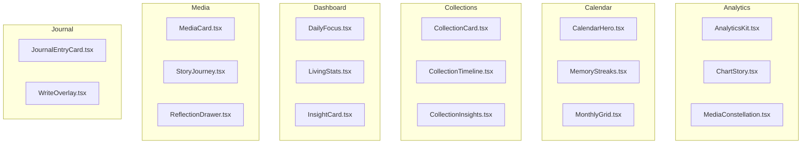
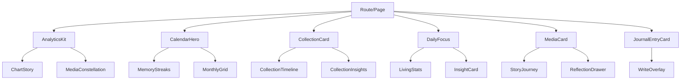
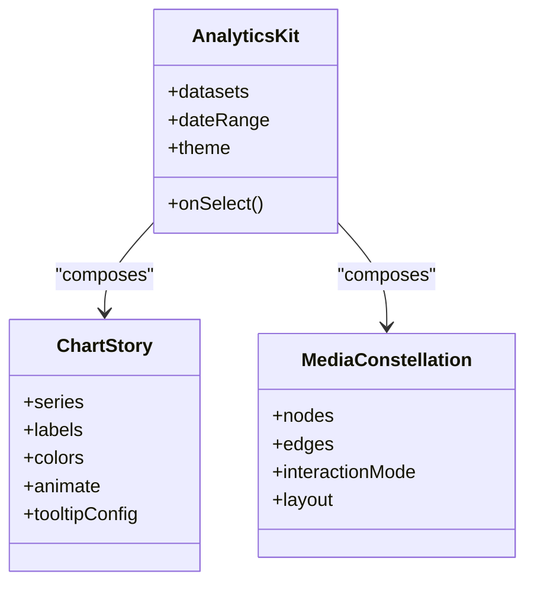
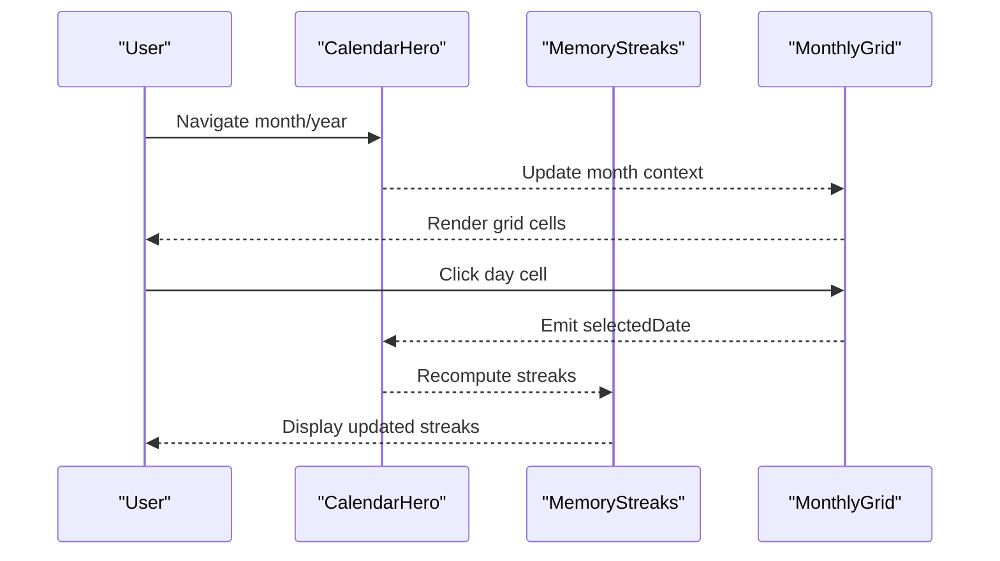
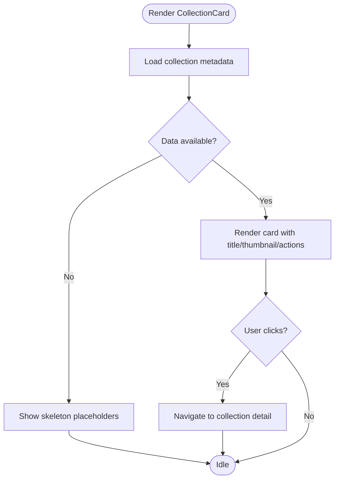
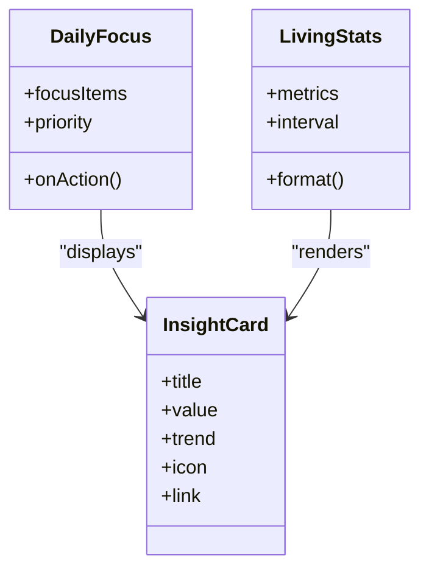
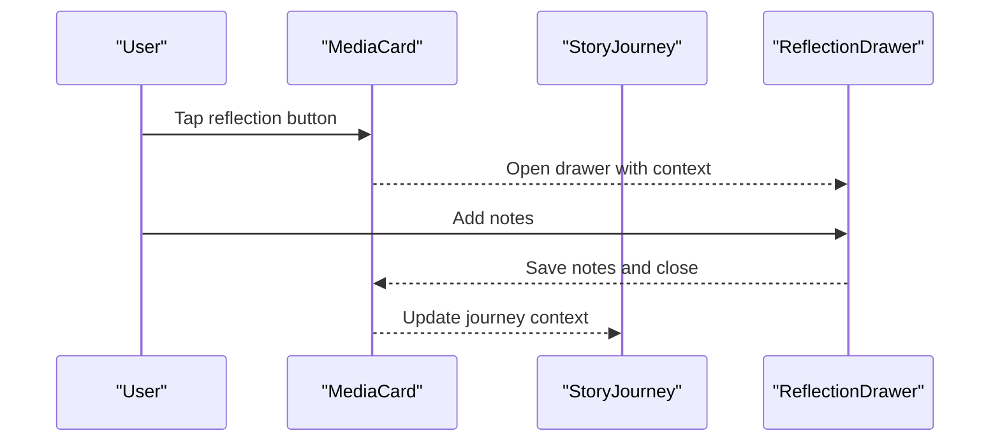
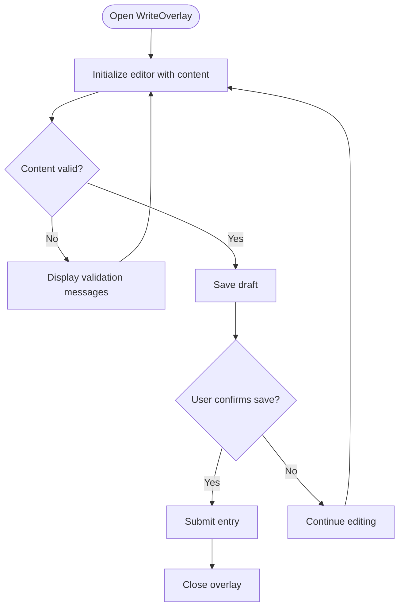
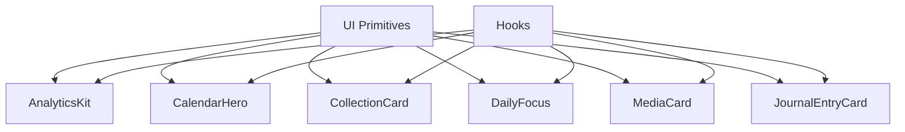

# Custom Components

<cite>
**Referenced Files in This Document**
- [AnalyticsKit.tsx](file://src/components/analytics/AnalyticsKit.tsx)
- [ChartStory.tsx](file://src/components/analytics/ChartStory.tsx)
- [MediaConstellation.tsx](file://src/components/analytics/MediaConstellation.tsx)
- [CalendarHero.tsx](file://src/components/calendar/CalendarHero.tsx)
- [MemoryStreaks.tsx](file://src/components/calendar/MemoryStreaks.tsx)
- [MonthlyGrid.tsx](file://src/components/calendar/MonthlyGrid.tsx)
- [CollectionCard.tsx](file://src/components/collections/CollectionCard.tsx)
- [CollectionTimeline.tsx](file://src/components/collections/CollectionTimeline.tsx)
- [CollectionInsights.tsx](file://src/components/collections/CollectionInsights.tsx)
- [DailyFocus.tsx](file://src/components/dashboard/DailyFocus.tsx)
- [LivingStats.tsx](file://src/components/dashboard/LivingStats.tsx)
- [InsightCard.tsx](file://src/components/dashboard/InsightCard.tsx)
- [MediaCard.tsx](file://src/components/media/MediaCard.tsx)
- [StoryJourney.tsx](file://src/components/media/StoryJourney.tsx)
- [ReflectionDrawer.tsx](file://src/components/media/ReflectionDrawer.tsx)
- [JournalEntryCard.tsx](file://src/components/journal/JournalEntryCard.tsx)
- [WriteOverlay.tsx](file://src/components/journal/WriteOverlay.tsx)
</cite>

## Table of Contents
1. [Introduction](#introduction)
2. [Project Structure](#project-structure)
3. [Core Components](#core-components)
4. [Architecture Overview](#architecture-overview)
5. [Detailed Component Analysis](#detailed-component-analysis)
6. [Dependency Analysis](#dependency-analysis)
7. [Performance Considerations](#performance-considerations)
8. [Troubleshooting Guide](#troubleshooting-guide)
9. [Conclusion](#conclusion)

## Introduction
This document provides detailed documentation for custom business components organized by feature area. It covers analytics, calendar, collections, dashboard, media, and journal components with usage examples, prop interfaces, and integration patterns. The goal is to help developers understand how each component works, how to integrate it into pages or dashboards, and how to extend or customize behavior safely.

## Project Structure
The components are grouped by feature directories under src/components:
- analytics: AnalyticsKit, ChartStory, MediaConstellation
- calendar: CalendarHero, MemoryStreaks, MonthlyGrid
- collections: CollectionCard, CollectionTimeline, CollectionInsights
- dashboard: DailyFocus, LivingStats, InsightCard
- media: MediaCard, StoryJourney, ReflectionDrawer
- journal: JournalEntryCard, WriteOverlay

Each component is a React function component that typically accepts props for data, styling, and behavior. They often rely on shared UI primitives from src/components/ui and hooks from src/hooks.

[No sources needed since this diagram shows conceptual structure]

## Core Components
This section introduces the key components across features and their primary responsibilities:
- AnalyticsKit: Aggregates analytics views and charts for media insights.
- ChartStory: Renders narrative-driven chart visualizations.
- MediaConstellation: Visualizes relationships among media items as a constellation graph.
- CalendarHero: Top-level calendar view for timeline management.
- MemoryStreaks: Displays streaks of memory activity over time.
- MonthlyGrid: Month-based grid layout for browsing memories.
- CollectionCard: Compact representation of a collection entry.
- CollectionTimeline: Timeline visualization for collection events.
- CollectionInsights: Summary metrics and insights for a collection.
- DailyFocus: Dashboard widget highlighting daily focus areas.
- LivingStats: Live-updating statistics panel for user activity.
- InsightCard: Reusable insight display card.
- MediaCard: Media item card with actions and metadata.
- StoryJourney: Narrative journey through media experiences.
- ReflectionDrawer: Slide-out drawer for reflections and notes.
- JournalEntryCard: Card representing a journal entry.
- WriteOverlay: Overlay editor for writing journal entries.

Usage pattern overview:
- Pass data via props (e.g., arrays of items, metrics, dates).
- Handle interactions via callbacks (e.g., onClick, onChange).
- Compose multiple components within a page or dashboard.

**Section sources**
- [AnalyticsKit.tsx](file://src/components/analytics/AnalyticsKit.tsx)
- [ChartStory.tsx](file://src/components/analytics/ChartStory.tsx)
- [MediaConstellation.tsx](file://src/components/analytics/MediaConstellation.tsx)
- [CalendarHero.tsx](file://src/components/calendar/CalendarHero.tsx)
- [MemoryStreaks.tsx](file://src/components/calendar/MemoryStreaks.tsx)
- [MonthlyGrid.tsx](file://src/components/calendar/MonthlyGrid.tsx)
- [CollectionCard.tsx](file://src/components/collections/CollectionCard.tsx)
- [CollectionTimeline.tsx](file://src/components/collections/CollectionTimeline.tsx)
- [CollectionInsights.tsx](file://src/components/collections/CollectionInsights.tsx)
- [DailyFocus.tsx](file://src/components/dashboard/DailyFocus.tsx)
- [LivingStats.tsx](file://src/components/dashboard/LivingStats.tsx)
- [InsightCard.tsx](file://src/components/dashboard/InsightCard.tsx)
- [MediaCard.tsx](file://src/components/media/MediaCard.tsx)
- [StoryJourney.tsx](file://src/components/media/StoryJourney.tsx)
- [ReflectionDrawer.tsx](file://src/components/media/ReflectionDrawer.tsx)
- [JournalEntryCard.tsx](file://src/components/journal/JournalEntryCard.tsx)
- [WriteOverlay.tsx](file://src/components/journal/WriteOverlay.tsx)

## Architecture Overview
At a high level, components consume data from application state or services and render UI using shared primitives. Common patterns include:
- Data fetching via hooks (e.g., use-analytics, use-collections, use-journal).
- Event handling through callback props passed down from parent routes/pages.
- Composition of smaller UI elements (cards, charts, drawers) to build complex views.

[No sources needed since this diagram shows conceptual architecture]

## Detailed Component Analysis

### Analytics Components
- AnalyticsKit
  - Purpose: Aggregates analytics views and charts for media insights.
  - Typical props: datasets, date range, theme options, callbacks for selection.
  - Usage example: Render AnalyticsKit inside an analytics page with fetched datasets and event handlers.
  - Integration pattern: Combine with use-analytics hook to fetch and update data reactively.

- ChartStory
  - Purpose: Renders narrative-driven chart visualizations.
  - Typical props: series data, labels, colors, animation flags, tooltip config.
  - Usage example: Embed ChartStory within AnalyticsKit to visualize trends over time.
  - Integration pattern: Use charting utilities from shared libraries; ensure responsive sizing.

- MediaConstellation
  - Purpose: Visualizes relationships among media items as a constellation graph.
  - Typical props: nodes, edges, interaction modes, layout settings.
  - Usage example: Display MediaConstellation to explore connections between watched items.
  - Integration pattern: Compute node positions based on similarity or temporal proximity.

**Diagram sources**
- [AnalyticsKit.tsx](file://src/components/analytics/AnalyticsKit.tsx)
- [ChartStory.tsx](file://src/components/analytics/ChartStory.tsx)
- [MediaConstellation.tsx](file://src/components/analytics/MediaConstellation.tsx)

**Section sources**
- [AnalyticsKit.tsx](file://src/components/analytics/AnalyticsKit.tsx)
- [ChartStory.tsx](file://src/components/analytics/ChartStory.tsx)
- [MediaConstellation.tsx](file://src/components/analytics/MediaConstellation.tsx)

### Calendar Components
- CalendarHero
  - Purpose: Top-level calendar view for timeline management.
  - Typical props: month/year navigation, memory list, event handlers.
  - Usage example: Place CalendarHero at the top of the calendar route to show current month and quick actions.
  - Integration pattern: Bind navigation to route params; pass selected date to child components.

- MemoryStreaks
  - Purpose: Displays streaks of memory activity over time.
  - Typical props: streak data array, thresholds, color scheme.
  - Usage example: Show MemoryStreaks below CalendarHero to highlight consistent engagement.
  - Integration pattern: Compute streaks from memory timestamps; animate transitions on updates.

- MonthlyGrid
  - Purpose: Month-based grid layout for browsing memories.
  - Typical props: month data, cell renderer, click handlers.
  - Usage example: Render MonthlyGrid to allow users to navigate and select specific days.
  - Integration pattern: Lazy-load cells; handle keyboard navigation for accessibility.

**Diagram sources**
- [CalendarHero.tsx](file://src/components/calendar/CalendarHero.tsx)
- [MemoryStreaks.tsx](file://src/components/calendar/MemoryStreaks.tsx)
- [MonthlyGrid.tsx](file://src/components/calendar/MonthlyGrid.tsx)

**Section sources**
- [CalendarHero.tsx](file://src/components/calendar/CalendarHero.tsx)
- [MemoryStreaks.tsx](file://src/components/calendar/MemoryStreaks.tsx)
- [MonthlyGrid.tsx](file://src/components/calendar/MonthlyGrid.tsx)

### Collection Components
- CollectionCard
  - Purpose: Compact representation of a collection entry.
  - Typical props: title, description, thumbnail, actions, status.
  - Usage example: List CollectionCard items in a collections index page.
  - Integration pattern: Wrap with clickable container to navigate to collection detail.

- CollectionTimeline
  - Purpose: Timeline visualization for collection events.
  - Typical props: events array, date formatter, interactive flags.
  - Usage example: Embed CollectionTimeline within a collection detail page.
  - Integration pattern: Filter events by type; support zoom and pan.

- CollectionInsights
  - Purpose: Summary metrics and insights for a collection.
  - Typical props: metrics object, chart types, refresh interval.
  - Usage example: Show CollectionInsights alongside CollectionTimeline to provide context.
  - Integration pattern: Debounce updates; handle loading and error states.

**Diagram sources**
- [CollectionCard.tsx](file://src/components/collections/CollectionCard.tsx)
- [CollectionTimeline.tsx](file://src/components/collections/CollectionTimeline.tsx)
- [CollectionInsights.tsx](file://src/components/collections/CollectionInsights.tsx)

**Section sources**
- [CollectionCard.tsx](file://src/components/collections/CollectionCard.tsx)
- [CollectionTimeline.tsx](file://src/components/collections/CollectionTimeline.tsx)
- [CollectionInsights.tsx](file://src/components/collections/CollectionInsights.tsx)

### Dashboard Components
- DailyFocus
  - Purpose: Dashboard widget highlighting daily focus areas.
  - Typical props: focus items, priority order, action callbacks.
  - Usage example: Place DailyFocus at the top of the dashboard to guide user attention.
  - Integration pattern: Sync with user goals and recent activity.

- LivingStats
  - Purpose: Live-updating statistics panel for user activity.
  - Typical props: metric definitions, update intervals, formatting functions.
  - Usage example: Embed LivingStats in dashboard to reflect real-time counts.
  - Integration pattern: Use polling or WebSocket updates; debounce heavy computations.

- InsightCard
  - Purpose: Reusable insight display card.
  - Typical props: title, value, trend indicator, icon, link.
  - Usage example: Compose multiple InsightCards to summarize key metrics.
  - Integration pattern: Support hover states and accessibility tooltips.

**Diagram sources**
- [DailyFocus.tsx](file://src/components/dashboard/DailyFocus.tsx)
- [LivingStats.tsx](file://src/components/dashboard/LivingStats.tsx)
- [InsightCard.tsx](file://src/components/dashboard/InsightCard.tsx)

**Section sources**
- [DailyFocus.tsx](file://src/components/dashboard/DailyFocus.tsx)
- [LivingStats.tsx](file://src/components/dashboard/LivingStats.tsx)
- [InsightCard.tsx](file://src/components/dashboard/InsightCard.tsx)

### Media Components
- MediaCard
  - Purpose: Media item card with actions and metadata.
  - Typical props: media info, poster image, progress, actions (play, bookmark, share).
  - Usage example: Display MediaCard in library lists and recommendations.
  - Integration pattern: Handle async actions like marking progress or saving favorites.

- StoryJourney
  - Purpose: Narrative journey through media experiences.
  - Typical props: chapters, milestones, navigation controls.
  - Usage example: Embed StoryJourney in media detail to guide users through content.
  - Integration pattern: Persist chapter progress; support skip and rewind.

- ReflectionDrawer
  - Purpose: Slide-out drawer for reflections and notes.
  - Typical props: open state, content, onClose handler.
  - Usage example: Open ReflectionDrawer when user taps reflection button on MediaCard.
  - Integration pattern: Manage modal state; save drafts locally before submission.

**Diagram sources**
- [MediaCard.tsx](file://src/components/media/MediaCard.tsx)
- [StoryJourney.tsx](file://src/components/media/StoryJourney.tsx)
- [ReflectionDrawer.tsx](file://src/components/media/ReflectionDrawer.tsx)

**Section sources**
- [MediaCard.tsx](file://src/components/media/MediaCard.tsx)
- [StoryJourney.tsx](file://src/components/media/StoryJourney.tsx)
- [ReflectionDrawer.tsx](file://src/components/media/ReflectionDrawer.tsx)

### Journal Components
- JournalEntryCard
  - Purpose: Card representing a journal entry.
  - Typical props: title, excerpt, timestamp, edit/delete actions.
  - Usage example: List JournalEntryCard items in the journal index page.
  - Integration pattern: Support inline editing and quick actions.

- WriteOverlay
  - Purpose: Overlay editor for writing journal entries.
  - Typical props: initial content, onSave, onCancel, validation rules.
  - Usage example: Launch WriteOverlay when user creates a new entry or edits existing.
  - Integration pattern: Auto-save drafts; handle network errors gracefully.

**Diagram sources**
- [JournalEntryCard.tsx](file://src/components/journal/JournalEntryCard.tsx)
- [WriteOverlay.tsx](file://src/components/journal/WriteOverlay.tsx)

**Section sources**
- [JournalEntryCard.tsx](file://src/components/journal/JournalEntryCard.tsx)
- [WriteOverlay.tsx](file://src/components/journal/WriteOverlay.tsx)

## Dependency Analysis
Components depend on shared UI primitives and hooks:
- UI primitives: buttons, cards, dialogs, drawers, charts.
- Hooks: use-analytics, use-collections, use-journal, use-media.
- Utilities: formatters, validators, storage helpers.

[No sources needed since this diagram shows conceptual dependencies]

**Section sources**
- [AnalyticsKit.tsx](file://src/components/analytics/AnalyticsKit.tsx)
- [CalendarHero.tsx](file://src/components/calendar/CalendarHero.tsx)
- [CollectionCard.tsx](file://src/components/collections/CollectionCard.tsx)
- [DailyFocus.tsx](file://src/components/dashboard/DailyFocus.tsx)
- [MediaCard.tsx](file://src/components/media/MediaCard.tsx)
- [JournalEntryCard.tsx](file://src/components/journal/JournalEntryCard.tsx)

## Performance Considerations
- Memoization: Use memoized selectors and derived data to avoid unnecessary re-renders.
- Virtualization: For large lists (e.g., monthly grids), implement virtual scrolling.
- Debouncing: Debounce input changes and frequent updates (e.g., LivingStats).
- Lazy loading: Load heavy components or data on demand (e.g., constellation graphs).
- Image optimization: Optimize posters and thumbnails; use lazy loading and placeholders.

[No sources needed since this section provides general guidance]

## Troubleshooting Guide
Common issues and resolutions:
- Missing data: Ensure hooks return proper defaults and handle loading states.
- Event propagation: Prevent default behaviors when composing nested interactive components.
- State synchronization: Keep local and global state in sync; use controlled components where appropriate.
- Accessibility: Provide aria attributes, keyboard navigation, and screen reader labels.
- Error boundaries: Wrap critical sections with error boundaries to prevent crashes.

**Section sources**
- [AnalyticsKit.tsx](file://src/components/analytics/AnalyticsKit.tsx)
- [CalendarHero.tsx](file://src/components/calendar/CalendarHero.tsx)
- [CollectionCard.tsx](file://src/components/collections/CollectionCard.tsx)
- [DailyFocus.tsx](file://src/components/dashboard/DailyFocus.tsx)
- [MediaCard.tsx](file://src/components/media/MediaCard.tsx)
- [JournalEntryCard.tsx](file://src/components/journal/JournalEntryCard.tsx)

## Conclusion
These custom components form a cohesive set of building blocks for analytics, calendar, collections, dashboard, media, and journal features. By following the documented prop interfaces and integration patterns, developers can compose rich, interactive experiences while maintaining performance and accessibility.

[No sources needed since this section summarizes without analyzing specific files]