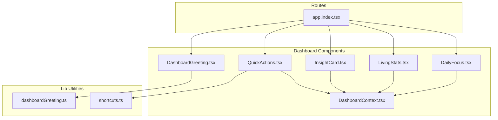
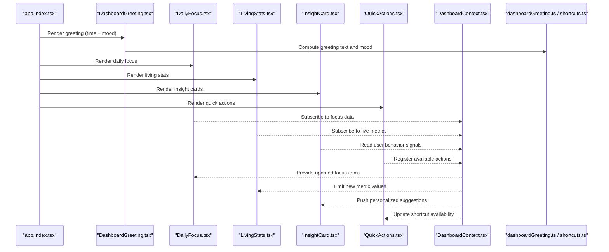
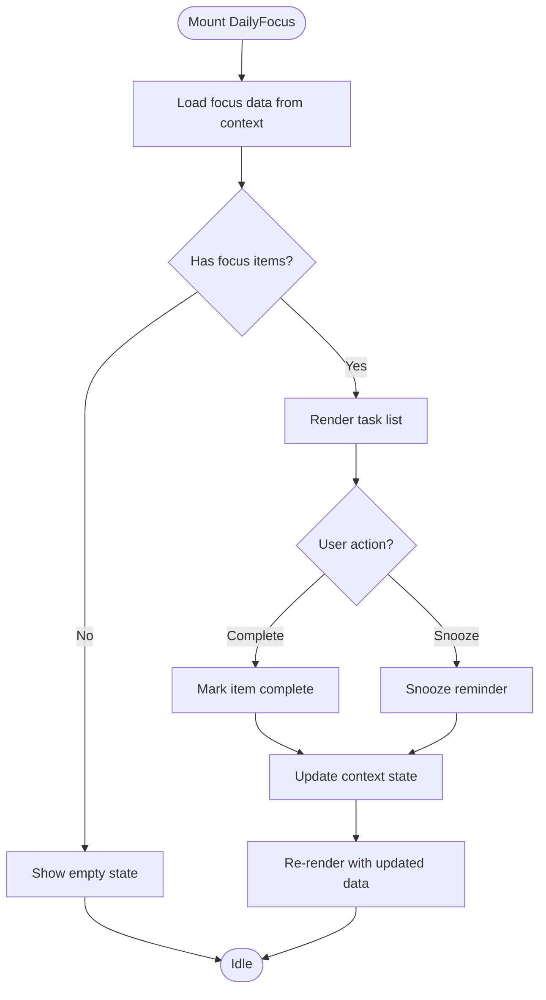
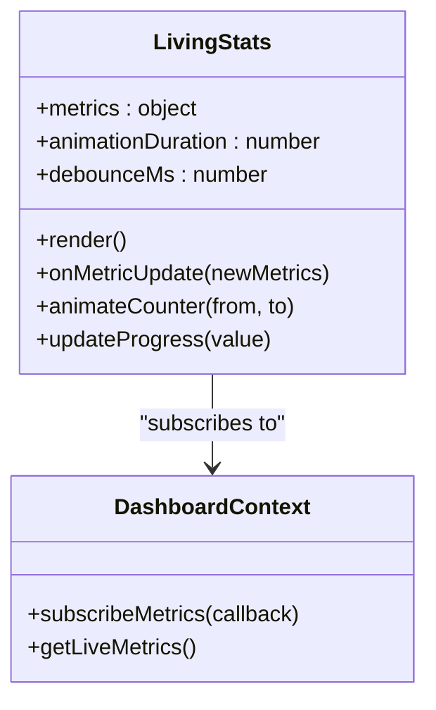
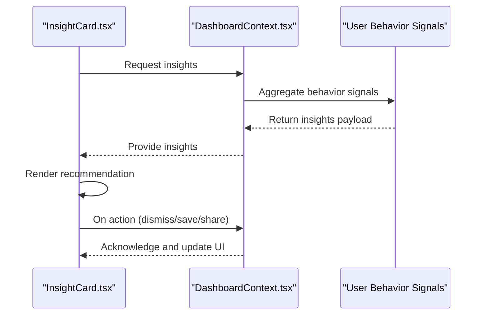
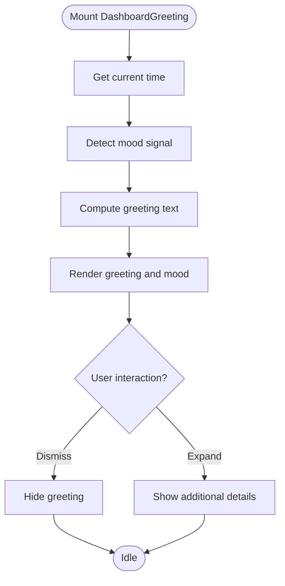
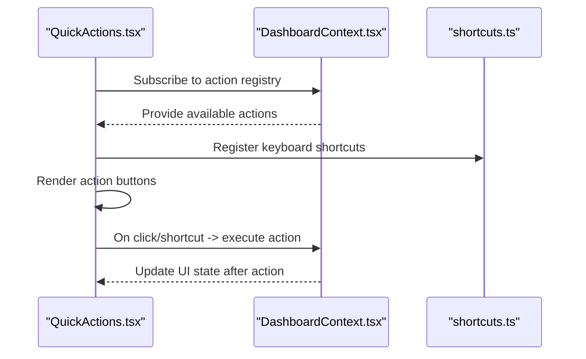
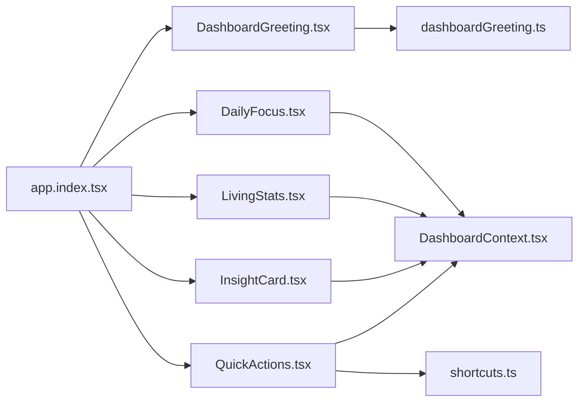

# Dashboard Components

<cite>
**Referenced Files in This Document**
- [DailyFocus.tsx](file://src/components/dashboard/DailyFocus.tsx)
- [LivingStats.tsx](file://src/components/dashboard/LivingStats.tsx)
- [InsightCard.tsx](file://src/components/dashboard/InsightCard.tsx)
- [DashboardGreeting.tsx](file://src/components/dashboard/DashboardGreeting.tsx)
- [QuickActions.tsx](file://src/components/dashboard/QuickActions.tsx)
- [DashboardContext.tsx](file://src/components/dashboard/DashboardContext.tsx)
- [dashboardGreeting.ts](file://src/lib/dashboardGreeting.ts)
- [shortcuts.ts](file://src/lib/shortcuts.ts)
- [app.index.tsx](file://src/routes/app.index.tsx)
</cite>

## Table of Contents
1. [Introduction](#introduction)
2. [Project Structure](#project-structure)
3. [Core Components](#core-components)
4. [Architecture Overview](#architecture-overview)
5. [Detailed Component Analysis](#detailed-component-analysis)
6. [Dependency Analysis](#dependency-analysis)
7. [Performance Considerations](#performance-considerations)
8. [Troubleshooting Guide](#troubleshooting-guide)
9. [Conclusion](#conclusion)

## Introduction
This document provides comprehensive documentation for the dashboard and home screen components that power the main user experience. It focuses on:
- DailyFocus: highlights priority tasks and reminders for the day
- LivingStats: displays real-time statistics with animated counters and progress indicators
- InsightCard: shows personalized recommendations and insights based on user behavior
- DashboardGreeting: renders contextual welcome messages and mood detection
- QuickActions: offers frequently used operations with keyboard shortcuts

The guide includes usage examples, data binding patterns, and responsive design considerations to help developers integrate and customize these components effectively.

## Project Structure
The dashboard components are organized under src/components/dashboard/. The root app route composes these components into a cohesive dashboard layout. Supporting utilities handle greeting logic and keyboard shortcuts.

**Diagram sources**
- [app.index.tsx](file://src/routes/app.index.tsx)
- [DailyFocus.tsx](file://src/components/dashboard/DailyFocus.tsx)
- [LivingStats.tsx](file://src/components/dashboard/LivingStats.tsx)
- [InsightCard.tsx](file://src/components/dashboard/InsightCard.tsx)
- [DashboardGreeting.tsx](file://src/components/dashboard/DashboardGreeting.tsx)
- [QuickActions.tsx](file://src/components/dashboard/QuickActions.tsx)
- [DashboardContext.tsx](file://src/components/dashboard/DashboardContext.tsx)
- [dashboardGreeting.ts](file://src/lib/dashboardGreeting.ts)
- [shortcuts.ts](file://src/lib/shortcuts.ts)

**Section sources**
- [app.index.tsx](file://src/routes/app.index.tsx)
- [DailyFocus.tsx](file://src/components/dashboard/DailyFocus.tsx)
- [LivingStats.tsx](file://src/components/dashboard/LivingStats.tsx)
- [InsightCard.tsx](file://src/components/dashboard/InsightCard.tsx)
- [DashboardGreeting.tsx](file://src/components/dashboard/DashboardGreeting.tsx)
- [QuickActions.tsx](file://src/components/dashboard/QuickActions.tsx)
- [DashboardContext.tsx](file://src/components/dashboard/DashboardContext.tsx)
- [dashboardGreeting.ts](file://src/lib/dashboardGreeting.ts)
- [shortcuts.ts](file://src/lib/shortcuts.ts)

## Core Components
This section summarizes each component’s purpose, props, state, and integration points.

- DailyFocus
  - Purpose: Highlights priority tasks and reminders for the current day
  - Data binding: Consumes daily focus data from context or local state; supports loading and error states
  - Interactions: Mark complete, snooze reminders, quick actions
  - Responsive: Collapses into a single column on small screens; expands horizontally on larger viewports

- LivingStats
  - Purpose: Real-time statistics display with animated counters and progress indicators
  - Data binding: Subscribes to live updates via context or hooks; debounces frequent updates
  - Animations: Smooth counter transitions and progress bar animations
  - Responsive: Grid layout adapts to screen size; hides less critical stats on mobile

- InsightCard
  - Purpose: Personalized recommendations and insights based on user behavior
  - Data binding: Reads user profile and interaction history; supports refresh and feedback actions
  - Interactions: Dismiss, save, share, or act on recommendation
  - Responsive: Single card stack on mobile; multi-column grid on desktop

- DashboardGreeting
  - Purpose: Contextual welcome message and mood detection
  - Data binding: Uses time-of-day and user preferences; integrates with mood signals
  - Interactions: Expandable details, dismissible tips
  - Responsive: Condenses greeting text on smaller screens; preserves key info

- QuickActions
  - Purpose: Frequently used operations with keyboard shortcuts
  - Data binding: Binds to global action registry; supports dynamic availability
  - Interactions: Click handlers, keyboard navigation, tooltips
  - Responsive: Horizontal scroll on mobile; full grid on desktop

**Section sources**
- [DailyFocus.tsx](file://src/components/dashboard/DailyFocus.tsx)
- [LivingStats.tsx](file://src/components/dashboard/LivingStats.tsx)
- [InsightCard.tsx](file://src/components/dashboard/InsightCard.tsx)
- [DashboardGreeting.tsx](file://src/components/dashboard/DashboardGreeting.tsx)
- [QuickActions.tsx](file://src/components/dashboard/QuickActions.tsx)
- [DashboardContext.tsx](file://src/components/dashboard/DashboardContext.tsx)
- [dashboardGreeting.ts](file://src/lib/dashboardGreeting.ts)
- [shortcuts.ts](file://src/lib/shortcuts.ts)

## Architecture Overview
The dashboard is composed by the application index route, which wires up greeting, focus, stats, insights, and quick actions. Shared context provides unified state for all components.

**Diagram sources**
- [app.index.tsx](file://src/routes/app.index.tsx)
- [DashboardGreeting.tsx](file://src/components/dashboard/DashboardGreeting.tsx)
- [DailyFocus.tsx](file://src/components/dashboard/DailyFocus.tsx)
- [LivingStats.tsx](file://src/components/dashboard/LivingStats.tsx)
- [InsightCard.tsx](file://src/components/dashboard/InsightCard.tsx)
- [QuickActions.tsx](file://src/components/dashboard/QuickActions.tsx)
- [DashboardContext.tsx](file://src/components/dashboard/DashboardContext.tsx)
- [dashboardGreeting.ts](file://src/lib/dashboardGreeting.ts)
- [shortcuts.ts](file://src/lib/shortcuts.ts)

## Detailed Component Analysis

### DailyFocus
Highlights priority tasks and reminders for the current day. It binds to context-provided focus data and exposes interactions like marking complete or snoozing reminders.

Key responsibilities:
- Fetch and render daily focus items
- Handle completion and reminder actions
- Manage loading and error states
- Adapt layout for different screen sizes

Data binding pattern:
- Reads focus items from DashboardContext
- Emits events back to context for persistence
- Supports optimistic updates for better UX

Responsive considerations:
- Single-column list on mobile
- Two-column or expanded view on larger screens

**Diagram sources**
- [DailyFocus.tsx](file://src/components/dashboard/DailyFocus.tsx)
- [DashboardContext.tsx](file://src/components/dashboard/DashboardContext.tsx)

**Section sources**
- [DailyFocus.tsx](file://src/components/dashboard/DailyFocus.tsx)
- [DashboardContext.tsx](file://src/components/dashboard/DashboardContext.tsx)

### LivingStats
Displays real-time statistics with animated counters and progress indicators. It subscribes to live updates and smoothly animates changes.

Key responsibilities:
- Subscribe to live metrics
- Animate counters and progress bars
- Debounce rapid updates
- Handle missing or stale data gracefully

Data binding pattern:
- Listens to context-driven metric streams
- Renders incremental updates without jank
- Provides fallbacks for unavailable metrics

Responsive considerations:
- Grid layout with adaptive columns
- Hides secondary metrics on small screens

**Diagram sources**
- [LivingStats.tsx](file://src/components/dashboard/LivingStats.tsx)
- [DashboardContext.tsx](file://src/components/dashboard/DashboardContext.tsx)

**Section sources**
- [LivingStats.tsx](file://src/components/dashboard/LivingStats.tsx)
- [DashboardContext.tsx](file://src/components/dashboard/DashboardContext.tsx)

### InsightCard
Shows personalized recommendations and insights based on user behavior. It reads user signals and allows actions like dismissing or saving recommendations.

Key responsibilities:
- Compute personalized insights
- Render actionable cards
- Support feedback and dismissal
- Refresh content when needed

Data binding pattern:
- Reads user behavior from context
- Emits actions back to context for persistence
- Handles loading and error states

Responsive considerations:
- Stacked cards on mobile
- Multi-column grid on desktop

**Diagram sources**
- [InsightCard.tsx](file://src/components/dashboard/InsightCard.tsx)
- [DashboardContext.tsx](file://src/components/dashboard/DashboardContext.tsx)

**Section sources**
- [InsightCard.tsx](file://src/components/dashboard/InsightCard.tsx)
- [DashboardContext.tsx](file://src/components/dashboard/DashboardContext.tsx)

### DashboardGreeting
Renders contextual welcome messages and mood detection based on time-of-day and user preferences.

Key responsibilities:
- Generate greeting text using time and mood
- Display mood indicator and optional tips
- Allow dismissal or expansion

Data binding pattern:
- Uses dashboardGreeting utility for text computation
- Integrates with context for user preferences

Responsive considerations:
- Condensed greeting on small screens
- Preserves essential information

**Diagram sources**
- [DashboardGreeting.tsx](file://src/components/dashboard/DashboardGreeting.tsx)
- [dashboardGreeting.ts](file://src/lib/dashboardGreeting.ts)

**Section sources**
- [DashboardGreeting.tsx](file://src/components/dashboard/DashboardGreeting.tsx)
- [dashboardGreeting.ts](file://src/lib/dashboardGreeting.ts)

### QuickActions
Provides frequently used operations with keyboard shortcuts. It binds to a global action registry and supports keyboard navigation.

Key responsibilities:
- Render available actions
- Bind keyboard shortcuts
- Handle action execution and feedback
- Update availability dynamically

Data binding pattern:
- Subscribes to context for action registry
- Emits executed actions back to context

Responsive considerations:
- Horizontal scroll on mobile
- Full grid on larger screens

**Diagram sources**
- [QuickActions.tsx](file://src/components/dashboard/QuickActions.tsx)
- [DashboardContext.tsx](file://src/components/dashboard/DashboardContext.tsx)
- [shortcuts.ts](file://src/lib/shortcuts.ts)

**Section sources**
- [QuickActions.tsx](file://src/components/dashboard/QuickActions.tsx)
- [DashboardContext.tsx](file://src/components/dashboard/DashboardContext.tsx)
- [shortcuts.ts](file://src/lib/shortcuts.ts)

## Dependency Analysis
The dashboard components rely on shared context and utilities for consistent behavior and state management.

**Diagram sources**
- [app.index.tsx](file://src/routes/app.index.tsx)
- [DashboardGreeting.tsx](file://src/components/dashboard/DashboardGreeting.tsx)
- [DailyFocus.tsx](file://src/components/dashboard/DailyFocus.tsx)
- [LivingStats.tsx](file://src/components/dashboard/LivingStats.tsx)
- [InsightCard.tsx](file://src/components/dashboard/InsightCard.tsx)
- [QuickActions.tsx](file://src/components/dashboard/QuickActions.tsx)
- [DashboardContext.tsx](file://src/components/dashboard/DashboardContext.tsx)
- [dashboardGreeting.ts](file://src/lib/dashboardGreeting.ts)
- [shortcuts.ts](file://src/lib/shortcuts.ts)

**Section sources**
- [app.index.tsx](file://src/routes/app.index.tsx)
- [DashboardContext.tsx](file://src/components/dashboard/DashboardContext.tsx)
- [dashboardGreeting.ts](file://src/lib/dashboardGreeting.ts)
- [shortcuts.ts](file://src/lib/shortcuts.ts)

## Performance Considerations
- Debounce frequent metric updates in LivingStats to avoid excessive re-renders
- Use memoization for computed greeting text and insight payloads
- Implement virtualization for large lists in DailyFocus if needed
- Prefer lazy loading for non-critical insights and actions
- Optimize animations with requestAnimationFrame and CSS transforms
- Minimize context updates by batching state changes

[No sources needed since this section provides general guidance]

## Troubleshooting Guide
Common issues and resolutions:
- Missing focus items: Verify context subscription and data source availability
- Stale stats: Check metric stream updates and debounce settings
- Unavailable insights: Ensure user behavior signals are being recorded
- Greeting not updating: Confirm time-of-day and mood detection logic
- Keyboard shortcuts not working: Validate shortcut registration and event listeners

**Section sources**
- [DailyFocus.tsx](file://src/components/dashboard/DailyFocus.tsx)
- [LivingStats.tsx](file://src/components/dashboard/LivingStats.tsx)
- [InsightCard.tsx](file://src/components/dashboard/InsightCard.tsx)
- [DashboardGreeting.tsx](file://src/components/dashboard/DashboardGreeting.tsx)
- [QuickActions.tsx](file://src/components/dashboard/QuickActions.tsx)
- [DashboardContext.tsx](file://src/components/dashboard/DashboardContext.tsx)
- [dashboardGreeting.ts](file://src/lib/dashboardGreeting.ts)
- [shortcuts.ts](file://src/lib/shortcuts.ts)

## Conclusion
The dashboard components provide a cohesive and responsive user experience through well-structured data binding, clear separation of concerns, and thoughtful performance optimizations. By leveraging shared context and utilities, these components deliver personalized, real-time insights and efficient interactions tailored to user behavior and preferences.

[No sources needed since this section summarizes without analyzing specific files]