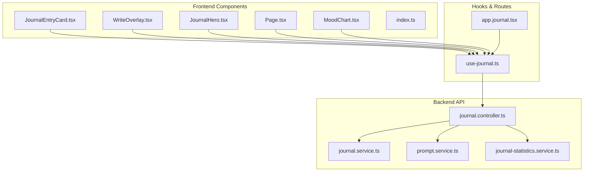
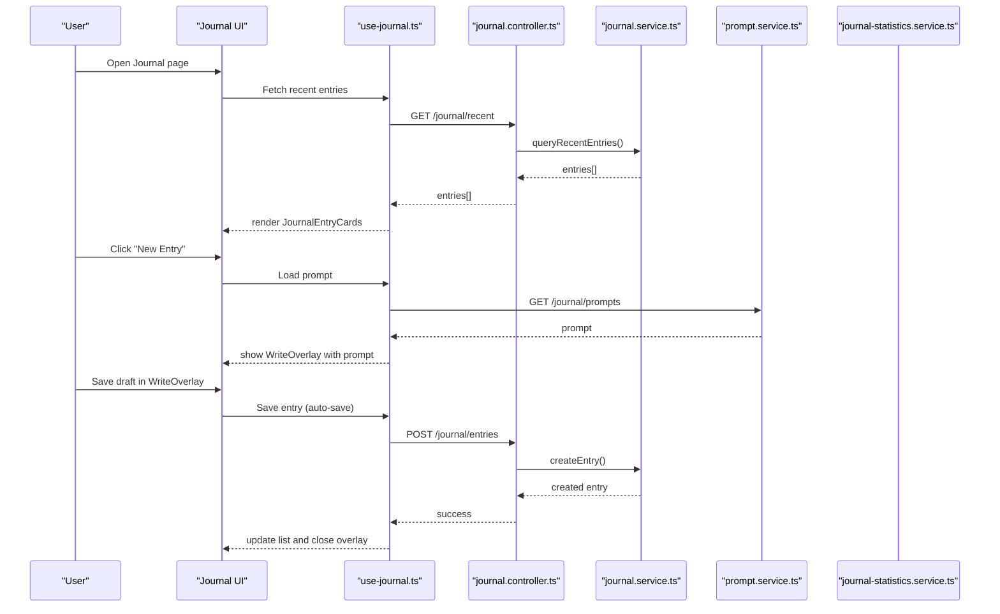
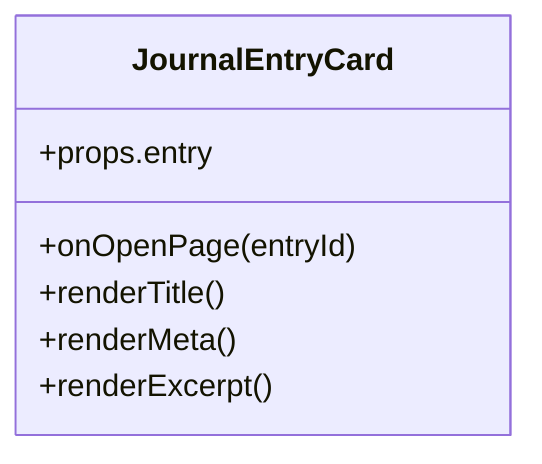
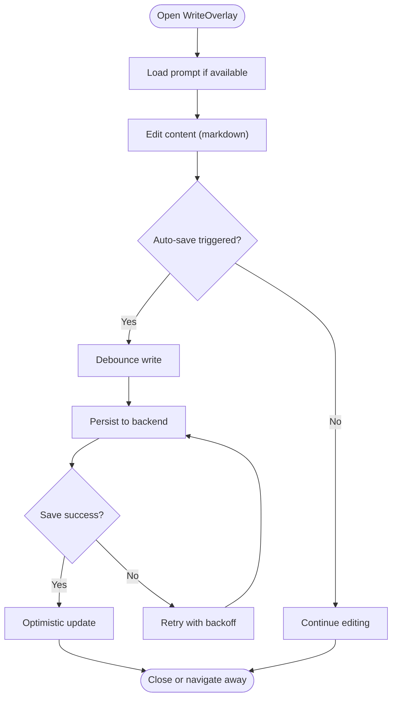
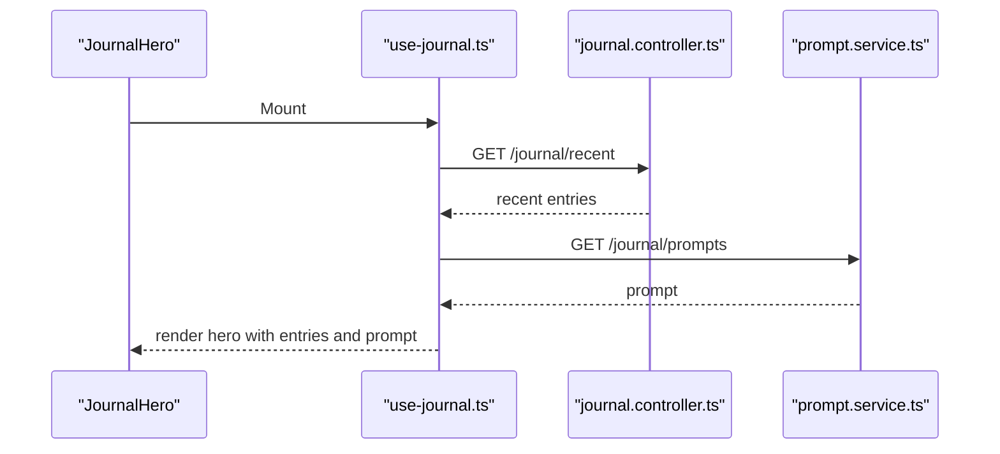
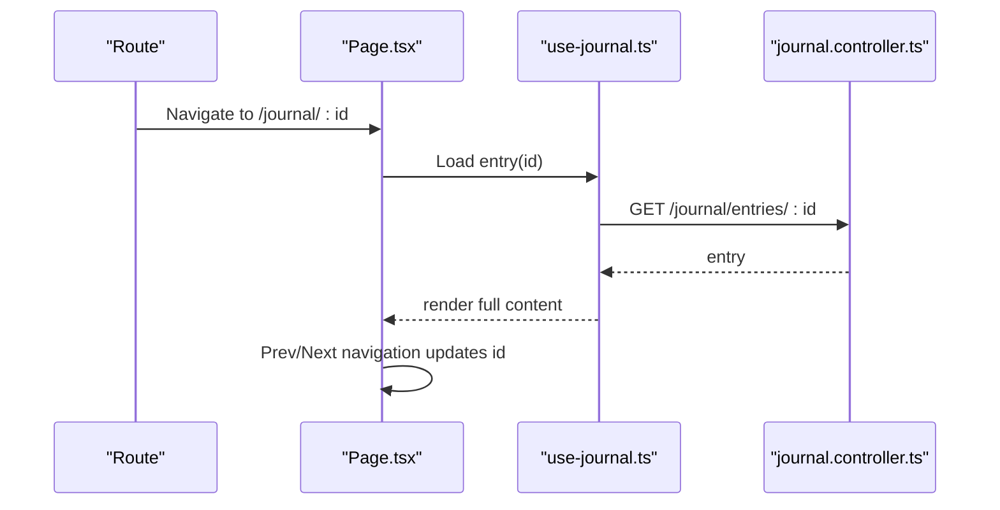
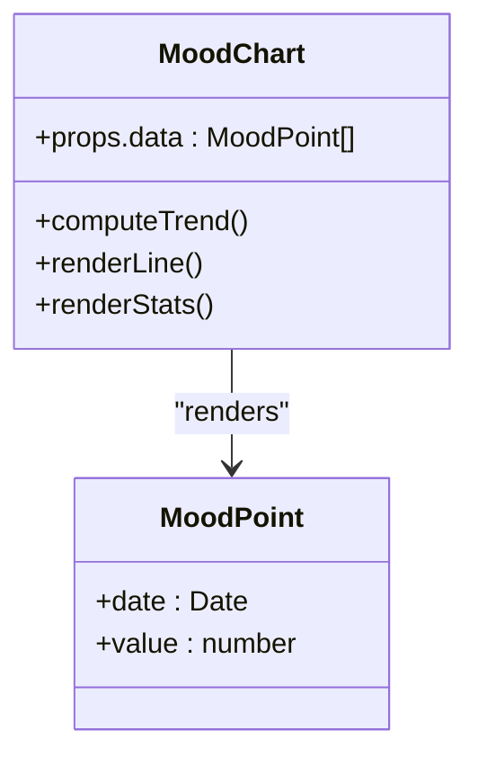
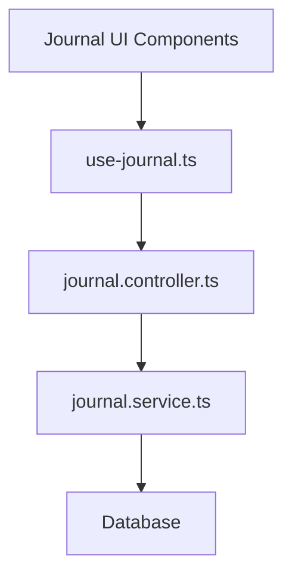
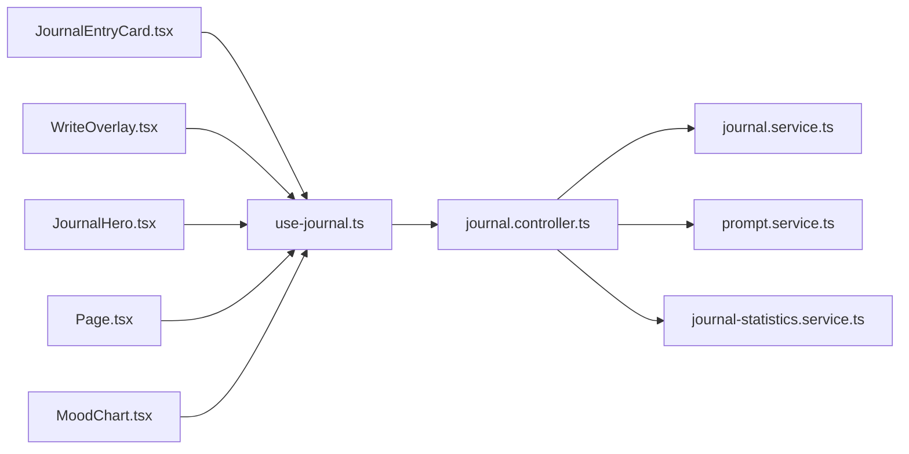

# Journal Components

<cite>
**Referenced Files in This Document**
- [JournalEntryCard.tsx](file://src/components/journal/JournalEntryCard.tsx)
- [WriteOverlay.tsx](file://src/components/journal/WriteOverlay.tsx)
- [JournalHero.tsx](file://src/components/journal/JournalHero.tsx)
- [Page.tsx](file://src/components/journal/Page.tsx)
- [MoodChart.tsx](file://src/components/journal/MoodChart.tsx)
- [index.ts](file://src/components/journal/index.ts)
- [use-journal.ts](file://src/hooks/use-journal.ts)
- [journal.controller.ts](file://apps/backend/src/journal/journal.controller.ts)
- [journal.service.ts](file://apps/backend/src/journal/journal.service.ts)
- [prompt.service.ts](file://apps/backend/src/journal/prompt.service.ts)
- [journal-statistics.service.ts](file://apps/backend/src/journal/journal-statistics.service.ts)
- [app.journal.tsx](file://src/routes/app.journal.tsx)
</cite>

## Table of Contents
1. [Introduction](#introduction)
2. [Project Structure](#project-structure)
3. [Core Components](#core-components)
4. [Architecture Overview](#architecture-overview)
5. [Detailed Component Analysis](#detailed-component-analysis)
6. [Dependency Analysis](#dependency-analysis)
7. [Performance Considerations](#performance-considerations)
8. [Troubleshooting Guide](#troubleshooting-guide)
9. [Conclusion](#conclusion)

## Introduction
This document provides comprehensive documentation for the journaling and writing components, focusing on how entries are displayed, edited, navigated, and visualized. It covers:
- JournalEntryCard for rendering individual journal entries with formatting and metadata
- WriteOverlay for rich text editing with markdown support and auto-save behavior
- JournalHero as the landing area for recent entries and writing prompts
- Page component for viewing a single entry with navigation and sharing features
- MoodChart for visualizing emotional states over time with trend analysis
It also includes usage examples, text processing patterns, and integration points with the journal backend services.

## Project Structure
The journal UI is implemented under src/components/journal with supporting hooks and routes. The backend exposes journal APIs under apps/backend/src/journal.

**Diagram sources**
- [JournalEntryCard.tsx](file://src/components/journal/JournalEntryCard.tsx)
- [WriteOverlay.tsx](file://src/components/journal/WriteOverlay.tsx)
- [JournalHero.tsx](file://src/components/journal/JournalHero.tsx)
- [Page.tsx](file://src/components/journal/Page.tsx)
- [MoodChart.tsx](file://src/components/journal/MoodChart.tsx)
- [index.ts](file://src/components/journal/index.ts)
- [use-journal.ts](file://src/hooks/use-journal.ts)
- [app.journal.tsx](file://src/routes/app.journal.tsx)
- [journal.controller.ts](file://apps/backend/src/journal/journal.controller.ts)
- [journal.service.ts](file://apps/backend/src/journal/journal.service.ts)
- [prompt.service.ts](file://apps/backend/src/journal/prompt.service.ts)
- [journal-statistics.service.ts](file://apps/backend/src/journal/journal-statistics.service.ts)

**Section sources**
- [index.ts](file://src/components/journal/index.ts)
- [app.journal.tsx](file://src/routes/app.journal.tsx)

## Core Components
- JournalEntryCard: Renders a single journal entry with title, date/time, mood indicator, snippet preview, and optional tags or media references. Supports click-to-navigate to the full Page view.
- WriteOverlay: Full-screen editor overlay that supports markdown input, live preview toggle, and auto-save with debounced persistence. Integrates with prompt suggestions and mood tagging.
- JournalHero: Landing section showing recent entries, quick actions (new entry), and daily prompts fetched from the backend.
- Page: Dedicated view for a single entry with rich content, navigation between previous/next entries, and sharing options.
- MoodChart: Visualizes mood values over time, including trend lines and statistical summaries.

Usage examples:
- Display a list of entries using JournalEntryCard within a scrollable container.
- Open WriteOverlay via a “New Entry” action; on save, refresh the list and close the overlay.
- Render JournalHero at the top of the journal route to surface prompts and recent items.
- Navigate to Page by clicking an entry card; use back navigation or explicit prev/next controls.
- Embed MoodChart below the hero to visualize trends across selected periods.

**Section sources**
- [JournalEntryCard.tsx](file://src/components/journal/JournalEntryCard.tsx)
- [WriteOverlay.tsx](file://src/components/journal/WriteOverlay.tsx)
- [JournalHero.tsx](file://src/components/journal/JournalHero.tsx)
- [Page.tsx](file://src/components/journal/Page.tsx)
- [MoodChart.tsx](file://src/components/journal/MoodChart.tsx)

## Architecture Overview
The frontend components consume a shared hook (use-journal) which coordinates data fetching, caching, and mutations against the backend journal controller. Prompts and statistics are served by dedicated services.

**Diagram sources**
- [use-journal.ts](file://src/hooks/use-journal.ts)
- [journal.controller.ts](file://apps/backend/src/journal/journal.controller.ts)
- [journal.service.ts](file://apps/backend/src/journal/journal.service.ts)
- [prompt.service.ts](file://apps/backend/src/journal/prompt.service.ts)

## Detailed Component Analysis

### JournalEntryCard
Responsibilities:
- Display entry metadata: title, timestamp, mood, tags, and a short excerpt
- Provide interaction: open full Page view, bookmark/share actions
- Handle loading and error states gracefully

Data flow:
- Receives entry object from parent or hook state
- Formats dates and truncates content safely
- Emits navigation events to parent routing layer

Integration:
- Uses use-journal for local state updates after mutations
- Optional integration with media references if present

**Diagram sources**
- [JournalEntryCard.tsx](file://src/components/journal/JournalEntryCard.tsx)

**Section sources**
- [JournalEntryCard.tsx](file://src/components/journal/JournalEntryCard.tsx)

### WriteOverlay
Responsibilities:
- Rich text editing with markdown support
- Auto-save with debounce and optimistic updates
- Prompt integration and mood selection
- Error handling and retry logic

Processing patterns:
- Markdown parsing and sanitization before saving
- Debounced persistence to avoid excessive writes
- Draft recovery on reload

**Diagram sources**
- [WriteOverlay.tsx](file://src/components/journal/WriteOverlay.tsx)
- [use-journal.ts](file://src/hooks/use-journal.ts)

**Section sources**
- [WriteOverlay.tsx](file://src/components/journal/WriteOverlay.tsx)
- [use-journal.ts](file://src/hooks/use-journal.ts)

### JournalHero
Responsibilities:
- Surface recent entries and quick actions
- Display daily prompts fetched from backend
- Provide navigation to new entry creation

Data flow:
- Fetches recent entries and prompts on mount
- Handles empty states and loading indicators

**Diagram sources**
- [JournalHero.tsx](file://src/components/journal/JournalHero.tsx)
- [use-journal.ts](file://src/hooks/use-journal.ts)
- [journal.controller.ts](file://apps/backend/src/journal/journal.controller.ts)
- [prompt.service.ts](file://apps/backend/src/journal/prompt.service.ts)

**Section sources**
- [JournalHero.tsx](file://src/components/journal/JournalHero.tsx)
- [use-journal.ts](file://src/hooks/use-journal.ts)

### Page
Responsibilities:
- Render full entry content with rich formatting
- Provide navigation between previous/next entries
- Offer sharing options and contextual actions

Navigation pattern:
- Reads entry id from route params
- Loads entry details and related context
- Updates URL on prev/next navigation

Sharing:
- Generates shareable links or copies content based on platform capabilities

**Diagram sources**
- [Page.tsx](file://src/components/journal/Page.tsx)
- [use-journal.ts](file://src/hooks/use-journal.ts)
- [journal.controller.ts](file://apps/backend/src/journal/journal.controller.ts)

**Section sources**
- [Page.tsx](file://src/components/journal/Page.tsx)
- [use-journal.ts](file://src/hooks/use-journal.ts)

### MoodChart
Responsibilities:
- Visualize mood values over time
- Compute and display trend lines and summary stats
- Support filtering by date range

Data model:
- Array of { date, value } records
- Aggregations for moving averages and min/max

**Diagram sources**
- [MoodChart.tsx](file://src/components/journal/MoodChart.tsx)

**Section sources**
- [MoodChart.tsx](file://src/components/journal/MoodChart.tsx)

### Conceptual Overview
The journal feature follows a clear separation of concerns:
- UI components focus on presentation and user interactions
- A shared hook encapsulates data fetching, caching, and mutations
- Backend controllers expose REST endpoints for entries, prompts, and statistics
- Services implement business logic and database access

[No sources needed since this diagram shows conceptual workflow, not actual code structure]

## Dependency Analysis
Component dependencies and relationships:
- All journal components depend on use-journal for data operations
- use-journal depends on journal.controller endpoints
- JournalHero additionally depends on prompt service
- MoodChart consumes aggregated mood data derived from entries

**Diagram sources**
- [JournalEntryCard.tsx](file://src/components/journal/JournalEntryCard.tsx)
- [WriteOverlay.tsx](file://src/components/journal/WriteOverlay.tsx)
- [JournalHero.tsx](file://src/components/journal/JournalHero.tsx)
- [Page.tsx](file://src/components/journal/Page.tsx)
- [MoodChart.tsx](file://src/components/journal/MoodChart.tsx)
- [use-journal.ts](file://src/hooks/use-journal.ts)
- [journal.controller.ts](file://apps/backend/src/journal/journal.controller.ts)
- [journal.service.ts](file://apps/backend/src/journal/journal.service.ts)
- [prompt.service.ts](file://apps/backend/src/journal/prompt.service.ts)
- [journal-statistics.service.ts](file://apps/backend/src/journal/journal-statistics.service.ts)

**Section sources**
- [use-journal.ts](file://src/hooks/use-journal.ts)
- [journal.controller.ts](file://apps/backend/src/journal/journal.controller.ts)

## Performance Considerations
- Debounce auto-save writes to reduce network load during rapid edits
- Paginate recent entries and lazy-load large content in Page view
- Cache prompts and statistics to minimize repeated requests
- Use virtualization for long lists of JournalEntryCard instances
- Optimize chart rendering by memoizing computed aggregates in MoodChart

[No sources needed since this section provides general guidance]

## Troubleshooting Guide
Common issues and resolutions:
- Auto-save failures: Check network connectivity and retry backoff; inspect error responses from journal.controller
- Missing prompts: Verify prompt.service endpoint availability and permissions
- Empty entry lists: Ensure correct user context and pagination parameters
- Chart anomalies: Validate mood data format and ensure consistent date ordering

**Section sources**
- [journal.controller.ts](file://apps/backend/src/journal/journal.controller.ts)
- [prompt.service.ts](file://apps/backend/src/journal/prompt.service.ts)
- [journal-statistics.service.ts](file://apps/backend/src/journal/journal-statistics.service.ts)

## Conclusion
The journaling system combines intuitive UI components with robust backend services to deliver a seamless writing experience. JournalEntryCard, WriteOverlay, JournalHero, Page, and MoodChart work together through a shared hook to provide efficient data flow, rich editing capabilities, and insightful visualizations. Following the patterns and recommendations outlined here will help maintain performance, reliability, and usability across the journal feature set.