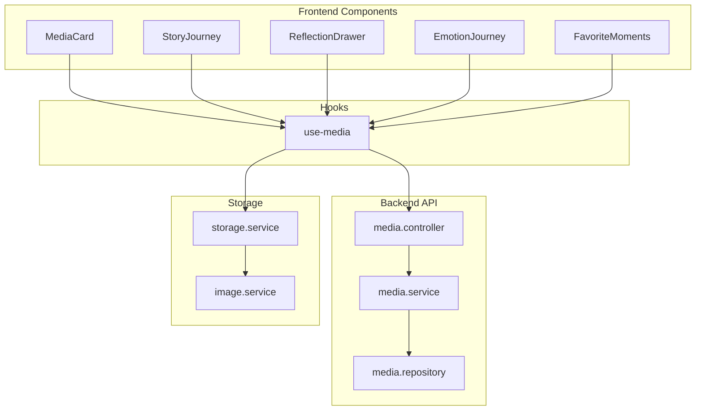
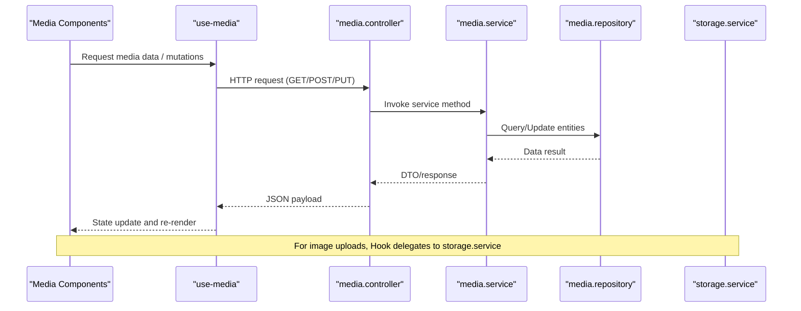
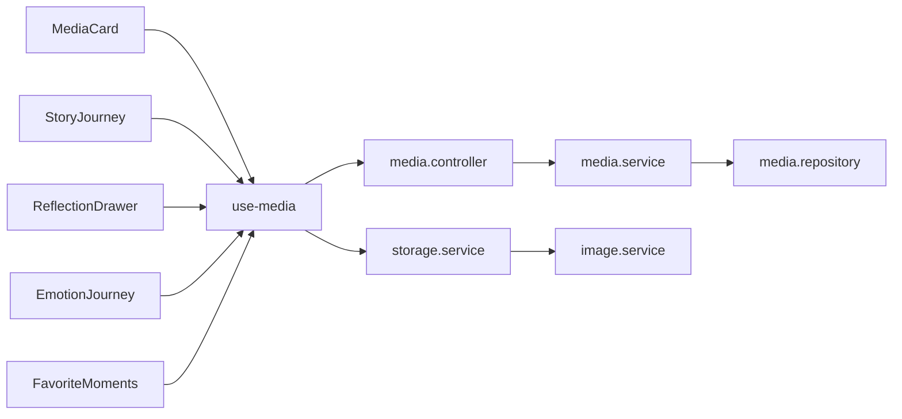

# Media Components

<cite>
**Referenced Files in This Document**
- [MediaCard.tsx](file://src/components/media/MediaCard.tsx)
- [StoryJourney.tsx](file://src/components/media/StoryJourney.tsx)
- [ReflectionDrawer.tsx](file://src/components/media/ReflectionDrawer.tsx)
- [EmotionJourney.tsx](file://src/components/media/EmotionJourney.tsx)
- [FavoriteMoments.tsx](file://src/components/media/FavoriteMoments.tsx)
- [use-media.ts](file://src/hooks/use-media.ts)
- [media.service.ts](file://apps/backend/src/media/media.service.ts)
- [media.controller.ts](file://apps/backend/src/media/media.controller.ts)
- [media.repository.ts](file://apps/backend/src/media/media.repository.ts)
- [storage.service.ts](file://apps/backend/src/storage/storage.service.ts)
- [image.service.ts](file://apps/backend/src/storage/image.service.ts)
</cite>

## Table of Contents
1. [Introduction](#introduction)
2. [Project Structure](#project-structure)
3. [Core Components](#core-components)
4. [Architecture Overview](#architecture-overview)
5. [Detailed Component Analysis](#detailed-component-analysis)
6. [Dependency Analysis](#dependency-analysis)
7. [Performance Considerations](#performance-considerations)
8. [Troubleshooting Guide](#troubleshooting-guide)
9. [Conclusion](#conclusion)

## Introduction
This document provides detailed documentation for media-related components that power the user-facing experience around media items and personal reflections. It covers:
- MediaCard for displaying media items with posters, ratings, and quick actions
- StoryJourney for tracking narrative progression and character development across media items
- ReflectionDrawer for side-panel reflection writing with rich text editing
- EmotionJourney for visualizing emotional responses over time with interactive charts
- FavoriteMoments for highlighting memorable scenes and quotes

For each component, we describe props, data binding patterns, integration points with backend APIs and storage services, and best practices for performance and accessibility.

## Project Structure
The media components live under src/components/media and are consumed by routes and pages throughout the app. They rely on hooks (e.g., use-media) to fetch and mutate data via backend controllers and services. Storage operations are handled through dedicated storage services.

**Diagram sources**
- [MediaCard.tsx](file://src/components/media/MediaCard.tsx)
- [StoryJourney.tsx](file://src/components/media/StoryJourney.tsx)
- [ReflectionDrawer.tsx](file://src/components/media/ReflectionDrawer.tsx)
- [EmotionJourney.tsx](file://src/components/media/EmotionJourney.tsx)
- [FavoriteMoments.tsx](file://src/components/media/FavoriteMoments.tsx)
- [use-media.ts](file://src/hooks/use-media.ts)
- [media.controller.ts](file://apps/backend/src/media/media.controller.ts)
- [media.service.ts](file://apps/backend/src/media/media.service.ts)
- [media.repository.ts](file://apps/backend/src/media/media.repository.ts)
- [storage.service.ts](file://apps/backend/src/storage/storage.service.ts)
- [image.service.ts](file://apps/backend/src/storage/image.service.ts)

**Section sources**
- [MediaCard.tsx](file://src/components/media/MediaCard.tsx)
- [StoryJourney.tsx](file://src/components/media/StoryJourney.tsx)
- [ReflectionDrawer.tsx](file://src/components/media/ReflectionDrawer.tsx)
- [EmotionJourney.tsx](file://src/components/media/EmotionJourney.tsx)
- [FavoriteMoments.tsx](file://src/components/media/FavoriteMoments.tsx)
- [use-media.ts](file://src/hooks/use-media.ts)
- [media.controller.ts](file://apps/backend/src/media/media.controller.ts)
- [media.service.ts](file://apps/backend/src/media/media.service.ts)
- [media.repository.ts](file://apps/backend/src/media/media.repository.ts)
- [storage.service.ts](file://apps/backend/src/storage/storage.service.ts)
- [image.service.ts](file://apps/backend/src/storage/image.service.ts)

## Core Components
This section summarizes the purpose and key responsibilities of each media component:
- MediaCard: Displays a media item’s poster, title, rating, and quick actions such as bookmarking or adding to collections.
- StoryJourney: Visualizes narrative arcs and character development across episodes, chapters, or installments.
- ReflectionDrawer: A slide-out panel for writing reflections with rich text support, linked to a specific media item.
- EmotionJourney: Interactive chart showing emotional responses over time, enabling users to explore peaks and valleys in their viewing experience.
- FavoriteMoments: Curates memorable scenes and quotes tied to a media item, supporting quick sharing and journaling.

These components integrate with use-media for data fetching/mutations and backend endpoints for persistence.

**Section sources**
- [MediaCard.tsx](file://src/components/media/MediaCard.tsx)
- [StoryJourney.tsx](file://src/components/media/StoryJourney.tsx)
- [ReflectionDrawer.tsx](file://src/components/media/ReflectionDrawer.tsx)
- [EmotionJourney.tsx](file://src/components/media/EmotionJourney.tsx)
- [FavoriteMoments.tsx](file://src/components/media/FavoriteMoments.tsx)
- [use-media.ts](file://src/hooks/use-media.ts)

## Architecture Overview
The frontend components consume typed data from use-media, which calls media controller endpoints. Backend services orchestrate business logic and repository access. Storage services manage images and attachments.

**Diagram sources**
- [use-media.ts](file://src/hooks/use-media.ts)
- [media.controller.ts](file://apps/backend/src/media/media.controller.ts)
- [media.service.ts](file://apps/backend/src/media/media.service.ts)
- [media.repository.ts](file://apps/backend/src/media/media.repository.ts)
- [storage.service.ts](file://apps/backend/src/storage/storage.service.ts)

## Detailed Component Analysis

### MediaCard
Purpose:
- Renders a compact card for a media item including poster image, title, rating, and quick actions (e.g., favorite, add to collection, open details).

Key props:
- mediaId: Unique identifier for the media item
- title: Display name of the media
- posterUrl: URL for the poster image
- rating: Numeric or star-based rating value
- status: Current watch status (e.g., planning, in-progress, completed)
- onOpenDetails: Callback to navigate to detail view
- onToggleFavorite: Callback to toggle favorite state
- onAddToCollection: Callback to add to a collection
- onRate: Callback to submit a new rating

Data binding:
- Uses use-media to fetch media metadata and perform mutations (favorite, rate, add to collection).
- Poster images may be proxied or signed URLs from storage.service.

Integration points:
- GET media details endpoint via media.controller
- PATCH/POST for favorites, ratings, and collections via media.controller
- Image loading via storage.service

Accessibility:
- Alt text for poster images
- Keyboard navigation for action buttons
- ARIA labels for interactive elements

Performance:
- Lazy-load poster images
- Debounce rapid action clicks
- Cache frequently accessed media metadata

Error handling:
- Graceful fallbacks for missing posters
- Toast notifications for failed mutations
- Retry logic for transient network errors

**Section sources**
- [MediaCard.tsx](file://src/components/media/MediaCard.tsx)
- [use-media.ts](file://src/hooks/use-media.ts)
- [media.controller.ts](file://apps/backend/src/media/media.controller.ts)
- [storage.service.ts](file://apps/backend/src/storage/storage.service.ts)

### StoryJourney
Purpose:
- Tracks narrative progression and character development across multiple media items (e.g., seasons, episodes, books).

Key props:
- mediaId: Identifier for the root media item
- timelineData: Array of nodes representing story beats or episodes
- characters: List of characters with arcs mapped to timeline nodes
- onSelectNode: Callback when a node is selected
- onAddNote: Callback to attach a note or reflection to a node

Data binding:
- Fetches timeline and character data via use-media and media.controller endpoints.
- Updates local state upon selection or note addition.

Integration points:
- GET timeline and character arcs via media.controller
- POST notes/reflections via media.controller or journal endpoints if integrated

Visualization:
- Timeline visualization with clickable nodes
- Character arc overlays or filters
- Expandable details per node

Accessibility:
- Semantic list structures for timeline nodes
- Focus management for keyboard navigation
- Descriptive labels for nodes and arcs

Performance:
- Virtualize long timelines
- Defer heavy computations until interaction

Error handling:
- Handle missing timeline data gracefully
- Provide retry options for failed loads

**Section sources**
- [StoryJourney.tsx](file://src/components/media/StoryJourney.tsx)
- [use-media.ts](file://src/hooks/use-media.ts)
- [media.controller.ts](file://apps/backend/src/media/media.controller.ts)

### ReflectionDrawer
Purpose:
- Provides a side-panel drawer for writing reflections with rich text editing, associated with a specific media item.

Key props:
- mediaId: Identifier for the media item
- isOpen: Controls visibility of the drawer
- onClose: Callback to close the drawer
- onSave: Callback to persist reflection content
- initialContent: Optional pre-filled content for editing

Rich text features:
- Bold, italic, headings, lists, links
- Auto-save drafts
- Markdown or WYSIWYG editor depending on implementation

Data binding:
- Loads existing reflections via use-media and media.controller
- Persists changes through media.controller or journal endpoints

Integration points:
- GET/POST/PUT reflection entries via media.controller
- Optional attachment upload via storage.service

Accessibility:
- Proper focus trapping within the drawer
- Screen reader announcements for save states
- Keyboard shortcuts for common actions

Performance:
- Debounced auto-save
- Efficient diffing for large documents

Error handling:
- Validation feedback for required fields
- Error messages for save failures
- Local draft recovery on crash

**Section sources**
- [ReflectionDrawer.tsx](file://src/components/media/ReflectionDrawer.tsx)
- [use-media.ts](file://src/hooks/use-media.ts)
- [media.controller.ts](file://apps/backend/src/media/media.controller.ts)
- [storage.service.ts](file://apps/backend/src/storage/storage.service.ts)

### EmotionJourney
Purpose:
- Visualizes emotional responses over time with interactive charts, allowing users to explore peaks and valleys in their viewing experience.

Key props:
- mediaId: Identifier for the media item
- emotionData: Time-series data of emotions (e.g., timestamps and sentiment scores)
- onHighlightMoment: Callback to highlight a moment on the timeline
- onExportInsights: Callback to export insights or share results

Chart features:
- Line or area charts for emotion trends
- Hover tooltips with context
- Zoom and pan for detailed exploration

Data binding:
- Fetches emotion data via use-media and media.controller
- Supports filtering by episode or chapter segments

Integration points:
- GET emotion analytics via media.controller
- Optional export via storage.service for CSV/PNG

Accessibility:
- Data table alternative for screen readers
- Keyboard navigation for chart interactions
- Color contrast compliance

Performance:
- Canvas-based rendering for large datasets
- Memoization of computed aggregates

Error handling:
- Fallback to summary statistics when chart data is incomplete
- Retry on network failures

**Section sources**
- [EmotionJourney.tsx](file://src/components/media/EmotionJourney.tsx)
- [use-media.ts](file://src/hooks/use-media.ts)
- [media.controller.ts](file://apps/backend/src/media/media.controller.ts)

### FavoriteMoments
Purpose:
- Highlights memorable scenes and quotes tied to a media item, enabling quick sharing and journaling.

Key props:
- mediaId: Identifier for the media item
- moments: Array of memorable moments with metadata (timestamp, quote, scene description)
- onAddMoment: Callback to add a new moment
- onDeleteMoment: Callback to remove a moment
- onShareMoment: Callback to share a moment externally

Features:
- Card-based layout for moments
- Inline editing for quotes and descriptions
- Quick actions (favorite, copy, share)

Data binding:
- Loads moments via use-media and media.controller
- Persists updates through media.controller

Integration points:
- GET/POST/DELETE moments via media.controller
- Optional image/video thumbnails via storage.service

Accessibility:
- Semantic lists for moments
- ARIA labels for actions
- Keyboard navigation between cards

Performance:
- Pagination or virtualization for large moment lists
- Optimistic updates for better UX

Error handling:
- Graceful handling of missing or partial moment data
- Confirmation dialogs for destructive actions

**Section sources**
- [FavoriteMoments.tsx](file://src/components/media/FavoriteMoments.tsx)
- [use-media.ts](file://src/hooks/use-media.ts)
- [media.controller.ts](file://apps/backend/src/media/media.controller.ts)
- [storage.service.ts](file://apps/backend/src/storage/storage.service.ts)

## Dependency Analysis
Components depend on use-media for data operations, which in turn call media.controller endpoints. Backend services coordinate with repositories and storage services.

**Diagram sources**
- [MediaCard.tsx](file://src/components/media/MediaCard.tsx)
- [StoryJourney.tsx](file://src/components/media/StoryJourney.tsx)
- [ReflectionDrawer.tsx](file://src/components/media/ReflectionDrawer.tsx)
- [EmotionJourney.tsx](file://src/components/media/EmotionJourney.tsx)
- [FavoriteMoments.tsx](file://src/components/media/FavoriteMoments.tsx)
- [use-media.ts](file://src/hooks/use-media.ts)
- [media.controller.ts](file://apps/backend/src/media/media.controller.ts)
- [media.service.ts](file://apps/backend/src/media/media.service.ts)
- [media.repository.ts](file://apps/backend/src/media/media.repository.ts)
- [storage.service.ts](file://apps/backend/src/storage/storage.service.ts)
- [image.service.ts](file://apps/backend/src/storage/image.service.ts)

**Section sources**
- [use-media.ts](file://src/hooks/use-media.ts)
- [media.controller.ts](file://apps/backend/src/media/media.controller.ts)
- [media.service.ts](file://apps/backend/src/media/media.service.ts)
- [media.repository.ts](file://apps/backend/src/media/media.repository.ts)
- [storage.service.ts](file://apps/backend/src/storage/storage.service.ts)
- [image.service.ts](file://apps/backend/src/storage/image.service.ts)

## Performance Considerations
- Lazy-load images and defer non-critical assets
- Use pagination or virtualization for large lists (e.g., moments, timeline nodes)
- Debounce input and save operations to reduce server load
- Cache frequently accessed metadata at the hook level
- Prefer canvas-based rendering for complex charts
- Implement optimistic UI updates where appropriate

[No sources needed since this section provides general guidance]

## Troubleshooting Guide
Common issues and resolutions:
- Missing poster images: Verify storage URLs and fallback placeholders
- Failed mutations: Check network requests and error responses from media.controller
- Drawer not closing: Ensure isOpen state is correctly managed and onClose is invoked
- Chart rendering errors: Validate emotionData structure and handle empty datasets
- Moment deletion prompts: Confirm destructive actions and handle confirmation callbacks

**Section sources**
- [ReflectionDrawer.tsx](file://src/components/media/ReflectionDrawer.tsx)
- [EmotionJourney.tsx](file://src/components/media/EmotionJourney.tsx)
- [FavoriteMoments.tsx](file://src/components/media/FavoriteMoments.tsx)
- [use-media.ts](file://src/hooks/use-media.ts)
- [media.controller.ts](file://apps/backend/src/media/media.controller.ts)

## Conclusion
The media components provide a cohesive interface for exploring, reflecting on, and curating media experiences. By integrating tightly with use-media and backend services, they deliver responsive, accessible, and performant features for posters, narratives, reflections, emotions, and favorite moments. Adhering to the prop interfaces and integration patterns outlined here ensures consistent behavior and maintainability across the application.

[No sources needed since this section summarizes without analyzing specific files]