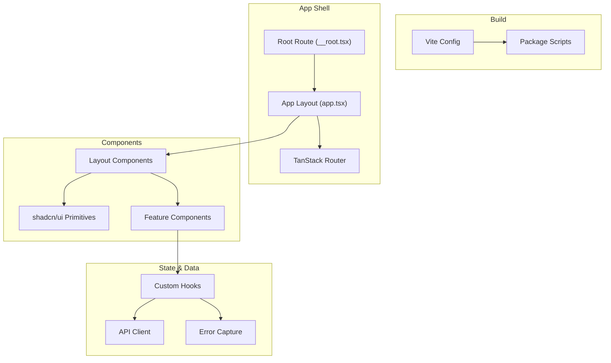
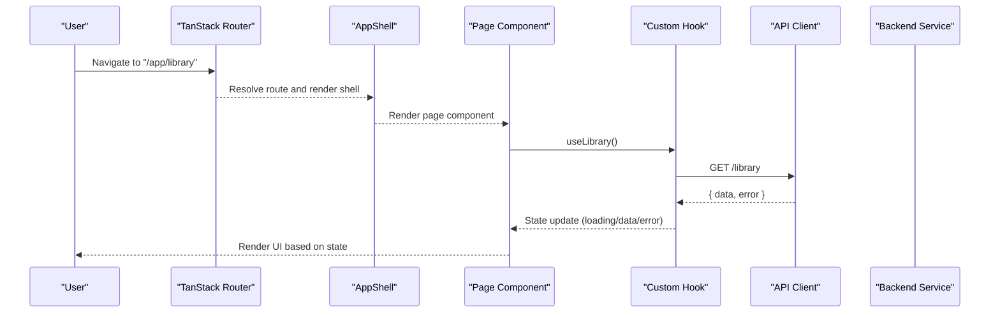
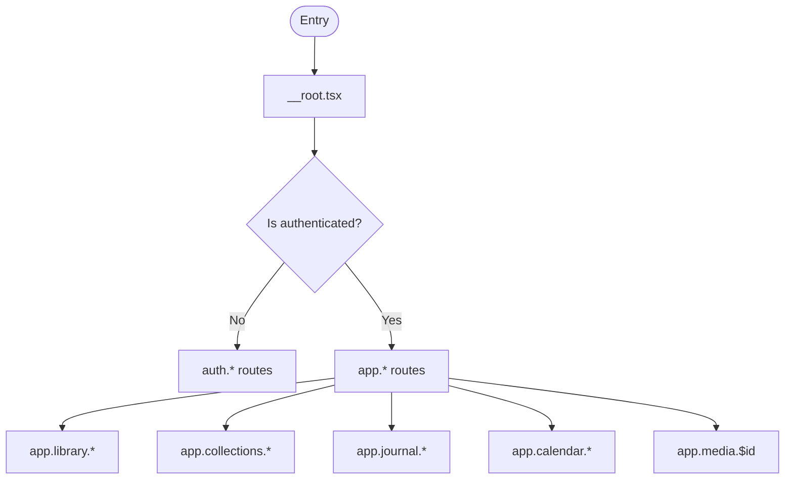
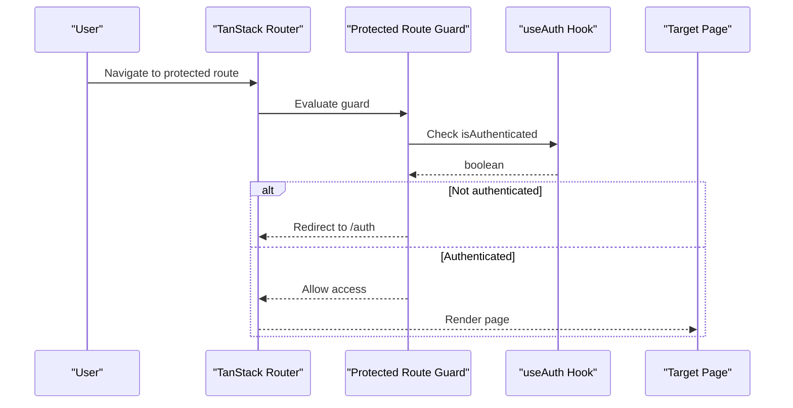
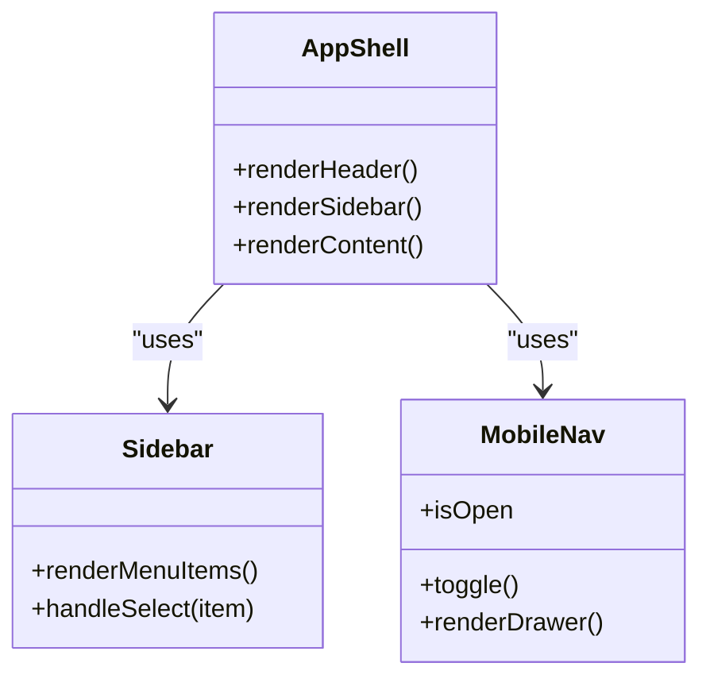
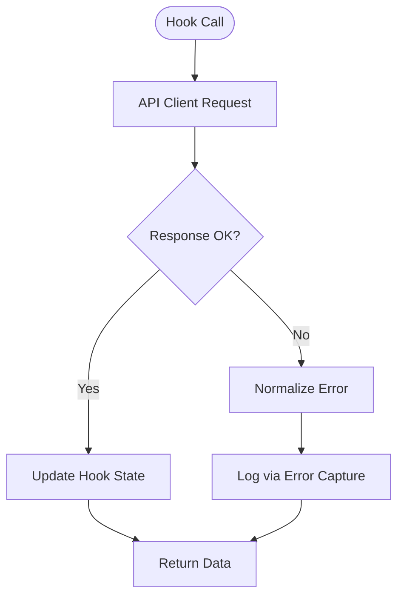
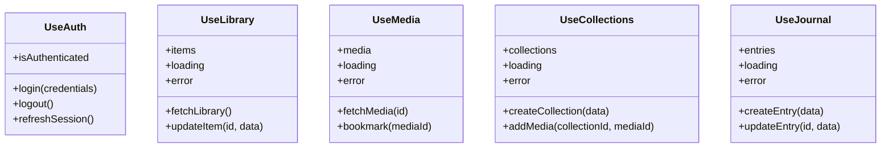
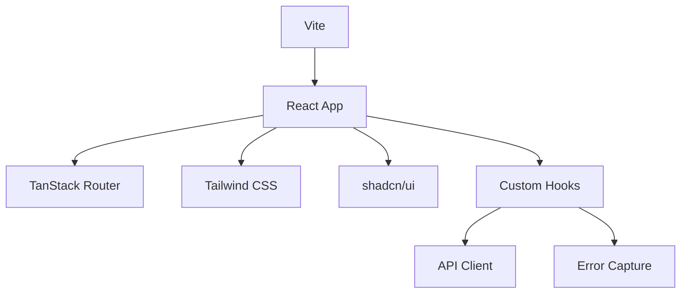

# Frontend Documentation

<cite>
**Referenced Files in This Document**
- [vite.config.ts](file://vite.config.ts)
- [package.json](file://package.json)
- [components.json](file://components.json)
- [src/router.tsx](file://src/router.tsx)
- [src/routeTree.gen.ts](file://src/routeTree.gen.ts)
- [src/routes/__root.tsx](file://src/routes/__root.tsx)
- [src/routes/app.tsx](file://src/routes/app.tsx)
- [src/routes/auth.tsx](file://src/routes/auth.tsx)
- [src/routes/index.tsx](file://src/routes/index.tsx)
- [src/routes/new-landing.tsx](file://src/routes/new-landing.tsx)
- [src/routes/privacy.tsx](file://src/routes/privacy.tsx)
- [src/routes/terms.tsx](file://src/routes/terms.tsx)
- [src/routes/app.index.tsx](file://src/routes/app.index.tsx)
- [src/routes/app.library.tsx](file://src/routes/app.library.tsx)
- [src/routes/app.collections.tsx](file://src/routes/app.collections.tsx)
- [src/routes/app.journal.tsx](file://src/routes/app.journal.tsx)
- [src/routes/app.calendar.tsx](file://src/routes/app.calendar.tsx)
- [src/routes/app.media.$id.tsx](file://src/routes/app.media.$id.tsx)
- [src/components/ui/button.tsx](file://src/components/ui/button.tsx)
- [src/components/ui/card.tsx](file://src/components/ui/card.tsx)
- [src/components/ui/dialog.tsx](file://src/components/ui/dialog.tsx)
- [src/components/layout/AppShell.tsx](file://src/components/layout/AppShell.tsx)
- [src/components/layout/Sidebar.tsx](file://src/components/layout/Sidebar.tsx)
- [src/components/layout/MobileNav.tsx](file://src/components/layout/MobileNav.tsx)
- [src/hooks/use-auth.ts](file://src/hooks/use-auth.ts)
- [src/hooks/use-media.ts](file://src/hooks/use-media.ts)
- [src/hooks/use-collections.ts](file://src/hooks/use-collections.ts)
- [src/hooks/use-library.ts](file://src/hooks/use-library.ts)
- [src/hooks/use-journal.ts](file://src/hooks/use-journal.ts)
- [src/lib/api/client.ts](file://src/lib/api/client.ts)
- [src/lib/error-capture.ts](file://src/lib/error-capture.ts)
- [src/styles.css](file://src/styles.css)
</cite>

## Table of Contents
1. [Introduction](#introduction)
2. [Project Structure](#project-structure)
3. [Core Components](#core-components)
4. [Architecture Overview](#architecture-overview)
5. [Detailed Component Analysis](#detailed-component-analysis)
6. [Dependency Analysis](#dependency-analysis)
7. [Performance Considerations](#performance-considerations)
8. [Troubleshooting Guide](#troubleshooting-guide)
9. [Conclusion](#conclusion)
10. [Appendices](#appendices)

## Introduction
This document provides comprehensive frontend documentation for the React-based application. It covers the component library built on shadcn/ui, custom components organization, state management patterns using custom hooks, routing with TanStack Router (including protected routes and navigation), API integration layer, error handling strategies, performance optimization techniques, responsive design guidelines, accessibility compliance, cross-browser compatibility, and the Vite build process including bundle optimization and code splitting.

## Project Structure
The frontend is organized into feature-oriented directories:
- src/components: UI components grouped by domain (ui primitives, layout, feature modules like calendar, media, collections).
- src/hooks: Custom hooks encapsulating stateful logic and data fetching.
- src/lib: Utilities, API client, analytics, and shared logic.
- src/routes: Route definitions using TanStack Router file-based conventions.
- Public assets under public/.
- Build configuration via vite.config.ts and package.json.

**Diagram sources**
- [vite.config.ts](file://vite.config.ts)
- [package.json](file://package.json)
- [src/router.tsx](file://src/router.tsx)
- [src/routes/__root.tsx](file://src/routes/__root.tsx)
- [src/routes/app.tsx](file://src/routes/app.tsx)
- [src/components/ui/button.tsx](file://src/components/ui/button.tsx)
- [src/components/layout/AppShell.tsx](file://src/components/layout/AppShell.tsx)
- [src/hooks/use-auth.ts](file://src/hooks/use-auth.ts)
- [src/lib/api/client.ts](file://src/lib/api/client.ts)
- [src/lib/error-capture.ts](file://src/lib/error-capture.ts)

**Section sources**
- [vite.config.ts](file://vite.config.ts)
- [package.json](file://package.json)
- [src/router.tsx](file://src/router.tsx)
- [src/routes/__root.tsx](file://src/routes/__root.tsx)
- [src/routes/app.tsx](file://src/routes/app.tsx)

## Core Components
The UI layer is built on shadcn/ui primitives and extended with custom components:
- shadcn/ui primitives: button, card, dialog, input, select, etc., located under src/components/ui.
- Layout components: AppShell, Sidebar, MobileNav, TopBar, RightSidebar.
- Feature components: calendar, journal, media, collections, dashboard, discovery, landing pages.

Key responsibilities:
- shadcn/ui primitives provide accessible, themeable base elements.
- Layout components orchestrate global shell, navigation, and responsive behavior.
- Feature components implement domain-specific views and interactions.

Guidelines:
- Compose shadcn/ui primitives to build higher-level components.
- Keep feature components focused on a single domain.
- Use Tailwind CSS classes for styling; avoid inline styles.
- Ensure all interactive elements are keyboard accessible and have proper ARIA attributes.

**Section sources**
- [src/components/ui/button.tsx](file://src/components/ui/button.tsx)
- [src/components/ui/card.tsx](file://src/components/ui/card.tsx)
- [src/components/ui/dialog.tsx](file://src/components/ui/dialog.tsx)
- [src/components/layout/AppShell.tsx](file://src/components/layout/AppShell.tsx)
- [src/components/layout/Sidebar.tsx](file://src/components/layout/Sidebar.tsx)
- [src/components/layout/MobileNav.tsx](file://src/components/layout/MobileNav.tsx)

## Architecture Overview
The application uses TanStack Router for file-based routing and a layered architecture:
- Routes define page-level layouts and route guards.
- The app shell renders global navigation and content area.
- Custom hooks manage local and server state, encapsulating data fetching and caching.
- An API client centralizes HTTP requests and error normalization.
- Error capture logs and surfaces errors consistently.

**Diagram sources**
- [src/router.tsx](file://src/router.tsx)
- [src/routes/app.library.tsx](file://src/routes/app.library.tsx)
- [src/components/layout/AppShell.tsx](file://src/components/layout/AppShell.tsx)
- [src/hooks/use-library.ts](file://src/hooks/use-library.ts)
- [src/lib/api/client.ts](file://src/lib/api/client.ts)

## Detailed Component Analysis

### Routing with TanStack Router
- File-based routes under src/routes generate routeTree.gen.ts.
- Root route (__root.tsx) sets up global providers and error boundaries.
- Authenticated routes live under app.* files; unauthenticated routes include auth.*, index, privacy, terms.
- Protected routes enforce authentication before rendering.

**Diagram sources**
- [src/routes/__root.tsx](file://src/routes/__root.tsx)
- [src/routes/auth.tsx](file://src/routes/auth.tsx)
- [src/routes/index.tsx](file://src/routes/index.tsx)
- [src/routes/app.index.tsx](file://src/routes/app.index.tsx)
- [src/routes/app.library.tsx](file://src/routes/app.library.tsx)
- [src/routes/app.collections.tsx](file://src/routes/app.collections.tsx)
- [src/routes/app.journal.tsx](file://src/routes/app.journal.tsx)
- [src/routes/app.calendar.tsx](file://src/routes/app.calendar.tsx)
- [src/routes/app.media.$id.tsx](file://src/routes/app.media.$id.tsx)

**Section sources**
- [src/router.tsx](file://src/router.tsx)
- [src/routeTree.gen.ts](file://src/routeTree.gen.ts)
- [src/routes/__root.tsx](file://src/routes/__root.tsx)
- [src/routes/auth.tsx](file://src/routes/auth.tsx)
- [src/routes/index.tsx](file://src/routes/index.tsx)
- [src/routes/app.index.tsx](file://src/routes/app.index.tsx)

### Protected Routes Implementation
Protected routes check authentication status before rendering content:
- Authentication state is managed via useAuth hook.
- If not authenticated, redirect to login or callback routes.
- On success, render the intended route within the app shell.

**Diagram sources**
- [src/routes/auth.tsx](file://src/routes/auth.tsx)
- [src/hooks/use-auth.ts](file://src/hooks/use-auth.ts)

**Section sources**
- [src/routes/auth.tsx](file://src/routes/auth.tsx)
- [src/hooks/use-auth.ts](file://src/hooks/use-auth.ts)

### Navigation Patterns
- Global navigation is provided by AppShell and Sidebar/MobileNav.
- Programmatic navigation uses TanStack Router APIs from routeTree.gen.ts.
- Responsive navigation adapts between desktop sidebar and mobile drawer.

**Diagram sources**
- [src/components/layout/AppShell.tsx](file://src/components/layout/AppShell.tsx)
- [src/components/layout/Sidebar.tsx](file://src/components/layout/Sidebar.tsx)
- [src/components/layout/MobileNav.tsx](file://src/components/layout/MobileNav.tsx)

**Section sources**
- [src/components/layout/AppShell.tsx](file://src/components/layout/AppShell.tsx)
- [src/components/layout/Sidebar.tsx](file://src/components/layout/Sidebar.tsx)
- [src/components/layout/MobileNav.tsx](file://src/components/layout/MobileNav.tsx)

### API Integration Layer
- Centralized API client handles HTTP requests, headers, and error normalization.
- Custom hooks wrap API calls with loading, data, and error states.
- Consistent error handling ensures user-friendly messages and logging.

**Diagram sources**
- [src/lib/api/client.ts](file://src/lib/api/client.ts)
- [src/hooks/use-library.ts](file://src/hooks/use-library.ts)
- [src/hooks/use-media.ts](file://src/hooks/use-media.ts)
- [src/hooks/use-collections.ts](file://src/hooks/use-collections.ts)
- [src/hooks/use-journal.ts](file://src/hooks/use-journal.ts)
- [src/lib/error-capture.ts](file://src/lib/error-capture.ts)

**Section sources**
- [src/lib/api/client.ts](file://src/lib/api/client.ts)
- [src/hooks/use-library.ts](file://src/hooks/use-library.ts)
- [src/hooks/use-media.ts](file://src/hooks/use-media.ts)
- [src/hooks/use-collections.ts](file://src/hooks/use-collections.ts)
- [src/hooks/use-journal.ts](file://src/hooks/use-journal.ts)
- [src/lib/error-capture.ts](file://src/lib/error-capture.ts)

### State Management with Custom Hooks
- useAuth manages authentication state and actions.
- useLibrary, useMedia, useCollections, useJournal encapsulate domain data and mutations.
- Hooks follow a consistent pattern: initial state, async fetch, error handling, and optimistic updates where applicable.

**Diagram sources**
- [src/hooks/use-auth.ts](file://src/hooks/use-auth.ts)
- [src/hooks/use-library.ts](file://src/hooks/use-library.ts)
- [src/hooks/use-media.ts](file://src/hooks/use-media.ts)
- [src/hooks/use-collections.ts](file://src/hooks/use-collections.ts)
- [src/hooks/use-journal.ts](file://src/hooks/use-journal.ts)

**Section sources**
- [src/hooks/use-auth.ts](file://src/hooks/use-auth.ts)
- [src/hooks/use-library.ts](file://src/hooks/use-library.ts)
- [src/hooks/use-media.ts](file://src/hooks/use-media.ts)
- [src/hooks/use-collections.ts](file://src/hooks/use-collections.ts)
- [src/hooks/use-journal.ts](file://src/hooks/use-journal.ts)

### Component Library (shadcn/ui)
- shadcn/ui primitives are used across the app for consistent, accessible UI.
- Examples include Button, Card, Dialog, Input, Select, Skeleton, Toast.
- Theme customization is applied via Tailwind CSS and CSS variables.

Best practices:
- Prefer shadcn/ui primitives over custom implementations.
- Extend primitives with composition rather than inheritance.
- Maintain consistent spacing and typography using Tailwind utilities.

**Section sources**
- [src/components/ui/button.tsx](file://src/components/ui/button.tsx)
- [src/components/ui/card.tsx](file://src/components/ui/card.tsx)
- [src/components/ui/dialog.tsx](file://src/components/ui/dialog.tsx)
- [components.json](file://components.json)

## Dependency Analysis
High-level dependencies:
- Vite orchestrates build and dev server.
- TanStack Router drives routing and navigation.
- Tailwind CSS powers styling and theming.
- shadcn/ui provides accessible primitives.
- Custom hooks depend on API client and error capture.

**Diagram sources**
- [vite.config.ts](file://vite.config.ts)
- [package.json](file://package.json)
- [src/router.tsx](file://src/router.tsx)
- [src/styles.css](file://src/styles.css)
- [src/lib/api/client.ts](file://src/lib/api/client.ts)
- [src/lib/error-capture.ts](file://src/lib/error-capture.ts)

**Section sources**
- [vite.config.ts](file://vite.config.ts)
- [package.json](file://package.json)
- [src/styles.css](file://src/styles.css)

## Performance Considerations
- Code splitting: Leverage TanStack Router’s lazy loading per route to reduce initial bundle size.
- Bundle optimization: Configure Vite plugins for minification, tree-shaking, and asset optimization.
- Image and media optimization: Use lazy loading and responsive images where applicable.
- Memoization: Apply React.memo and useMemo for expensive computations in heavy components.
- Caching: Implement request caching and stale-while-revalidate patterns in API client and hooks.
- Accessibility and performance: Avoid unnecessary re-renders and ensure efficient event handling.

[No sources needed since this section provides general guidance]

## Troubleshooting Guide
Common issues and resolutions:
- Authentication failures: Verify token validity and refresh flow in useAuth.
- Network errors: Inspect API client error normalization and retry policies.
- Route guards: Ensure protected routes correctly redirect unauthenticated users.
- UI errors: Check error boundaries and error capture logs for stack traces.

Debugging steps:
- Enable verbose logging in development mode.
- Use browser dev tools to inspect network requests and state changes.
- Validate route guards and authentication flows.

**Section sources**
- [src/lib/error-capture.ts](file://src/lib/error-capture.ts)
- [src/hooks/use-auth.ts](file://src/hooks/use-auth.ts)
- [src/lib/api/client.ts](file://src/lib/api/client.ts)

## Conclusion
The frontend application follows a modern, modular architecture with TanStack Router, shadcn/ui primitives, and custom hooks for state management. The API integration layer centralizes HTTP requests and error handling, while Vite optimizes the build process. Adhering to responsive design, accessibility, and cross-browser compatibility guidelines ensures a robust user experience. Continuous performance monitoring and optimization will further enhance application reliability and speed.

[No sources needed since this section summarizes without analyzing specific files]

## Appendices

### Build Process with Vite
- Configuration in vite.config.ts defines build targets, plugins, and optimizations.
- Package scripts streamline development, building, and deployment workflows.
- Code splitting and lazy loading reduce initial load times.

**Section sources**
- [vite.config.ts](file://vite.config.ts)
- [package.json](file://package.json)

### Responsive Design Guidelines
- Use Tailwind CSS breakpoints for mobile-first design.
- Ensure touch-friendly interactions and adequate tap targets.
- Test on various screen sizes and orientations.

[No sources needed since this section provides general guidance]

### Accessibility Compliance
- Follow WCAG guidelines for contrast, labels, and keyboard navigation.
- Use semantic HTML and ARIA attributes appropriately.
- Provide alternative text for images and media.

[No sources needed since this section provides general guidance]

### Cross-Browser Compatibility
- Test on Chrome, Firefox, Safari, and Edge.
- Polyfill necessary features for older browsers if required.
- Validate CSS and JS compatibility using browser support matrices.

[No sources needed since this section provides general guidance]