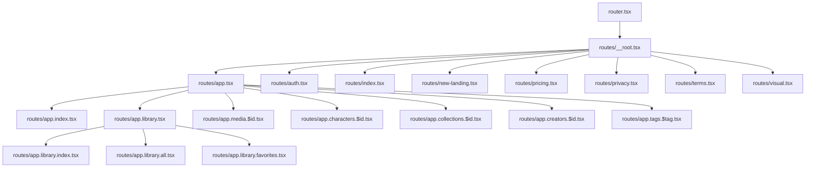
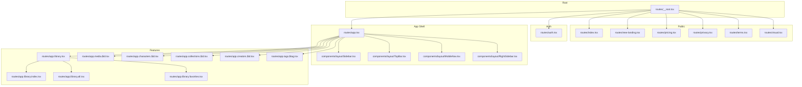
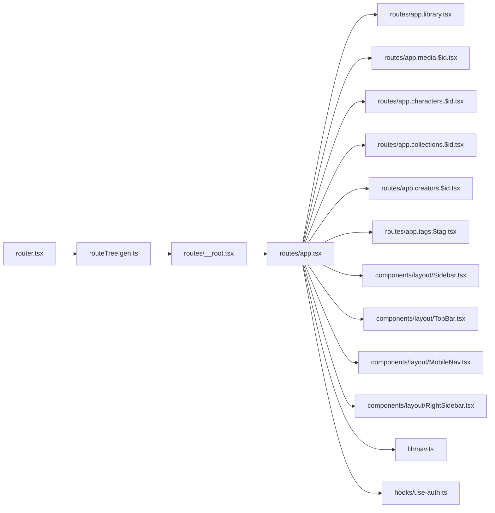
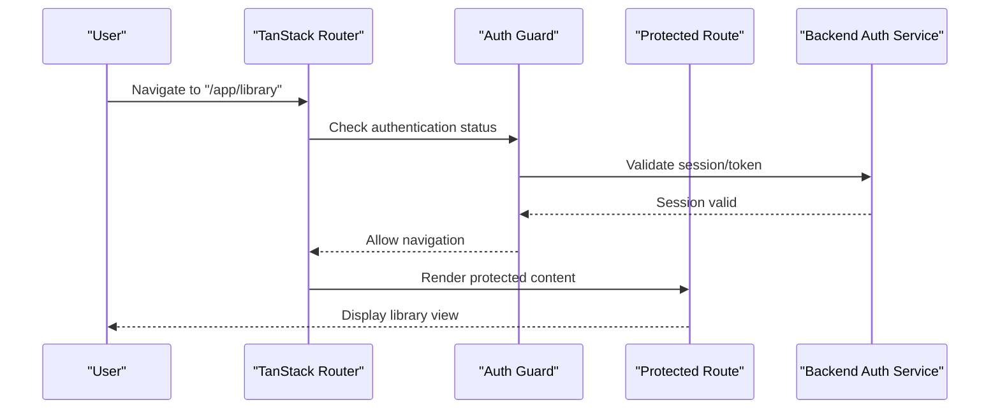
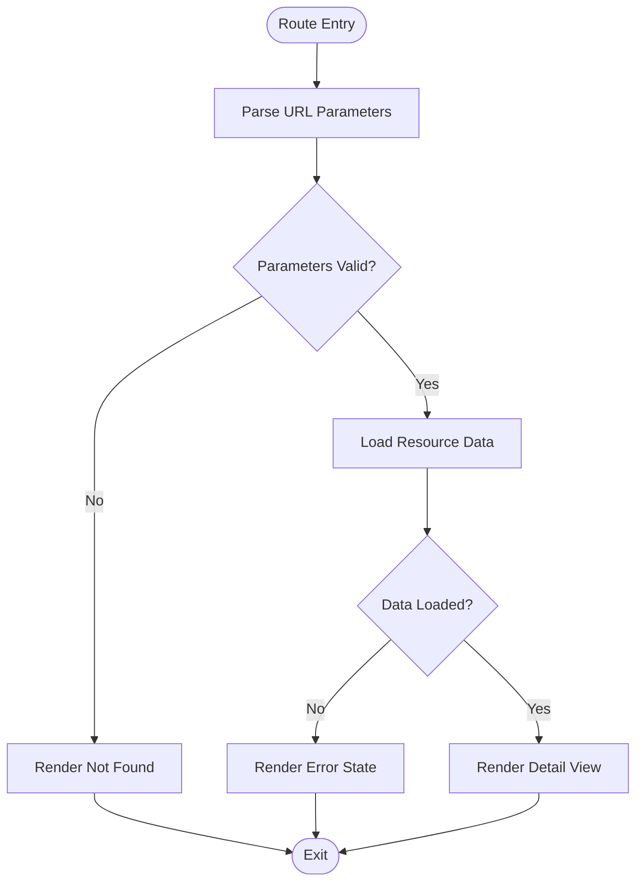

# Routing & Navigation

<cite>
**Referenced Files in This Document**
- [router.tsx](file://src/router.tsx)
- [__root.tsx](file://src/routes/__root.tsx)
- [app.tsx](file://src/routes/app.tsx)
- [auth.tsx](file://src/routes/auth.tsx)
- [index.tsx](file://src/routes/index.tsx)
- [new-landing.tsx](file://src/routes/new-landing.tsx)
- [pricing.tsx](file://src/routes/pricing.tsx)
- [privacy.tsx](file://src/routes/privacy.tsx)
- [terms.tsx](file://src/routes/terms.tsx)
- [visual.tsx](file://src/routes/visual.tsx)
- [app.index.tsx](file://src/routes/app.index.tsx)
- [app.library.tsx](file://src/routes/app.library.tsx)
- [app.library.index.tsx](file://src/routes/app.library.index.tsx)
- [app.library.all.tsx](file://src/routes/app.library.all.tsx)
- [app.library.favorites.tsx](file://src/routes/app.library.favorites.tsx)
- [app.media.$id.tsx](file://src/routes/app.media.$id.tsx)
- [app.characters.$id.tsx](file://src/routes/app.characters.$id.tsx)
- [app.collections.$id.tsx](file://src/routes/app.collections.$id.tsx)
- [app.creators.$id.tsx](file://src/routes/app.creators.$id.tsx)
- [app.tags.$tag.tsx](file://src/routes/app.tags.$tag.tsx)
- [routeTree.gen.ts](file://src/routeTree.gen.ts)
- [AppShell.tsx](file://src/components/layout/AppShell.tsx)
- [Sidebar.tsx](file://src/components/layout/Sidebar.tsx)
- [MobileNav.tsx](file://src/components/layout/MobileNav.tsx)
- [TopBar.tsx](file://src/components/layout/TopBar.tsx)
- [RightSidebar.tsx](file://src/components/layout/RightSidebar.tsx)
- [nav.ts](file://src/lib/nav.ts)
- [use-auth.ts](file://src/hooks/use-auth.ts)
- [Breadcrumb.tsx](file://src/components/ui/breadcrumb.tsx)
</cite>

## Table of Contents
1. [Introduction](#introduction)
2. [Project Structure](#project-structure)
3. [Core Components](#core-components)
4. [Architecture Overview](#architecture-overview)
5. [Detailed Component Analysis](#detailed-component-analysis)
6. [Dependency Analysis](#dependency-analysis)
7. [Performance Considerations](#performance-considerations)
8. [Troubleshooting Guide](#troubleshooting-guide)
9. [Conclusion](#conclusion)
10. [Appendices](#appendices)

## Introduction
This document explains the routing and navigation system built with TanStack Router. It covers route configuration, nested routes, dynamic parameters, protected routes with authentication guards and role-based access control, navigation patterns (including programmatic navigation and transitions), lazy loading and code splitting strategies, layout composition, sidebar and mobile-responsive navigation, route guards, breadcrumbs, and deep linking support. The goal is to provide both a high-level understanding and actionable guidance for developers working on the application’s frontend routing layer.

## Project Structure
The routing implementation follows TanStack Router’s file-based conventions under src/routes, with a central router configuration and generated route tree. Layouts are composed via dedicated route files that wrap feature routes. Shared UI components handle shell layouts, sidebars, and responsive navigation.

**Diagram sources**
- [router.tsx](file://src/router.tsx)
- [__root.tsx](file://src/routes/__root.tsx)
- [app.tsx](file://src/routes/app.tsx)
- [app.index.tsx](file://src/routes/app.index.tsx)
- [app.library.tsx](file://src/routes/app.library.tsx)
- [app.library.index.tsx](file://src/routes/app.library.index.tsx)
- [app.library.all.tsx](file://src/routes/app.library.all.tsx)
- [app.library.favorites.tsx](file://src/routes/app.library.favorites.tsx)
- [app.media.$id.tsx](file://src/routes/app.media.$id.tsx)
- [app.characters.$id.tsx](file://src/routes/app.characters.$id.tsx)
- [app.collections.$id.tsx](file://src/routes/app.collections.$id.tsx)
- [app.creators.$id.tsx](file://src/routes/app.creators.$id.tsx)
- [app.tags.$tag.tsx](file://src/routes/app.tags.$tag.tsx)
- [auth.tsx](file://src/routes/auth.tsx)
- [index.tsx](file://src/routes/index.tsx)
- [new-landing.tsx](file://src/routes/new-landing.tsx)
- [pricing.tsx](file://src/routes/pricing.tsx)
- [privacy.tsx](file://src/routes/privacy.tsx)
- [terms.tsx](file://src/routes/terms.tsx)
- [visual.tsx](file://src/routes/visual.tsx)

**Section sources**
- [router.tsx](file://src/router.tsx)
- [routeTree.gen.ts](file://src/routeTree.gen.ts)

## Core Components
- Router configuration: Centralized setup for TanStack Router including history mode, base path, and default options.
- Root layout: Global providers, error boundaries, and shared UI scaffolding.
- App layout: Authenticated shell with persistent navigation elements (sidebar, top bar).
- Feature routes: Organized by domain (library, media, characters, collections, creators, tags).
- Public routes: Landing, pricing, privacy, terms, and visual pages.
- Authentication routes: Login, forgot password, callback handling.

Key responsibilities:
- Define route hierarchy and nesting.
- Compose layouts and shared UI.
- Provide data loaders and action handlers per route.
- Integrate guards and redirects for protected areas.
- Enable deep linking and programmatic navigation.

**Section sources**
- [router.tsx](file://src/router.tsx)
- [__root.tsx](file://src/routes/__root.tsx)
- [app.tsx](file://src/routes/app.tsx)
- [auth.tsx](file://src/routes/auth.tsx)
- [index.tsx](file://src/routes/index.tsx)
- [new-landing.tsx](file://src/routes/new-landing.tsx)
- [pricing.tsx](file://src/routes/pricing.tsx)
- [privacy.tsx](file://src/routes/privacy.tsx)
- [terms.tsx](file://src/routes/terms.tsx)
- [visual.tsx](file://src/routes/visual.tsx)

## Architecture Overview
The routing architecture centers around a root route that composes global providers and error handling. The authenticated app route wraps feature modules with a consistent shell. Public and auth routes sit alongside the app route at the root level. Dynamic segments enable parameterized URLs for resources like media, characters, collections, creators, and tags.

**Diagram sources**
- [__root.tsx](file://src/routes/__root.tsx)
- [app.tsx](file://src/routes/app.tsx)
- [Sidebar.tsx](file://src/components/layout/Sidebar.tsx)
- [TopBar.tsx](file://src/components/layout/TopBar.tsx)
- [MobileNav.tsx](file://src/components/layout/MobileNav.tsx)
- [RightSidebar.tsx](file://src/components/layout/RightSidebar.tsx)
- [app.library.tsx](file://src/routes/app.library.tsx)
- [app.library.index.tsx](file://src/routes/app.library.index.tsx)
- [app.library.all.tsx](file://src/routes/app.library.all.tsx)
- [app.library.favorites.tsx](file://src/routes/app.library.favorites.tsx)
- [app.media.$id.tsx](file://src/routes/app.media.$id.tsx)
- [app.characters.$id.tsx](file://src/routes/app.characters.$id.tsx)
- [app.collections.$id.tsx](file://src/routes/app.collections.$id.tsx)
- [app.creators.$id.tsx](file://src/routes/app.creators.$id.tsx)
- [app.tags.$tag.tsx](file://src/routes/app.tags.$tag.tsx)

## Detailed Component Analysis

### Router Configuration and Route Tree
- Central router initialization defines history strategy, base URL, and default settings.
- Generated route tree provides type-safe route definitions and automatic imports.
- Route metadata can be used for breadcrumbs, titles, and permissions.

Implementation highlights:
- History mode selection (browser vs memory) based on environment.
- Base path configuration for deployment contexts.
- Default error component and not-found handling.

**Section sources**
- [router.tsx](file://src/router.tsx)
- [routeTree.gen.ts](file://src/routeTree.gen.ts)

### Root Layout (__root.tsx)
- Provides global context providers (e.g., theme, analytics, auth state).
- Wraps all routes with error boundary and fallback UI.
- Sets up document head management and SEO metadata.

Best practices:
- Keep providers minimal and efficient.
- Use suspense boundaries for async data where appropriate.
- Centralize global error handling here.

**Section sources**
- [__root.tsx](file://src/routes/__root.tsx)

### App Layout (app.tsx)
- Renders the authenticated shell with persistent navigation.
- Integrates Sidebar, TopBar, MobileNav, and RightSidebar.
- Handles responsive behavior and mobile menu toggling.

Navigation integration:
- Uses TanStack Router hooks for active states and link generation.
- Supports keyboard shortcuts and accessibility features.

**Section sources**
- [app.tsx](file://src/routes/app.tsx)
- [AppShell.tsx](file://src/components/layout/AppShell.tsx)
- [Sidebar.tsx](file://src/components/layout/Sidebar.tsx)
- [TopBar.tsx](file://src/components/layout/TopBar.tsx)
- [MobileNav.tsx](file://src/components/layout/MobileNav.tsx)
- [RightSidebar.tsx](file://src/components/layout/RightSidebar.tsx)

### Public Routes
- index.tsx serves as the landing entry point.
- new-landing.tsx, pricing.tsx, privacy.tsx, terms.tsx, and visual.tsx are public-facing pages.
- These routes do not require authentication and typically render marketing or informational content.

SEO considerations:
- Set page titles and meta descriptions.
- Ensure proper canonical links and social sharing metadata.

**Section sources**
- [index.tsx](file://src/routes/index.tsx)
- [new-landing.tsx](file://src/routes/new-landing.tsx)
- [pricing.tsx](file://src/routes/pricing.tsx)
- [privacy.tsx](file://src/routes/privacy.tsx)
- [terms.tsx](file://src/routes/terms.tsx)
- [visual.tsx](file://src/routes/visual.tsx)

### Authentication Routes (auth.tsx)
- Handles login, forgot password, and callback flows.
- Redirects unauthenticated users to login when accessing protected routes.
- Integrates with backend auth endpoints and token storage.

Security notes:
- Avoid storing sensitive tokens in localStorage; prefer httpOnly cookies where possible.
- Implement CSRF protection if using cookie-based sessions.

**Section sources**
- [auth.tsx](file://src/routes/auth.tsx)

### Nested Routing Patterns
- Library module demonstrates nested routes:
  - app.library.tsx acts as the parent layout.
  - app.library.index.tsx shows the default view.
  - app.library.all.tsx and app.library.favorites.tsx are child views.
- This pattern enables shared headers, filters, and toolbars across library views.

Benefits:
- Reusable layout and state management within the module.
- Clear URL structure reflecting feature hierarchy.

**Section sources**
- [app.library.tsx](file://src/routes/app.library.tsx)
- [app.library.index.tsx](file://src/routes/app.library.index.tsx)
- [app.library.all.tsx](file://src/routes/app.library.all.tsx)
- [app.library.favorites.tsx](file://src/routes/app.library.favorites.tsx)

### Dynamic Route Parameters
- Media detail: app.media.$id.tsx uses $id to capture resource identifiers.
- Characters, collections, creators, and tags follow similar patterns with $id or $tag segments.
- Parameter validation and error handling should be implemented in route loaders/actions.

Usage tips:
- Validate IDs before fetching data.
- Provide meaningful not-found states for invalid parameters.

**Section sources**
- [app.media.$id.tsx](file://src/routes/app.media.$id.tsx)
- [app.characters.$id.tsx](file://src/routes/app.characters.$id.tsx)
- [app.collections.$id.tsx](file://src/routes/app.collections.$id.tsx)
- [app.creators.$id.tsx](file://src/routes/app.creators.$id.tsx)
- [app.tags.$tag.tsx](file://src/routes/app.tags.$tag.tsx)

### Protected Routes and Role-Based Access Control
- Authentication guard checks user session and redirects to login if needed.
- Role-based access control enforces permissions for specific routes or actions.
- Integration with use-auth.ts hook ensures consistent auth state across components.

Implementation approach:
- Wrap protected routes with a guard component or loader.
- Use route metadata to define required roles and check against user profile.

**Section sources**
- [app.tsx](file://src/routes/app.tsx)
- [auth.tsx](file://src/routes/auth.tsx)
- [use-auth.ts](file://src/hooks/use-auth.ts)

### Navigation Patterns and Programmatic Navigation
- Declarative navigation via Link components for static paths.
- Programmatic navigation using navigate() from TanStack Router for dynamic flows.
- Route transitions can be customized with animations or loading indicators.

Best practices:
- Preserve scroll position when navigating back.
- Debounce rapid navigation to prevent race conditions.

**Section sources**
- [nav.ts](file://src/lib/nav.ts)

### Lazy Loading and Code Splitting
- TanStack Router supports route-level code splitting out of the box.
- Each route file is loaded on demand, reducing initial bundle size.
- Combine with React.lazy and Suspense for component-level splitting within routes.

Optimization strategies:
- Preload critical routes (e.g., dashboard, library) after initial load.
- Use prefetching on hover or idle time for frequently accessed routes.

**Section sources**
- [routeTree.gen.ts](file://src/routeTree.gen.ts)

### Layout Components and Responsive Navigation
- AppShell coordinates layout regions and responsive breakpoints.
- Sidebar provides desktop navigation; MobileNav adapts to smaller screens.
- TopBar displays contextual actions and search; RightSidebar offers auxiliary information.

Responsive considerations:
- Collapse sidebar on mobile and replace with drawer-style navigation.
- Ensure touch-friendly targets and accessible menus.

**Section sources**
- [AppShell.tsx](file://src/components/layout/AppShell.tsx)
- [Sidebar.tsx](file://src/components/layout/Sidebar.tsx)
- [MobileNav.tsx](file://src/components/layout/MobileNav.tsx)
- [TopBar.tsx](file://src/components/layout/TopBar.tsx)
- [RightSidebar.tsx](file://src/components/layout/RightSidebar.tsx)

### Route Guards, Breadcrumbs, and Deep Linking
- Route guards enforce authentication and authorization checks.
- Breadcrumbs are derived from route metadata and rendered via breadcrumb components.
- Deep linking is supported through URL-based navigation and state persistence.

Breadcrumbs implementation:
- Generate breadcrumb items from route hierarchy.
- Allow customization per route for better UX.

Deep linking:
- Ensure all navigable states are representable via URLs.
- Handle query parameters and hash fragments appropriately.

**Section sources**
- [Breadcrumb.tsx](file://src/components/ui/breadcrumb.tsx)

## Dependency Analysis
The routing layer depends on several core modules and utilities:

**Diagram sources**
- [router.tsx](file://src/router.tsx)
- [routeTree.gen.ts](file://src/routeTree.gen.ts)
- [__root.tsx](file://src/routes/__root.tsx)
- [app.tsx](file://src/routes/app.tsx)
- [app.library.tsx](file://src/routes/app.library.tsx)
- [app.media.$id.tsx](file://src/routes/app.media.$id.tsx)
- [app.characters.$id.tsx](file://src/routes/app.characters.$id.tsx)
- [app.collections.$id.tsx](file://src/routes/app.collections.$id.tsx)
- [app.creators.$id.tsx](file://src/routes/app.creators.$id.tsx)
- [app.tags.$tag.tsx](file://src/routes/app.tags.$tag.tsx)
- [Sidebar.tsx](file://src/components/layout/Sidebar.tsx)
- [TopBar.tsx](file://src/components/layout/TopBar.tsx)
- [MobileNav.tsx](file://src/components/layout/MobileNav.tsx)
- [RightSidebar.tsx](file://src/components/layout/RightSidebar.tsx)
- [nav.ts](file://src/lib/nav.ts)
- [use-auth.ts](file://src/hooks/use-auth.ts)

**Section sources**
- [router.tsx](file://src/router.tsx)
- [routeTree.gen.ts](file://src/routeTree.gen.ts)
- [__root.tsx](file://src/routes/__root.tsx)
- [app.tsx](file://src/routes/app.tsx)

## Performance Considerations
- Leverage TanStack Router’s built-in code splitting to minimize initial bundle size.
- Prefetch critical routes during idle time or on hover to improve perceived performance.
- Use React.Suspense for loading states in async route loaders.
- Optimize images and assets within route components to reduce payload.
- Monitor bundle sizes and route dependencies using build tools.

[No sources needed since this section provides general guidance]

## Troubleshooting Guide
Common issues and resolutions:
- 404 errors for valid routes: Verify route file naming and path segments match expected patterns.
- Authentication redirects loops: Ensure guard logic correctly checks session state and handles callbacks.
- Broken deep links: Confirm URL encoding and parameter parsing in route loaders.
- Slow route transitions: Investigate heavy computations in loaders and consider memoization.

Debugging tips:
- Use browser dev tools to inspect network requests and route changes.
- Log route transitions and loader execution times.
- Validate route metadata for breadcrumbs and permissions.

**Section sources**
- [router.tsx](file://src/router.tsx)
- [__root.tsx](file://src/routes/__root.tsx)
- [app.tsx](file://src/routes/app.tsx)

## Conclusion
The routing system leverages TanStack Router’s file-based conventions and powerful features to deliver a scalable, maintainable, and performant navigation experience. By organizing routes into logical modules, implementing robust guards, and optimizing for code splitting and deep linking, the application provides a seamless user experience across devices and use cases. Continued attention to performance, accessibility, and security will further enhance the routing layer.

[No sources needed since this section summarizes without analyzing specific files]

## Appendices

### Sequence Diagram: Protected Route Access Flow

**Diagram sources**
- [router.tsx](file://src/router.tsx)
- [app.tsx](file://src/routes/app.tsx)
- [auth.tsx](file://src/routes/auth.tsx)
- [use-auth.ts](file://src/hooks/use-auth.ts)

### Flowchart: Dynamic Route Parameter Handling

**Diagram sources**
- [app.media.$id.tsx](file://src/routes/app.media.$id.tsx)
- [app.characters.$id.tsx](file://src/routes/app.characters.$id.tsx)
- [app.collections.$id.tsx](file://src/routes/app.collections.$id.tsx)
- [app.creators.$id.tsx](file://src/routes/app.creators.$id.tsx)
- [app.tags.$tag.tsx](file://src/routes/app.tags.$tag.tsx)