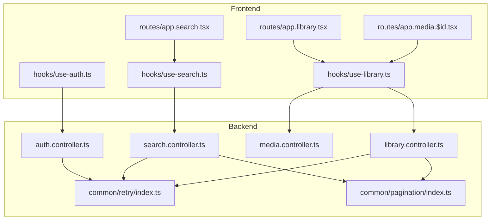
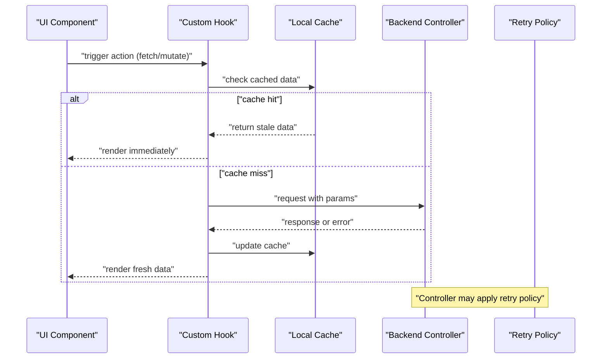
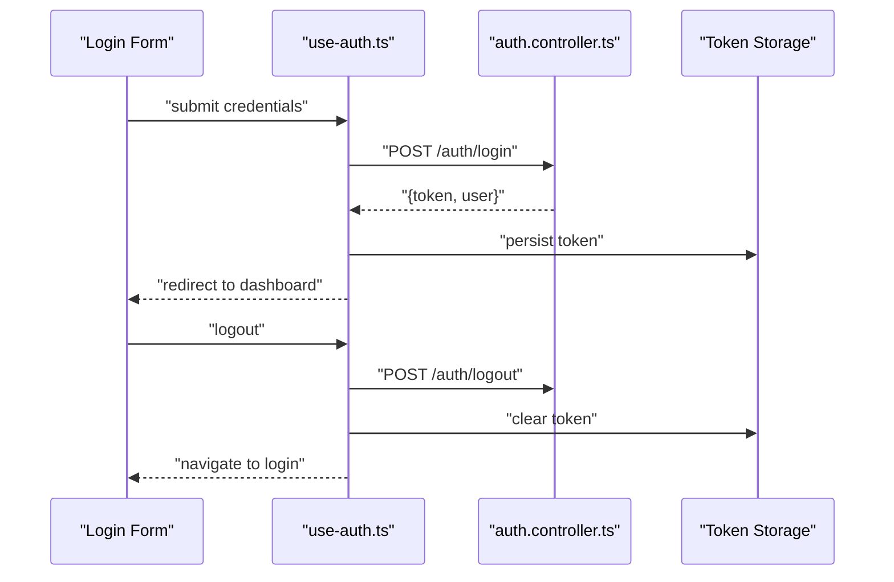
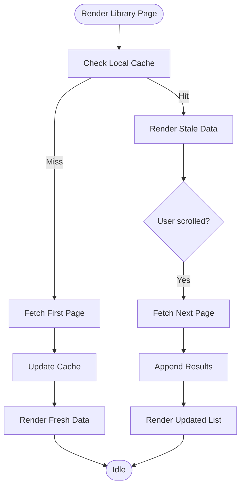
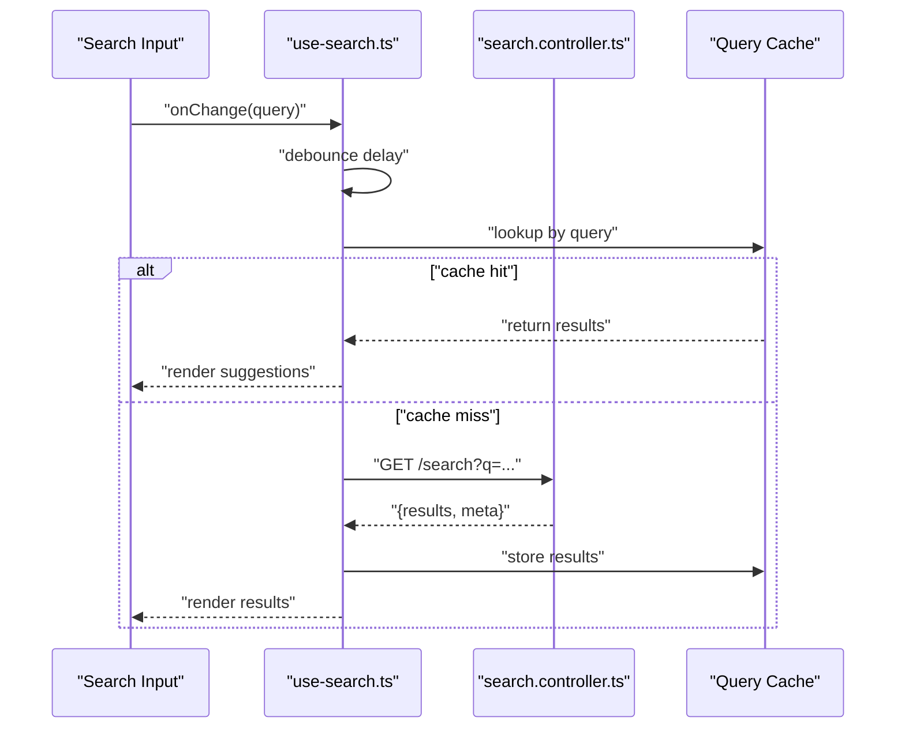
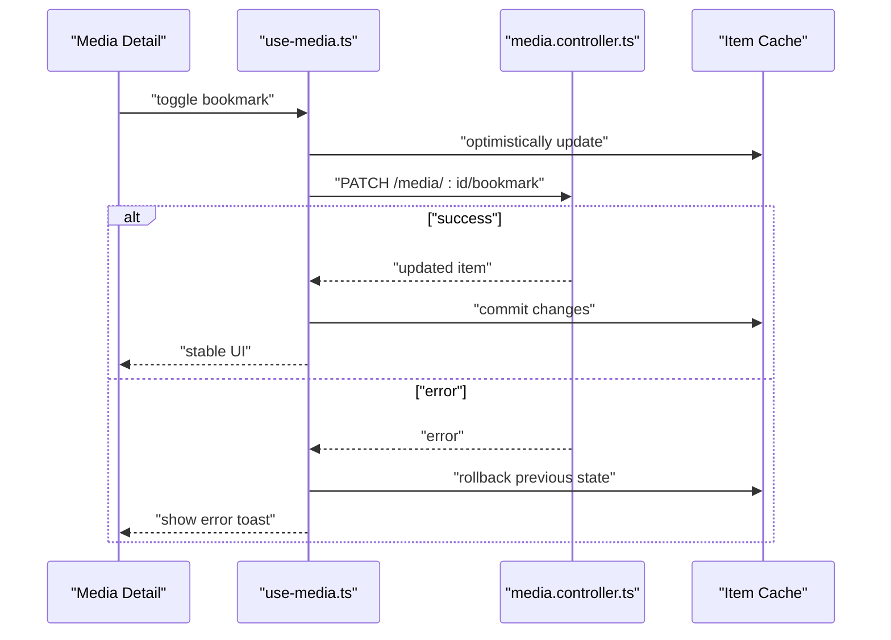
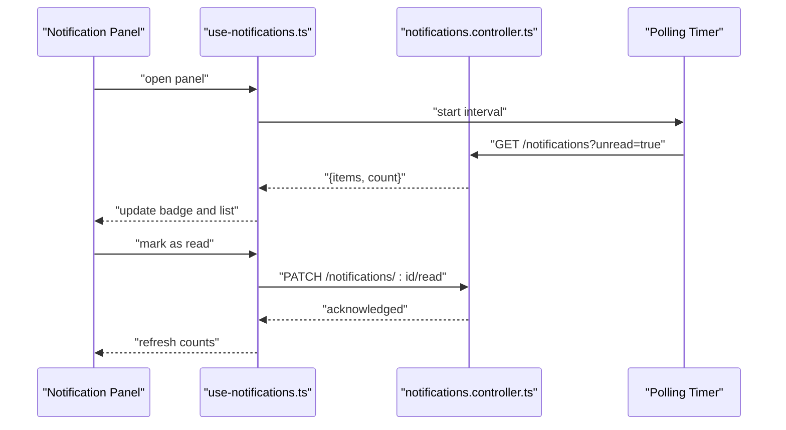
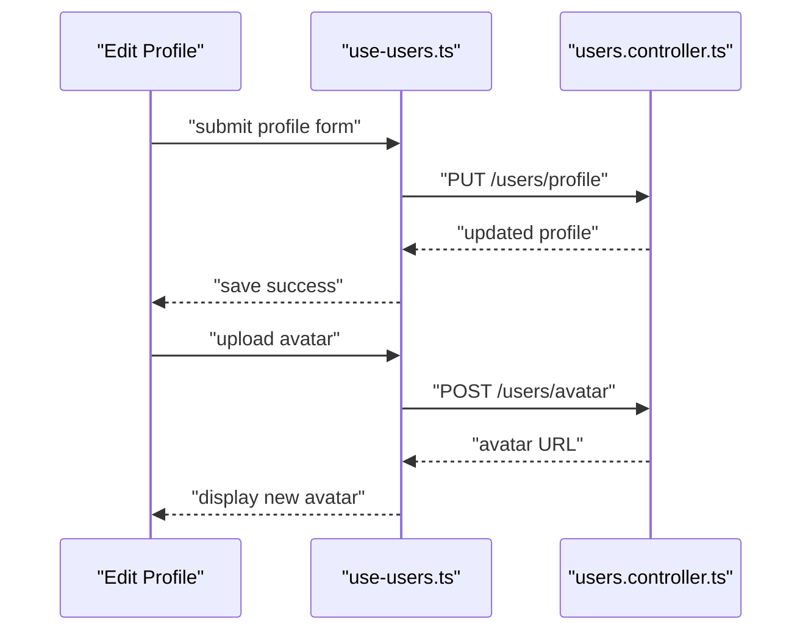
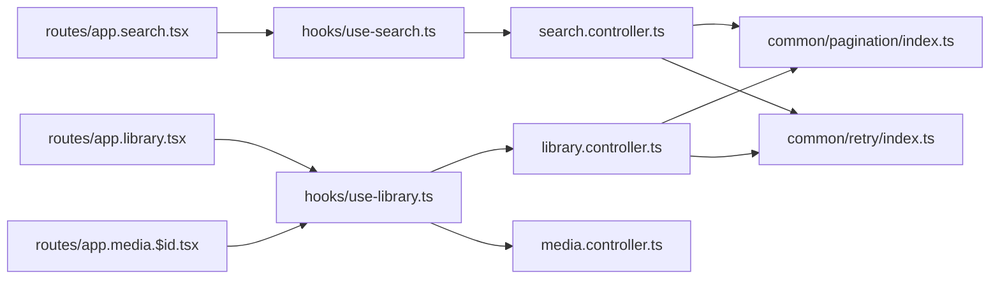

# API State Management

<cite>
**Referenced Files in This Document**
- [use-auth.ts](file://src/hooks/use-auth.ts)
- [use-collections.ts](file://src/hooks/use-collections.ts)
- [use-journal.ts](file://src/hooks/use-journal.ts)
- [use-library.ts](file://src/hooks/use-library.ts)
- [use-media.ts](file://src/hooks/use-media.ts)
- [use-notifications.ts](file://src/hooks/use-notifications.ts)
- [use-search.ts](file://src/hooks/use-search.ts)
- [use-users.ts](file://src/hooks/use-users.ts)
- [app.search.tsx](file://src/routes/app.search.tsx)
- [app.library.tsx](file://src/routes/app.library.tsx)
- [app.media.$id.tsx](file://src/routes/app.media.$id.tsx)
- [auth.controller.ts](file://apps/backend/src/auth/auth.controller.ts)
- [collections.controller.ts](file://apps/backend/src/collections/collections.controller.ts)
- [journal.controller.ts](file://apps/backend/src/journal/journal.controller.ts)
- [library.controller.ts](file://apps/backend/src/library/library.controller.ts)
- [media.controller.ts](file://apps/backend/src/media/media.controller.ts)
- [notifications.controller.ts](file://apps/backend/src/notifications/notifications.controller.ts)
- [search.controller.ts](file://apps/backend/src/search/search.controller.ts)
- [users.controller.ts](file://apps/backend/src/users/users.controller.ts)
- [pagination/index.ts](file://apps/backend/src/common/pagination/index.ts)
- [retry/index.ts](file://apps/backend/src/common/retry/index.ts)
</cite>

## Table of Contents
1. [Introduction](#introduction)
2. [Project Structure](#project-structure)
3. [Core Components](#core-components)
4. [Architecture Overview](#architecture-overview)
5. [Detailed Component Analysis](#detailed-component-analysis)
6. [Dependency Analysis](#dependency-analysis)
7. [Performance Considerations](#performance-considerations)
8. [Troubleshooting Guide](#troubleshooting-guide)
9. [Conclusion](#conclusion)
10. [Appendices](#appendices)

## Introduction
This document explains how the application manages API state across the frontend and backend. It covers data fetching strategies, caching, optimistic updates, error handling, loading states, retry logic, pagination, search query state, custom hooks for API calls, request cancellation, background synchronization, and performance optimizations such as debouncing, throttling, and selective re-rendering. The goal is to provide a clear mental model for both developers and non-technical readers.

## Project Structure
The application follows a feature-based organization:
- Frontend hooks encapsulate API interactions and local state (e.g., use-auth, use-library, use-search).
- Routes consume these hooks to render UI and manage user interactions.
- Backend controllers expose REST endpoints that return structured responses, often with pagination and standardized error shapes.
- Shared utilities include pagination helpers and retry mechanisms.

**Diagram sources**
- [use-auth.ts](file://src/hooks/use-auth.ts)
- [use-library.ts](file://src/hooks/use-library.ts)
- [use-search.ts](file://src/hooks/use-search.ts)
- [app.search.tsx](file://src/routes/app.search.tsx)
- [app.library.tsx](file://src/routes/app.library.tsx)
- [app.media.$id.tsx](file://src/routes/app.media.$id.tsx)
- [auth.controller.ts](file://apps/backend/src/auth/auth.controller.ts)
- [library.controller.ts](file://apps/backend/src/library/library.controller.ts)
- [search.controller.ts](file://apps/backend/src/search/search.controller.ts)
- [media.controller.ts](file://apps/backend/src/media/media.controller.ts)
- [pagination/index.ts](file://apps/backend/src/common/pagination/index.ts)
- [retry/index.ts](file://apps/backend/src/common/retry/index.ts)

**Section sources**
- [use-auth.ts](file://src/hooks/use-auth.ts)
- [use-library.ts](file://src/hooks/use-library.ts)
- [use-search.ts](file://src/hooks/use-search.ts)
- [app.search.tsx](file://src/routes/app.search.tsx)
- [app.library.tsx](file://src/routes/app.library.tsx)
- [app.media.$id.tsx](file://src/routes/app.media.$id.tsx)
- [auth.controller.ts](file://apps/backend/src/auth/auth.controller.ts)
- [library.controller.ts](file://apps/backend/src/library/library.controller.ts)
- [search.controller.ts](file://apps/backend/src/search/search.controller.ts)
- [media.controller.ts](file://apps/backend/src/media/media.controller.ts)
- [pagination/index.ts](file://apps/backend/src/common/pagination/index.ts)
- [retry/index.ts](file://apps/backend/src/common/retry/index.ts)

## Core Components
Key frontend hooks implement consistent patterns for API state management:
- Data fetching lifecycle: pending, success, error, and optional stale data.
- Pagination state: current page, total items, hasNextPage, and fetchNextPage callbacks.
- Search state: query string, filters, debounce behavior, and result caching.
- Mutations: create/update/delete with optimistic updates and rollback on failure.
- Background sync: periodic or event-driven refreshes without blocking UI.
- Request cancellation: abort in-flight requests when dependencies change or component unmounts.
- Error handling: normalized errors, user-friendly messages, and retry options.

Examples of hook responsibilities:
- Authentication: login/logout flows, token storage, session validation, and error boundaries.
- Library: paginated media lists, filtering, sorting, and item detail retrieval.
- Search: query debouncing, suggestion caching, and result pagination.
- Notifications: real-time updates via polling or events, read/unread toggles.
- Users: profile CRUD operations, avatar uploads, and preference sync.

**Section sources**
- [use-auth.ts](file://src/hooks/use-auth.ts)
- [use-library.ts](file://src/hooks/use-library.ts)
- [use-search.ts](file://src/hooks/use-search.ts)
- [use-notifications.ts](file://src/hooks/use-notifications.ts)
- [use-users.ts](file://src/hooks/use-users.ts)

## Architecture Overview
The system uses a layered architecture:
- UI components call hooks to perform actions and observe state.
- Hooks coordinate network requests, cache reads/writes, and manage local state.
- Controllers handle business logic, validate inputs, apply pagination, and return consistent payloads.
- Shared modules standardize pagination and retry policies.

**Diagram sources**
- [use-library.ts](file://src/hooks/use-library.ts)
- [use-search.ts](file://src/hooks/use-search.ts)
- [library.controller.ts](file://apps/backend/src/library/library.controller.ts)
- [search.controller.ts](file://apps/backend/src/search/search.controller.ts)
- [pagination/index.ts](file://apps/backend/src/common/pagination/index.ts)
- [retry/index.ts](file://apps/backend/src/common/retry/index.ts)

## Detailed Component Analysis

### Authentication Flow
Authentication involves login, logout, and session validation. The hook manages tokens, handles errors, and provides loading states. Optimistic updates are minimal here; instead, immediate UI transitions occur after successful server responses.

**Diagram sources**
- [use-auth.ts](file://src/hooks/use-auth.ts)
- [auth.controller.ts](file://apps/backend/src/auth/auth.controller.ts)

**Section sources**
- [use-auth.ts](file://src/hooks/use-auth.ts)
- [auth.controller.ts](file://apps/backend/src/auth/auth.controller.ts)

### Library Data Fetching and Pagination
Library pages display paginated media with filters and sorting. The hook maintains pagination state, fetches data on demand, and supports infinite scrolling.

**Diagram sources**
- [use-library.ts](file://src/hooks/use-library.ts)
- [library.controller.ts](file://apps/backend/src/library/library.controller.ts)
- [pagination/index.ts](file://apps/backend/src/common/pagination/index.ts)

**Section sources**
- [use-library.ts](file://src/hooks/use-library.ts)
- [library.controller.ts](file://apps/backend/src/library/library.controller.ts)
- [pagination/index.ts](file://apps/backend/src/common/pagination/index.ts)

### Search Query State and Debouncing
Search implements debounced queries to reduce network load. The hook tracks query state, filters, and caches results per query key.

**Diagram sources**
- [use-search.ts](file://src/hooks/use-search.ts)
- [search.controller.ts](file://apps/backend/src/search/search.controller.ts)

**Section sources**
- [use-search.ts](file://src/hooks/use-search.ts)
- [search.controller.ts](file://apps/backend/src/search/search.controller.ts)

### Media Detail and Optimistic Updates
Media detail pages support actions like bookmarking or rating. Optimistic updates update UI immediately and roll back on error.

**Diagram sources**
- [use-media.ts](file://src/hooks/use-media.ts)
- [media.controller.ts](file://apps/backend/src/media/media.controller.ts)

**Section sources**
- [use-media.ts](file://src/hooks/use-media.ts)
- [media.controller.ts](file://apps/backend/src/media/media.controller.ts)

### Notifications Background Sync
Notifications use polling or event-driven updates to keep the UI current without blocking user actions.

**Diagram sources**
- [use-notifications.ts](file://src/hooks/use-notifications.ts)
- [notifications.controller.ts](file://apps/backend/src/notifications/notifications.controller.ts)

**Section sources**
- [use-notifications.ts](file://src/hooks/use-notifications.ts)
- [notifications.controller.ts](file://apps/backend/src/notifications/notifications.controller.ts)

### User Profile Mutations
Profile mutations include updating preferences and uploading avatars. The hook validates inputs, shows loading states, and handles errors gracefully.

**Diagram sources**
- [use-users.ts](file://src/hooks/use-users.ts)
- [users.controller.ts](file://apps/backend/src/users/users.controller.ts)

**Section sources**
- [use-users.ts](file://src/hooks/use-users.ts)
- [users.controller.ts](file://apps/backend/src/users/users.controller.ts)

## Dependency Analysis
Hooks depend on backend controllers for data and shared utilities for pagination and retry policies. Routes compose multiple hooks to build complex screens.

**Diagram sources**
- [app.search.tsx](file://src/routes/app.search.tsx)
- [app.library.tsx](file://src/routes/app.library.tsx)
- [app.media.$id.tsx](file://src/routes/app.media.$id.tsx)
- [use-search.ts](file://src/hooks/use-search.ts)
- [use-library.ts](file://src/hooks/use-library.ts)
- [search.controller.ts](file://apps/backend/src/search/search.controller.ts)
- [library.controller.ts](file://apps/backend/src/library/library.controller.ts)
- [media.controller.ts](file://apps/backend/src/media/media.controller.ts)
- [pagination/index.ts](file://apps/backend/src/common/pagination/index.ts)
- [retry/index.ts](file://apps/backend/src/common/retry/index.ts)

**Section sources**
- [app.search.tsx](file://src/routes/app.search.tsx)
- [app.library.tsx](file://src/routes/app.library.tsx)
- [app.media.$id.tsx](file://src/routes/app.media.$id.tsx)
- [use-search.ts](file://src/hooks/use-search.ts)
- [use-library.ts](file://src/hooks/use-library.ts)
- [search.controller.ts](file://apps/backend/src/search/search.controller.ts)
- [library.controller.ts](file://apps/backend/src/library/library.controller.ts)
- [media.controller.ts](file://apps/backend/src/media/media.controller.ts)
- [pagination/index.ts](file://apps/backend/src/common/pagination/index.ts)
- [retry/index.ts](file://apps/backend/src/common/retry/index.ts)

## Performance Considerations
- Debouncing search queries reduces unnecessary network calls during rapid typing.
- Throttling background sync intervals prevents excessive polling.
- Selective re-rendering leverages memoization and stable references to avoid unnecessary updates.
- Pagination minimizes payload sizes and improves initial load times.
- Caching strategies serve stale data quickly while refreshing in the background.
- Request cancellation avoids race conditions when parameters change rapidly.

[No sources needed since this section provides general guidance]

## Troubleshooting Guide
Common issues and resolutions:
- Network errors: Ensure retry policies are configured and user feedback is provided.
- Stale data: Implement cache invalidation on mutations and route changes.
- Memory leaks: Cancel in-flight requests on unmount and clear timers.
- Pagination bugs: Validate cursor/page parameters and handle empty pages gracefully.
- Search anomalies: Normalize query strings and deduplicate results.

**Section sources**
- [retry/index.ts](file://apps/backend/src/common/retry/index.ts)
- [pagination/index.ts](file://apps/backend/src/common/pagination/index.ts)

## Conclusion
The application employs robust API state management patterns through well-structured hooks and standardized backend responses. By combining caching, pagination, debouncing, and retry policies, it delivers responsive and resilient user experiences. Consistent error handling and optimistic updates further enhance perceived performance and reliability.

[No sources needed since this section summarizes without analyzing specific files]

## Appendices
- Best practices:
  - Keep hook interfaces simple and focused on a single domain.
  - Use stable keys for cache entries to prevent accidental invalidations.
  - Provide clear loading and error states for all asynchronous operations.
  - Test edge cases like network failures, empty responses, and rapid input changes.

[No sources needed since this section provides general guidance]