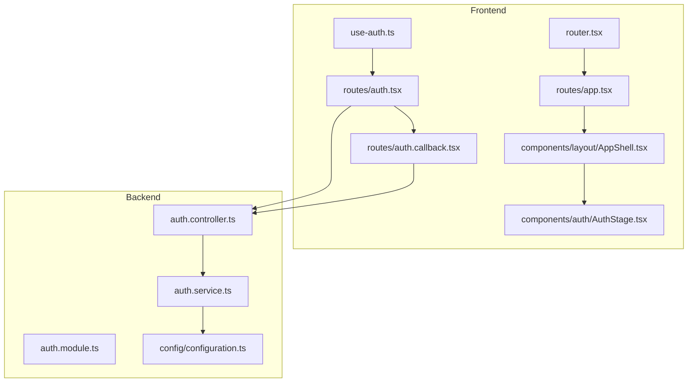
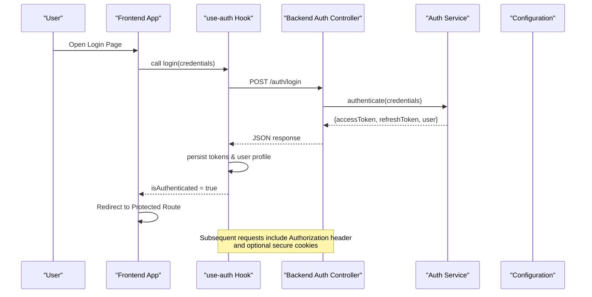
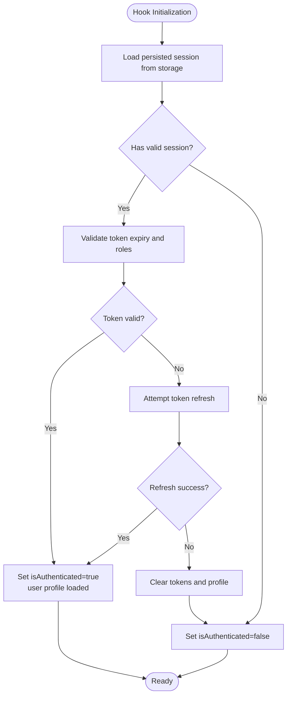
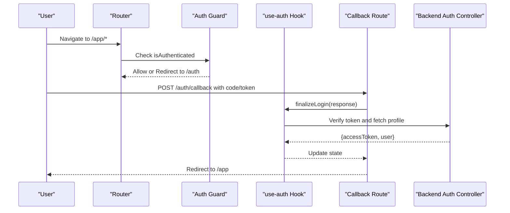
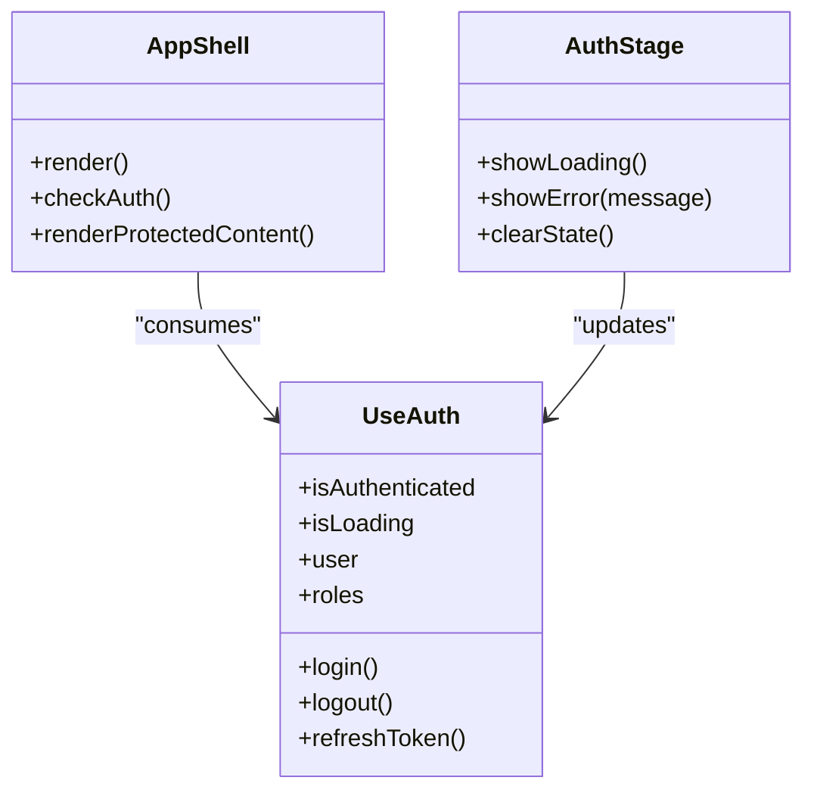
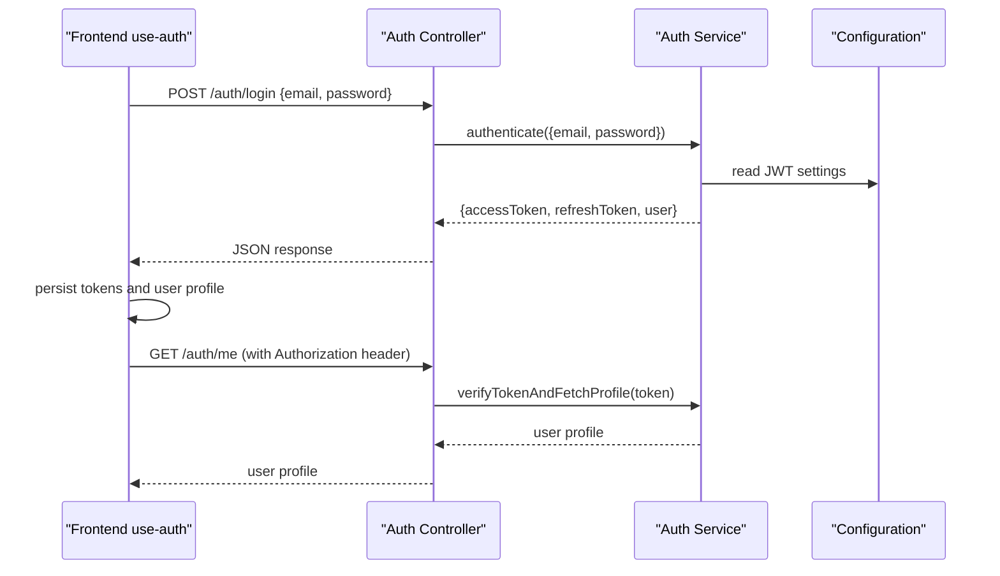
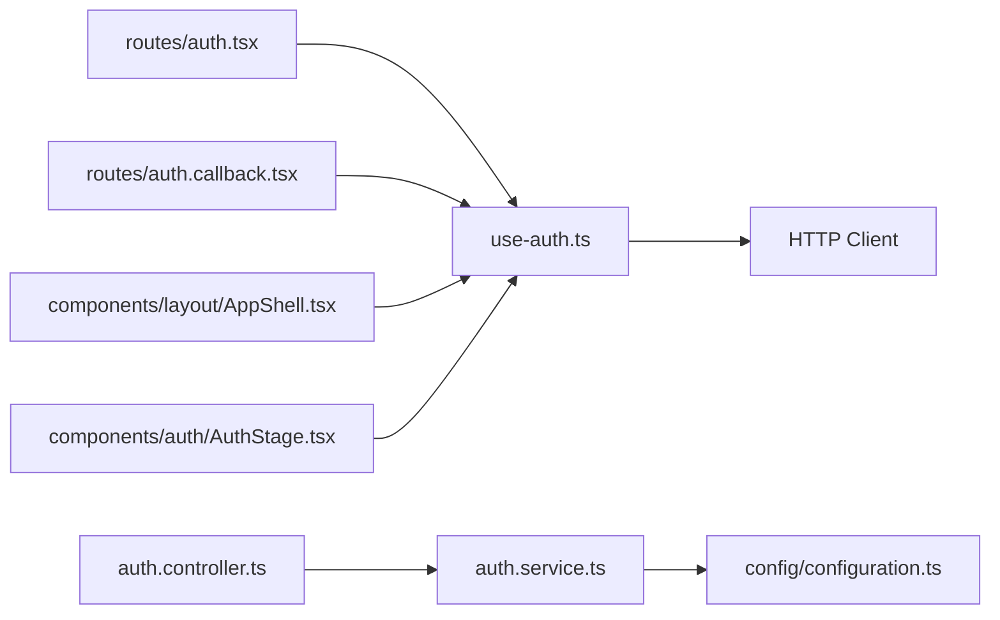

# Authentication State Management

<cite>
**Referenced Files in This Document**
- [use-auth.ts](file://src/hooks/use-auth.ts)
- [auth.tsx](file://src/routes/auth.tsx)
- [auth.callback.tsx](file://src/routes/auth.callback.tsx)
- [app.tsx](file://src/routes/app.tsx)
- [router.tsx](file://src/router.tsx)
- [AuthStage.tsx](file://src/components/auth/AuthStage.tsx)
- [AppShell.tsx](file://src/components/layout/AppShell.tsx)
- [auth.controller.ts](file://apps/backend/src/auth/auth.controller.ts)
- [auth.service.ts](file://apps/backend/src/auth/auth.service.ts)
- [auth.module.ts](file://apps/backend/src/auth/auth.module.ts)
- [configuration.ts](file://apps/backend/src/config/configuration.ts)
</cite>

## Table of Contents
1. [Introduction](#introduction)
2. [Project Structure](#project-structure)
3. [Core Components](#core-components)
4. [Architecture Overview](#architecture-overview)
5. [Detailed Component Analysis](#detailed-component-analysis)
6. [Dependency Analysis](#dependency-analysis)
7. [Performance Considerations](#performance-considerations)
8. [Troubleshooting Guide](#troubleshooting-guide)
9. [Conclusion](#conclusion)

## Introduction
This document explains how authentication state is managed across the application, focusing on the use-auth hook implementation, JWT token handling, session persistence with localStorage and cookies, and user profile state synchronization. It also covers the complete authentication flow (login/logout), token refresh mechanisms, role-based access control state, error handling for failures and network issues, protected routes, conditional rendering based on auth state, and integration points with backend authentication APIs.

## Project Structure
Authentication spans both frontend and backend:
- Frontend:
  - Hook and state management: src/hooks/use-auth.ts
  - Route-level guards and callbacks: src/routes/auth.tsx, src/routes/auth.callback.tsx, src/routes/app.tsx
  - Layout and UI wrappers: src/components/layout/AppShell.tsx, src/components/auth/AuthStage.tsx
  - Router configuration: src/router.tsx
- Backend:
  - Controllers, services, and module setup: apps/backend/src/auth/*
  - Configuration: apps/backend/src/config/configuration.ts

**Diagram sources**
- [use-auth.ts](file://src/hooks/use-auth.ts)
- [auth.tsx](file://src/routes/auth.tsx)
- [auth.callback.tsx](file://src/routes/auth.callback.tsx)
- [app.tsx](file://src/routes/app.tsx)
- [router.tsx](file://src/router.tsx)
- [AppShell.tsx](file://src/components/layout/AppShell.tsx)
- [AuthStage.tsx](file://src/components/auth/AuthStage.tsx)
- [auth.controller.ts](file://apps/backend/src/auth/auth.controller.ts)
- [auth.service.ts](file://apps/backend/src/auth/auth.service.ts)
- [auth.module.ts](file://apps/backend/src/auth/auth.module.ts)
- [configuration.ts](file://apps/backend/src/config/configuration.ts)

**Section sources**
- [use-auth.ts](file://src/hooks/use-auth.ts)
- [auth.tsx](file://src/routes/auth.tsx)
- [auth.callback.tsx](file://src/routes/auth.callback.tsx)
- [app.tsx](file://src/routes/app.tsx)
- [router.tsx](file://src/router.tsx)
- [AppShell.tsx](file://src/components/layout/AppShell.tsx)
- [AuthStage.tsx](file://src/components/auth/AuthStage.tsx)
- [auth.controller.ts](file://apps/backend/src/auth/auth.controller.ts)
- [auth.service.ts](file://apps/backend/src/auth/auth.service.ts)
- [auth.module.ts](file://apps/backend/src/auth/auth.module.ts)
- [configuration.ts](file://apps/backend/src/config/configuration.ts)

## Core Components
- use-auth hook: Centralizes authentication state (isAuthenticated, isLoading, user profile, roles), exposes login/logout/refresh methods, persists tokens and session data, and synchronizes user profile across components.
- Auth route guard: Protects app routes by checking authentication state and redirecting to login when needed.
- Callback handler: Processes backend redirects or tokens after OAuth or password login flows.
- App shell and layout: Wraps authenticated content and conditionally renders navigation and features based on auth state.
- Backend auth controller/service: Handles login, logout, token issuance/validation, and user profile retrieval.

Key responsibilities:
- Token lifecycle: Store, validate, refresh, and clear tokens.
- Session persistence: Keep tokens and minimal user profile in localStorage and/or cookies.
- Role-based access control: Expose user roles and permissions for gating features.
- Error handling: Normalize network errors, token expiration, and invalid credentials.

**Section sources**
- [use-auth.ts](file://src/hooks/use-auth.ts)
- [auth.tsx](file://src/routes/auth.tsx)
- [auth.callback.tsx](file://src/routes/auth.callback.tsx)
- [AppShell.tsx](file://src/components/layout/AppShell.tsx)
- [AuthStage.tsx](file://src/components/auth/AuthStage.tsx)
- [auth.controller.ts](file://apps/backend/src/auth/auth.controller.ts)
- [auth.service.ts](file://apps/backend/src/auth/auth.service.ts)

## Architecture Overview
The authentication architecture follows a client-server model with JWT-based sessions:
- Client-side:
  - The use-auth hook manages state and persistence.
  - Route guards enforce authentication before rendering protected routes.
  - A callback route finalizes login flows initiated by the backend.
- Server-side:
  - Auth controller exposes endpoints for login, logout, and token validation.
  - Auth service handles business logic, including token generation and user profile resolution.
  - Configuration centralizes JWT settings and cookie policies.

**Diagram sources**
- [use-auth.ts](file://src/hooks/use-auth.ts)
- [auth.controller.ts](file://apps/backend/src/auth/auth.controller.ts)
- [auth.service.ts](file://apps/backend/src/auth/auth.service.ts)
- [configuration.ts](file://apps/backend/src/config/configuration.ts)

## Detailed Component Analysis

### use-auth Hook
Responsibilities:
- State shape: isAuthenticated, isLoading, user profile, roles, and error messages.
- Methods: login, logout, refresh token, fetch user profile, update local state.
- Persistence: Stores tokens and user profile in localStorage and/or sets secure cookies.
- Sync: Ensures consistent state across components via React context or state updates.
- Error handling: Normalizes network errors, invalid credentials, and token expiration.

**Diagram sources**
- [use-auth.ts](file://src/hooks/use-auth.ts)

**Section sources**
- [use-auth.ts](file://src/hooks/use-auth.ts)

### Auth Route Guard and Callback
- Auth route guard:
  - Checks isAuthenticated and isLoading states.
  - Redirects unauthenticated users to login page.
  - Renders protected routes only when authenticated.
- Callback route:
  - Receives tokens or authorization codes from backend.
  - Finalizes login by updating use-auth state and redirecting to app.

**Diagram sources**
- [auth.tsx](file://src/routes/auth.tsx)
- [auth.callback.tsx](file://src/routes/auth.callback.tsx)
- [use-auth.ts](file://src/hooks/use-auth.ts)
- [auth.controller.ts](file://apps/backend/src/auth/auth.controller.ts)

**Section sources**
- [auth.tsx](file://src/routes/auth.tsx)
- [auth.callback.tsx](file://src/routes/auth.callback.tsx)
- [use-auth.ts](file://src/hooks/use-auth.ts)
- [auth.controller.ts](file://apps/backend/src/auth/auth.controller.ts)

### App Shell and Conditional Rendering
- AppShell wraps authenticated layouts and conditionally shows navigation, menus, and features based on isAuthenticated and user roles.
- AuthStage provides visual feedback during login/logout and token refresh.

**Diagram sources**
- [AppShell.tsx](file://src/components/layout/AppShell.tsx)
- [AuthStage.tsx](file://src/components/auth/AuthStage.tsx)
- [use-auth.ts](file://src/hooks/use-auth.ts)

**Section sources**
- [AppShell.tsx](file://src/components/layout/AppShell.tsx)
- [AuthStage.tsx](file://src/components/auth/AuthStage.tsx)
- [use-auth.ts](file://src/hooks/use-auth.ts)

### Backend Authentication Controller and Service
- Controller:
  - Exposes endpoints for login, logout, token refresh, and profile retrieval.
  - Validates request payloads and returns standardized responses.
- Service:
  - Implements authentication logic, token generation, and user profile mapping.
  - Integrates with configuration for JWT secrets, expiration, and cookie options.

**Diagram sources**
- [auth.controller.ts](file://apps/backend/src/auth/auth.controller.ts)
- [auth.service.ts](file://apps/backend/src/auth/auth.service.ts)
- [configuration.ts](file://apps/backend/src/config/configuration.ts)

**Section sources**
- [auth.controller.ts](file://apps/backend/src/auth/auth.controller.ts)
- [auth.service.ts](file://apps/backend/src/auth/auth.service.ts)
- [configuration.ts](file://apps/backend/src/config/configuration.ts)

## Dependency Analysis
- Frontend dependencies:
  - use-auth depends on storage APIs (localStorage, cookies) and HTTP client for API calls.
  - Route guards depend on use-auth state to protect routes.
  - AppShell and AuthStage consume use-auth for conditional rendering and UX feedback.
- Backend dependencies:
  - Auth controller depends on auth service for business logic.
  - Auth service depends on configuration for JWT settings and possibly database/user repositories.

**Diagram sources**
- [use-auth.ts](file://src/hooks/use-auth.ts)
- [auth.tsx](file://src/routes/auth.tsx)
- [auth.callback.tsx](file://src/routes/auth.callback.tsx)
- [AppShell.tsx](file://src/components/layout/AppShell.tsx)
- [AuthStage.tsx](file://src/components/auth/AuthStage.tsx)
- [auth.controller.ts](file://apps/backend/src/auth/auth.controller.ts)
- [auth.service.ts](file://apps/backend/src/auth/auth.service.ts)
- [configuration.ts](file://apps/backend/src/config/configuration.ts)

**Section sources**
- [use-auth.ts](file://src/hooks/use-auth.ts)
- [auth.tsx](file://src/routes/auth.tsx)
- [auth.callback.tsx](file://src/routes/auth.callback.tsx)
- [AppShell.tsx](file://src/components/layout/AppShell.tsx)
- [AuthStage.tsx](file://src/components/auth/AuthStage.tsx)
- [auth.controller.ts](file://apps/backend/src/auth/auth.controller.ts)
- [auth.service.ts](file://apps/backend/src/auth/auth.service.ts)
- [configuration.ts](file://apps/backend/src/config/configuration.ts)

## Performance Considerations
- Minimize re-renders: Memoize derived values in use-auth and avoid unnecessary state updates.
- Efficient persistence: Batch writes to localStorage and avoid frequent cookie updates.
- Token refresh strategy: Implement background refresh with exponential backoff to reduce failed requests.
- Network resilience: Add retries for transient errors and handle timeouts gracefully.
- Profile caching: Cache user profile locally and invalidate on logout or role changes.

[No sources needed since this section provides general guidance]

## Troubleshooting Guide
Common issues and resolutions:
- Invalid credentials:
  - Ensure correct email/password format and check backend error responses.
  - Display user-friendly messages and prevent repeated failed attempts.
- Token expiration:
  - Detect expired tokens and trigger refresh flow; if refresh fails, log out and redirect to login.
- Network issues:
  - Handle connectivity errors with retry logic and offline indicators.
  - Provide fallback UI when API is unavailable.
- Session mismatch:
  - Clear corrupted localStorage entries and re-authenticate.
  - Validate cookie attributes (secure, httpOnly, sameSite) per environment.

**Section sources**
- [use-auth.ts](file://src/hooks/use-auth.ts)
- [auth.controller.ts](file://apps/backend/src/auth/auth.controller.ts)
- [auth.service.ts](file://apps/backend/src/auth/auth.service.ts)

## Conclusion
The authentication system integrates a robust use-auth hook with route guards, callback handling, and backend controllers/services to manage JWT tokens, session persistence, and user profile synchronization. It supports secure login/logout flows, token refresh, role-based access control, and resilient error handling. Proper configuration and careful state management ensure a smooth user experience while maintaining security and performance.

[No sources needed since this section summarizes without analyzing specific files]