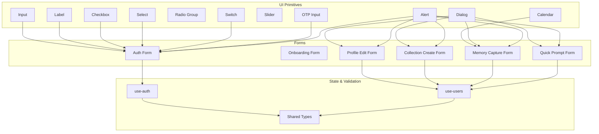
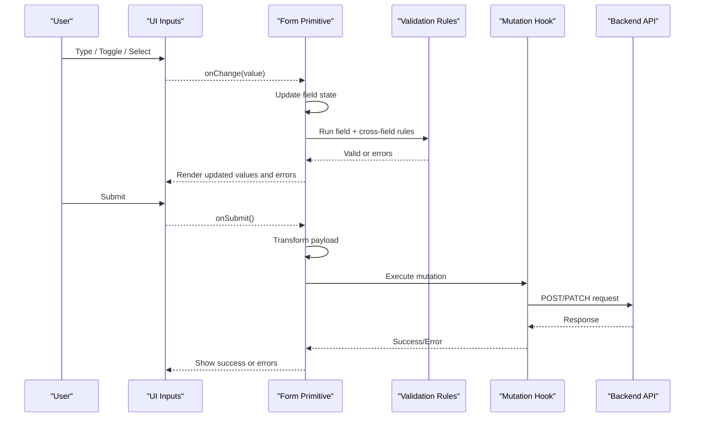
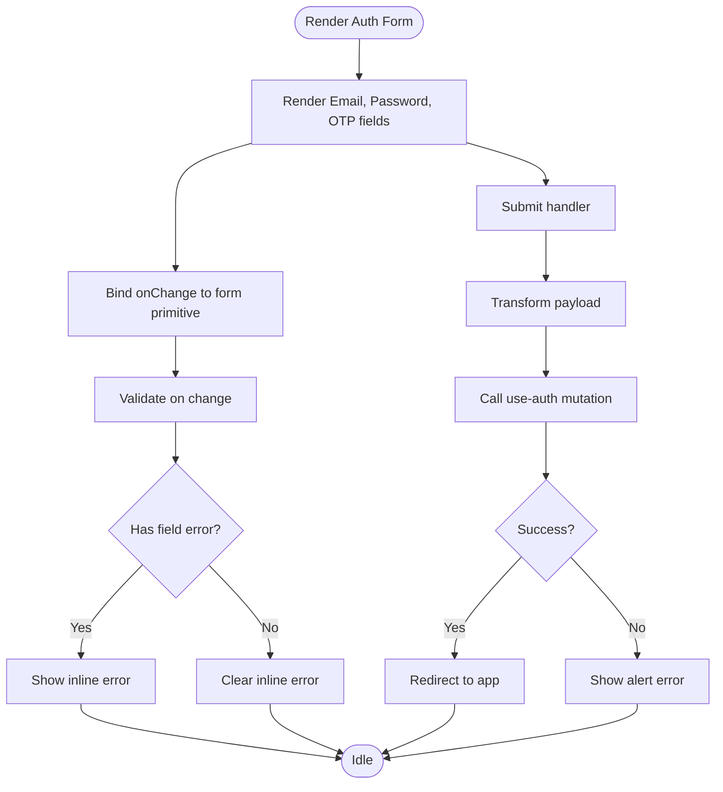
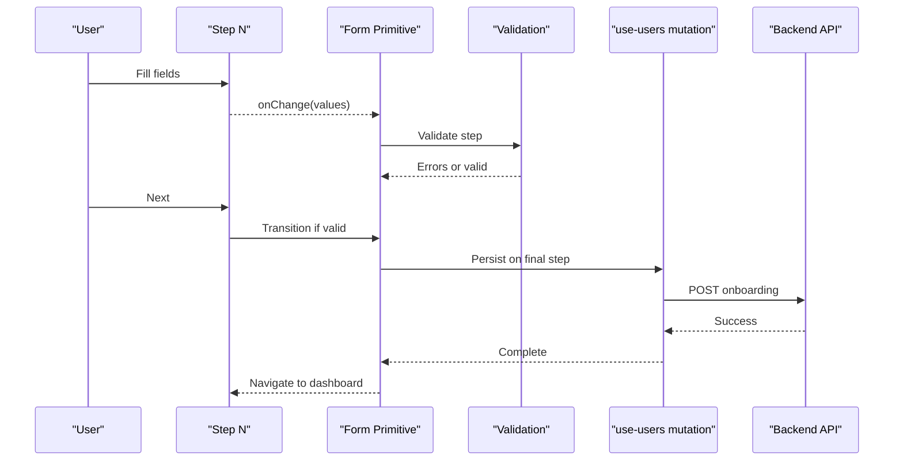
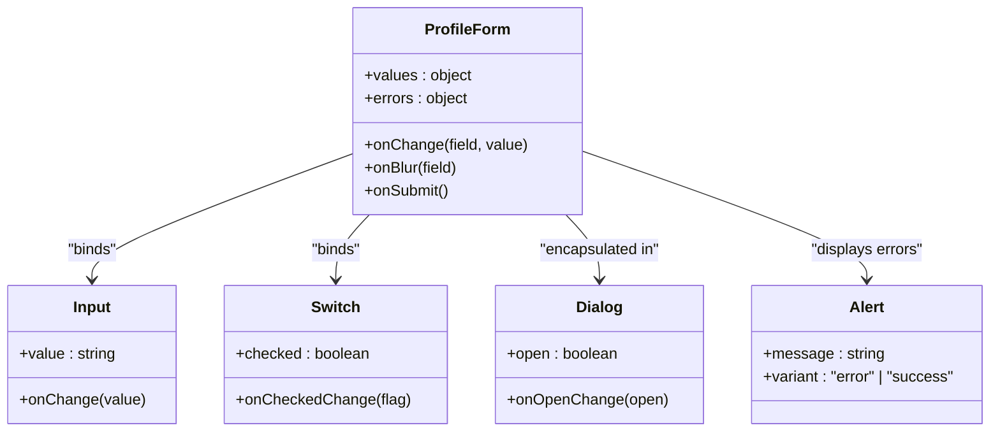
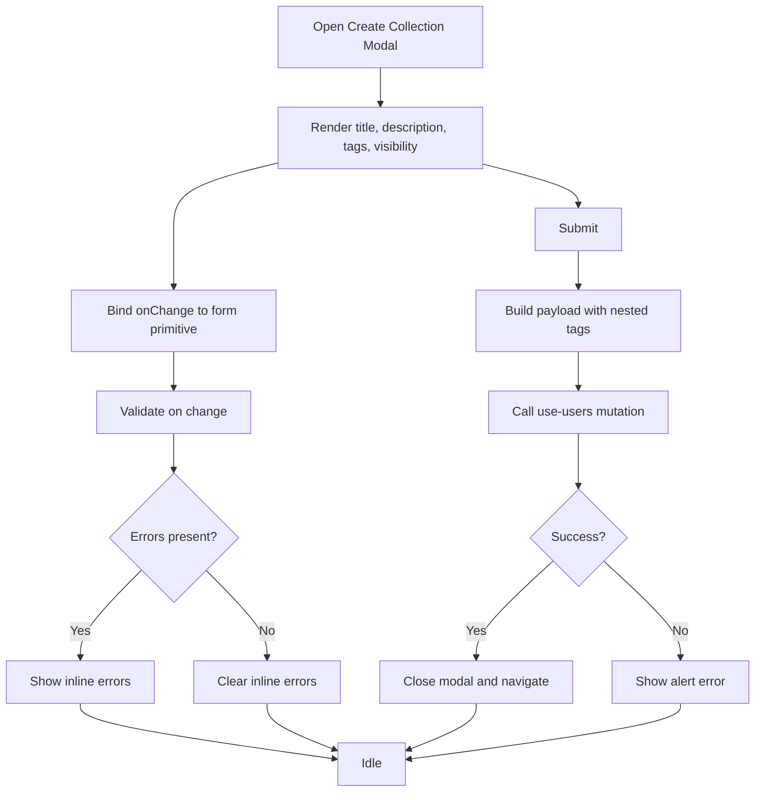
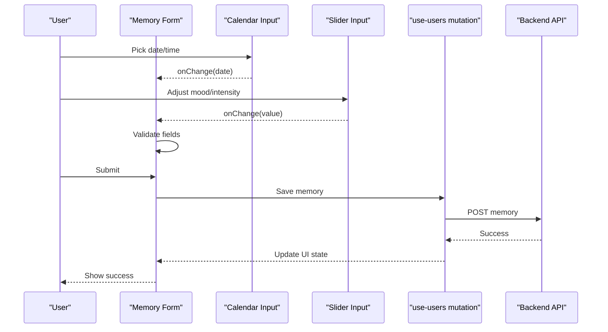
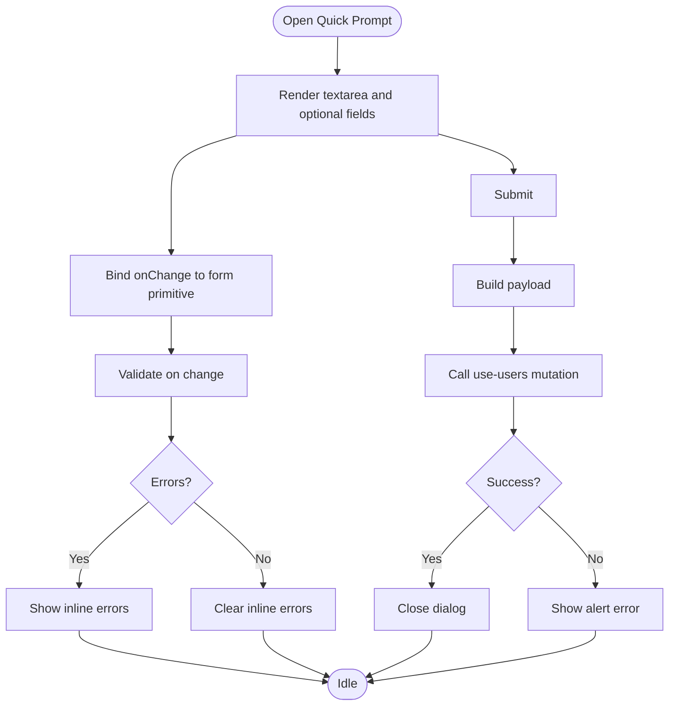
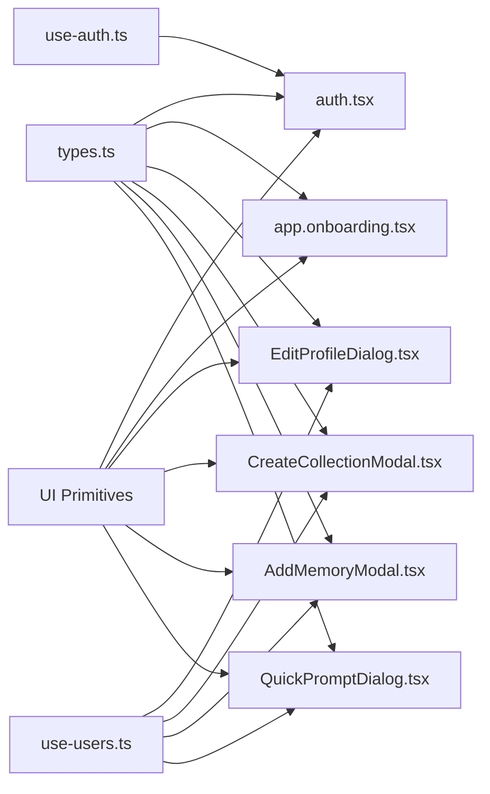

# Form State Management

<cite>
**Referenced Files in This Document**
- [form.tsx](file://src/components/ui/form.tsx)
- [input.tsx](file://src/components/ui/input.tsx)
- [label.tsx](file://src/components/ui/label.tsx)
- [checkbox.tsx](file://src/components/ui/checkbox.tsx)
- [select.tsx](file://src/components/ui/select.tsx)
- [radio-group.tsx](file://src/components/ui/radio-group.tsx)
- [switch.tsx](file://src/components/ui/switch.tsx)
- [slider.tsx](file://src/components/ui/slider.tsx)
- [calendar.tsx](file://src/components/ui/calendar.tsx)
- [input-otp.tsx](file://src/components/ui/input-otp.tsx)
- [dialog.tsx](file://src/components/ui/dialog.tsx)
- [alert.tsx](file://src/components/ui/alert.tsx)
- [auth.tsx](file://src/routes/auth.tsx)
- [app.onboarding.tsx](file://src/routes/app.onboarding.tsx)
- [EditProfileDialog.tsx](file://src/components/profile/EditProfileDialog.tsx)
- [CreateCollectionModal.tsx](file://src/components/collections/CreateCollectionModal.tsx)
- [AddMemoryModal.tsx](file://src/components/calendar/AddMemoryModal.tsx)
- [QuickPromptDialog.tsx](file://src/components/media/QuickPromptDialog.tsx)
- [use-auth.ts](file://src/hooks/use-auth.ts)
- [use-users.ts](file://src/hooks/use-users.ts)
- [types.ts](file://src/lib/types.ts)
</cite>

## Table of Contents
1. [Introduction](#introduction)
2. [Project Structure](#project-structure)
3. [Core Components](#core-components)
4. [Architecture Overview](#architecture-overview)
5. [Detailed Component Analysis](#detailed-component-analysis)
6. [Dependency Analysis](#dependency-analysis)
7. [Performance Considerations](#performance-considerations)
8. [Troubleshooting Guide](#troubleshooting-guide)
9. [Conclusion](#conclusion)
10. [Appendices](#appendices)

## Introduction
This document explains how form state management and validation are implemented across the application. It focuses on:
- Field state synchronization between UI components and a central store
- Validation rules and real-time feedback
- Error display patterns
- Integration with UI primitives (inputs, selects, toggles, date pickers)
- Submission handling for simple and complex forms
- Accessibility considerations including keyboard navigation and screen reader support

The patterns described here are designed to be consistent, accessible, and scalable across both simple and dynamic forms.

## Project Structure
Form-related code is organized into:
- UI primitives under src/components/ui that implement accessible, composable fields
- Route-level forms for authentication and onboarding
- Feature-specific dialogs/modals for profile editing, collection creation, memory capture, and quick prompts
- Shared hooks for data fetching and mutations
- Centralized types for payloads and validation schemas

**Diagram sources**
- [input.tsx](file://src/components/ui/input.tsx)
- [label.tsx](file://src/components/ui/label.tsx)
- [checkbox.tsx](file://src/components/ui/checkbox.tsx)
- [select.tsx](file://src/components/ui/select.tsx)
- [radio-group.tsx](file://src/components/ui/radio-group.tsx)
- [switch.tsx](file://src/components/ui/switch.tsx)
- [slider.tsx](file://src/components/ui/slider.tsx)
- [calendar.tsx](file://src/components/ui/calendar.tsx)
- [input-otp.tsx](file://src/components/ui/input-otp.tsx)
- [dialog.tsx](file://src/components/ui/dialog.tsx)
- [alert.tsx](file://src/components/ui/alert.tsx)
- [auth.tsx](file://src/routes/auth.tsx)
- [app.onboarding.tsx](file://src/routes/app.onboarding.tsx)
- [EditProfileDialog.tsx](file://src/components/profile/EditProfileDialog.tsx)
- [CreateCollectionModal.tsx](file://src/components/collections/CreateCollectionModal.tsx)
- [AddMemoryModal.tsx](file://src/components/calendar/AddMemoryModal.tsx)
- [QuickPromptDialog.tsx](file://src/components/media/QuickPromptDialog.tsx)
- [use-auth.ts](file://src/hooks/use-auth.ts)
- [use-users.ts](file://src/hooks/use-users.ts)
- [types.ts](file://src/lib/types.ts)

**Section sources**
- [form.tsx](file://src/components/ui/form.tsx)
- [input.tsx](file://src/components/ui/input.tsx)
- [label.tsx](file://src/components/ui/label.tsx)
- [checkbox.tsx](file://src/components/ui/checkbox.tsx)
- [select.tsx](file://src/components/ui/select.tsx)
- [radio-group.tsx](file://src/components/ui/radio-group.tsx)
- [switch.tsx](file://src/components/ui/switch.tsx)
- [slider.tsx](file://src/components/ui/slider.tsx)
- [calendar.tsx](file://src/components/ui/calendar.tsx)
- [input-otp.tsx](file://src/components/ui/input-otp.tsx)
- [dialog.tsx](file://src/components/ui/dialog.tsx)
- [alert.tsx](file://src/components/ui/alert.tsx)
- [auth.tsx](file://src/routes/auth.tsx)
- [app.onboarding.tsx](file://src/routes/app.onboarding.tsx)
- [EditProfileDialog.tsx](file://src/components/profile/EditProfileDialog.tsx)
- [CreateCollectionModal.tsx](file://src/components/collections/CreateCollectionModal.tsx)
- [AddMemoryModal.tsx](file://src/components/calendar/AddMemoryModal.tsx)
- [QuickPromptDialog.tsx](file://src/components/media/QuickPromptDialog.tsx)
- [use-auth.ts](file://src/hooks/use-auth.ts)
- [use-users.ts](file://src/hooks/use-users.ts)
- [types.ts](file://src/lib/types.ts)

## Core Components
- Form primitive: Provides field registration, value binding, change handlers, and error association. It acts as the bridge between UI inputs and the form’s internal state and validation context.
- Input and Label: Standard text input with label association for accessibility.
- Checkbox, Radio Group, Select, Switch, Slider: Controlled components that expose value and onChange props and integrate with the form primitive for state sync.
- Calendar and OTP: Specialized inputs for dates and one-time codes, each exposing controlled interfaces compatible with the form primitive.
- Dialog: Modal container used by feature forms to encapsulate multi-step or complex interactions.
- Alert: Feedback component for displaying validation errors and submission results.

Key responsibilities:
- Controlled state: All inputs receive value and onChange from the form primitive to ensure a single source of truth.
- Validation integration: Errors are associated with fields and surfaced via Alert or inline messages.
- Accessibility: Labels, roles, aria attributes, and keyboard behavior are standardized across components.

**Section sources**
- [form.tsx](file://src/components/ui/form.tsx)
- [input.tsx](file://src/components/ui/input.tsx)
- [label.tsx](file://src/components/ui/label.tsx)
- [checkbox.tsx](file://src/components/ui/checkbox.tsx)
- [select.tsx](file://src/components/ui/select.tsx)
- [radio-group.tsx](file://src/components/ui/radio-group.tsx)
- [switch.tsx](file://src/components/ui/switch.tsx)
- [slider.tsx](file://src/components/ui/slider.tsx)
- [calendar.tsx](file://src/components/ui/calendar.tsx)
- [input-otp.tsx](file://src/components/ui/input-otp.tsx)
- [dialog.tsx](file://src/components/ui/dialog.tsx)
- [alert.tsx](file://src/components/ui/alert.tsx)

## Architecture Overview
The form architecture follows a unidirectional data flow:
- UI primitives render controlled fields bound to the form primitive
- The form primitive manages field state and validates against rules
- Validation errors are displayed through Alert or inline messages
- On submit, the form transforms values and invokes mutation hooks
- Mutations update server state and reflect back to the UI

**Diagram sources**
- [form.tsx](file://src/components/ui/form.tsx)
- [input.tsx](file://src/components/ui/input.tsx)
- [alert.tsx](file://src/components/ui/alert.tsx)
- [use-auth.ts](file://src/hooks/use-auth.ts)
- [use-users.ts](file://src/hooks/use-users.ts)

## Detailed Component Analysis

### Authentication Form
- Purpose: Handles login and registration flows with email/password and optional OTP verification.
- State synchronization: Email and password fields are controlled via the form primitive; OTP uses a specialized input component.
- Validation rules: Required fields, email format, password strength, and OTP length/format. Cross-field checks may enforce confirmation where applicable.
- Error display: Inline field errors and an alert banner for network or server-side errors.
- Submission: Calls authentication mutation hook; handles success redirection and error states.

**Diagram sources**
- [auth.tsx](file://src/routes/auth.tsx)
- [input.tsx](file://src/components/ui/input.tsx)
- [input-otp.tsx](file://src/components/ui/input-otp.tsx)
- [alert.tsx](file://src/components/ui/alert.tsx)
- [use-auth.ts](file://src/hooks/use-auth.ts)

**Section sources**
- [auth.tsx](file://src/routes/auth.tsx)
- [input.tsx](file://src/components/ui/input.tsx)
- [input-otp.tsx](file://src/components/ui/input-otp.tsx)
- [alert.tsx](file://src/components/ui/alert.tsx)
- [use-auth.ts](file://src/hooks/use-auth.ts)

### Onboarding Form
- Purpose: Guides new users through initial setup steps, potentially including profile details and preferences.
- State synchronization: Multi-step state managed within the form primitive; step transitions depend on validation completion.
- Validation rules: Step-specific required fields and constraints; cross-step dependencies handled at transition time.
- Error display: Per-step inline errors and a summary alert when needed.
- Submission: Persists onboarding data via user mutation hook.

**Diagram sources**
- [app.onboarding.tsx](file://src/routes/app.onboarding.tsx)
- [form.tsx](file://src/components/ui/form.tsx)
- [use-users.ts](file://src/hooks/use-users.ts)

**Section sources**
- [app.onboarding.tsx](file://src/routes/app.onboarding.tsx)
- [form.tsx](file://src/components/ui/form.tsx)
- [use-users.ts](file://src/hooks/use-users.ts)

### Profile Edit Dialog
- Purpose: Allows users to edit profile information such as name, bio, avatar, and settings.
- State synchronization: Controlled inputs bound to the form primitive; changes debounced or validated on blur/change.
- Validation rules: Name length, bio character limits, avatar URL format, and required fields.
- Error display: Inline field errors and an alert banner for server errors.
- Submission: Updates user profile via mutation hook; shows success feedback.

**Diagram sources**
- [EditProfileDialog.tsx](file://src/components/profile/EditProfileDialog.tsx)
- [input.tsx](file://src/components/ui/input.tsx)
- [switch.tsx](file://src/components/ui/switch.tsx)
- [dialog.tsx](file://src/components/ui/dialog.tsx)
- [alert.tsx](file://src/components/ui/alert.tsx)
- [use-users.ts](file://src/hooks/use-users.ts)

**Section sources**
- [EditProfileDialog.tsx](file://src/components/profile/EditProfileDialog.tsx)
- [input.tsx](file://src/components/ui/input.tsx)
- [switch.tsx](file://src/components/ui/switch.tsx)
- [dialog.tsx](file://src/components/ui/dialog.tsx)
- [alert.tsx](file://src/components/ui/alert.tsx)
- [use-users.ts](file://src/hooks/use-users.ts)

### Collection Creation Modal
- Purpose: Enables users to create collections with metadata, tags, and visibility settings.
- State synchronization: Nested fields for tags and options; controlled via form primitive.
- Validation rules: Title required, tag uniqueness, visibility constraints.
- Error display: Inline errors per field and alert for server responses.
- Submission: Creates collection via mutation hook; navigates to collection view on success.

**Diagram sources**
- [CreateCollectionModal.tsx](file://src/components/collections/CreateCollectionModal.tsx)
- [form.tsx](file://src/components/ui/form.tsx)
- [alert.tsx](file://src/components/ui/alert.tsx)
- [use-users.ts](file://src/hooks/use-users.ts)

**Section sources**
- [CreateCollectionModal.tsx](file://src/components/collections/CreateCollectionModal.tsx)
- [form.tsx](file://src/components/ui/form.tsx)
- [alert.tsx](file://src/components/ui/alert.tsx)
- [use-users.ts](file://src/hooks/use-users.ts)

### Memory Capture Form
- Purpose: Captures memories with media references, timestamps, notes, and mood selection.
- State synchronization: Calendar for date/time, slider for intensity/mood, text fields for notes.
- Validation rules: Date validity, note length, required fields based on context.
- Error display: Inline errors and alert banner for failures.
- Submission: Saves memory via mutation hook; provides immediate feedback.

**Diagram sources**
- [AddMemoryModal.tsx](file://src/components/calendar/AddMemoryModal.tsx)
- [calendar.tsx](file://src/components/ui/calendar.tsx)
- [slider.tsx](file://src/components/ui/slider.tsx)
- [form.tsx](file://src/components/ui/form.tsx)
- [use-users.ts](file://src/hooks/use-users.ts)

**Section sources**
- [AddMemoryModal.tsx](file://src/components/calendar/AddMemoryModal.tsx)
- [calendar.tsx](file://src/components/ui/calendar.tsx)
- [slider.tsx](file://src/components/ui/slider.tsx)
- [form.tsx](file://src/components/ui/form.tsx)
- [use-users.ts](file://src/hooks/use-users.ts)

### Quick Prompt Form
- Purpose: Captures short reflections or prompts tied to media items.
- State synchronization: Text area bound to form primitive; optional tags or categories.
- Validation rules: Minimum length, optional category constraints.
- Error display: Inline errors and alert for server issues.
- Submission: Posts prompt via mutation hook; updates related media view.

**Diagram sources**
- [QuickPromptDialog.tsx](file://src/components/media/QuickPromptDialog.tsx)
- [form.tsx](file://src/components/ui/form.tsx)
- [alert.tsx](file://src/components/ui/alert.tsx)
- [use-users.ts](file://src/hooks/use-users.ts)

**Section sources**
- [QuickPromptDialog.tsx](file://src/components/media/QuickPromptDialog.tsx)
- [form.tsx](file://src/components/ui/form.tsx)
- [alert.tsx](file://src/components/ui/alert.tsx)
- [use-users.ts](file://src/hooks/use-users.ts)

## Dependency Analysis
Forms rely on shared types for payloads and validation schemas, and on hooks for data operations. UI primitives provide consistent behavior and accessibility.

**Diagram sources**
- [types.ts](file://src/lib/types.ts)
- [auth.tsx](file://src/routes/auth.tsx)
- [app.onboarding.tsx](file://src/routes/app.onboarding.tsx)
- [EditProfileDialog.tsx](file://src/components/profile/EditProfileDialog.tsx)
- [CreateCollectionModal.tsx](file://src/components/collections/CreateCollectionModal.tsx)
- [AddMemoryModal.tsx](file://src/components/calendar/AddMemoryModal.tsx)
- [QuickPromptDialog.tsx](file://src/components/media/QuickPromptDialog.tsx)
- [use-auth.ts](file://src/hooks/use-auth.ts)
- [use-users.ts](file://src/hooks/use-users.ts)
- [input.tsx](file://src/components/ui/input.tsx)
- [label.tsx](file://src/components/ui/label.tsx)
- [checkbox.tsx](file://src/components/ui/checkbox.tsx)
- [select.tsx](file://src/components/ui/select.tsx)
- [radio-group.tsx](file://src/components/ui/radio-group.tsx)
- [switch.tsx](file://src/components/ui/switch.tsx)
- [slider.tsx](file://src/components/ui/slider.tsx)
- [calendar.tsx](file://src/components/ui/calendar.tsx)
- [input-otp.tsx](file://src/components/ui/input-otp.tsx)
- [dialog.tsx](file://src/components/ui/dialog.tsx)
- [alert.tsx](file://src/components/ui/alert.tsx)

**Section sources**
- [types.ts](file://src/lib/types.ts)
- [use-auth.ts](file://src/hooks/use-auth.ts)
- [use-users.ts](file://src/hooks/use-users.ts)
- [input.tsx](file://src/components/ui/input.tsx)
- [label.tsx](file://src/components/ui/label.tsx)
- [checkbox.tsx](file://src/components/ui/checkbox.tsx)
- [select.tsx](file://src/components/ui/select.tsx)
- [radio-group.tsx](file://src/components/ui/radio-group.tsx)
- [switch.tsx](file://src/components/ui/switch.tsx)
- [slider.tsx](file://src/components/ui/slider.tsx)
- [calendar.tsx](file://src/components/ui/calendar.tsx)
- [input-otp.tsx](file://src/components/ui/input-otp.tsx)
- [dialog.tsx](file://src/components/ui/dialog.tsx)
- [alert.tsx](file://src/components/ui/alert.tsx)

## Performance Considerations
- Debounce heavy validations for long-running checks (e.g., uniqueness) to avoid excessive re-renders.
- Use controlled components consistently to prevent desynchronization between UI and state.
- Minimize re-validation scope by validating only changed fields and on-blur where appropriate.
- Batch mutations and coalesce rapid updates to reduce network requests.
- Keep form payloads minimal; transform only necessary fields before submission.

[No sources needed since this section provides general guidance]

## Troubleshooting Guide
Common issues and resolutions:
- Field not updating: Ensure onChange is wired to the form primitive and that the input is controlled.
- Validation not triggering: Confirm validation rules are attached to fields and triggered on change or blur as intended.
- Errors not visible: Verify Alert usage and that error messages are passed correctly from validation or server responses.
- Submission failing: Check mutation hook error handling and ensure payload transformation matches backend expectations.

**Section sources**
- [alert.tsx](file://src/components/ui/alert.tsx)
- [form.tsx](file://src/components/ui/form.tsx)
- [use-auth.ts](file://src/hooks/use-auth.ts)
- [use-users.ts](file://src/hooks/use-users.ts)

## Conclusion
The application employs a consistent, accessible form architecture centered around a form primitive that synchronizes controlled UI inputs with validation rules and mutation hooks. This approach supports simple and complex forms, dynamic generation, and robust error handling while maintaining strong accessibility standards for keyboard navigation and screen readers.

[No sources needed since this section summarizes without analyzing specific files]

## Appendices

### Accessibility Checklist for Forms
- Associate labels with inputs using proper attributes.
- Provide clear error messages linked to fields via aria-describedby.
- Ensure focus management in dialogs and modals.
- Support keyboard navigation (Tab, Enter, Escape).
- Announce validation results to screen readers.

[No sources needed since this section provides general guidance]

### Data Transformation Patterns
- Normalize inputs before validation (trimming, casing).
- Convert UI representations to backend-compatible formats (dates, booleans).
- Flatten nested structures for submission and reconstruct on response.

[No sources needed since this section provides general guidance]