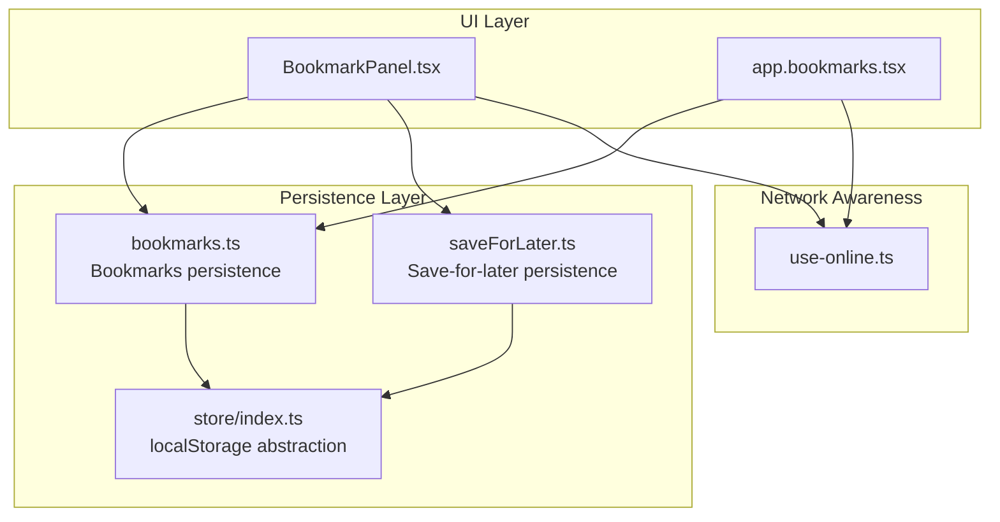
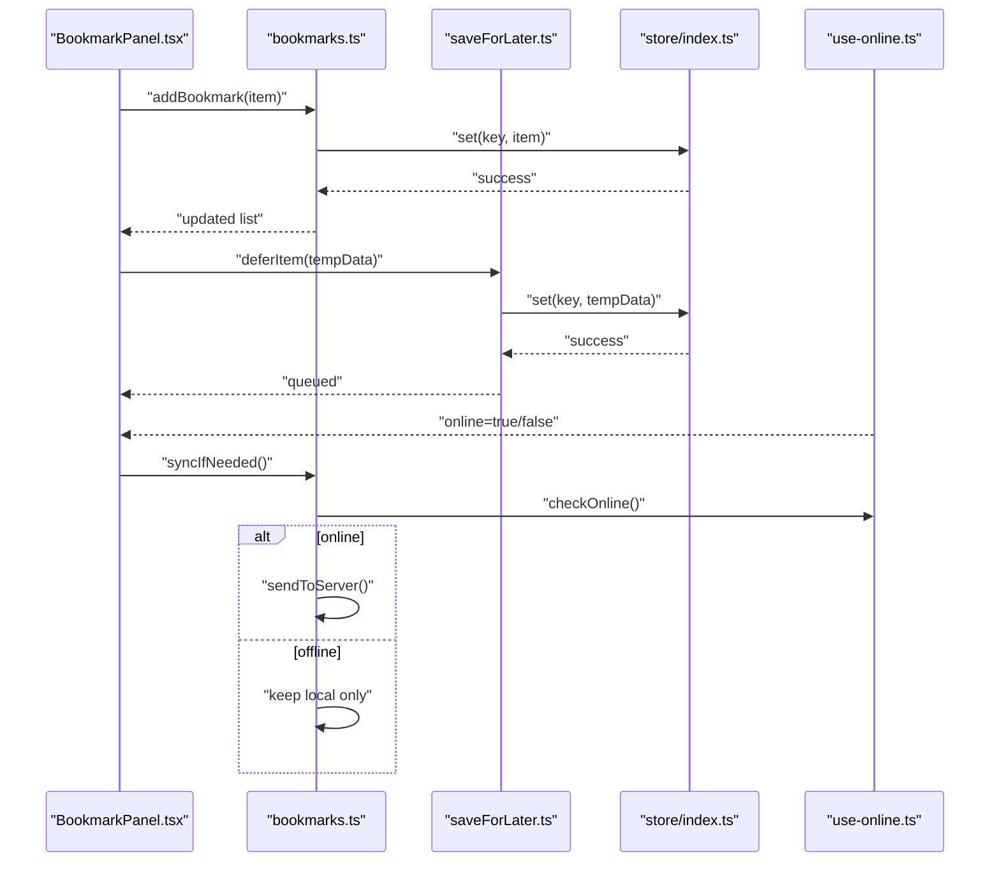
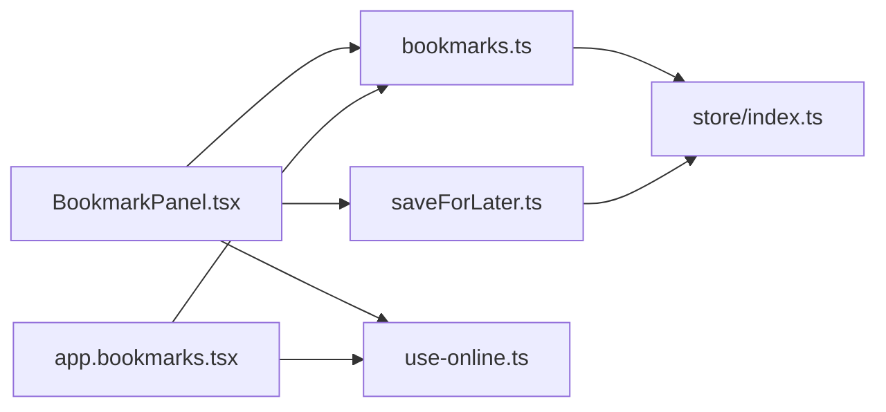

# Local Storage & Persistence

<cite>
**Referenced Files in This Document**
- [lib/store/index.ts](file://src/lib/store/index.ts)
- [lib/bookmarks.ts](file://src/lib/bookmarks.ts)
- [lib/saveForLater.ts](file://src/lib/saveForLater.ts)
- [hooks/use-online.ts](file://src/hooks/use-online.ts)
- [components/profile/BookmarkPanel.tsx](file://src/components/profile/BookmarkPanel.tsx)
- [routes/app.bookmarks.tsx](file://src/routes/app.bookmarks.tsx)
</cite>

## Table of Contents
1. [Introduction](#introduction)
2. [Project Structure](#project-structure)
3. [Core Components](#core-components)
4. [Architecture Overview](#architecture-overview)
5. [Detailed Component Analysis](#detailed-component-analysis)
6. [Dependency Analysis](#dependency-analysis)
7. [Performance Considerations](#performance-considerations)
8. [Troubleshooting Guide](#troubleshooting-guide)
9. [Conclusion](#conclusion)

## Introduction
This document explains the local storage utilities and data persistence patterns used across the application. It covers:
- Abstraction layer over localStorage for type-safe operations
- Data serialization and deserialization strategies
- Caching strategies to support offline-first behavior
- Versioned data migration between app versions
- Storage quota management and cleanup procedures
- Persistence of user preferences, bookmarks, and temporary data
- Examples of synchronous and asynchronous storage operations
- Error handling for storage failures

The goal is to make these concepts accessible to both technical and non-technical readers while providing precise references to implementation files.

## Project Structure
Local storage utilities are primarily implemented under src/lib/store and related feature modules that persist domain data such as bookmarks and save-for-later items. UI components and routes consume these utilities to read/write state locally and optionally sync with remote services when online.

**Diagram sources**
- [lib/store/index.ts](file://src/lib/store/index.ts)
- [lib/bookmarks.ts](file://src/lib/bookmarks.ts)
- [lib/saveForLater.ts](file://src/lib/saveForLater.ts)
- [hooks/use-online.ts](file://src/hooks/use-online.ts)
- [components/profile/BookmarkPanel.tsx](file://src/components/profile/BookmarkPanel.tsx)
- [routes/app.bookmarks.tsx](file://src/routes/app.bookmarks.tsx)

**Section sources**
- [lib/store/index.ts](file://src/lib/store/index.ts)
- [lib/bookmarks.ts](file://src/lib/bookmarks.ts)
- [lib/saveForLater.ts](file://src/lib/saveForLater.ts)
- [hooks/use-online.ts](file://src/hooks/use-online.ts)
- [components/profile/BookmarkPanel.tsx](file://src/components/profile/BookmarkPanel.tsx)
- [routes/app.bookmarks.tsx](file://src/routes/app.bookmarks.tsx)

## Core Components
- localStorage abstraction: Provides typed get/set/remove helpers, versioning, and safe JSON serialization/deserialization.
- Bookmarks persistence: Manages bookmark CRUD operations with schema validation and optional sync triggers.
- Save-for-later persistence: Handles temporary or deferred items with TTL-based expiration and cleanup.
- Online awareness: Hooks into network status to decide whether to sync or rely on local cache.

Key responsibilities:
- Type safety via generic wrappers around localStorage keys and values
- Consistent error handling for quota exceeded, invalid JSON, and missing keys
- Migration hooks for evolving schemas
- Offline-first caching with eventual consistency

**Section sources**
- [lib/store/index.ts](file://src/lib/store/index.ts)
- [lib/bookmarks.ts](file://src/lib/bookmarks.ts)
- [lib/saveForLater.ts](file://src/lib/saveForLater.ts)
- [hooks/use-online.ts](file://src/hooks/use-online.ts)

## Architecture Overview
The persistence architecture follows an offline-first pattern:
- UI components call feature-specific modules (bookmarks, save-for-later).
- Feature modules use the store abstraction to read/write typed data.
- When online, modules may trigger background sync; otherwise, they operate purely on local cache.
- A migration routine runs at startup to ensure compatibility across versions.

**Diagram sources**
- [components/profile/BookmarkPanel.tsx](file://src/components/profile/BookmarkPanel.tsx)
- [lib/bookmarks.ts](file://src/lib/bookmarks.ts)
- [lib/saveForLater.ts](file://src/lib/saveForLater.ts)
- [lib/store/index.ts](file://src/lib/store/index.ts)
- [hooks/use-online.ts](file://src/hooks/use-online.ts)

## Detailed Component Analysis

### localStorage Abstraction (store/index.ts)
Responsibilities:
- Typed get/set/remove methods for keys with value validation
- Safe JSON serialization/deserialization with error boundaries
- Versioned storage keys and migration entry points
- Quota-aware writes with fallbacks and logging

Typical usage patterns:
- Use a strongly-typed key prefix per feature (e.g., bookmarks_v1, save_for_later_v1)
- Wrap set operations in try/catch to handle quota errors
- Provide default values for missing keys
- Expose a migrate function to transform older formats to new ones

Error handling:
- Invalid JSON returns a safe default or throws a typed error
- QuotaExceededError triggers cleanup or prompts user
- Missing keys return defaults without failing reads

Migration strategy:
- On app start, detect current version and run necessary transforms
- Keep backward-compatible readers until deprecation window passes
- Log migration outcomes for observability

Cleanup:
- Periodic scan for expired entries based on TTL metadata
- Remove orphaned keys after successful sync

**Section sources**
- [lib/store/index.ts](file://src/lib/store/index.ts)

### Bookmarks Persistence (bookmarks.ts)
Responsibilities:
- CRUD operations for bookmarks with schema validation
- Optional synchronization with server when online
- Conflict resolution rules for concurrent edits
- Indexing by media id, collection id, and timestamp

Caching strategy:
- Cache full bookmark list locally
- Invalidate cache on mutations
- Debounce sync operations to avoid excessive network calls

Data model:
- Each bookmark includes id, media reference, timestamps, and optional notes
- Version field ensures forward compatibility

Operations:
- addBookmark, removeBookmark, updateBookmark
- getBookmarks, searchBookmarks
- syncBookmarks (async)

Error handling:
- Network errors fall back to local-only mode
- Duplicate detection prevents redundant entries
- Validation errors surface clear messages

**Section sources**
- [lib/bookmarks.ts](file://src/lib/bookmarks.ts)

### Save-for-Later Persistence (saveForLater.ts)
Responsibilities:
- Manage temporary items with TTL-based expiration
- Queue items for later processing or upload
- Clean up expired entries periodically

Caching strategy:
- Short-lived cache optimized for quick access
- Background cleanup job removes expired items
- Optional priority queue for critical items

Operations:
- deferItem, getItem, removeItem
- listDeferred, purgeExpired
- processQueue (async)

Error handling:
- Graceful degradation if storage is unavailable
- Retry logic for failed queue processing
- Clear corrupted entries automatically

**Section sources**
- [lib/saveForLater.ts](file://src/lib/saveForLater.ts)

### Online Awareness (use-online.ts)
Responsibilities:
- Track online/offline status using navigator.onLine and events
- Emit reconnection events for retry logic
- Provide utility functions to conditionally execute network operations

Usage:
- Wrap sync operations with online checks
- Show offline indicators to users
- Queue actions when offline and flush when reconnected

**Section sources**
- [hooks/use-online.ts](file://src/hooks/use-online.ts)

### UI Integration (BookmarkPanel.tsx and app.bookmarks.tsx)
Responsibilities:
- Render bookmark lists and forms
- Trigger add/update/remove operations through bookmarks module
- Display sync status and offline indicators
- Handle user feedback for errors and successes

Flow:
- User action -> UI component -> bookmarks.ts -> store/index.ts -> localStorage
- Optional async sync triggered when online

**Section sources**
- [components/profile/BookmarkPanel.tsx](file://src/components/profile/BookmarkPanel.tsx)
- [routes/app.bookmarks.tsx](file://src/routes/app.bookmarks.tsx)

## Dependency Analysis
The following diagram shows how components depend on each other for persistence:

**Diagram sources**
- [components/profile/BookmarkPanel.tsx](file://src/components/profile/BookmarkPanel.tsx)
- [routes/app.bookmarks.tsx](file://src/routes/app.bookmarks.tsx)
- [lib/bookmarks.ts](file://src/lib/bookmarks.ts)
- [lib/saveForLater.ts](file://src/lib/saveForLater.ts)
- [lib/store/index.ts](file://src/lib/store/index.ts)
- [hooks/use-online.ts](file://src/hooks/use-online.ts)

**Section sources**
- [components/profile/BookmarkPanel.tsx](file://src/components/profile/BookmarkPanel.tsx)
- [routes/app.bookmarks.tsx](file://src/routes/app.bookmarks.tsx)
- [lib/bookmarks.ts](file://src/lib/bookmarks.ts)
- [lib/saveForLater.ts](file://src/lib/saveForLater.ts)
- [lib/store/index.ts](file://src/lib/store/index.ts)
- [hooks/use-online.ts](file://src/hooks/use-online.ts)

## Performance Considerations
- Minimize localStorage writes by batching updates and debouncing sync operations
- Use efficient key naming and avoid deep nesting to reduce serialization overhead
- Implement pagination or lazy loading for large bookmark lists
- Cache frequently accessed data in memory with TTL-based eviction
- Monitor storage quota usage and proactively clean up expired or unused entries
- Avoid synchronous blocking operations in hot paths; prefer async where possible

[No sources needed since this section provides general guidance]

## Troubleshooting Guide
Common issues and resolutions:
- QuotaExceededError: Reduce payload size, implement automatic cleanup, or prompt users to clear storage
- Invalid JSON: Validate inputs before writing, provide recovery routines to parse partial data
- Missing keys: Always supply default values and log warnings for unexpected states
- Sync failures: Implement retry with exponential backoff and offline queueing
- Stale data: Use version fields and invalidate caches on mutations

Debugging steps:
- Inspect localStorage keys and values directly in browser dev tools
- Add logging around storage operations to trace failures
- Verify online status and network connectivity
- Test migration routines with sample datasets

**Section sources**
- [lib/store/index.ts](file://src/lib/store/index.ts)
- [lib/bookmarks.ts](file://src/lib/bookmarks.ts)
- [lib/saveForLater.ts](file://src/lib/saveForLater.ts)

## Conclusion
The local storage and persistence layer provides a robust, type-safe foundation for offline-first functionality. By abstracting localStorage operations, implementing versioned migrations, and managing quotas intelligently, the application ensures reliable data persistence across sessions. The modular design allows easy extension for new features while maintaining consistency and performance.

[No sources needed since this section summarizes without analyzing specific files]