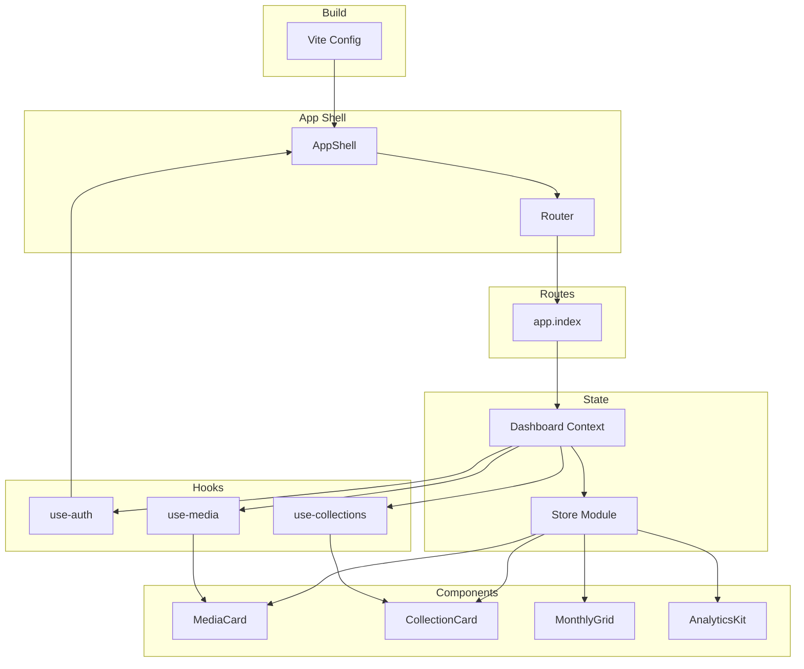
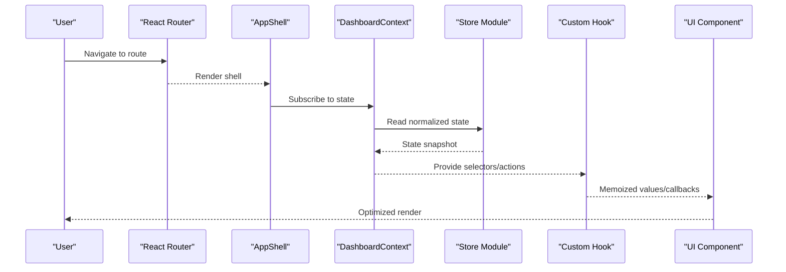
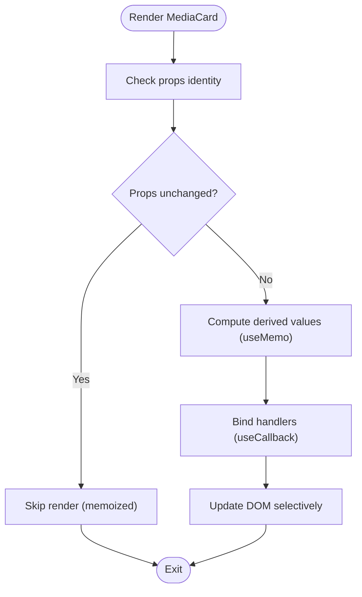
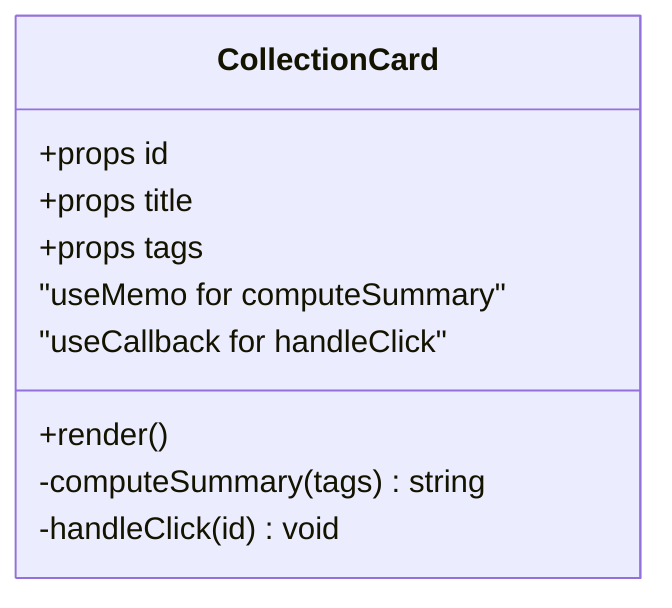
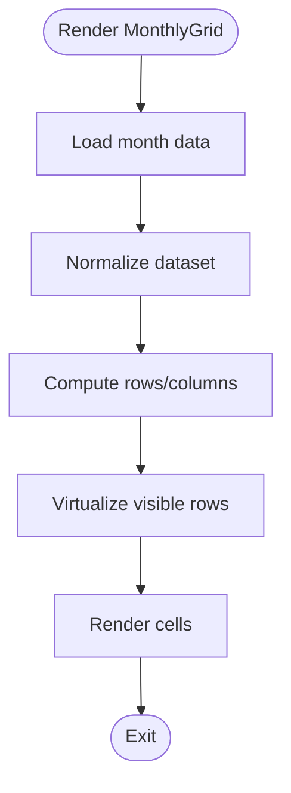
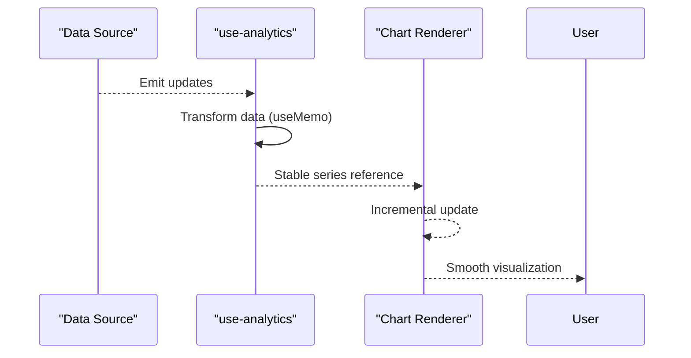
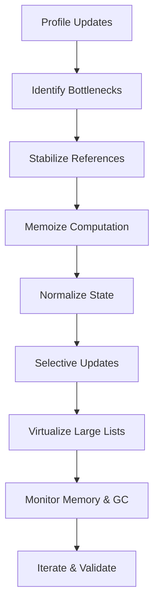
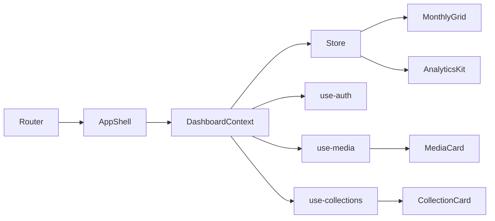
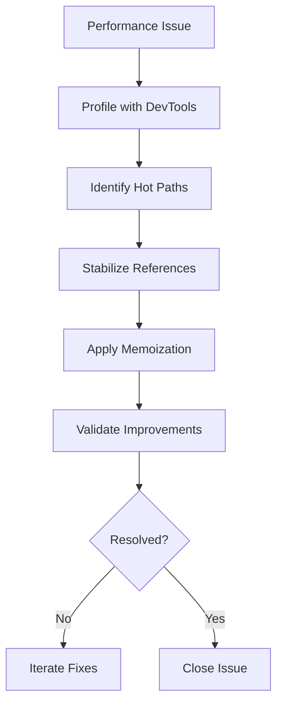

# Performance Optimization

<cite>
**Referenced Files in This Document**
- [package.json](file://package.json)
- [vite.config.ts](file://vite.config.ts)
- [src/router.tsx](file://src/router.tsx)
- [src/routes/app.index.tsx](file://src/routes/app.index.tsx)
- [src/components/dashboard/DashboardContext.tsx](file://src/components/dashboard/DashboardContext.tsx)
- [src/hooks/use-auth.ts](file://src/hooks/use-auth.ts)
- [src/hooks/use-media.ts](file://src/hooks/use-media.ts)
- [src/hooks/use-collections.ts](file://src/hooks/use-collections.ts)
- [src/lib/store/index.ts](file://src/lib/store/index.ts)
- [src/components/media/MediaCard.tsx](file://src/components/media/MediaCard.tsx)
- [src/components/collections/CollectionCard.tsx](file://src/components/collections/CollectionCard.tsx)
- [src/components/calendar/MonthlyGrid.tsx](file://src/components/calendar/MonthlyGrid.tsx)
- [src/components/analytics/AnalyticsKit.tsx](file://src/components/analytics/AnalyticsKit.tsx)
- [src/components/common/ErrorBoundary.tsx](file://src/components/common/ErrorBoundary.tsx)
- [src/components/layout/AppShell.tsx](file://src/components/layout/AppShell.tsx)
</cite>

## Table of Contents
1. [Introduction](#introduction)
2. [Project Structure](#project-structure)
3. [Core Components](#core-components)
4. [Architecture Overview](#architecture-overview)
5. [Detailed Component Analysis](#detailed-component-analysis)
6. [Dependency Analysis](#dependency-analysis)
7. [Performance Considerations](#performance-considerations)
8. [Troubleshooting Guide](#troubleshooting-guide)
9. [Conclusion](#conclusion)
10. [Appendices](#appendices)

## Introduction
This document provides a comprehensive guide to state management performance optimization for the React-based frontend in this project. It focuses on memoization strategies using React.memo, useMemo, and useCallback; component re-render optimization; state normalization; selective updates; memory management and garbage collection considerations; and debugging techniques to identify and resolve performance bottlenecks. Practical examples are included for profiling state updates, avoiding unnecessary re-renders, optimizing large datasets, and preventing memory leaks through proper lifecycle management.

## Project Structure
The application is a React + Vite project with feature-based component organization under src/components, route-driven navigation via React Router, and hooks encapsulating data fetching and state logic. A global store module centralizes shared state, while components consume state via context or custom hooks. The build configuration enables production optimizations such as minification and code splitting.

**Diagram sources**
- [vite.config.ts:1-200](file://vite.config.ts#L1-L200)
- [src/router.tsx:1-200](file://src/router.tsx#L1-L200)
- [src/components/layout/AppShell.tsx:1-200](file://src/components/layout/AppShell.tsx#L1-L200)
- [src/routes/app.index.tsx:1-200](file://src/routes/app.index.tsx#L1-L200)
- [src/components/dashboard/DashboardContext.tsx:1-200](file://src/components/dashboard/DashboardContext.tsx#L1-L200)
- [src/lib/store/index.ts:1-200](file://src/lib/store/index.ts#L1-L200)
- [src/hooks/use-auth.ts:1-200](file://src/hooks/use-auth.ts#L1-L200)
- [src/hooks/use-media.ts:1-200](file://src/hooks/use-media.ts#L1-L200)
- [src/hooks/use-collections.ts:1-200](file://src/hooks/use-collections.ts#L1-L200)
- [src/components/media/MediaCard.tsx:1-200](file://src/components/media/MediaCard.tsx#L1-L200)
- [src/components/collections/CollectionCard.tsx:1-200](file://src/components/collections/CollectionCard.tsx#L1-L200)
- [src/components/calendar/MonthlyGrid.tsx:1-200](file://src/components/calendar/MonthlyGrid.tsx#L1-L200)
- [src/components/analytics/AnalyticsKit.tsx:1-200](file://src/components/analytics/AnalyticsKit.tsx#L1-L200)

**Section sources**
- [package.json:1-200](file://package.json#L1-L200)
- [vite.config.ts:1-200](file://vite.config.ts#L1-L200)
- [src/router.tsx:1-200](file://src/router.tsx#L1-L200)

## Core Components
Key areas impacting performance include:
- Global store and context usage for centralized state
- Custom hooks that encapsulate data fetching and memoized computations
- UI components that render lists and charts
- Build-time optimizations configured via Vite

Focus areas:
- Memoize expensive computations and callbacks with useMemo and useCallback
- Prevent unnecessary re-renders by stabilizing props and using React.memo
- Normalize state shapes to reduce duplication and simplify selectors
- Optimize large datasets with virtualization and pagination
- Profile updates to identify bottlenecks and eliminate redundant renders

**Section sources**
- [src/lib/store/index.ts:1-200](file://src/lib/store/index.ts#L1-L200)
- [src/components/dashboard/DashboardContext.tsx:1-200](file://src/components/dashboard/DashboardContext.tsx#L1-L200)
- [src/hooks/use-media.ts:1-200](file://src/hooks/use-media.ts#L1-L200)
- [src/hooks/use-collections.ts:1-200](file://src/hooks/use-collections.ts#L1-L200)
- [src/components/media/MediaCard.tsx:1-200](file://src/components/media/MediaCard.tsx#L1-L200)
- [src/components/collections/CollectionCard.tsx:1-200](file://src/components/collections/CollectionCard.tsx#L1-L200)
- [src/components/calendar/MonthlyGrid.tsx:1-200](file://src/components/calendar/MonthlyGrid.tsx#L1-L200)
- [src/components/analytics/AnalyticsKit.tsx:1-200](file://src/components/analytics/AnalyticsKit.tsx#L1-L200)

## Architecture Overview
The frontend architecture emphasizes separation of concerns:
- Router drives page-level rendering
- AppShell manages layout and global interactions
- DashboardContext exposes shared state and actions
- Hooks encapsulate domain-specific logic (auth, media, collections)
- Components consume state and present UI efficiently

**Diagram sources**
- [src/router.tsx:1-200](file://src/router.tsx#L1-L200)
- [src/components/layout/AppShell.tsx:1-200](file://src/components/layout/AppShell.tsx#L1-L200)
- [src/components/dashboard/DashboardContext.tsx:1-200](file://src/components/dashboard/DashboardContext.tsx#L1-L200)
- [src/lib/store/index.ts:1-200](file://src/lib/store/index.ts#L1-L200)
- [src/hooks/use-media.ts:1-200](file://src/hooks/use-media.ts#L1-L200)

## Detailed Component Analysis

### MediaCard Component
Optimization opportunities:
- Wrap with React.memo to prevent re-renders when props are stable
- Use useMemo for derived properties like formatted metadata
- Stabilize event handlers with useCallback to avoid prop churn
- Avoid inline objects/functions in props

**Diagram sources**
- [src/components/media/MediaCard.tsx:1-200](file://src/components/media/MediaCard.tsx#L1-L200)

**Section sources**
- [src/components/media/MediaCard.tsx:1-200](file://src/components/media/MediaCard.tsx#L1-L200)

### CollectionCard Component
Optimization opportunities:
- Memoize computed fields such as tags or summary text
- Ensure stable references for onClick handlers
- Avoid passing new object/array props on each render
- Consider lazy loading heavy content within the card

**Diagram sources**
- [src/components/collections/CollectionCard.tsx:1-200](file://src/components/collections/CollectionCard.tsx#L1-L200)

**Section sources**
- [src/components/collections/CollectionCard.tsx:1-200](file://src/components/collections/CollectionCard.tsx#L1-L200)

### MonthlyGrid Component
Optimization opportunities:
- Virtualize large grids to limit DOM nodes
- Memoize row/column calculations
- Debounce user input if filtering/searching
- Use keyed items to optimize reconciliation

**Diagram sources**
- [src/components/calendar/MonthlyGrid.tsx:1-200](file://src/components/calendar/MonthlyGrid.tsx#L1-L200)

**Section sources**
- [src/components/calendar/MonthlyGrid.tsx:1-200](file://src/components/calendar/MonthlyGrid.tsx#L1-L200)

### AnalyticsKit Component
Optimization opportunities:
- Memoize chart data transformations
- Throttle or debounce frequent updates
- Use incremental updates instead of full re-renders
- Avoid creating new series arrays on every render

**Diagram sources**
- [src/components/analytics/AnalyticsKit.tsx:1-200](file://src/components/analytics/AnalyticsKit.tsx#L1-L200)

**Section sources**
- [src/components/analytics/AnalyticsKit.tsx:1-200](file://src/components/analytics/AnalyticsKit.tsx#L1-L200)

### Conceptual Overview
Conceptual workflow for performance optimization:
- Identify hot paths using profiling tools
- Stabilize props and state references
- Memoize expensive computations and callbacks
- Normalize state to minimize duplication
- Implement selective updates and virtualization for large datasets
- Monitor memory usage and clean up side effects

[No sources needed since this diagram shows conceptual workflow, not actual code structure]

## Dependency Analysis
Dependencies between core modules influence re-render behavior and performance:
- Router drives component mounting/unmounting
- AppShell provides layout and global state access
- DashboardContext exposes shared state and actions
- Hooks encapsulate domain logic and memoization
- Components depend on stable props and normalized state

**Diagram sources**
- [src/router.tsx:1-200](file://src/router.tsx#L1-L200)
- [src/components/layout/AppShell.tsx:1-200](file://src/components/layout/AppShell.tsx#L1-L200)
- [src/components/dashboard/DashboardContext.tsx:1-200](file://src/components/dashboard/DashboardContext.tsx#L1-L200)
- [src/lib/store/index.ts:1-200](file://src/lib/store/index.ts#L1-L200)
- [src/hooks/use-auth.ts:1-200](file://src/hooks/use-auth.ts#L1-L200)
- [src/hooks/use-media.ts:1-200](file://src/hooks/use-media.ts#L1-L200)
- [src/hooks/use-collections.ts:1-200](file://src/hooks/use-collections.ts#L1-L200)
- [src/components/media/MediaCard.tsx:1-200](file://src/components/media/MediaCard.tsx#L1-L200)
- [src/components/collections/CollectionCard.tsx:1-200](file://src/components/collections/CollectionCard.tsx#L1-L200)
- [src/components/calendar/MonthlyGrid.tsx:1-200](file://src/components/calendar/MonthlyGrid.tsx#L1-L200)
- [src/components/analytics/AnalyticsKit.tsx:1-200](file://src/components/analytics/AnalyticsKit.tsx#L1-L200)

**Section sources**
- [src/router.tsx:1-200](file://src/router.tsx#L1-L200)
- [src/components/layout/AppShell.tsx:1-200](file://src/components/layout/AppShell.tsx#L1-L200)
- [src/components/dashboard/DashboardContext.tsx:1-200](file://src/components/dashboard/DashboardContext.tsx#L1-L200)
- [src/lib/store/index.ts:1-200](file://src/lib/store/index.ts#L1-L200)

## Performance Considerations
Recommendations grounded in the codebase patterns:
- Memoization:
  - Use React.memo for pure components to skip re-renders when props are unchanged
  - Apply useMemo for expensive derived data (e.g., chart series, summaries)
  - Stabilize callbacks with useCallback to maintain referential equality
- Re-render Optimization:
  - Avoid inline objects/functions in JSX props
  - Lift state minimally and normalize shapes to reduce duplication
  - Prefer stable keys for list items to improve reconciliation
- Selective Updates:
  - Slice state slices per component to avoid unnecessary subscriptions
  - Use selectors to derive minimal required data
- Large Datasets:
  - Implement virtualization for long lists/grids
  - Paginate or lazy-load data incrementally
- Memory Management:
  - Clean up timers, listeners, and subscriptions in useEffect cleanup
  - Avoid retaining large objects in closures longer than necessary
  - Monitor heap snapshots to detect leaks
- Profiling:
  - Use React DevTools Profiler to identify slow renders
  - Measure update frequency and duration for critical paths
  - Correlate network requests with UI updates

[No sources needed since this section provides general guidance]

## Troubleshooting Guide
Common issues and remedies:
- Excessive re-renders:
  - Inspect component dependency graphs and stabilize props
  - Verify that context consumers subscribe only to needed slices
- Memory leaks:
  - Ensure all event listeners and intervals are cleared
  - Avoid storing large payloads in long-lived caches without eviction
- Slow chart rendering:
  - Memoize series data and throttle updates
  - Reduce redraw frequency during animations
- Unstable references:
  - Move function definitions outside render loops
  - Use consistent key structures for dynamic lists

**Section sources**
- [src/components/common/ErrorBoundary.tsx:1-200](file://src/components/common/ErrorBoundary.tsx#L1-L200)

## Conclusion
By applying memoization, normalizing state, and implementing selective updates, the application can significantly reduce unnecessary re-renders and improve responsiveness. Proper memory management and proactive profiling ensure long-term stability and performance. Adopt these practices consistently across components and hooks to maintain a smooth user experience even as the dataset grows.

[No sources needed since this section summarizes without analyzing specific files]

## Appendices
- Build optimizations:
  - Enable production builds with minification and tree-shaking
  - Configure code splitting for route-level chunks
- Additional resources:
  - React DevTools Profiler documentation
  - Best practices for React performance

[No sources needed since this section provides general guidance]