# State Management

<cite>
**Referenced Files in This Document**
- [use-auth.ts](file://src/hooks/use-auth.ts)
- [DashboardContext.tsx](file://src/components/dashboard/DashboardContext.tsx)
- [AppShell.tsx](file://src/components/layout/AppShell.tsx)
- [router.tsx](file://src/router.tsx)
- [__root.tsx](file://src/routes/__root.tsx)
- [auth.tsx](file://src/routes/auth.tsx)
- [auth.callback.tsx](file://src/routes/auth.callback.tsx)
- [use-theme.ts](file://src/hooks/use-theme.ts)
- [use-online.ts](file://src/hooks/use-online.ts)
- [store/index.ts](file://src/lib/store/index.ts)
- [api/client.ts](file://src/lib/api/client.ts)
- [error-capture.ts](file://src/lib/error-capture.ts)
- [analytics-tracker.ts](file://src/lib/analytics-tracker.ts)
</cite>

## Table of Contents
1. [Introduction](#introduction)
2. [Project Structure](#project-structure)
3. [Core Components](#core-components)
4. [Architecture Overview](#architecture-overview)
5. [Detailed Component Analysis](#detailed-component-analysis)
6. [Dependency Analysis](#dependency-analysis)
7. [Performance Considerations](#performance-considerations)
8. [Troubleshooting Guide](#troubleshooting-guide)
9. [Conclusion](#conclusion)
10. [Appendices](#appendices)

## Introduction
This document explains the state management architecture centered around custom hooks and context providers. It covers authentication state via a dedicated hook, user preferences handling, session persistence, API state patterns, caching strategies, error handling, local storage utilities, form state management, real-time synchronization considerations, performance optimization, memory management, debugging approaches, and integration with data fetching libraries such as React Query.

## Project Structure
The application organizes state logic into:
- Custom hooks for domain-specific state (authentication, theme, online status, analytics)
- Context providers for global UI state (dashboard context)
- A lightweight store module for shared client-side state
- An API client layer that encapsulates HTTP requests and integrates with caching and error handling
- Route-level components that bootstrap providers and manage auth flows

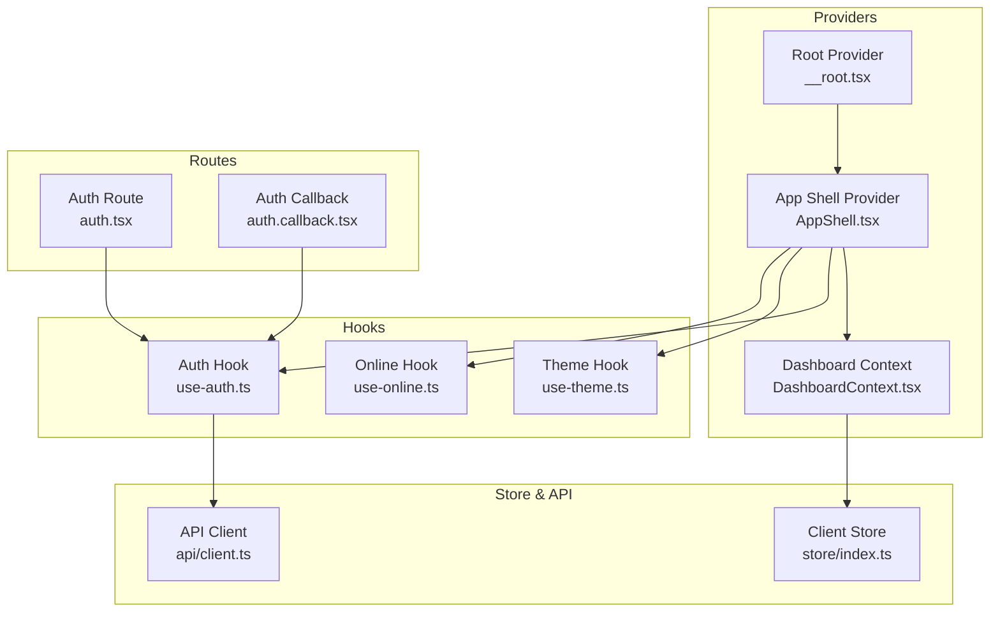

**Diagram sources**
- [__root.tsx](file://src/routes/__root.tsx)
- [AppShell.tsx](file://src/components/layout/AppShell.tsx)
- [DashboardContext.tsx](file://src/components/dashboard/DashboardContext.tsx)
- [use-auth.ts](file://src/hooks/use-auth.ts)
- [use-theme.ts](file://src/hooks/use-theme.ts)
- [use-online.ts](file://src/hooks/use-online.ts)
- [store/index.ts](file://src/lib/store/index.ts)
- [api/client.ts](file://src/lib/api/client.ts)
- [auth.tsx](file://src/routes/auth.tsx)
- [auth.callback.tsx](file://src/routes/auth.callback.tsx)

**Section sources**
- [__root.tsx](file://src/routes/__root.tsx)
- [AppShell.tsx](file://src/components/layout/AppShell.tsx)
- [DashboardContext.tsx](file://src/components/dashboard/DashboardContext.tsx)
- [use-auth.ts](file://src/hooks/use-auth.ts)
- [use-theme.ts](file://src/hooks/use-theme.ts)
- [use-online.ts](file://src/hooks/use-online.ts)
- [store/index.ts](file://src/lib/store/index.ts)
- [api/client.ts](file://src/lib/api/client.ts)
- [auth.tsx](file://src/routes/auth.tsx)
- [auth.callback.tsx](file://src/routes/auth.callback.tsx)

## Core Components
- Authentication state is managed by a dedicated hook that exposes login/logout flows, token/session handling, and user profile access.
- Global UI state is provided through a dashboard context to coordinate layout and feature toggles across the app shell.
- The client store centralizes small pieces of cross-cutting state (e.g., feature flags, UI preferences).
- The API client abstracts network calls, integrates with caching and error capture, and normalizes responses.

Key responsibilities:
- use-auth: encapsulates authentication lifecycle, persists tokens, and exposes authenticated state.
- DashboardContext: holds dashboard-wide settings and actions.
- store: provides a simple reactive store for lightweight state.
- api/client: handles HTTP requests, retries, and error mapping.

**Section sources**
- [use-auth.ts](file://src/hooks/use-auth.ts)
- [DashboardContext.tsx](file://src/components/dashboard/DashboardContext.tsx)
- [store/index.ts](file://src/lib/store/index.ts)
- [api/client.ts](file://src/lib/api/client.ts)

## Architecture Overview
The state architecture follows a layered approach:
- Providers at the root render global contexts.
- Hooks encapsulate business logic and side effects.
- The API client coordinates data fetching and caching.
- Routes orchestrate provider setup and navigation during auth flows.

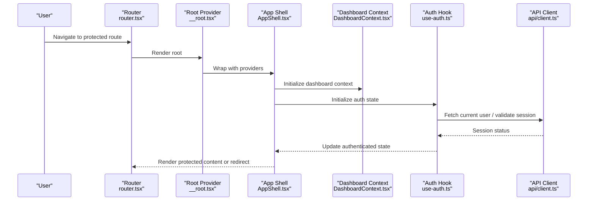

**Diagram sources**
- [router.tsx](file://src/router.tsx)
- [__root.tsx](file://src/routes/__root.tsx)
- [AppShell.tsx](file://src/components/layout/AppShell.tsx)
- [DashboardContext.tsx](file://src/components/dashboard/DashboardContext.tsx)
- [use-auth.ts](file://src/hooks/use-auth.ts)
- [api/client.ts](file://src/lib/api/client.ts)

## Detailed Component Analysis

### Authentication State Management (use-auth)
Responsibilities:
- Manages login, logout, and session validation.
- Persists tokens and user profile in local storage.
- Exposes authenticated state and helper methods to components.
- Integrates with the API client to refresh sessions and handle errors.

```mermaid
flowchart TD
Start(["Initialize use-auth"]) --> CheckSession["Check persisted session"]
CheckSession --> HasSession{"Session exists?"}
HasSession --> |No| Idle["Idle state"]
HasSession --> |Yes| Validate["Validate session via API"]
Validate --> Valid{"Valid?"}
Valid --> |No| Clear["Clear persisted session"] --> Idle
Valid --> |Yes| Ready["Authenticated state ready"]
Ready --> Actions{"Login/Logout/Refresh"}
Actions --> Login["Perform login flow"]
Actions --> Logout["Perform logout flow"]
Actions --> Refresh["Refresh token if needed"]
Login --> Persist["Persist token and user"]
Logout --> Clear
Refresh --> Validate
Persist --> Ready
Clear --> Idle
```

**Diagram sources**
- [use-auth.ts](file://src/hooks/use-auth.ts)
- [api/client.ts](file://src/lib/api/client.ts)

**Section sources**
- [use-auth.ts](file://src/hooks/use-auth.ts)
- [api/client.ts](file://src/lib/api/client.ts)

### User Preferences and Theme Handling (use-theme)
Responsibilities:
- Manages theme selection and applies it globally.
- Persists theme preference to local storage.
- Provides a reactive interface for components to subscribe to theme changes.

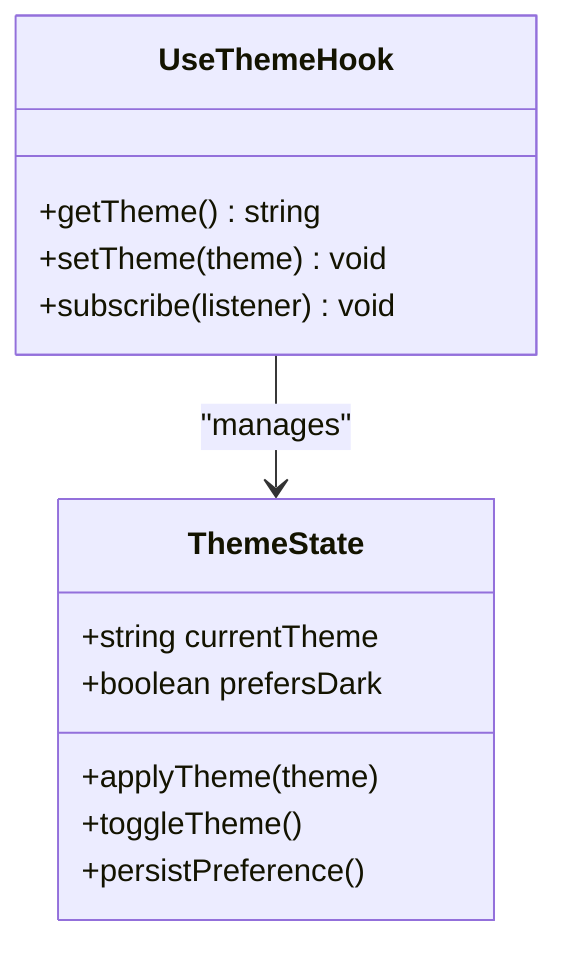

**Diagram sources**
- [use-theme.ts](file://src/hooks/use-theme.ts)

**Section sources**
- [use-theme.ts](file://src/hooks/use-theme.ts)

### Online Status and Connectivity (use-online)
Responsibilities:
- Tracks browser online/offline events.
- Updates application state to reflect connectivity.
- Can be used to gate network operations or show offline indicators.

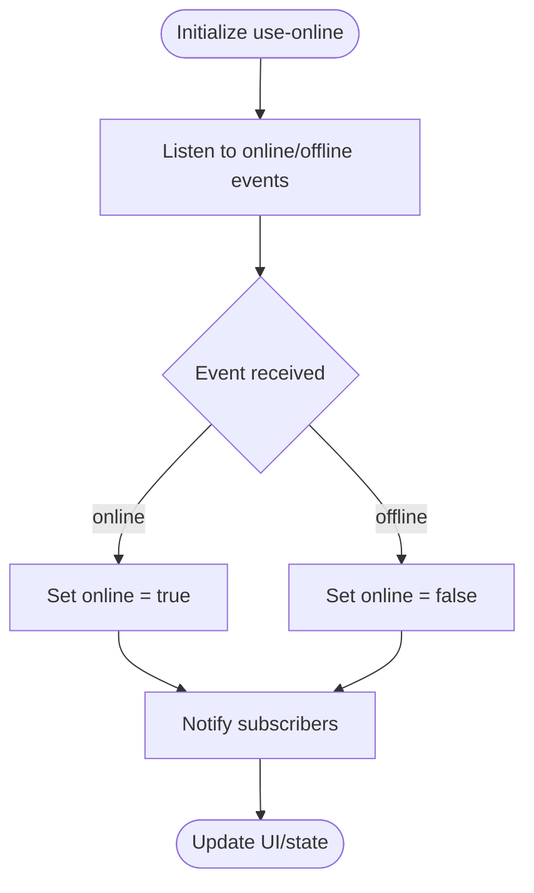

**Diagram sources**
- [use-online.ts](file://src/hooks/use-online.ts)

**Section sources**
- [use-online.ts](file://src/hooks/use-online.ts)

### Dashboard Context Provider
Responsibilities:
- Holds dashboard-wide state such as layout preferences, active panels, and feature flags.
- Provides actions to update state and persist preferences when applicable.
- Consumed by layout and feature components to maintain consistent UI behavior.

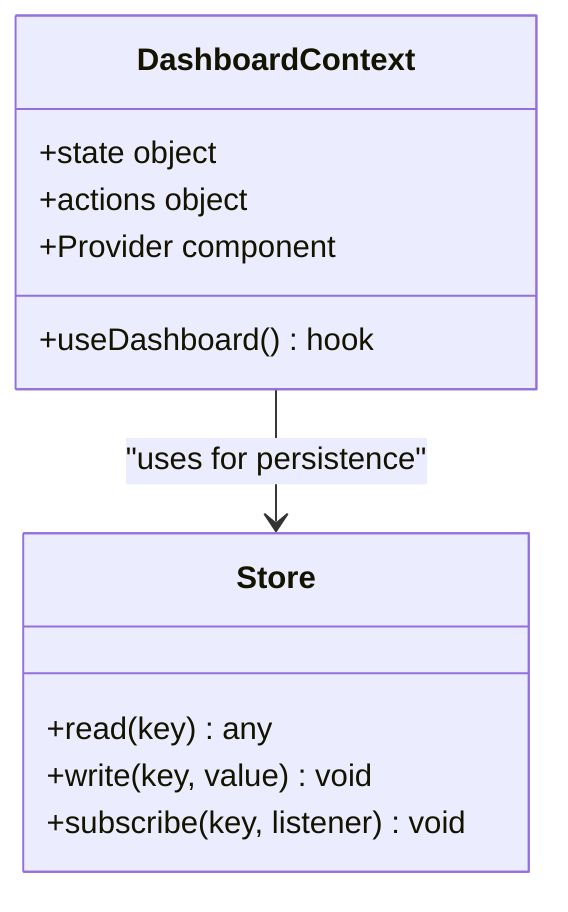

**Diagram sources**
- [DashboardContext.tsx](file://src/components/dashboard/DashboardContext.tsx)
- [store/index.ts](file://src/lib/store/index.ts)

**Section sources**
- [DashboardContext.tsx](file://src/components/dashboard/DashboardContext.tsx)
- [store/index.ts](file://src/lib/store/index.ts)

### API State Patterns and Caching
Responsibilities:
- Centralized API client for all HTTP requests.
- Implements request/response interceptors for error handling and logging.
- Integrates with caching strategies (in-memory cache, optional React Query integration).
- Normalizes errors and maps them to user-friendly messages.

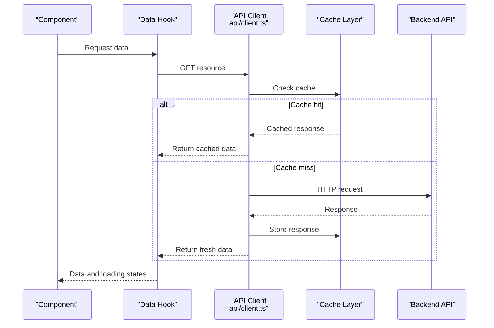

**Diagram sources**
- [api/client.ts](file://src/lib/api/client.ts)

**Section sources**
- [api/client.ts](file://src/lib/api/client.ts)

### Local Storage Utilities
Responsibilities:
- Encapsulates read/write operations to localStorage.
- Handles serialization/deserialization safely.
- Provides typed helpers for common keys (tokens, preferences).

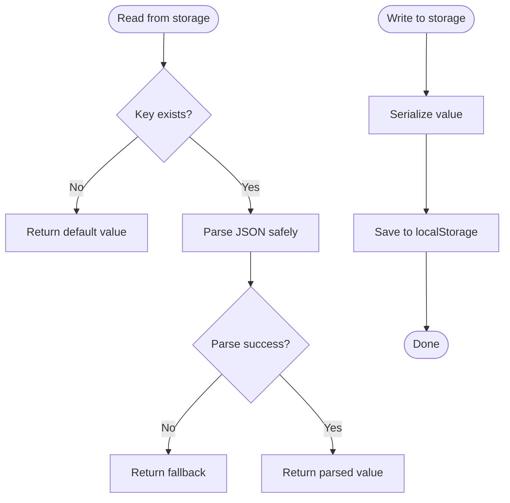

**Diagram sources**
- [store/index.ts](file://src/lib/store/index.ts)

**Section sources**
- [store/index.ts](file://src/lib/store/index.ts)

### Form State Management
Responsibilities:
- Uses controlled inputs with local state per form.
- Validates fields on change and submission.
- Debounces heavy validations and syncs with API where necessary.

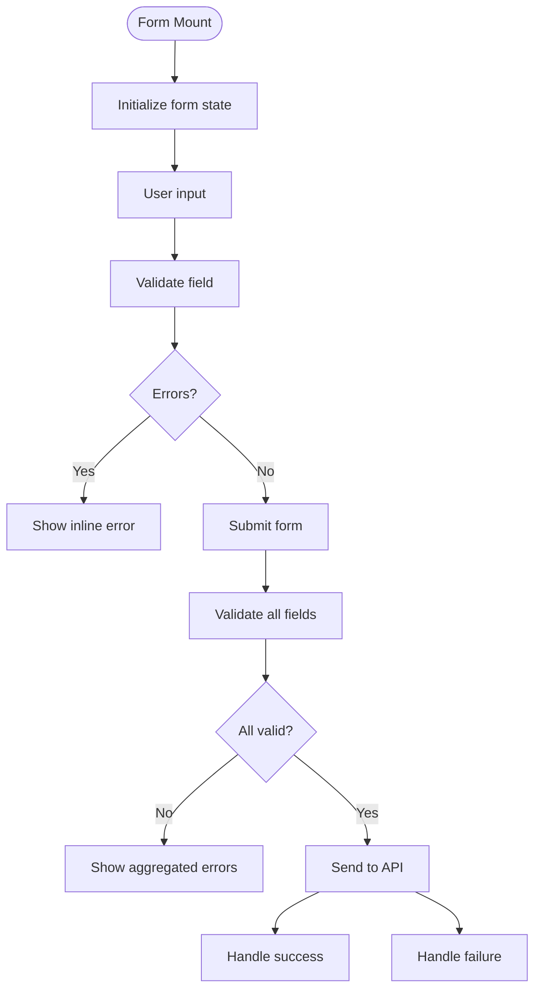

[No sources needed since this section describes general form patterns]

### Real-Time Data Synchronization
Responsibilities:
- Optional WebSocket or polling integration for live updates.
- Uses optimistic updates with rollback on failure.
- Maintains consistency between cache and server state.

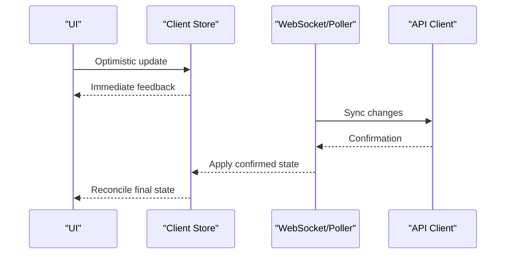

[No sources needed since this section outlines conceptual synchronization patterns]

### Integration with React Query
Responsibilities:
- Wraps API client with React Query for caching, background refetching, and error handling.
- Configures query keys, stale times, and retry policies.
- Provides hooks for data fetching and mutations.

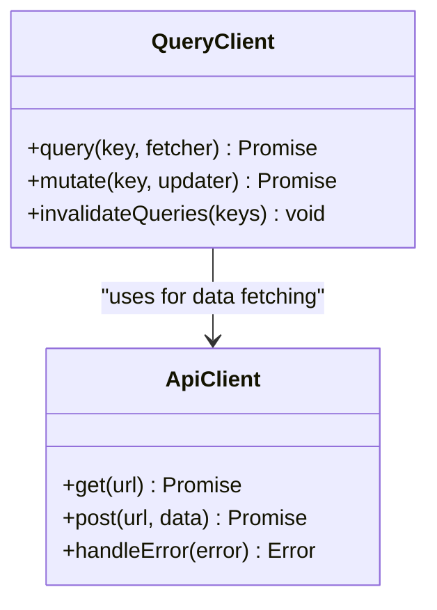

**Diagram sources**
- [api/client.ts](file://src/lib/api/client.ts)

[No additional sources needed since this section focuses on integration patterns]

## Dependency Analysis
The following diagram shows how core modules depend on each other:

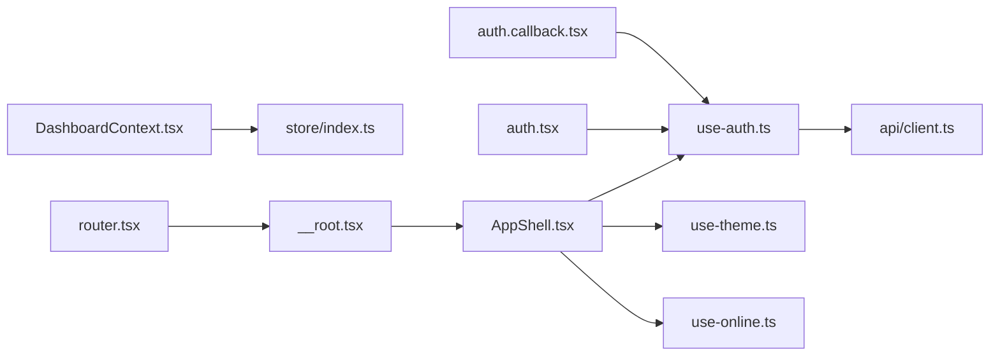

**Diagram sources**
- [use-auth.ts](file://src/hooks/use-auth.ts)
- [api/client.ts](file://src/lib/api/client.ts)
- [DashboardContext.tsx](file://src/components/dashboard/DashboardContext.tsx)
- [store/index.ts](file://src/lib/store/index.ts)
- [AppShell.tsx](file://src/components/layout/AppShell.tsx)
- [use-theme.ts](file://src/hooks/use-theme.ts)
- [use-online.ts](file://src/hooks/use-online.ts)
- [__root.tsx](file://src/routes/__root.tsx)
- [router.tsx](file://src/router.tsx)
- [auth.tsx](file://src/routes/auth.tsx)
- [auth.callback.tsx](file://src/routes/auth.callback.tsx)

**Section sources**
- [use-auth.ts](file://src/hooks/use-auth.ts)
- [api/client.ts](file://src/lib/api/client.ts)
- [DashboardContext.tsx](file://src/components/dashboard/DashboardContext.tsx)
- [store/index.ts](file://src/lib/store/index.ts)
- [AppShell.tsx](file://src/components/layout/AppShell.tsx)
- [use-theme.ts](file://src/hooks/use-theme.ts)
- [use-online.ts](file://src/hooks/use-online.ts)
- [__root.tsx](file://src/routes/__root.tsx)
- [router.tsx](file://src/router.tsx)
- [auth.tsx](file://src/routes/auth.tsx)
- [auth.callback.tsx](file://src/routes/auth.callback.tsx)

## Performance Considerations
- Memoization: Use memoized selectors and callbacks in hooks to prevent unnecessary re-renders.
- Lazy Loading: Load heavy components and routes lazily to reduce initial bundle size.
- Debounce/Throttle: Apply debouncing to search inputs and throttling to frequent updates.
- Caching: Configure appropriate stale times and background refetch intervals.
- Memory Management: Clean up event listeners and subscriptions in useEffect; avoid retaining large objects in closures.
- Rendering Optimization: Split state into smaller contexts where possible; prefer prop drilling for localized state.

[No sources needed since this section provides general guidance]

## Troubleshooting Guide
Common issues and approaches:
- Authentication failures: Inspect token validity and refresh flows; check error capture logs.
- Network errors: Verify API client interceptors and retry policies; review error mappings.
- Offline behavior: Ensure online status hook updates UI correctly; handle pending mutations gracefully.
- Local storage errors: Handle parse exceptions and fallback values; sanitize keys and values.
- Debugging: Use analytics tracker and error capture to log state transitions and failures.

**Section sources**
- [error-capture.ts](file://src/lib/error-capture.ts)
- [analytics-tracker.ts](file://src/lib/analytics-tracker.ts)
- [api/client.ts](file://src/lib/api/client.ts)
- [use-auth.ts](file://src/hooks/use-auth.ts)
- [use-online.ts](file://src/hooks/use-online.ts)
- [store/index.ts](file://src/lib/store/index.ts)

## Conclusion
The state management architecture leverages custom hooks and context providers to encapsulate authentication, preferences, and UI state. The API client centralizes data fetching and caching, while the store offers lightweight persistence. Together, these layers provide a scalable, maintainable foundation for complex applications, with clear separation of concerns and robust error handling.

## Appendices
- Best Practices:
  - Keep hooks focused and pure; avoid side effects outside of effect boundaries.
  - Prefer explicit state shapes and typed interfaces.
  - Centralize error handling and logging for consistent diagnostics.
- References:
  - For React Query integration details, consult the client configuration and query hooks usage within the API layer.

[No sources needed since this section summarizes without analyzing specific files]