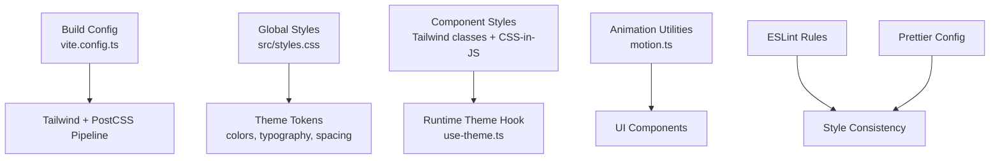
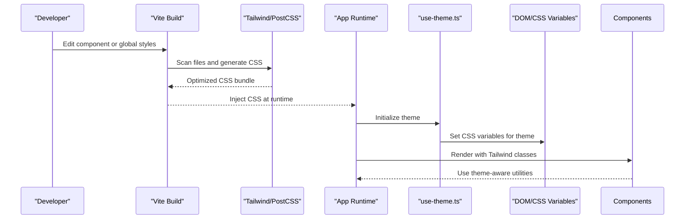
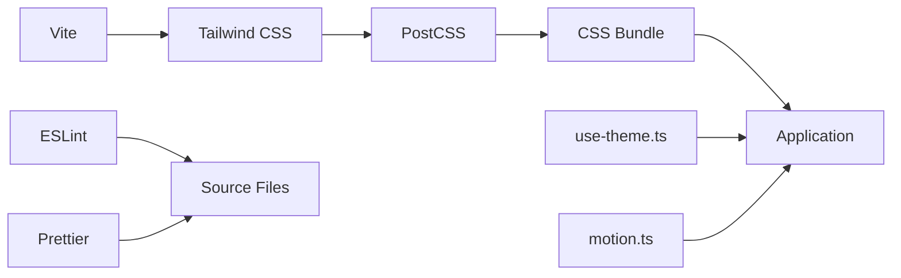

# Styling & Theming

<cite>
**Referenced Files in This Document**
- [package.json](file://package.json)
- [vite.config.ts](file://vite.config.ts)
- [src/styles.css](file://src/styles.css)
- [components.json](file://components.json)
- [eslint.config.js](file://eslint.config.js)
- [.prettierrc](file://.prettierrc)
- [src/hooks/use-theme.ts](file://src/hooks/use-theme.ts)
- [src/lib/motion.ts](file://src/lib/motion.ts)
</cite>

## Table of Contents
1. [Introduction](#introduction)
2. [Project Structure](#project-structure)
3. [Core Components](#core-components)
4. [Architecture Overview](#architecture-overview)
5. [Detailed Component Analysis](#detailed-component-analysis)
6. [Dependency Analysis](#dependency-analysis)
7. [Performance Considerations](#performance-considerations)
8. [Troubleshooting Guide](#troubleshooting-guide)
9. [Conclusion](#conclusion)

## Introduction
This document explains the styling system built with Tailwind CSS and CSS-in-JS patterns across the application. It covers theme configuration, custom color palettes, typography scales, spacing systems, responsive design patterns (mobile-first), cross-browser compatibility strategies, CSS architecture and naming conventions, component styling patterns, dark mode implementation, animation systems, performance optimization techniques, and integration with Prettier and ESLint for style consistency.

## Project Structure
The styling system is organized around a few key areas:
- Build-time configuration for Tailwind and PostCSS
- Global styles and theme tokens
- Component-level styling via Tailwind utilities and CSS-in-JS helpers
- Theme hooks and runtime theme switching
- Animation and motion utilities
- Linting and formatting rules for consistent styles

**Diagram sources**
- [vite.config.ts](file://vite.config.ts)
- [src/styles.css](file://src/styles.css)
- [src/hooks/use-theme.ts](file://src/hooks/use-theme.ts)
- [src/lib/motion.ts](file://src/lib/motion.ts)
- [eslint.config.js](file://eslint.config.js)
- [.prettierrc](file://.prettierrc)

**Section sources**
- [vite.config.ts](file://vite.config.ts)
- [src/styles.css](file://src/styles.css)
- [components.json](file://components.json)

## Core Components
- Tailwind configuration defines theme tokens (colors, typography, spacing), breakpoints, plugins, and purge settings.
- Global CSS establishes base styles, CSS variables for theming, and utility overrides.
- Theme hook provides runtime access to current theme values and toggles between light/dark modes.
- Motion library encapsulates animations and transitions used across components.
- UI components follow a consistent pattern combining Tailwind utility classes with minimal CSS-in-JS where necessary.

Key responsibilities:
- Centralize design tokens to ensure consistency.
- Provide a single source of truth for colors, typography, and spacing.
- Enable dynamic theme switching without full page reloads.
- Keep component styles declarative and composable.

**Section sources**
- [src/styles.css](file://src/styles.css)
- [src/hooks/use-theme.ts](file://src/hooks/use-theme.ts)
- [src/lib/motion.ts](file://src/lib/motion.ts)

## Architecture Overview
The styling architecture follows a layered approach:
- Build layer: Tailwind scans source files, generates optimized CSS, and integrates with PostCSS for processing.
- Theme layer: Global CSS variables define semantic tokens; Tailwind theme maps these tokens to utility classes.
- Runtime layer: A theme hook reads and updates CSS variables to switch themes dynamically.
- Component layer: Components use Tailwind utilities for layout and appearance, with CSS-in-JS reserved for complex state-driven styles.

**Diagram sources**
- [vite.config.ts](file://vite.config.ts)
- [src/styles.css](file://src/styles.css)
- [src/hooks/use-theme.ts](file://src/hooks/use-theme.ts)

## Detailed Component Analysis

### Theme Configuration and Custom Color Palettes
- Define semantic color tokens (e.g., primary, secondary, surface, text) in Tailwind theme and map to CSS variables.
- Extend default palette with brand-specific hues and shades.
- Ensure contrast ratios meet accessibility standards.
- Use consistent naming for tokens to avoid ad-hoc colors in components.

Best practices:
- Prefer semantic tokens over raw hex values.
- Group related colors under logical namespaces.
- Validate color combinations for WCAG compliance.

**Section sources**
- [src/styles.css](file://src/styles.css)

### Typography Scale and Spacing System
- Establish a modular type scale (e.g., xs, sm, base, lg, xl, 2xl) with consistent line heights and letter spacing.
- Map spacing tokens to a 4px grid (e.g., 0.25rem increments).
- Use Tailwind’s spacing utilities consistently across components.
- Define heading styles and paragraph styles globally to maintain readability.

Guidelines:
- Limit the number of font sizes to reduce visual noise.
- Maintain consistent vertical rhythm using spacing tokens.
- Avoid inline font-size overrides unless absolutely necessary.

**Section sources**
- [src/styles.css](file://src/styles.css)

### Responsive Design Patterns and Mobile-First Approach
- Start with mobile styles and progressively enhance for larger screens using Tailwind’s responsive prefixes.
- Use fluid typography and spacing where appropriate to improve readability across devices.
- Implement container queries for component-level responsiveness when needed.
- Test layouts on common breakpoints and device sizes.

Patterns:
- Stack elements vertically on small screens and switch to horizontal layouts on medium+ screens.
- Hide non-critical content on mobile to prioritize core functionality.
- Use flexible grids and auto-fit columns for adaptive layouts.

**Section sources**
- [src/styles.css](file://src/styles.css)

### Cross-Browser Compatibility Strategies
- Normalize browser differences with a minimal reset and consistent defaults.
- Use vendor prefixes via PostCSS autoprefixer for properties requiring them.
- Avoid experimental features or polyfill only when necessary.
- Test on major browsers (Chrome, Firefox, Safari, Edge) and mobile platforms.

Recommendations:
- Keep CSS feature usage within supported ranges.
- Gracefully degrade advanced effects (e.g., backdrop-filter) with fallbacks.
- Monitor browser support matrices for new CSS features.

**Section sources**
- [vite.config.ts](file://vite.config.ts)

### CSS Architecture and Naming Conventions
- Favor utility-first styling with Tailwind for most cases.
- Reserve CSS modules or CSS-in-JS for complex, stateful component styles.
- Use descriptive class names when writing custom CSS (BEM-like or semantic naming).
- Keep global styles minimal and scoped to base elements and tokens.

Conventions:
- Avoid deep nesting in custom CSS.
- Group related styles together and separate concerns by file.
- Document exceptions to utility-first approach with clear rationale.

**Section sources**
- [src/styles.css](file://src/styles.css)

### Component Styling Patterns
- Compose components from small, reusable pieces styled with Tailwind utilities.
- Extract shared variants into component props or wrapper classes.
- Use CSS-in-JS sparingly for dynamic styles driven by state or user interaction.
- Maintain consistent padding, margins, and border radii across components.

Patterns:
- Button variants (primary, secondary, ghost) defined via prop-driven class composition.
- Card layouts using consistent spacing and shadow tokens.
- Form fields with standardized focus states and validation feedback.

**Section sources**
- [src/styles.css](file://src/styles.css)

### Dark Mode Implementation
- Implement dark mode using CSS variables toggled via a root class or data attribute.
- Provide a theme hook to read and update the active theme.
- Ensure all components respect theme tokens and do not hardcode colors.
- Offer a user preference toggle persisted in local storage or user settings.

Flow:
- Detect system preference initially.
- Allow user override and persist choice.
- Update CSS variables atomically to avoid flicker.

**Section sources**
- [src/hooks/use-theme.ts](file://src/hooks/use-theme.ts)
- [src/styles.css](file://src/styles.css)

### Animation Systems
- Centralize animation definitions in a motion utility module.
- Use CSS transitions for simple state changes and keyframes for complex sequences.
- Respect reduced-motion preferences for accessibility.
- Animate only paint/layout-critical properties to maintain performance.

Guidelines:
- Keep animations short and purposeful.
- Provide easing curves for natural motion.
- Avoid animating opacity and transform only when possible.

**Section sources**
- [src/lib/motion.ts](file://src/lib/motion.ts)

### Performance Optimization Techniques
- Purge unused CSS with Tailwind’s content scanning to minimize bundle size.
- Defer non-critical styles and animations until after initial render.
- Use will-change judiciously to promote layers for smooth animations.
- Profile rendering with browser dev tools and optimize reflows/repaints.

Optimizations:
- Split large CSS bundles and lazy-load route-specific styles.
- Cache computed theme values to avoid repeated calculations.
- Prefer GPU-accelerated properties (transform, opacity) for animations.

**Section sources**
- [vite.config.ts](file://vite.config.ts)

### Integration with Prettier and ESLint
- Configure Prettier to enforce consistent formatting for CSS and JS/TS files.
- Add ESLint rules to detect inconsistent styling patterns and potential issues.
- Integrate lint-staged to run checks on staged files before commits.
- Use VS Code or IDE integrations for real-time feedback.

Rules:
- Enforce no arbitrary values in Tailwind unless documented.
- Flag hardcoded colors and suggest token usage.
- Prevent conflicting utility classes and redundant styles.

**Section sources**
- [eslint.config.js](file://eslint.config.js)
- [.prettierrc](file://.prettierrc)

## Dependency Analysis
Styling dependencies form a cohesive pipeline:
- V orchestrates build steps and integrates Tailwind/PostCSS.
- Tailwind scans source files and generates optimized CSS.
- PostCSS processes CSS with plugins like autoprefixer.
- Runtime theme hook manipulates CSS variables for dynamic theming.
- Linting and formatting tools ensure consistency across the codebase.

**Diagram sources**
- [vite.config.ts](file://vite.config.ts)
- [src/hooks/use-theme.ts](file://src/hooks/use-theme.ts)
- [src/lib/motion.ts](file://src/lib/motion.ts)
- [eslint.config.js](file://eslint.config.js)
- [.prettierrc](file://.prettierrc)

**Section sources**
- [vite.config.ts](file://vite.config.ts)
- [eslint.config.js](file://eslint.config.js)
- [.prettierrc](file://.prettierrc)

## Performance Considerations
- Minimize CSS payload by purging unused utilities and avoiding large custom CSS blocks.
- Leverage browser caching for static assets and versioned builds.
- Use progressive enhancement to deliver core styles first and enhance later.
- Monitor bundle size and runtime performance with profiling tools.

Recommendations:
- Audit Tailwind usage to remove unnecessary classes.
- Lazy-load heavy animations and third-party styles.
- Optimize images and media assets for faster rendering.

[No sources needed since this section provides general guidance]

## Troubleshooting Guide
Common issues and resolutions:
- Theme not applying: Verify CSS variable names and scope; ensure theme hook initializes before components render.
- Dark mode flicker: Apply theme class early in the app bootstrap and defer non-critical scripts.
- Inconsistent spacing: Check for inline overrides and ensure spacing tokens are used consistently.
- Animation jank: Avoid layout-triggering properties; prefer transform and opacity.
- Linting errors: Run Prettier and ESLint locally; fix reported inconsistencies.

Debugging tips:
- Inspect computed styles in browser dev tools.
- Log theme values during development to confirm updates.
- Use Tailwind’s CLI to inspect generated CSS and verify purge behavior.

**Section sources**
- [src/hooks/use-theme.ts](file://src/hooks/use-theme.ts)
- [src/styles.css](file://src/styles.css)

## Conclusion
The styling system combines Tailwind CSS for utility-first design with CSS-in-JS for dynamic, state-driven styles. Centralized theme tokens, robust responsive patterns, and strict linting/formatting rules ensure consistency and maintainability. Dark mode, animations, and performance optimizations are implemented thoughtfully to deliver a smooth, accessible user experience across devices and browsers.

[No sources needed since this section summarizes without analyzing specific files]