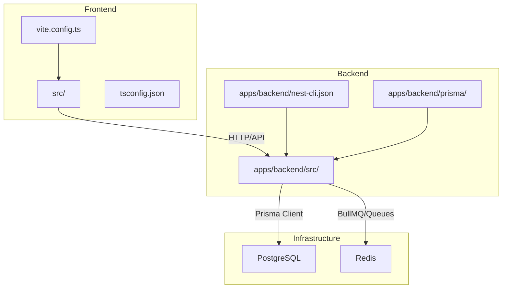
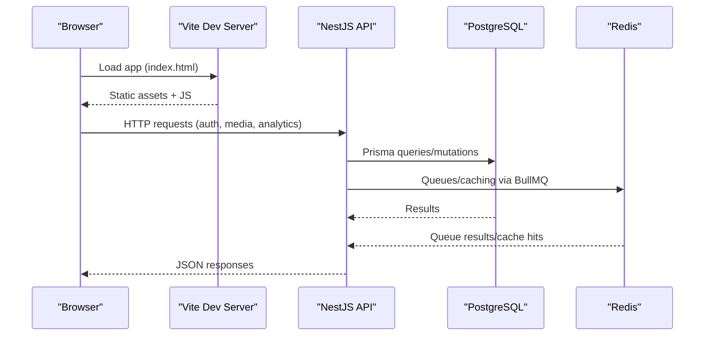

# Getting Started

<cite>
**Referenced Files in This Document**
- [README.md](file://README.md)
- [package.json](file://package.json)
- [bunfig.toml](file://bunfig.toml)
- [apps/backend/package.json](file://apps/backend/package.json)
- [apps/backend/nest-cli.json](file://apps/backend/nest-cli.json)
- [apps/backend/prisma/schema.prisma](file://apps/backend/prisma/schema.prisma)
- [apps/backend/src/config/configuration.ts](file://apps/backend/src/config/configuration.ts)
- [apps/backend/src/config/env.validation.ts](file://apps/backend/src/config/env.validation.ts)
- [apps/backend/src/app.module.ts](file://apps/backend/src/app.module.ts)
- [apps/backend/src/main.ts](file://apps/backend/src/main.ts)
- [apps/backend/docker-compose.yml](file://apps/backend/docker-compose.yml)
- [apps/backend/Dockerfile.dev](file://apps/backend/Dockerfile.dev)
- [apps/backend/Dockerfile](file://apps/backend/Dockerfile)
- [src/server.ts](file://src/server.ts)
- [src/start.ts](file://src/start.ts)
- [vite.config.ts](file://vite.config.ts)
- [tsconfig.json](file://tsconfig.json)
- [.npmrc](file://.npmrc)
- [DEPLOYMENT-GUIDE.md](file://DEPLOYMENT-GUIDE.md)
- [docs/PRODUCTION.md](file://docs/PRODUCTION.md)
- [docs/DEPLOYMENT.md](file://docs/DEPLOYMENT.md)
</cite>

## Table of Contents
1. [Introduction](#introduction)
2. [Project Structure](#project-structure)
3. [Core Components](#core-components)
4. [Architecture Overview](#architecture-overview)
5. [Detailed Component Analysis](#detailed-component-analysis)
6. [Dependency Analysis](#dependency-analysis)
7. [Performance Considerations](#performance-considerations)
8. [Troubleshooting Guide](#troubleshooting-guide)
9. [Conclusion](#conclusion)
10. [Appendices](#appendices)

## Introduction
Chronicle Your Media Story is a personal media journaling and analytics platform that helps you capture, reflect on, and analyze your media experiences over time. It combines a modern React frontend with a NestJS backend to provide rich insights, collections, journaling, and discovery features tailored to your media journey.

This guide will help you set up the project locally for development or production, configure your database (PostgreSQL), Redis, environment variables, run migrations, and complete first-time user onboarding.

## Project Structure
The repository follows a monorepo layout:
- Frontend: React application built with Vite and TypeScript
- Backend: NestJS API server with Prisma ORM, BullMQ queues, and Redis
- Shared configuration and tooling at the root level

**Diagram sources**
- [vite.config.ts](file://vite.config.ts)
- [tsconfig.json](file://tsconfig.json)
- [apps/backend/nest-cli.json](file://apps/backend/nest-cli.json)
- [apps/backend/prisma/schema.prisma](file://apps/backend/prisma/schema.prisma)
- [apps/backend/src/app.module.ts](file://apps/backend/src/app.module.ts)

**Section sources**
- [README.md](file://README.md)
- [package.json](file://package.json)
- [bunfig.toml](file://bunfig.toml)
- [apps/backend/package.json](file://apps/backend/package.json)
- [apps/backend/nest-cli.json](file://apps/backend/nest-cli.json)
- [apps/backend/prisma/schema.prisma](file://apps/backend/prisma/schema.prisma)
- [src/server.ts](file://src/server.ts)
- [src/start.ts](file://src/start.ts)
- [vite.config.ts](file://vite.config.ts)
- [tsconfig.json](file://tsconfig.json)

## Core Components
- Frontend (React + Vite): Serves the UI, routes, and client-side logic.
- Backend (NestJS): REST APIs, authentication, media handling, analytics, journaling, collections, search, notifications, and more.
- Database (PostgreSQL): Relational data model managed by Prisma.
- Cache/Queues (Redis): Used by BullMQ for background jobs and caching.

Key runtime entry points:
- Frontend start: [src/start.ts](file://src/start.ts)
- Backend main: [apps/backend/src/main.ts](file://apps/backend/src/main.ts)
- Application module: [apps/backend/src/app.module.ts](file://apps/backend/src/app.module.ts)

**Section sources**
- [src/start.ts](file://src/start.ts)
- [apps/backend/src/main.ts](file://apps/backend/src/main.ts)
- [apps/backend/src/app.module.ts](file://apps/backend/src/app.module.ts)

## Architecture Overview
High-level flow from browser to services:

**Diagram sources**
- [apps/backend/src/main.ts](file://apps/backend/src/main.ts)
- [apps/backend/src/app.module.ts](file://apps/backend/src/app.module.ts)
- [apps/backend/prisma/schema.prisma](file://apps/backend/prisma/schema.prisma)

## Detailed Component Analysis

### Environment Configuration
- Backend configuration loader and validation are defined in:
  - [apps/backend/src/config/configuration.ts](file://apps/backend/src/config/configuration.ts)
  - [apps/backend/src/config/env.validation.ts](file://apps/backend/src/config/env.validation.ts)
- These files define required environment variables for database, Redis, JWT, storage, and feature flags.

Typical environment variables include:
- DATABASE_URL: PostgreSQL connection string
- REDIS_URL: Redis connection URL
- JWT_SECRET, JWT_EXPIRES_IN: Authentication tokens
- STORAGE_*: Storage provider settings (e.g., local or cloud)
- APP_*: App-specific toggles and URLs

Ensure these are present before starting the backend.

**Section sources**
- [apps/backend/src/config/configuration.ts](file://apps/backend/src/config/configuration.ts)
- [apps/backend/src/config/env.validation.ts](file://apps/backend/src/config/env.validation.ts)

### Database Setup (PostgreSQL)
- Schema and migrations live under [apps/backend/prisma/schema.prisma](file://apps/backend/prisma/schema.prisma).
- Use Prisma CLI to generate client and apply migrations after setting DATABASE_URL.

Steps:
1. Start PostgreSQL locally or use Docker Compose.
2. Create a database and set DATABASE_URL.
3. Generate Prisma client and run migrations.
4. Seed demo data if desired.

Docker Compose for infrastructure is available at:
- [apps/backend/docker-compose.yml](file://apps/backend/docker-compose.yml)

**Section sources**
- [apps/backend/prisma/schema.prisma](file://apps/backend/prisma/schema.prisma)
- [apps/backend/docker-compose.yml](file://apps/backend/docker-compose.yml)

### Redis Setup
- Redis is used by BullMQ for job queues and caching.
- Configure REDIS_URL to point to your Redis instance.
- For local development, use the provided Docker Compose service.

**Section sources**
- [apps/backend/docker-compose.yml](file://apps/backend/docker-compose.yml)
- [apps/backend/src/config/env.validation.ts](file://apps/backend/src/config/env.validation.ts)

### Backend Development Workflow
- Entry point: [apps/backend/src/main.ts](file://apps/backend/src/main.ts)
- Module bootstrap: [apps/backend/src/app.module.ts](file://apps/backend/src/app.module.ts)
- Nest CLI config: [apps/backend/nest-cli.json](file://apps/backend/nest-cli.json)
- Package scripts: [apps/backend/package.json](file://apps/backend/package.json)

Common commands:
- Install dependencies
- Build
- Run dev server
- Run migrations
- Seed demo data

**Section sources**
- [apps/backend/src/main.ts](file://apps/backend/src/main.ts)
- [apps/backend/src/app.module.ts](file://apps/backend/src/app.module.ts)
- [apps/backend/nest-cli.json](file://apps/backend/nest-cli.json)
- [apps/backend/package.json](file://apps/backend/package.json)

### Frontend Development Workflow
- Entry point: [src/start.ts](file://src/start.ts)
- Vite config: [vite.config.ts](file://vite.config.ts)
- TypeScript config: [tsconfig.json](file://tsconfig.json)
- NPM registry config: [.npmrc](file://.npmrc)

Common commands:
- Install dependencies
- Start dev server
- Build for production

**Section sources**
- [src/start.ts](file://src/start.ts)
- [vite.config.ts](file://vite.config.ts)
- [tsconfig.json](file://tsconfig.json)
- [.npmrc](file://.npmrc)

### Dockerized Development
- Backend dev image: [apps/backend/Dockerfile.dev](file://apps/backend/Dockerfile.dev)
- Backend prod image: [apps/backend/Dockerfile](file://apps/backend/Dockerfile)
- Compose file for local infra: [apps/backend/docker-compose.yml](file://apps/backend/docker-compose.yml)

Use Docker Compose to spin up PostgreSQL and Redis, then run the backend and frontend containers.

**Section sources**
- [apps/backend/Dockerfile.dev](file://apps/backend/Dockerfile.dev)
- [apps/backend/Dockerfile](file://apps/backend/Dockerfile)
- [apps/backend/docker-compose.yml](file://apps/backend/docker-compose.yml)

## Dependency Analysis
- Node.js/Bun compatibility is configured at the root and per-app package manifests.
- Root package manager configuration:
  - [package.json](file://package.json)
  - [bunfig.toml](file://bunfig.toml)
  - [.npmrc](file://.npmrc)
- Backend dependencies and scripts:
  - [apps/backend/package.json](file://apps/backend/package.json)
- Frontend dependencies and scripts:
  - [package.json](file://package.json)

Ensure your chosen runtime (Node.js or Bun) matches the versions expected by the workspace configuration.

**Section sources**
- [package.json](file://package.json)
- [bunfig.toml](file://bunfig.toml)
- [.npmrc](file://.npmrc)
- [apps/backend/package.json](file://apps/backend/package.json)

## Performance Considerations
- Enable Redis for caching and background jobs to offload heavy tasks.
- Use Prisma query optimization and indexes defined in the schema.
- Serve static assets via CDN in production.
- Monitor health endpoints and metrics exposed by the backend.

[No sources needed since this section provides general guidance]

## Troubleshooting Guide
Common setup issues and resolutions:

- Cannot connect to PostgreSQL
  - Verify DATABASE_URL format and credentials.
  - Ensure the database exists and the user has permissions.
  - Confirm the service is reachable from the backend container/process.

- Redis connection errors
  - Check REDIS_URL and network reachability.
  - Validate Redis auth and port settings.

- Migrations fail
  - Ensure the database schema is compatible with current migrations.
  - Reset the database if necessary and re-run migrations.

- Frontend cannot reach backend
  - Verify CORS settings and proxy configuration in Vite.
  - Confirm backend is running and accessible on the expected host/port.

- Permission or lockfile issues
  - Clear node_modules and reinstall.
  - If using Bun, ensure bun.lock is consistent; otherwise use npm/yarn/pnpm.

For additional operational guidance, see:
- [DEPLOYMENT-GUIDE.md](file://DEPLOYMENT-GUIDE.md)
- [docs/PRODUCTION.md](file://docs/PRODUCTION.md)
- [docs/DEPLOYMENT.md](file://docs/DEPLOYMENT.md)

**Section sources**
- [DEPLOYMENT-GUIDE.md](file://DEPLOYMENT-GUIDE.md)
- [docs/PRODUCTION.md](file://docs/PRODUCTION.md)
- [docs/DEPLOYMENT.md](file://docs/DEPLOYMENT.md)

## Conclusion
You now have the essentials to install, configure, and run Chronicle Your Media Story locally. With PostgreSQL and Redis ready, environment variables set, and migrations applied, you can start the backend and frontend, then proceed with first-time user onboarding. Refer to the troubleshooting section for common pitfalls and consult the deployment docs for production readiness.

[No sources needed since this section summarizes without analyzing specific files]

## Appendices

### Installation Requirements
- Runtime: Node.js (LTS) or Bun
- Database: PostgreSQL
- Cache/Queue: Redis
- Tools: Git, Docker (optional but recommended)

### Step-by-Step Setup (Development)
1. Clone the repository and navigate to the root.
2. Install dependencies using your preferred package manager.
3. Start PostgreSQL and Redis (use Docker Compose or local installs).
4. Create a .env file with required variables (DATABASE_URL, REDIS_URL, JWT secrets, etc.).
5. Generate Prisma client and run migrations.
6. Seed demo data (optional).
7. Start the backend dev server.
8. Start the frontend dev server.
9. Open the app in your browser and complete onboarding.

### Step-by-Step Setup (Production)
1. Provision PostgreSQL and Redis instances.
2. Set environment variables in your hosting environment.
3. Build the backend and frontend.
4. Run migrations in the deployed environment.
5. Start the backend process and serve the frontend via a web server or container orchestrator.
6. Configure reverse proxy, TLS, and monitoring.

### First-Time User Onboarding
- After starting the app, create an account and follow the guided onboarding flow.
- Explore dashboard, library, journal, and analytics sections.
- Add your first media entries and start tracking progress.

### Useful Commands
- Backend:
  - Install dependencies
  - Build
  - Run dev server
  - Generate Prisma client
  - Apply migrations
  - Seed demo data
- Frontend:
  - Install dependencies
  - Start dev server
  - Build for production

[No sources needed since this section provides general guidance]