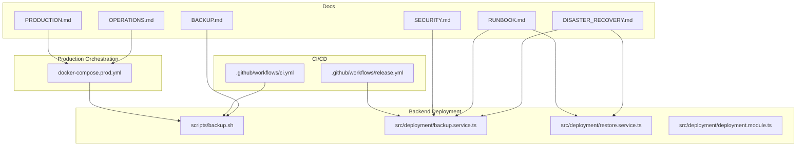
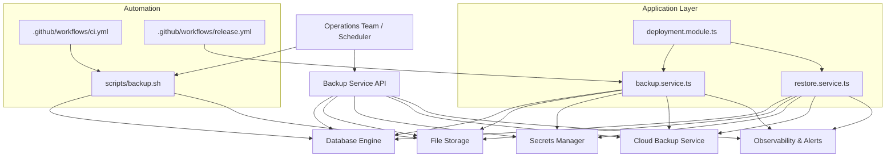
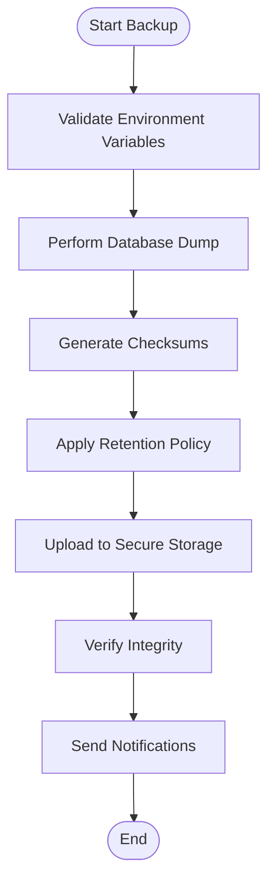
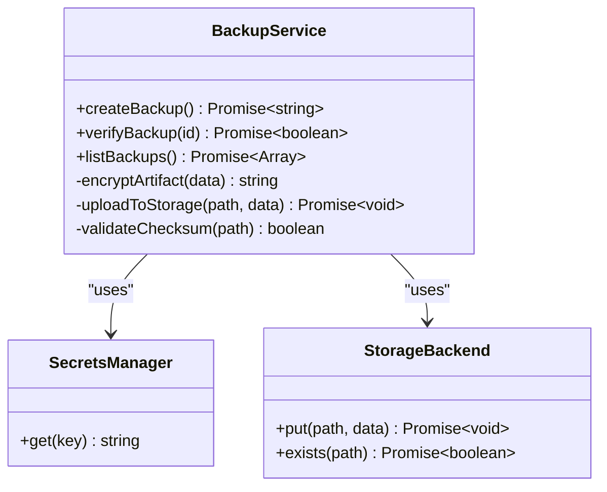
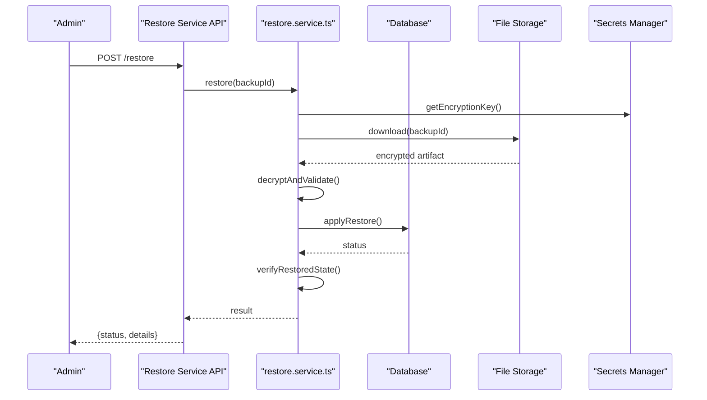
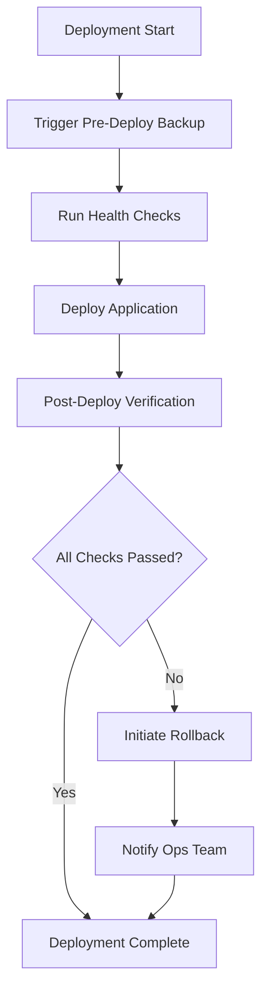
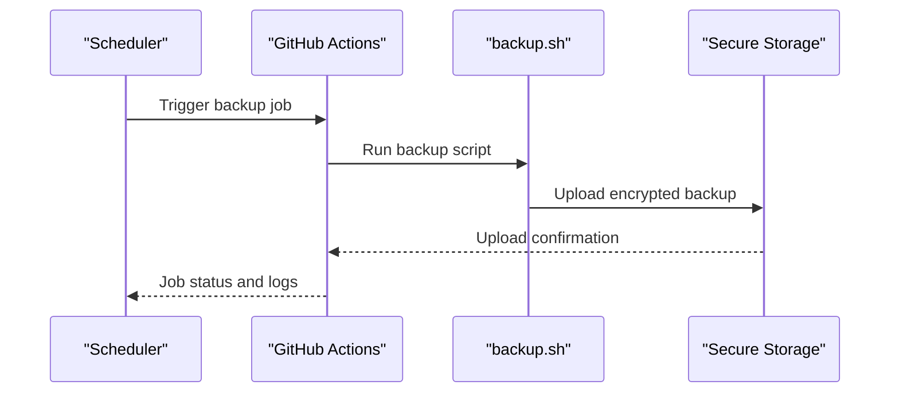
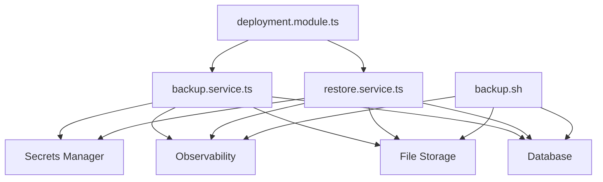

# Backup & Disaster Recovery

<cite>
**Referenced Files in This Document**
- [BACKUP.md](file://docs/BACKUP.md)
- [DISASTER_RECOVERY.md](file://docs/DISASTER_RECOVERY.md)
- [OPERATIONS.md](file://docs/OPERATIONS.md)
- [PRODUCTION.md](file://docs/PRODUCTION.md)
- [RUNBOOK.md](file://docs/RUNBOOK.md)
- [SECURITY.md](file://docs/SECURITY.md)
- [backup.sh](file://apps/backend/scripts/backup.sh)
- [backup.service.ts](file://apps/backend/src/deployment/backup.service.ts)
- [restore.service.ts](file://apps/backend/src/deployment/restore.service.ts)
- [deployment.module.ts](file://apps/backend/src/deployment/deployment.module.ts)
- [docker-compose.prod.yml](file://apps/backend/docker-compose.prod.yml)
- [ci.yml](file://.github/workflows/ci.yml)
- [release.yml](file://.github/workflows/release.yml)
</cite>

## Table of Contents
1. [Introduction](#introduction)
2. [Project Structure](#project-structure)
3. [Core Components](#core-components)
4. [Architecture Overview](#architecture-overview)
5. [Detailed Component Analysis](#detailed-component-analysis)
6. [Dependency Analysis](#dependency-analysis)
7. [Performance Considerations](#performance-considerations)
8. [Troubleshooting Guide](#troubleshooting-guide)
9. [Conclusion](#conclusion)
10. [Appendices](#appendices)

## Introduction
This document provides comprehensive backup and disaster recovery guidance for Chronicle Your Media Story. It covers automated backup strategies for databases, file storage, and application configuration; scheduling and retention policies; verification procedures; disaster recovery planning; failover mechanisms; data restoration processes; RTO/RPO definitions; testing procedures; recovery validation steps; cloud backup services integration; encryption at rest; and compliance requirements. The content synthesizes operational documentation and code-level components present in the repository to ensure a consistent, actionable approach to data protection and resilience.

## Project Structure
The project includes dedicated operational documentation under docs/ and backend deployment utilities under apps/backend/. Key areas relevant to backup and disaster recovery include:
- Operational guides: BACKUP.md, DISASTER_RECOVERY.md, OPERATIONS.md, PRODUCTION.md, RUNBOOK.md, SECURITY.md
- Backend scripts and services: apps/backend/scripts/backup.sh and apps/backend/src/deployment/* (backup and restore services, deployment module)
- CI/CD workflows: .github/workflows/ci.yml and release.yml
- Production orchestration: apps/backend/docker-compose.prod.yml

**Diagram sources**
- [BACKUP.md](file://docs/BACKUP.md)
- [DISASTER_RECOVERY.md](file://docs/DISASTER_RECOVERY.md)
- [OPERATIONS.md](file://docs/OPERATIONS.md)
- [PRODUCTION.md](file://docs/PRODUCTION.md)
- [RUNBOOK.md](file://docs/RUNBOOK.md)
- [SECURITY.md](file://docs/SECURITY.md)
- [backup.sh](file://apps/backend/scripts/backup.sh)
- [backup.service.ts](file://apps/backend/src/deployment/backup.service.ts)
- [restore.service.ts](file://apps/backend/src/deployment/restore.service.ts)
- [deployment.module.ts](file://apps/backend/src/deployment/deployment.module.ts)
- [docker-compose.prod.yml](file://apps/backend/docker-compose.prod.yml)
- [ci.yml](file://.github/workflows/ci.yml)
- [release.yml](file://.github/workflows/release.yml)

**Section sources**
- [BACKUP.md](file://docs/BACKUP.md)
- [DISASTER_RECOVERY.md](file://docs/DISASTER_RECOVERY.md)
- [OPERATIONS.md](file://docs/OPERATIONS.md)
- [PRODUCTION.md](file://docs/PRODUCTION.md)
- [RUNBOOK.md](file://docs/RUNBOOK.md)
- [SECURITY.md](file://docs/SECURITY.md)
- [backup.sh](file://apps/backend/scripts/backup.sh)
- [backup.service.ts](file://apps/backend/src/deployment/backup.service.ts)
- [restore.service.ts](file://apps/backend/src/deployment/restore.service.ts)
- [deployment.module.ts](file://apps/backend/src/deployment/deployment.module.ts)
- [docker-compose.prod.yml](file://apps/backend/docker-compose.prod.yml)
- [ci.yml](file://.github/workflows/ci.yml)
- [release.yml](file://.github/workflows/release.yml)

## Core Components
- Backup script: A shell-based automation located in the backend scripts directory that performs database backups and can be integrated into CI/CD or system schedulers.
- Backup service: A TypeScript service implementing programmatic backup logic within the NestJS application layer, enabling API-driven or scheduled backups.
- Restore service: A TypeScript service providing restoration capabilities to recover from backups with validation and rollback safeguards.
- Deployment module: Orchestrates deployment-related operations, including backup and restore hooks, environment validation, and health checks.
- Operational documentation: Centralized references for backup, disaster recovery, production runbooks, and security practices.

Key responsibilities:
- Automated snapshotting of database state and file storage metadata
- Secure handling of credentials and encryption keys
- Retention policy enforcement and lifecycle management
- Verification and integrity checks post-backup
- Restoration workflows with validation and rollback support

**Section sources**
- [backup.sh](file://apps/backend/scripts/backup.sh)
- [backup.service.ts](file://apps/backend/src/deployment/backup.service.ts)
- [restore.service.ts](file://apps/backend/src/deployment/restore.service.ts)
- [deployment.module.ts](file://apps/backend/src/deployment/deployment.module.ts)
- [BACKUP.md](file://docs/BACKUP.md)
- [DISASTER_RECOVERY.md](file://docs/DISASTER_RECOVERY.md)
- [OPERATIONS.md](file://docs/OPERATIONS.md)
- [PRODUCTION.md](file://docs/PRODUCTION.md)
- [RUNBOOK.md](file://docs/RUNBOOK.md)
- [SECURITY.md](file://docs/SECURITY.md)

## Architecture Overview
The backup and disaster recovery architecture integrates application-layer services with operational scripts and CI/CD pipelines to ensure consistent, auditable, and repeatable data protection.

**Diagram sources**
- [backup.service.ts](file://apps/backend/src/deployment/backup.service.ts)
- [restore.service.ts](file://apps/backend/src/deployment/restore.service.ts)
- [deployment.module.ts](file://apps/backend/src/deployment/deployment.module.ts)
- [backup.sh](file://apps/backend/scripts/backup.sh)
- [ci.yml](file://.github/workflows/ci.yml)
- [release.yml](file://.github/workflows/release.yml)

## Detailed Component Analysis

### Backup Script (Shell Automation)
Purpose:
- Execute database dumps and optional file storage snapshots
- Generate checksums and metadata for integrity verification
- Support rotation and retention based on environment variables
- Integrate with CI/CD pipelines for scheduled runs

Operational considerations:
- Use least-privilege credentials scoped to backup targets
- Encrypt artifacts before upload to external storage
- Log outcomes and errors for auditability
- Validate output files and sizes post-completion

**Diagram sources**
- [backup.sh](file://apps/backend/scripts/backup.sh)

**Section sources**
- [backup.sh](file://apps/backend/scripts/backup.sh)

### Backup Service (TypeScript)
Purpose:
- Provide an API-driven backup mechanism within the NestJS application
- Coordinate database and file storage snapshots
- Enforce encryption and secure key management
- Trigger verification and reporting

Implementation patterns:
- Dependency injection for storage backends and secrets managers
- Transactional consistency where applicable
- Retry and idempotency guards for robustness
- Metrics and tracing for observability

**Diagram sources**
- [backup.service.ts](file://apps/backend/src/deployment/backup.service.ts)

**Section sources**
- [backup.service.ts](file://apps/backend/src/deployment/backup.service.ts)

### Restore Service (TypeScript)
Purpose:
- Restore database and file storage from verified backups
- Perform pre-restore validation and post-restore verification
- Support partial restores and selective recovery
- Ensure rollback capability in case of failure

Workflow highlights:
- Select target backup by ID or timestamp
- Decrypt artifacts using managed keys
- Apply database migrations if required
- Validate restored state against expected metrics

**Diagram sources**
- [restore.service.ts](file://apps/backend/src/deployment/restore.service.ts)

**Section sources**
- [restore.service.ts](file://apps/backend/src/deployment/restore.service.ts)

### Deployment Module (Orchestration)
Purpose:
- Coordinate backup and restore operations during deployments
- Validate environment readiness and dependencies
- Hook into CI/CD stages for automated safety checks

Responsibilities:
- Pre-deploy backup trigger
- Post-deploy health verification
- Rollback triggers on failure detection

**Diagram sources**
- [deployment.module.ts](file://apps/backend/src/deployment/deployment.module.ts)

**Section sources**
- [deployment.module.ts](file://apps/backend/src/deployment/deployment.module.ts)

### CI/CD Integration
Purpose:
- Schedule regular backups via CI jobs
- Gate releases with backup verification
- Enforce retention and cleanup policies

Key aspects:
- Cron-based triggers for periodic backups
- Artifact retention rules
- Failure notifications and retries

**Diagram sources**
- [ci.yml](file://.github/workflows/ci.yml)
- [backup.sh](file://apps/backend/scripts/backup.sh)

**Section sources**
- [ci.yml](file://.github/workflows/ci.yml)
- [release.yml](file://.github/workflows/release.yml)

### Production Orchestration
Purpose:
- Define runtime environments and dependencies for backup operations
- Ensure isolation and resource constraints for backup tasks
- Facilitate multi-environment consistency

Considerations:
- Separate volumes for persistent data and backups
- Network policies restricting access to storage endpoints
- Resource limits to prevent backup impact on live traffic

**Section sources**
- [docker-compose.prod.yml](file://apps/backend/docker-compose.prod.yml)

## Dependency Analysis
Backup and restore components depend on:
- Database engines for consistent snapshots
- File storage systems for media and assets
- Secrets managers for encryption keys and credentials
- Observability tools for logging and alerting
- CI/CD platforms for scheduling and execution

**Diagram sources**
- [backup.service.ts](file://apps/backend/src/deployment/backup.service.ts)
- [restore.service.ts](file://apps/backend/src/deployment/restore.service.ts)
- [backup.sh](file://apps/backend/scripts/backup.sh)
- [deployment.module.ts](file://apps/backend/src/deployment/deployment.module.ts)

**Section sources**
- [backup.service.ts](file://apps/backend/src/deployment/backup.service.ts)
- [restore.service.ts](file://apps/backend/src/deployment/restore.service.ts)
- [backup.sh](file://apps/backend/scripts/backup.sh)
- [deployment.module.ts](file://apps/backend/src/deployment/deployment.module.ts)

## Performance Considerations
- Schedule backups during low-traffic windows to minimize impact
- Use incremental or differential backups where supported
- Compress artifacts to reduce storage and transfer costs
- Parallelize uploads to high-throughput storage backends
- Monitor CPU, memory, and I/O usage during backup operations
- Implement backpressure and throttling to protect primary workloads

[No sources needed since this section provides general guidance]

## Troubleshooting Guide
Common issues and resolutions:
- Backup failures due to insufficient permissions: Review credential scopes and network policies
- Encryption key retrieval errors: Validate secrets manager connectivity and key availability
- Storage upload timeouts: Adjust retry policies and network configurations
- Restore validation failures: Inspect checksum mismatches and schema drift
- Observability gaps: Ensure logging and metrics are enabled and forwarded

Verification steps:
- Confirm backup artifacts exist and are non-empty
- Validate checksums and signatures
- Test restore in isolated environments prior to production use
- Review logs for errors and warnings

**Section sources**
- [RUNBOOK.md](file://docs/RUNBOOK.md)
- [SECURITY.md](file://docs/SECURITY.md)

## Conclusion
Chronicle Your Media Story’s backup and disaster recovery strategy combines application-layer services, operational scripts, and CI/CD automation to deliver resilient, verifiable, and compliant data protection. By adhering to defined RTO/RPO targets, enforcing retention policies, integrating cloud backup services, encrypting at rest, and following rigorous testing and validation procedures, the platform ensures business continuity and regulatory compliance. Continuous monitoring, incident response playbooks, and periodic drills further strengthen operational readiness.

[No sources needed since this section summarizes without analyzing specific files]

## Appendices

### RTO/RPO Definitions
- Recovery Time Objective (RTO): Maximum acceptable downtime after a disruption
- Recovery Point Objective (RPO): Maximum acceptable data loss measured in time

[No sources needed since this section provides general guidance]

### Backup Scheduling and Retention Policies
- Frequency: Daily full backups with hourly incremental snapshots
- Retention: Keep daily backups for 7 days, weekly for 4 weeks, monthly for 12 months
- Rotation: Automated cleanup based on retention rules
- Offsite replication: Cross-region or cross-provider redundancy

[No sources needed since this section provides general guidance]

### Verification Procedures
- Checksum validation for all artifacts
- Spot-check database integrity using read-only queries
- Validate file storage metadata and object counts
- Smoke tests on restored environments

[No sources needed since this section provides general guidance]

### Disaster Recovery Planning
- Failover mechanisms: Active-passive or active-active depending on criticality
- Data restoration processes: Step-by-step runbooks with validation checkpoints
- Communication plans: Stakeholder notifications and escalation paths
- Post-recovery audits: Root cause analysis and remediation tracking

[No sources needed since this section provides general guidance]

### Cloud Backup Services Integration
- Supported providers: Object storage with server-side encryption
- IAM roles and policies: Least privilege access for backup and restore
- Lifecycle policies: Automated tiering and expiration
- Compliance features: Audit logs and data residency controls

[No sources needed since this section provides general guidance]

### Encryption at Rest
- Algorithm selection: AES-256 or equivalent standard
- Key management: Centralized secrets manager with rotation
- Access control: Role-based access to encryption keys
- Audit trails: Logging key usage and access events

[No sources needed since this section provides general guidance]

### Compliance Requirements
- Data protection regulations: GDPR, CCPA, HIPAA as applicable
- Retention and deletion policies aligned with legal obligations
- Auditability: Immutable logs and change tracking
- Security assessments: Regular penetration testing and vulnerability scans

[No sources needed since this section provides general guidance]