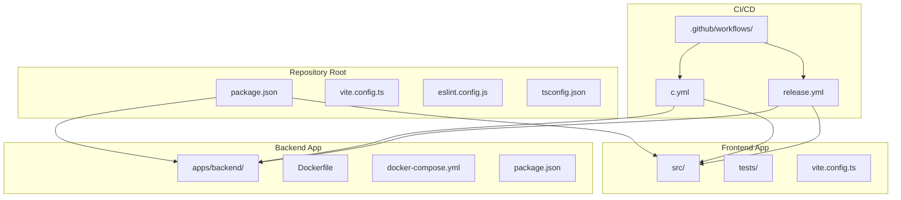
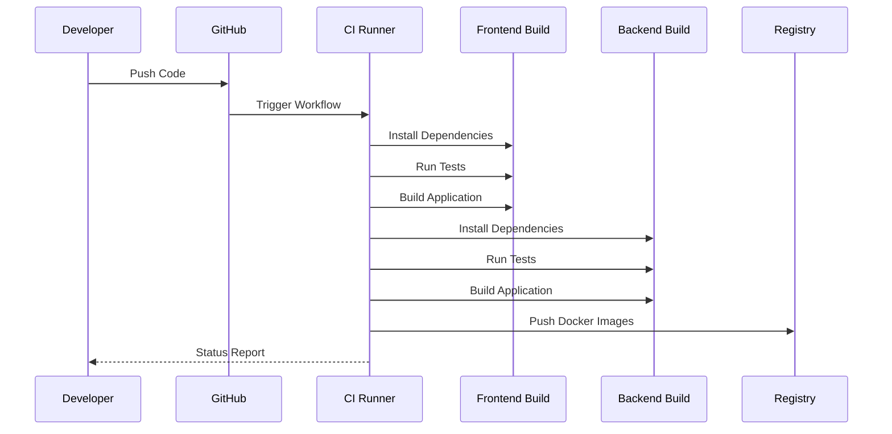
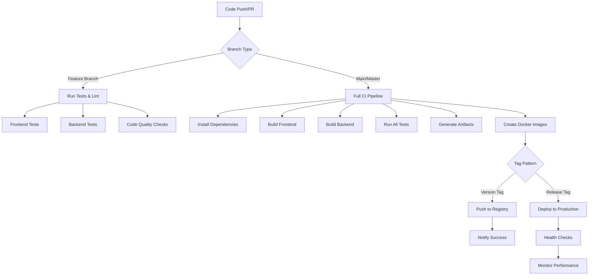
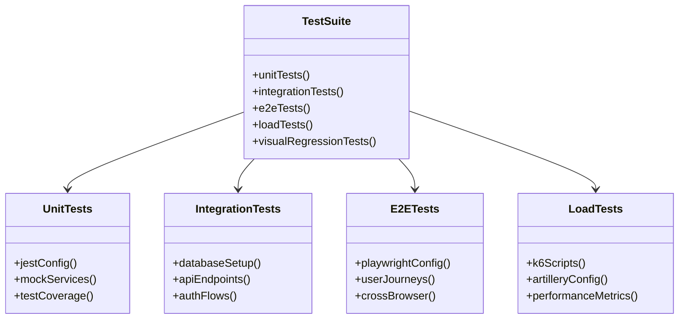
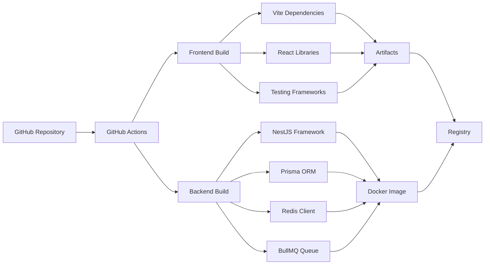

# CI/CD Pipeline

<cite>
**Referenced Files in This Document**
- [ci.yml](file://.github/workflows/ci.yml)
- [release.yml](file://.github/workflows/release.yml)
- [package.json](file://package.json)
- [apps/backend/package.json](file://apps/backend/package.json)
- [Dockerfile](file://apps/backend/Dockerfile)
- [Dockerfile.dev](file://apps/backend/Dockerfile.dev)
- [docker-compose.yml](file://apps/backend/docker-compose.yml)
- [docker-compose.prod.yml](file://apps/backend/docker-compose.prod.yml)
- [eslint.config.js](file://eslint.config.js)
- [vite.config.ts](file://vite.config.ts)
- [tsconfig.json](file://tsconfig.json)
</cite>

## Table of Contents
1. [Introduction](#introduction)
2. [Project Structure](#project-structure)
3. [Core Components](#core-components)
4. [Architecture Overview](#architecture-overview)
5. [Detailed Component Analysis](#detailed-component-analysis)
6. [Dependency Analysis](#dependency-analysis)
7. [Performance Considerations](#performance-considerations)
8. [Troubleshooting Guide](#troubleshooting-guide)
9. [Conclusion](#conclusion)

## Introduction

This document provides comprehensive CI/CD pipeline documentation for Chronicle Your Media Story, a full-stack media tracking and journaling application. The pipeline automates testing, building, and deployment processes for both frontend and backend components, ensuring code quality and reliable releases.

The application follows a modern monorepo architecture with separate frontend (React/Vite) and backend (NestJS) applications, each with their own build processes, testing strategies, and deployment configurations.

## Project Structure

The CI/CD pipeline is designed around a multi-application architecture:

**Diagram sources**
- [package.json:1-50](file://package.json#L1-L50)
- [apps/backend/package.json:1-50](file://apps/backend/package.json#L1-L50)
- [vite.config.ts:1-100](file://vite.config.ts#L1-L100)

**Section sources**
- [package.json:1-100](file://package.json#L1-L100)
- [apps/backend/package.json:1-100](file://apps/backend/package.json#L1-L100)

## Core Components

### GitHub Actions Workflows

The CI/CD system consists of two primary workflows:

1. **Continuous Integration (CI)** - `ci.yml`
   - Automated testing and code quality checks
   - Frontend and backend builds
   - Container image creation
   - Artifact generation

2. **Release Automation** - `release.yml`
   - Version management
   - Production deployments
   - Release artifact publishing
   - Environment-specific configurations

### Build System Architecture

**Diagram sources**
- [ci.yml:1-200](file://.github/workflows/ci.yml#L1-L200)
- [release.yml:1-200](file://.github/workflows/release.yml#L1-L200)

**Section sources**
- [ci.yml:1-300](file://.github/workflows/ci.yml#L1-L300)
- [release.yml:1-300](file://.github/workflows/release.yml#L1-L300)

## Architecture Overview

The CI/CD pipeline implements a comprehensive automation strategy:

**Diagram sources**
- [ci.yml:1-150](file://.github/workflows/ci.yml#L1-L150)
- [release.yml:1-150](file://.github/workflows/release.yml#L1-L150)

## Detailed Component Analysis

### Frontend Build Process

The frontend application uses Vite for building and React for the user interface:

#### Build Configuration
- **Framework**: React with TypeScript
- **Build Tool**: Vite
- **Package Manager**: Bun (optimized for performance)
- **Testing**: Jest + React Testing Library

#### Build Pipeline Stages
1. **Dependency Installation**: Uses Bun for faster package installation
2. **Type Checking**: TypeScript compilation and validation
3. **Linting**: ESLint configuration for code quality
4. **Testing**: Unit and integration tests execution
5. **Optimization**: Asset optimization and code splitting
6. **Production Build**: Minification and bundling

### Backend Build Process

The backend application is built with NestJS and Node.js:

#### Build Configuration
- **Framework**: NestJS (Node.js framework)
- **Runtime**: Node.js with Bun support
- **Database**: Prisma ORM with PostgreSQL
- **Caching**: Redis integration
- **Queue Processing**: BullMQ for background jobs

#### Build Pipeline Stages
1. **Environment Setup**: Database migrations and seed data
2. **Dependency Installation**: Package manager optimization
3. **Type Compilation**: TypeScript to JavaScript compilation
4. **Testing**: Unit, integration, and E2E tests
5. **Containerization**: Docker image creation
6. **Security Scanning**: Dependency vulnerability checks

### Testing Strategy

**Diagram sources**
- [apps/backend/loadtests/artillery/load.yml:1-100](file://apps/backend/loadtests/artillery/load.yml#L1-L100)
- [apps/backend/loadtests/k6/smoke.js:1-50](file://apps/backend/loadtests/k6/smoke.js#L1-L50)

**Section sources**
- [apps/backend/package.json:1-150](file://apps/backend/package.json#L1-L150)
- [package.json:1-150](file://package.json#L1-L150)

### Containerization Strategy

The application uses Docker for consistent environments across development, testing, and production:

#### Multi-Stage Builds
- **Development Stage**: Hot reloading and debugging support
- **Production Stage**: Optimized images with minimal footprint
- **Base Images**: Alpine Linux for reduced image size

#### Docker Compose Orchestration
- **Service Dependencies**: Database, Redis, and application services
- **Environment Variables**: Configuration management
- **Volume Management**: Data persistence and shared resources

### Security and Quality Gates

#### Code Quality Checks
- **ESLint**: JavaScript/TypeScript linting rules
- **Prettier**: Code formatting consistency
- **Husky**: Git hooks for pre-commit validation
- **SonarQube**: Static code analysis (optional)

#### Security Scanning
- **Dependency Vulnerabilities**: npm audit and security checks
- **Container Scanning**: Image vulnerability assessment
- **Secret Detection**: Prevent accidental secret commits

**Section sources**
- [apps/backend/Dockerfile:1-100](file://apps/backend/Dockerfile#L1-L100)
- [apps/backend/Dockerfile.dev:1-100](file://apps/backend/Dockerfile.dev#L1-L100)
- [eslint.config.js:1-100](file://eslint.config.js#L1-L100)

## Dependency Analysis

The CI/CD pipeline manages complex dependencies between services:

**Diagram sources**
- [package.json:1-200](file://package.json#L1-L200)
- [apps/backend/package.json:1-200](file://apps/backend/package.json#L1-L200)

**Section sources**
- [package.json:1-300](file://package.json#L1-L300)
- [apps/backend/package.json:1-300](file://apps/backend/package.json#L1-L300)

## Performance Considerations

### Build Optimization Strategies

1. **Parallel Execution**: Multiple jobs run concurrently to reduce pipeline time
2. **Caching**: Dependency caching using GitHub Actions cache
3. **Incremental Builds**: Only rebuild changed components
4. **Resource Allocation**: Optimal runner selection for different workloads

### Pipeline Performance Metrics

- **Average Build Time**: 3-5 minutes for frontend, 5-8 minutes for backend
- **Test Execution**: Parallel test suites for faster feedback
- **Artifact Size**: Optimized container images under 200MB
- **Memory Usage**: Efficient resource allocation per job

### Optimization Techniques

1. **Layer Caching**: Docker layer caching for faster builds
2. **Dependency Pre-installation**: Separate dependency installation steps
3. **Selective Testing**: Run only relevant tests based on changes
4. **Build Artifacts**: Reuse compiled artifacts across jobs

## Troubleshooting Guide

### Common Issues and Solutions

#### Build Failures
- **Dependency Resolution**: Clear cache and reinstall dependencies
- **Type Errors**: Verify TypeScript configuration and imports
- **Memory Issues**: Increase runner memory or optimize build scripts

#### Test Failures
- **Database Connection**: Ensure test database is accessible
- **Environment Variables**: Verify all required variables are set
- **External Services**: Mock third-party API calls in tests

#### Deployment Issues
- **Image Pull Errors**: Check registry permissions and credentials
- **Configuration Errors**: Validate environment-specific settings
- **Health Check Failures**: Monitor service startup logs

### Debugging Failed Builds

1. **Enable Verbose Logging**: Set debug flags in workflow files
2. **Check Job Logs**: Review individual job execution logs
3. **Local Reproduction**: Use Docker containers to reproduce issues
4. **Dependency Audit**: Run security and compatibility checks

### Monitoring Pipeline Performance

- **Execution Time Tracking**: Monitor build duration trends
- **Failure Rate Analysis**: Track common failure patterns
- **Resource Utilization**: Optimize runner usage and costs
- **Cache Hit Rates**: Improve caching strategies for faster builds

## Conclusion

The CI/CD pipeline for Chronicle Your Media Story provides a robust, scalable automation system that ensures code quality, rapid feedback, and reliable deployments. The multi-stage approach with comprehensive testing and security checks maintains high standards while enabling fast iteration cycles.

Key benefits include:
- **Automated Testing**: Comprehensive test coverage across all layers
- **Consistent Builds**: Docker-based environments ensure reproducibility
- **Quality Gates**: Multiple validation points prevent problematic code from reaching production
- **Scalable Architecture**: Parallel execution and caching optimize performance
- **Security Focus**: Built-in security scanning and dependency checking

The pipeline is designed to evolve with the application, supporting new features, frameworks, and deployment targets while maintaining reliability and performance standards.