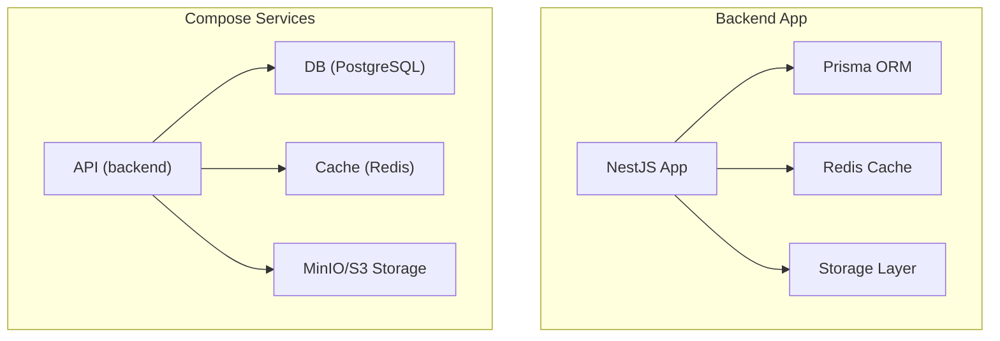
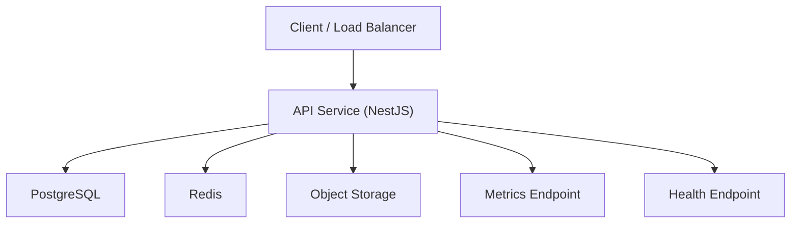
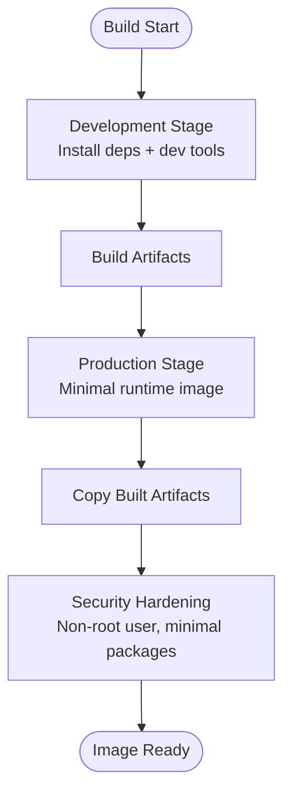
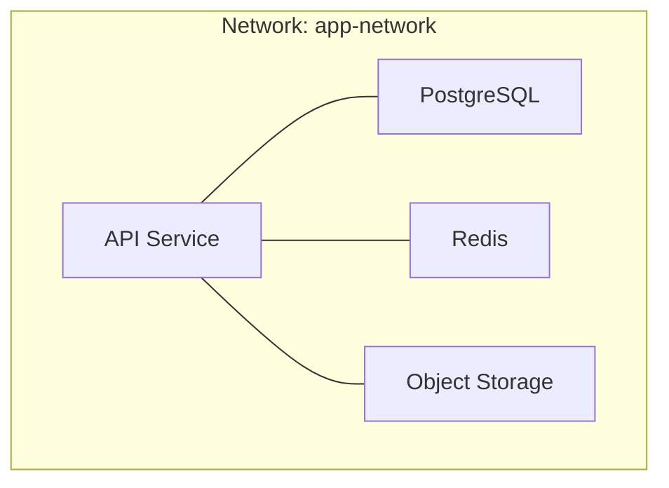
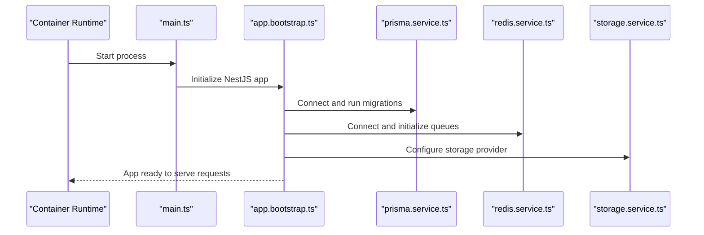
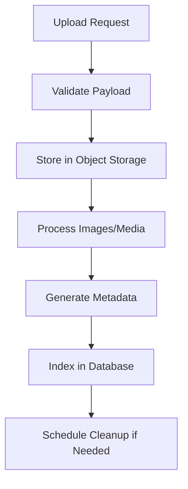
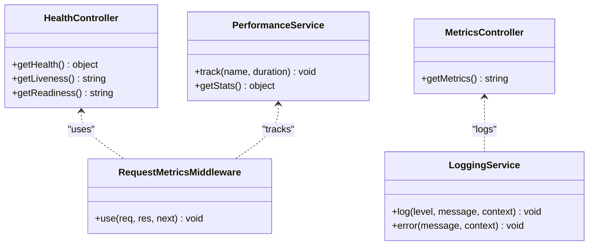
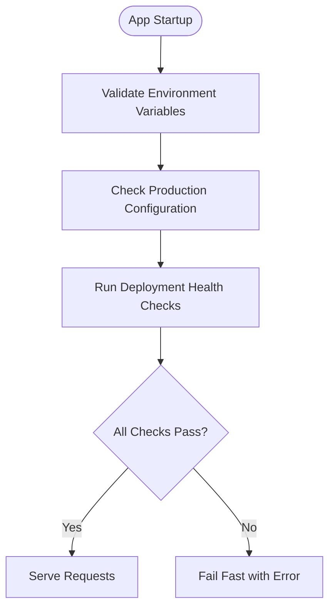
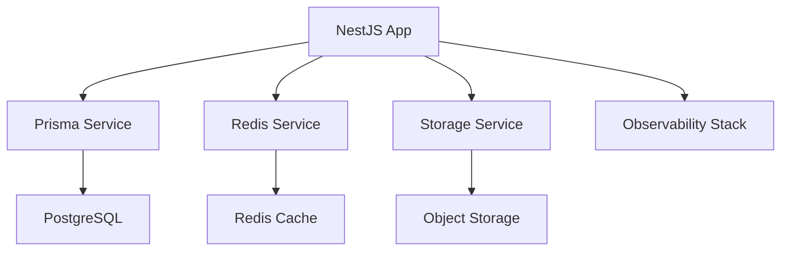

# Containerization & Docker

<cite>
**Referenced Files in This Document**
- [Dockerfile](file://apps/backend/Dockerfile)
- [Dockerfile.dev](file://apps/backend/Dockerfile.dev)
- [docker-compose.yml](file://apps/backend/docker-compose.yml)
- [docker-compose.dev.yml](file://apps/backend/docker-compose.dev.yml)
- [docker-compose.prod.yml](file://apps/backend/docker-compose.prod.yml)
- [docker-compose.e2e.yml](file://docker-compose.e2e.yml)
- [package.json](file://apps/backend/package.json)
- [tsconfig.build.json](file://apps/backend/tsconfig.build.json)
- [main.ts](file://apps/backend/src/main.ts)
- [app.bootstrap.ts](file://apps/backend/src/app.bootstrap.ts)
- [configuration.ts](file://apps/backend/src/config/configuration.ts)
- [env.validation.ts](file://apps/backend/src/config/env.validation.ts)
- [prisma.service.ts](file://apps/backend/src/prisma/prisma.service.ts)
- [redis.service.ts](file://apps/backend/src/redis/redis.service.ts)
- [storage.service.ts](file://apps/backend/src/storage/storage.service.ts)
- [upload.service.ts](file://apps/backend/src/storage/upload.service.ts)
- [image.service.ts](file://apps/backend/src/storage/image.service.ts)
- [media-cleanup.service.ts](file://apps/backend/src/storage/media-cleanup.service.ts)
- [health.controller.ts](file://apps/backend/src/health/health.controller.ts)
- [metrics.controller.ts](file://apps/backend/src/observability/metrics.controller.ts)
- [logging.service.ts](file://apps/backend/src/observability/logging.service.ts)
- [performance.service.ts](file://apps/backend/src/observability/performance.service.ts)
- [request-metrics.middleware.ts](file://apps/backend/src/observability/request-metrics.middleware.ts)
- [deployment-health.service.ts](file://apps/backend/src/deployment/deployment-health.service.ts)
- [production-configuration.service.ts](file://apps/backend/src/deployment/production-configuration.service.ts)
- [environment-validation.service.ts](file://apps/backend/src/deployment/environment-validation.service.ts)
- [backup.service.ts](file://apps/backend/src/deployment/backup.service.ts)
- [restore.service.ts](file://apps/backend/src/deployment/restore.service.ts)
- [ci.yml](file://.github/workflows/ci.yml)
- [release.yml](file://.github/workflows/release.yml)
</cite>

## Table of Contents
1. [Introduction](#introduction)
2. [Project Structure](#project-structure)
3. [Core Components](#core-components)
4. [Architecture Overview](#architecture-overview)
5. [Detailed Component Analysis](#detailed-component-analysis)
6. [Dependency Analysis](#dependency-analysis)
7. [Performance Considerations](#performance-considerations)
8. [Troubleshooting Guide](#troubleshooting-guide)
9. [Conclusion](#conclusion)
10. [Appendices](#appendices)

## Introduction
This document provides comprehensive containerization guidance for Chronicle Your Media Story, focusing on the multi-stage Docker build process, optimization strategies, environment-specific configurations, and docker-compose orchestration for development and production. It also covers service dependencies, networking, volume management, security best practices, image layering, resource allocation, troubleshooting, debugging techniques, and performance tuning.

## Project Structure
The backend application is containerized with separate Dockerfiles for development and production, along with multiple docker-compose files to support different environments:
- Development: hot reload, debug flags, and local volumes
- Production: optimized runtime, minimal base images, and hardened configuration
- E2E testing: isolated services for end-to-end test runs
- CI/CD pipelines: automated builds and releases

**Diagram sources**
- [docker-compose.yml](file://apps/backend/docker-compose.yml)
- [docker-compose.dev.yml](file://apps/backend/docker-compose.dev.yml)
- [docker-compose.prod.yml](file://apps/backend/docker-compose.prod.yml)
- [docker-compose.e2e.yml](file://docker-compose.e2e.yml)

**Section sources**
- [Dockerfile](file://apps/backend/Dockerfile)
- [Dockerfile.dev](file://apps/backend/Dockerfile.dev)
- [docker-compose.yml](file://apps/backend/docker-compose.yml)
- [docker-compose.dev.yml](file://apps/backend/docker-compose.dev.yml)
- [docker-compose.prod.yml](file://apps/backend/docker-compose.prod.yml)
- [docker-compose.e2e.yml](file://docker-compose.e2e.yml)

## Core Components
- Multi-stage Dockerfiles:
  - Development stage: includes dev dependencies, watchers, and debug tools
  - Production stage: uses a minimal runtime image, copies only built artifacts
- Compose orchestration:
  - API service depends on database, cache, and storage
  - Environment variables injected per environment
  - Volumes for persistent data and shared code during development
- Application bootstrap:
  - NestJS app initialization and module wiring
  - Health checks and metrics endpoints exposed
  - Prisma client lifecycle managed via service
  - Redis integration for caching and queues
  - Storage abstraction for uploads and media processing

**Section sources**
- [Dockerfile](file://apps/backend/Dockerfile)
- [Dockerfile.dev](file://apps/backend/Dockerfile.dev)
- [docker-compose.yml](file://apps/backend/docker-compose.yml)
- [docker-compose.dev.yml](file://apps/backend/docker-compose.dev.yml)
- [docker-compose.prod.yml](file://apps/backend/docker-compose.prod.yml)
- [main.ts](file://apps/backend/src/main.ts)
- [app.bootstrap.ts](file://apps/backend/src/app.bootstrap.ts)
- [prisma.service.ts](file://apps/backend/src/prisma/prisma.service.ts)
- [redis.service.ts](file://apps/backend/src/redis/redis.service.ts)
- [storage.service.ts](file://apps/backend/src/storage/storage.service.ts)
- [upload.service.ts](file://apps/backend/src/storage/upload.service.ts)
- [image.service.ts](file://apps/backend/src/storage/image.service.ts)
- [media-cleanup.service.ts](file://apps/backend/src/storage/media-cleanup.service.ts)
- [health.controller.ts](file://apps/backend/src/health/health.controller.ts)
- [metrics.controller.ts](file://apps/backend/src/observability/metrics.controller.ts)
- [logging.service.ts](file://apps/backend/src/observability/logging.service.ts)
- [performance.service.ts](file://apps/backend/src/observability/performance.service.ts)
- [request-metrics.middleware.ts](file://apps/backend/src/observability/request-metrics.middleware.ts)

## Architecture Overview
The containerized architecture consists of:
- API service (NestJS) serving REST endpoints
- PostgreSQL for relational data
- Redis for caching and background job coordination
- Object storage for media assets
- Observability stack exposing health and metrics endpoints

**Diagram sources**
- [docker-compose.yml](file://apps/backend/docker-compose.yml)
- [docker-compose.prod.yml](file://apps/backend/docker-compose.prod.yml)
- [health.controller.ts](file://apps/backend/src/health/health.controller.ts)
- [metrics.controller.ts](file://apps/backend/src/observability/metrics.controller.ts)

## Detailed Component Analysis

### Multi-Stage Build Process
- Development Dockerfile:
  - Installs all dependencies including dev tooling
  - Exposes ports for hot reload and debugging
  - Uses volume mounts for live code updates
- Production Dockerfile:
  - Builds the app in an intermediate stage
  - Copies only necessary artifacts into a minimal runtime image
  - Sets non-root user and disables unnecessary features

**Diagram sources**
- [Dockerfile](file://apps/backend/Dockerfile)
- [Dockerfile.dev](file://apps/backend/Dockerfile.dev)

**Section sources**
- [Dockerfile](file://apps/backend/Dockerfile)
- [Dockerfile.dev](file://apps/backend/Dockerfile.dev)

### Compose Orchestration and Networking
- Services defined for API, database, cache, and storage
- Networks isolate internal traffic and expose only required ports
- Volumes persist database and storage data across restarts
- Environment variables configure runtime behavior per environment

**Diagram sources**
- [docker-compose.yml](file://apps/backend/docker-compose.yml)
- [docker-compose.dev.yml](file://apps/backend/docker-compose.dev.yml)
- [docker-compose.prod.yml](file://apps/backend/docker-compose.prod.yml)

**Section sources**
- [docker-compose.yml](file://apps/backend/docker-compose.yml)
- [docker-compose.dev.yml](file://apps/backend/docker-compose.dev.yml)
- [docker-compose.prod.yml](file://apps/backend/docker-compose.prod.yml)

### Application Bootstrap and Lifecycle
- NestJS app bootstraps modules and configures middleware
- Prisma service manages connection lifecycle and migrations
- Redis service initializes connections and handles queue tasks
- Storage service abstracts upload, processing, and cleanup workflows

**Diagram sources**
- [main.ts](file://apps/backend/src/main.ts)
- [app.bootstrap.ts](file://apps/backend/src/app.bootstrap.ts)
- [prisma.service.ts](file://apps/backend/src/prisma/prisma.service.ts)
- [redis.service.ts](file://apps/backend/src/redis/redis.service.ts)
- [storage.service.ts](file://apps/backend/src/storage/storage.service.ts)

**Section sources**
- [main.ts](file://apps/backend/src/main.ts)
- [app.bootstrap.ts](file://apps/backend/src/app.bootstrap.ts)
- [prisma.service.ts](file://apps/backend/src/prisma/prisma.service.ts)
- [redis.service.ts](file://apps/backend/src/redis/redis.service.ts)
- [storage.service.ts](file://apps/backend/src/storage/storage.service.ts)

### Storage and Media Processing Pipeline
- Upload service handles incoming media and validates payloads
- Image service processes thumbnails and optimizes formats
- Media cleanup service removes orphaned or expired assets
- Signed URL service generates secure access tokens

**Diagram sources**
- [upload.service.ts](file://apps/backend/src/storage/upload.service.ts)
- [image.service.ts](file://apps/backend/src/storage/image.service.ts)
- [media-cleanup.service.ts](file://apps/backend/src/storage/media-cleanup.service.ts)

**Section sources**
- [upload.service.ts](file://apps/backend/src/storage/upload.service.ts)
- [image.service.ts](file://apps/backend/src/storage/image.service.ts)
- [media-cleanup.service.ts](file://apps/backend/src/storage/media-cleanup.service.ts)

### Observability and Health Checks
- Health controller exposes readiness and liveness probes
- Metrics controller exposes Prometheus-compatible metrics
- Logging service centralizes structured logs
- Performance service tracks key performance indicators
- Request metrics middleware captures request latency and errors

**Diagram sources**
- [health.controller.ts](file://apps/backend/src/health/health.controller.ts)
- [metrics.controller.ts](file://apps/backend/src/observability/metrics.controller.ts)
- [logging.service.ts](file://apps/backend/src/observability/logging.service.ts)
- [performance.service.ts](file://apps/backend/src/observability/performance.service.ts)
- [request-metrics.middleware.ts](file://apps/backend/src/observability/request-metrics.middleware.ts)

**Section sources**
- [health.controller.ts](file://apps/backend/src/health/health.controller.ts)
- [metrics.controller.ts](file://apps/backend/src/observability/metrics.controller.ts)
- [logging.service.ts](file://apps/backend/src/observability/logging.service.ts)
- [performance.service.ts](file://apps/backend/src/observability/performance.service.ts)
- [request-metrics.middleware.ts](file://apps/backend/src/observability/request-metrics.middleware.ts)

### Deployment and Environment Validation
- Deployment health service monitors system state
- Production configuration service enforces safe defaults
- Environment validation service ensures required variables are present
- Backup and restore services manage data integrity

**Diagram sources**
- [deployment-health.service.ts](file://apps/backend/src/deployment/deployment-health.service.ts)
- [production-configuration.service.ts](file://apps/backend/src/deployment/production-configuration.service.ts)
- [environment-validation.service.ts](file://apps/backend/src/deployment/environment-validation.service.ts)
- [backup.service.ts](file://apps/backend/src/deployment/backup.service.ts)
- [restore.service.ts](file://apps/backend/src/deployment/restore.service.ts)

**Section sources**
- [deployment-health.service.ts](file://apps/backend/src/deployment/deployment-health.service.ts)
- [production-configuration.service.ts](file://apps/backend/src/deployment/production-configuration.service.ts)
- [environment-validation.service.ts](file://apps/backend/src/deployment/environment-validation.service.ts)
- [backup.service.ts](file://apps/backend/src/deployment/backup.service.ts)
- [restore.service.ts](file://apps/backend/src/deployment/restore.service.ts)

## Dependency Analysis
The backend depends on external services and internal modules:
- External: PostgreSQL, Redis, Object Storage
- Internal: Prisma, Redis client, Storage abstraction, Observability stack

**Diagram sources**
- [package.json](file://apps/backend/package.json)
- [prisma.service.ts](file://apps/backend/src/prisma/prisma.service.ts)
- [redis.service.ts](file://apps/backend/src/redis/redis.service.ts)
- [storage.service.ts](file://apps/backend/src/storage/storage.service.ts)

**Section sources**
- [package.json](file://apps/backend/package.json)
- [prisma.service.ts](file://apps/backend/src/prisma/prisma.service.ts)
- [redis.service.ts](file://apps/backend/src/redis/redis.service.ts)
- [storage.service.ts](file://apps/backend/src/storage/storage.service.ts)

## Performance Considerations
- Use multi-stage builds to minimize image size
- Enable HTTP compression and keep-alive in production
- Tune database connection pools based on workload
- Configure Redis memory limits and eviction policies
- Implement caching strategies for frequently accessed data
- Monitor and optimize slow queries using Prisma query logging
- Set appropriate CPU and memory limits in container orchestration
- Use connection pooling for external services

## Troubleshooting Guide
Common issues and resolutions:
- Container fails to start due to missing environment variables
  - Verify all required variables are set in compose files or host environment
- Database connection failures
  - Check network connectivity and credentials
  - Ensure migrations have been applied
- Redis connection timeouts
  - Validate Redis service availability and network configuration
- Storage upload failures
  - Confirm storage credentials and bucket permissions
- Health check failures
  - Inspect health endpoint responses and logs
- High memory usage
  - Profile application memory and adjust container limits
- Slow response times
  - Analyze request metrics and identify bottlenecks

**Section sources**
- [health.controller.ts](file://apps/backend/src/health/health.controller.ts)
- [metrics.controller.ts](file://apps/backend/src/observability/metrics.controller.ts)
- [logging.service.ts](file://apps/backend/src/observability/logging.service.ts)
- [performance.service.ts](file://apps/backend/src/observability/performance.service.ts)

## Conclusion
The containerization strategy for Chronicle Your Media Story emphasizes security, performance, and maintainability through multi-stage builds, environment-specific configurations, and robust orchestration. By following the guidelines in this document, teams can ensure reliable deployments across development and production environments while maintaining optimal resource utilization and security posture.

## Appendices

### CI/CD Integration
Automated builds and releases are configured through GitHub Actions workflows that trigger on pushes and tags, ensuring consistent image builds and deployment pipelines.

**Section sources**
- [ci.yml](file://.github/workflows/ci.yml)
- [release.yml](file://.github/workflows/release.yml)

### Environment Configuration
Environment variables control application behavior across different deployment targets. Key configurations include database connections, cache settings, storage providers, and feature flags.

**Section sources**
- [configuration.ts](file://apps/backend/src/config/configuration.ts)
- [env.validation.ts](file://apps/backend/src/config/env.validation.ts)

### Build Configuration
TypeScript compilation and build settings are optimized for both development and production environments, ensuring efficient builds and minimal runtime overhead.

**Section sources**
- [tsconfig.build.json](file://apps/backend/tsconfig.build.json)
- [package.json](file://apps/backend/package.json)