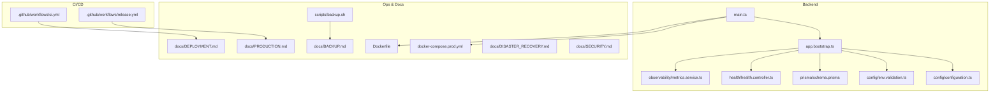
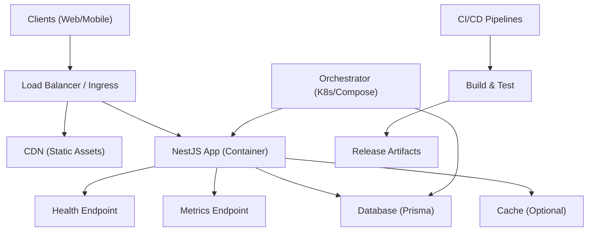
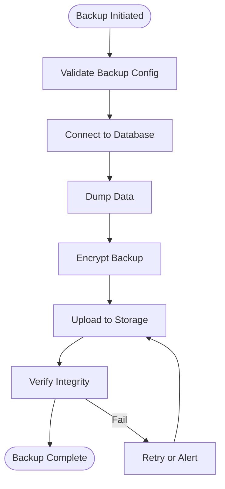
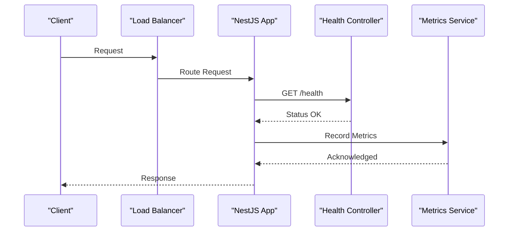
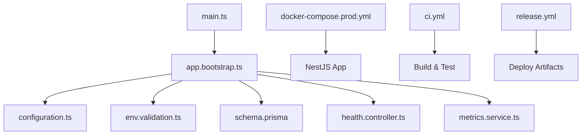

# Deployment Strategies

<cite>
**Referenced Files in This Document**
- [DEPLOYMENT-GUIDE.md](file://DEPLOYMENT-GUIDE.md)
- [docs/DEPLOYMENT.md](file://docs/DEPLOYMENT.md)
- [docs/PRODUCTION.md](file://docs/PRODUCTION.md)
- [docs/BACKUP.md](file://docs/BACKUP.md)
- [docs/DISASTER_RECOVERY.md](file://docs/DISASTER_RECOVERY.md)
- [docs/SECURITY.md](file://docs/SECURITY.md)
- [apps/backend/Dockerfile](file://apps/backend/Dockerfile)
- [apps/backend/docker-compose.prod.yml](file://apps/backend/docker-compose.prod.yml)
- [apps/backend/docker-compose.yml](file://apps/backend/docker-compose.yml)
- [apps/backend/package.json](file://apps/backend/package.json)
- [apps/backend/src/app.bootstrap.ts](file://apps/backend/src/app.bootstrap.ts)
- [apps/backend/src/main.ts](file://apps/backend/src/main.ts)
- [apps/backend/src/config/configuration.ts](file://apps/backend/src/config/configuration.ts)
- [apps/backend/src/config/env.validation.ts](file://apps/backend/src/config/env.validation.ts)
- [apps/backend/prisma/schema.prisma](file://apps/backend/prisma/schema.prisma)
- [apps/backend/prisma/migrations/migration_lock.toml](file://apps/backend/prisma/migrations/migration_lock.toml)
- [apps/backend/scripts/backup.sh](file://apps/backend/scripts/backup.sh)
- [apps/backend/src/deployment/backup.service.ts](file://apps/backend/src/deployment/backup.service.ts)
- [apps/backend/src/deployment/restore.service.ts](file://apps/backend/src/deployment/restore.service.ts)
- [apps/backend/src/deployment/environment-validation.service.ts](file://apps/backend/src/deployment/environment-validation.service.ts)
- [apps/backend/src/deployment/release-validation.service.ts](file://apps/backend/src/deployment/release-validation.service.ts)
- [apps/backend/src/deployment/production-configuration.service.ts](file://apps/backend/src/deployment/production-configuration.service.ts)
- [apps/backend/src/hardening/database-optimization.service.ts](file://apps/backend/src/hardening/database-optimization.service.ts)
- [apps/backend/src/hardening/performance-audit.service.ts](file://apps/backend/src/hardening/performance-audit.service.ts)
- [apps/backend/src/observability/metrics.service.ts](file://apps/backend/src/observability/metrics.service.ts)
- [apps/backend/src/health/health.controller.ts](file://apps/backend/src/health/health.controller.ts)
- [apps/backend/src/health/prisma-health.indicator.ts](file://apps/backend/src/health/prisma-health.indicator.ts)
- [apps/backend/loadtests/artillery/load.yml](file://apps/backend/loadtests/artillery/load.yml)
- [apps/backend/loadtests/k6/load.js](file://apps/backend/loadtests/k6/load.js)
- [.github/workflows/ci.yml](file://.github/workflows/ci.yml)
- [.github/workflows/release.yml](file://.github/workflows/release.yml)
</cite>

## Table of Contents
1. [Introduction](#introduction)
2. [Project Structure](#project-structure)
3. [Core Components](#core-components)
4. [Architecture Overview](#architecture-overview)
5. [Detailed Component Analysis](#detailed-component-analysis)
6. [Dependency Analysis](#dependency-analysis)
7. [Performance Considerations](#performance-considerations)
8. [Troubleshooting Guide](#troubleshooting-guide)
9. [Conclusion](#conclusion)
10. [Appendices](#appendices)

## Introduction
This document provides comprehensive production deployment strategies for Chronicle Your Media Story, focusing on zero-downtime deployments (blue-green and rolling updates), environment configuration management, database migrations, asset optimization, scaling, load balancing, CDN configuration, backup and restore procedures, disaster recovery planning, monitoring setup, security hardening, SSL/TLS configuration, and compliance requirements. It synthesizes operational guidance from the repository’s documentation and backend implementation to ensure safe, repeatable, and observable production releases.

## Project Structure
The project is a monorepo with a NestJS backend under apps/backend, Prisma-based data layer, Docker artifacts, CI/CD workflows, and extensive operational documentation. Key areas relevant to deployment include:
- Backend application entry points and bootstrapping
- Configuration and environment validation
- Database schema and migrations
- Health checks and observability endpoints
- Backup and restore utilities
- Container images and compose files for production
- CI/CD pipelines for build, test, and release

**Diagram sources**
- [apps/backend/src/main.ts](file://apps/backend/src/main.ts)
- [apps/backend/src/app.bootstrap.ts](file://apps/backend/src/app.bootstrap.ts)
- [apps/backend/src/config/configuration.ts](file://apps/backend/src/config/configuration.ts)
- [apps/backend/src/config/env.validation.ts](file://apps/backend/src/config/env.validation.ts)
- [apps/backend/prisma/schema.prisma](file://apps/backend/prisma/schema.prisma)
- [apps/backend/src/health/health.controller.ts](file://apps/backend/src/health/health.controller.ts)
- [apps/backend/src/observability/metrics.service.ts](file://apps/backend/src/observability/metrics.service.ts)
- [apps/backend/docker-compose.prod.yml](file://apps/backend/docker-compose.prod.yml)
- [apps/backend/Dockerfile](file://apps/backend/Dockerfile)
- [apps/backend/scripts/backup.sh](file://apps/backend/scripts/backup.sh)
- [docs/DEPLOYMENT.md](file://docs/DEPLOYMENT.md)
- [docs/PRODUCTION.md](file://docs/PRODUCTION.md)
- [docs/BACKUP.md](file://docs/BACKUP.md)
- [docs/DISASTER_RECOVERY.md](file://docs/DISASTER_RECOVERY.md)
- [docs/SECURITY.md](file://docs/SECURITY.md)
- [.github/workflows/ci.yml](file://.github/workflows/ci.yml)
- [.github/workflows/release.yml](file://.github/workflows/release.yml)

**Section sources**
- [apps/backend/src/main.ts](file://apps/backend/src/main.ts)
- [apps/backend/src/app.bootstrap.ts](file://apps/backend/src/app.bootstrap.ts)
- [apps/backend/src/config/configuration.ts](file://apps/backend/src/config/configuration.ts)
- [apps/backend/src/config/env.validation.ts](file://apps/backend/src/config/env.validation.ts)
- [apps/backend/prisma/schema.prisma](file://apps/backend/prisma/schema.prisma)
- [apps/backend/docker-compose.prod.yml](file://apps/backend/docker-compose.prod.yml)
- [apps/backend/Dockerfile](file://apps/backend/Dockerfile)
- [docs/DEPLOYMENT.md](file://docs/DEPLOYMENT.md)
- [docs/PRODUCTION.md](file://docs/PRODUCTION.md)

## Core Components
- Application bootstrap and runtime: The NestJS app initializes via main.ts and app.bootstrap.ts, loading configuration and modules required for production readiness.
- Configuration and validation: Centralized configuration and strict environment variable validation ensure consistent behavior across environments.
- Database layer: Prisma schema defines models; migrations are managed through Prisma migration tooling.
- Health and observability: Health controller exposes readiness/liveness endpoints; metrics service exposes performance and operational metrics.
- Deployment utilities: Services for environment validation, release validation, and production configuration assist in safe deployments.
- Backup and restore: Scripted and service-backed mechanisms support consistent backups and restores.

**Section sources**
- [apps/backend/src/main.ts](file://apps/backend/src/main.ts)
- [apps/backend/src/app.bootstrap.ts](file://apps/backend/src/app.bootstrap.ts)
- [apps/backend/src/config/configuration.ts](file://apps/backend/src/config/configuration.ts)
- [apps/backend/src/config/env.validation.ts](file://apps/backend/src/config/env.validation.ts)
- [apps/backend/prisma/schema.prisma](file://apps/backend/prisma/schema.prisma)
- [apps/backend/src/health/health.controller.ts](file://apps/backend/src/health/health.controller.ts)
- [apps/backend/src/observability/metrics.service.ts](file://apps/backend/src/observability/metrics.service.ts)
- [apps/backend/src/deployment/environment-validation.service.ts](file://apps/backend/src/deployment/environment-validation.service.ts)
- [apps/backend/src/deployment/release-validation.service.ts](file://apps/backend/src/deployment/release-validation.service.ts)
- [apps/backend/src/deployment/production-configuration.service.ts](file://apps/backend/src/deployment/production-configuration.service.ts)
- [apps/backend/scripts/backup.sh](file://apps/backend/scripts/backup.sh)
- [apps/backend/src/deployment/backup.service.ts](file://apps/backend/src/deployment/backup.service.ts)
- [apps/backend/src/deployment/restore.service.ts](file://apps/backend/src/deployment/restore.service.ts)

## Architecture Overview
Production architecture centers around containerized services orchestrated by Docker Compose or an orchestrator (e.g., Kubernetes). The backend serves API requests, interacts with a relational database via Prisma, and exposes health and metrics endpoints. Load balancers and CDNs sit in front of the application for traffic distribution and static asset delivery. CI/CD automates builds, tests, and releases.

[No sources needed since this diagram shows conceptual workflow, not actual code structure]

## Detailed Component Analysis

### Zero-Downtime Deployments: Blue-Green and Rolling Updates
- Blue-Green Strategy
  - Maintain two identical environments (blue and green). Route traffic to one while deploying to the other. Switch traffic atomically after health checks pass.
  - Use load balancer or ingress rules to flip routing between blue and green instances.
  - Validate new version using automated smoke tests before cutover.
- Rolling Updates
  - Gradually replace instances with the new version while maintaining capacity.
  - Configure maxUnavailable and maxSurge to control rollout pace.
  - Ensure backward compatibility during transition (database and API contracts).

Operational considerations:
- Pre-deploy checks: environment validation, dependency checks, and migration readiness.
- Post-deploy verification: health endpoint success, metrics stability, and error rate thresholds.
- Rollback plan: quick reversion to previous stable version if issues arise.

**Section sources**
- [docs/DEPLOYMENT.md](file://docs/DEPLOYMENT.md)
- [docs/PRODUCTION.md](file://docs/PRODUCTION.md)
- [apps/backend/src/deployment/environment-validation.service.ts](file://apps/backend/src/deployment/environment-validation.service.ts)
- [apps/backend/src/deployment/release-validation.service.ts](file://apps/backend/src/deployment/release-validation.service.ts)

### Environment Configuration Management
- Centralize configuration via environment variables validated at startup.
- Separate secrets from non-secret configuration; use secret managers or encrypted stores.
- Enforce required variables and defaults for production.
- Validate configuration early to fail fast on misconfiguration.

Recommended practices:
- Use distinct profiles per environment (dev, staging, prod).
- Pin versions for dependencies and base images.
- Store configuration as code and review changes via PRs.

**Section sources**
- [apps/backend/src/config/configuration.ts](file://apps/backend/src/config/configuration.ts)
- [apps/backend/src/config/env.validation.ts](file://apps/backend/src/config/env.validation.ts)
- [docs/PRODUCTION.md](file://docs/PRODUCTION.md)

### Database Migrations
- Use Prisma migrations to evolve schema safely.
- Run migrations before deploying new application code when possible.
- Ensure idempotent and reversible migrations where feasible.
- Back up the database prior to critical migrations.

Migration workflow:
- Generate migration from schema changes.
- Review and test locally.
- Apply in staging, validate, then apply in production with maintenance window or zero-downtime strategy.

**Section sources**
- [apps/backend/prisma/schema.prisma](file://apps/backend/prisma/schema.prisma)
- [apps/backend/prisma/migrations/migration_lock.toml](file://apps/backend/prisma/migrations/migration_lock.toml)
- [docs/DEPLOYMENT.md](file://docs/DEPLOYMENT.md)

### Asset Optimization
- Serve static assets via CDN for reduced latency and caching.
- Enable compression and caching headers.
- Optimize images and bundle sizes; lazy-load heavy components.
- Use cache busting for updated assets.

**Section sources**
- [docs/PRODUCTION.md](file://docs/PRODUCTION.md)

### Scaling Considerations and Load Balancing
- Horizontal scaling: run multiple instances behind a load balancer.
- Stateless design: externalize sessions and state to shared storage/cache.
- Auto-scaling policies based on CPU, memory, or custom metrics.
- Connection pooling for databases and caches.

**Section sources**
- [docs/PRODUCTION.md](file://docs/PRODUCTION.md)

### CDN Configuration
- Configure origin server and cache rules.
- Set appropriate TTLs for static assets and dynamic responses.
- Enable HTTPS and HTTP/2 or HTTP/3.
- Implement cache invalidation strategies for updates.

**Section sources**
- [docs/PRODUCTION.md](file://docs/PRODUCTION.md)

### Backup and Restore Procedures
- Automated backups: schedule regular snapshots of the database and media storage.
- Retention policy: define retention periods and rotation.
- Verify integrity: checksums and periodic restore drills.
- Restore process: documented steps to recover from failures.

**Diagram sources**
- [apps/backend/scripts/backup.sh](file://apps/backend/scripts/backup.sh)
- [apps/backend/src/deployment/backup.service.ts](file://apps/backend/src/deployment/backup.service.ts)

**Section sources**
- [docs/BACKUP.md](file://docs/BACKUP.md)
- [apps/backend/scripts/backup.sh](file://apps/backend/scripts/backup.sh)
- [apps/backend/src/deployment/backup.service.ts](file://apps/backend/src/deployment/backup.service.ts)

### Disaster Recovery Planning
- Define RTO (Recovery Time Objective) and RPO (Recovery Point Objective).
- Multi-region replication for critical data.
- Failover procedures and testing cadence.
- Communication plans and post-mortem processes.

**Section sources**
- [docs/DISASTER_RECOVERY.md](file://docs/DISASTER_RECOVERY.md)

### Monitoring Setup
- Expose health endpoints for liveness/readiness probes.
- Collect metrics (request rates, latency, errors, resource usage).
- Centralized logging with structured formats.
- Alerting on SLOs and anomalies.

**Diagram sources**
- [apps/backend/src/health/health.controller.ts](file://apps/backend/src/health/health.controller.ts)
- [apps/backend/src/observability/metrics.service.ts](file://apps/backend/src/observability/metrics.service.ts)

**Section sources**
- [apps/backend/src/health/health.controller.ts](file://apps/backend/src/health/health.controller.ts)
- [apps/backend/src/observability/metrics.service.ts](file://apps/backend/src/observability/metrics.service.ts)

### Security Hardening, SSL/TLS, and Compliance
- Enforce HTTPS everywhere; configure strong TLS settings.
- Rotate secrets regularly; limit access via least privilege.
- Input validation and output encoding to prevent injection.
- Audit logs and compliance reporting.
- Regular vulnerability scans and patching.

**Section sources**
- [docs/SECURITY.md](file://docs/SECURITY.md)
- [docs/PRODUCTION.md](file://docs/PRODUCTION.md)

### Production Configuration Service
- Centralizes production-specific settings and feature flags.
- Validates environment readiness before serving traffic.
- Integrates with health checks to gate deployments.

**Section sources**
- [apps/backend/src/deployment/production-configuration.service.ts](file://apps/backend/src/deployment/production-configuration.service.ts)

### Database Optimization and Performance Audits
- Tune connection pools and query performance.
- Analyze slow queries and add indexes where necessary.
- Periodic performance audits to maintain SLAs.

**Section sources**
- [apps/backend/src/hardening/database-optimization.service.ts](file://apps/backend/src/hardening/database-optimization.service.ts)
- [apps/backend/src/hardening/performance-audit.service.ts](file://apps/backend/src/hardening/performance-audit.service.ts)

### Load Testing and Capacity Planning
- Use artillery and k6 scripts to simulate load and identify bottlenecks.
- Plan capacity based on observed metrics and growth projections.

**Section sources**
- [apps/backend/loadtests/artillery/load.yml](file://apps/backend/loadtests/artillery/load.yml)
- [apps/backend/loadtests/k6/load.js](file://apps/backend/loadtests/k6/load.js)

## Dependency Analysis
Key runtime dependencies and their roles:
- NestJS framework and modules powering the API.
- Prisma ORM for database interactions and migrations.
- Health and metrics modules for observability.
- Docker and Compose for packaging and orchestration.
- CI/CD workflows for automation.

**Diagram sources**
- [apps/backend/src/main.ts](file://apps/backend/src/main.ts)
- [apps/backend/src/app.bootstrap.ts](file://apps/backend/src/app.bootstrap.ts)
- [apps/backend/src/config/configuration.ts](file://apps/backend/src/config/configuration.ts)
- [apps/backend/src/config/env.validation.ts](file://apps/backend/src/config/env.validation.ts)
- [apps/backend/prisma/schema.prisma](file://apps/backend/prisma/schema.prisma)
- [apps/backend/src/health/health.controller.ts](file://apps/backend/src/health/health.controller.ts)
- [apps/backend/src/observability/metrics.service.ts](file://apps/backend/src/observability/metrics.service.ts)
- [apps/backend/docker-compose.prod.yml](file://apps/backend/docker-compose.prod.yml)
- [.github/workflows/ci.yml](file://.github/workflows/ci.yml)
- [.github/workflows/release.yml](file://.github/workflows/release.yml)

**Section sources**
- [apps/backend/package.json](file://apps/backend/package.json)
- [apps/backend/docker-compose.prod.yml](file://apps/backend/docker-compose.prod.yml)
- [apps/backend/Dockerfile](file://apps/backend/Dockerfile)
- [.github/workflows/ci.yml](file://.github/workflows/ci.yml)
- [.github/workflows/release.yml](file://.github/workflows/release.yml)

## Performance Considerations
- Connection pooling for database and cache layers.
- Efficient serialization and response shaping.
- Caching strategies for frequently accessed data.
- Resource limits and autoscaling policies.
- Continuous profiling and bottleneck identification.

[No sources needed since this section provides general guidance]

## Troubleshooting Guide
Common issues and resolutions:
- Health check failures: inspect logs, verify dependencies, and check configuration.
- Migration errors: rollback to previous migration state, validate schema changes.
- High error rates: analyze metrics, trace requests, and review recent changes.
- Backup failures: verify credentials, storage permissions, and network connectivity.

**Section sources**
- [apps/backend/src/health/health.controller.ts](file://apps/backend/src/health/health.controller.ts)
- [apps/backend/src/observability/metrics.service.ts](file://apps/backend/src/observability/metrics.service.ts)
- [docs/DEPLOYMENT.md](file://docs/DEPLOYMENT.md)

## Conclusion
Adopting robust deployment strategies ensures reliable, secure, and scalable production operations for Chronicle Your Media Story. By combining zero-downtime deployments, rigorous configuration management, disciplined database migrations, comprehensive monitoring, and thorough backup and disaster recovery planning, teams can deliver high-quality releases with confidence.

[No sources needed since this section summarizes without analyzing specific files]

## Appendices

### CI/CD Pipeline Overview
- CI pipeline runs tests and builds artifacts.
- Release pipeline publishes images and triggers deployments.
- Environments gated by approvals and health validations.

**Section sources**
- [.github/workflows/ci.yml](file://.github/workflows/ci.yml)
- [.github/workflows/release.yml](file://.github/workflows/release.yml)

### Containerization and Orchestration
- Dockerfile defines production image with minimal footprint.
- docker-compose.prod.yml configures services and networking.
- Optional integration with Kubernetes manifests for advanced orchestration.

**Section sources**
- [apps/backend/Dockerfile](file://apps/backend/Dockerfile)
- [apps/backend/docker-compose.prod.yml](file://apps/backend/docker-compose.prod.yml)

### Operational Runbooks
- Step-by-step procedures for deployments, rollbacks, and incident response.
- Checklists for pre-deploy validations and post-deploy verifications.

**Section sources**
- [docs/DEPLOYMENT.md](file://docs/DEPLOYMENT.md)
- [docs/PRODUCTION.md](file://docs/PRODUCTION.md)
- [docs/BACKUP.md](file://docs/BACKUP.md)
- [docs/DISASTER_RECOVERY.md](file://docs/DISASTER_RECOVERY.md)
- [docs/SECURITY.md](file://docs/SECURITY.md)