# Infrastructure & DevOps

<cite>
**Referenced Files in This Document**
- [Dockerfile](file://apps/backend/Dockerfile)
- [Dockerfile.dev](file://apps/backend/Dockerfile.dev)
- [docker-compose.yml](file://apps/backend/docker-compose.yml)
- [docker-compose.dev.yml](file://apps/backend/docker-compose.dev.yml)
- [docker-compose.prod.yml](file://apps/backend/docker-compose.prod.yml)
- [ci.yml](file://.github/workflows/ci.yml)
- [release.yml](file://.github/workflows/release.yml)
- [package.json](file://apps/backend/package.json)
- [schema.prisma](file://apps/backend/prisma/schema.prisma)
- [backup.sh](file://apps/backend/scripts/backup.sh)
- [health.controller.ts](file://apps/backend/src/health/health.controller.ts)
- [prisma-health.indicator.ts](file://apps/backend/src/health/prisma-health.indicator.ts)
- [metrics.service.ts](file://apps/backend/src/observability/metrics.service.ts)
- [logging.service.ts](file://apps/backend/src/observability/logging.service.ts)
- [request-metrics.middleware.ts](file://apps/backend/src/observability/request-metrics.middleware.ts)
- [load.yml](file://apps/backend/loadtests/artillery/load.yml)
- [smoke.yml](file://apps/backend/loadtests/artillery/smoke.yml)
- [load.js](file://apps/backend/loadtests/k6/load.js)
- [smoke.js](file://apps/backend/loadtests/k6/smoke.js)
- [soak.js](file://apps/backend/loadtests/k6/soak.js)
- [spike.js](file://apps/backend/loadtests/k6/spike.js)
- [stress.js](file://apps/backend/loadtests/k6/stress.js)
- [DEPLOYMENT.md](file://docs/DEPLOYMENT.md)
- [PRODUCTION.md](file://docs/PRODUCTION.md)
- [BACKUP.md](file://docs/BACKUP.md)
- [DISASTER_RECOVERY.md](file://docs/DISASTER_RECOVERY.md)
- [OPERATIONS.md](file://docs/OPERATIONS.md)
- [RUNBOOK.md](file://docs/RUNBOOK.md)
</cite>

## Table of Contents
1. [Introduction](#introduction)
2. [Project Structure](#project-structure)
3. [Core Components](#core-components)
4. [Architecture Overview](#architecture-overview)
5. [Detailed Component Analysis](#detailed-component-analysis)
6. [Dependency Analysis](#dependency-analysis)
7. [Performance Considerations](#performance-considerations)
8. [Troubleshooting Guide](#troubleshooting-guide)
9. [Conclusion](#conclusion)
10. [Appendices](#appendices)

## Introduction
This document provides comprehensive infrastructure and DevOps guidance for Chronicle Your Media Story. It covers containerization strategies, multi-stage builds, orchestration with docker-compose, CI/CD pipelines using GitHub Actions, automated testing, deployment workflows, environment configuration management, scaling considerations, monitoring and logging, health checks, alerting, backup and disaster recovery, database maintenance, and performance monitoring tools. The goal is to enable reliable, secure, and scalable operations across development, staging, and production environments.

## Project Structure
The backend application resides under apps/backend and includes:
- Container definitions (Dockerfile, Dockerfile.dev)
- Orchestration files (docker-compose.yml, docker-compose.dev.yml, docker-compose.prod.yml)
- CI/CD workflows (.github/workflows/ci.yml, .github/workflows/release.yml)
- Load tests (loadtests/artillery and loadtests/k6)
- Database schema and migrations (prisma/schema.prisma)
- Health endpoints and observability modules (src/health, src/observability)
- Backup scripts (scripts/backup.sh)
- Documentation (docs/DEPLOYMENT.md, docs/PRODUCTION.md, docs/BACKUP.md, docs/DISASTER_RECOVERY.md, docs/OPERATIONS.md, docs/RUNBOOK.md)

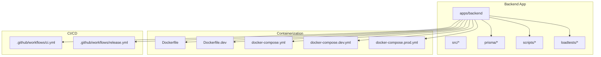

**Diagram sources**
- [Dockerfile](file://apps/backend/Dockerfile)
- [Dockerfile.dev](file://apps/backend/Dockerfile.dev)
- [docker-compose.yml](file://apps/backend/docker-compose.yml)
- [docker-compose.dev.yml](file://apps/backend/docker-compose.dev.yml)
- [docker-compose.prod.yml](file://apps/backend/docker-compose.prod.yml)
- [ci.yml](file://.github/workflows/ci.yml)
- [release.yml](file://.github/workflows/release.yml)
- [schema.prisma](file://apps/backend/prisma/schema.prisma)
- [backup.sh](file://apps/backend/scripts/backup.sh)

**Section sources**
- [Dockerfile](file://apps/backend/Dockerfile)
- [Dockerfile.dev](file://apps/backend/Dockerfile.dev)
- [docker-compose.yml](file://apps/backend/docker-compose.yml)
- [docker-compose.dev.yml](file://apps/backend/docker-compose.dev.yml)
- [docker-compose.prod.yml](file://apps/backend/docker-compose.prod.yml)
- [ci.yml](file://.github/workflows/ci.yml)
- [release.yml](file://.github/workflows/release.yml)
- [schema.prisma](file://apps/backend/prisma/schema.prisma)
- [backup.sh](file://apps/backend/scripts/backup.sh)

## Core Components
- Container images: Production and development Dockerfiles define build stages, dependencies, and runtime configurations.
- Orchestration: docker-compose files manage services such as the NestJS backend, PostgreSQL, Redis, and optional tooling for dev/prod.
- CI/CD: GitHub Actions workflows implement continuous integration and release automation, including linting, building, testing, and publishing artifacts.
- Observability: Health endpoints expose readiness/liveness probes; metrics and logging services provide runtime insights.
- Database: Prisma schema defines data models; migrations are managed via Prisma CLI.
- Testing: Artillery and k6 scripts cover smoke, load, soak, spike, and stress scenarios.
- Backup: Shell script automates database backups and retention policies.

**Section sources**
- [Dockerfile](file://apps/backend/Dockerfile)
- [Dockerfile.dev](file://apps/backend/Dockerfile.dev)
- [docker-compose.yml](file://apps/backend/docker-compose.yml)
- [docker-compose.dev.yml](file://apps/backend/docker-compose.dev.yml)
- [docker-compose.prod.yml](file://apps/backend/docker-compose.prod.yml)
- [ci.yml](file://.github/workflows/ci.yml)
- [release.yml](file://.github/workflows/release.yml)
- [schema.prisma](file://apps/backend/prisma/schema.prisma)
- [health.controller.ts](file://apps/backend/src/health/health.controller.ts)
- [prisma-health.indicator.ts](file://apps/backend/src/health/prisma-health.indicator.ts)
- [metrics.service.ts](file://apps/backend/src/observability/metrics.service.ts)
- [logging.service.ts](file://apps/backend/src/observability/logging.service.ts)
- [request-metrics.middleware.ts](file://apps/backend/src/observability/request-metrics.middleware.ts)
- [load.yml](file://apps/backend/loadtests/artillery/load.yml)
- [smoke.yml](file://apps/backend/loadtests/artillery/smoke.yml)
- [load.js](file://apps/backend/loadtests/k6/load.js)
- [smoke.js](file://apps/backend/loadtests/k6/smoke.js)
- [soak.js](file://apps/backend/loadtests/k6/soak.js)
- [spike.js](file://apps/backend/loadtests/k6/spike.js)
- [stress.js](file://apps/backend/loadtests/k6/stress.js)
- [backup.sh](file://apps/backend/scripts/backup.sh)

## Architecture Overview
The system comprises a NestJS backend service, a relational database (PostgreSQL), and an in-memory cache/job store (Redis). Containers are orchestrated via docker-compose for local and production-like environments. CI/CD pipelines automate build, test, and release processes. Observability is provided through health endpoints, metrics, and structured logging.

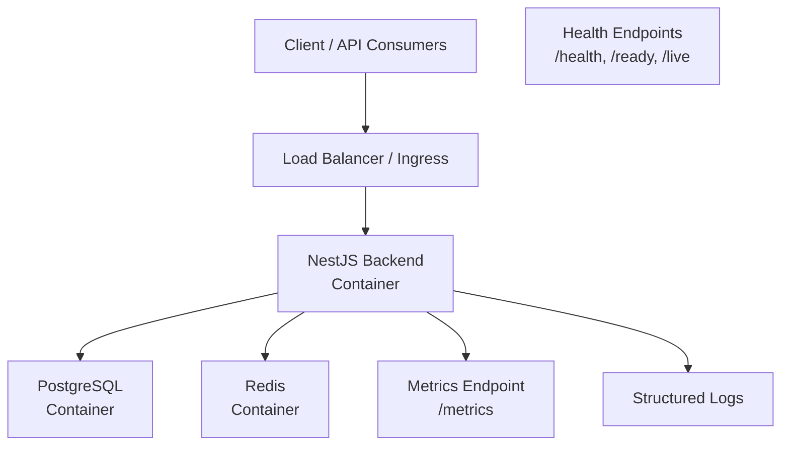

**Diagram sources**
- [docker-compose.yml](file://apps/backend/docker-compose.yml)
- [docker-compose.prod.yml](file://apps/backend/docker-compose.prod.yml)
- [health.controller.ts](file://apps/backend/src/health/health.controller.ts)
- [prisma-health.indicator.ts](file://apps/backend/src/health/prisma-health.indicator.ts)
- [metrics.service.ts](file://apps/backend/src/observability/metrics.service.ts)
- [logging.service.ts](file://apps/backend/src/observability/logging.service.ts)

## Detailed Component Analysis

### Containerization Strategy
- Multi-stage builds: Separate development and production stages to minimize image size and isolate dependencies.
- Dependency caching: Leverage layer caching for faster rebuilds.
- Runtime security: Run as non-root user where possible; prune unnecessary packages.
- Environment variables: Externalize configuration via environment files or secrets management.

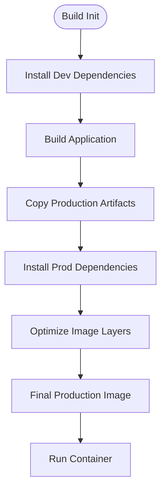

**Diagram sources**
- [Dockerfile](file://apps/backend/Dockerfile)
- [Dockerfile.dev](file://apps/backend/Dockerfile.dev)

**Section sources**
- [Dockerfile](file://apps/backend/Dockerfile)
- [Dockerfile.dev](file://apps/backend/Dockerfile.dev)

### Orchestration with docker-compose
- Services: Backend, PostgreSQL, Redis, and optional dev tooling.
- Networking: Internal networks isolate services; exposed ports only for necessary interfaces.
- Volumes: Persistent volumes for database state and logs.
- Profiles: Use profiles to toggle dev-only features.

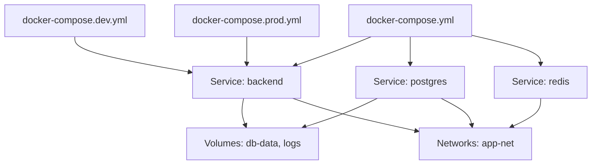

**Diagram sources**
- [docker-compose.yml](file://apps/backend/docker-compose.yml)
- [docker-compose.dev.yml](file://apps/backend/docker-compose.dev.yml)
- [docker-compose.prod.yml](file://apps/backend/docker-compose.prod.yml)

**Section sources**
- [docker-compose.yml](file://apps/backend/docker-compose.yml)
- [docker-compose.dev.yml](file://apps/backend/docker-compose.dev.yml)
- [docker-compose.prod.yml](file://apps/backend/docker-compose.prod.yml)

### CI/CD Pipeline Configuration
- Continuous Integration: Linting, type checking, unit tests, build artifacts, and container image creation.
- Release Automation: Tagging, artifact publishing, and deployment triggers based on branches/tags.
- Secrets Management: Secure handling of credentials and tokens.

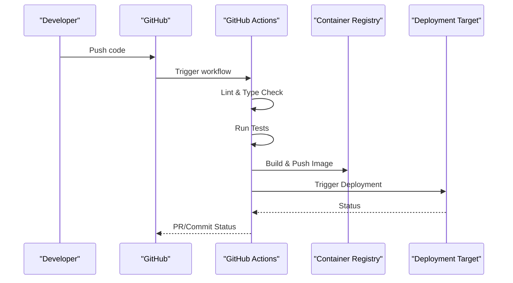

**Diagram sources**
- [ci.yml](file://.github/workflows/ci.yml)
- [release.yml](file://.github/workflows/release.yml)

**Section sources**
- [ci.yml](file://.github/workflows/ci.yml)
- [release.yml](file://.github/workflows/release.yml)

### Automated Testing
- Unit and integration tests executed in CI.
- Load tests using Artillery and k6 for smoke, load, soak, spike, and stress scenarios.
- Test reports generated and stored for analysis.

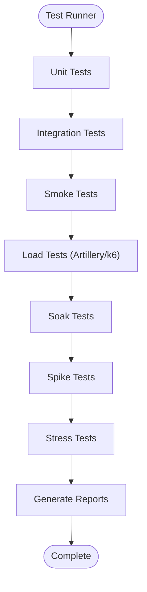

**Diagram sources**
- [load.yml](file://apps/backend/loadtests/artillery/load.yml)
- [smoke.yml](file://apps/backend/loadtests/artillery/smoke.yml)
- [load.js](file://apps/backend/loadtests/k6/load.js)
- [smoke.js](file://apps/backend/loadtests/k6/smoke.js)
- [soak.js](file://apps/backend/loadtests/k6/soak.js)
- [spike.js](file://apps/backend/loadtests/k6/spike.js)
- [stress.js](file://apps/backend/loadtests/k6/stress.js)

**Section sources**
- [load.yml](file://apps/backend/loadtests/artillery/load.yml)
- [smoke.yml](file://apps/backend/loadtests/artillery/smoke.yml)
- [load.js](file://apps/backend/loadtests/k6/load.js)
- [smoke.js](file://apps/backend/loadtests/k6/smoke.js)
- [soak.js](file://apps/backend/loadtests/k6/soak.js)
- [spike.js](file://apps/backend/loadtests/k6/spike.js)
- [stress.js](file://apps/backend/loadtests/k6/stress.js)

### Health Checks and Probes
- Health endpoints expose readiness and liveness status.
- Database connectivity checked via Prisma health indicator.
- Suitable for Kubernetes or orchestrator health probes.

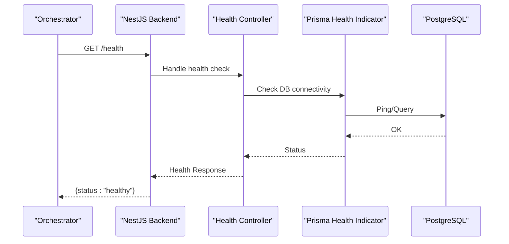

**Diagram sources**
- [health.controller.ts](file://apps/backend/src/health/health.controller.ts)
- [prisma-health.indicator.ts](file://apps/backend/src/health/prisma-health.indicator.ts)

**Section sources**
- [health.controller.ts](file://apps/backend/src/health/health.controller.ts)
- [prisma-health.indicator.ts](file://apps/backend/src/health/prisma-health.indicator.ts)

### Monitoring and Logging
- Metrics endpoint exposes application and runtime metrics.
- Structured logging captures request context, errors, and performance data.
- Request metrics middleware tracks latency and throughput.

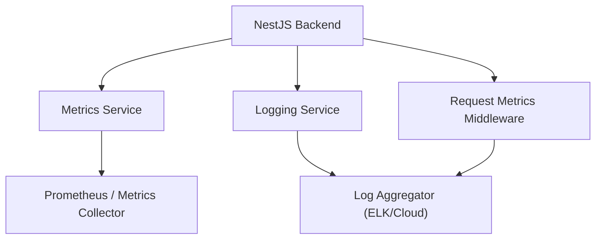

**Diagram sources**
- [metrics.service.ts](file://apps/backend/src/observability/metrics.service.ts)
- [logging.service.ts](file://apps/backend/src/observability/logging.service.ts)
- [request-metrics.middleware.ts](file://apps/backend/src/observability/request-metrics.middleware.ts)

**Section sources**
- [metrics.service.ts](file://apps/backend/src/observability/metrics.service.ts)
- [logging.service.ts](file://apps/backend/src/observability/logging.service.ts)
- [request-metrics.middleware.ts](file://apps/backend/src/observability/request-metrics.middleware.ts)

### Backup and Disaster Recovery
- Automated backups via shell script with retention policies.
- Restore procedures documented for quick recovery.
- Disaster recovery runbooks outline steps for critical failures.

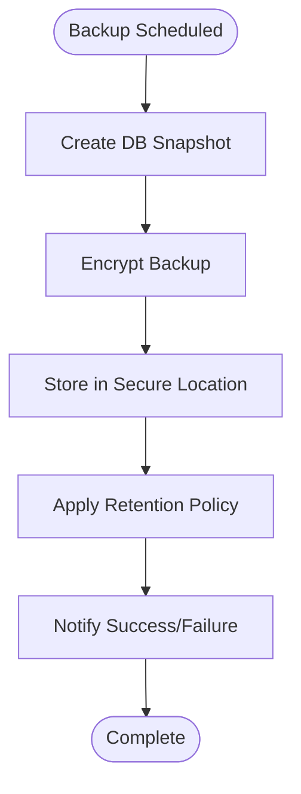

**Diagram sources**
- [backup.sh](file://apps/backend/scripts/backup.sh)
- [BACKUP.md](file://docs/BACKUP.md)
- [DISASTER_RECOVERY.md](file://docs/DISASTER_RECOVERY.md)

**Section sources**
- [backup.sh](file://apps/backend/scripts/backup.sh)
- [BACKUP.md](file://docs/BACKUP.md)
- [DISASTER_RECOVERY.md](file://docs/DISASTER_RECOVERY.md)

### Database Maintenance
- Schema defined in Prisma; migrations applied during deployment.
- Index optimization and query analysis supported by hardening modules.
- Regular maintenance tasks include vacuuming, reindexing, and statistics updates.

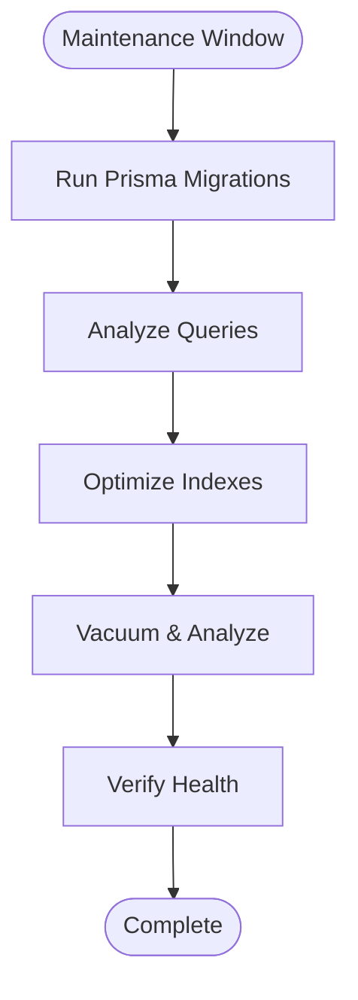

**Diagram sources**
- [schema.prisma](file://apps/backend/prisma/schema.prisma)

**Section sources**
- [schema.prisma](file://apps/backend/prisma/schema.prisma)

### Performance Monitoring Tools
- k6 and Artillery scripts simulate realistic traffic patterns.
- Metrics collection enables capacity planning and bottleneck identification.
- Load tests integrated into CI to prevent regressions.

**Section sources**
- [load.yml](file://apps/backend/loadtests/artillery/load.yml)
- [smoke.yml](file://apps/backend/loadtests/artillery/smoke.yml)
- [load.js](file://apps/backend/loadtests/k6/load.js)
- [smoke.js](file://apps/backend/loadtests/k6/smoke.js)
- [soak.js](file://apps/backend/loadtests/k6/soak.js)
- [spike.js](file://apps/backend/loadtests/k6/spike.js)
- [stress.js](file://apps/backend/loadtests/k6/stress.js)

## Dependency Analysis
The backend depends on PostgreSQL and Redis, configured via environment variables. Observability components integrate with external collectors. CI/CD workflows depend on repository structure and secrets.

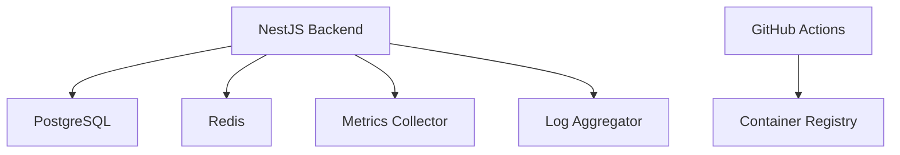

**Diagram sources**
- [docker-compose.yml](file://apps/backend/docker-compose.yml)
- [docker-compose.prod.yml](file://apps/backend/docker-compose.prod.yml)
- [ci.yml](file://.github/workflows/ci.yml)
- [release.yml](file://.github/workflows/release.yml)

**Section sources**
- [docker-compose.yml](file://apps/backend/docker-compose.yml)
- [docker-compose.prod.yml](file://apps/backend/docker-compose.prod.yml)
- [ci.yml](file://.github/workflows/ci.yml)
- [release.yml](file://.github/workflows/release.yml)

## Performance Considerations
- Connection pooling for database and Redis to handle concurrent requests.
- Caching strategies for frequently accessed data.
- Horizontal scaling by replicating backend instances behind a load balancer.
- Resource limits and requests defined in orchestration configs.
- Monitoring key metrics: CPU, memory, request latency, error rates, and queue backlogs.

[No sources needed since this section provides general guidance]

## Troubleshooting Guide
- Health endpoints help diagnose service readiness and database connectivity.
- Logs should be centralized and searchable; use correlation IDs for tracing requests.
- Common issues: misconfigured environment variables, insufficient resources, network policies blocking inter-service communication.
- Use load tests to reproduce performance issues locally before deploying.

**Section sources**
- [health.controller.ts](file://apps/backend/src/health/health.controller.ts)
- [prisma-health.indicator.ts](file://apps/backend/src/health/prisma-health.indicator.ts)
- [logging.service.ts](file://apps/backend/src/observability/logging.service.ts)
- [REQUEST_METRICS_MIDDLEWARE](file://apps/backend/src/observability/request-metrics.middleware.ts)

## Conclusion
This documentation outlines the infrastructure and DevOps practices for Chronicle Your Media Story, covering containerization, orchestration, CI/CD, testing, monitoring, backup, and performance tuning. Following these guidelines ensures a robust, scalable, and maintainable deployment pipeline suitable for production environments.

[No sources needed since this section summarizes without analyzing specific files]

## Appendices
- Deployment guide: [DEPLOYMENT.md](file://docs/DEPLOYMENT.md)
- Production checklist: [PRODUCTION.md](file://docs/PRODUCTION.md)
- Operations runbook: [OPERATIONS.md](file://docs/OPERATIONS.md)
- Backup procedures: [BACKUP.md](file://docs/BACKUP.md)
- Disaster recovery plan: [DISASTER_RECOVERY.md](file://docs/DISASTER_RECOVERY.md)
- Operational runbook: [RUNBOOK.md](file://docs/RUNBOOK.md)

**Section sources**
- [DEPLOYMENT.md](file://docs/DEPLOYMENT.md)
- [PRODUCTION.md](file://docs/PRODUCTION.md)
- [OPERATIONS.md](file://docs/OPERATIONS.md)
- [BACKUP.md](file://docs/BACKUP.md)
- [DISASTER_RECOVERY.md](file://docs/DISASTER_RECOVERY.md)
- [RUNBOOK.md](file://docs/RUNBOOK.md)