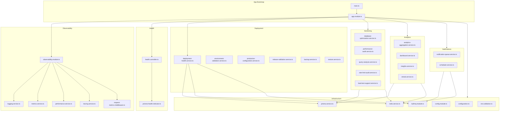
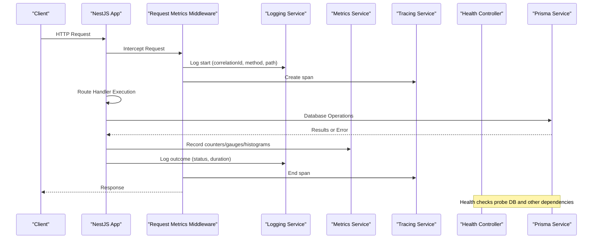
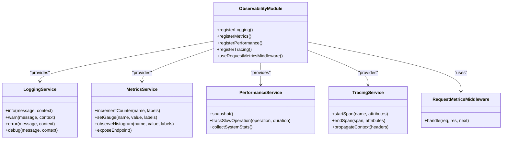
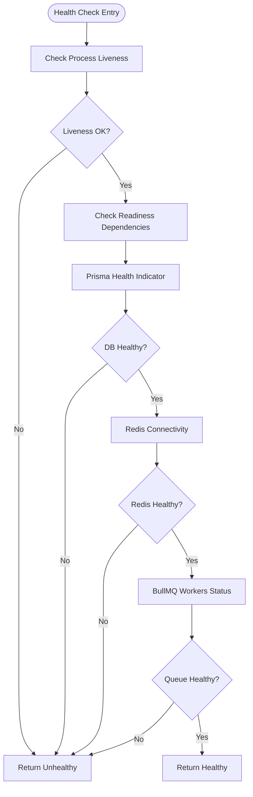
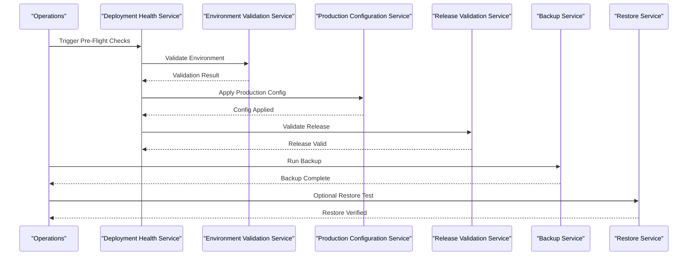
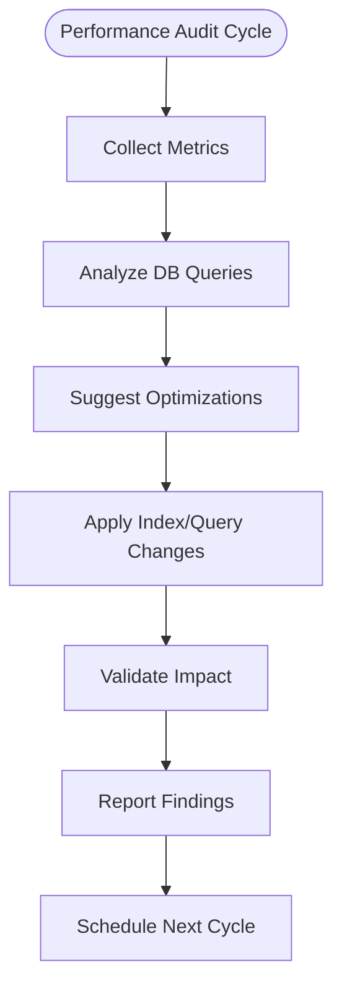
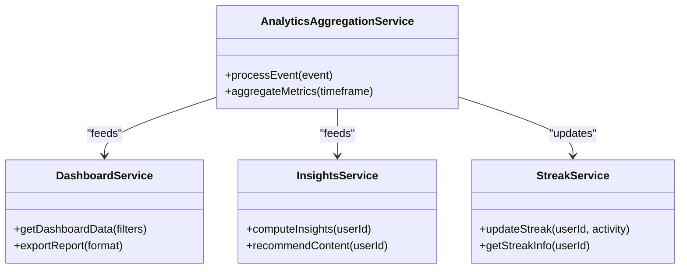
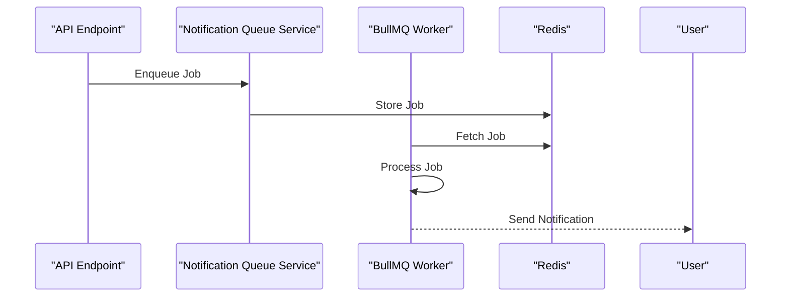
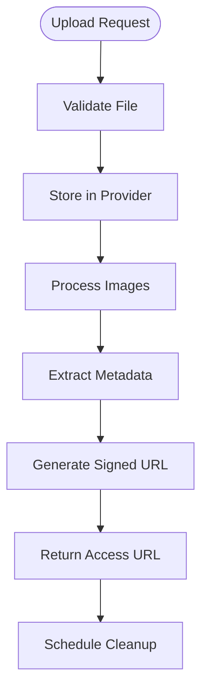
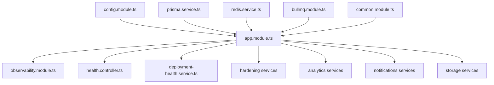

# Monitoring & Logging

<cite>
**Referenced Files in This Document**
- [main.ts](file://apps/backend/src/main.ts)
- [app.module.ts](file://apps/backend/src/app.module.ts)
- [health.controller.ts](file://apps/backend/src/health/health.controller.ts)
- [prisma-health.indicator.ts](file://apps/backend/src/health/prisma-health.indicator.ts)
- [observability.module.ts](file://apps/backend/src/observability/observability.module.ts)
- [logging.service.ts](file://apps/backend/src/observability/logging.service.ts)
- [metrics.service.ts](file://apps/backend/src/observability/metrics.service.ts)
- [performance.service.ts](file://apps/backend/src/observability/performance.service.ts)
- [tracing.service.ts](file://apps/backend/src/observability/tracing.service.ts)
- [request-metrics.middleware.ts](file://apps/backend/src/observability/request-metrics.middleware.ts)
- [logger.module.ts](file://apps/backend/src/logger/logger.module.ts)
- [deployment-health.service.ts](file://apps/backend/src/deployment/deployment-health.service.ts)
- [environment-validation.service.ts](file://apps/backend/src/deployment/environment-validation.service.ts)
- [production-configuration.service.ts](file://apps/backend/src/deployment/production-configuration.service.ts)
- [release-validation.service.ts](file://apps/backend/src/deployment/release-validation.service.ts)
- [backup.service.ts](file://apps/backend/src/deployment/backup.service.ts)
- [restore.service.ts](file://apps/backend/src/deployment/restore.service.ts)
- [database-optimization.service.ts](file://apps/backend/src/hardening/database-optimization.service.ts)
- [performance-audit.service.ts](file://apps/backend/src/hardening/performance-audit.service.ts)
- [query-analysis.service.ts](file://apps/backend/src/hardening/query-analysis.service.ts)
- [rate-limit-audit.service.ts](file://apps/backend/src/hardening/rate-limit-audit.service.ts)
- [load-test-support.service.ts](file://apps/backend/src/hardening/load-test-support.service.ts)
- [analytics-aggregation.service.ts](file://apps/backend/src/analytics/analytics-aggregation.service.ts)
- [dashboard.service.ts](file://apps/backend/src/analytics/dashboard.service.ts)
- [insights.service.ts](file://apps/backend/src/analytics/insights.service.ts)
- [streak.service.ts](file://apps/backend/src/analytics/streak.service.ts)
- [notification-queue.service.ts](file://apps/backend/src/notifications/notification-queue.service.ts)
- [scheduler.service.ts](file://apps/backend/src/notifications/scheduler.service.ts)
- [bullmq.module.ts](file://apps/backend/src/bullmq/bullmq.module.ts)
- [redis.service.ts](file://apps/backend/src/redis/redis.service.ts)
- [prisma.service.ts](file://apps/backend/src/prisma/prisma.service.ts)
- [config.module.ts](file://apps/backend/src/config/config.module.ts)
- [configuration.ts](file://apps/backend/src/config/configuration.ts)
- [env.validation.ts](file://apps/backend/src/config/env.validation.ts)
- [common.module.ts](file://apps/backend/src/common/common.module.ts)
- [filters/index.ts](file://apps/backend/src/common/filters/index.ts)
- [interceptors/index.ts](file://apps/backend/src/common/interceptors/index.ts)
- [exceptions/index.ts](file://apps/backend/src/common/exceptions/index.ts)
- [result/index.ts](file://apps/backend/src/common/result/index.ts)
- [retry/index.ts](file://apps/backend/src/common/retry/index.ts)
- [pagination/index.ts](file://apps/backend/src/common/pagination/index.ts)
- [response/index.ts](file://apps/backend/src/common/response/index.ts)
- [core.module.ts](file://apps/backend/src/core/core.module.ts)
- [storage.service.ts](file://apps/backend/src/storage/storage.service.ts)
- [image.service.ts](file://apps/backend/src/storage/image.service.ts)
- [upload.service.ts](file://apps/backend/src/storage/upload.service.ts)
- [signed-url.service.ts](file://apps/backend/src/storage/signed-url.service.ts)
- [media-cleanup.service.ts](file://apps/backend/src/storage/media-cleanup.service.ts)
- [image-processor.service.ts](file://apps/backend/src/storage/image-processor.service.ts)
</cite>

## Table of Contents
1. [Introduction](#introduction)
2. [Project Structure](#project-structure)
3. [Core Components](#core-components)
4. [Architecture Overview](#architecture-overview)
5. [Detailed Component Analysis](#detailed-component-analysis)
6. [Dependency Analysis](#dependency-analysis)
7. [Performance Considerations](#performance-considerations)
8. [Troubleshooting Guide](#troubleshooting-guide)
9. [Conclusion](#conclusion)
10. [Appendices](#appendices)

## Introduction
This document provides comprehensive monitoring and logging guidance for Chronicle Your Media Story. It covers health checks, performance metrics collection, error tracking, structured logging patterns, log aggregation strategies, alerting configuration, observability tool integration, distributed tracing, performance profiling, dashboard setup, key metrics to monitor, incident response procedures, log retention policies, privacy considerations, and debugging techniques for production issues.

## Project Structure
The backend is a NestJS application with dedicated modules for observability, deployment health, hardening, analytics, notifications, storage, and core utilities. Observability is centralized under the observability module, while health endpoints are exposed via a dedicated health controller. Configuration and environment validation are encapsulated in the config module. Background jobs and queues are managed through BullMQ and Redis. Storage operations are abstracted behind services that can be monitored independently.

**Diagram sources**
- [main.ts](file://apps/backend/src/main.ts)
- [app.module.ts](file://apps/backend/src/app.module.ts)
- [observability.module.ts](file://apps/backend/src/observability/observability.module.ts)
- [logging.service.ts](file://apps/backend/src/observability/logging.service.ts)
- [metrics.service.ts](file://apps/backend/src/observability/metrics.service.ts)
- [performance.service.ts](file://apps/backend/src/observability/performance.service.ts)
- [tracing.service.ts](file://apps/backend/src/observability/tracing.service.ts)
- [request-metrics.middleware.ts](file://apps/backend/src/observability/request-metrics.middleware.ts)
- [health.controller.ts](file://apps/backend/src/health/health.controller.ts)
- [prisma-health.indicator.ts](file://apps/backend/src/health/prisma-health.indicator.ts)
- [deployment-health.service.ts](file://apps/backend/src/deployment/deployment-health.service.ts)
- [environment-validation.service.ts](file://apps/backend/src/deployment/environment-validation.service.ts)
- [production-configuration.service.ts](file://apps/backend/src/deployment/production-configuration.service.ts)
- [release-validation.service.ts](file://apps/backend/src/deployment/release-validation.service.ts)
- [backup.service.ts](file://apps/backend/src/deployment/backup.service.ts)
- [restore.service.ts](file://apps/backend/src/deployment/restore.service.ts)
- [database-optimization.service.ts](file://apps/backend/src/hardening/database-optimization.service.ts)
- [performance-audit.service.ts](file://apps/backend/src/hardening/performance-audit.service.ts)
- [query-analysis.service.ts](file://apps/backend/src/hardening/query-analysis.service.ts)
- [rate-limit-audit.service.ts](file://apps/backend/src/hardening/rate-limit-audit.service.ts)
- [load-test-support.service.ts](file://apps/backend/src/hardening/load-test-support.service.ts)
- [analytics-aggregation.service.ts](file://apps/backend/src/analytics/analytics-aggregation.service.ts)
- [dashboard.service.ts](file://apps/backend/src/analytics/dashboard.service.ts)
- [insights.service.ts](file://apps/backend/src/analytics/insights.service.ts)
- [streak.service.ts](file://apps/backend/src/analytics/streak.service.ts)
- [notification-queue.service.ts](file://apps/backend/src/notifications/notification-queue.service.ts)
- [scheduler.service.ts](file://apps/backend/src/notifications/scheduler.service.ts)
- [bullmq.module.ts](file://apps/backend/src/bullmq/bullmq.module.ts)
- [redis.service.ts](file://apps/backend/src/redis/redis.service.ts)
- [prisma.service.ts](file://apps/backend/src/prisma/prisma.service.ts)
- [config.module.ts](file://apps/backend/src/config/config.module.ts)
- [configuration.ts](file://apps/backend/src/config/configuration.ts)
- [env.validation.ts](file://apps/backend/src/config/env.validation.ts)

**Section sources**
- [main.ts](file://apps/backend/src/main.ts)
- [app.module.ts](file://apps/backend/src/app.module.ts)
- [observability.module.ts](file://apps/backend/src/observability/observability.module.ts)
- [health.controller.ts](file://apps/backend/src/health/health.controller.ts)
- [deployment-health.service.ts](file://apps/backend/src/deployment/deployment-health.service.ts)
- [config.module.ts](file://apps/backend/src/config/config.module.ts)

## Core Components
- Observability Module: Centralizes logging, metrics, performance, and tracing services; exposes request-level metrics middleware.
- Health Controller: Exposes health endpoints and integrates Prisma health indicator for database readiness.
- Deployment Health Services: Validate environment, production configuration, release integrity, and orchestrate backups/restores.
- Hardening Services: Provide database optimization, performance auditing, query analysis, rate limiting audits, and load test support.
- Analytics Services: Aggregate analytics data, compute insights, and power dashboards and streaks.
- Notification Services: Manage background job queues and scheduling using BullMQ and Redis.
- Infrastructure Services: Manage Redis, Prisma, and configuration validation.

Key responsibilities:
- Structured logging with correlation IDs and contextual metadata.
- Prometheus-compatible metrics collection and HTTP exposure.
- Distributed tracing spans across requests and background jobs.
- Health probes for liveness/readiness including dependency checks.
- Performance profiling hooks and audit routines.

**Section sources**
- [observability.module.ts](file://apps/backend/src/observability/observability.module.ts)
- [logging.service.ts](file://apps/backend/src/observability/logging.service.ts)
- [metrics.service.ts](file://apps/backend/src/observability/metrics.service.ts)
- [performance.service.ts](file://apps/backend/src/observability/performance.service.ts)
- [tracing.service.ts](file://apps/backend/src/observability/tracing.service.ts)
- [request-metrics.middleware.ts](file://apps/backend/src/observability/request-metrics.middleware.ts)
- [health.controller.ts](file://apps/backend/src/health/health.controller.ts)
- [prisma-health.indicator.ts](file://apps/backend/src/health/prisma-health.indicator.ts)
- [deployment-health.service.ts](file://apps/backend/src/deployment/deployment-health.service.ts)
- [environment-validation.service.ts](file://apps/backend/src/deployment/environment-validation.service.ts)
- [production-configuration.service.ts](file://apps/backend/src/deployment/production-configuration.service.ts)
- [release-validation.service.ts](file://apps/backend/src/deployment/release-validation.service.ts)
- [backup.service.ts](file://apps/backend/src/deployment/backup.service.ts)
- [restore.service.ts](file://apps/backend/src/deployment/restore.service.ts)
- [database-optimization.service.ts](file://apps/backend/src/hardening/database-optimization.service.ts)
- [performance-audit.service.ts](file://apps/backend/src/hardening/performance-audit.service.ts)
- [query-analysis.service.ts](file://apps/backend/src/hardening/query-analysis.service.ts)
- [rate-limit-audit.service.ts](file://apps/backend/src/hardening/rate-limit-audit.service.ts)
- [load-test-support.service.ts](file://apps/backend/src/hardening/load-test-support.service.ts)
- [analytics-aggregation.service.ts](file://apps/backend/src/analytics/analytics-aggregation.service.ts)
- [dashboard.service.ts](file://apps/backend/src/analytics/dashboard.service.ts)
- [insights.service.ts](file://apps/backend/src/analytics/insights.service.ts)
- [streak.service.ts](file://apps/backend/src/analytics/streak.service.ts)
- [notification-queue.service.ts](file://apps/backend/src/notifications/notification-queue.service.ts)
- [scheduler.service.ts](file://apps/backend/src/notifications/scheduler.service.ts)
- [bullmq.module.ts](file://apps/backend/src/bullmq/bullmq.module.ts)
- [redis.service.ts](file://apps/backend/src/redis/redis.service.ts)
- [prisma.service.ts](file://apps/backend/src/prisma/prisma.service.ts)
- [config.module.ts](file://apps/backend/src/config/config.module.ts)
- [configuration.ts](file://apps/backend/src/config/configuration.ts)
- [env.validation.ts](file://apps/backend/src/config/env.validation.ts)

## Architecture Overview
The application bootstraps via main.ts and registers core modules. The observability module wires logging, metrics, performance, and tracing services. A request metrics middleware captures HTTP request durations and status codes. Health endpoints expose readiness/liveness checks backed by Prisma and other dependencies. Deployment services validate environment and configuration, while hardening services provide ongoing performance and query audits. Analytics services aggregate usage data and feed dashboards. Notifications use BullMQ and Redis for asynchronous processing.

**Diagram sources**
- [main.ts](file://apps/backend/src/main.ts)
- [request-metrics.middleware.ts](file://apps/backend/src/observability/request-metrics.middleware.ts)
- [logging.service.ts](file://apps/backend/src/observability/logging.service.ts)
- [metrics.service.ts](file://apps/backend/src/observability/metrics.service.ts)
- [tracing.service.ts](file://apps/backend/src/observability/tracing.service.ts)
- [health.controller.ts](file://apps/backend/src/health/health.controller.ts)
- [prisma.service.ts](file://apps/backend/src/prisma/prisma.service.ts)

## Detailed Component Analysis

### Observability Module and Services
The observability module centralizes cross-cutting concerns:
- Logging Service: Provides structured logging with consistent fields such as timestamp, level, message, correlationId, userId, requestId, and context.
- Metrics Service: Exposes counters, gauges, histograms, and summaries for request rates, latencies, errors, and business KPIs.
- Performance Service: Captures performance snapshots, memory/CPU stats, and slow operation detection.
- Tracing Service: Creates and propagates spans across async boundaries and integrates with external tracing backends.
- Request Metrics Middleware: Wraps HTTP requests to record timing, status codes, and route labels.

**Diagram sources**
- [observability.module.ts](file://apps/backend/src/observability/observability.module.ts)
- [logging.service.ts](file://apps/backend/src/observability/logging.service.ts)
- [metrics.service.ts](file://apps/backend/src/observability/metrics.service.ts)
- [performance.service.ts](file://apps/backend/src/observability/performance.service.ts)
- [tracing.service.ts](file://apps/backend/src/observability/tracing.service.ts)
- [request-metrics.middleware.ts](file://apps/backend/src/observability/request-metrics.middleware.ts)

**Section sources**
- [observability.module.ts](file://apps/backend/src/observability/observability.module.ts)
- [logging.service.ts](file://apps/backend/src/observability/logging.service.ts)
- [metrics.service.ts](file://apps/backend/src/observability/metrics.service.ts)
- [performance.service.ts](file://apps/backend/src/observability/performance.service.ts)
- [tracing.service.ts](file://apps/backend/src/observability/tracing.service.ts)
- [request-metrics.middleware.ts](file://apps/backend/src/observability/request-metrics.middleware.ts)

### Health Checks and Readiness
Health endpoints expose liveness and readiness probes:
- Liveness: Indicates if the process is alive and responsive.
- Readiness: Validates dependencies like database connectivity, Redis availability, and queue workers.

Prisma health indicator performs a lightweight query to confirm database reachability. Deployment health service orchestrates multi-dependency checks and aggregates results.

**Diagram sources**
- [health.controller.ts](file://apps/backend/src/health/health.controller.ts)
- [prisma-health.indicator.ts](file://apps/backend/src/health/prisma-health.indicator.ts)
- [deployment-health.service.ts](file://apps/backend/src/deployment/deployment-health.service.ts)
- [redis.service.ts](file://apps/backend/src/redis/redis.service.ts)
- [bullmq.module.ts](file://apps/backend/src/bullmq/bullmq.module.ts)

**Section sources**
- [health.controller.ts](file://apps/backend/src/health/health.controller.ts)
- [prisma-health.indicator.ts](file://apps/backend/src/health/prisma-health.indicator.ts)
- [deployment-health.service.ts](file://apps/backend/src/deployment/deployment-health.service.ts)

### Deployment and Environment Validation
Deployment services ensure safe releases and operational stability:
- Environment Validation: Verifies required environment variables and feature flags.
- Production Configuration: Enforces production-specific settings and security baselines.
- Release Validation: Checks schema migrations, asset integrity, and dependency versions.
- Backup and Restore: Orchestrates database backups and restores with verification steps.

**Diagram sources**
- [deployment-health.service.ts](file://apps/backend/src/deployment/deployment-health.service.ts)
- [environment-validation.service.ts](file://apps/backend/src/deployment/environment-validation.service.ts)
- [production-configuration.service.ts](file://apps/backend/src/deployment/production-configuration.service.ts)
- [release-validation.service.ts](file://apps/backend/src/deployment/release-validation.service.ts)
- [backup.service.ts](file://apps/backend/src/deployment/backup.service.ts)
- [restore.service.ts](file://apps/backend/src/deployment/restore.service.ts)

**Section sources**
- [deployment-health.service.ts](file://apps/backend/src/deployment/deployment-health.service.ts)
- [environment-validation.service.ts](file://apps/backend/src/deployment/environment-validation.service.ts)
- [production-configuration.service.ts](file://apps/backend/src/deployment/production-configuration.service.ts)
- [release-validation.service.ts](file://apps/backend/src/deployment/release-validation.service.ts)
- [backup.service.ts](file://apps/backend/src/deployment/backup.service.ts)
- [restore.service.ts](file://apps/backend/src/deployment/restore.service.ts)

### Hardening and Performance Audits
Hardening services continuously improve system resilience and performance:
- Database Optimization: Monitors slow queries, indexes, and connection pools.
- Performance Audit: Tracks resource utilization and identifies bottlenecks.
- Query Analysis: Analyzes SQL execution plans and suggests improvements.
- Rate Limit Audit: Reviews rate limiting effectiveness and abuse patterns.
- Load Test Support: Integrates with load testing tools to simulate traffic.

**Diagram sources**
- [database-optimization.service.ts](file://apps/backend/src/hardening/database-optimization.service.ts)
- [performance-audit.service.ts](file://apps/backend/src/hardening/performance-audit.service.ts)
- [query-analysis.service.ts](file://apps/backend/src/hardening/query-analysis.service.ts)
- [rate-limit-audit.service.ts](file://apps/backend/src/hardening/rate-limit-audit.service.ts)
- [load-test-support.service.ts](file://apps/backend/src/hardening/load-test-support.service.ts)

**Section sources**
- [database-optimization.service.ts](file://apps/backend/src/hardening/database-optimization.service.ts)
- [performance-audit.service.ts](file://apps/backend/src/hardening/performance-audit.service.ts)
- [query-analysis.service.ts](file://apps/backend/src/hardening/query-analysis.service.ts)
- [rate-limit-audit.service.ts](file://apps/backend/src/hardening/rate-limit-audit.service.ts)
- [load-test-support.service.ts](file://apps/backend/src/hardening/load-test-support.service.ts)

### Analytics and Dashboards
Analytics services aggregate user interactions, media consumption, and engagement metrics:
- Aggregation Service: Processes raw events into aggregated metrics.
- Dashboard Service: Serves dashboard-ready datasets.
- Insights Service: Computes derived insights and recommendations.
- Streak Service: Tracks user activity streaks and milestones.

**Diagram sources**
- [analytics-aggregation.service.ts](file://apps/backend/src/analytics/analytics-aggregation.service.ts)
- [dashboard.service.ts](file://apps/backend/src/analytics/dashboard.service.ts)
- [insights.service.ts](file://apps/backend/src/analytics/insights.service.ts)
- [streak.service.ts](file://apps/backend/src/analytics/streak.service.ts)

**Section sources**
- [analytics-aggregation.service.ts](file://apps/backend/src/analytics/analytics-aggregation.service.ts)
- [dashboard.service.ts](file://apps/backend/src/analytics/dashboard.service.ts)
- [insights.service.ts](file://apps/backend/src/analytics/insights.service.ts)
- [streak.service.ts](file://apps/backend/src/analytics/streak.service.ts)

### Notifications and Background Jobs
Notification services manage asynchronous tasks:
- Queue Service: Enqueues and processes notification jobs.
- Scheduler Service: Schedules recurring tasks and reminders.
- BullMQ Integration: Manages job queues and worker concurrency.
- Redis Integration: Stores queue state and job payloads.

**Diagram sources**
- [notification-queue.service.ts](file://apps/backend/src/notifications/notification-queue.service.ts)
- [scheduler.service.ts](file://apps/backend/src/notifications/scheduler.service.ts)
- [bullmq.module.ts](file://apps/backend/src/bullmq/bullmq.module.ts)
- [redis.service.ts](file://apps/backend/src/redis/redis.service.ts)

**Section sources**
- [notification-queue.service.ts](file://apps/backend/src/notifications/notification-queue.service.ts)
- [scheduler.service.ts](file://apps/backend/src/notifications/scheduler.service.ts)
- [bullmq.module.ts](file://apps/backend/src/bullmq/bullmq.module.ts)
- [redis.service.ts](file://apps/backend/src/redis/redis.service.ts)

### Storage and Media Processing
Storage services handle media uploads, processing, and cleanup:
- Storage Service: Abstracts storage provider interactions.
- Image Service: Manages image metadata and transformations.
- Upload Service: Handles file uploads and validation.
- Signed URL Service: Generates secure temporary access URLs.
- Media Cleanup Service: Removes orphaned files and enforces retention.
- Image Processor Service: Performs resizing, compression, and format conversion.

**Diagram sources**
- [storage.service.ts](file://apps/backend/src/storage/storage.service.ts)
- [image.service.ts](file://apps/backend/src/storage/image.service.ts)
- [upload.service.ts](file://apps/backend/src/storage/upload.service.ts)
- [signed-url.service.ts](file://apps/backend/src/storage/signed-url.service.ts)
- [media-cleanup.service.ts](file://apps/backend/src/storage/media-cleanup.service.ts)
- [image-processor.service.ts](file://apps/backend/src/storage/image-processor.service.ts)

**Section sources**
- [storage.service.ts](file://apps/backend/src/storage/storage.service.ts)
- [image.service.ts](file://apps/backend/src/storage/image.service.ts)
- [upload.service.ts](file://apps/backend/src/storage/upload.service.ts)
- [signed-url.service.ts](file://apps/backend/src/storage/signed-url.service.ts)
- [media-cleanup.service.ts](file://apps/backend/src/storage/media-cleanup.service.ts)
- [image-processor.service.ts](file://apps/backend/src/storage/image-processor.service.ts)

## Dependency Analysis
The application relies on several critical dependencies:
- Configuration Module: Loads and validates environment variables.
- Prisma Service: Manages database connections and migrations.
- Redis Service: Provides caching and queue persistence.
- BullMQ Module: Orchestrates background job processing.
- Common Modules: Provide shared interceptors, filters, exceptions, pagination, and result handling.

**Diagram sources**
- [config.module.ts](file://apps/backend/src/config/config.module.ts)
- [app.module.ts](file://apps/backend/src/app.module.ts)
- [prisma.service.ts](file://apps/backend/src/prisma/prisma.service.ts)
- [redis.service.ts](file://apps/backend/src/redis/redis.service.ts)
- [bullmq.module.ts](file://apps/backend/src/bullmq/bullmq.module.ts)
- [common.module.ts](file://apps/backend/src/common/common.module.ts)
- [observability.module.ts](file://apps/backend/src/observability/observability.module.ts)
- [health.controller.ts](file://apps/backend/src/health/health.controller.ts)
- [deployment-health.service.ts](file://apps/backend/src/deployment/deployment-health.service.ts)

**Section sources**
- [config.module.ts](file://apps/backend/src/config/config.module.ts)
- [app.module.ts](file://apps/backend/src/app.module.ts)
- [prisma.service.ts](file://apps/backend/src/prisma/prisma.service.ts)
- [redis.service.ts](file://apps/backend/src/redis/redis.service.ts)
- [bullmq.module.ts](file://apps/backend/src/bullmq/bullmq.module.ts)
- [common.module.ts](file://apps/backend/src/common/common.module.ts)

## Performance Considerations
- Use request metrics middleware to capture latency percentiles and error rates.
- Enable histogram metrics for slow operations and database queries.
- Monitor memory and CPU usage via performance service snapshots.
- Implement connection pooling for database and Redis to reduce overhead.
- Offload heavy processing to background jobs using BullMQ.
- Cache frequently accessed data with Redis to minimize database load.
- Profile hot paths using tracing spans to identify bottlenecks.
- Set appropriate timeouts and retries for external dependencies.

[No sources needed since this section provides general guidance]

## Troubleshooting Guide
Common issues and resolution steps:
- Health Check Failures: Inspect dependency health indicators and logs for connection errors.
- High Latency: Review request metrics and tracing spans to locate slow endpoints.
- Memory Leaks: Capture performance snapshots and analyze heap dumps.
- Queue Backlogs: Monitor BullMQ queue lengths and worker concurrency.
- Database Slowdowns: Use query analysis service to identify inefficient queries.
- Storage Errors: Verify signed URL generation and upload permissions.

Debugging techniques:
- Enable debug logging for specific modules during incidents.
- Correlate logs using correlation IDs propagated across services.
- Export metrics to Prometheus and create alerts for anomalies.
- Use distributed tracing to follow request flows across components.
- Perform load tests to reproduce and validate fixes.

**Section sources**
- [logging.service.ts](file://apps/backend/src/observability/logging.service.ts)
- [metrics.service.ts](file://apps/backend/src/observability/metrics.service.ts)
- [performance.service.ts](file://apps/backend/src/observability/performance.service.ts)
- [tracing.service.ts](file://apps/backend/src/observability/tracing.service.ts)
- [request-metrics.middleware.ts](file://apps/backend/src/observability/request-metrics.middleware.ts)
- [query-analysis.service.ts](file://apps/backend/src/hardening/query-analysis.service.ts)
- [notification-queue.service.ts](file://apps/backend/src/notifications/notification-queue.service.ts)

## Conclusion
Chronicle Your Media Story implements a robust observability framework with structured logging, comprehensive metrics, distributed tracing, and health checks. Deployment and hardening services ensure operational stability and performance. Analytics and notification services provide insights and asynchronous processing capabilities. By following the monitoring and logging practices outlined in this document, teams can maintain high availability, quickly diagnose issues, and optimize performance in production environments.

[No sources needed since this section summarizes without analyzing specific files]

## Appendices

### Key Metrics to Monitor
- Request Rate: Total requests per second by endpoint.
- Latency: P50, P95, P99 response times.
- Error Rate: 4xx and 5xx status code frequencies.
- Database Metrics: Connection pool usage, query latency, slow queries.
- Redis Metrics: Memory usage, hit/miss ratio, command latency.
- Queue Metrics: Job throughput, failure rates, backlog size.
- Resource Usage: CPU, memory, disk I/O, network bandwidth.

### Alerting Configuration
- Critical Alerts: Service down, high error rates, database connectivity failures.
- Warning Alerts: Elevated latency, queue backlogs, memory pressure.
- Info Alerts: Deployment events, backup completion, maintenance windows.

### Log Retention Policies
- Application Logs: Retain for 30 days in hot storage, archive to cold storage after 90 days.
- Access Logs: Retain for 90 days with anonymization of sensitive fields.
- Error Logs: Retain indefinitely for compliance and debugging.
- Metrics Data: Keep raw metrics for 14 days, aggregated data for 90 days.

### Privacy Considerations
- Anonymize user identifiers in logs where possible.
- Avoid logging sensitive data such as passwords or tokens.
- Implement log filtering to exclude PII from structured logs.
- Encrypt logs in transit and at rest.

### Dashboard Setup
- Prometheus: Configure scrape targets for metrics endpoints.
- Grafana: Create dashboards for request metrics, database performance, and queue health.
- ELK Stack: Set up log ingestion pipelines and visualization panels.
- APM Tools: Integrate tracing data for distributed tracing visualization.

### Incident Response Procedures
- Detection: Monitor alerts and health check failures.
- Triage: Assess impact and severity based on metrics and logs.
- Containment: Isolate affected services and roll back changes if necessary.
- Resolution: Apply fixes and verify recovery through health checks.
- Postmortem: Document root cause, actions taken, and preventive measures.