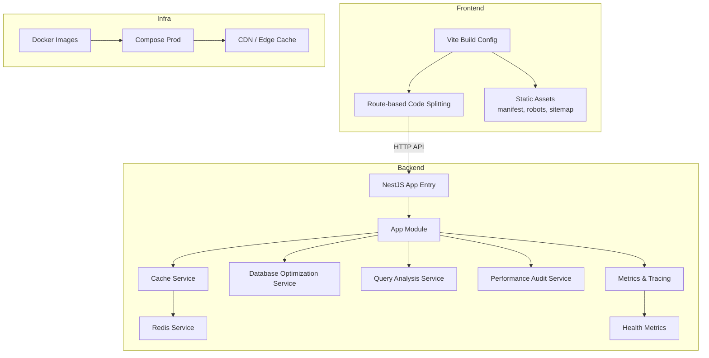
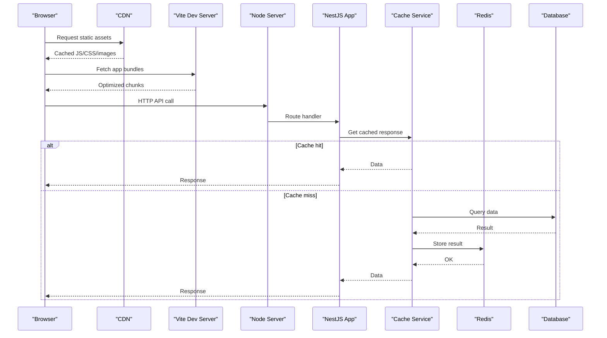
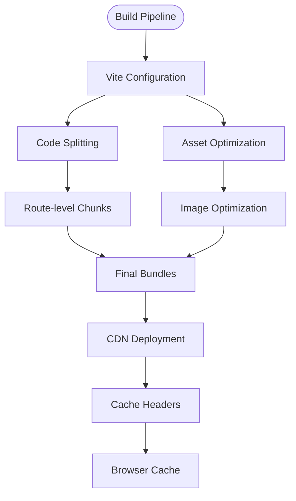
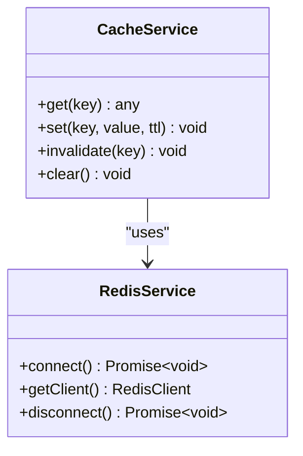
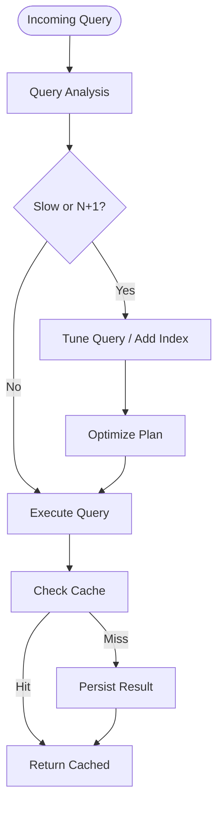
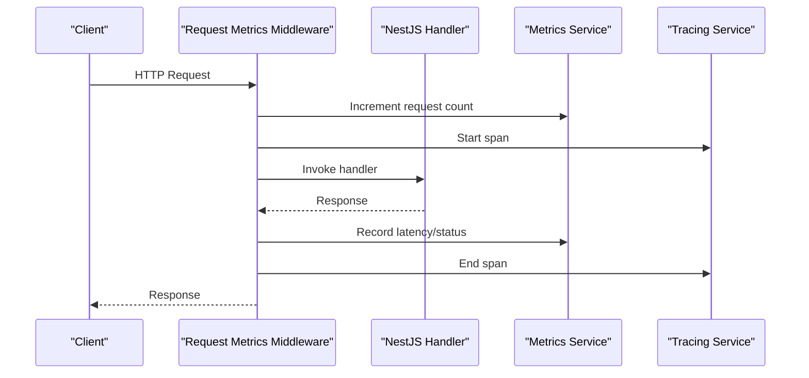
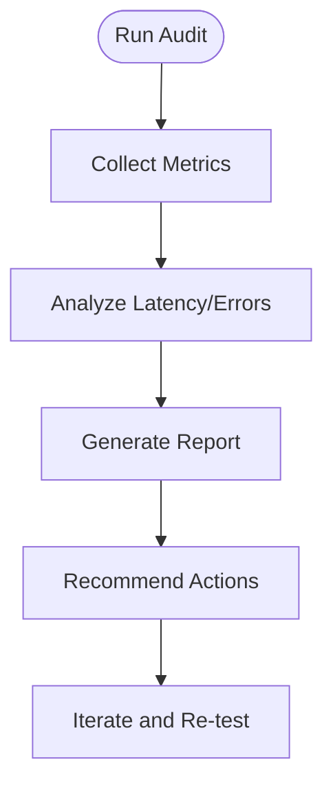
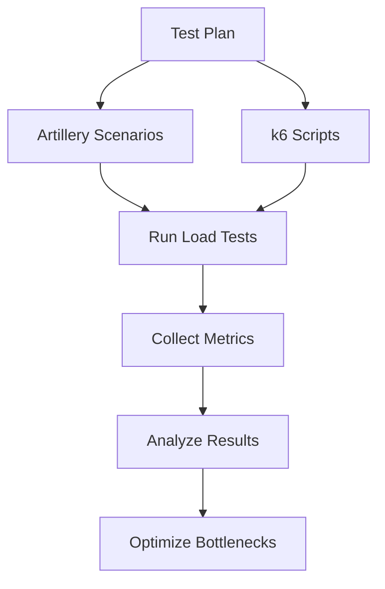
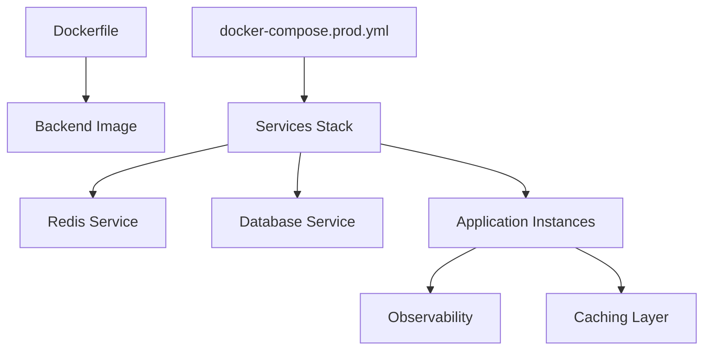
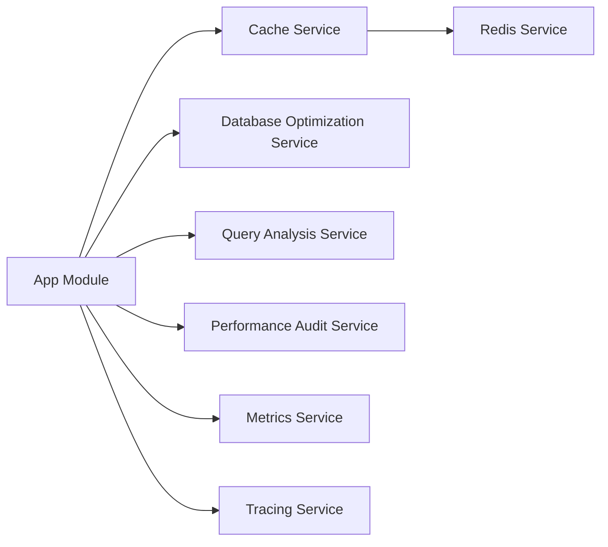

# Performance Optimization

<cite>
**Referenced Files in This Document**
- [vite.config.ts](file://vite.config.ts)
- [package.json](file://package.json)
- [src/server.ts](file://src/server.ts)
- [apps/backend/src/main.ts](file://apps/backend/src/main.ts)
- [apps/backend/src/app.module.ts](file://apps/backend/src/app.module.ts)
- [apps/backend/src/config/configuration.ts](file://apps/backend/src/config/configuration.ts)
- [apps/backend/src/redis/redis.service.ts](file://apps/backend/src/redis/redis.service.ts)
- [apps/backend/src/core/cache/cache.service.ts](file://apps/backend/src/core/cache/cache.service.ts)
- [apps/backend/src/hardening/database-optimization.service.ts](file://apps/backend/src/hardening/database-optimization.service.ts)
- [apps/backend/src/hardening/query-analysis.service.ts](file://apps/backend/src/hardening/query-analysis.service.ts)
- [apps/backend/src/hardening/performance-audit.service.ts](file://apps/backend/src/hardening/performance-audit.service.ts)
- [apps/backend/src/observability/metrics.service.ts](file://apps/backend/src/observability/metrics.service.ts)
- [apps/backend/src/observability/tracing.service.ts](file://apps/backend/src/observability/tracing.service.ts)
- [apps/backend/src/observability/request-metrics.middleware.ts](file://apps/backend/src/observability/request-metrics.middleware.ts)
- [apps/backend/src/observability/health-metrics.service.ts](file://apps/backend/src/observability/health-metrics.service.ts)
- [apps/backend/prisma/schema.prisma](file://apps/backend/prisma/schema.prisma)
- [apps/backend/loadtests/artillery/load.yml](file://apps/backend/loadtests/artillery/load.yml)
- [apps/backend/loadtests/k6/load.js](file://apps/backend/loadtests/k6/load.js)
- [apps/backend/Dockerfile](file://apps/backend/Dockerfile)
- [apps/backend/docker-compose.prod.yml](file://apps/backend/docker-compose.prod.yml)
- [public/manifest.webmanifest](file://public/manifest.webmanifest)
- [public/robots.txt](file://public/robots.txt)
- [public/sitemap.xml](file://public/sitemap.xml)
</cite>

## Table of Contents
1. [Introduction](#introduction)
2. [Project Structure](#project-structure)
3. [Core Components](#core-components)
4. [Architecture Overview](#architecture-overview)
5. [Detailed Component Analysis](#detailed-component-analysis)
6. [Dependency Analysis](#dependency-analysis)
7. [Performance Considerations](#performance-considerations)
8. [Troubleshooting Guide](#troubleshooting-guide)
9. [Conclusion](#conclusion)
10. [Appendices](#appendices)

## Introduction
This document provides a comprehensive performance optimization guide for Chronicle Your Media Story, covering frontend and backend strategies. It explains bundle splitting, lazy loading, image optimization, caching, database query tuning, Redis integration, memory management, profiling, monitoring, CDN configuration, load balancing, auto-scaling, and performance testing methodologies. The guidance is grounded in the repository’s build configuration, server setup, caching modules, observability services, Prisma schema, and load tests.

## Project Structure
The project consists of:
- A Vite-based frontend with route-level code splitting and static assets under public.
- A NestJS backend with modular services for caching, observability, hardening (database optimization), and Redis integration.
- Dockerized deployment configurations and load test suites using Artillery and k6.

**Diagram sources**
- [vite.config.ts](file://vite.config.ts)
- [src/server.ts](file://src/server.ts)
- [apps/backend/src/main.ts](file://apps/backend/src/main.ts)
- [apps/backend/src/app.module.ts](file://apps/backend/src/app.module.ts)
- [apps/backend/src/core/cache/cache.service.ts](file://apps/backend/src/core/cache/cache.service.ts)
- [apps/backend/src/redis/redis.service.ts](file://apps/backend/src/redis/redis.service.ts)
- [apps/backend/src/hardening/database-optimization.service.ts](file://apps/backend/src/hardening/database-optimization.service.ts)
- [apps/backend/src/hardening/query-analysis.service.ts](file://apps/backend/src/hardening/query-analysis.service.ts)
- [apps/backend/src/hardening/performance-audit.service.ts](file://apps/backend/src/hardening/performance-audit.service.ts)
- [apps/backend/src/observability/metrics.service.ts](file://apps/backend/src/observability/metrics.service.ts)
- [apps/backend/src/observability/tracing.service.ts](file://apps/backend/src/observability/tracing.service.ts)
- [apps/backend/src/observability/health-metrics.service.ts](file://apps/backend/src/observability/health-metrics.service.ts)
- [apps/backend/Dockerfile](file://apps/backend/Dockerfile)
- [apps/backend/docker-compose.prod.yml](file://apps/backend/docker-compose.prod.yml)
- [public/manifest.webmanifest](file://public/manifest.webmanifest)
- [public/robots.txt](file://public/robots.txt)
- [public/sitemap.xml](file://public/sitemap.xml)

**Section sources**
- [vite.config.ts](file://vite.config.ts)
- [package.json](file://package.json)
- [src/server.ts](file://src/server.ts)
- [apps/backend/src/main.ts](file://apps/backend/src/main.ts)
- [apps/backend/src/app.module.ts](file://apps/backend/src/app.module.ts)
- [apps/backend/Dockerfile](file://apps/backend/Dockerfile)
- [apps/backend/docker-compose.prod.yml](file://apps/backend/docker-compose.prod.yml)
- [public/manifest.webmanifest](file://public/manifest.webmanifest)
- [public/robots.txt](file://public/robots.txt)
- [public/sitemap.xml](file://public/sitemap.xml)

## Core Components
Key performance-related components include:
- Frontend build and bundling via Vite, enabling code splitting and asset optimization.
- Backend caching layer through a cache service and Redis client.
- Database optimization and query analysis services to reduce latency and resource usage.
- Observability stack for metrics, tracing, and health checks.
- Load testing tooling for benchmarking and capacity planning.

**Section sources**
- [vite.config.ts](file://vite.config.ts)
- [apps/backend/src/core/cache/cache.service.ts](file://apps/backend/src/core/cache/cache.service.ts)
- [apps/backend/src/redis/redis.service.ts](file://apps/backend/src/redis/redis.service.ts)
- [apps/backend/src/hardening/database-optimization.service.ts](file://apps/backend/src/hardening/database-optimization.service.ts)
- [apps/backend/src/hardening/query-analysis.service.ts](file://apps/backend/src/hardening/query-analysis.service.ts)
- [apps/backend/src/hardening/performance-audit.service.ts](file://apps/backend/src/hardening/performance-audit.service.ts)
- [apps/backend/src/observability/metrics.service.ts](file://apps/backend/src/observability/metrics.service.ts)
- [apps/backend/src/observability/tracing.service.ts](file://apps/backend/src/observability/tracing.service.ts)
- [apps/backend/src/observability/request-metrics.middleware.ts](file://apps/backend/src/observability/request-metrics.middleware.ts)
- [apps/backend/src/observability/health-metrics.service.ts](file://apps/backend/src/observability/health-metrics.service.ts)
- [apps/backend/loadtests/artillery/load.yml](file://apps/backend/loadtests/artillery/load.yml)
- [apps/backend/loadtests/k6/load.js](file://apps/backend/loadtests/k6/load.js)

## Architecture Overview
The system uses a modern frontend built with Vite that communicates with a NestJS backend. Caching is implemented at the application layer with Redis, while database queries are optimized via dedicated services. Observability is integrated through metrics and tracing, and production deployments are containerized with Docker and orchestrated via Compose.

**Diagram sources**
- [vite.config.ts](file://vite.config.ts)
- [src/server.ts](file://src/server.ts)
- [apps/backend/src/main.ts](file://apps/backend/src/main.ts)
- [apps/backend/src/core/cache/cache.service.ts](file://apps/backend/src/core/cache/cache.service.ts)
- [apps/backend/src/redis/redis.service.ts](file://apps/backend/src/redis/redis.service.ts)
- [apps/backend/prisma/schema.prisma](file://apps/backend/prisma/schema.prisma)

## Detailed Component Analysis

### Frontend Optimization: Bundle Splitting, Lazy Loading, Image Optimization, Caching
- Vite configuration enables efficient bundling and code splitting by default; ensure dynamic imports for heavy routes or features to minimize initial payload.
- Static assets such as manifest, robots, and sitemap should be served via CDN with long-lived cache headers.
- Implement lazy loading for images and media-heavy components to improve Time to Interactive.
- Use browser caching policies and service workers where applicable to cache API responses and static assets.

**Diagram sources**
- [vite.config.ts](file://vite.config.ts)
- [public/manifest.webmanifest](file://public/manifest.webmanifest)
- [public/robots.txt](file://public/robots.txt)
- [public/sitemap.xml](file://public/sitemap.xml)

**Section sources**
- [vite.config.ts](file://vite.config.ts)
- [public/manifest.webmanifest](file://public/manifest.webmanifest)
- [public/robots.txt](file://public/robots.txt)
- [public/sitemap.xml](file://public/sitemap.xml)

### Backend Caching Strategy: Application Cache and Redis
- The cache service abstracts caching operations, promoting reuse across modules.
- Redis service provides connection management and client access for distributed caching.
- Recommended patterns: cache-aside for read-heavy endpoints, write-through for consistency-critical paths, and TTL-based invalidation.

**Diagram sources**
- [apps/backend/src/core/cache/cache.service.ts](file://apps/backend/src/core/cache/cache.service.ts)
- [apps/backend/src/redis/redis.service.ts](file://apps/backend/src/redis/redis.service.ts)

**Section sources**
- [apps/backend/src/core/cache/cache.service.ts](file://apps/backend/src/core/cache/cache.service.ts)
- [apps/backend/src/redis/redis.service.ts](file://apps/backend/src/redis/redis.service.ts)

### Database Query Optimization and Schema Tuning
- Database optimization service centralizes query tuning practices and indexes recommendations.
- Query analysis service helps identify slow queries and N+1 patterns.
- Prisma schema defines entities and relationships; ensure appropriate indexes and constraints to support frequent queries.

**Diagram sources**
- [apps/backend/src/hardening/query-analysis.service.ts](file://apps/backend/src/hardening/query-analysis.service.ts)
- [apps/backend/src/hardening/database-optimization.service.ts](file://apps/backend/src/hardening/database-optimization.service.ts)
- [apps/backend/prisma/schema.prisma](file://apps/backend/prisma/schema.prisma)

**Section sources**
- [apps/backend/src/hardening/query-analysis.service.ts](file://apps/backend/src/hardening/query-analysis.service.ts)
- [apps/backend/src/hardening/database-optimization.service.ts](file://apps/backend/src/hardening/database-optimization.service.ts)
- [apps/backend/prisma/schema.prisma](file://apps/backend/prisma/schema.prisma)

### Observability and Profiling: Metrics, Tracing, and Health Checks
- Metrics service exposes key performance indicators and custom counters.
- Tracing service enables distributed tracing for request flows.
- Request metrics middleware captures per-request latency and error rates.
- Health metrics service aggregates system health signals.

**Diagram sources**
- [apps/backend/src/observability/request-metrics.middleware.ts](file://apps/backend/src/observability/request-metrics.middleware.ts)
- [apps/backend/src/observability/metrics.service.ts](file://apps/backend/src/observability/metrics.service.ts)
- [apps/backend/src/observability/tracing.service.ts](file://apps/backend/src/observability/tracing.service.ts)
- [apps/backend/src/observability/health-metrics.service.ts](file://apps/backend/src/observability/health-metrics.service.ts)

**Section sources**
- [apps/backend/src/observability/metrics.service.ts](file://apps/backend/src/observability/metrics.service.ts)
- [apps/backend/src/observability/tracing.service.ts](file://apps/backend/src/observability/tracing.service.ts)
- [apps/backend/src/observability/request-metrics.middleware.ts](file://apps/backend/src/observability/request-metrics.middleware.ts)
- [apps/backend/src/observability/health-metrics.service.ts](file://apps/backend/src/observability/health-metrics.service.ts)

### Performance Auditing and Hardening
- Performance audit service provides routines to evaluate bottlenecks and recommend optimizations.
- Integrates with metrics and tracing to correlate performance regressions.

**Diagram sources**
- [apps/backend/src/hardening/performance-audit.service.ts](file://apps/backend/src/hardening/performance-audit.service.ts)

**Section sources**
- [apps/backend/src/hardening/performance-audit.service.ts](file://apps/backend/src/hardening/performance-audit.service.ts)

### Load Testing and Benchmarking
- Artillery and k6 scripts define load, smoke, soak, spike, and stress scenarios.
- Use these suites to validate scaling behavior, identify bottlenecks, and establish baselines.

**Diagram sources**
- [apps/backend/loadtests/artillery/load.yml](file://apps/backend/loadtests/artillery/load.yml)
- [apps/backend/loadtests/k6/load.js](file://apps/backend/loadtests/k6/load.js)

**Section sources**
- [apps/backend/loadtests/artillery/load.yml](file://apps/backend/loadtests/artillery/load.yml)
- [apps/backend/loadtests/k6/load.js](file://apps/backend/loadtests/k6/load.js)

### Containerization and Production Deployment
- Dockerfile builds the backend image with optimized layers.
- docker-compose.prod.yml configures production services including Redis and database connections.
- Ensure environment variables for Redis host/port and cache TTLs are set securely.

**Diagram sources**
- [apps/backend/Dockerfile](file://apps/backend/Dockerfile)
- [apps/backend/docker-compose.prod.yml](file://apps/backend/docker-compose.prod.yml)

**Section sources**
- [apps/backend/Dockerfile](file://apps/backend/Dockerfile)
- [apps/backend/docker-compose.prod.yml](file://apps/backend/docker-compose.prod.yml)

## Dependency Analysis
The backend module orchestrates core services:
- Cache service depends on Redis service for distributed caching.
- Hardening services depend on database and query analysis tools.
- Observability services provide cross-cutting concerns for metrics and tracing.

**Diagram sources**
- [apps/backend/src/app.module.ts](file://apps/backend/src/app.module.ts)
- [apps/backend/src/core/cache/cache.service.ts](file://apps/backend/src/core/cache/cache.service.ts)
- [apps/backend/src/redis/redis.service.ts](file://apps/backend/src/redis/redis.service.ts)
- [apps/backend/src/hardening/database-optimization.service.ts](file://apps/backend/src/hardening/database-optimization.service.ts)
- [apps/backend/src/hardening/query-analysis.service.ts](file://apps/backend/src/hardening/query-analysis.service.ts)
- [apps/backend/src/hardening/performance-audit.service.ts](file://apps/backend/src/hardening/performance-audit.service.ts)
- [apps/backend/src/observability/metrics.service.ts](file://apps/backend/src/observability/metrics.service.ts)
- [apps/backend/src/observability/tracing.service.ts](file://apps/backend/src/observability/tracing.service.ts)

**Section sources**
- [apps/backend/src/app.module.ts](file://apps/backend/src/app.module.ts)
- [apps/backend/src/core/cache/cache.service.ts](file://apps/backend/src/core/cache/cache.service.ts)
- [apps/backend/src/redis/redis.service.ts](file://apps/backend/src/redis/redis.service.ts)
- [apps/backend/src/hardening/database-optimization.service.ts](file://apps/backend/src/hardening/database-optimization.service.ts)
- [apps/backend/src/hardening/query-analysis.service.ts](file://apps/backend/src/hardening/query-analysis.service.ts)
- [apps/backend/src/hardening/performance-audit.service.ts](file://apps/backend/src/hardening/performance-audit.service.ts)
- [apps/backend/src/observability/metrics.service.ts](file://apps/backend/src/observability/metrics.service.ts)
- [apps/backend/src/observability/tracing.service.ts](file://apps/backend/src/observability/tracing.service.ts)

## Performance Considerations
- Frontend:
  - Enable route-level code splitting and lazy-load heavy components.
  - Optimize images (WebP/AVIF), use responsive sizes, and defer offscreen images.
  - Configure CDN with aggressive caching for static assets and immutable URLs.
- Backend:
  - Use cache-aside pattern with appropriate TTLs; invalidate on writes.
  - Profile database queries regularly; add indexes and avoid N+1 patterns.
  - Monitor memory usage and tune process limits; consider worker processes for CPU-bound tasks.
- Infrastructure:
  - Deploy behind a CDN and reverse proxy with TLS termination.
  - Implement horizontal scaling with stateless instances and shared Redis.
  - Set up auto-scaling based on CPU/memory and request latency thresholds.

[No sources needed since this section provides general guidance]

## Troubleshooting Guide
Common issues and resolutions:
- High latency spikes:
  - Inspect request metrics and traces to locate slow endpoints.
  - Check Redis connectivity and cache hit ratios.
- Memory leaks:
  - Use heap snapshots and monitor RSS growth; review event listeners and caches.
- Database bottlenecks:
  - Review slow query logs; analyze execution plans; add missing indexes.
- Cache misses:
  - Validate TTL settings and key naming conventions; ensure consistent serialization.

**Section sources**
- [apps/backend/src/observability/request-metrics.middleware.ts](file://apps/backend/src/observability/request-metrics.middleware.ts)
- [apps/backend/src/observability/metrics.service.ts](file://apps/backend/src/observability/metrics.service.ts)
- [apps/backend/src/observability/tracing.service.ts](file://apps/backend/src/observability/tracing.service.ts)
- [apps/backend/src/redis/redis.service.ts](file://apps/backend/src/redis/redis.service.ts)
- [apps/backend/src/hardening/query-analysis.service.ts](file://apps/backend/src/hardening/query-analysis.service.ts)

## Conclusion
By combining Vite-driven frontend optimizations, robust caching with Redis, database query tuning, and comprehensive observability, Chronicle Your Media Story can achieve high performance and scalability. Continuous load testing and profiling ensure sustained reliability under varying workloads. Adopting CDN, load balancing, and auto-scaling further enhances resilience and responsiveness in production.

[No sources needed since this section summarizes without analyzing specific files]

## Appendices

### Environment and Configuration
- Ensure Redis host, port, and credentials are configured securely.
- Set cache TTLs based on data volatility and consistency requirements.
- Configure environment variables for metrics endpoints and tracing sampling.

**Section sources**
- [apps/backend/src/config/configuration.ts](file://apps/backend/src/config/configuration.ts)
- [apps/backend/src/redis/redis.service.ts](file://apps/backend/src/redis/redis.service.ts)

### Best Practices Checklist
- Frontend:
  - Use dynamic imports for large modules.
  - Serve optimized images and enable compression.
  - Leverage CDN caching and versioned assets.
- Backend:
  - Cache frequently accessed data with short TTLs.
  - Index database columns used in filters and joins.
  - Monitor and alert on latency percentiles and error rates.
- Infrastructure:
  - Scale horizontally with stateless services.
  - Use health checks and readiness probes.
  - Automate load tests in CI/CD pipelines.

[No sources needed since this section provides general guidance]