# Security Guide

<cite>
**Referenced Files in This Document**
- [SECURITY.md](file://docs/SECURITY.md)
- [app.module.ts](file://apps/backend/src/app.module.ts)
- [main.ts](file://apps/backend/src/main.ts)
- [auth.controller.ts](file://apps/backend/src/auth/auth.controller.ts)
- [auth.service.ts](file://apps/backend/src/auth/auth.service.ts)
- [auth.module.ts](file://apps/backend/src/auth/auth.module.ts)
- [configuration.ts](file://apps/backend/src/config/configuration.ts)
- [env.validation.ts](file://apps/backend/src/config/env.validation.ts)
- [rate-limit-audit.service.ts](file://apps/backend/src/hardening/rate-limit-audit.service.ts)
- [database-optimization.service.ts](file://apps/backend/src/hardening/database-optimization.service.ts)
- [storage.service.ts](file://apps/backend/src/storage/storage.service.ts)
- [upload.service.ts](file://apps/backend/src/storage/upload.service.ts)
- [signed-url.service.ts](file://apps/backend/src/storage/signed-url.service.ts)
- [image-processor.service.ts](file://apps/backend/src/storage/image-processor.service.ts)
- [prisma.service.ts](file://apps/backend/src/prisma/prisma.service.ts)
- [schema.prisma](file://apps/backend/prisma/schema.prisma)
- [request-metrics.middleware.ts](file://apps/backend/src/observability/request-metrics.middleware.ts)
- [production-configuration.service.ts](file://apps/backend/src/deployment/production-configuration.service.ts)
- [environment-validation.service.ts](file://apps/backend/src/deployment/environment-validation.service.ts)
- [ci.yml](file://.github/workflows/ci.yml)
- [release.yml](file://.github/workflows/release.yml)
</cite>

## Table of Contents
1. Introduction
2. Project Structure
3. Core Components
4. Architecture Overview
5. Detailed Component Analysis
6. Dependency Analysis
7. Performance Considerations
8. Troubleshooting Guide
9. Conclusion
10. Appendices

## Introduction
This Security Guide documents the security posture and controls for Chronicle Your Media Story, focusing on authentication with JWT tokens, session handling, password policies, input validation, output sanitization, SQL injection prevention, CORS configuration, rate limiting, API security, data protection (encryption at rest and in transit), secure file uploads, sensitive data handling, security headers, HTTPS configuration, third-party service security, vulnerability scanning, and audit procedures. The guide synthesizes backend implementation details from NestJS modules, Prisma ORM usage, storage services, observability middleware, deployment hardening, and CI/CD workflows to provide actionable guidance for developers and operators.

## Project Structure
The application is a monorepo with a NestJS backend under apps/backend and a frontend under src. Security-relevant areas include:
- Authentication module (controllers, services, guards, strategies, DTOs)
- Configuration and environment validation
- Storage and upload services
- Hardening utilities (rate limit auditing, database optimization)
- Observability middleware for request metrics
- Deployment and production configuration services
- CI/CD pipelines for automated checks

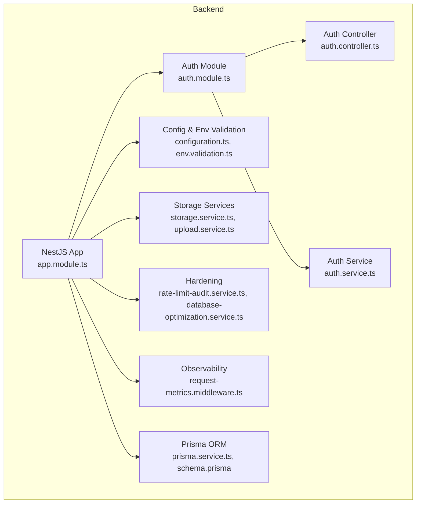

**Diagram sources**
- [app.module.ts](file://apps/backend/src/app.module.ts)
- [auth.module.ts](file://apps/backend/src/auth/auth.module.ts)
- [auth.controller.ts](file://apps/backend/src/auth/auth.controller.ts)
- [auth.service.ts](file://apps/backend/src/auth/auth.service.ts)
- [configuration.ts](file://apps/backend/src/config/configuration.ts)
- [env.validation.ts](file://apps/backend/src/config/env.validation.ts)
- [storage.service.ts](file://apps/backend/src/storage/storage.service.ts)
- [upload.service.ts](file://apps/backend/src/storage/upload.service.ts)
- [rate-limit-audit.service.ts](file://apps/backend/src/hardening/rate-limit-audit.service.ts)
- [database-optimization.service.ts](file://apps/backend/src/hardening/database-optimization.service.ts)
- [request-metrics.middleware.ts](file://apps/backend/src/observability/request-metrics.middleware.ts)
- [prisma.service.ts](file://apps/backend/src/prisma/prisma.service.ts)
- [schema.prisma](file://apps/backend/prisma/schema.prisma)

**Section sources**
- [SECURITY.md](file://docs/SECURITY.md)
- [app.module.ts](file://apps/backend/src/app.module.ts)
- [main.ts](file://apps/backend/src/main.ts)

## Core Components
- Authentication and Authorization:
  - Controllers expose endpoints for login, registration, password reset, and token refresh.
  - Services implement business logic for user management, credential verification, and token issuance/validation.
  - Guards enforce route-level authorization using JWT and role-based checks.
  - Strategies configure JWT parsing and verification.
- Input Validation and Output Sanitization:
  - DTOs define strict schemas for request payloads; pipes validate and transform inputs.
  - Responses are structured via common response wrappers to avoid leaking internals.
- Database Access:
  - Prisma ORM ensures parameterized queries and type-safe operations to prevent SQL injection.
  - Schema enforces constraints and relationships.
- Storage and Uploads:
  - Storage and upload services handle file ingestion, validation, processing, and access control.
  - Signed URL service issues short-lived, scoped URLs for secure downloads/uploads.
- Rate Limiting and Hardening:
  - Rate limit auditing tracks and reports throttling behavior.
  - Database optimization service helps mitigate slow queries and resource exhaustion.
- Observability:
  - Request metrics middleware captures latency and error rates for security monitoring.
- Configuration and Environment:
  - Centralized configuration and environment validation ensure secure defaults and required secrets.
- Deployment and Production:
  - Production configuration service applies hardened settings.
  - Environment validation service verifies critical security variables at startup.

**Section sources**
- [auth.controller.ts](file://apps/backend/src/auth/auth.controller.ts)
- [auth.service.ts](file://apps/backend/src/auth/auth.service.ts)
- [auth.module.ts](file://apps/backend/src/auth/auth.module.ts)
- [configuration.ts](file://apps/backend/src/config/configuration.ts)
- [env.validation.ts](file://apps/backend/src/config/env.validation.ts)
- [storage.service.ts](file://apps/backend/src/storage/storage.service.ts)
- [upload.service.ts](file://apps/backend/src/storage/upload.service.ts)
- [signed-url.service.ts](file://apps/backend/src/storage/signed-url.service.ts)
- [rate-limit-audit.service.ts](file://apps/backend/src/hardening/rate-limit-audit.service.ts)
- [database-optimization.service.ts](file://apps/backend/src/hardening/database-optimization.service.ts)
- [request-metrics.middleware.ts](file://apps/backend/src/observability/request-metrics.middleware.ts)
- [production-configuration.service.ts](file://apps/backend/src/deployment/production-configuration.service.ts)
- [environment-validation.service.ts](file://apps/backend/src/deployment/environment-validation.service.ts)
- [prisma.service.ts](file://apps/backend/src/prisma/prisma.service.ts)
- [schema.prisma](file://apps/backend/prisma/schema.prisma)

## Architecture Overview
The backend uses NestJS modular architecture with clear separation between controllers, services, repositories, and shared modules. Authentication flows through controllers to services, which interact with Prisma for persistence. Storage operations are abstracted behind services that enforce validation and access controls. Observability and hardening components integrate via middleware and services.

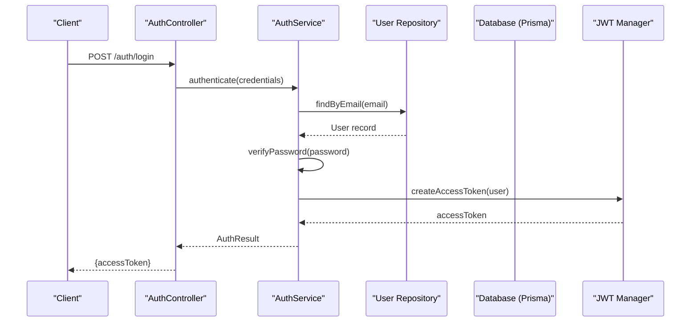

**Diagram sources**
- [auth.controller.ts](file://apps/backend/src/auth/auth.controller.ts)
- [auth.service.ts](file://apps/backend/src/auth/auth.service.ts)
- [prisma.service.ts](file://apps/backend/src/prisma/prisma.service.ts)
- [schema.prisma](file://apps/backend/prisma/schema.prisma)

## Detailed Component Analysis

### Authentication and JWT Token Management
- Endpoints:
  - Login, register, password reset, and token refresh are exposed by the auth controller.
- Token Lifecycle:
  - Access tokens are issued upon successful authentication and validated by guards.
  - Refresh mechanisms should be implemented to rotate tokens securely.
- Session Handling:
  - Stateless JWT sessions are preferred; if stateful sessions are used, ensure secure cookie attributes and server-side store integrity.
- Password Policies:
  - Enforce strong password requirements during registration and updates.
  - Hash passwords using a secure algorithm before storage.

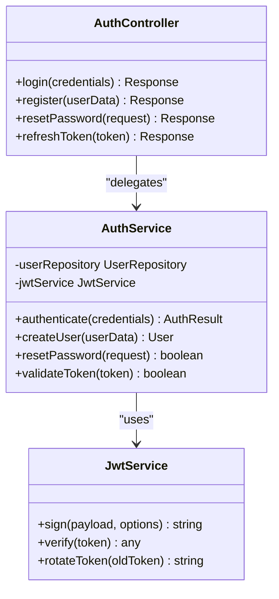

**Diagram sources**
- [auth.controller.ts](file://apps/backend/src/auth/auth.controller.ts)
- [auth.service.ts](file://apps/backend/src/auth/auth.service.ts)

**Section sources**
- [auth.controller.ts](file://apps/backend/src/auth/auth.controller.ts)
- [auth.service.ts](file://apps/backend/src/auth/auth.service.ts)
- [auth.module.ts](file://apps/backend/src/auth/auth.module.ts)

### Input Validation and Output Sanitization
- Input Validation:
  - DTOs define strict schemas for all endpoints; pipes enforce types, formats, and constraints.
  - Validate nested objects and arrays to prevent malformed payloads.
- Output Sanitization:
  - Use consistent response wrappers to standardize outputs and strip internal fields.
  - Avoid leaking stack traces or debug info in production responses.

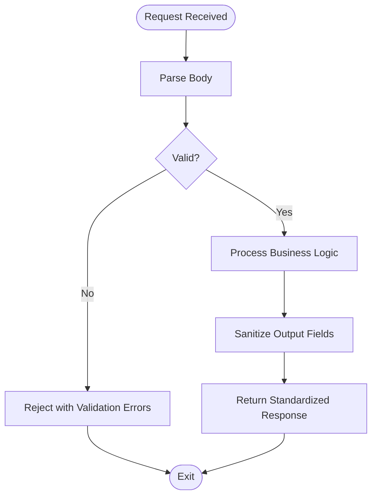

**Diagram sources**
- [auth.controller.ts](file://apps/backend/src/auth/auth.controller.ts)
- [auth.service.ts](file://apps/backend/src/auth/auth.service.ts)

**Section sources**
- [auth.controller.ts](file://apps/backend/src/auth/auth.controller.ts)
- [auth.service.ts](file://apps/backend/src/auth/auth.service.ts)

### SQL Injection Prevention
- Parameterized Queries:
  - Prisma ORM generates parameterized queries, preventing SQL injection.
- Schema Constraints:
  - Enforce data types, uniqueness, and referential integrity at the database level.
- Query Auditing:
  - Monitor slow queries and unusual patterns via database optimization services.

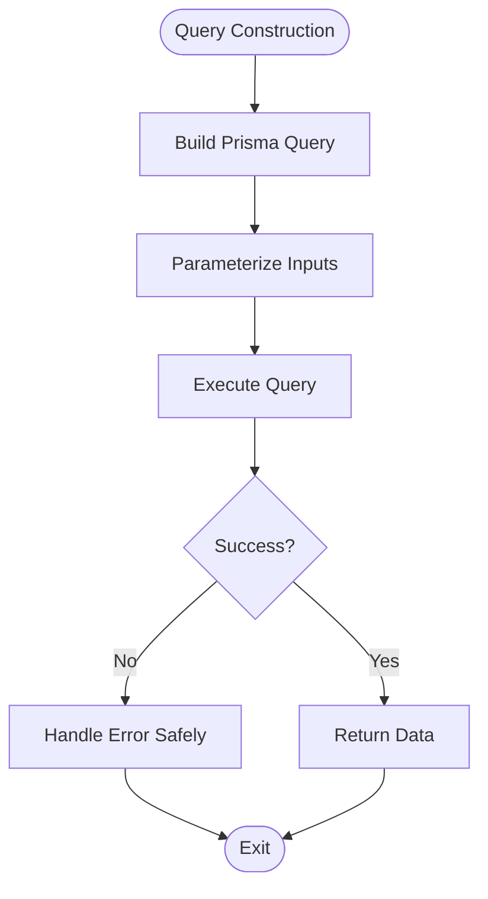

**Diagram sources**
- [prisma.service.ts](file://apps/backend/src/prisma/prisma.service.ts)
- [schema.prisma](file://apps/backend/prisma/schema.prisma)
- [database-optimization.service.ts](file://apps/backend/src/hardening/database-optimization.service.ts)

**Section sources**
- [prisma.service.ts](file://apps/backend/src/prisma/prisma.service.ts)
- [schema.prisma](file://apps/backend/prisma/schema.prisma)
- [database-optimization.service.ts](file://apps/backend/src/hardening/database-optimization.service.ts)

### CORS Configuration and API Security
- CORS:
  - Configure allowed origins, methods, and credentials explicitly.
  - Restrict wildcard domains in production.
- API Security:
  - Enforce authentication on protected routes via guards.
  - Implement CSRF protection for state-changing endpoints if cookies are used.
  - Validate and sanitize all inputs; reject unexpected fields.

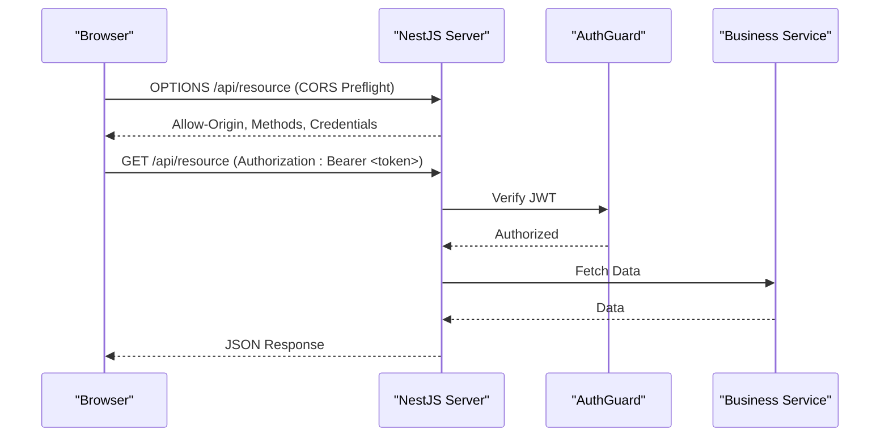

**Diagram sources**
- [main.ts](file://apps/backend/src/main.ts)
- [auth.controller.ts](file://apps/backend/src/auth/auth.controller.ts)
- [auth.service.ts](file://apps/backend/src/auth/auth.service.ts)

**Section sources**
- [main.ts](file://apps/backend/src/main.ts)
- [auth.controller.ts](file://apps/backend/src/auth/auth.controller.ts)
- [auth.service.ts](file://apps/backend/src/auth/auth.service.ts)

### Rate Limiting Implementation
- Rate Limit Auditing:
  - Track request counts per IP/user and report violations.
  - Integrate with logging and alerting systems.
- Throttling Strategy:
  - Apply stricter limits on authentication endpoints.
  - Use sliding windows or fixed counters based on requirements.

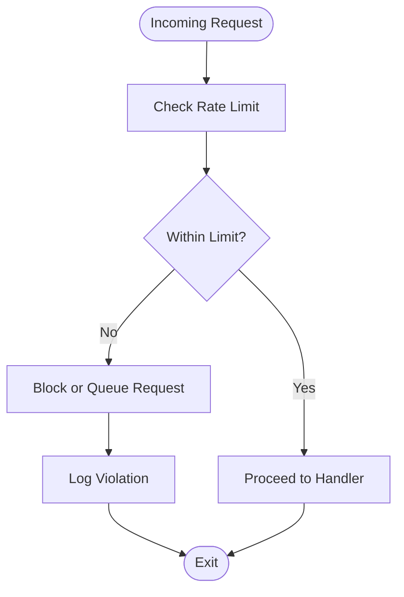

**Diagram sources**
- [rate-limit-audit.service.ts](file://apps/backend/src/hardening/rate-limit-audit.service.ts)

**Section sources**
- [rate-limit-audit.service.ts](file://apps/backend/src/hardening/rate-limit-audit.service.ts)

### Secure File Uploads and Data Protection
- Upload Validation:
  - Validate file types, sizes, and metadata before processing.
  - Scan files for malware where feasible.
- Storage Controls:
  - Store files outside web roots; use signed URLs for time-bound access.
  - Encrypt sensitive files at rest if required by policy.
- In Transit Encryption:
  - Enforce HTTPS for all endpoints; disable insecure protocols.

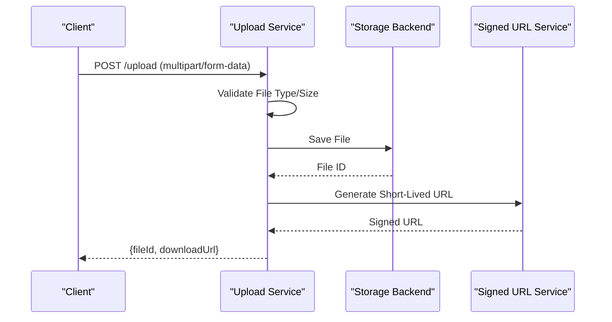

**Diagram sources**
- [upload.service.ts](file://apps/backend/src/storage/upload.service.ts)
- [storage.service.ts](file://apps/backend/src/storage/storage.service.ts)
- [signed-url.service.ts](file://apps/backend/src/storage/signed-url.service.ts)
- [image-processor.service.ts](file://apps/backend/src/storage/image-processor.service.ts)

**Section sources**
- [upload.service.ts](file://apps/backend/src/storage/upload.service.ts)
- [storage.service.ts](file://apps/backend/src/storage/storage.service.ts)
- [signed-url.service.ts](file://apps/backend/src/storage/signed-url.service.ts)
- [image-processor.service.ts](file://apps/backend/src/storage/image-processor.service.ts)

### Security Headers and HTTPS Configuration
- Security Headers:
  - Set Content-Security-Policy, X-Frame-Options, Strict-Transport-Security, and others.
- HTTPS Enforcement:
  - Redirect HTTP to HTTPS; configure TLS correctly with modern ciphers.
- Cookie Security:
  - Use Secure, HttpOnly, SameSite attributes for cookies.

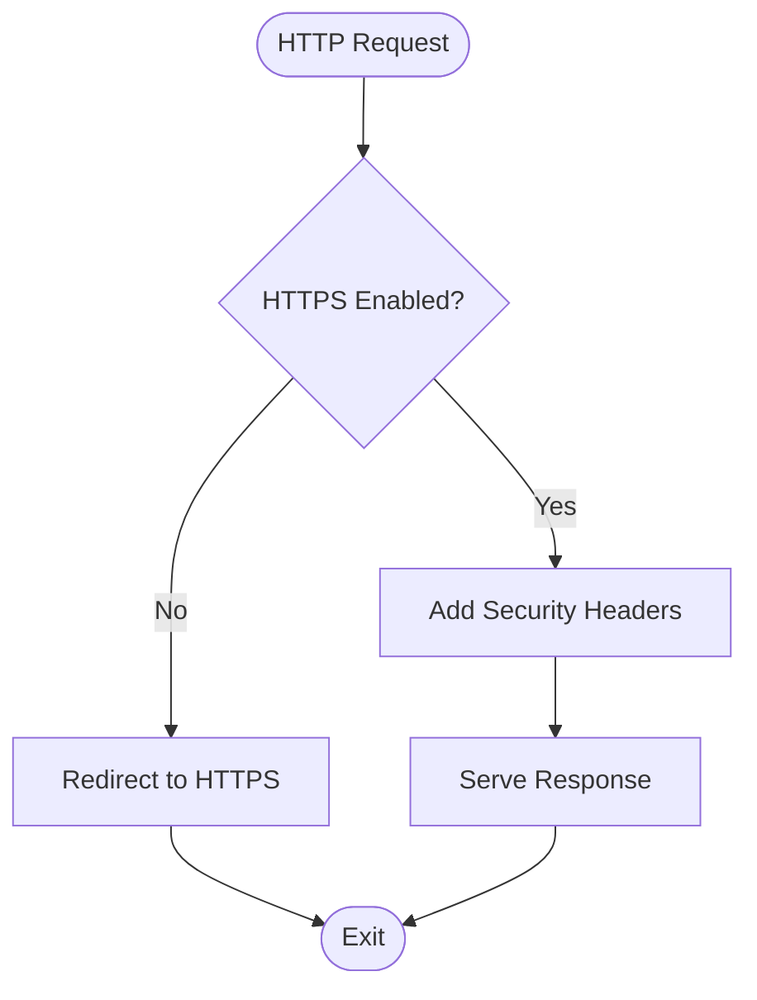

**Diagram sources**
- [main.ts](file://apps/backend/src/main.ts)
- [production-configuration.service.ts](file://apps/backend/src/deployment/production-configuration.service.ts)

**Section sources**
- [main.ts](file://apps/backend/src/main.ts)
- [production-configuration.service.ts](file://apps/backend/src/deployment/production-configuration.service.ts)

### Third-Party Service Security
- Secrets Management:
  - Store API keys and secrets in environment variables or secret managers.
- Least Privilege:
  - Grant minimal permissions to third-party integrations.
- Monitoring:
  - Log and monitor calls to external services for anomalies.

**Section sources**
- [configuration.ts](file://apps/backend/src/config/configuration.ts)
- [env.validation.ts](file://apps/backend/src/config/env.validation.ts)

### Vulnerability Scanning and Security Audit Procedures
- CI/CD Integration:
  - Run static analysis, dependency scanning, and container scans in CI.
- Regular Audits:
  - Schedule periodic security reviews and penetration testing.
- Incident Response:
  - Define procedures for detecting, containing, and remediating vulnerabilities.

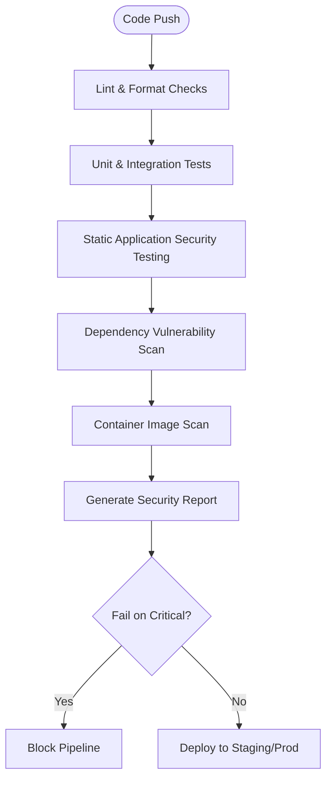

**Diagram sources**
- [ci.yml](file://.github/workflows/ci.yml)
- [release.yml](file://.github/workflows/release.yml)

**Section sources**
- [ci.yml](file://.github/workflows/ci.yml)
- [release.yml](file://.github/workflows/release.yml)

## Dependency Analysis
Security-related dependencies include authentication libraries, storage backends, and observability tools. Ensure all dependencies are up-to-date and scanned regularly.

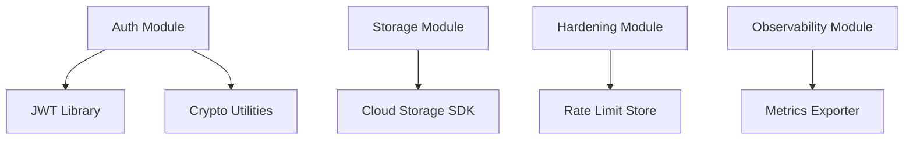

**Diagram sources**
- [auth.module.ts](file://apps/backend/src/auth/auth.module.ts)
- [storage.service.ts](file://apps/backend/src/storage/storage.service.ts)
- [rate-limit-audit.service.ts](file://apps/backend/src/hardening/rate-limit-audit.service.ts)
- [request-metrics.middleware.ts](file://apps/backend/src/observability/request-metrics.middleware.ts)

**Section sources**
- [auth.module.ts](file://apps/backend/src/auth/auth.module.ts)
- [storage.service.ts](file://apps/backend/src/storage/storage.service.ts)
- [rate-limit-audit.service.ts](file://apps/backend/src/hardening/rate-limit-audit.service.ts)
- [request-metrics.middleware.ts](file://apps/backend/src/observability/request-metrics.middleware.ts)

## Performance Considerations
- Optimize database queries and indexes to prevent DoS via slow queries.
- Cache frequently accessed data with appropriate invalidation strategies.
- Monitor memory and CPU usage; set resource limits in containers.

[No sources needed since this section provides general guidance]

## Troubleshooting Guide
- Authentication Failures:
  - Verify JWT signing keys and expiration settings.
  - Check logs for token validation errors.
- Upload Issues:
  - Validate file size limits and MIME types.
  - Inspect storage backend connectivity and permissions.
- Rate Limiting:
  - Review rate limit thresholds and client IPs.
  - Adjust limits based on traffic patterns.

**Section sources**
- [auth.service.ts](file://apps/backend/src/auth/auth.service.ts)
- [upload.service.ts](file://apps/backend/src/storage/upload.service.ts)
- [rate-limit-audit.service.ts](file://apps/backend/src/hardening/rate-limit-audit.service.ts)

## Conclusion
Chronicle Your Media Story implements a robust security foundation with JWT-based authentication, parameterized database queries, secure file uploads, rate limiting, and observability. Continuous integration includes security scanning, and production configurations enforce hardened settings. Adhering to the best practices outlined in this guide will help maintain a secure and resilient system.

[No sources needed since this section summarizes without analyzing specific files]

## Appendices
- Security Checklist:
  - Enable HTTPS and set security headers.
  - Enforce strong password policies and secure token storage.
  - Validate all inputs and sanitize outputs.
  - Use signed URLs for temporary access.
  - Monitor and log security events.
- References:
  - OWASP Top Ten
  - NIST Cybersecurity Framework

[No sources needed since this section provides general guidance]