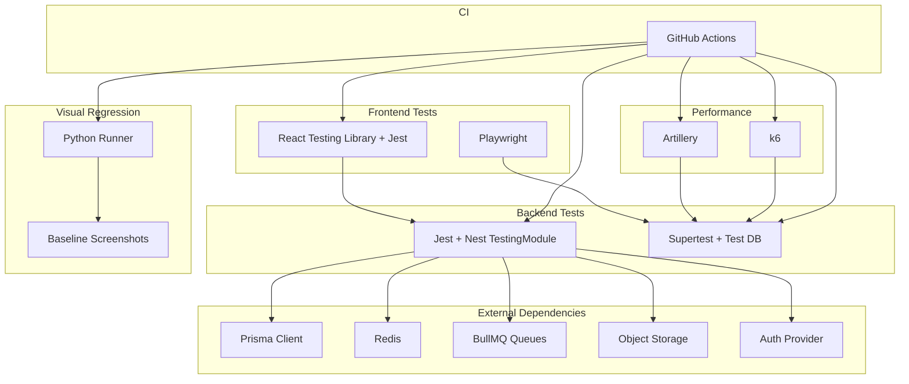
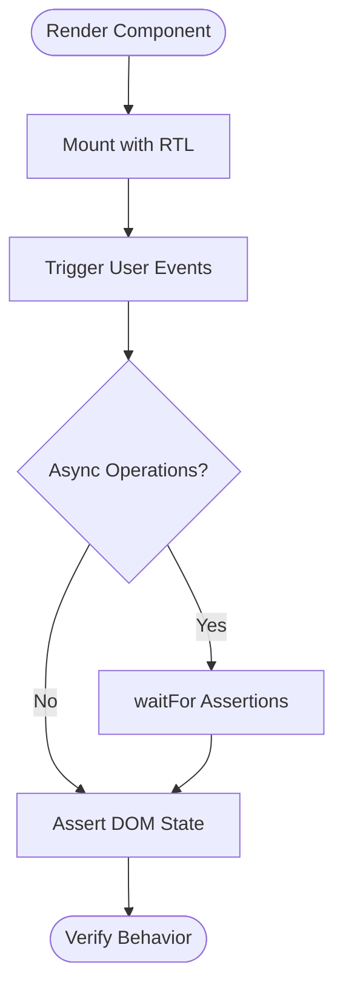
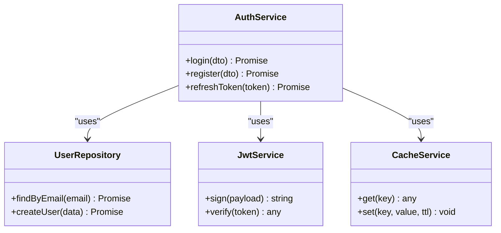
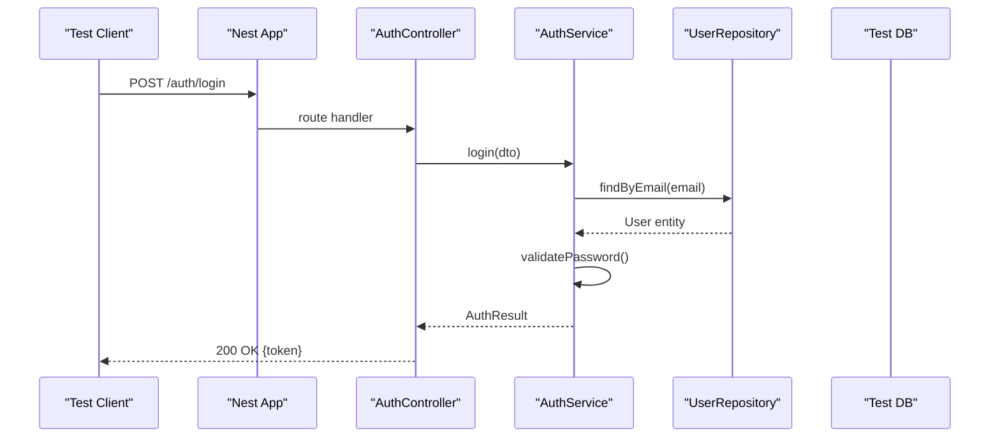
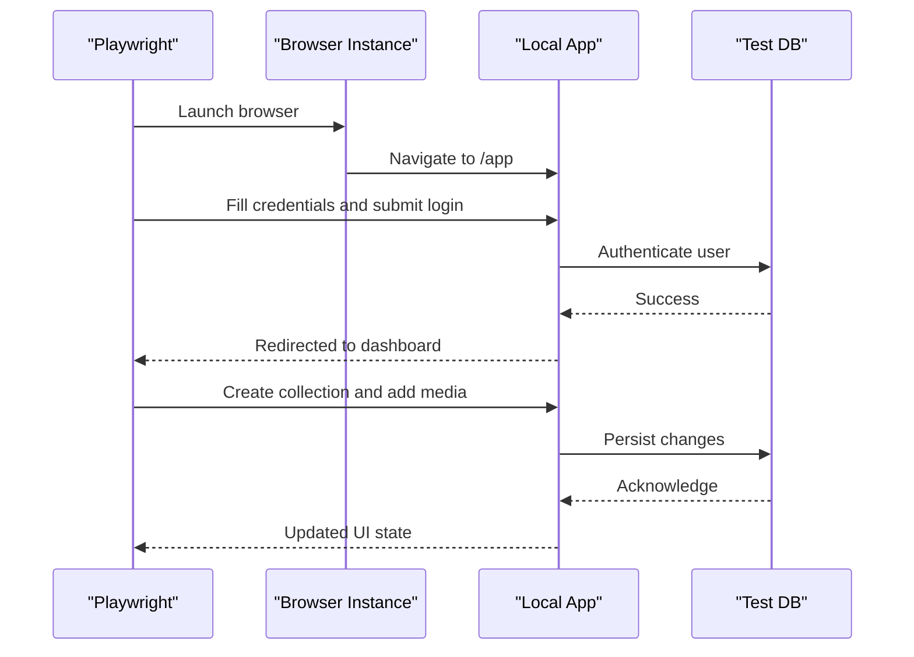
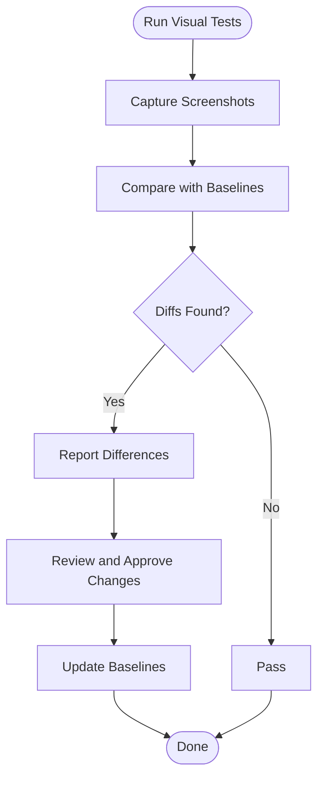
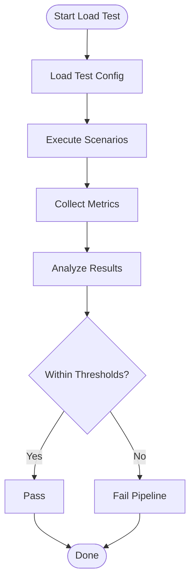
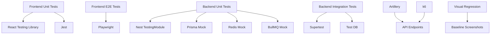

# Testing Guide

<cite>
**Referenced Files in This Document**
- [package.json](file://package.json)
- [vite.config.ts](file://vite.config.ts)
- [tsconfig.json](file://tsconfig.json)
- [.github/workflows/ci.yml](file://.github/workflows/ci.yml)
- [apps/backend/package.json](file://apps/backend/package.json)
- [apps/backend/nest-cli.json](file://apps/backend/nest-cli.json)
- [apps/backend/src/app.module.ts](file://apps/backend/src/app.module.ts)
- [apps/backend/src/main.ts](file://apps/backend/src/main.ts)
- [apps/backend/test/app.e2e.spec.ts](file://apps/backend/test/app.e2e.spec.ts)
- [apps/backend/test/auth.e2e.spec.ts](file://apps/backend/test/auth.e2e.spec.ts)
- [apps/backend/test/users.e2e.spec.ts](file://apps/backend/test/users.e2e.spec.ts)
- [apps/backend/src/auth/auth.service.spec.ts](file://apps/backend/src/auth/auth.service.spec.ts)
- [apps/backend/src/auth/auth.module.spec.ts](file://apps/backend/src/auth/auth.module.spec.ts)
- [apps/backend/src/analytics/analytics.service.spec.ts](file://apps/backend/src/analytics/analytics.service.spec.ts)
- [apps/backend/src/collections/collections.service.spec.ts](file://apps/backend/src/collections/collections.service.spec.ts)
- [apps/backend/src/journal/journal-statistics.service.spec.ts](file://apps/backend/src/journal/journal-statistics.service.spec.ts)
- [apps/backend/src/media/media.service.spec.ts](file://apps/backend/src/media/media.service.spec.ts)
- [apps/backend/src/progress/progress-calculation.service.spec.ts](file://apps/backend/src/progress/progress-calculation.service.spec.ts)
- [apps/backend/src/storage/image.service.spec.ts](file://apps/backend/src/storage/image.service.spec.ts)
- [apps/backend/src/hardening/load-test-support.service.spec.ts](file://apps/backend/src/hardening/load-test-support.service.spec.ts)
- [apps/backend/src/hardening/performance-audit.service.spec.ts](file://apps/backend/src/hardening/performance-audit.service.spec.ts)
- [apps/backend/src/hardening/query-analysis.service.spec.ts](file://apps/backend/src/hardening/query-analysis.service.spec.ts)
- [apps/backend/src/hardening/rate-limit-audit.service.spec.ts](file://apps/backend/src/hardening/rate-limit-audit.service.spec.ts)
- [apps/backend/src/observability/logging.service.spec.ts](file://apps/backend/src/observability/logging.service.spec.ts)
- [apps/backend/src/observability/metrics.service.spec.ts](file://apps/backend/src/observability/metrics.service.spec.ts)
- [apps/backend/src/observability/tracing.service.spec.ts](file://apps/backend/src/observability/tracing.service.spec.ts)
- [apps/backend/src/deployment/deployment-health.service.spec.ts](file://apps/backend/src/deployment/deployment-health.service.spec.ts)
- [apps/backend/src/deployment/environment-validation.service.spec.ts](file://apps/backend/src/deployment/environment-validation.service.spec.ts)
- [apps/backend/src/deployment/production-configuration.service.spec.ts](file://apps/backend/src/deployment/production-configuration.service.spec.ts)
- [apps/backend/src/deployment/release-validation.service.spec.ts](file://apps/backend/src/deployment/release-validation.service.spec.ts)
- [apps/backend/src/interaction/interaction.repository.spec.ts](file://apps/backend/src/interaction/interaction.repository.spec.ts)
- [apps/backend/src/library/library.repository.spec.ts](file://apps/backend/src/library/library.repository.spec.ts)
- [apps/backend/src/media/slug.service.spec.ts](file://apps/backend/src/media/slug.service.spec.ts)
- [apps/backend/src/users/users.repository.spec.ts](file://apps/backend/src/users/users.repository.spec.ts)
- [apps/backend/src/users/users.service.spec.ts](file://apps/backend/src/users/users.service.spec.ts)
- [apps/backend/src/wrapped/wrapped.service.spec.ts](file://apps/backend/src/wrapped/wrapped.service.spec.ts)
- [apps/backend/src/app.bootstrap.spec.ts](file://apps/backend/src/app.bootstrap.spec.ts)
- [apps/backend/loadtests/artillery/load.yml](file://apps/backend/loadtests/artillery/load.yml)
- [apps/backend/loadtests/artillery/smoke.yml](file://apps/backend/loadtests/artillery/smoke.yml)
- [apps/backend/loadtests/k6/load.js](file://apps/backend/loadtests/k6/load.js)
- [apps/backend/loadtests/k6/smoke.js](file://apps/backend/loadtests/k6/smoke.js)
- [apps/backend/loadtests/k6/soak.js](file://apps/backend/loadtests/k6/soak.js)
- [apps/backend/loadtests/k6/spike.js](file://apps/backend/loadtests/k6/spike.js)
- [apps/backend/loadtests/k6/stress.js](file://apps/backend/loadtests/k6/stress.js)
- [tests/e2e.test.ts](file://tests/e2e.test.ts)
- [tests/setup.ts](file://tests/setup.ts)
- [tests/components/calendar/MonthlyGrid.test.tsx](file://tests/components/calendar/MonthlyGrid.test.tsx)
- [tests/components/dashboard/DashboardGreeting.test.tsx](file://tests/components/dashboard/DashboardGreeting.test.tsx)
- [tests/components/journal/JournalEntryCard.test.tsx](file://tests/components/journal/JournalEntryCard.test.tsx)
- [tests/visual/run.py](file://tests/visual/run.py)
- [docker-compose.e2e.yml](file://docker-compose.e2e.yml)
</cite>

## Table of Contents
1. [Introduction](#introduction)
2. [Project Structure](#project-structure)
3. [Core Components](#core-components)
4. [Architecture Overview](#architecture-overview)
5. [Detailed Component Analysis](#detailed-component-analysis)
6. [Dependency Analysis](#dependency-analysis)
7. [Performance Considerations](#performance-considerations)
8. [Troubleshooting Guide](#troubleshooting-guide)
9. [Conclusion](#conclusion)
10. [Appendices](#appendices)

## Introduction
This Testing Guide explains how to test the full stack of Chronicle Your Media Story: React components and custom hooks on the frontend, NestJS services and controllers on the backend, API integration tests, database operations, external service mocking, end-to-end testing with Playwright, visual regression testing, performance and load testing, debugging techniques, and continuous integration setup. It is designed for both new contributors and experienced engineers who need a clear, actionable reference.

## Project Structure
The repository organizes tests alongside their source code where applicable (NestJS spec files next to services), and groups frontend tests under a dedicated tests directory. Backend e2e tests live under apps/backend/test. Performance scripts are under apps/backend/loadtests. Visual regression baselines and runners are under tests/visual. CI configuration is under .github/workflows.

Key locations:
- Frontend tests: tests/components, tests/e2e.test.ts, tests/setup.ts
- Backend unit/integration tests: apps/backend/src/**/*.spec.ts
- Backend e2e tests: apps/backend/test/*.spec.ts
- Load tests: apps/backend/loadtests/artillery and apps/backend/loadtests/k6
- Visual regression: tests/visual
- CI: .github/workflows/ci.yml
- Docker compose for e2e: docker-compose.e2e.yml

```mermaid
graph TB
subgraph "Frontend"
FE_TESTS["tests/*"]
VITE["vite.config.ts"]
end
subgraph "Backend"
NEST_SRC["apps/backend/src/**"]
NEST_TEST["apps/backend/test/**"]
NEST_SPEC["apps/backend/src/**/*.spec.ts"]
end
subgraph "Load Tests"
ARTILLERY["apps/backend/loadtests/artillery/*"]
K6["apps/backend/loadtests/k6/*"]
end
subgraph "Visual Regression"
VISUAL_RUN["tests/visual/run.py"]
BASELINES["tests/visual/baselines/*"]
end
subgraph "CI"
CI[".github/workflows/ci.yml"]
end
FE_TESTS --> VITE
NEST_SPEC --> NEST_SRC
NEST_TEST --> NEST_SRC
ARTILLERY --> NEST_SRC
K6 --> NEST_SRC
VISUAL_RUN --> BASELINES
CI --> FE_TESTS
CI --> NEST_SPEC
CI --> NEST_TEST
CI --> ARTILLERY
CI --> K6
```

**Diagram sources**
- [vite.config.ts](file://vite.config.ts)
- [apps/backend/src/app.module.ts](file://apps/backend/src/app.module.ts)
- [apps/backend/test/app.e2e.spec.ts](file://apps/backend/test/app.e2e.spec.ts)
- [apps/backend/loadtests/artillery/load.yml](file://apps/backend/loadtests/artillery/load.yml)
- [apps/backend/loadtests/k6/load.js](file://apps/backend/loadtests/k6/load.js)
- [tests/visual/run.py](file://tests/visual/run.py)
- [.github/workflows/ci.yml](file://.github/workflows/ci.yml)

**Section sources**
- [package.json](file://package.json)
- [vite.config.ts](file://vite.config.ts)
- [tsconfig.json](file://tsconfig.json)
- [apps/backend/package.json](file://apps/backend/package.json)
- [apps/backend/nest-cli.json](file://apps/backend/nest-cli.json)

## Core Components
This section outlines the testing strategy across layers:

- Frontend unit tests (React components and hooks):
  - Use Jest with React Testing Library for rendering and interaction assertions.
  - Place component tests under tests/components/<feature>/<Component>.test.tsx.
  - Mock external dependencies (API calls, analytics, storage) via jest.fn() or module mocks.
  - Snapshot tests can be used sparingly for stable UI fragments; prefer behavioral assertions.

- Custom hooks:
  - Test hook logic by rendering a minimal wrapper component that consumes the hook.
  - Assert state transitions, side effects, and async behavior using waitFor and act.

- Backend unit tests (NestJS services):
  - Each service has a corresponding *.spec.ts file colocated with the implementation.
  - Use Nest’s TestingModule to provide mocked repositories, Prisma client, Redis, BullMQ queues, and external HTTP clients.
  - Validate business logic, DTO validation, error handling, and edge cases.

- Backend integration tests (controllers and modules):
  - Use Supertest to call real endpoints against an in-memory or test database.
  - Seed data as needed and assert responses, status codes, and side effects.

- End-to-end tests (Playwright):
  - Full user flows such as authentication, media capture, collection creation, and journaling.
  - Run against a locally started app with test containers for DB and cache.

- Visual regression:
  - Baseline screenshots per component/page; compare new renders against baselines.
  - Fail fast on unexpected diffs; update baselines intentionally.

- Performance and load testing:
  - Artillery scenarios for smoke and load profiles.
  - k6 scripts for load, spike, soak, and stress testing.

**Section sources**
- [tests/e2e.test.ts](file://tests/e2e.test.ts)
- [tests/setup.ts](file://tests/setup.ts)
- [apps/backend/src/auth/auth.service.spec.ts](file://apps/backend/src/auth/auth.service.spec.ts)
- [apps/backend/test/app.e2e.spec.ts](file://apps/backend/test/app.e2e.spec.ts)
- [apps/backend/loadtests/artillery/load.yml](file://apps/backend/loadtests/artillery/load.yml)
- [apps/backend/loadtests/k6/load.js](file://apps/backend/loadtests/k6/load.js)
- [tests/visual/run.py](file://tests/visual/run.py)

## Architecture Overview
The testing architecture spans multiple layers and tools:



[No sources needed since this diagram shows conceptual workflow, not actual code structure]

## Detailed Component Analysis

### Frontend Unit Testing Strategy (React Components and Hooks)
- Rendering and interactions:
  - Render components with React Testing Library.
  - Interact via fireEvent or userEvent.
  - Assert DOM changes and component state.

- Async and data fetching:
  - Mock fetch/axios or use a custom query client mock.
  - Use waitFor to handle asynchronous updates.

- Hooks:
  - Wrap hooks in a test harness component.
  - Trigger events and verify state/effects.

- Best practices:
  - Keep tests focused on behavior, not implementation details.
  - Avoid heavy snapshots; prefer assertions on meaningful outputs.
  - Isolate network calls and third-party integrations.



[No sources needed since this diagram shows conceptual workflow, not actual code structure]

**Section sources**
- [tests/components/calendar/MonthlyGrid.test.tsx](file://tests/components/calendar/MonthlyGrid.test.tsx)
- [tests/components/dashboard/DashboardGreeting.test.tsx](file://tests/components/dashboard/DashboardGreeting.test.tsx)
- [tests/components/journal/JournalEntryCard.test.tsx](file://tests/components/journal/JournalEntryCard.test.tsx)

### Backend Unit Testing Strategy (NestJS Services)
- Service testing:
  - Create a Nest TestingModule with mocked dependencies (repositories, Prisma, Redis, BullMQ).
  - Inject mocks into the service constructor.
  - Assert method outcomes, exceptions, and side effects.

- Controller testing:
  - Instantiate controllers with mocked services.
  - Call controller methods directly or use Supertest for HTTP routes.

- Common patterns:
  - Mock external HTTP calls with jest.fn() or nock-like utilities.
  - Validate DTOs and pipes.
  - Ensure error propagation and proper status codes.



**Diagram sources**
- [apps/backend/src/auth/auth.service.spec.ts](file://apps/backend/src/auth/auth.service.spec.ts)

**Section sources**
- [apps/backend/src/auth/auth.service.spec.ts](file://apps/backend/src/auth/auth.service.spec.ts)
- [apps/backend/src/auth/auth.module.spec.ts](file://apps/backend/src/auth/auth.module.spec.ts)
- [apps/backend/src/analytics/analytics.service.spec.ts](file://apps/backend/src/analytics/analytics.service.spec.ts)
- [apps/backend/src/collections/collections.service.spec.ts](file://apps/backend/src/collections/collections.service.spec.ts)
- [apps/backend/src/journal/journal-statistics.service.spec.ts](file://apps/backend/src/journal/journal-statistics.service.spec.ts)
- [apps/backend/src/media/media.service.spec.ts](file://apps/backend/src/media/media.service.spec.ts)
- [apps/backend/src/progress/progress-calculation.service.spec.ts](file://apps/backend/src/progress/progress-calculation.service.spec.ts)
- [apps/backend/src/storage/image.service.spec.ts](file://apps/backend/src/storage/image.service.spec.ts)
- [apps/backend/src/users/users.service.spec.ts](file://apps/backend/src/users/users.service.spec.ts)
- [apps/backend/src/wrapped/wrapped.service.spec.ts](file://apps/backend/src/wrapped/wrapped.service.spec.ts)

### Backend Integration Testing (API Endpoints and Database)
- Setup:
  - Use Supertest to send HTTP requests to a running Nest application instance.
  - Spin up a test database (in-memory SQLite or Postgres container).
  - Seed required data before each test suite.

- Assertions:
  - Verify response status, body schema, headers, and side effects.
  - Check database state changes after mutations.

- External services:
  - Mock HTTP clients for third-party APIs.
  - Stub email/SMS providers and object storage uploads.



**Diagram sources**
- [apps/backend/test/auth.e2e.spec.ts](file://apps/backend/test/auth.e2e.spec.ts)
- [apps/backend/src/auth/auth.controller.ts](file://apps/backend/src/auth/auth.controller.ts)
- [apps/backend/src/auth/auth.service.ts](file://apps/backend/src/auth/auth.service.ts)
- [apps/backend/src/auth/repositories/user.repository.ts](file://apps/backend/src/auth/repositories/user.repository.ts)

**Section sources**
- [apps/backend/test/app.e2e.spec.ts](file://apps/backend/test/app.e2e.spec.ts)
- [apps/backend/test/auth.e2e.spec.ts](file://apps/backend/test/auth.e2e.spec.ts)
- [apps/backend/test/users.e2e.spec.ts](file://apps/backend/test/users.e2e.spec.ts)

### End-to-End Testing with Playwright
- Scope:
  - Authenticate users, navigate routes, create collections, add media, write journal entries, and verify UI states.
  - Validate cross-browser compatibility and responsive layouts.

- Setup:
  - Start the app and test containers (DB, Redis) via docker-compose.e2e.yml.
  - Configure base URL and timeouts.

- Assertions:
  - Use selectors to interact with elements.
  - Assert page content, navigation, and form submissions.



**Diagram sources**
- [tests/e2e.test.ts](file://tests/e2e.test.ts)
- [docker-compose.e2e.yml](file://docker-compose.e2e.yml)

**Section sources**
- [tests/e2e.test.ts](file://tests/e2e.test.ts)
- [tests/setup.ts](file://tests/setup.ts)
- [docker-compose.e2e.yml](file://docker-compose.e2e.yml)

### Visual Regression Testing
- Baselines:
  - Store baseline screenshots per component/page under tests/visual/baselines.
  - Update baselines when intentional UI changes occur.

- Runner:
  - Use tests/visual/run.py to capture current screenshots and compare against baselines.
  - Fail the pipeline if diffs exceed thresholds.



**Diagram sources**
- [tests/visual/run.py](file://tests/visual/run.py)

**Section sources**
- [tests/visual/run.py](file://tests/visual/run.py)

### Performance and Load Testing
- Artillery:
  - Define scenarios for smoke and load tests under apps/backend/loadtests/artillery.
  - Configure targets, phases, and assertions.

- k6:
  - Scripts for load, spike, soak, and stress tests under apps/backend/loadtests/k6.
  - Validate throughput, latency, and error rates.



**Diagram sources**
- [apps/backend/loadtests/artillery/load.yml](file://apps/backend/loadtests/artillery/load.yml)
- [apps/backend/loadtests/k6/load.js](file://apps/backend/loadtests/k6/load.js)

**Section sources**
- [apps/backend/loadtests/artillery/load.yml](file://apps/backend/loadtests/artillery/load.yml)
- [apps/backend/loadtests/artillery/smoke.yml](file://apps/backend/loadtests/artillery/smoke.yml)
- [apps/backend/loadtests/k6/load.js](file://apps/backend/loadtests/k6/load.js)
- [apps/backend/loadtests/k6/smoke.js](file://apps/backend/loadtests/k6/smoke.js)
- [apps/backend/loadtests/k6/soak.js](file://apps/backend/loadtests/k6/soak.js)
- [apps/backend/loadtests/k6/spike.js](file://apps/backend/loadtests/k6/spike.js)
- [apps/backend/loadtests/k6/stress.js](file://apps/backend/loadtests/k6/stress.js)

## Dependency Analysis
Testing dependencies span multiple layers and tools. The following diagram maps key relationships between test suites and runtime dependencies.



**Diagram sources**
- [apps/backend/src/app.module.ts](file://apps/backend/src/app.module.ts)
- [apps/backend/test/app.e2e.spec.ts](file://apps/backend/test/app.e2e.spec.ts)
- [apps/backend/loadtests/artillery/load.yml](file://apps/backend/loadtests/artillery/load.yml)
- [apps/backend/loadtests/k6/load.js](file://apps/backend/loadtests/k6/load.js)
- [tests/visual/run.py](file://tests/visual/run.py)

**Section sources**
- [apps/backend/src/app.module.ts](file://apps/backend/src/app.module.ts)
- [apps/backend/test/app.e2e.spec.ts](file://apps/backend/test/app.e2e.spec.ts)
- [apps/backend/loadtests/artillery/load.yml](file://apps/backend/loadtests/artillery/load.yml)
- [apps/backend/loadtests/k6/load.js](file://apps/backend/loadtests/k6/load.js)
- [tests/visual/run.py](file://tests/visual/run.py)

## Performance Considerations
- Frontend:
  - Prefer lightweight mocks over full implementations in unit tests.
  - Debounce or throttle simulated network calls to speed up tests.
  - Use snapshot tests judiciously to avoid flaky failures.

- Backend:
  - Isolate expensive operations (DB queries, external HTTP calls) behind interfaces and mock them.
  - Use in-memory databases for faster integration tests.
  - Limit queue processing in tests by stubbing workers.

- Load tests:
  - Start with smoke tests to validate basic functionality under load.
  - Gradually increase concurrency and duration for load and soak tests.
  - Monitor CPU, memory, and I/O metrics during tests.

[No sources needed since this section provides general guidance]

## Troubleshooting Guide
Common issues and resolutions:

- Flaky tests:
  - Add explicit waits and assertions for async operations.
  - Stabilize random data generation and timestamps.

- Network errors:
  - Ensure external services are mocked consistently.
  - Verify base URLs and environment variables in test configs.

- Database state:
  - Reset or seed data before each test suite.
  - Use transactions to rollback changes within tests.

- Visual diffs:
  - Inspect screenshot differences and adjust thresholds.
  - Update baselines only after reviewing intentional changes.

- CI failures:
  - Check logs for missing dependencies or environment variables.
  - Reproduce failures locally with the same container images.

**Section sources**
- [apps/backend/src/hardening/load-test-support.service.spec.ts](file://apps/backend/src/hardening/load-test-support.service.spec.ts)
- [apps/backend/src/hardening/performance-audit.service.spec.ts](file://apps/backend/src/hardening/performance-audit.service.spec.ts)
- [apps/backend/src/hardening/query-analysis.service.spec.ts](file://apps/backend/src/hardening/query-analysis.service.spec.ts)
- [apps/backend/src/hardening/rate-limit-audit.service.spec.ts](file://apps/backend/src/hardening/rate-limit-audit.service.spec.ts)
- [apps/backend/src/observability/logging.service.spec.ts](file://apps/backend/src/observability/logging.service.spec.ts)
- [apps/backend/src/observability/metrics.service.spec.ts](file://apps/backend/src/observability/metrics.service.spec.ts)
- [apps/backend/src/observability/tracing.service.spec.ts](file://apps/backend/src/observability/tracing.service.spec.ts)
- [apps/backend/src/deployment/deployment-health.service.spec.ts](file://apps/backend/src/deployment/deployment-health.service.spec.ts)
- [apps/backend/src/deployment/environment-validation.service.spec.ts](file://apps/backend/src/deployment/environment-validation.service.spec.ts)
- [apps/backend/src/deployment/production-configuration.service.spec.ts](file://apps/backend/src/deployment/production-configuration.service.spec.ts)
- [apps/backend/src/deployment/release-validation.service.spec.ts](file://apps/backend/src/deployment/release-validation.service.spec.ts)

## Conclusion
This guide consolidates testing strategies across the full stack, from React components and hooks to NestJS services, API integration, database operations, external service mocking, Playwright e2e flows, visual regression, and performance/load testing. By following these patterns and leveraging the provided configurations and scripts, you can maintain high confidence in your application’s correctness, performance, and user experience while enabling rapid iteration through robust CI pipelines.

[No sources needed since this section summarizes without analyzing specific files]

## Appendices

### Continuous Integration Setup
- GitHub Actions:
  - Install dependencies, run frontend unit tests, backend unit tests, integration tests, and load tests.
  - Cache node_modules and build artifacts to speed up runs.
  - Upload test reports and artifacts for debugging.

- Environment:
  - Provide necessary environment variables for tests (DB URLs, secrets).
  - Use containerized services for consistent environments.

**Section sources**
- [.github/workflows/ci.yml](file://.github/workflows/ci.yml)

### Test Organization Patterns
- Colocate specs with source files for backend services.
- Group frontend tests by feature directories.
- Separate e2e and visual regression tests from unit tests.

**Section sources**
- [apps/backend/src/auth/auth.service.spec.ts](file://apps/backend/src/auth/auth.service.spec.ts)
- [tests/components/calendar/MonthlyGrid.test.tsx](file://tests/components/calendar/MonthlyGrid.test.tsx)
- [tests/e2e.test.ts](file://tests/e2e.test.ts)

### Debugging Techniques
- Frontend:
  - Use console logging and React DevTools in headed mode.
  - Record videos and trace network requests.

- Backend:
  - Enable verbose logging in test environments.
  - Inspect database state and queue jobs.

- Load tests:
  - Export detailed metrics and traces.
  - Correlate spikes with application logs.

**Section sources**
- [apps/backend/src/app.bootstrap.spec.ts](file://apps/backend/src/app.bootstrap.spec.ts)
- [apps/backend/src/interaction/interaction.repository.spec.ts](file://apps/backend/src/interaction/interaction.repository.spec.ts)
- [apps/backend/src/library/library.repository.spec.ts](file://apps/backend/src/library/library.repository.spec.ts)
- [apps/backend/src/media/slug.service.spec.ts](file://apps/backend/src/media/slug.service.spec.ts)
- [apps/backend/src/users/users.repository.spec.ts](file://apps/backend/src/users/users.repository.spec.ts)